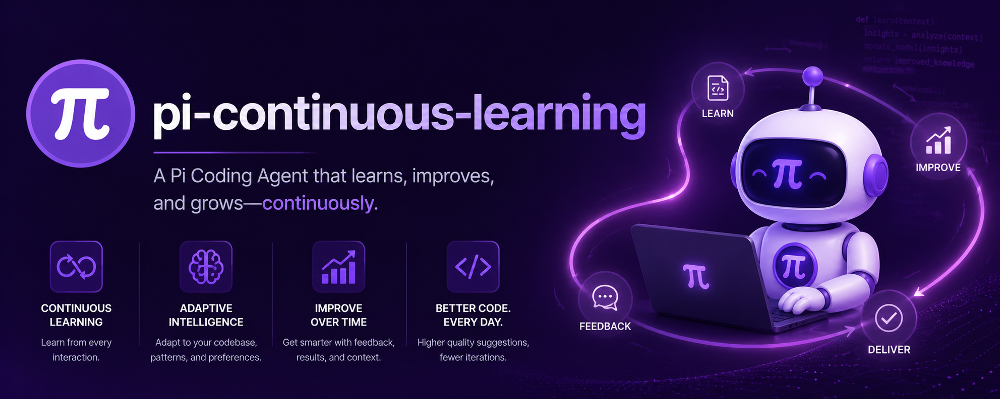
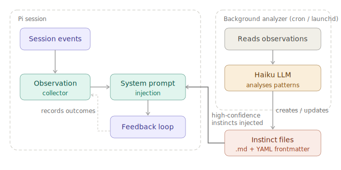

### 截止：Commits on Jul 17, 2026 [fix(pi-continuous-learning): support custom analyzer providers (](https://github.com/MattDevy/pi-extensions/commit/7312fa5278bed468bdbe277df2895b73667b31f4)[#154](https://github.com/MattDevy/pi-extensions/pull/154)[)](https://github.com/MattDevy/pi-extensions/commit/7312fa5278bed468bdbe277df2895b73667b31f4)




# pi-continuous-learning

> A [Pi](https://github.com/nicholasgasior/pi-coding-agent) extension that watches your coding sessions and distils patterns into reusable **instincts** — atomic learned behaviours with confidence scoring, project scoping, and closed-loop feedback validation.

[](https://github.com/MattDevy/pi-continuous-learning/actions/workflows/ci.yml)
[](https://www.npmjs.com/package/pi-continuous-learning)
[](LICENSE)

Inspired by [everything-claude-code/continuous-learning-v2](https://github.com/nicholasb/everything-claude-code), reimplemented as a native Pi extension in TypeScript.

---

## What it does

Pi is smart — but it starts every session with no memory of what worked yesterday. `pi-continuous-learning` fixes that.

The extension silently observes your sessions, identifies recurring patterns, and writes them as **instincts**: small, scoped rules stored on your machine. Before each agent turn, relevant instincts are injected into the system prompt so Pi already knows your conventions, preferred tools, and workflows — without you repeating yourself.

What makes this different from a static AGENTS.md file: **instincts are earned through evidence**. Confidence rises when an instinct proves useful, falls when it contradicts your actual behaviour, and decays passively when it goes stale. Instincts that consistently hold up graduate into permanent AGENTS.md guidelines or skills. Ones that don't get pruned automatically.

```text
Session events → Observations → Analyzer → Instincts
                                              ↓
                              Injected into system prompt
                                              ↓
                              Outcome tracked → confidence updated
                                              ↓
                              Graduate to AGENTS.md / Skill / Command
```

---

## Installation

```bash
pi install npm:pi-continuous-learning
```

This installs the extension globally and makes the `pi-cl-analyze` CLI available on your PATH.

### Requirements

| Requirement | Version |
|---|---|
| [Pi](https://github.com/nicholasgasior/pi-coding-agent) | >= 0.62.0 |
| Node.js | >= 18 |
| LLM provider | configured in Pi (analyzer defaults to Anthropic Haiku; provider/model are configurable) |

---

## How it works



### 1. Observation

Every hook event in your session — tool calls, prompts, errors, corrections, model switches — is appended to a per-project `observations.jsonl` file. Before writing, secrets (API keys, bearer tokens, AWS credentials) are automatically scrubbed. Low-signal events are dropped entirely, cutting context by ~80%.

### 2. Analysis

The background analyzer (`pi-cl-analyze`) processes new observations using the configured provider/model (Anthropic Haiku by default). It applies three tiers of quality filtering:

| Tier | What it captures | How it's stored |
|---|---|---|
| 1 — Project conventions | Patterns specific to a codebase (e.g. "use `Result<T,E>` for errors") | Project-scoped instinct |
| 2 — Workflow patterns | Universal multi-step workflows | Global instinct |
| 3 — Generic agent behaviour | Read-before-edit, clarify-first | **Skipped** |

Generic "good agent hygiene" is deliberately filtered out — instincts should capture *your* patterns, not re-teach Pi things it already knows.

### 3. Injection

Before each agent turn, the injector loads instincts relevant to the current prompt (domain-matched, confidence >= 0.5), sorts by confidence, and appends them to the system prompt within a ~1,000 token budget:

```
## Learned Behaviours (Instincts)
- [0.75] when modifying code files: Always search with grep to find relevant context before editing
- [0.68] when debugging errors: Read stack traces to understand root cause before suggesting fixes

## Project Knowledge
- [0.80] The test database runs on port 3306
- [0.72] Use pnpm build:fast for incremental TypeScript compilation
```

### 4. Feedback loop

Each injected instinct is tracked against the turn's outcome. Successful turns quietly boost confidence; errors and corrections reduce it. This closed loop means instincts are validated by real results, not just frequency.

---

## Features

### Dreaming: holistic instinct consolidation

Run `/instinct-dream` to trigger a full LLM-powered review of your entire instinct corpus. Unlike the incremental analyzer, dreaming looks across *all* your instincts at once to:

- **Merge** semantically similar instincts into a single stronger one
- **Resolve contradictions** — instincts with similar triggers but opposing actions are detected and either merged into a nuanced version or the weaker one is removed
- **Remove stale instincts** — zero confirmations, high inactive counts, or patterns already covered by AGENTS.md
- **Promote project instincts** to global scope when they've proven universal (confidence >= 0.7, 3+ confirmations)
- **Detect skill shadows** — remove instincts made redundant by installed skills
- **Clean up low-quality entries** — vague triggers, confidence < 0.2, removal-flagged

Dreaming is the right tool when your instinct list feels bloated, contradictory, or out of date. It can also run automatically: if `dreaming_enabled` is true and at least 7 days have passed since the last consolidation with 10+ new sessions, a dream pass is triggered at the start of the next analyzer run.

```json
{
  "dreaming_enabled": true,
  "consolidation_interval_days": 7,
  "consolidation_min_sessions": 10
}
```

### Instinct graduation

Instincts are designed to be temporary. Once one has proven itself (age >= 7 days, confidence >= 0.75, confirmed >= 3×, contradicted <= 1×), `/instinct-graduate` promotes it into permanent knowledge:

| Target | When | What happens |
|---|---|---|
| AGENTS.md | Single mature instinct | Appended as a permanent guideline |
| Skill | 3+ related instincts, same domain | Scaffolded into a `SKILL.md` |
| Command | 3+ workflow instincts | Scaffolded into a slash command spec |

After 28 days, ungraduated instincts face TTL enforcement: low-confidence ones are deleted, higher-confidence ones are halved and flagged for removal.

### Confidence scoring

Confidence comes from two sources that work together:

**Discovery** (initial, from observation count):

| Observations | Confidence |
|---|---|
| 1–2 | 0.30 — tentative |
| 3–5 | 0.50 — moderate |
| 6–10 | 0.70 — strong |
| 11+ | 0.85 — very strong |

**Feedback** (ongoing, from real outcomes):

| Event | Change |
|---|---|
| Confirmed (behaviour aligned) | +0.05 (diminishing after 3–6 confirmations) |
| Contradicted (behaviour went against) | −0.15 |
| Inactive (instinct irrelevant) | no change |
| Passive decay | −0.05 per week |

Range: 0.1 min, 0.9 max. Below 0.1 = flagged for removal. Diminishing returns on confirmation prevent trivially-easy-to-confirm instincts from hitting the ceiling unfairly.

### Recurring prompt detection

The analyzer tracks prompts that appear across three or more sessions. When a recurring prompt is detected, its observation batch gets a signal boost, making it a higher priority for pattern extraction. If you keep asking Pi the same kind of question, the system notices — and learns to handle it better proactively.

### Contradiction detection

Before creating or updating instincts, a deterministic (no LLM cost) contradiction check runs across all existing instincts. It looks for similar triggers with opposing actions using verb pairs (`avoid`/`use`, `never`/`always`, `skip`/`ensure`) and negation patterns. Conflicts surface automatically — either in the `/instinct-dream` consolidation pass or during the analyzer's cleanup phase.

### Semantic deduplication

Every write is checked against existing instincts using Jaccard similarity. If any existing instinct scores >= 0.6 similarity, the write is blocked and the LLM is instructed to update the existing one instead. This keeps the corpus clean without human effort.

### Facts / Knowledge Notes

Alongside behavioural instincts, the extension maintains a second memory class: **facts**. A fact is a declarative statement with no trigger or action — just something that is true.

```
Instinct: when modifying API routes → always update the OpenAPI spec
Fact:     The staging environment lives at staging.example.com
```

Facts are **user-driven** — you create them by telling Pi to remember something during a session. Pi then calls the `fact_write` tool directly:

> "Remember that the test database port is 3306"
> "Store the fact that we use pnpm build:fast for incremental TypeScript compilation"

Facts are injected into the system prompt as a separate `## Project Knowledge` block after the instincts block. They participate in the same confidence and decay system as instincts — facts that aren't confirmed decay over time and are eventually pruned. The background analyzer handles this maintenance automatically; it does **not** try to detect or create facts from observations.

---

## Slash commands

| Command | Description |
|---|---|
| `/instinct-status` | Show all instincts grouped by domain with confidence scores, trend arrows (↑↓→), and feedback ratios |
| `/instinct-dream` | Holistic consolidation: merge duplicates, resolve contradictions, remove stale entries |
| `/instinct-evolve` | Incremental LLM-powered analysis: suggests merges, promotions, and cleanup |
| `/instinct-graduate` | Promote mature instincts to AGENTS.md, skills, or commands |
| `/instinct-promote [id]` | Manually promote a project instinct to global scope |
| `/instinct-export [--scope project\|global] [--domain typescript]` | Export instincts to JSON |
| `/instinct-import <path>` | Import instincts from a JSON file |
| `/instinct-projects` | List all tracked projects and their instinct counts |

### LLM tools

The LLM can call these directly during conversation — no slash command needed:

| Tool | Description |
|---|---|
| `instinct_list` | List instincts with optional scope/domain filters |
| `instinct_read` | Read a specific instinct by ID |
| `instinct_write` | Create or update an instinct |
| `instinct_delete` | Remove an instinct by ID |
| `instinct_merge` | Merge multiple instincts into one |
| `fact_list` | List knowledge facts with optional scope/domain filters |
| `fact_read` | Read a specific fact by ID |
| `fact_write` | Create or update a knowledge fact |
| `fact_delete` | Remove a fact by ID |

Ask Pi things like _"show me my instincts"_, _"merge these two"_, or _"remember that the DB port is 3306"_ and it will use these tools directly.

---

## Background analyzer

The analyzer is a standalone CLI that processes all your projects in a single pass and creates/updates instincts using the configured provider/model. It runs outside of Pi sessions so it never causes lag or interference.

### Running manually

```bash
pi-cl-analyze
```

**What it does per run:**

1. Acquires a lockfile — only one instance can run at a time
2. Iterates all projects in `~/.pi/continuous-learning/projects.json`
3. Skips projects with no new observations since the last cursor
4. Skips projects with fewer than 20 observations (configurable)
5. Applies passive confidence decay to all instincts
6. Runs cleanup (expired/contradicted instincts)
7. Scores observation batches by signal strength — low-signal batches are skipped to save cost
8. Calls the configured model to analyse patterns and write instinct files
9. Saves a cursor so only new observations are processed next time

**Safety features:**

| Feature | Detail |
|---|---|
| Lockfile guard | Only one instance runs at a time; subsequent invocations exit immediately |
| Global timeout | Process exits after 5 minutes regardless of progress |
| Stale lock detection | Auto-cleaned after 10 minutes or if the owning process is gone |

### Logging

Structured JSON logs are written to `~/.pi/continuous-learning/analyzer.log`. Each run records timing, token usage, cost, instinct changes, skip reasons, and errors.

```bash
# View recent run summaries
cat ~/.pi/continuous-learning/analyzer.log | jq 'select(.event == "run_complete")'

# Check total cost over time
cat ~/.pi/continuous-learning/analyzer.log | jq 'select(.event == "run_complete") | .total_cost_usd'

# Per-project breakdown
cat ~/.pi/continuous-learning/analyzer.log | jq 'select(.event == "project_complete") | {project: .project_name, duration_s: (.duration_ms/1000), cost: .cost_usd}'
```

The log auto-rotates at 10 MB.

### Scheduling (macOS)

The recommended approach on macOS is `launchd`:

#### 1. Find the binary path

```bash
which pi-cl-analyze
```

#### 2. Create the plist

```bash
cat > ~/Library/LaunchAgents/com.pi-continuous-learning.analyze.plist << EOF
<?xml version="1.0" encoding="UTF-8"?>
<!DOCTYPE plist PUBLIC "-//Apple//DTD PLIST 1.0//EN" "http://www.apple.com/DTDs/PropertyList-1.0.dtd">
<plist version="1.0">
<dict>
    <key>Label</key>
    <string>com.pi-continuous-learning.analyze</string>
    <key>ProgramArguments</key>
    <array>
        <string>$(which pi-cl-analyze)</string>
    </array>
    <key>StartInterval</key>
    <integer>300</integer>
    <key>StandardOutPath</key>
    <string>/tmp/pi-cl-analyze-stdout.log</string>
    <key>StandardErrorPath</key>
    <string>/tmp/pi-cl-analyze-stderr.log</string>
    <key>EnvironmentVariables</key>
    <dict>
        <key>PATH</key>
        <string>$(echo $PATH)</string>
    </dict>
</dict>
</plist>
EOF
```

> **Note:** `$(which pi-cl-analyze)` and `$(echo $PATH)` are evaluated when you run the `cat` command, so the plist contains the resolved absolute paths from your current shell.

#### 3. Load

```bash
launchctl load ~/Library/LaunchAgents/com.pi-continuous-learning.analyze.plist
```

#### 4. Verify

```bash
launchctl list | grep pi-continuous-learning
tail -5 ~/.pi/continuous-learning/analyzer.log | jq .
```

#### Managing the schedule

```bash
# Disable (persists across reboots)
launchctl unload ~/Library/LaunchAgents/com.pi-continuous-learning.analyze.plist

# Re-enable
launchctl load ~/Library/LaunchAgents/com.pi-continuous-learning.analyze.plist

# Remove entirely
rm ~/Library/LaunchAgents/com.pi-continuous-learning.analyze.plist
```

### Scheduling (Linux)

```bash
crontab -e
# Add: runs every 5 minutes
*/5 * * * * pi-cl-analyze 2>> /tmp/pi-cl-analyze-stderr.log
```

---

## Instinct files

Instincts are stored as Markdown files with YAML frontmatter under `~/.pi/continuous-learning/`:

```yaml
---
id: grep-before-edit
title: Grep Before Edit
trigger: "when modifying code files"
confidence: 0.7
domain: "workflow"
source: "personal"
scope: project
project_id: "a1b2c3d4e5f6"
project_name: "my-project"
observation_count: 8
confirmed_count: 5
contradicted_count: 1
inactive_count: 12
---
Always search with grep to find relevant context before editing files.
```

They're plain text — you can read, edit, or delete them directly. The extension will pick up changes on the next injection cycle.

---

## Configuration

All defaults work out of the box. Override at `~/.pi/continuous-learning/config.json`:

```json
{
  "run_interval_minutes": 5,
  "min_observations_to_analyze": 20,
  "min_confidence": 0.5,
  "max_instincts": 20,
  "max_injection_chars": 4000,
  "model": "claude-haiku-4-5",
  "provider": "anthropic",
  "timeout_seconds": 120,
  "active_hours_start": 8,
  "active_hours_end": 23,
  "max_idle_seconds": 1800,
  "dreaming_enabled": true,
  "consolidation_interval_days": 7,
  "consolidation_min_sessions": 10,
  "max_total_instincts_per_project": 100,
  "max_total_instincts_global": 200,
  "max_new_instincts_per_run": 10,
  "max_facts_per_project": 30,
  "max_facts_global": 50,
  "max_new_facts_per_run": 3
}
```

| Field | Default | Description |
|---|---|---|
| `run_interval_minutes` | 5 | How often the analyzer runs (used for decay calculations) |
| `min_observations_to_analyze` | 20 | Minimum observations before analysis triggers |
| `min_confidence` | 0.5 | Instincts below this are not injected into prompts |
| `max_instincts` | 20 | Maximum instincts injected per turn |
| `max_injection_chars` | 4000 | Character budget for the injection block (~1,000 tokens) |
| `model` | `claude-haiku-4-5` | Model for the background analyzer |
| `provider` | `anthropic` | Pi provider for the background analyzer model, including custom providers from `~/.pi/agent/models.json` |
| `timeout_seconds` | 120 | Per-project LLM session timeout |
| `active_hours_start` | 8 | Hour (0–23) at which the active observation window starts |
| `active_hours_end` | 23 | Hour (0–23) at which the active observation window ends |
| `max_idle_seconds` | 1800 | Seconds of inactivity before a session is considered idle |
| `dreaming_enabled` | `true` | Allow automatic consolidation passes |
| `consolidation_interval_days` | 7 | Minimum days between automatic dream passes |
| `consolidation_min_sessions` | 10 | Minimum new sessions before automatic dream triggers |
| `max_total_instincts_per_project` | 100 | Hard cap; oldest low-confidence instincts are pruned first |
| `max_total_instincts_global` | 200 | Hard cap for global instincts |
| `max_new_instincts_per_run` | 10 | Rate limit on instinct creation per analyzer run |
| `max_facts_per_project` | 30 | Hard cap on facts per project; lowest-confidence pruned first |
| `max_facts_global` | 50 | Hard cap on global facts |
| `max_new_facts_per_run` | 3 | Rate limit on fact creation per analyzer run |
| `log_path` | `~/.pi/continuous-learning/analyzer.log` | Analyzer log file path |

---

## Storage

All data stays local on your machine:

```text
~/.pi/continuous-learning/
  config.json                   # Optional overrides
  projects.json                 # Project registry
  analyze.lock                  # Present only while analyzer runs
  analyzer.log                  # Structured JSON event log
  instincts/personal/           # Global instincts
  facts/personal/               # Global facts
  projects/<hash>/
    project.json                # Project metadata + analysis cursor
    observations.jsonl          # Current observations
    observations.archive/       # Archived (auto-purged after 30 days)
    instincts/personal/         # Project-scoped instincts
    facts/personal/             # Project-scoped facts
```

---

## Privacy & security

- **All local** — no external telemetry, no cloud sync
- **Secret scrubbing** — API keys, bearer tokens, AWS credentials, and passwords are redacted from observations before writing to disk
- **Export-only for observations** — only instinct patterns can be exported, never raw session data
- **Path traversal prevention** — instinct IDs are validated to prevent `../` attacks
- **No additional credentials** — the analyzer uses your existing Pi LLM credentials

---

## Updating

```bash
pi install npm:pi-continuous-learning
```

Your observations, instincts, and configuration in `~/.pi/continuous-learning/` are preserved across updates. If you have a launchd schedule set up, no changes are needed.

---

## Development

```bash
npm install
npm test          # run tests
npm run check     # tests + lint + typecheck (mirrors CI)
npm run build     # compile to dist/
```

See [CONTRIBUTING.md](CONTRIBUTING.md) for full development guidelines.

---

## Contributing

Contributions are welcome! See [CONTRIBUTING.md](CONTRIBUTING.md) for development setup, commit conventions, and PR guidelines.

Please note that this project has a [Code of Conduct](CODE_OF_CONDUCT.md). By participating you agree to abide by its terms.

---

## License

MIT
