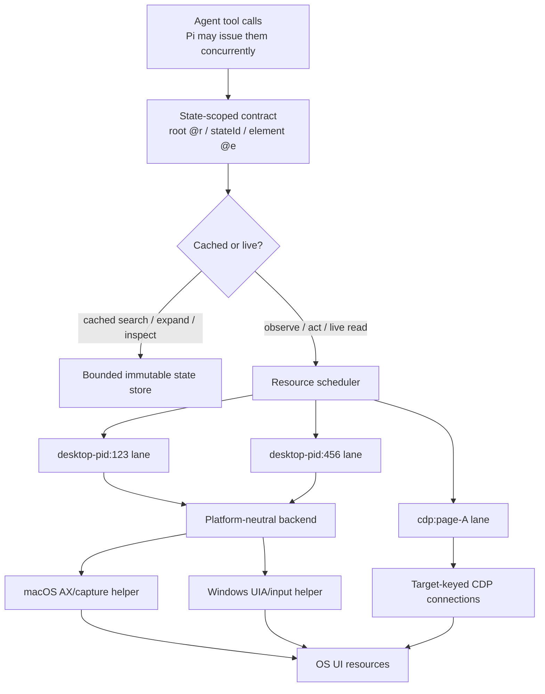

# Architecture

`pi-computer-use` exposes one state-scoped interface for desktop and browser UI:

```text
find roots → observe one root → search/expand/inspect its state → act from that state
```

The agent still sees a multi-root forest. `find_roots` returns stable root refs (`@rN`) for desktop windows, transient surfaces, and CDP pages. Observing one root produces an immutable element tree whose refs (`@eN`) belong only to that returned `stateId`. Progressive disclosure is unchanged: the first outline is folded, while `search_ui`, `expand_ui`, and `inspect_ui` query the full stored tree.

## Runtime model

Every live request follows one path:

```text
load saved state → prepare actions → run → observe → save → show changes
```

The implementation keeps that ownership explicit:

| Module | Owns |
|---|---|
| `state.ts` | Saved UI states, request-local state, restoration, and serialization |
| `actions.ts` | Validation, normalization, target resolution, dependent focus, and safe retry eligibility |
| `bridge.ts` | Tool coordination and resource scheduling |
| `view.ts` | Stable public refs and full-versus-changes rendering |
| `outline.ts` | Parsing and querying complete UI trees |
| `platform/*` | OS observation, input mechanics, and native protocol translation |



There is no session-wide current UI. Every call hydrates request-local state from `stateId`; unrelated calls cannot overwrite one another. Stored observations are immutable and bounded, so old refs either resolve to their exact observation or fail clearly after eviction.

The scheduler serializes live operations only when they address the same physical resource. Different desktop processes and different CDP targets can run concurrently. Cached outline queries bypass it entirely. Every resource has a monotonically increasing epoch. A mutating call must present the epoch captured by its state; if another write won the race, the stale call is rejected before dispatch.

Desktop scheduling is conservatively keyed by process rather than window because accessibility focus, menus, and physical input can cross window boundaries inside an app. CDP scheduling is keyed by page target. Global physical input remains mutex-protected in the native helper; semantic AX/UIA work can overlap where the platform permits it.

## Observation and progressive disclosure

`observe_ui` asks the selected backend for one look. A desktop look combines root identity, accessibility structure, optional image evidence, OCR boxes when required, and capture metadata. A browser look converts the CDP accessibility tree into the same serialized outline shape.

The bridge stores the complete observation and returns a folded rendering. The state owns its refs:

```text
@r3 browser page
  state A (epoch 4)
    @e1 document
    @e7 button

@r8 desktop window
  state B (epoch 2)
    @e1 application
    @e12 text field
```

`search_ui` and ordinary inspection are pure cached queries. A live escalation such as OCR or a refreshed truncated region is epoch-checked and resource-scheduled. It cannot silently graft data across a concurrent mutation.

## Acting and batching

`act_ui` runs one dependent action list:

```ts
act_ui({
  stateId,
  actions: [
    { action: "setText", ref: "@e12", text: "hello" },
    { action: "press", ref: "@e18" },
  ],
})
```

Transactions may include a semantic postcondition:

```ts
act_ui({
  stateId,
  actions: [{ action: "press", ref: "@e9" }],
  expect: { text: "Saved", timeoutMs: 3000 }
})
```

With a postcondition, the backend waits for the requested text or role to
appear (or disappear with `gone: true`) before reporting success. It records
whether the condition was newly verified, already present before delivery, or
failed. A failed postcondition changes the execution outcome to `didnt`; event
delivery alone is never treated as semantic success.

One action is represented by an array of length one. A multi-action transaction is appropriate only when no intermediate observation is needed. The runtime validates one base state, acquires one resource lane, and sends the steps as one native helper transaction. The helper captures one pre-transaction root baseline, executes and verifies steps in order, and stops on the first failed or invalidated step. Partial results include `stoppedAt`, so callers know the exact checked boundary and must re-observe before continuing. The helper performs one final root-delta settle and the bridge produces one final observation. There is no alternate sequential protocol. This is not a mechanism for parallel actions within one UI resource.

The bridge resolves model intent; the backend/helper owns grounding, preflight, delivery, and evidence. Accessibility capabilities choose an initial strategy but are not treated as proof that the intended result occurred. Editable-region clicks establish foreground focus for following unscoped keyboard steps in the same transaction. Raw coordinates are tied to the image-bearing state that produced them. Web-backed editable controls use atomic keyboard events and web-backed buttons use pointer events so application state receives normal input events rather than only a changed AX value. A helper result reports `worked`, `didnt`, or `unknown`, including evidence and shallow root changes where available.

With `headless: true`, the background boundary is strict: Pi must never activate or raise an application, change the user's focused window, move the global cursor, post raw input, or display the agent cursor. With `headless: false` (the default), credible semantic activation may begin in the background, editable clicks preserve the focus they establish for following unscoped keyboard input, and keyboard input with a checked `didnt` result may retry in the foreground because the first attempt proved side-effect-free. Focus-preserving native keyboard requests must not raise or re-focus the window between semantic activation and HID delivery; canvas editors such as PowerPoint otherwise collapse an inner text editor back to placeholder selection. Ambiguous pointer outcomes are never replayed. With `cursor_overlay: true`, non-headless macOS background pointer actions enqueue a click-through agent cursor animation to the native grounded point without delaying delivery; foreground HID actions use only the physical cursor.

The agent-facing `act_ui.headless` flag determines whether foreground execution is prohibited. Fallback-capable multi-action calls execute one checked action at a time, retain click-established focus, and stop on a checked `didnt`; strict-headless calls retain native transactional batching.

## Successor diffs

Complete observations remain immutable and bounded internally. The initial observation renders a folded full view. After a mutation, `view.ts` stabilizes public refs using confident native identities, saves the complete resulting state, and compares it with the base state. Small trustworthy results render `added`, `updated`, and `removed` nodes plus the next `stateId`. Root appearance, closure, and focus changes remain part of the run result.

Diff rendering falls back to a full folded view when the root identity changes, too few successor nodes can be matched confidently, or the change budget would make a patch less useful than the full view. Cached queries always operate on the complete stored state, never on a partially applied model-side tree.

## Browser support

Browser pages are roots, not a second agent-facing context hierarchy. `launch_browser` returns browser-page `@r` refs; `observe_ui` returns their normal outline and `stateId`. `read_text`, `wait_for`, `act_ui`, `navigate_browser`, and `evaluate_browser` derive the CDP target from that state. Internal CDP target identifiers never need to be copied between public tools.

## Native transports

The macOS socket server and Windows line protocol accept multiple in-flight requests and correlate responses by request id. macOS protects shared AX ref/look stores and the root-event sequence; Windows uses a fixed worker pool and initializes UIA per worker thread. Both platforms keep eight immutable native look records and serialize global physical input. Target focus, bounded occlusion preflight, and HID delivery share that same critical section; another worker cannot change the foreground between validation and delivery. UIA-only Windows batches do not acquire the global physical-input lock, while any batch that may fall back to pointer or keyboard delivery holds it for the complete transaction.

Windows UIA extraction is bounded. When the native limit omits descendants, the nearest retained ancestors are marked `truncated`; `expand_ui` performs a scoped look and the helper carries forward the untouched refs into the new immutable look record. Windows root deltas combine an event journal with authoritative before/after snapshots. `SetWinEventHook` accelerates settling and retains short-lived root transitions, while snapshots remain the source of truth for persistent state.

## Preventing platform drift

Platform parity is defined by invariants, not matching source structure. Every helper reports an `architectureVersion` and the invariant set it implements. Startup fails closed if either helper omits a required invariant. The TypeScript backend interface and conformance check additionally require both platforms to expose the same observation, text ownership, batching, and lifecycle operations.

Changes to a native backend should therefore include three layers of evidence:

1. shared contract tests for request and response semantics;
2. target-native compilation and deterministic native unit tests;
3. the same black-box Cubench properties on an interactive host for that platform.

OS-specific mechanisms can differ—AX, ScreenCaptureKit, and the AppKit agent-cursor overlay on macOS; UIA and Windows capture/input APIs on Windows—but state ownership, bounds, progressive disclosure, transaction boundaries, and honest outcomes may not. The overlay lives inside the existing helper because native action grounding owns the final screen point; keeping it there avoids a second coordinate transform or public cursor tool surface. The helper's socket server runs off the main thread while AppKit owns the main run loop, and the helper excludes its click-through overlay from root discovery. Cursor animation is observational: newer actions may supersede an in-flight path, but rendering never blocks action delivery or verification.

## Design constraints

- Preserve the multi-root forest and progressive disclosure.
- Make state ownership explicit; never depend on a mutable session-wide current UI.
- Reject stale writes before dispatch using resource epochs.
- Serialize by physical resource, not by tool name or whole session.
- Prefer platform semantics as the cheapest credible attempt, then trust verified outcomes over advertised capabilities.
- Preserve focus established by one transaction step for dependent keyboard steps.
- Store full immutable states and render the smallest trustworthy resulting view.
- Keep observation compact and expand locally.
- Let the backend/helper own action grounding and verification.
- Keep platform mechanisms behind the platform-neutral seam.
- Treat batching as one-resource transaction amortization, not a separate execution architecture.
- Fail closed when an action outcome is uncertain; a later call must observe again.
