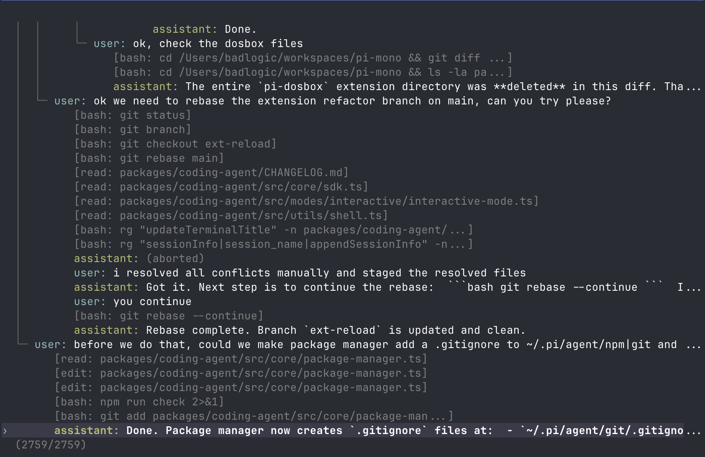

<p align="center">
  <a href="https://pi.dev">
    
  </a>
</p>
<p align="center">
  <a href="https://discord.com/invite/3cU7Bz4UPx"></a>
  <a href="https://www.npmjs.com/package/@earendil-works/pi-coding-agent"></a>
</p>

> 新的 Issue 和 PR 默认会被机器人自动关闭。维护者会每天审查自动关闭的 Issue。参见 [CONTRIBUTING.md](../../CONTRIBUTING.md)。

---

Pi 是一个极简的终端编码工具。让 Pi 适应你的工作流，而不是反过来，并且无需 fork 和修改 Pi 内部代码。通过 TypeScript [扩展](#扩展)、[技能](#技能)、[提示词模板](#提示词模板)和[主题](#主题)来扩展它。将你的扩展、技能、提示词模板和主题放入 [Pi 包](#pi-包)中，通过 npm 或 git 与他人分享。

Pi 自带强大的默认功能，但省略了子代理和计划模式等特性。相反，你可以让 pi 构建你想要的任何功能，或安装符合你工作流程的第三方 pi 包。

Pi 运行在四种模式下：交互模式、打印/JSON 模式、用于进程集成的 RPC 模式，以及用于嵌入到自有应用中的 SDK 模式。查看 [openclaw/openclaw](https://github.com/openclaw/openclaw) 了解实际的 SDK 集成案例。

## 分享你的开源编码代理会话

如果你使用 pi 进行开源工作，请分享你的编码代理会话。

公开的开源会话数据有助于使用真实的开发工作流来改进模型、提示词、工具和评估。

完整说明请参见 [这篇 X 上的文章](https://x.com/badlogicgames/status/2037811643774652911)。

要发布会话，请使用 [`badlogic/pi-share-hf`](https://github.com/badlogic/pi-share-hf)。阅读其 README.md 了解设置说明。你只需要一个 Hugging Face 账号、Hugging Face CLI 和 `pi-share-hf`。

你也可以观看[这个视频](https://x.com/badlogicgames/status/2041151967695634619)，了解我如何发布我的 `pi-mono` 会话。

我会定期在此发布我的 `pi-mono` 工作会话：

- [badlogicgames/pi-mono on Hugging Face](https://huggingface.co/datasets/badlogicgames/pi-mono)

## 目录

- [快速开始](#快速开始)
- [提供商与模型](#提供商与模型)
- [交互模式](#交互模式)
  - [编辑器](#编辑器)
  - [命令](#命令)
  - [键盘快捷键](#键盘快捷键)
  - [消息队列](#消息队列)
- [会话](#会话)
  - [分支](#分支)
  - [压缩](#压缩)
- [设置](#设置)
- [上下文文件](#上下文文件)
- [自定义](#自定义)
  - [提示词模板](#提示词模板)
  - [技能](#技能)
  - [扩展](#扩展)
  - [主题](#主题)
  - [Pi 包](#pi-包)
- [编程使用](#编程使用)
- [理念](#理念)
- [CLI 参考](#cli-参考)

---

## 快速开始

```bash
npm install -g --ignore-scripts @earendil-works/pi-coding-agent
```

`--ignore-scripts` 在安装过程中禁用依赖生命周期脚本。Pi 在正常 npm 安装中不需要安装脚本。

安装脚本替代方案：

```bash
curl -fsSL https://pi.dev/install.sh | sh
```

使用 API 密钥进行身份验证：

```bash
export ANTHROPIC_API_KEY=sk-ant-...
pi
```

或者使用你现有的订阅：

```bash
pi
/login  # 然后选择提供商
```

然后直接与 pi 对话。默认情况下，pi 为模型提供四个工具：`read`、`write`、`edit` 和 `bash`。模型使用这些工具来满足你的请求。通过[技能](#技能)、[提示词模板](#提示词模板)、[扩展](#扩展)或 [pi 包](#pi-包)添加更多能力。

**平台说明：** [Windows](docs/windows.md) | [Termux (Android)](docs/termux.md) | [tmux](docs/tmux.md) | [终端设置](docs/terminal-setup.md) | [Shell 别名](docs/shell-aliases.md)

---

## 提供商与模型

对于每个内置提供商，pi 维护一份支持工具的模型列表，并在每次发布时更新。通过订阅（`/login`）或 API 密钥进行身份验证，然后通过 `/model`（或 Ctrl+L）选择该提供商的任何模型。

**订阅：**
- Anthropic Claude Pro/Max
- OpenAI ChatGPT Plus/Pro (Codex)
- GitHub Copilot

**API 密钥：**
- Anthropic
- Ant Ling
- OpenAI
- Azure OpenAI
- DeepSeek
- NVIDIA NIM
- Google Gemini
- Google Vertex
- Amazon Bedrock
- Mistral
- Groq
- Cerebras
- Cloudflare AI Gateway
- Cloudflare Workers AI
- xAI
- OpenRouter
- Vercel AI Gateway
- ZAI 编程计划（全球）
- ZAI 编程计划（中国）
- OpenCode Zen
- OpenCode Go
- Hugging Face
- Fireworks
- Together AI
- Kimi 编程版
- MiniMax
- 小米 MiMo
- 小米 MiMo 令牌计划（中国）
- 小米 MiMo 令牌计划（阿姆斯特丹）
- 小米 MiMo 令牌计划（新加坡）

详细的设置说明请参见 [docs/providers.md](docs/providers.md)。

**自定义提供商与模型：** 如果提供商使用受支持的 API（OpenAI、Anthropic、Google），可通过 `~/.pi/agent/models.json` 添加。对于自定义 API 或 OAuth，请使用扩展。请参见 [docs/models.md](docs/models.md) 和 [docs/custom-provider.md](docs/custom-provider.md)。

---

## 交互模式

<p align="center"></p>

界面从上到下依次是：

- **启动头部** - 显示快捷键（`/hotkeys` 查看全部）、已加载的 AGENTS.md 文件、提示词模板、技能和扩展
- **消息区域** - 你的消息、助手的回复、工具调用及结果、通知、错误和扩展 UI
- **编辑器** - 你输入的区域；边框颜色表示思考级别
- **底部栏** - 工作目录、会话名称、总 token/缓存使用量（`↑` 输入，`↓` 输出，`R` 缓存读取，`W` 缓存写入，`CH` 最新缓存命中率）、费用、上下文使用量、当前模型

编辑器可以临时被其他 UI 替换，如内置的 `/settings` 或扩展的自定义 UI（例如，一个问答工具，让用户以结构化格式回答模型的问题）。[扩展](#扩展)还可以替换编辑器、添加上方/下方小部件、状态行、自定义底部栏或覆盖层。

### 编辑器

| 功能 | 操作方式 |
|---------|-----|
| 文件引用 | 输入 `@` 进行模糊搜索项目文件 |
| 路径补全 | Tab 键补全路径 |
| 多行输入 | Shift+Enter（Windows Terminal 上为 Ctrl+Enter） |
| 外部编辑器 | Ctrl+G 打开 `externalEditor`、`$VISUAL`、`$EDITOR`（Windows 上为记事本，其他系统为 `nano`） |
| 剪贴板 | Ctrl+V 粘贴图片或文字（Windows 上为 Alt+V），或将图片拖拽到终端上 |
| Bash 命令 | `!command` 执行并将输出发送给 LLM，`!!command` 执行但不发送 |

标准编辑快捷键（删除单词、撤销等）。详见 [docs/keybindings.md](docs/keybindings.md)。

### 命令

在编辑器中输入 `/` 触发命令。[扩展](#扩展)可以注册自定义命令，[技能](#技能)可通过 `/skill:name` 使用，[提示词模板](#提示词模板)可通过 `/templatename` 展开。

| 命令 | 描述 |
|---------|-------------|
| `/login`, `/logout` | OAuth 身份认证 |
| `/model` | 切换模型 |
| `/scoped-models` | 启用/禁用用于 Ctrl+P 循环的模型 |
| `/settings` | 思考级别、主题、消息投递方式、传输方式 |
| `/resume` | 从之前的会话中选择恢复 |
| `/new` | 开始新会话 |
| `/name <name>` | 设置会话显示名称 |
| `/session` | 显示会话信息（文件、ID、消息、token、费用） |
| `/tree` | 跳转到会话中的任意节点并从那里继续 |
| `/trust` | 保存项目信任决定以供将来会话使用（需要重启） |
| `/fork` | 从之前的用户消息创建新会话 |
| `/clone` | 将当前活动分支复制到新会话中 |
| `/compact [prompt]` | 手动压缩上下文，可附带自定义指令 |
| `/copy` | 将最后一条助手消息复制到剪贴板 |
| `/export [file]` | 将会话导出为 HTML 或 JSONL 文件 |
| `/import <file>` | 从 JSONL 文件导入并恢复会话 |
| `/share` | 以私有 GitHub Gist 上传并提供可分享的 HTML 链接 |
| `/reload` | 重新加载快捷键绑定、扩展、技能、提示词、主题和上下文文件 |
| `/hotkeys` | 显示所有键盘快捷键 |
| `/changelog` | 显示版本历史 |
| `/quit` | 退出 pi |

### 键盘快捷键

查看 `/hotkeys` 获取完整列表。可通过 `~/.pi/agent/keybindings.json` 自定义。详见 [docs/keybindings.md](docs/keybindings.md)。

**常用快捷键：**

| 键位 | 操作 |
|-----|--------|
| Ctrl+C | 清空编辑器 |
| Ctrl+C 两次 | 退出 |
| Escape | 取消/中止 |
| Escape 两次 | 打开 `/tree` |
| Ctrl+L | 打开模型选择器 |
| Ctrl+P / Shift+Ctrl+P | 向前/向后循环限定模型 |
| Shift+Tab | 循环切换思考级别 |
| Ctrl+O | 折叠/展开工具输出 |
| Ctrl+T | 折叠/展开思考块 |
| Ctrl+X | 复制最后一条助手消息 |

### 消息队列

在代理工作时提交消息：

- **Enter** 将消息加入*引导 (steering)* 队列，在当前助手回合完成工具调用后投递
- **Alt+Enter** 将消息加入*跟进 (follow-up)* 队列，仅在代理完成所有工作后投递
- **Escape** 中止并恢复队列中的消息到编辑器
- **Alt+Up** 取回队列中的消息到编辑器

在 Windows Terminal 上，`Alt+Enter` 默认为全屏快捷键。请在 [docs/terminal-setup.md](docs/terminal-setup.md) 中重新映射，以便 pi 能接收跟进消息快捷键。

在[设置](docs/settings.md)中配置投递方式：`steeringMode` 和 `followUpMode` 可以是 `"one-at-a-time"`（默认，等待回复）或 `"all"`（一次性投递所有队列消息）。`transport` 为支持多种传输方式的提供商选择传输偏好（`"sse"`、`"websocket"` 或 `"auto"`）。

---

## 会话

会话以 JSONL 文件格式存储，具有树形结构。每条记录都有一个 `id` 和 `parentId`，支持原地分支而无需创建新文件。文件格式详见 [docs/session-format.md](docs/session-format.md)。

### 管理

会话自动保存到 `~/.pi/agent/sessions/`，按工作目录组织。

```bash
pi -c                  # 继续最近的会话
pi -r                  # 浏览并从过去的会话中选择
pi --no-session        # 临时模式（不保存）
pi --name "my task"    # 启动时设置会话显示名称
pi --session <path|id> # 使用特定的会话文件或 ID
pi --fork <path|id>    # 将指定会话文件或 ID 分支到新会话
```

在交互模式下使用 `/session` 查看当前会话 ID，然后可以用 `--session <id>` 或 `--fork <id>` 重用该 ID。

### 分支

**`/tree`** - 原地浏览会话树。选择任意之前的节点，从那里继续，并在分支之间切换。所有历史记录保存在单个文件中。

<p align="center"></p>

- 输入文字搜索，使用 Ctrl+←/Ctrl+→ 或 Alt+←/Alt+→ 折叠/展开和在分支间跳转，使用 ←/→ 翻页
- 过滤模式（Ctrl+O）：默认 → 无工具 → 仅用户消息 → 仅标记 → 全部
- 按 Ctrl+X 复制选中的消息
- 按 Shift+L 标记条目为书签，按 Shift+T 切换标记时间戳

**`/fork`** - 从活动分支上的某条用户消息创建新的会话文件。打开选择器，复制到该节点为止的活跃路径，并将选中的提示词放入编辑器以供修改。

**`/clone`** - 将当前活动分支复制到当前位置的新会话文件中。新会话保留完整的活跃路径历史，并打开一个空编辑器。

**`--fork <path|id>`** - 直接从 CLI 分支已有的会话文件或部分会话 UUID。这会将完整的源会话复制到当前项目的新会话文件中。

### 压缩

长时间运行的会话可能会耗尽上下文窗口。压缩会总结较旧的消息，同时保留较新的消息。

**手动：** `/compact` 或 `/compact <自定义指令>`

**自动：** 默认启用。在上下文溢出时触发（自动恢复并重试），或在接近限制时主动触发。可通过 `/settings` 或 `settings.json` 配置。

压缩是有损的。完整历史记录仍保存在 JSONL 文件中；使用 `/tree` 重新查看。可通过[扩展](#扩展)自定义压缩行为。内部机制详见 [docs/compaction.md](docs/compaction.md)。

---

## 设置

使用 `/settings` 修改常用选项，或直接编辑 JSON 文件：

| 位置 | 范围 |
|----------|-------|
| `~/.pi/agent/settings.json` | 全局（所有项目） |
| `.pi/settings.json` | 项目（覆盖全局设置） |

所有选项详见 [docs/settings.md](docs/settings.md)。

### 项目信任

在交互模式启动时，如果项目文件夹包含项目本地设置、资源或项目 `.agents/skills`，且该文件夹或其父文件夹在 `~/.pi/agent/trust.json` 中没有已保存的决定，pi 会询问是否信任该项目。信任项目后，pi 将加载 `.pi/settings.json` 和 `.pi` 资源、安装缺失的项目包，以及执行项目扩展。

在信任决定之前，pi 仅加载上下文文件、用户/全局扩展和 CLI `-e` 扩展，以便它们可以处理 `project_trust` 事件。项目本地扩展、项目包管理的扩展和项目设置仅在项目被信任后加载。当切换到来自不同工作目录且信任状态尚未在当前进程中确定的会话时，也适用此拆分。

非交互模式（`-p`、`--mode json` 和 `--mode rpc`）不会显示信任提示。如果没有适用的已保存信任决定，则使用全局设置中的 `defaultProjectTrust`：`ask`（默认）和 `never` 忽略那些项目资源，`always` 则信任它们。传递 `--approve`/`-a` 或 `--no-approve`/`-na` 可覆盖单次运行的项目信任。

如果没有适用的扩展或已保存的决定，`defaultProjectTrust` 控制回退行为。在 `~/.pi/agent/settings.json` 中将其设置为 `"ask"`、`"always"` 或 `"never"`，或通过 `/settings` 更改。

`pi config` 和包命令使用相同的项目信任流程，但 `pi update` 从不提示。传递 `--approve` 以信任单次命令的项目本地设置，或 `--no-approve` 忽略它们。

在交互模式下使用 `/trust` 为将来（包括直接父文件夹）的会话保存项目信任决定。它只写入 `~/.pi/agent/trust.json`；当前会话不会重新加载，因此请重启 pi 以使更改生效。

### 遥测与更新检查

Pi 有两个独立的启动功能：

- **更新检查：** 获取 `https://pi.dev/api/latest-version` 以检查是否有较新的 Pi 版本。通过 `PI_SKIP_VERSION_CHECK=1` 禁用。禁用更新检查只会关闭此检查。
- **安装/更新遥测：** 首次安装或通过更新日志检测到更新后，向 `https://pi.dev/api/report-install` 发送匿名版本 ping。此设置还控制 OpenRouter、Cloudflare 和直接 NVIDIA NIM 请求的可选提供商归属头信息。通过在 `settings.json` 中将 `enableInstallTelemetry` 设置为 `false`，或设置 `PI_TELEMETRY=0` 来退出。这不会禁用更新检查；除非禁用更新检查或启用离线模式，Pi 仍可能联系 `pi.dev` 获取最新版本。

使用 `--offline` 或 `PI_OFFLINE=1` 禁用此处描述的所有启动网络操作，包括更新检查、包更新检查和安装/更新遥测。

---

## 上下文文件

Pi 在启动时加载 `AGENTS.md`（或 `CLAUDE.md`）：
- `~/.pi/agent/AGENTS.md`（全局）
- 父目录（从当前工作目录向上遍历）
- 当前目录

用于项目说明（`AGENTS.md`/`CLAUDE.md`）、约定、常用命令。所有匹配的文件会被拼接在一起。

使用 `--no-context-files`（或 `-nc`）禁用上下文文件加载。

### 系统提示词

使用 `.pi/SYSTEM.md`（项目）或 `~/.pi/agent/SYSTEM.md`（全局）替换默认系统提示词。通过 `APPEND_SYSTEM.md` 追加内容而不替换。

---

## 自定义

### 提示词模板

可复用的提示词，以 Markdown 文件形式存在。输入 `/name` 展开。

```markdown
<!-- ~/.pi/agent/prompts/review.md -->
Review this code for bugs, security issues, and performance problems.
Focus on: {{focus}}
```

放置在 `~/.pi/agent/prompts/`、`.pi/prompts/` 或 [pi 包](#pi-包)中与他人分享。详见 [docs/prompt-templates.md](docs/prompt-templates.md)。

### 技能

按需加载的能力包，遵循 [Agent Skills 标准](https://agentskills.io)。通过 `/skill:name` 调用，或让代理自动加载它们。

```markdown
<!-- ~/.pi/agent/skills/my-skill/SKILL.md -->
# My Skill
Use this skill when the user asks about X.

## Steps
1. Do this
2. Then that
```

放置在 `~/.pi/agent/skills/`、`~/.agents/skills/`、`.pi/skills/` 或 `.agents/skills/`（从当前工作目录向上遍历父目录），或 [pi 包](#pi-包) 中与他人分享。详见 [docs/skills.md](docs/skills.md)。

### 扩展

<p align="center"></p>

TypeScript 模块，通过自定义工具、命令、键盘快捷键、事件处理和 UI 组件来扩展 pi。

```typescript
export default function (pi: ExtensionAPI) {
  pi.registerTool({ name: "deploy", ... });
  pi.registerCommand("stats", { ... });
  pi.on("tool_call", async (event, ctx) => { ... });
}
```

默认导出也可以是 `async` 的。Pi 会等待异步扩展工厂完成后再继续启动，这对于一次性初始化（如在调用 `pi.registerProvider()` 之前获取远程模型列表）很有用。

**可以做什么：**
- 自定义工具（或完全替换内置工具）
- 子代理和计划模式
- 自定义压缩和总结
- 权限控制和路径保护
- 自定义编辑器和 UI 组件
- 状态行、头部、底部栏
- Git 检查点和自动提交
- SSH 和沙箱执行
- MCP 服务器集成
- 让 pi 看起来像 Claude Code
- 等待时的游戏（是的，可以运行 Doom）
- ...你能想到的任何东西

放置在 `~/.pi/agent/extensions/`、`.pi/extensions/` 或 [pi 包](#pi-包)中与他人分享。详见 [docs/extensions.md](docs/extensions.md) 和 [examples/extensions/](examples/extensions/)。

### 主题

内置主题：`dark`、`light`。主题支持热重载：修改活动主题文件后，pi 会立即应用更改。

放置在 `~/.pi/agent/themes/`、`.pi/themes/` 或 [pi 包](#pi-包)中与他人分享。详见 [docs/themes.md](docs/themes.md)。

### Pi 包

通过 npm 或 git 打包和分享扩展、技能、提示词和主题。在 [npmjs.com](https://www.npmjs.com/search?q=keywords%3Api-package) 或 [Discord](https://discord.com/channels/1456806362351669492/1457744485428629628) 上查找包。

> **安全：** Pi 包拥有完整的系统访问权限。扩展会执行任意代码，技能可以指示模型执行任何操作，包括运行可执行文件。在安装第三方包之前，请审查源代码。

```bash
pi install npm:@foo/pi-tools
pi install npm:@foo/pi-tools@1.2.3      # 指定版本
pi install git:github.com/user/repo
pi install git:github.com/user/repo@v1  # 标签或提交
pi install git:git@github.com:user/repo
pi install git:git@github.com:user/repo@v1  # 标签或提交
pi install https://github.com/user/repo
pi install https://github.com/user/repo@v1      # 标签或提交
pi install ssh://git@github.com/user/repo
pi install ssh://git@github.com/user/repo@v1    # 标签或提交
pi remove npm:@foo/pi-tools
pi uninstall npm:@foo/pi-tools          # remove 的别名
pi list
pi update                               # 仅更新 pi
pi update --all                         # 更新 pi 和包
pi update --extensions                  # 仅更新包
pi update --self                        # 仅更新 pi
pi update --self --force                # 即使是最新版本也重新安装 pi
pi update npm:@foo/pi-tools             # 更新单个包
pi config                               # 启用/禁用扩展、技能、提示词、主题
```

包安装到 `~/.pi/agent/git/`（git）或 `~/.pi/agent/npm/`（npm）。使用 `-l` 进行项目本地安装（`.pi/git/`、`.pi/npm/`）。Git `@ref` 值是指定的标签或提交；固定版本的包会被 `pi update --extensions` 和 `pi update --all` 跳过，因此请使用 `pi install git:host/user/repo@new-ref` 将已有包移动到新的引用。Git 包默认使用 `npm install --omit=dev` 安装依赖，因此运行时依赖必须列在 `dependencies` 下；当配置了 `npmCommand` 时，git 包使用普通的 `install` 以兼容包装器。如果你使用 Node 版本管理器并希望包安装重用稳定的 npm 上下文，请在 `settings.json` 中设置 `npmCommand`，例如 `["mise", "exec", "node@20", "--", "npm"]`。

创建包：在 `package.json` 中添加 `pi` 键：

```json
{
  "name": "my-pi-package",
  "keywords": ["pi-package"],
  "pi": {
    "extensions": ["./extensions"],
    "skills": ["./skills"],
    "prompts": ["./prompts"],
    "themes": ["./themes"]
  }
}
```

如果没有 `pi` 清单，pi 会从常规目录（`extensions/`、`skills/`、`prompts/`、`themes/`）自动发现内容。

详见 [docs/packages.md](docs/packages.md)。

---

## 编程使用

### SDK

```typescript
import { AuthStorage, createAgentSession, ModelRegistry, SessionManager } from "@earendil-works/pi-coding-agent";

const authStorage = AuthStorage.create();
const modelRegistry = ModelRegistry.create(authStorage);
const { session } = await createAgentSession({
  sessionManager: SessionManager.inMemory(),
  authStorage,
  modelRegistry,
});

await session.prompt("当前目录中有哪些文件？");
```

对于高级的多会话运行时替换，请使用 `createAgentSessionRuntime()` 和 `AgentSessionRuntime`。

详见 [docs/sdk.md](docs/sdk.md) 和 [examples/sdk/](examples/sdk/)。

### RPC 模式

对于非 Node.js 集成，使用基于 stdin/stdout 的 RPC 模式：

```bash
pi --mode rpc
```

RPC 模式使用严格的 LF 分隔的 JSONL 帧格式。客户端必须仅以 `\n` 分割记录。不要使用通用的行读取器（如 Node 的 `readline`），因为它们在 JSON 载荷内部也会分割 Unicode 分隔符。

协议详见 [docs/rpc.md](docs/rpc.md)。

---

## 理念

Pi 具有极强的可扩展性，因此不必规定你的工作流程。其他工具内置的功能可以通过[扩展](#扩展)、[技能](#技能)来构建，或从第三方 [pi 包](#pi-包)安装。这保持了核心的简洁性，同时让你根据自己的工作方式塑造 pi。

**没有 MCP。** 构建带 README 的 CLI 工具（参见[技能](#技能)），或构建一个添加 MCP 支持的扩展。[为什么？](https://mariozechner.at/posts/2025-11-02-what-if-you-dont-need-mcp/)

**没有子代理。** 有很多方法可以实现这一点。通过 tmux 生成 pi 实例，或使用[扩展](#扩展)自行构建，或安装一个符合你方式的包。

**没有权限弹窗。** 在容器中运行，或使用[扩展](#扩展)根据你的环境和安全需求构建自己的确认流程。

**没有计划模式。** 将计划写入文件，或使用[扩展](#扩展)构建，或安装一个包。

**没有内置待办清单。** 它们会让模型感到困惑。使用 TODO.md 文件，或使用[扩展](#扩展)自行构建。

**没有后台 bash。** 使用 tmux。完全可观察，直接交互。

阅读[博客文章](https://mariozechner.at/posts/2025-11-30-pi-coding-agent/)了解完整原理。

---

## CLI 参考

```bash
pi [options] [@files...] [messages...]
```

### 包管理命令

```bash
pi install <source> [-l]     # 安装包，-l 表示项目本地安装
pi remove <source> [-l]      # 移除包
pi uninstall <source> [-l]   # remove 的别名
pi update [source|self|pi]   # 仅更新 pi，或更新单个包源
pi update --all              # 更新 pi 和包
pi update --extensions       # 仅更新包
pi update --self             # 仅更新 pi
pi update --self --force     # 即使是最新版本也重新安装 pi
pi update --extension <src>  # 更新单个包
pi list                      # 列出已安装的包
pi config                    # 启用/禁用包资源
```

`pi config` 和项目包命令接受 `--approve`/`--no-approve` 来信任或忽略单次命令的项目本地设置。`pi update` 从不提示项目信任。

### 模式

| 标志 | 描述 |
|------|-------------|
| (默认) | 交互模式 |
| `-p`, `--print` | 打印回复后退出 |
| `--mode json` | 将所有事件输出为 JSON 行（参见 [docs/json.md](docs/json.md)） |
| `--mode rpc` | 用于进程集成的 RPC 模式（参见 [docs/rpc.md](docs/rpc.md)） |
| `--export <in> [out]` | 将会话导出为 HTML |

在打印模式下，pi 还会读取通过 stdin 管道输入的内容，并将其合并到初始提示词中：

```bash
cat README.md | pi -p "总结这段文字"
```

### 模型选项

| 选项 | 描述 |
|--------|-------------|
| `--provider <name>` | 提供商（anthropic、openai、google 等） |
| `--model <pattern>` | 模型模式或 ID（支持 `provider/id` 和可选的 `:<thinking>`） |
| `--api-key <key>` | API 密钥（覆盖环境变量） |
| `--thinking <level>` | `off`、`minimal`、`low`、`medium`、`high`、`xhigh`、`max` |
| `--models <patterns>` | 用于 Ctrl+P 循环的逗号分隔模式 |
| `--list-models [search]` | 列出可用模型 |

### 会话选项

| 选项 | 描述 |
|--------|-------------|
| `-c`, `--continue` | 继续最近的会话 |
| `-r`, `--resume` | 浏览并选择会话 |
| `--session <path\|id>` | 使用特定的会话文件或部分 UUID |
| `--fork <path\|id>` | 将指定会话文件或部分 UUID 分支到新会话 |
| `--session-dir <dir>` | 自定义会话存储目录 |
| `--no-session` | 临时模式（不保存） |
| `--name <name>`, `-n <name>` | 启动时设置会话显示名称 |

### 工具选项

| 选项 | 描述 |
|--------|-------------|
| `--tools <list>`, `-t <list>` | 仅允许列表中的工具名称，涵盖内置、扩展和自定义工具 |
| `--exclude-tools <list>`, `-xt <list>` | 禁用列表中的工具名称，涵盖内置、扩展和自定义工具 |
| `--no-builtin-tools`, `-nbt` | 默认禁用内置工具，但保持扩展/自定义工具启用 |
| `--no-tools`, `-nt` | 默认禁用所有工具 |

可用的内置工具：`read`、`bash`、`edit`、`write`、`grep`、`find`、`ls`

### 资源选项

| 选项 | 描述 |
|--------|-------------|
| `-e`, `--extension <source>` | 从路径、npm 或 git 加载扩展（可重复） |
| `--no-extensions` | 禁用扩展发现 |
| `--skill <path>` | 加载技能（可重复） |
| `--no-skills` | 禁用技能发现 |
| `--prompt-template <path>` | 加载提示词模板（可重复） |
| `--no-prompt-templates` | 禁用提示词模板发现 |
| `--theme <path>` | 加载主题（可重复） |
| `--no-themes` | 禁用主题发现 |
| `--no-context-files`, `-nc` | 禁用 AGENTS.md 和 CLAUDE.md 上下文文件发现 |

结合使用 `--no-*` 和显式标志，只加载你需要的，忽略 settings.json（例如 `--no-extensions -e ./my-ext.ts`）。

### 其他选项

| 选项 | 描述 |
|--------|-------------|
| `--system-prompt <text>` | 替换默认提示词（上下文文件和技能仍会追加） |
| `--append-system-prompt <text>` | 追加到系统提示词 |
| `--verbose` | 强制显示详细启动信息 |
| `-a`, `--approve` | 信任本次运行的项目本地文件 |
| `-na`, `--no-approve` | 忽略本次运行的项目本地文件 |
| `-h`, `--help` | 显示帮助 |
| `-v`, `--version` | 显示版本 |

### 文件参数

使用 `@` 前缀将文件包含到消息中：

```bash
pi @prompt.md "回答这个问题"
pi -p @screenshot.png "这张图片里有什么？"
pi @code.ts @test.ts "审查这些文件"
```

### 示例

```bash
# 交互模式带初始提示词
pi "列出 src/ 中所有 .ts 文件"

# 非交互模式
pi -p "总结这个代码库"

# 非交互模式带管道输入
cat README.md | pi -p "总结这段文字"

# 指定名称的一次性会话
pi --name "发布审查" -p "审查此仓库"

# 使用不同模型
pi --provider openai --model gpt-4o "帮我重构"

# 带提供商前缀的模型（无需 --provider）
pi --model openai/gpt-4o "帮我重构"

# 带思考级别简写的模型
pi --model sonnet:high "解决这个复杂问题"

# 限制模型循环范围
pi --models "claude-*,gpt-4o"

# 只读模式
pi --tools read,grep,find,ls -p "审查代码"

# 禁用某个扩展或内置工具，同时保持其他可用
pi --exclude-tools ask_question

# 高思考级别
pi --thinking high "解决这个复杂问题"
```

### 环境变量

| 变量 | 描述 |
|----------|-------------|
| `PI_CODING_AGENT_DIR` | 覆盖配置目录（默认：`~/.pi/agent`） |
| `PI_CODING_AGENT_SESSION_DIR` | 覆盖会话存储目录（被 `--session-dir` 覆盖） |
| `PI_PACKAGE_DIR` | 覆盖包目录（适用于 Nix/Guix 等 store 路径分词不佳的情况） |
| `PI_OFFLINE` | 禁用启动网络操作，包括更新检查、包更新检查和安装/更新遥测 |
| `PI_SKIP_VERSION_CHECK` | 跳过启动时的 Pi 版本更新检查。阻止向 `pi.dev` 请求最新版本 |
| `PI_TELEMETRY` | 覆盖安装/更新遥测和提供商归属头信息。使用 `1`/`true`/`yes` 启用，`0`/`false`/`no` 禁用。这不影响更新检查 |
| `PI_CACHE_RETENTION` | 设置为 `long` 以延长提示词缓存（Anthropic：1h，OpenAI：24h） |
| `VISUAL`, `EDITOR` | 当 `externalEditor` 未设置时，Ctrl+G 的回退外部编辑器；Windows 默认使用记事本，其他系统默认使用 `nano` |

---

## 贡献与开发

指南请参见 [CONTRIBUTING.md](../../CONTRIBUTING.md)，设置、fork 和调试请参见 [docs/development.md](docs/development.md)。

## 许可协议

MIT

## 参见

- [@earendil-works/pi-ai](https://www.npmjs.com/package/@earendil-works/pi-ai)：核心 LLM 工具包
- [@earendil-works/pi-agent-core](https://www.npmjs.com/package/@earendil-works/pi-agent-core)：代理框架
- [@earendil-works/pi-tui](https://www.npmjs.com/package/@earendil-works/pi-tui)：终端 UI 组件

<p align="center">
  <a href="https://pi.dev">pi.dev</a> 域名由以下公司慷慨捐赠
  <br /><br />
  <a href="https://exe.dev"><br />exe.dev</a>
</p>
