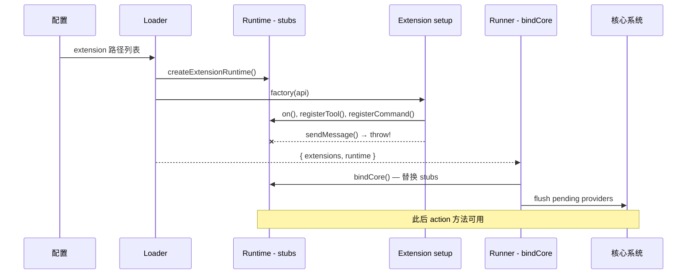
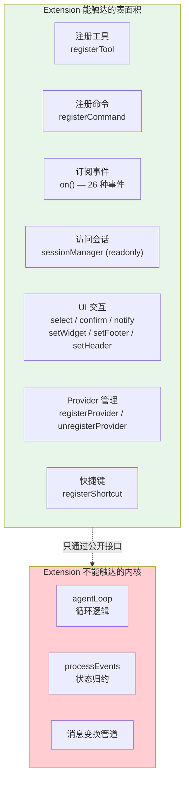

# 第 15 章：Extension 系统 — 让产品长出新器官

> **定位**：本章解析 pi 的 extension 系统如何在不修改核心代码的前提下扩展产品能力。
> 前置依赖：第 10 章（Agent 类）、第 14 章（System Prompt 装配）。
> 适用场景：当你想理解"能力外置"的具体实现，或者想为 pi 写 extension。

## 哪些能力应该内建，哪些应该外置？

这是本章的核心设计问题。

pi 的回答是极端的：**几乎所有产品级能力都外置。** 核心只做三件事 — 调模型、跑循环、管状态（第 8-10 章）。其余能力 — 新工具、新命令、新快捷键、自定义 UI — 全部通过 extension 系统提供。

Extension 的 API 面（`ExtensionUIContext` + `ExtensionApi`）定义了 extension 能触达的系统表面积。让我们看看这个表面积有多大。

## Extension 能做什么

Extension 是一个 TypeScript 模块，导出一个工厂函数，接收 `ExtensionAPI` 对象：

```typescript
// extension 的基本结构
// extensions/types.ts:1273
export type ExtensionFactory = (pi: ExtensionAPI) => void | Promise<void>;
```

注意这个签名的两个设计选择：工厂函数支持 `async`（extension 可以在 setup 阶段做 I/O），参数名是 `pi` 而不是 `ctx`（强调这是系统级别的扩展点）。

`ExtensionAPI` 暴露的能力极其丰富。我们不逐一列举全部方法（接口超过 200 行），而是看 5 个最重要的能力维度。

### 能力 1：事件订阅 — 观察系统的一切

```typescript
// extensions/types.ts:986-1026（节选 5 个关键事件）
export interface ExtensionAPI {
  on(event: "session_start",
     handler: ExtensionHandler<SessionStartEvent>): void;
  on(event: "context",
     handler: ExtensionHandler<ContextEvent, ContextEventResult>): void;
  on(event: "tool_call",
     handler: ExtensionHandler<ToolCallEvent, ToolCallEventResult>): void;
  on(event: "tool_result",
     handler: ExtensionHandler<ToolResultEvent, ToolResultEventResult>): void;
  on(event: "input",
     handler: ExtensionHandler<InputEvent, InputEventResult>): void;
  // ... 共 26 种事件
}
```

事件系统的设计有两层含义。**观察型事件**（如 `session_start`、`agent_end`、`message_update`）让 extension 被动获知系统状态变化。**干预型事件**（如 `tool_call`、`input`、`context`）通过返回值影响系统行为 — `tool_call` 可以 block 工具执行，`input` 可以 transform 用户输入，`context` 可以修改发送给 LLM 的消息列表。

这个区分体现在 handler 的泛型签名中：

```typescript
// extensions/types.ts:981
export type ExtensionHandler<E, R = undefined> =
  (event: E, ctx: ExtensionContext) => Promise<R | void> | R | void;
```

当 `R = undefined` 时，handler 是纯观察型 — 返回值被忽略。当 `R` 是具体类型时（如 `ToolCallEventResult`），handler 可以通过返回值干预流程。

### 能力 2：工具注册 — 给 LLM 新的手

```typescript
// extensions/types.ts:1032-1035
registerTool<TParams extends TSchema, TDetails = unknown, TState = any>(
  tool: ToolDefinition<TParams, TDetails, TState>,
): void;
```

`ToolDefinition` 是 extension 系统中最复杂的类型，因为它承载了从 LLM 交互到 UI 渲染的完整工具定义：

```typescript
// extensions/types.ts:369-404（核心字段）
export interface ToolDefinition<TParams extends TSchema = TSchema,
                                TDetails = unknown, TState = any> {
  name: string;
  description: string;          // 给 LLM 看的描述
  parameters: TParams;          // TypeBox schema → JSON Schema
  promptSnippet?: string;       // 注入 system prompt 的单行摘要
  promptGuidelines?: string[];  // 注入 system prompt 的使用指南

  execute(
    toolCallId: string,
    params: Static<TParams>,
    signal: AbortSignal | undefined,
    onUpdate: AgentToolUpdateCallback<TDetails> | undefined,
    ctx: ExtensionContext,
  ): Promise<AgentToolResult<TDetails>>;

  renderCall?: (...) => Component;   // 自定义调用时的 UI
  renderResult?: (...) => Component; // 自定义结果的 UI
}
```

注意 `promptSnippet` 和 `promptGuidelines` — 工具不仅有 schema 描述，还能直接向 system prompt 注入使用指南。这让工具的"说明书"和"实现"在同一个定义中完成。

### 能力 3：命令与快捷键 — 用户交互的扩展点

```typescript
// extensions/types.ts:1042-1061
registerCommand(name: string,
  options: Omit<RegisteredCommand, "name" | "sourceInfo">): void;

registerShortcut(shortcut: KeyId,
  options: {
    description?: string;
    handler: (ctx: ExtensionContext) => Promise<void> | void;
  }): void;

registerFlag(name: string,
  options: {
    description?: string;
    type: "boolean" | "string";
    default?: boolean | string;
  }): void;
```

三个注册方法对应三种用户交互通道：斜杠命令（`/command`）、键盘快捷键、CLI flag。注意 `registerCommand` 的 handler 接收的是 `ExtensionCommandContext` — 比普通的 `ExtensionContext` 多了 `newSession()`、`fork()`、`navigateTree()` 等会话控制方法。这个区分很重要：只有**用户主动发起的命令**才有权做会话级操作，事件 handler 中不能 fork 或切换会话。

### 能力 4：消息与状态持久化

```typescript
// extensions/types.ts:1078-1093
sendMessage<T = unknown>(
  message: Pick<CustomMessage<T>, "customType" | "content" |
           "display" | "details">,
  options?: { triggerTurn?: boolean;
              deliverAs?: "steer" | "followUp" | "nextTurn" },
): void;

sendUserMessage(
  content: string | (TextContent | ImageContent)[],
  options?: { deliverAs?: "steer" | "followUp" },
): void;

appendEntry<T = unknown>(customType: string, data?: T): void;
```

三种消息注入方式形成梯度：`sendMessage` 发送自定义消息（可控制是否触发 LLM 回复），`sendUserMessage` 模拟用户输入（总是触发回复），`appendEntry` 只写入会话文件但不发给 LLM（纯持久化，用于 extension 保存自己的状态）。

`deliverAs` 参数控制消息在 agent 正在 streaming 时的排队策略：`steer` 立即注入当前 turn，`followUp` 等当前 turn 结束后注入。

### 能力 5：Provider 注册 — 自定义模型接入

```typescript
// extensions/types.ts:1192-1207
registerProvider(name: string, config: ProviderConfig): void;
unregisterProvider(name: string): void;
```

这是最强大的扩展点之一。Extension 可以注册全新的 model provider（带自定义 baseUrl、API key、甚至 OAuth 流程），也可以覆盖已有 provider 的配置（比如把所有 Anthropic 请求路由到内部代理）。详见第 18 章。

## ExtensionUIContext — 系统表面上的 UI 接口

除了 `ExtensionAPI`（在 setup 阶段使用），extension 还通过 `ExtensionUIContext` 与用户交互。这个接口在每个事件 handler 的 `ctx.ui` 中可用。

```typescript
// extensions/types.ts:108-175（核心 UI 方法）
export interface ExtensionUIContext {
  // 对话式 UI — 阻塞等待用户回应
  select(title: string, options: string[],
         opts?: ExtensionUIDialogOptions): Promise<string | undefined>;
  confirm(title: string, message: string,
          opts?: ExtensionUIDialogOptions): Promise<boolean>;
  input(title: string, placeholder?: string,
        opts?: ExtensionUIDialogOptions): Promise<string | undefined>;

  // 单向通知
  notify(message: string,
         type?: "info" | "warning" | "error"): void;

  // 持久 UI 元素 — 自定义系统外观
  setWidget(key: string,
    content: string[] | undefined,
    options?: ExtensionWidgetOptions): void;
  setFooter(factory: ((tui, theme, footerData) =>
    Component & { dispose?(): void }) | undefined): void;
  setHeader(factory: ((tui, theme) =>
    Component & { dispose?(): void }) | undefined): void;
}
```

UI 方法分两类。**对话式方法**（`select`、`confirm`、`input`）返回 Promise，会暂停 extension 的执行直到用户做出选择。它们都支持 `AbortSignal` 和 `timeout`（倒计时自动关闭），这样 extension 不会无限阻塞系统。

**持久元素方法**（`setWidget`、`setFooter`、`setHeader`）改变的是系统 UI 的结构。`setWidget` 可以在编辑器上方或下方插入自定义面板。`setFooter` 和 `setHeader` 直接替换系统的页眉页脚。这些方法接受 Component factory（而非 Component 实例），因为 TUI 的组件生命周期由系统管理。

`setEditorComponent` 是最激进的扩展点 — extension 可以完全替换输入编辑器。类型文件中甚至给出了 Vim mode 的示例实现。

## 一个真实的 Extension 长什么样

以下是一个 token 统计 extension 的 setup 逻辑，展示了典型的 extension 结构：

```typescript
// 一个真实的 extension 示例
import type { ExtensionAPI } from "@mariozechner/pi-coding-agent";

export default async function setup(pi: ExtensionAPI) {
  let turnCount = 0;

  // 1. 注册事件监听 — 追踪 turn 计数
  pi.on("turn_end", async (event, ctx) => {
    turnCount++;
    ctx.ui.setStatus("turns", `Turns: ${turnCount}`);
  });

  // 2. 注册事件监听 — 在 compaction 前保存状态
  pi.on("session_before_compact", async (event, ctx) => {
    pi.appendEntry("turn-counter-state", { turnCount });
  });

  // 3. 注册命令 — 提供用户交互
  pi.registerCommand("reset-turns", {
    description: "Reset the turn counter",
    handler: async (args, ctx) => {
      const confirmed = await ctx.ui.confirm(
        "Reset?", `Reset turn counter (currently ${turnCount})?`
      );
      if (confirmed) {
        turnCount = 0;
        ctx.ui.setStatus("turns", `Turns: 0`);
        ctx.ui.notify("Turn counter reset", "info");
      }
    },
  });
}
```

这个例子展示了三个典型模式：用闭包变量维护状态（`turnCount`），用事件监听驱动行为，用 `appendEntry` 持久化到会话文件。

## Loader → Runner → Wrapper 三层架构

Extension 系统内部分为三层，各有明确职责。

### Loader：发现与加载

```typescript
// extensions/loader.ts:373-390
export async function loadExtensions(
  paths: string[], cwd: string, eventBus?: EventBus
): Promise<LoadExtensionsResult> {
  const extensions: Extension[] = [];
  const errors: Array<{ path: string; error: string }> = [];
  const runtime = createExtensionRuntime();

  for (const extPath of paths) {
    const { extension, error } =
      await loadExtension(extPath, cwd, resolvedEventBus, runtime);
    if (error) { errors.push({ path: extPath, error }); continue; }
    if (extension) { extensions.push(extension); }
  }

  return { extensions, errors, runtime };
}
```

Loader 的关键设计：

1. **串行加载**。Extension 按配置顺序逐个加载，不并行。这保证了注册顺序的确定性 — 先加载的 extension 的事件 handler 先执行。

2. **jiti 动态导入**。Extension 是普通的 TypeScript 文件，通过 `@mariozechner/jiti`（一个 fork 版本，支持 `virtualModules`）在运行时编译和加载。这意味着 extension 不需要预编译。

3. **Virtual Modules**。编译后的 Bun binary 中没有 `node_modules`，extension 依赖的包通过 `virtualModules` 映射到 binary 中打包的静态导入：

```typescript
// extensions/loader.ts:43-50
const VIRTUAL_MODULES: Record<string, unknown> = {
  "@sinclair/typebox": _bundledTypebox,
  "@mariozechner/pi-agent-core": _bundledPiAgentCore,
  "@mariozechner/pi-tui": _bundledPiTui,
  "@mariozechner/pi-ai": _bundledPiAi,
  "@mariozechner/pi-coding-agent": _bundledPiCodingAgent,
};
```

这些 import 必须是静态的（`import * as`），否则 Bun 不会打包。这是一个不太常见的"静态依赖支撑动态加载"的模式。

### Runtime：两阶段初始化

Runtime 是 extension 和核心系统之间的共享状态层。它的设计核心是**两阶段初始化**：

```typescript
// extensions/loader.ts:120-154（简化）
export function createExtensionRuntime(): ExtensionRuntime {
  const notInitialized = () => {
    throw new Error("Extension runtime not initialized.");
  };

  const runtime: ExtensionRuntime = {
    sendMessage: notInitialized,    // 抛异常的 stub
    sendUserMessage: notInitialized,
    // ...所有 action 方法都是 throwing stubs
    flagValues: new Map(),
    pendingProviderRegistrations: [],
    registerProvider: (name, config, extensionPath) => {
      runtime.pendingProviderRegistrations.push(
        { name, config, extensionPath }
      );
    },
  };
  return runtime;
}
```

第一阶段（loader 阶段）：runtime 的 action 方法全部是 throwing stubs。Extension 在 `setup()` 中不能调用 `sendMessage()` 或 `setModel()` — 因为此时核心系统还没准备好。但**注册方法**（`on()`、`registerTool()`、`registerCommand()`）可以正常使用，因为它们只是向 `Extension` 对象的 Map 中添加条目。

第二阶段（runner 的 `bindCore()` 阶段）：runner 把真实的 action 实现注入 runtime，替换 throwing stubs。同时 flush 所有 `pendingProviderRegistrations`。从此刻起，事件 handler 中的 `pi.sendMessage()` 等方法才可用。

这种两阶段设计解决了一个经典问题：**extension 的注册代码在系统启动早期执行，但 action 代码需要系统完全就绪后才能执行**。用 throwing stubs 而不是 silent no-op，让开发者在错误使用时立即得到明确的报错。

### Wrapper：从注册到运行

Wrapper 层（由 runner 实现）把 extension 注册的工具和命令包装成核心系统能理解的格式。例如，`ToolDefinition` 注册后会被转化为和内建工具相同的调用接口，在 agent loop 的 tool dispatch 中一视同仁。事件 handler 被收集到统一的 handler map 中，由 runner 在对应的生命周期点逐个调用。



## Extension 的生命周期

### 加载时机

Extension 在 pi 启动的早期阶段加载，在 system prompt 装配之前。这是因为 extension 可能注册新工具（需要出现在 prompt 中）、注册 provider（影响模型选择）、或通过 `resources_discover` 事件提供额外的 skill/prompt 路径。

加载顺序：
1. 解析配置中的 extension 路径
2. 创建共享 runtime（throwing stubs 阶段）
3. 串行加载每个 extension，执行 `setup()`
4. Runner 调用 `bindCore()` — 注入真实 action 实现
5. 触发 `session_start` 事件

### 重载机制

用户可以通过 `/reload` 命令重新加载 extension。重载不是简单的"卸载 + 加载"— 它重新执行整个加载流程（包括 skill、prompt、theme 的重新发现），产生新的 Extension 对象集合，替换旧的。

### 状态管理

Extension 没有正式的"卸载"钩子 — 没有 `teardown()` 或 `dispose()` 方法。如果 extension 需要在退出时清理资源，可以监听 `session_shutdown` 事件。

Extension 的状态管理是一个有趣的取舍。Extension 用 JavaScript 闭包维护内存中的状态（如上面例子中的 `turnCount`），用 `appendEntry` 持久化到会话文件。但重载会重新执行 `setup()`，闭包状态会丢失。如果 extension 需要跨重载保持状态，必须在 `session_start` 事件中从会话 entries 中恢复。

## Extension 不能做什么

这条边界同样重要：

- **不能修改循环逻辑**。循环引擎的 `runLoop()` 不暴露给 extension
- **不能直接修改 Agent 状态**。Extension 通过 `ctx.on(event, handler)` 观察状态，通过 `sendMessage()` / `sendUserMessage()` 注入消息，但不能直接写 `state.messages`
- **不能拦截消息变换**。`transformContext` 和 `convertToLlm` 管道不对 extension 开放
- **Session 是 readonly**。Extension 通过 `ReadonlySessionManager` 读取会话数据，不能修改已有 entries（只能追加新 entries）



## 取舍分析

### 得到了什么

**开放但有边界**。Extension 可以加能力（新工具、新命令），可以干预流程（拦截 tool call、transform 用户输入），可以改变 UI（替换编辑器、自定义 footer），甚至可以接入新的模型 provider。但不能改核心规则 — 循环逻辑、状态归约、消息变换管道。这让系统的核心行为是可预测的，同时产品功能是可扩展的。

**类型安全的 API 合约**。整个 extension API 用 TypeScript 严格类型定义，26 种事件每种都有独立的类型和返回值约束。这不是一个"给你个 any，自己造"的 plugin 系统。

### 放弃了什么

**Extension 的能力上限有限**。有些深度定制（比如自定义的工具执行策略、自定义的消息格式）无法通过 extension 实现，需要 fork 核心代码。这是"安全性 vs 灵活性"的经典取舍。

**没有沙箱**。Extension 运行在和核心系统相同的进程中，一个坏的 extension 可以 crash 整个进程。pi 选择了信任开发者（和审计机制）而不是技术隔离。

**两阶段初始化增加了认知负担**。开发者需要理解"setup 阶段不能调 action 方法"的规则。throwing stubs 的设计让错误变得显式，但这仍然是一个需要学习的概念。

---

### 版本演化说明
> 本章核心分析基于 pi-mono v0.66.0。Extension API 持续扩展中 —
> `setWidget`、`setFooter`、`setHeader`、`onTerminalInput` 都是近期添加的。
> `setEditorComponent` 允许完全替换输入编辑器，是最新的扩展点。
> `ExtensionUIContext` 的接口随用户反馈和 extension 开发者的需求不断增长。
