# 第 16 章：Skill 机制 — 用文档替代代码

> **定位**：本章解析 pi 最鲜明的哲学选择 — 为什么"能力包"是 markdown 文件而不是代码插件。
> 前置依赖：第 14 章（System Prompt 装配）、第 15 章（Extension 系统）。
> 适用场景：当你想理解 skill 和 MCP 的区别，或者想为 pi 创建 skill。

## 为什么 skill 不是代码？

这是本章的核心设计问题。

在大多数 agent 系统中，"扩展能力"意味着写代码 — MCP server、plugin、adapter。但 pi 的 skill 是**带 frontmatter 的 markdown 文件**。它的类型定义极其简洁：

```typescript
// skills.ts:74-81
export interface Skill {
  name: string;
  description: string;
  filePath: string;
  baseDir: string;
  sourceInfo: SourceInfo;
  disableModelInvocation: boolean;
}
```

六个字段，没有 `execute()`，没有 `handler()`，没有任何可执行代码。Skill 的全部运行时能力就是**被 LLM 读取**。

对应的 frontmatter 接口同样极简：

```typescript
// skills.ts:67-72
export interface SkillFrontmatter {
  name?: string;
  description?: string;
  "disable-model-invocation"?: boolean;
  [key: string]: unknown;
}
```

三个已知字段加一个 index signature — skill 的 metadata 可以携带任意额外信息，但系统只关心名称、描述和是否允许 LLM 自动调用。

## 一个完整的 Skill 示例

让我们看一个真实的 skill 文件，理解 frontmatter 和内容体的关系：

```markdown
---
name: tdd
description: >
  Test-driven development workflow.
  Use when implementing any feature or bugfix where tests
  are feasible. Guides the red-green-refactor cycle with
  emphasis on writing minimal tests first.
---

## When to use

When implementing any feature or bugfix where automated
tests are feasible. Especially important for:
- Bug fixes (write the regression test FIRST)
- New API endpoints
- Data transformation functions

## Steps

1. **Red**: Write the smallest test that expresses the requirement
2. **Run**: Execute the test, confirm it fails for the right reason
3. **Green**: Write the minimal implementation to make the test pass
4. **Run**: Execute the test again, confirm it passes
5. **Refactor**: Improve the implementation without changing behavior
6. **Run**: Confirm tests still pass after refactoring

## Important

- Do NOT write implementation before the test exists
- Each test should test ONE behavior
- If a test is hard to write, the interface needs redesigning
```

Frontmatter 中的 `name` 必须匹配父目录名（如 `skills/tdd/SKILL.md`）。`description` 是注入 system prompt 的部分 — 它是 LLM 决定"要不要读这个 skill"的唯一依据，所以应该包含足够的触发条件信息。

正文（`## When to use` 以下）不会自动注入 prompt — 只有当 LLM 认为当前任务匹配 description 时，它会用 `read` 工具读取完整文件。

### disable-model-invocation

当 `disable-model-invocation: true` 时，skill 不会出现在 system prompt 的 `<available_skills>` 列表中，LLM 无法自动发现和加载它。这类 skill 只能通过用户的 `/skill:name` 命令显式触发。适用场景：包含敏感指令、或只在特定上下文中才有意义的 skill。

## Frontmatter 解析

Skill 文件的 frontmatter 通过通用的 `parseFrontmatter` 函数解析：

```typescript
// utils/frontmatter.ts:28-37
export const parseFrontmatter = <T extends Record<string, unknown>>(
  content: string,
): ParsedFrontmatter<T> => {
  const { yamlString, body } = extractFrontmatter(content);
  if (!yamlString) {
    return { frontmatter: {} as T, body };
  }
  const parsed = parse(yamlString);
  return { frontmatter: (parsed ?? {}) as T, body };
};
```

解析规则：以 `---` 开头和 `\n---` 结尾的 YAML 块被提取为 frontmatter，剩余部分为 body。没有 frontmatter 的 markdown 文件返回空对象 — 这意味着 skill 仍然可以加载，但会因缺少 `description` 而产生验证警告。

## Skill 发现算法

Skill 的发现过程是系统中最体现"约定优于配置"哲学的部分。

### 来源与优先级

```typescript
// skills.ts:451-453
addSkills(loadSkillsFromDirInternal(
  join(resolvedAgentDir, "skills"), "user", true));
addSkills(loadSkillsFromDirInternal(
  resolve(cwd, CONFIG_DIR_NAME, "skills"), "project", true));
```

加载顺序决定了优先级：**先加载的赢**。全局 skill（`~/.pi/agent/skills/`）先于项目 skill（`.pi/skills/`）加载。这意味着全局 skill 优先 — 当同名冲突时，全局的赢。

等等，这和你的直觉相反吗？大多数系统是"近处优先"。但看代码中的冲突处理：

```typescript
// skills.ts:431-448
const existing = skillMap.get(skill.name);
if (existing) {
  collisionDiagnostics.push({
    type: "collision",
    message: `name "${skill.name}" collision`,
    path: skill.filePath,
    collision: {
      resourceType: "skill",
      name: skill.name,
      winnerPath: existing.filePath,
      loserPath: skill.filePath,
    },
  });
} else {
  skillMap.set(skill.name, skill);
  realPathSet.add(realPath);
}
```

Map 的 `get/set` 语义是"第一个写入的赢"— `existing` 存在时，新的 skill 被记录为 collision 但不覆盖。先加载的来源（user）先写入 Map，所以用户级全局 skill 优先于项目级 skill。

冲突不是静默丢弃 — 它被记录为 `collision` 类型的 diagnostic，让用户知道发生了什么。

### 目录发现规则

```typescript
// skills.ts:164-175
// Discovery rules:
// - if a directory contains SKILL.md, treat it as a skill root
//   and do not recurse further
// - otherwise, load direct .md children in the root
// - recurse into subdirectories to find SKILL.md
```

这三条规则形成了一个清晰的约定：

**规则 1**：如果目录包含 `SKILL.md`，这个目录就是一个 skill 包。`SKILL.md` 是 skill 的入口文件，目录名就是 skill 名。不再向下递归 — skill 包内的其他 `.md` 文件是 skill 的内部文件（可以被引用但不单独加载）。

**规则 2**：根目录下的 `.md` 文件（非 `SKILL.md`）被当作独立 skill 加载。这是简化模式 — 不需要创建子目录。

**规则 3**：递归扫描子目录寻找 `SKILL.md`。支持任意深度的目录结构。

```
skills/
├── tdd/
│   └── SKILL.md          # → skill "tdd"（规则 1）
├── code-review/
│   ├── SKILL.md           # → skill "code-review"（规则 1）
│   └── checklist.md       # 内部文件，不独立加载
├── quick-tips.md          # → skill "quick-tips"（规则 2）
└── advanced/
    └── perf-tuning/
        └── SKILL.md       # → skill "perf-tuning"（规则 3）
```

### .gitignore 尊重

发现过程会读取 `.gitignore`、`.ignore`、`.fdignore` 文件，跳过被忽略的路径。这意味着你可以在 skill 目录中放置工作文件而不用担心它们被加载为 skill。

### 名称验证

```typescript
// skills.ts:92-116
function validateName(name: string, parentDirName: string): string[] {
  const errors: string[] = [];
  if (name !== parentDirName) {
    errors.push(`name does not match parent directory`);
  }
  if (name.length > MAX_NAME_LENGTH) {  // 64
    errors.push(`name exceeds ${MAX_NAME_LENGTH} characters`);
  }
  if (!/^[a-z0-9-]+$/.test(name)) {
    errors.push(`name contains invalid characters`);
  }
  if (name.startsWith("-") || name.endsWith("-")) {
    errors.push(`name must not start or end with a hyphen`);
  }
  if (name.includes("--")) {
    errors.push(`name must not contain consecutive hyphens`);
  }
  return errors;
}
```

名称规则严格但合理：小写字母、数字、连字符，最长 64 字符，不能以连字符开头或结尾，不能有连续连字符。这些约束确保 skill 名可以安全地用作文件路径、命令名、XML 标签。

注意：验证失败只产生 warning，不阻止加载（除非 description 完全缺失）。这是"宽松输入、严格输出"的策略 — 让开发者的 skill 能用，但提醒他们规范命名。

### Symlink 去重

```typescript
// skills.ts:419-428
let realPath: string;
try {
  realPath = realpathSync(skill.filePath);
} catch {
  realPath = skill.filePath;
}
if (realPathSet.has(realPath)) {
  continue;  // 同一个物理文件，静默跳过
}
```

如果全局和项目 skill 目录中有 symlink 指向同一个文件，只加载一次。这和名称冲突（产生 diagnostic）不同 — symlink 去重是完全静默的，因为它不是错误，只是重复引用。

## formatSkillsForPrompt — 从数据到 Prompt

发现完成后，skill 需要被注入 system prompt。这个过程由 `formatSkillsForPrompt` 完成：

```typescript
// skills.ts:339-365
export function formatSkillsForPrompt(skills: Skill[]): string {
  const visibleSkills = skills.filter(
    (s) => !s.disableModelInvocation
  );
  if (visibleSkills.length === 0) return "";

  const lines = [
    "\n\nThe following skills provide specialized instructions.",
    "Use the read tool to load a skill's file when the task " +
      "matches its description.",
    "When a skill file references a relative path, resolve it " +
      "against the skill directory.",
    "",
    "<available_skills>",
  ];

  for (const skill of visibleSkills) {
    lines.push("  <skill>");
    lines.push(`    <name>${escapeXml(skill.name)}</name>`);
    lines.push(`    <description>${escapeXml(skill.description)}</description>`);
    lines.push(`    <location>${escapeXml(skill.filePath)}</location>`);
    lines.push("  </skill>");
  }

  lines.push("</available_skills>");
  return lines.join("\n");
}
```

几个关键设计决策：

**XML 格式**。Skill 列表使用 XML 标签而不是 markdown 或 JSON，遵循 [Agent Skills 标准](https://agentskills.io/integrate-skills)。XML 在 LLM prompt 中有明确的起止标记，不容易和自然语言混淆。

**只注入 metadata，不注入全文**。每个 skill 只贡献 name + description + location 三个字段到 prompt。完整内容需要 LLM 用 `read` 工具主动读取。这是 token 经济性和能力可用性的平衡 — 如果有 50 个 skill，每个 3000 字，直接注入会消耗 150K token。

**preamble 指令**。XML 列表前面有三行指令文本，告诉 LLM：(1) skill 提供任务特化的指令，(2) 要用 read 工具加载匹配的 skill，(3) skill 内的相对路径要基于 skill 目录解析。第三点容易被忽视但很重要 — skill 可能引用同目录下的模板文件或配置文件。

**disableModelInvocation 过滤**。标记了 `disable-model-invocation: true` 的 skill 在此处被过滤掉，LLM 完全看不到它们。

```mermaid
flowchart LR
    subgraph Sources["发现来源"]
        Global["~/.pi/agent/skills/"]
        Project[".pi/skills/"]
        Paths["skillPaths 配置"]
    end
    
    subgraph Process["处理流程"]
        Scan["递归扫描\nSKILL.md + *.md"]
        Parse["parseFrontmatter\n提取 name + description"]
        Validate["验证名称规则\n64 字符 / 小写 / 连字符"]
        Dedup["名称去重\n先加载的赢"]
    end
    
    subgraph Output["注入方式"]
        Filter["过滤\ndisableModelInvocation"]
        Format["formatSkillsForPrompt\nXML 格式"]
        Prompt["system prompt\n<available_skills>"]
        Read["agent 用 read 工具\n按需读取全文"]
    end
    
    Sources --> Scan --> Parse --> Validate --> Dedup
    Dedup --> Filter --> Format --> Prompt --> Read
    
    style Sources fill:#e3f2fd
    style Output fill:#c8e6c9
```



## Skill vs MCP vs Extension — 详细对比

| 维度 | Skill | MCP Server | Extension |
|------|-------|------------|-----------|
| **本质** | 指令文本（markdown） | RPC 服务（独立进程） | 代码模块（同进程） |
| **运行时能力** | 无 — 只能影响 LLM 行为 | 可调任意 API、访问外部系统 | 完整 — 注册工具、命令、UI |
| **执行环境** | 被 LLM 读取，无执行 | 独立进程，stdio/SSE 通信 | 主进程内，共享内存 |
| **部署成本** | 创建 .md 文件 | 启动服务进程 + 配置 transport | 写 TypeScript + 配置路径 |
| **创建成本** | 5 分钟写 markdown | 数小时实现 server | 数小时学 API + 实现 |
| **审计成本** | 打开文件就能看 | 需要审计代码 + 网络通信 | 需要审计代码 |
| **版本控制** | git diff 友好 | 需要包管理 | 需要包管理 |
| **安全风险** | 零（纯文本） | 中（独立进程但可联网） | 高（同进程，无沙箱） |
| **效果确定性** | 低 — 依赖 LLM 指令遵循 | 高 — 代码执行确定 | 高 — 代码执行确定 |
| **可组合性** | 低 — skill 之间无法互调 | 中 — 工具之间可组合 | 高 — 可访问系统 API |
| **离线可用** | 是 | 取决于 server | 取决于实现 |
| **适用场景** | 工作流指南、编码规范、检查清单 | 数据库查询、API 集成、文件转换 | UI 定制、工具拦截、provider 接入 |

这张表揭示了一个关键洞察：**三种扩展机制不是竞争关系，而是互补的**。Skill 解决"告诉 LLM 怎么做"的问题，MCP 解决"给 LLM 新的能力接口"的问题，Extension 解决"改变 pi 本身的行为"的问题。

一个典型的组合：Extension 注册一个新工具（比如"执行 SQL"），MCP server 提供数据库连接，Skill 描述"在这个项目中，查询数据库时要遵循的安全规范"。三层各司其职。

## 取舍分析

### 得到了什么

**1. 零依赖、零风险**。Skill 是纯文本文件。不需要安装、不需要运行、不需要信任。人类可以在 5 秒内审计一个 skill 的全部内容。

**2. 版本控制友好**。Skill 文件可以提交到 git、做 code review、做 diff。它的"代码"就是人类可读的自然语言指令。

**3. 创建成本极低**。写一个 skill 就是写一篇 markdown。不需要学框架、不需要写 schema、不需要实现接口。这让非工程师也能贡献"能力" — 一个 QA 工程师可以写一个 test review skill，一个设计师可以写一个 accessibility audit skill。

**4. 渐进式复杂性**。最简单的 skill 是一个带 description 的 markdown 文件。更复杂的 skill 可以引用外部文件、使用条件指令、甚至用 `disable-model-invocation` 控制可见性。复杂性是可选的。

### 放弃了什么

**1. 没有运行时能力**。Skill 不能调 API、不能查数据库、不能访问外部系统。它只能影响 LLM 的行为，不能扩展 agent 的能力。需要运行时能力时，必须用 extension（第 15 章）或 MCP。

**2. 效果依赖 LLM 的指令遵循能力**。Skill 的"执行"完全靠 LLM 理解和遵循指令。不同的 LLM 对同一个 skill 的遵循程度不同。没有机械的保证。一个精心编写的 skill 在 Claude 上效果很好，在另一个模型上可能被部分忽略。

**3. 发现机制简单**。Skill 通过文件路径被发现，没有依赖管理、版本约束、冲突检测（除了同名先到先得）。大规模 skill 生态需要额外的管理工具。

**4. 全局 skill 优先于项目 skill**。这和大多数"近处优先"的系统不同。如果用户的全局 skill 和项目 skill 同名，项目级的会被忽略（虽然会报 collision diagnostic）。这个决策优先保护用户的个人偏好，但可能让团队共享的项目 skill 意外被覆盖。

pi 的判断：对于大多数 agent 的"能力扩展"需求，**告诉 LLM 怎么做**比**写代码替 LLM 做**更轻量、更安全、更容易维护。Skill 不是万能的 — 但它覆盖了大量"不需要写代码"的场景，让真正需要代码的场景用 Extension 或 MCP 来解决。

---

### 版本演化说明
> 本章核心分析基于 pi-mono v0.66.0。Skill 机制自引入以来保持简洁。
> Frontmatter 的字段限制（name 最长 64 字符、description 最长 1024 字符）
> 是后来为防止滥用而添加的。npm 包中的 skill 发现是近期扩展。
> `disable-model-invocation` 字段是后来添加的，用于区分"LLM 可自动发现"
> 和"仅用户可显式触发"两种 skill。
