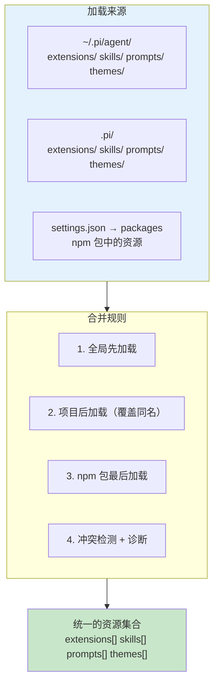

# 第 17 章：Resource Loader — 一切外部资源的统一入口

> **定位**：本章解析 pi 如何统一加载 extensions、skills、prompts、themes 四种资源。
> 前置依赖：第 15 章（Extension 系统）、第 16 章（Skill 机制）。
> 适用场景：当你想理解资源从哪里来、按什么顺序加载。

## 为什么需要统一入口？

pi 有四种可扩展的外部资源：extensions（代码模块）、skills（指令文档）、prompts（模板文本）、themes（UI 主题）。每种资源有两个作用域：全局（`~/.pi/agent/`）和项目（`.pi/`）。再加上 npm 包来源，组合起来有十几个加载路径。

如果每种资源各自加载，就会有四套发现逻辑、四套冲突处理、四套作用域合并。Resource Loader 把这些统一成一套流程：



## ResourceLoader 接口

Resource Loader 的公共接口定义了消费者能做什么：

```typescript
// file: packages/coding-agent/src/core/resource-loader.ts:29-39
export interface ResourceLoader {
  getExtensions(): LoadExtensionsResult;
  getSkills(): { skills: Skill[]; diagnostics: ResourceDiagnostic[] };
  getPrompts(): { prompts: PromptTemplate[]; diagnostics: ResourceDiagnostic[] };
  getThemes(): { themes: Theme[]; diagnostics: ResourceDiagnostic[] };
  getAgentsFiles(): { agentsFiles: Array<{ path: string; content: string }> };
  getSystemPrompt(): string | undefined;
  getAppendSystemPrompt(): string[];
  extendResources(paths: ResourceExtensionPaths): void;
  reload(): Promise<void>;
}
```

几个值得注意的设计点：

**每种资源的返回值都包含 `diagnostics`**。Resource Loader 不会因为一个资源加载失败就中止整个加载过程。它会继续加载其他资源，把错误收集到 `ResourceDiagnostic[]` 中。上层代码（比如 TUI）可以选择把这些诊断信息展示给用户，也可以忽略。

**`extendResources` 允许运行时动态扩展**。Extension 加载完成后，它可以向 Resource Loader 注册额外的 skill、prompt、theme 路径。这是 "Extension 可以提供 Skill" 的底层机制。

**`reload` 是异步的**。因为加载过程涉及文件系统读取、npm 包解析，这些操作是异步的。但 `getExtensions` 等取值方法是同步的 — 它们只是返回上一次 `reload` 的结果。

## 四种资源的不同加载需求

虽然 Resource Loader 提供了统一接口，但四种资源的加载逻辑实际上差异很大：

### Extensions — 需要执行代码

Extension 是 TypeScript/JavaScript 模块，加载意味着**执行代码**。加载器需要使用 `jiti`（运行时 TypeScript 编译器）把 `.ts` 文件编译并执行，获得 `ExtensionFactory` 函数，然后调用它得到 `Extension` 对象。

这是四种资源中最复杂的 — 涉及模块解析、错误隔离（一个 extension 崩溃不能影响其他 extension）、以及 runtime 注入（每个 extension 获得一个 `ExtensionRuntime` 对象用于注册能力）。

### Skills — 只需读文件

Skill 是 Markdown 文件（通常命名为 `SKILL.md`），加载只需要读取文件内容。但 skill 有一个特殊的路径解析逻辑：如果加载路径指向一个目录，加载器会自动查找该目录下的 `SKILL.md` 文件。

```typescript
// file: packages/coding-agent/src/core/resource-loader.ts:350-370
const mapSkillPath = (resource: { path: string; metadata: PathMetadata })
    : string => {
  if (resource.metadata.source !== "auto"
      && resource.metadata.origin !== "package") {
    return resource.path;
  }
  try {
    const stats = statSync(resource.path);
    if (!stats.isDirectory()) { return resource.path; }
  } catch { return resource.path; }
  const skillFile = join(resource.path, "SKILL.md");
  if (existsSync(skillFile)) {
    if (!metadataByPath.has(skillFile)) {
      metadataByPath.set(skillFile, resource.metadata);
    }
    return skillFile;
  }
  return resource.path;
};
```

这段代码的逻辑是：对于自动发现的路径和来自 npm 包的路径，如果它指向一个目录，就尝试找 `SKILL.md`。这让 npm 包可以简单地导出一个包含 `SKILL.md` 的目录作为 skill。

### Prompts — 需要模板解析

Prompt Template 是文本文件，但不是简单的纯文本 — 它们可能包含变量占位符，需要在使用时填充。加载器需要读取文件并解析模板格式。

### Themes — 需要 Schema 验证

Theme 是 JSON 文件，加载后需要验证其结构是否符合 theme schema（颜色、字体大小等字段是否完整）。一个格式错误的 theme 文件不应该让整个 UI 崩溃 — 加载器需要检测并报告格式问题，同时回退到默认 theme。

## 完整的加载流程

`reload()` 方法是 Resource Loader 的核心。它按照精确的顺序加载所有资源：

```typescript
// file: packages/coding-agent/src/core/resource-loader.ts:318-467
// 简化的 reload 流程：
async reload(): Promise<void> {
  // 1. 重新加载 settings（用户可能修改了 settings.json）
  await this.settingsManager.reload();

  // 2. 通过 PackageManager 解析所有路径
  const resolvedPaths = await this.packageManager.resolve();

  // 3. 过滤出启用的资源路径
  const enabledExtensions = getEnabledPaths(resolvedPaths.extensions);
  const enabledSkills = getEnabledResources(resolvedPaths.skills);
  const enabledPrompts = getEnabledPaths(resolvedPaths.prompts);
  const enabledThemes = getEnabledPaths(resolvedPaths.themes);

  // 4. 合并 CLI 额外路径
  const extensionPaths = this.mergePaths(cliEnabledExtensions,
                                          enabledExtensions);

  // 5. 加载 extensions（执行代码）
  const extensionsResult = await loadExtensions(extensionPaths,
                                                 this.cwd, this.eventBus);

  // 6. 检测 extension 冲突
  const conflicts = this.detectExtensionConflicts(
    extensionsResult.extensions
  );

  // 7. 加载 skills, prompts, themes（读取文件）
  this.updateSkillsFromPaths(skillPaths, metadataByPath);
  this.updatePromptsFromPaths(promptPaths, metadataByPath);
  this.updateThemesFromPaths(themePaths, metadataByPath);

  // 8. 加载 AGENTS.md / CLAUDE.md 上下文文件
  this.agentsFiles = loadProjectContextFiles({ ... });

  // 9. 解析 system prompt
  this.systemPrompt = resolvePromptInput(
    this.systemPromptSource ?? this.discoverSystemPromptFile(), ...
  );
}
```

## npm 包来源的加载

除了全局和项目两个本地目录，Resource Loader 还支持从 npm 包加载资源。这是通过 `PackageManager` 实现的。

用户可以在 `settings.json` 中配置包：

```json
{
  "packages": [
    "@myorg/pi-extension-custom-tool",
    "@myorg/pi-skills-react"
  ]
}
```

`PackageManager` 负责：
1. 检查包是否已安装（在 `~/.pi/agent/packages/` 中）
2. 如果未安装，使用 npm 安装
3. 解析包的目录结构，找出其中的 extensions、skills、prompts、themes
4. 把这些路径添加到各自的加载列表中

npm 包中的资源遵循一个约定：包的根目录下有 `extensions/`、`skills/`、`prompts/`、`themes/` 子目录。这与全局和项目目录的结构保持一致 — 同样的目录约定，不同的来源。

来自 npm 包的资源在合并顺序中**最后加载**。这意味着如果全局目录和 npm 包中有同名的 skill，全局目录的会被 npm 包的覆盖。这个选择有些反直觉 — 通常你期望本地配置覆盖远程包。但 pi 的设计认为：npm 包是显式安装的（用户主动选择的），全局目录是隐式存在的，显式选择应该有更高的优先级。

## 冲突诊断

当多个来源提供同名资源时，Resource Loader 不会静默地选择一个。它会生成 `ResourceDiagnostic` 来告知用户存在冲突。

```typescript
// file: packages/coding-agent/src/core/resource-loader.ts:400-405
// 检测 extension 冲突（工具、命令、flag 同名）
const conflicts = this.detectExtensionConflicts(
  extensionsResult.extensions
);
for (const conflict of conflicts) {
  extensionsResult.errors.push(
    { path: conflict.path, error: conflict.message }
  );
}
```

Extension 的冲突检测尤其重要，因为两个 extension 可能注册同名的工具。当检测到冲突时：

1. **所有冲突的 extension 都会被加载**（不会因为冲突就丢弃某个 extension）
2. **冲突被记录为 diagnostic**（用户在 TUI 中可以看到警告）
3. **优先级由加载顺序决定**（后加载的覆盖先加载的）

这是一个典型的 "宽容加载 + 事后报告" 策略。替代方案是 "严格加载 — 有冲突就报错并拒绝加载"。pi 选择宽容策略的原因是：在开发阶段，用户经常需要临时覆盖某个 extension 的行为（比如用项目级的 extension 覆盖全局的），如果每次覆盖都报错阻断，开发体验会很差。

不仅仅是 extension 名称冲突 — Resource Loader 还检测路径不存在的情况：

```typescript
// file: packages/coding-agent/src/core/resource-loader.ts:421-425
for (const p of this.additionalSkillPaths) {
  if (isLocalPath(p) && !existsSync(p)
      && !this.skillDiagnostics.some((d) => d.path === p)) {
    this.skillDiagnostics.push(
      { type: "error", message: "Skill path does not exist", path: p }
    );
  }
}
```

每种资源类型都有类似的检查。用户在 CLI 参数中指定了一个不存在的 skill 路径，不会导致崩溃 — 它会被记录为 diagnostic，其他资源正常加载。

## Override 机制

Resource Loader 提供了一套完整的 override 机制，允许上层代码在加载完成后修改结果：

```typescript
// file: packages/coding-agent/src/core/resource-loader.ts:131-148
extensionsOverride?: (base: LoadExtensionsResult) => LoadExtensionsResult;
skillsOverride?: (base: { skills: Skill[];
  diagnostics: ResourceDiagnostic[] }) => { ... };
promptsOverride?: (base: { prompts: PromptTemplate[];
  diagnostics: ResourceDiagnostic[] }) => { ... };
themesOverride?: (base: { themes: Theme[];
  diagnostics: ResourceDiagnostic[] }) => { ... };
systemPromptOverride?: (base: string | undefined) => string | undefined;
appendSystemPromptOverride?: (base: string[]) => string[];
```

每种资源类型都有对应的 override 函数。它接收加载完成的基础结果，返回修改后的结果。这让测试、RPC mode、Slack bot 等不同的产品壳可以在不修改 Resource Loader 代码的情况下定制资源加载行为。

比如测试时可以注入 `noExtensions: true` 禁用所有 extension 加载，或者通过 `skillsOverride` 注入测试用的 skill。这比 mock 整个 Resource Loader 简单得多。

## AGENTS.md 上下文文件

Resource Loader 还负责加载项目上下文文件（`AGENTS.md` 或 `CLAUDE.md`）。这些文件的加载逻辑与四种资源不同 — 它沿着目录树向上搜索：

```typescript
// file: packages/coding-agent/src/core/resource-loader.ts:76-113
function loadProjectContextFiles(options: { cwd?: string }) {
  const contextFiles = [];
  // 1. 先加载全局上下文（~/.pi/agent/ 下的 AGENTS.md）
  const globalContext = loadContextFileFromDir(resolvedAgentDir);
  if (globalContext) contextFiles.push(globalContext);

  // 2. 从当前目录向上遍历到根目录
  let currentDir = resolvedCwd;
  while (true) {
    const contextFile = loadContextFileFromDir(currentDir);
    if (contextFile) ancestorContextFiles.unshift(contextFile);
    if (currentDir === root) break;
    currentDir = resolve(currentDir, "..");
  }
  // 3. 按从根到当前目录的顺序返回
  contextFiles.push(...ancestorContextFiles);
  return contextFiles;
}
```

这意味着在 `/home/user/project/src/` 目录下运行 pi 时，它会查找并加载：
- `~/.pi/agent/AGENTS.md`（全局）
- `/home/AGENTS.md`（如果存在）
- `/home/user/AGENTS.md`（如果存在）
- `/home/user/project/AGENTS.md`（如果存在）
- `/home/user/project/src/AGENTS.md`（如果存在）

所有找到的文件**按顺序拼接**（不覆盖），作为项目上下文注入 system prompt。这个设计让组织可以在不同层级的目录中放置不同粒度的上下文 — 根目录放通用规范，子目录放模块特定的上下文。

## 取舍分析

### 得到了什么

**统一的心智模型**。所有资源遵循同样的加载顺序和覆盖规则。用户学会一套规则就能理解所有资源的行为。

**渐进式降级**。任何单个资源加载失败都不会阻塞系统启动。通过 diagnostic 机制，用户可以在启动后看到哪些资源加载失败了，但系统仍然可用。

**可测试性**。override 机制让测试可以精确控制每种资源的加载结果，而不需要 mock 文件系统。

### 放弃了什么

**资源类型之间的差异被抹平**。Extension 需要执行 setup、skill 只需读文件、theme 需要验证 schema — 不同类型有不同的加载需求，统一入口需要为最复杂的类型设计接口。这导致接口上有些方法（如 `reload` 的异步性）对简单资源来说是过度设计。

**加载顺序不够透明**。全局 → 项目 → npm 包 → CLI 额外路径 — 当多个来源都提供了资源时，用户需要理解完整的合并顺序才能预测最终结果。虽然 diagnostic 可以报告冲突，但合并的过程本身不够可观测。

---

### 版本演化说明
> 本章核心分析基于 pi-mono v0.66.0。Resource Loader 的来源随着 npm 包支持的加入
> 从两级（全局 + 项目）扩展到了三级。
