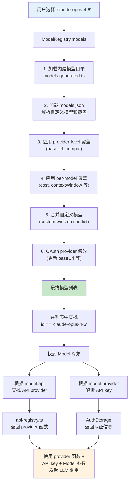

# 第 18 章：Model Registry — 模型不只是一个 ID

> **定位**：本章解析模型选择背后的配置系统和动态注册机制。
> 前置依赖：第 4 章（Provider Registry）、第 13 章（配置覆盖）。
> 适用场景：当你想理解 pi 如何管理模型列表，或者想添加自定义模型。

## 选模型 = 选 provider + 选 api + 选参数

用户在 pi 中选择一个"模型"，背后实际上是选择了一组参数：

```typescript
// file: packages/ai/src/types.ts
interface Model<TApi extends Api> {
  id: string;            // "claude-opus-4-6"
  name: string;          // "Claude Opus 4.6"
  api: TApi;             // "anthropic-messages"
  provider: Provider;    // "anthropic"
  baseUrl?: string;      // API endpoint
  cost: { input; output; cacheRead; cacheWrite };
  contextWindow: number; // 200000
  maxTokens: number;     // 32768
  input: ("text" | "image" | "audio")[];
  reasoning: boolean;    // true
}
```

这些参数来自三个来源：

1. **内建模型目录**：pi 内置了一个生成的 TypeScript 文件，列出所有已知模型的参数
2. **`models.json` 自定义**：用户可以在全局配置中添加、覆盖模型定义
3. **Extension 动态注册**：Extension 可以注册新的 API provider（第 4 章的 `registerApiProvider`），随之带来新的模型

## 内建模型目录的生成

pi 不手动维护模型列表 — 它通过自动化脚本从各 provider 的 API 抓取最新数据并生成代码。

```typescript
// file: packages/ai/scripts/generate-models.ts:1-10
#!/usr/bin/env tsx
import { writeFileSync } from "fs";
import { join, dirname } from "path";
import { fileURLToPath } from "url";
import { Api, KnownProvider, Model } from "../src/types.js";

const __filename = fileURLToPath(import.meta.url);
const __dirname = dirname(__filename);
const packageRoot = join(__dirname, "..");
```

这个脚本做了几件事：

1. **从 OpenRouter API 拉取模型列表**（`https://openrouter.ai/api/v1/models`），过滤出支持 tool calling 的模型
2. **从 AI Gateway 拉取模型元数据**（`https://ai-gateway.vercel.sh/v1`），获取 context window、定价等信息
3. **合并 Anthropic、Google、Bedrock 等主流 provider 的模型定义**
4. **生成 `models.generated.ts` 文件**，包含所有模型的完整参数

生成的文件长这样：

```typescript
// file: packages/ai/src/models.generated.ts:1-24
// This file is auto-generated by scripts/generate-models.ts
// Do not edit manually - run 'npm run generate-models' to update

import type { Model } from "./types.js";

export const MODELS = {
  "amazon-bedrock": {
    "amazon.nova-2-lite-v1:0": {
      id: "amazon.nova-2-lite-v1:0",
      name: "Nova 2 Lite",
      api: "bedrock-converse-stream",
      provider: "amazon-bedrock",
      baseUrl: "https://bedrock-runtime.us-east-1.amazonaws.com",
      reasoning: false,
      input: ["text", "image"],
      cost: { input: 0.33, output: 2.75,
              cacheRead: 0, cacheWrite: 0 },
      contextWindow: 128000,
      maxTokens: 4096,
    } satisfies Model<"bedrock-converse-stream">,
    // ... 更多模型
  },
};
```

注意构建脚本中的关键配置：

```json
// file: packages/ai/package.json:67
{
  "build": "npm run generate-models && tsgo -p tsconfig.build.json"
}
```

**每次构建 pi-ai 都会重新生成模型目录**。这意味着每次发布新版本时，模型目录自动包含最新的模型。

这个设计有一个重要的取舍：**模型数据在构建时确定，而不是运行时查询**。

得到了什么：离线可用 — pi 不需要网络连接就能显示模型列表。启动速度 — 不需要等待 API 响应。确定性 — 同一个版本的 pi 永远看到同样的内建模型列表。

放弃了什么：时效性 — 新模型发布后，用户需要等 pi 的下一个版本才能在内建目录中看到它。（但用户可以通过 `models.json` 立即使用新模型 — 下一节详述。）

## models.json 覆盖机制

用户可以在 `~/.pi/agent/models.json` 中自定义模型。这个文件遵循严格的 JSON Schema：

```typescript
// file: packages/coding-agent/src/core/model-registry.ts:90-109
const ModelDefinitionSchema = Type.Object({
  id: Type.String({ minLength: 1 }),
  name: Type.Optional(Type.String({ minLength: 1 })),
  api: Type.Optional(Type.String({ minLength: 1 })),
  baseUrl: Type.Optional(Type.String({ minLength: 1 })),
  reasoning: Type.Optional(Type.Boolean()),
  input: Type.Optional(Type.Array(
    Type.Union([Type.Literal("text"), Type.Literal("image")])
  )),
  cost: Type.Optional(Type.Object({
    input: Type.Number(),
    output: Type.Number(),
    cacheRead: Type.Number(),
    cacheWrite: Type.Number(),
  })),
  contextWindow: Type.Optional(Type.Number()),
  maxTokens: Type.Optional(Type.Number()),
  headers: Type.Optional(Type.Record(Type.String(), Type.String())),
  compat: Type.Optional(OpenAICompatSchema),
});
```

注意 schema 的设计：除了 `id`，所有字段都是 **optional**。这意味着用户定义一个本地模型时，只需提供最少的信息：

```json
{
  "providers": {
    "my-local-llm": {
      "baseUrl": "http://localhost:11434/v1",
      "api": "openai-completions",
      "models": [
        { "id": "llama-3.3-70b" }
      ]
    }
  }
}
```

未指定的字段会使用合理的默认值。这降低了添加本地模型（Ollama、LM Studio 等）的门槛。

### 覆盖内建模型

`models.json` 不仅能添加新模型，还能覆盖内建模型的参数。通过 `modelOverrides` 字段：

```typescript
// file: packages/coding-agent/src/core/model-registry.ts:112-128
const ModelOverrideSchema = Type.Object({
  name: Type.Optional(Type.String({ minLength: 1 })),
  reasoning: Type.Optional(Type.Boolean()),
  input: Type.Optional(Type.Array(...)),
  cost: Type.Optional(Type.Object({
    input: Type.Optional(Type.Number()),
    output: Type.Optional(Type.Number()),
    cacheRead: Type.Optional(Type.Number()),
    cacheWrite: Type.Optional(Type.Number()),
  })),
  contextWindow: Type.Optional(Type.Number()),
  maxTokens: Type.Optional(Type.Number()),
  headers: Type.Optional(Type.Record(Type.String(), Type.String())),
  compat: Type.Optional(OpenAICompatSchema),
});
```

Override 的 cost 字段内部也是 optional — 你可以只覆盖 `input` 定价而保留其他定价不变。这是通过 deep merge 实现的：

```typescript
// file: packages/coding-agent/src/core/model-registry.ts:223-247
function applyModelOverride(model: Model<Api>,
                            override: ModelOverride): Model<Api> {
  const result = { ...model };
  if (override.name !== undefined) result.name = override.name;
  if (override.reasoning !== undefined)
    result.reasoning = override.reasoning;
  // ... 简单字段覆盖 ...

  // Deep merge cost（partial override）
  if (override.cost) {
    result.cost = {
      input: override.cost.input ?? model.cost.input,
      output: override.cost.output ?? model.cost.output,
      cacheRead: override.cost.cacheRead ?? model.cost.cacheRead,
      cacheWrite: override.cost.cacheWrite ?? model.cost.cacheWrite,
    };
  }

  // Deep merge compat
  result.compat = mergeCompat(model.compat, override.compat);
  return result;
}
```

## ModelRegistry 类

`ModelRegistry` 是管理模型的中心：

```typescript
// file: packages/coding-agent/src/core/model-registry.ts:255-275
export class ModelRegistry {
  private models: Model<Api>[] = [];
  private providerRequestConfigs:
    Map<string, ProviderRequestConfig> = new Map();
  private modelRequestHeaders:
    Map<string, Record<string, string>> = new Map();
  private registeredProviders:
    Map<string, ProviderConfigInput> = new Map();
  private loadError: string | undefined = undefined;

  private constructor(
    readonly authStorage: AuthStorage,
    private modelsJsonPath: string | undefined,
  ) {
    this.loadModels();
  }

  static create(authStorage: AuthStorage,
    modelsJsonPath: string =
      join(getAgentDir(), "models.json")): ModelRegistry {
    return new ModelRegistry(authStorage, modelsJsonPath);
  }
}
```

注意构造函数是 private — 只能通过 `create` 或 `inMemory` 工厂方法创建。`inMemory` 版本用于测试，不读取任何磁盘文件。

## 模型解析的完整流程

当用户在 pi 中选择 "claude-opus-4-6" 时，系统经历了以下步骤：



让我们跟踪代码来验证这个流程：

### 步骤 1-6：加载模型

```typescript
// file: packages/coding-agent/src/core/model-registry.ts:303-329
private loadModels(): void {
  // 从 models.json 加载自定义模型和覆盖
  const { models: customModels, overrides, modelOverrides, error }
    = this.modelsJsonPath
      ? this.loadCustomModels(this.modelsJsonPath)
      : emptyCustomModelsResult();

  // 加载内建模型并应用覆盖
  const builtInModels = this.loadBuiltInModels(overrides,
                                                modelOverrides);
  // 合并自定义模型（自定义优先）
  let combined = this.mergeCustomModels(builtInModels, customModels);

  // 让 OAuth providers 修改模型（如更新 baseUrl）
  for (const oauthProvider
        of this.authStorage.getOAuthProviders()) {
    const cred = this.authStorage.get(oauthProvider.id);
    if (cred?.type === "oauth" && oauthProvider.modifyModels) {
      combined = oauthProvider.modifyModels(combined, cred);
    }
  }
  this.models = combined;
}
```

### 内建模型的加载与覆盖

```typescript
// file: packages/coding-agent/src/core/model-registry.ts:332-362
private loadBuiltInModels(
  overrides: Map<string, ProviderOverride>,
  modelOverrides: Map<string, Map<string, ModelOverride>>,
): Model<Api>[] {
  return getProviders().flatMap((provider) => {
    const models = getModels(provider as KnownProvider);
    const providerOverride = overrides.get(provider);
    const perModelOverrides = modelOverrides.get(provider);

    return models.map((m) => {
      let model = m;
      // Provider-level 覆盖 (baseUrl, compat)
      if (providerOverride) {
        model = { ...model,
          baseUrl: providerOverride.baseUrl ?? model.baseUrl,
          compat: mergeCompat(model.compat, providerOverride.compat),
        };
      }
      // Per-model 覆盖
      const modelOverride = perModelOverrides?.get(m.id);
      if (modelOverride) {
        model = applyModelOverride(model, modelOverride);
      }
      return model;
    });
  });
}
```

这段代码揭示了覆盖的两个层次：

**Provider-level 覆盖**：影响一个 provider 下的所有模型。比如你可以把 Anthropic 的 `baseUrl` 改成代理地址，所有 Anthropic 模型都会使用新地址。

**Per-model 覆盖**：只影响特定模型。比如你可以单独修改 `claude-opus-4-6` 的 `maxTokens` 而不影响其他 Anthropic 模型。

### 自定义模型的合并

```typescript
// file: packages/coding-agent/src/core/model-registry.ts:365-376
private mergeCustomModels(builtInModels: Model<Api>[],
                          customModels: Model<Api>[]): Model<Api>[] {
  const merged = [...builtInModels];
  for (const customModel of customModels) {
    const existingIndex = merged.findIndex(
      (m) => m.provider === customModel.provider
          && m.id === customModel.id
    );
    if (existingIndex >= 0) {
      merged[existingIndex] = customModel;  // 自定义覆盖内建
    } else {
      merged.push(customModel);  // 新增自定义模型
    }
  }
  return merged;
}
```

合并逻辑简洁明了：按 `provider + id` 匹配。如果自定义模型的 provider 和 id 与内建模型相同，完全替换；否则追加。

## models.json 的验证

`models.json` 的加载过程包含两层验证：

```typescript
// file: packages/coding-agent/src/core/model-registry.ts:378-429
private loadCustomModels(modelsJsonPath: string): CustomModelsResult {
  if (!existsSync(modelsJsonPath)) {
    return emptyCustomModelsResult();
  }
  try {
    const content = readFileSync(modelsJsonPath, "utf-8");
    const config: ModelsConfig = JSON.parse(content);

    // 第一层：JSON Schema 验证（字段类型、必填项）
    const validate = ajv.getSchema("ModelsConfig")!;
    if (!validate(config)) {
      const errors = validate.errors?.map(
        (e: any) => `  - ${e.instancePath}: ${e.message}`
      ).join("\n");
      return emptyCustomModelsResult(
        `Invalid models.json schema:\n${errors}`
      );
    }

    // 第二层：语义验证（baseUrl 是否必需等）
    this.validateConfig(config);
    // ...
  } catch (error) {
    if (error instanceof SyntaxError) {
      return emptyCustomModelsResult(
        `Failed to parse models.json: ${error.message}`
      );
    }
  }
}
```

两层验证的策略是：

1. **Schema 验证**（使用 Ajv）：检查 JSON 的结构 — 字段名是否正确、类型是否匹配、必填项是否存在。这能捕获大部分拼写错误和格式错误。

2. **语义验证**（`validateConfig`）：检查业务规则 — 比如 "定义了 custom models 就必须提供 baseUrl"。这是 Schema 无法表达的约束。

验证失败时的策略是**保留内建模型，放弃自定义模型**。这确保了即使 `models.json` 写错了，pi 仍然可以用内建模型正常工作。

## Extension 注册新 Provider 的能力

这是 Model Registry 最有趣的扩展点。当 extension 通过 `registerApiProvider` 注册一个新的 API provider 后，任何使用该 api 的 model 定义都会自动可用。

比如一个私有部署的 LLM 可以这样支持：

1. Extension 注册一个使用 `"openai-responses"` api 的自定义 provider（因为私有部署暴露 OpenAI 兼容接口）
2. 用户在 `models.json` 中添加模型定义，指定 `api: "openai-responses"` 和自定义 `baseUrl`
3. pi 自动用已注册的 provider 来调用这个模型

`ModelRegistry` 通过 `refresh` 方法支持这种动态注册：

```typescript
// file: packages/coding-agent/src/core/model-registry.ts:280-294
refresh(): void {
  this.providerRequestConfigs.clear();
  this.modelRequestHeaders.clear();
  this.loadError = undefined;

  // 重置 API provider 注册（确保 extension 的注册被重建）
  resetApiProviders();
  resetOAuthProviders();

  this.loadModels();

  // 重新应用已注册的 provider 配置
  for (const [providerName, config]
        of this.registeredProviders.entries()) {
    this.applyProviderConfig(providerName, config);
  }
}
```

`refresh` 调用 `resetApiProviders()` — 这会清除所有动态注册的 provider，然后重新加载模型。之后，extension 的 `registerApiProvider` 会在 extension 加载过程中被重新调用，恢复动态注册的 provider。

这个 "reset + reload" 的模式确保了 `refresh` 后的状态是一致的 — 不会有残留的旧注册。

## OpenAI 兼容性层 (compat)

`Model` 类型中有一个 `compat` 字段，它是 Model Registry 中最复杂的部分：

```typescript
// file: packages/coding-agent/src/core/model-registry.ts:50-80
const OpenAICompletionsCompatSchema = Type.Object({
  supportsStore: Type.Optional(Type.Boolean()),
  supportsDeveloperRole: Type.Optional(Type.Boolean()),
  supportsReasoningEffort: Type.Optional(Type.Boolean()),
  reasoningEffortMap: Type.Optional(ReasoningEffortMapSchema),
  maxTokensField: Type.Optional(Type.Union([
    Type.Literal("max_completion_tokens"),
    Type.Literal("max_tokens")
  ])),
  thinkingFormat: Type.Optional(Type.Union([
    Type.Literal("openai"), Type.Literal("openrouter"),
    Type.Literal("zai"), Type.Literal("qwen"),
    Type.Literal("qwen-chat-template"),
  ])),
  openRouterRouting: Type.Optional(OpenRouterRoutingSchema),
  // ... 更多字段
});
```

为什么需要这个 compat 层？因为 "OpenAI 兼容" 是一个光谱，不是一个二元属性。各种 provider（OpenRouter、Vercel AI Gateway、Ollama、LM Studio、vLLM）声称兼容 OpenAI API，但具体兼容到什么程度各不相同：

- 有的不支持 `developer` role（只支持 `system`）
- 有的用 `max_tokens` 而不是 `max_completion_tokens`
- 有的有自己的 reasoning/thinking 格式
- 有的不在 streaming 中返回 usage 信息

`compat` 字段把这些差异编码到模型定义中，让 provider 实现可以根据这些标志调整请求格式。这避免了为每个 "OpenAI 兼容" 的 provider 写一个单独的 provider 实现。

## 取舍分析

### 得到了什么

**动态性**。系统可以支持任何 LLM — 只要有人写了 provider 并定义了 model。内建目录覆盖主流模型，`models.json` 覆盖长尾需求。

**构建时确定性**。内建模型目录在构建时生成，运行时不依赖外部 API。这让 pi 在断网环境下也能正常列出模型（虽然调用模型仍然需要网络）。

**渐进式覆盖**。用户可以从最小配置开始（只写一个 `id`），逐步添加更多参数。override 机制支持 partial merge — 只覆盖需要改的字段。

### 放弃了什么

**运行时才知道模型是否可用**。用户在 `models.json` 中定义了一个模型，但如果对应的 provider 没有注册（extension 没加载或 API key 没配置），错误只在实际调用时才暴露。目前没有 "预检" 机制在启动时验证所有模型的可用性。

**compat 层的维护成本**。每当一个新的 "OpenAI 兼容" provider 出现，并且有新的不兼容点，就需要在 compat schema 中添加新的字段。这是一个持续增长的配置面。

---

### 版本演化说明
> 本章核心分析基于 pi-mono v0.66.0。内建模型目录通过自动化脚本定期更新。
> `models.json` 的自定义能力和 extension 动态注册是产品化阶段添加的。
