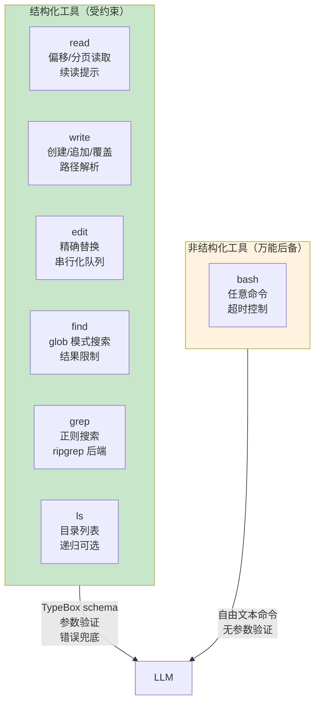

# 第 19 章：工具设计原则 — 约束即保护

> **定位**：本章总论 pi 的工具设计哲学 — 为什么给 LLM 的接口越受约束，犯错越少。
> 前置依赖：第 9 章（工具执行管道）。
> 适用场景：当你想理解 pi 为什么有 7 个专用工具而不是只给一个 bash。

## 为什么不只给一个 bash？

这是本章的核心设计问题。

理论上，bash 能做一切 — 读文件用 `cat`、写文件用 `echo >`、搜索用 `grep`、编辑用 `sed`。一个万能工具，LLM 自己组合命令。

但 pi 选择了 7 个专用工具 + bash 作为后备：



设计理由不是"bash 不好"，而是 **LLM 用结构化参数犯的错比用自由文本命令少得多**。

当 LLM 调用 `read({ path: "src/index.ts", offset: 50, limit: 30 })` 时，每个参数都有 TypeBox schema 验证。如果 `offset` 是字符串而非数字，验证立即失败，LLM 在下一轮修正。

当 LLM 拼 `cat src/index.ts | sed -n '50,79p'` 时，任何拼写错误、引号不匹配、管道符遗漏都会导致 bash 报一个模糊的错误，LLM 可能需要多轮才能修正。

## 工具如何定义：`ToolDefinition` 类型

pi 的每个工具都实现 `ToolDefinition` 接口。这是 extension API 层面的工具标准格式 — 不仅内置工具用它，第三方 extension 注册的自定义工具也用同一套接口：

```typescript
// packages/coding-agent/src/core/extensions/types.ts:369-399

export interface ToolDefinition<
  TParams extends TSchema = TSchema,
  TDetails = unknown, TState = any
> {
  name: string;           // 工具名（LLM tool call 中使用）
  label: string;          // UI 显示的可读名称
  description: string;    // 给 LLM 的描述
  promptSnippet?: string; // system prompt 中的一行摘要
  promptGuidelines?: string[]; // 追加到 Guidelines 段落的指引
  parameters: TParams;    // TypeBox schema
  prepareArguments?: (args: unknown) => Static<TParams>;
  execute(
    toolCallId: string, params: Static<TParams>,
    signal: AbortSignal | undefined,
    onUpdate: AgentToolUpdateCallback<TDetails> | undefined,
    ctx: ExtensionContext,
  ): Promise<AgentToolResult<TDetails>>;
  renderCall?: (...) => Component;  // TUI 调用显示
  renderResult?: (...) => Component; // TUI 结果显示
}
```

这个接口的设计要点：

1. **`parameters` 是 TypeBox schema**，不是自由格式 JSON — 框架在调用 `execute` 之前自动做 schema 验证
2. **`prepareArguments` 是兼容性钩子** — 当 LLM 使用旧版参数格式时，在 schema 验证之前转换参数（edit 工具用这个把 `oldText/newText` 转为 `edits[]`，详见第 20 章）
3. **`promptSnippet` 和 `promptGuidelines`** — 工具不仅定义参数，还参与 system prompt 的组装。工具激活时，它的 guidelines 会自动注入到 prompt 中

## 七个工具的 Schema 一览

每个工具的参数定义都是 `Type.Object` — 以下并排展示它们的参数结构，方便看出设计差异：

```typescript
// packages/coding-agent/src/core/tools/read.ts:17-21
const readSchema = Type.Object({
  path: Type.String({ description: "Path to the file to read" }),
  offset: Type.Optional(Type.Number({
    description: "Line number to start reading from (1-indexed)"
  })),
  limit: Type.Optional(Type.Number({
    description: "Maximum number of lines to read"
  })),
});
```

```typescript
// packages/coding-agent/src/core/tools/write.ts:14-17
const writeSchema = Type.Object({
  path: Type.String({ description: "Path to the file to write" }),
  content: Type.String({ description: "Content to write to the file" }),
});
```

```typescript
// packages/coding-agent/src/core/tools/edit.ts:35-44
const editSchema = Type.Object({
  path: Type.String({ description: "Path to the file to edit" }),
  edits: Type.Array(Type.Object({
    oldText: Type.String({ description: "Exact text for one targeted replacement. Must be unique." }),
    newText: Type.String({ description: "Replacement text for this targeted edit." }),
  })),
});
```

```typescript
// packages/coding-agent/src/core/tools/bash.ts:27-30
const bashSchema = Type.Object({
  command: Type.String({ description: "Bash command to execute" }),
  timeout: Type.Optional(Type.Number({ description: "Timeout in seconds" })),
});
```

```typescript
// packages/coding-agent/src/core/tools/find.ts:20-26
const findSchema = Type.Object({
  pattern: Type.String({ description: "Glob pattern to match files" }),
  path: Type.Optional(Type.String({ description: "Directory to search in" })),
  limit: Type.Optional(Type.Number({ description: "Maximum number of results (default: 1000)" })),
});
```

```typescript
// packages/coding-agent/src/core/tools/grep.ts:23-35
const grepSchema = Type.Object({
  pattern: Type.String({ description: "Search pattern (regex or literal)" }),
  path: Type.Optional(Type.String({ description: "Directory or file to search" })),
  glob: Type.Optional(Type.String({ description: "Filter files by glob pattern" })),
  ignoreCase: Type.Optional(Type.Boolean()),
  literal: Type.Optional(Type.Boolean()),
  context: Type.Optional(Type.Number()),
  limit: Type.Optional(Type.Number({ description: "Max matches (default: 100)" })),
});
```

```typescript
// packages/coding-agent/src/core/tools/ls.ts:13-16
const lsSchema = Type.Object({
  path: Type.Optional(Type.String({ description: "Directory to list" })),
  limit: Type.Optional(Type.Number({ description: "Max entries (default: 500)" })),
});
```

注意几个跨工具的设计模式：

- **`path` 参数**：几乎所有工具都有，类型一律是 `Type.String`，路径解析由 `resolveToCwd()` 在 execute 中处理
- **`limit` 参数**：搜索类和列表类工具都有输出数量限制 — 防止 LLM 收到几万行输出
- **bash 是唯一没有 `path` 的工具** — 它接收自由文本 `command`，本质上是结构化程度最低的工具

## `tool-definition-wrapper`：从 extension 到 runtime

pi 有两层工具抽象：`ToolDefinition`（extension API 层）和 `AgentTool`（agent runtime 层）。内置工具定义为 `ToolDefinition`，但 agent runtime 消费的是 `AgentTool`。`wrapToolDefinition` 负责这个转换：

```typescript
// packages/coding-agent/src/core/tools/tool-definition-wrapper.ts:5-18

export function wrapToolDefinition<TDetails = unknown>(
  definition: ToolDefinition<any, TDetails>,
  ctxFactory?: () => ExtensionContext,
): AgentTool<any, TDetails> {
  return {
    name: definition.name,
    label: definition.label,
    description: definition.description,
    parameters: definition.parameters,
    prepareArguments: definition.prepareArguments,
    execute: (toolCallId, params, signal, onUpdate) =>
      definition.execute(
        toolCallId, params, signal, onUpdate,
        ctxFactory?.() as ExtensionContext
      ),
  };
}
```

这个 wrapper 的关键作用是**注入 `ExtensionContext`**。`ToolDefinition.execute` 需要 5 个参数（包括 `ctx`），而 `AgentTool.execute` 只有 4 个。wrapper 在调用时通过 `ctxFactory` 自动注入 context — 让工具定义可以访问当前会话的 cwd、配置等环境信息，而 agent runtime 不需要关心这些细节。

反向也有支持 — `createToolDefinitionFromAgentTool` 把一个 `AgentTool` 包装回 `ToolDefinition`，用于外部提供的工具覆盖需要进入 definition-first 注册表的场景。

## 截断策略：`truncate.ts`

LLM 的 context window 是有限的。当 `read` 读了一个 50000 行的日志，或者 `grep` 匹配了 10000 条结果，把全部输出塞进 tool result 会浪费 token、甚至超出限制。

`truncate.ts` 提供了统一的截断策略，**所有工具共享同一套逻辑**：

```typescript
// packages/coding-agent/src/core/tools/truncate.ts:11-13

export const DEFAULT_MAX_LINES = 2000;
export const DEFAULT_MAX_BYTES = 50 * 1024; // 50KB
export const GREP_MAX_LINE_LENGTH = 500;
```

截断基于两个独立限制 — **先触及的那个生效**：

- **行数限制**（默认 2000 行）：防止行数爆炸
- **字节限制**（默认 50KB）：防止单行超长（如 minified JSON）

两种截断方向对应不同场景：

| 函数 | 方向 | 适用场景 |
|------|------|---------|
| `truncateHead` | 保留开头 | `read`、`find`、`grep` — 文件开头和前 N 条结果通常最有用 |
| `truncateTail` | 保留结尾 | `bash` — 命令输出的最后几行通常包含错误信息或最终结果 |

截断不会产生半行 — `truncateHead` 只保留完整行。如果第一行就超过字节限制，返回空内容并设置 `firstLineExceedsLimit: true`，让上层决定如何提示 LLM。

截断后的 `TruncationResult` 携带完整的元信息（总行数、总字节、输出行数、哪个限制被触发），工具可以据此生成 "Showing 2000 of 45000 lines (truncated)" 这样的提示。

## 具体对比：bash vs 专用工具

以"在项目中搜索所有包含 `TODO` 的 TypeScript 文件"为例，对比两种方式：

**方式 A：LLM 使用 bash**

```json
{ "command": "grep -r 'TODO' --include='*.ts' . | head -100" }
```

问题链：
1. LLM 可能忘记 `--include` 的引号，导致 glob 展开
2. 输出是纯文本，没有结构化的行数限制 — `head -100` 只是近似控制
3. 如果项目有 `node_modules`，grep 会扫描依赖目录，输出爆炸
4. 输出没有截断元信息 — LLM 不知道总共有多少匹配
5. 不同操作系统的 grep 行为可能不同（macOS BSD grep vs GNU grep）

**方式 B：LLM 使用 grep 工具**

```json
{
  "pattern": "TODO",
  "glob": "*.ts",
  "limit": 100
}
```

优势链：
1. 参数是结构化 JSON — `pattern`、`glob`、`limit` 各自独立，不存在引号嵌套问题
2. 后端用 ripgrep（`rg`），自动跳过 `.gitignore` 中的目录
3. `limit` 由工具实现控制，准确地只返回 100 条
4. 输出经过 `truncateHead` 处理，附带 `TruncationResult` 元信息
5. 每行长度被 `GREP_MAX_LINE_LENGTH`（500 字符）截断，防止 minified 文件的匹配行吃掉 context

第二种方式的 token 消耗更可预测，错误更少，LLM 需要的重试次数更低。这就是"约束即保护"的具体含义。

### Pluggable I/O

7 个核心工具都提供了 `Operations` 接口：

```typescript
// packages/coding-agent/src/core/tools/edit.ts:63-70

interface EditOperations {
  readFile: (path: string) => Promise<Buffer>;
  writeFile: (path: string, content: string) => Promise<void>;
  access: (path: string) => Promise<void>;
}
```

默认实现用本地文件系统。但这个接口可以被替换为 SSH、Docker volume、甚至远程 API — 让同一套工具在不同环境中工作。每个工具的 Operations 接口只暴露它需要的最小操作集：

| 工具 | Operations 方法 |
|------|----------------|
| `read` | `readFile`, `access`, `detectImageMimeType?` |
| `write` | `writeFile`, `access`, `mkdirp` |
| `edit` | `readFile`, `writeFile`, `access` |
| `bash` | `exec` |
| `find` | `exists`, `glob` |
| `grep` | `isDirectory`, `readFile` |

## 取舍分析

### 得到了什么

**更低的出错率**。结构化参数 + TypeBox 验证 = LLM 犯错时快速反馈。bash 是后备，不是首选。

**可预测的 token 消耗**。每个工具的输出都经过 `truncate.ts` 的统一截断 — 2000 行或 50KB 的上限确保 tool result 不会意外吃掉大量 context window。

**跨环境一致性**。Pluggable Operations 让工具在本地文件系统、SSH 远程、Docker 容器中行为一致。bash 命令在不同环境中可能有不同的 shell、不同的工具版本，专用工具则抽象了这些差异。

### 放弃了什么

**更多的工具选择负担**。LLM 需要在 7 个工具中选择正确的一个。system prompt 中的工具使用指引（"用 Read 而不是 cat，用 Edit 而不是 sed"）帮助 LLM 做出选择。

**灵活性受限**。有些操作在 bash 中一行命令就能完成（如 `wc -l *.ts | sort -n`），但没有对应的专用工具。pi 的策略是：对于**高频且容易出错**的操作（读、写、编辑、搜索）提供专用工具，其他操作留给 bash。

---

### 版本演化说明
> 本章核心分析基于 pi-mono v0.66.0。7 个核心工具是逐步从 bash 中分离出来的 —
> 早期版本只有 bash + read + edit，后来加入 write、find、grep、ls。
> `ToolDefinition` 接口是在 extension 系统（第 15 章）引入后统一的，
> 之前内置工具直接实现 `AgentTool` 接口。
