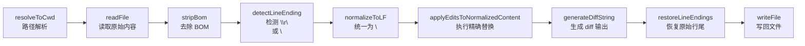

# 第 20 章：`edit` 的设计 — 为什么不能直接写文件

> **定位**：本章深入 edit 工具 — pi 工具设计原则的最佳体现。
> 前置依赖：第 19 章（工具设计原则）。
> 适用场景：当你想理解为什么编辑操作要用精确替换而非行号，或者想理解并发文件写入的安全性。

## 为什么不让 LLM 直接 write 整个文件？

这是本章的核心设计问题。

最简单的编辑方式是"读出来 → 改 → 写回去"。但 LLM 生成的"改后全文"可能遗漏原文的部分内容、改变缩进、引入多余的空行。文件越大，出错概率越高。

pi 的 edit 工具用**精确替换**（oldText → newText）而非全文重写。

## 完整的 `editSchema`

edit 的参数定义是所有工具中最复杂的 — 它有嵌套的数组结构：

```typescript
// packages/coding-agent/src/core/tools/edit.ts:24-44

const replaceEditSchema = Type.Object(
  {
    oldText: Type.String({
      description: "Exact text for one targeted replacement. "
        + "It must be unique in the original file and must not "
        + "overlap with any other edits[].oldText in the same call.",
    }),
    newText: Type.String({
      description: "Replacement text for this targeted edit.",
    }),
  },
  { additionalProperties: false },
);

const editSchema = Type.Object(
  {
    path: Type.String({
      description: "Path to the file to edit (relative or absolute)",
    }),
    edits: Type.Array(replaceEditSchema, {
      description: "One or more targeted replacements. Each edit is "
        + "matched against the original file, not incrementally.",
    }),
  },
  { additionalProperties: false },
);
```

`description` 中的约束条件是给 LLM 看的设计文档 — 它们告诉 LLM：

1. **`oldText` 必须在文件中唯一** — 如果存在多处匹配，操作会失败
2. **多个 edit 不能重叠** — 避免替换冲突
3. **所有 edit 基于原始文件匹配，不是递增的** — 第二个 edit 看到的是原文，不是第一个 edit 修改后的结果
4. **`additionalProperties: false`** — TypeBox 验证会拒绝任何多余字段

## 执行流水线

edit 操作从参数到写入文件经过一条精确的流水线。每个步骤都有明确的职责：



为什么需要这么多步骤？因为 LLM 生成的 `oldText` 不会包含 BOM 或 `\r\n` — 它只会生成 `\n` 换行。如果直接在原始内容中搜索 `oldText`，Windows 风格的文件几乎一定匹配失败。

流水线的核心是**先归一化、再匹配、再恢复**：

```
原始文件（可能有 BOM、\r\n）
  ↓ stripBom + normalizeToLF
归一化内容（纯 \n）
  ↓ applyEditsToNormalizedContent（在归一化空间中匹配和替换）
修改后内容（纯 \n）
  ↓ restoreLineEndings（如果原始文件用 \r\n，恢复回去）
最终内容（保持原始行尾风格）
  ↓ writeFile
```

这样 LLM 不需要关心目标文件是 Unix 还是 Windows 格式 — 框架自动处理。

## `edit-diff.ts`：行尾归一化与 fuzzy matching

edit-diff.ts 是 edit 工具的核心算法模块。除了行尾归一化，它还实现了**模糊匹配**：

```typescript
// packages/coding-agent/src/core/tools/edit-diff.ts:34-55

export function normalizeForFuzzyMatch(text: string): string {
  return (
    text
      .normalize("NFKC")
      .split("\n").map((line) => line.trimEnd()).join("\n")
      // Smart single quotes → '
      .replace(/[\u2018\u2019\u201A\u201B]/g, "'")
      // Smart double quotes → "
      .replace(/[\u201C\u201D\u201E\u201F]/g, '"')
      // Various dashes/hyphens → -
      .replace(/[\u2010-\u2015\u2212]/g, "-")
      // Special spaces → regular space
      .replace(/[\u00A0\u2002-\u200A\u202F\u205F\u3000]/g, " ")
  );
}
```

为什么需要 fuzzy matching？因为 LLM 经常在输出中用 smart quotes（`""`）代替 ASCII quotes（`""`），或者在行尾多加空格。`normalizeForFuzzyMatch` 对两端都做归一化，消除这类微小差异。

匹配策略是**精确优先、模糊兜底**：

```typescript
// packages/coding-agent/src/core/tools/edit-diff.ts:96-134

export function fuzzyFindText(content: string, oldText: string)
  : FuzzyMatchResult {
  // 先尝试精确匹配
  const exactIndex = content.indexOf(oldText);
  if (exactIndex !== -1) {
    return { found: true, index: exactIndex, ... ,
             usedFuzzyMatch: false };
  }
  // 精确匹配失败，尝试模糊匹配
  const fuzzyContent = normalizeForFuzzyMatch(content);
  const fuzzyOldText = normalizeForFuzzyMatch(oldText);
  const fuzzyIndex = fuzzyContent.indexOf(fuzzyOldText);
  if (fuzzyIndex === -1) {
    return { found: false, ... };
  }
  return { found: true, index: fuzzyIndex, ... ,
           usedFuzzyMatch: true };
}
```

`applyEditsToNormalizedContent` 是多 edit 替换的核心。它的设计确保了多个 edit 不会互相干扰：

```typescript
// packages/coding-agent/src/core/tools/edit-diff.ts:193-260（简化）

export function applyEditsToNormalizedContent(
  normalizedContent: string, edits: Edit[], path: string,
): AppliedEditsResult {
  // 1. 所有 edit 的 oldText/newText 归一化为 LF
  // 2. 验证：oldText 不能为空
  // 3. 每个 edit 在原始内容中匹配（不是递增）
  // 4. 验证：每个 oldText 必须唯一（出现次数 === 1）
  // 5. 按匹配位置排序
  // 6. 检测重叠：相邻 edit 的匹配范围不能交叉
  // 7. 从后往前替换（reverse order），保持前面的偏移量不变
  return { baseContent, newContent };
}
```

从后往前替换是关键技巧 — 替换后面的文本不会改变前面文本的偏移量，所以所有 edit 可以安全地使用它们在原始内容中匹配到的位置。

`generateDiffString` 生成带行号的 unified diff，返回给 LLM 作为 tool result。它还返回 `firstChangedLine` — 用于 TUI 中自动跳转到修改位置：

```typescript
// packages/coding-agent/src/core/tools/edit-diff.ts:266-270

export function generateDiffString(
  oldContent: string, newContent: string, contextLines = 4,
): { diff: string; firstChangedLine: number | undefined } {
  // 使用 `diff` 库的 diffLines 计算差异
  // 输出格式：+行号 添加的行 / -行号 删除的行 / 空格行号 上下文
```

## `file-mutation-queue`：并发安全

当 LLM 在 parallel 模式下同时发起多个 edit 调用（比如"同时修改 3 个文件"），可能有两个 edit 操作指向同一个文件。`file-mutation-queue` 确保同一个文件的写操作被串行化：

```typescript
// packages/coding-agent/src/core/tools/file-mutation-queue.ts:1-39

const fileMutationQueues = new Map<string, Promise<void>>();

function getMutationQueueKey(filePath: string): string {
  const resolvedPath = resolve(filePath);
  try {
    return realpathSync.native(resolvedPath); // 解析符号链接
  } catch {
    return resolvedPath;
  }
}

export async function withFileMutationQueue<T>(
  filePath: string, fn: () => Promise<T>,
): Promise<T> {
  const key = getMutationQueueKey(filePath);
  const currentQueue = fileMutationQueues.get(key)
    ?? Promise.resolve();

  let releaseNext!: () => void;
  const nextQueue = new Promise<void>((resolve) => {
    releaseNext = resolve;
  });
  const chainedQueue = currentQueue.then(() => nextQueue);
  fileMutationQueues.set(key, chainedQueue);

  await currentQueue;        // 等前一个操作完成
  try {
    return await fn();       // 执行本次操作
  } finally {
    releaseNext();           // 释放锁，让下一个操作开始
    if (fileMutationQueues.get(key) === chainedQueue) {
      fileMutationQueues.delete(key); // 清理：没有后续排队时删除条目
    }
  }
}
```

这 39 行代码是整个 `file-mutation-queue.ts` 的全部。设计要点：

1. **基于 Promise 链的无锁串行化** — 不用 mutex，用 Promise 的 `.then()` 链来排队
2. **`realpathSync.native` 解析符号链接** — 确保 `./src/foo.ts` 和 `../project/src/foo.ts` 如果指向同一个文件，用同一个锁
3. **自动清理** — 当没有后续操作排队时删除 Map 条目，避免内存泄漏
4. **不同文件仍然并行** — 只有指向同一文件的操作才串行

## 具体示例：一次 edit 操作的前后

假设 LLM 要在 `src/config.ts` 中把默认超时从 30 秒改为 60 秒。

**文件原始内容：**

```typescript
// src/config.ts
export const DEFAULT_CONFIG = {
  timeout: 30_000,
  retries: 3,
  baseUrl: "https://api.example.com",
};
```

**LLM 发出的 tool call：**

```json
{
  "path": "src/config.ts",
  "edits": [{
    "oldText": "  timeout: 30_000,",
    "newText": "  timeout: 60_000,  // increased for slow networks"
  }]
}
```

**执行过程：**

1. `resolveToCwd("src/config.ts", cwd)` → `/home/user/project/src/config.ts`
2. `readFile` 读取原始内容
3. `stripBom` — 无 BOM，跳过
4. `detectLineEnding` → `"\n"`（Unix 格式）
5. `normalizeToLF` — 已经是 LF，无变化
6. `applyEditsToNormalizedContent` — 在内容中找到 `"  timeout: 30_000,"` 的唯一匹配，替换
7. `generateDiffString` 生成输出：

```diff
  ...
  2 export const DEFAULT_CONFIG = {
- 3   timeout: 30_000,
+ 3   timeout: 60_000,  // increased for slow networks
  4   retries: 3,
  ...
```

8. `restoreLineEndings` — 原始是 LF，无变化
9. `writeFile` 写回文件

返回给 LLM 的 tool result 包含 diff 文本和 `firstChangedLine: 3`。

**如果匹配失败的情况：**

假设 LLM 的 `oldText` 写成了 `"timeout: 30000,"` — 注意缺少缩进和下划线。精确匹配会失败，然后 fuzzy matching 也找不到（因为 `30000` 和 `30_000` 的差异不在模糊匹配的覆盖范围内）。此时 `applyEditsToNormalizedContent` 抛出：

```
Could not find the exact text in src/config.ts. The old text must
match exactly including all whitespace and newlines.
```

这个错误消息被返回给 LLM，LLM 可以用 `read` 重新查看文件内容，然后用正确的文本重试。

## Legacy API 兼容：`prepareArguments`

edit 工具的 `prepareArguments` 钩子处理一个历史遗留问题。早期的 API 使用顶层的 `oldText` / `newText` 参数而非 `edits[]` 数组：

```typescript
// packages/coding-agent/src/core/tools/edit.ts:83-97

function prepareEditArguments(input: unknown): EditToolInput {
  if (!input || typeof input !== "object") {
    return input as EditToolInput;
  }
  const args = input as LegacyEditToolInput;
  if (typeof args.oldText !== "string"
    || typeof args.newText !== "string") {
    return input as EditToolInput;
  }
  // 把旧格式的 oldText/newText 合并到 edits 数组
  const edits = Array.isArray(args.edits)
    ? [...args.edits] : [];
  edits.push({ oldText: args.oldText, newText: args.newText });
  const { oldText: _oldText, newText: _newText, ...rest } = args;
  return { ...rest, edits } as EditToolInput;
}
```

这个函数在 schema 验证**之前**运行（见第 9 章 `prepareArguments` 钩子）。它检测旧格式并转换为新格式：

```
旧格式：{ path, oldText, newText }
          ↓ prepareEditArguments
新格式：{ path, edits: [{ oldText, newText }] }
```

甚至支持混合格式 — 如果 LLM 同时传了 `edits[]` 和顶层 `oldText/newText`，两者会合并。这种宽容的输入处理让 API 升级不会破坏已有的 LLM 行为。

## `EditOperations`：Pluggable I/O

edit 工具通过 `EditOperations` 接口抽象了文件 I/O：

```typescript
// packages/coding-agent/src/core/tools/edit.ts:63-76

export interface EditOperations {
  readFile: (absolutePath: string) => Promise<Buffer>;
  writeFile: (absolutePath: string, content: string) => Promise<void>;
  access: (absolutePath: string) => Promise<void>;
}

const defaultEditOperations: EditOperations = {
  readFile: (path) => fsReadFile(path),
  writeFile: (path, content) => fsWriteFile(path, content, "utf-8"),
  access: (path) => fsAccess(path, constants.R_OK | constants.W_OK),
};
```

默认实现用 Node.js 的 `fs/promises`。替换场景包括：

- **SSH 远程编辑** — `readFile` 通过 SSH 读取，`writeFile` 通过 SSH 写入
- **Docker 容器** — 通过 Docker API 读写容器内的文件
- **测试** — 注入 mock 实现，不接触真实文件系统

## 取舍分析

### 得到了什么

**几乎消除"写错文件"的可能**。精确替换要求 LLM 准确引用原文（`oldText` 必须在文件中唯一存在）。如果 LLM 引用了不存在的文本，操作失败并返回清晰的错误。

**并发安全**。`file-mutation-queue` 用 39 行代码解决了并行 edit 的竞态条件，且不同文件仍然并行 — 只有同文件操作才串行。

**跨平台行尾处理**。BOM 剥离 + LF 归一化 + 行尾恢复的流水线让 LLM 不需要关心文件的行尾格式，减少了一整类匹配失败。

### 放弃了什么

**限制了模型的表达方式**。有时 LLM 想"删除第 42 到 50 行" — 但 edit 工具不支持行号操作，必须把那些行的内容作为 `oldText` 传入。这要求 LLM 先读文件、再精确引用。

**大范围重构不友好**。如果要修改一个文件的 20 处不同位置，需要 20 个 edit 条目，每个 `oldText` 都必须足够长以确保唯一性。这种场景下 `write` 工具（全文重写）可能更合适。

---

### 版本演化说明
> 本章核心分析基于 pi-mono v0.66.0。Edit 工具从"行号编辑"演变为"精确替换"
> 是一个重要的设计转变 — `prepareArguments` 钩子（第 9 章）就是为了兼容旧版 API 而添加的。
> 多 edit 支持（`edits[]` 数组）是后续迭代中加入的，早期只支持单次 `oldText` → `newText`。
