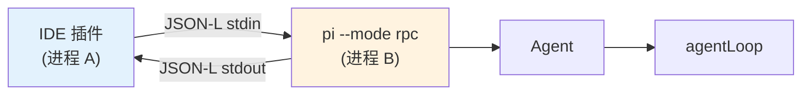

# 第 26 章：RPC 模式 — pi 作为后端服务

> **定位**：本章解析 pi 的 RPC 模式 — 让 CLI 工具可以被其他进程驱动。
> 前置依赖：第 10 章（Agent 类）。
> 适用场景：当你想把 pi 集成到 IDE 插件、Web 前端或自动化管道中。

## 为什么 CLI 工具需要 RPC 模式？

pi 的主要界面是终端 TUI（第 24 章）。但有些场景不需要终端交互：

- **IDE 插件**：VS Code extension 需要通过进程间通信驱动 pi
- **Web 前端**：浏览器客户端需要通过 HTTP 或 WebSocket 驱动 pi
- **自动化管道**：CI/CD 脚本需要非交互式地使用 pi

RPC 模式（`packages/coding-agent/src/modes/rpc/`）提供了一个 JSON-L 协议，让外部进程可以：

1. 发送 prompt 和 steer/follow-up 请求
2. 接收流式事件（和 Agent 事件一一对应）
3. 切换模型、调整 thinking level
4. 管理会话（创建、切换、fork、导出）



RPC 模式和 interactive 模式共享同一个 Agent 实例（第 10 章）。不同的只是事件的消费方式 — interactive 模式渲染到终端，RPC 模式序列化成 JSON-L 输出到 stdout。

## 协议设计：JSON Lines over stdio

RPC 使用 JSON Lines 协议 — 每条消息是一行 JSON，以换行符分隔。选择 JSON-L over stdio 而非 HTTP/WebSocket 的理由：

1. **零配置**。不需要端口分配、不需要 TLS、不需要服务发现
2. **进程生命周期绑定**。父进程退出时子进程的 stdin 关闭，RPC 会话自然终止
3. **双向通信**。stdin 发命令，stdout 收响应和事件
4. **调试友好**。JSON Lines 可以用 `jq` 解析，管道可以用 `tee` 录制

## RPC 命令类型

命令通过 stdin 发送，每条命令是一个 JSON 对象，必须包含 `type` 字段：

```typescript
// packages/coding-agent/src/modes/rpc/rpc-types.ts:19-68
export type RpcCommand =
  // Prompting
  | { id?: string; type: "prompt"; message: string;
      images?: ImageContent[];
      streamingBehavior?: "steer" | "followUp" }
  | { id?: string; type: "steer"; message: string;
      images?: ImageContent[] }
  | { id?: string; type: "follow_up"; message: string;
      images?: ImageContent[] }
  | { id?: string; type: "abort" }
  | { id?: string; type: "new_session";
      parentSession?: string }

  // Model
  | { id?: string; type: "set_model";
      provider: string; modelId: string }
  | { id?: string; type: "cycle_model" }
  | { id?: string; type: "get_available_models" }

  // Thinking
  | { id?: string; type: "set_thinking_level";
      level: ThinkingLevel }

  // Session
  | { id?: string; type: "get_session_stats" }
  | { id?: string; type: "export_html";
      outputPath?: string }
  | { id?: string; type: "fork"; entryId: string }
  | { id?: string; type: "get_messages" }

  // ... 更多命令类型
```

几个设计要点：

**`id` 是可选的**。客户端可以为每条命令指定一个 correlation ID，响应会带上同一个 ID，让客户端可以匹配请求和响应。对于不需要匹配的场景（比如 fire-and-forget 的 abort），可以省略 ID。

**prompt 的三种变体**。`prompt` 是标准请求；`steer` 在 agent 思考过程中插入修正；`follow_up` 在 agent 完成后追加问题。这三种操作对应 Agent API 中不同的消息队列，RPC 直接暴露了这个区分。

**`streamingBehavior`**。`prompt` 命令可以指定 `streamingBehavior: "steer"` 或 `"followUp"`，让客户端控制当 agent 正在处理时新消息应该进入哪个队列。这和 interactive 模式中的"用户在 agent 思考时输入新消息"是同一个语义。

## RPC 响应类型

响应通过 stdout 发送，所有响应共享统一的信封格式：

```typescript
// packages/coding-agent/src/modes/rpc/rpc-types.ts:110-204
export type RpcResponse =
  // 成功响应 (部分)
  | { id?: string; type: "response"; command: "prompt";
      success: true }
  | { id?: string; type: "response"; command: "get_state";
      success: true; data: RpcSessionState }
  | { id?: string; type: "response"; command: "set_model";
      success: true; data: Model<any> }
  | { id?: string; type: "response"; command: "bash";
      success: true; data: BashResult }
  | { id?: string; type: "response"; command: "get_messages";
      success: true; data: { messages: AgentMessage[] } }

  // 错误响应 (任何命令都可能失败)
  | { id?: string; type: "response"; command: string;
      success: false; error: string };
```

响应的 TypeScript 类型是一个 discriminated union — 每种命令有自己的成功响应类型（带不同的 `data` 结构），但所有命令共享同一个错误响应类型。这让客户端可以先检查 `success` 字段，再根据 `command` 字段解析 `data`。

**异步命令和同步命令的区别**。`prompt`、`steer`、`follow_up` 的成功响应不包含 data — 因为这些操作是异步的，真正的结果通过后续的事件流（AgentSessionEvent）传递。`get_state`、`get_messages` 是同步查询，结果直接在响应的 `data` 中返回。

## 会话状态

```typescript
// packages/coding-agent/src/modes/rpc/rpc-types.ts:90-103
export interface RpcSessionState {
  model?: Model<any>;
  thinkingLevel: ThinkingLevel;
  isStreaming: boolean;
  isCompacting: boolean;
  steeringMode: "all" | "one-at-a-time";
  followUpMode: "all" | "one-at-a-time";
  sessionFile?: string;
  sessionId: string;
  sessionName?: string;
  autoCompactionEnabled: boolean;
  messageCount: number;
  pendingMessageCount: number;
}
```

`RpcSessionState` 是 RPC 客户端了解 agent 状态的主要手段。通过 `get_state` 命令获取，包含了 UI 渲染需要的全部信息：当前模型、是否在流式输出、队列中有多少待处理消息。

`steeringMode` 和 `followUpMode` 控制消息队列的行为：`"all"` 表示累积所有消息一起处理，`"one-at-a-time"` 表示逐条处理。这影响了 IDE 插件的 UX 设计 — 如果用户快速发送多条消息，客户端可以选择是让它们排队还是合并。

## 会话管理

RPC 提供了完整的会话管理能力：

- **`new_session`**：创建新会话，可选地从指定父会话继承上下文
- **`switch_session`**：切换到已有会话
- **`fork`**：从指定消息处分叉对话（类似 git branch）
- **`get_fork_messages`**：获取可用于 fork 的消息列表
- **`export_html`**：导出当前会话为 HTML 文件
- **`set_session_name`**：给会话命名

`fork` 操作是一个高级功能 — 用户可以回到对话中的某个节点，从那里开始新的对话分支。这在 interactive 模式中通过 TUI 交互实现，在 RPC 模式中通过 `fork` 命令 + `entryId` 参数实现。`get_fork_messages` 返回可 fork 的消息列表和它们的 ID。

## Extension UI 桥接

RPC 模式需要处理一个特殊问题：extension 的 UI 交互。在 interactive 模式中，extension 通过 UI context 的 `select()`、`confirm()`、`input()`、`notify()`、`setStatus()`、`editor()` 等方法与用户交互。但 RPC 模式没有 TUI — 这些交互需要被序列化为 JSON 请求，发送给 RPC 客户端处理。

```typescript
// packages/coding-agent/src/modes/rpc/rpc-types.ts:211-246
export type RpcExtensionUIRequest =
  | { type: "extension_ui_request"; id: string;
      method: "select"; title: string;
      options: string[]; timeout?: number }
  | { type: "extension_ui_request"; id: string;
      method: "confirm"; title: string;
      message: string; timeout?: number }
  | { type: "extension_ui_request"; id: string;
      method: "input"; title: string;
      placeholder?: string; timeout?: number }
  | { type: "extension_ui_request"; id: string;
      method: "editor"; title: string;
      prefill?: string }
  | { type: "extension_ui_request"; id: string;
      method: "notify"; message: string;
      notifyType?: "info" | "warning" | "error" }
  | { type: "extension_ui_request"; id: string;
      method: "setStatus"; statusKey: string;
      statusText: string | undefined }
  | { type: "extension_ui_request"; id: string;
      method: "setWidget"; widgetKey: string;
      widgetLines: string[] | undefined }
  | { type: "extension_ui_request"; id: string;
      method: "set_editor_text"; text: string }
```

流程是：extension 发起 UI 请求 → RPC 层序列化为 `RpcExtensionUIRequest` 输出到 stdout → 客户端展示 UI → 客户端发送 `RpcExtensionUIResponse` 到 stdin → RPC 层传回 extension。

```typescript
// packages/coding-agent/src/modes/rpc/rpc-types.ts:253-256
export type RpcExtensionUIResponse =
  | { type: "extension_ui_response"; id: string;
      value: string }
  | { type: "extension_ui_response"; id: string;
      confirmed: boolean }
  | { type: "extension_ui_response"; id: string;
      cancelled: true };
```

这是一个完整的 UI 代理模式 — extension 不知道也不关心 UI 是在终端还是在浏览器中渲染的。

## RPC 模式的启动

```typescript
// packages/coding-agent/src/modes/rpc/rpc-mode.ts:46-53
export async function runRpcMode(
  runtimeHost: AgentSessionRuntime
): Promise<never> {
  takeOverStdout();
  let session = runtimeHost.session;
  let unsubscribe: (() => void) | undefined;

  const output = (
    obj: RpcResponse | RpcExtensionUIRequest | object
  ) => {
    writeRawStdout(serializeJsonLine(obj));
  };
```

`takeOverStdout()` 劫持了 `console.log` 和 `process.stdout.write`，防止其他代码意外向 stdout 写入非 JSON 内容。这是 RPC 模式的核心防御 — stdout 是协议通道，任何非 JSON 输出都会破坏客户端的解析。

`writeRawStdout` 绕过了劫持层直接写入 stdout。只有 RPC 层自己可以往 stdout 写数据。

## Pending Extension Requests

```typescript
// packages/coding-agent/src/modes/rpc/rpc-mode.ts:71-74
const pendingExtensionRequests = new Map<
  string,
  { resolve: (value: any) => void;
    reject: (error: Error) => void }
>();
```

Extension UI 请求是异步的 — RPC 层发送请求后需要等待客户端响应。`pendingExtensionRequests` Map 以请求 ID 为 key 保存了 Promise 的 resolve/reject 回调。当客户端的 `extension_ui_response` 到达时，查找对应的 pending request 并 resolve。

这个 Map 也处理了超时和取消 — 如果 extension 设置了 timeout，超时后 pending request 会被 reject；如果客户端发送 `cancelled: true`，request 也会被相应处理。

## Agent API 到 RPC 的映射

RPC 命令和 Agent API 的对应关系：

| RPC Command | Agent API |
|---|---|
| `prompt` | `session.prompt()` |
| `steer` | `session.steer()` |
| `follow_up` | `session.followUp()` |
| `abort` | `session.abort()` |
| `set_model` | `session.setModel()` |
| `compact` | `session.compact()` |
| `get_messages` | `session.getMessages()` |
| `bash` | direct bash execution |
| `fork` | `session.fork()` |

这个映射几乎是一对一的。RPC 层不添加业务逻辑 — 它只做序列化/反序列化和 stdout 保护。这种薄层设计让 RPC 的行为和 interactive 模式完全一致。

## 取舍分析

### 得到了什么

**pi 可以被任何前端驱动**。同一个 agent 内核，终端用户通过 TUI 交互，IDE 用户通过 RPC 交互。代码复用，行为一致。

**Extension UI 的透明代理**。Extension 不需要为不同的 UI 后端写不同的代码 — RPC 层自动桥接 UI 交互。

### 放弃了什么

**增加了一个运行模式的维护成本**。RPC 协议需要版本管理、backward compatibility、错误序列化。每次 Agent API 变化，RPC 层都需要同步更新。

**stdout 污染是隐蔽的 bug 源**。任何第三方库的 `console.log` 都可能破坏 RPC 协议。`takeOverStdout` 是必要的防御，但它也让调试变得更困难 — 你不能用 `console.log` 来 debug RPC 模式。

---

### 版本演化说明
> 本章核心分析基于 pi-mono v0.66.0。RPC 模式为 IDE 集成而创建，
> 支持的操作类型随 IDE 插件的需求不断扩展。Extension UI 桥接
> 是较晚添加的能力，早期版本的 RPC 不支持 extension 的 UI 交互。
