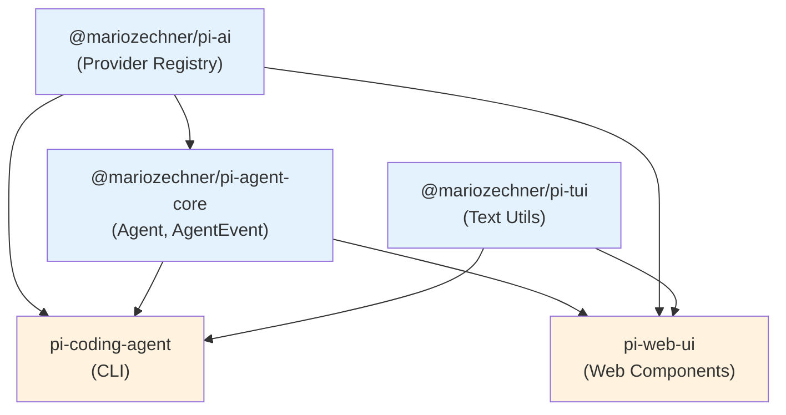

# 第 27 章：`pi-web-ui` — 浏览器里的复用

> **定位**：本章解析 Web UI 如何复用 pi-agent-core 的 Agent 抽象和 pi-ai 的 provider 层。
> 前置依赖：第 4 章（Provider Registry）、第 24 章（pi-tui）。
> 适用场景：当你想理解 pi 的 Web 组件库。

## 浏览器里的 pi

`pi-web-ui` 是一组 Lit Web Components + Tailwind CSS 构建的可复用组件：聊天消息、模型选择器、文档预览（docx、pdf、xlsx）。

它不是一个完整的 Web 应用 — 而是一个组件库，可以被嵌入到任何 Web 页面中。它直接使用 pi-agent-core 的 `Agent` 类驱动 LLM 交互，订阅 `AgentEvent` 事件更新 UI，不需要中间的 Node.js 后端。

技术选型理由：Lit Web Components 是浏览器原生的组件模型（基于 Custom Elements 和 Shadow DOM），不依赖 React/Vue 等框架。这让 pi-web-ui 的组件可以在任何 Web 环境中使用。

## 依赖图谱

```json
// packages/web-ui/package.json:19-29 (dependencies)
{
  "@lmstudio/sdk": "^1.5.0",
  "@mariozechner/pi-ai": "^0.66.0",
  "@mariozechner/pi-tui": "^0.66.0",
  "docx-preview": "^0.3.7",
  "jszip": "^3.10.1",
  "lucide": "^0.544.0",
  "ollama": "^0.6.0",
  "pdfjs-dist": "5.4.394",
  "xlsx": "https://cdn.sheetjs.com/xlsx-0.20.3/xlsx-0.20.3.tgz"
}
```

这个依赖列表透露了 pi-web-ui 的四个能力层：

**1. LLM 连接层**。`@mariozechner/pi-ai` 提供统一的 provider 抽象。`@lmstudio/sdk` 和 `ollama` 是本地 LLM 的直接 SDK — 和 pi-ai 的 provider registry 配合，让 Web UI 可以连接 OpenAI、Anthropic、本地 Ollama、LM Studio 等任何 pi-ai 支持的 provider。

**2. 文档预览层**。`pdfjs-dist`（Mozilla 的 PDF 渲染引擎）、`docx-preview`（Word 文档预览）、`xlsx`（Excel 文件解析）。这三个库让 Web UI 可以在浏览器中预览用户上传的文档 — 不需要服务端转换。

**3. UI 层**。`lucide` 提供图标集，和 Tailwind CSS 配合构建界面。

**4. 工具层**。`jszip` 用于处理压缩文件（docx、xlsx 本质上是 ZIP 包），`@mariozechner/pi-tui` 复用了 TUI 包中的一些工具函数（比如文本处理、颜色计算）。

## Peer Dependencies：框架选择

```json
// packages/web-ui/package.json:32-35
{
  "peerDependencies": {
    "@mariozechner/mini-lit": "^0.2.0",
    "lit": "^3.3.1"
  }
}
```

`mini-lit` 是 pi-mono 内部的 Lit 轻量封装，提供了简化的组件定义语法。作为 peer dependency 而非 direct dependency，让使用方可以控制 Lit 和 mini-lit 的版本，避免依赖冲突。

## 连接 pi-ai Provider

pi-web-ui 直接导入并使用 pi-ai 的 provider API：

```typescript
// packages/web-ui/src/dialogs/ProvidersModelsTab.ts:3
import { getProviders } from "@mariozechner/pi-ai";

// packages/web-ui/src/dialogs/ModelSelector.ts:6
import {
  getModels, getProviders, type Model, modelsAreEqual
} from "@mariozechner/pi-ai";
```

这意味着 pi-web-ui 中的模型选择器和 CLI 中的模型选择器使用**完全相同的 provider 注册表**。当 pi-ai 新增一个 provider（比如 Google Gemini），Web UI 和 CLI 同时获得支持，不需要任何额外代码。

这是第 4 章 Provider Registry 设计的直接回报 — 跨平台复用的投资在 Web UI 中变现。

## 组件架构

pi-web-ui 的核心组件继承自 Lit 的 `LitElement`：

```typescript
// packages/web-ui/src/ChatPanel.ts:18
export class ChatPanel extends LitElement { ... }

// packages/web-ui/src/dialogs/SettingsDialog.ts:116
export class SettingsDialog extends LitElement { ... }

// packages/web-ui/src/dialogs/ModelSelector.ts:50
export class ModelSelector extends DialogBase { ... }

// packages/web-ui/src/dialogs/AttachmentOverlay.ts:15
export class AttachmentOverlay extends LitElement { ... }
```

`DialogBase` 是所有对话框的基类，封装了打开/关闭动画、backdrop 点击关闭、焦点管理等通用逻辑。具体的对话框只需要实现内容渲染。

主要组件包括：

- **`ChatPanel`**：聊天界面的核心面板，管理消息列表和输入框
- **`SettingsDialog`**：设置对话框，包含 API Keys 管理、代理配置
- **`ModelSelector`**：模型选择器，从 pi-ai 获取可用模型列表
- **`AttachmentOverlay`**：附件预览覆盖层，支持多种文档格式
- **`SessionListDialog`**：会话列表管理
- **`CustomProviderDialog`**：自定义 provider 配置

## 文档预览能力

`AttachmentOverlay` 是 pi-web-ui 中最能体现"浏览器优势"的组件。它支持六种文件类型的预览：

```typescript
// packages/web-ui/src/dialogs/AttachmentOverlay.ts:13
type FileType =
  "image" | "pdf" | "docx" | "pptx" | "excel" | "text";
```

文件类型检测通过 MIME type 和文件扩展名双重判断：

```typescript
// packages/web-ui/src/dialogs/AttachmentOverlay.ts:55-74
private getFileType(): FileType {
  if (!this.attachment) return "text";
  if (this.attachment.type === "image") return "image";
  if (this.attachment.mimeType === "application/pdf")
    return "pdf";
  if (this.attachment.mimeType?.includes("wordprocessingml"))
    return "docx";
  if (this.attachment.mimeType?.includes("presentationml") ||
      this.attachment.fileName.toLowerCase()
        .endsWith(".pptx"))
    return "pptx";
  if (this.attachment.mimeType?.includes("spreadsheetml") ||
      this.attachment.mimeType?.includes("ms-excel") ||
      this.attachment.fileName.toLowerCase()
        .endsWith(".xlsx") ||
      this.attachment.fileName.toLowerCase()
        .endsWith(".xls"))
    return "excel";
  return "text";
}
```

每种文件类型使用不同的渲染策略：

**PDF 渲染**使用 `pdfjs-dist`。逐页渲染到 Canvas 元素，支持缩放和滚动。`pdfjs-dist` 是 Mozilla 维护的 PDF 渲染引擎，和 Firefox 内置的 PDF 阅读器是同一套代码。

**Word 文档渲染**使用 `docx-preview`。将 `.docx` 文件（本质上是 ZIP 包中的 XML）解析并渲染为 HTML。支持基本的文本格式、表格、图片。

**Excel 渲染**使用 `xlsx`（SheetJS）。解析 `.xlsx` 文件的工作表数据，渲染为 HTML 表格。

这三种预览都在浏览器中完成 — 不需要服务端转换。这对隐私敏感的场景很重要：用户上传的文档不会离开浏览器。

## 存储层

pi-web-ui 有自己的持久化存储层，基于 IndexedDB：

```typescript
// packages/web-ui/src/storage/app-storage.ts:11
export class AppStorage { ... }

// packages/web-ui/src/storage/backends/indexeddb-storage-backend.ts:7
export class IndexedDBStorageBackend
  implements StorageBackend { ... }
```

存储层管理以下数据：

- **Provider API Keys**（`ProviderKeysStore`）：加密存储各个 provider 的 API key
- **Settings**（`SettingsStore`）：用户偏好设置（主题、默认模型等）
- **Sessions**（`SessionsStore`）：对话历史
- **Custom Providers**（`CustomProvidersStore`）：用户配置的自定义 provider

这让 pi-web-ui 可以作为一个独立的 Web 应用运行 — 打开浏览器就能用，不需要 CLI 或后端服务。API key 存储在浏览器的 IndexedDB 中，LLM 调用直接从浏览器发起。

## 构建工具链

```json
// packages/web-ui/package.json:15-17
{
  "build": "tsc -p tsconfig.build.json && " +
    "tailwindcss -i ./src/app.css -o ./dist/app.css --minify",
  "dev": "concurrently ... tsc --watch ... tailwindcss --watch"
}
```

构建分两步：TypeScript 编译（`tsc`）和 Tailwind CSS 生成（`tailwindcss`）。开发模式用 `concurrently` 并行运行两个 watch 进程。

输出是标准的 ES module + CSS 文件：

```json
// packages/web-ui/package.json:8-11
{
  "exports": {
    ".": "./dist/index.js",
    "./app.css": "./dist/app.css"
  }
}
```

使用方导入组件（JS）和样式（CSS）两个入口。组件通过 Web Components 的 Custom Elements 注册，不需要额外的初始化代码。

## 与 CLI 的关系

pi-web-ui 和 pi-coding-agent（CLI）是**并列**的消费者，而非上下游关系：



两者共享 pi-agent-core 的 `Agent` 抽象和 pi-ai 的 provider/模型定义，但各自有独立的 UI 实现。CLI 用终端渲染，Web 用 Lit Web Components。Web UI 的核心组件（`AgentInterface`）直接持有一个 `Agent` 实例，订阅 `AgentEvent` 驱动界面更新。这种架构让 pi 可以同时服务终端用户和 Web 用户，而核心的 agent 交互逻辑只写一次。

## 取舍分析

### 得到了什么

**框架无关**。Lit Web Components 可以嵌入 React、Vue、Angular 或纯 HTML 页面。使用方不需要适配特定的前端框架。

**浏览器端 LLM 调用**。通过 pi-ai 的 provider 抽象，Web UI 可以直接调用 LLM API，不需要后端代理。这简化了部署（一个静态文件服务器就够了）并提升了隐私性。

**丰富的文档预览**。PDF、Word、Excel 的浏览器端预览让用户可以直接查看上传的文档内容，不需要下载或在其他应用中打开。

### 放弃了什么

**Web Components 的生态不如 React**。社区组件、工具链、开发者经验都不如 React 生态丰富。Lit 的学习曲线对于习惯 React 的开发者来说是一个额外成本。

**浏览器端 API key 管理有安全隐患**。API key 存储在 IndexedDB 中，虽然浏览器提供了同源保护，但不如服务端管理安全。对于企业场景，可能需要通过代理服务器转发 API 调用而非直接在浏览器中存储 key。

**依赖体积**。`pdfjs-dist`、`xlsx`、`docx-preview` 这些文档处理库体积不小。如果使用方只需要聊天功能不需要文档预览，仍然需要承载这些依赖的打包体积（除非使用 tree-shaking 和动态导入）。

---

### 版本演化说明
> 本章核心分析基于 pi-mono v0.66.0。pi-web-ui 是 pi-mono 中最年轻的包，
> 仍在快速演进中。文档预览能力（docx、pdf、xlsx、pptx）是近期添加的。
> `@lmstudio/sdk` 和 `ollama` 的集成让 Web UI 可以连接本地运行的 LLM，
> 这对离线使用和隐私敏感场景尤为重要。
