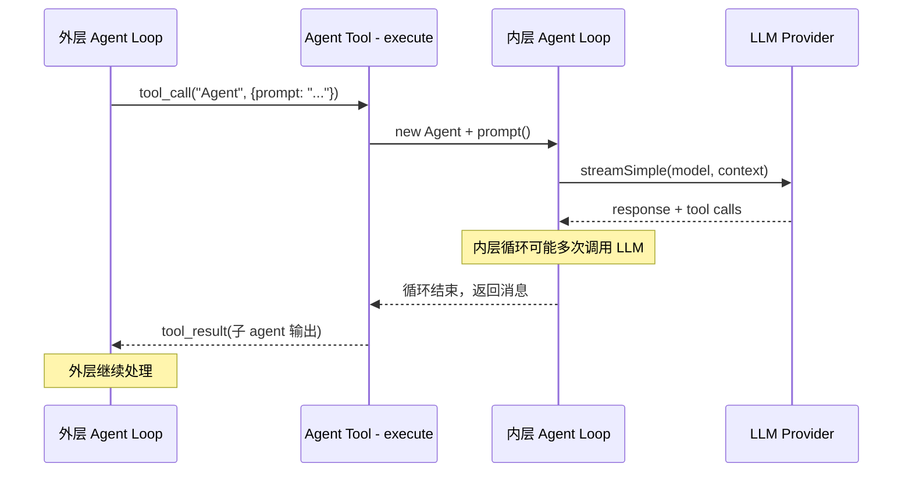

# 第 31 章：反主流选择背后的判断

> **定位**：本章逐个解释 pi 的"不做"决策。
> 前置依赖：第 30 章（极简核心）。
> 适用场景：当你在设计自己的 agent 系统时犹豫"要不要内建 X"。

## 每个"不做"都是一个"用 Y 组合出来"

pi 做出了四个与主流 agent 框架相反的选择：不内建 sub-agents、不内建 MCP、不内建 permission popup、不内建 plan mode。这些选择不是因为缺少资源或没有想到，而是基于一个统一的判断：**如果一个功能可以用更底层的机制组合出来，就不应该把它内建到内核中。**

下面逐个展开。

## 为什么不内建 Sub-agents

### 主流做法

大多数 agent 框架提供"启动子 agent"的 API：

```python
# 假设的框架式 API
orchestrator = Agent(tools=[
    SubAgent("researcher", model="claude-haiku", tools=[search]),
    SubAgent("coder", model="claude-sonnet", tools=[edit, bash]),
])
result = await orchestrator.run("Fix the login bug")
# 框架自动管理子 agent 的生命周期、消息传递、结果汇总
```

这种设计的优势是声明式 — 用户定义 agent 拓扑，框架处理编排细节。

### pi 的做法

pi 不内建 sub-agent 概念。但它可以通过 tool call 组合实现。实际上，pi-coding-agent 中的 `Agent` 工具就是这样实现的：

**Step 1：定义 Agent 工具**

Agent 工具和其他工具（bash、edit、read）一样，都是满足 `AgentTool` 接口的对象：

```typescript
// 概念代码，展示核心逻辑
const agentTool: AgentTool<typeof agentToolSchema> = {
  name: "Agent",
  label: "Agent",
  description: "Delegate a bounded sub-task to another agent run",
  parameters: agentToolSchema,
  async execute(_toolCallId, { prompt }) {
    // Step 2：在工具的 execute 函数里启动新的 agent 循环
    const subAgent = new Agent({
      initialState: {
        systemPrompt: "你是一个专注于子任务的 agent...",
        model: parentAgent.state.model,
        tools: parentAgent.state.tools,  // 复用父 agent 的工具
      },
      convertToLlm,
      getApiKey,
    });

    // Step 3：运行子 agent 循环
    const result = await subAgent.prompt(prompt);

    // Step 4：收集子 agent 的输出作为 tool result 返回
    const output = subAgent.state.messages
      .filter(m => m.role === "assistant")
      .map(m => extractText(m))
      .join("\n");

    return { content: [{ type: "text", text: output }] };
  },
};
```

**Step 2：外层 agent 自然调度**

外层 agent 通过 tool call 调用 Agent 工具。对外层 agent 来说，Agent 工具和 bash 工具没有本质区别 — 都是"发送参数，等待结果"。循环引擎的三阶段管道（prepare → execute → finalize）同样适用。

**Step 3：嵌套的循环引擎**

关键的架构支撑是第 8 章介绍的**循环引擎是可组合的纯函数**。`agentLoop` 没有全局状态，不依赖单例 — 在一个工具的 execute 函数里再启动一个 `agentLoop` 是完全安全的。内层循环有自己的消息列表、自己的回调、自己的停止条件。



### 为什么这样更好？

1. **组合自由**。子 agent 可以用不同的模型、不同的工具集、不同的 system prompt。这不需要框架支持"子 agent 配置" — 只需要在 execute 函数里自由构造
2. **透明的资源管理**。子 agent 的 token 消耗作为工具执行时间的一部分被跟踪。不需要专门的"子 agent 资源计量"机制
3. **自然的错误处理**。子 agent 失败 = 工具执行失败，由外层 agent 的标准错误处理逻辑处理
4. **零新概念**。开发者已经理解了工具调用和 agent 循环，不需要额外学习"sub-agent API"

### 什么时候这样不够好？

当你需要**并行子 agent**（多个子 agent 同时执行不同任务）时，pi 的串行工具执行管道是限制。虽然可以用 `Promise.all` 在一个工具内并行启动多个循环，但这需要产品层自己处理并发控制。CrewAI、AutoGen 等框架的内建并行编排在这种场景下更方便。

## 为什么不内建 MCP

### MCP 是什么

MCP（Model Context Protocol）是 Anthropic 提出的工具标准化协议。它定义了"工具服务器"（MCP server）和"工具客户端"的交互标准，让工具可以跨 agent 框架复用。

### pi 的替代方案

pi 有两层能力扩展机制，覆盖了 MCP 的主要用例：

**Skill（第 16 章）**：纯 markdown 文件，注入 system prompt

```markdown
---
name: tdd-workflow
description: 按 TDD 流程编写代码
---
# TDD Workflow
1. 先写测试
2. 运行测试（应该失败）
3. 写最少的实现代码让测试通过
4. 重构
```

**Extension（第 15 章）**：TypeScript 代码，运行时能力

```typescript
// Extension 可以注册工具、订阅事件、操作 UI
export default {
  name: "my-extension",
  setup(api) {
    api.registerTool({
      name: "my-tool",
      label: "my-tool",
      description: "My custom tool",
      parameters: myToolSchema,
      execute: async (_toolCallId, args) => { /* ... */ },
    });
    api.on("tool_execution_end", (event) => {
      // 监听所有工具执行
    });
  },
};
```

### Skill vs MCP：何时用哪个

| 需求 | Skill | MCP | Extension |
|------|-------|-----|-----------|
| 告诉 LLM 按某个流程工作 | 适合 | 过度设计 | 过度设计 |
| 提供特定领域知识 | 适合 | 过度设计 | 过度设计 |
| 调用外部 API | 不适合 | 适合 | 适合 |
| 操作 agent 内部状态 | 不适合 | 不适合 | 适合 |
| 跨框架复用 | 不适合 | 适合 | 不适合 |
| 修改 UI 行为 | 不适合 | 不适合 | 适合 |

pi 的判断：**大多数 agent 的"能力扩展"不需要运行时代码**。"按 TDD 流程编写代码"用一个 markdown skill 就够了。"代码审查时注意安全问题"也是一个 markdown skill。"连接数据库查询数据"才需要运行时能力 — 而这时 Extension 比 MCP 有更深的系统集成（可以订阅事件、操作 UI、访问会话）。

MCP 的真正价值在**跨框架互操作** — 一个 MCP server 可以同时被 Claude Code、Cursor、pi 使用。但 pi 目前的生态定位是"自己的产品自己的工具"，跨框架互操作不是优先级。

### MCP 的开销

一个 MCP server 意味着：
- 一个独立进程（需要启动、维护、监控）
- JSON-RPC 通信（序列化/反序列化开销）
- 进程间错误处理（超时、崩溃、重连）
- 额外的配置（server 地址、认证）

对于"告诉 LLM 按 TDD 流程工作"这种用例，启动一个 MCP server 就像用大炮打蚊子。Skill 是零开销的 — 它只是一个被读取到 system prompt 中的文件。

## 为什么不内建 Permission Popup

### 主流做法

许多 agent 产品在执行敏感操作前弹出确认框：

```
Agent wants to run: rm -rf node_modules
[Allow] [Deny] [Allow All]
```

这看起来很合理 — 让用户在危险操作前确认。

### pi 的做法

pi 不内建 permission popup。官方 README 的表述就是 “No permission popups”。但 `beforeToolCall` 钩子（第 9 章）让产品层可以实现自己的权限策略。

**策略 1：某个产品壳自行实现确认流**
```typescript
const config: AgentLoopConfig = {
  beforeToolCall: async ({ toolCall, args }) => {
    if (isDangerous(toolCall.name, args)) {
      const confirmed = await confirmDangerousAction(
        `Allow ${toolCall.name}?`
      );
      if (!confirmed) {
        return { block: true, reason: "User denied tool execution" };
      }
    }
    return undefined;  // 允许执行
  },
};
```

**策略 2：命令白名单**
```typescript
const config: AgentLoopConfig = {
  beforeToolCall: async ({ toolCall, args }) => {
    if (toolCall.name === "bash") {
      const cmd = (args as { command: string }).command;
      if (!ALLOWED_COMMANDS.some(p => cmd.startsWith(p))) {
        return { block: true, reason: "Command not in whitelist" };
      }
    }
    return undefined;
  },
};
```

**策略 3：完全自动（mom 的行为）**
```typescript
// mom 在 Docker sandbox 中运行，不需要用户确认
const config: AgentLoopConfig = {
  beforeToolCall: async () => undefined,  // 从不阻止
};
```

**策略 4：基于角色的审批**
```typescript
const config: AgentLoopConfig = {
  beforeToolCall: async ({ toolCall }) => {
    const userRole = getCurrentUserRole();
    if (userRole === "admin") return undefined;
    if (RESTRICTED_TOOLS.includes(toolCall.name)) {
      return { block: true, reason: "Insufficient privileges" };
    }
    return undefined;
  },
};
```

同一个钩子，四种完全不同的安全策略。内建 popup 只能实现第一种。更重要的是，**安全策略和产品形态强相关**：

- CLI：很适合自行实现交互式确认（用户在终端前面）
- Slack bot：用户不在"终端前面"，确认流程需要异步消息
- CI/CD 管道：完全自动，任何人工确认都会打断流水线
- 内部工具：基于角色的权限，不是"每次确认"

内建 popup 假设了一种特定的交互模式。`beforeToolCall` 不做任何假设。

## 为什么不内建 Plan Mode

### 什么是 Plan Mode

Plan mode（先规划再执行）是很多 agent 产品的标配。典型流程：

1. 用户提出任务
2. Agent 生成执行计划（不执行任何工具）
3. 用户审阅计划，确认或修改
4. Agent 按计划逐步执行

### pi 的做法

pi 不内建 plan mode，但 `transformContext` 回调（第 8 章）可以实现它。

`transformContext` 在每次 LLM 调用前执行，可以修改发送给模型的消息列表。Plan mode 的本质就是"在不同阶段注入不同的指令"：

**实现草图：transformContext 版 plan mode**

```typescript
type PlanModeState = "planning" | "reviewing" | "executing";

function createPlanModeConfig(
  getState: () => PlanModeState,
  getPlan: () => string | null,
): Partial<AgentLoopConfig> {
  return {
    transformContext: (messages) => {
      const state = getState();
      const plan = getPlan();

      if (state === "planning") {
        // 注入计划指令：只输出计划，不调用工具
        return [
          ...messages,
          {
            role: "user",
            content: [{
              type: "text",
              text: "[SYSTEM] 现在是规划阶段。" +
                "分析任务，输出详细的执行计划。" +
                "不要调用任何工具。" +
                "用编号列表格式输出计划步骤。"
            }],
          },
        ];
      }

      if (state === "executing" && plan) {
        // 注入已确认的计划作为执行指导
        return [
          ...messages,
          {
            role: "user",
            content: [{
              type: "text",
              text: `[SYSTEM] 按以下计划逐步执行：\n${plan}\n` +
                "每完成一个步骤，报告进度后继续下一步。"
            }],
          },
        ];
      }

      return messages;  // reviewing 阶段或无计划时不修改
    },

    // 在 planning 阶段禁止工具调用
    beforeToolCall: async () => {
      if (getState() === "planning") {
        return {
          block: true,
          reason: "Planning phase - tools disabled"
        }
      }
      return undefined;
    },
  };
}
```

**使用方式：**

```typescript
let state: PlanModeState = "planning";
let plan: string | null = null;

const config = createPlanModeConfig(
  () => state,
  () => plan,
);

// 阶段 1：生成计划
const planResult = await session.prompt("Fix the login bug", config);
// planResult 包含 agent 输出的计划文本

// 阶段 2：用户审阅（产品层实现确认 UI）
plan = extractPlanFromMessages(session.messages);
const confirmed = await userConfirm(plan);

// 阶段 3：执行
if (confirmed) {
  state = "executing";
  await session.prompt("Execute the plan", config);
}
```

### 为什么不内建更好？

1. **Plan 格式可定制**。有的产品要 markdown 列表，有的要 JSON，有的要流程图。产品层控制 system prompt 就能控制输出格式
2. **确认方式可定制**。CLI 弹终端确认，Slack 发消息等回复，Web 弹 modal。产品层控制确认逻辑
3. **Plan 粒度可定制**。有的场景需要粗粒度计划（"Step 1: 读代码 → Step 2: 改代码"），有的需要细粒度（每个文件的修改方案）。`transformContext` 的指令决定粒度
4. **Plan 可迭代**。用户审阅后修改计划、追加约束，再重新规划。这是 `transformContext` 的自然用法，不需要框架支持"计划修改 API"

### 什么时候内建更好？

如果你的产品 100% 需要 plan mode，且确认方式固定（比如始终是 CLI 弹窗），那内建 plan mode 更方便。pi 选择不内建是因为它的产品形态多样（CLI、Slack、Web），每个形态对 plan mode 的需求不同。

## 底层机制总结

四个"不内建"的功能用三个底层机制组合实现：

| 不内建的功能 | 组合机制 | 核心回调 |
|-------------|---------|---------|
| Sub-agents | Tool call + Agent 循环 | `AgentTool.execute()` |
| MCP 替代 | Skill（markdown）+ Extension（代码）| system prompt + `registerTool()` |
| Permission popup | 权限钩子 | `beforeToolCall()` |
| Plan mode | 上下文变换 + 权限钩子 | `transformContext()` + `beforeToolCall()` |

三个回调（`execute`、`beforeToolCall`、`transformContext`）覆盖了大量的"内建功能"。这不是巧合 — 这三个回调分别控制了 agent 循环的三个关键点：

- **execute**：控制"agent 做什么"（工具行为）
- **beforeToolCall**：控制"agent 能不能做"（权限）
- **transformContext**：控制"agent 看到什么"（上下文）

做什么 + 能不能做 + 看到什么 = agent 行为的完全控制。

## 取舍分析

### 得到了什么

**更少的内建概念，更大的组合空间**。四个"不内建"的功能用三个底层机制组合实现。用户可以创造 pi 设计者没有预见到的组合 — 比如"在特定时间段自动切换到 plan mode"、"根据用户历史行为动态调整权限策略"、"子 agent 使用比父 agent 更便宜的模型"。

**统一的心智模型**。开发者只需要理解工具、回调、事件三个概念，就能实现任何功能。不需要分别学习 sub-agent API、MCP 配置、permission API、plan mode API。

### 放弃了什么

**"开箱即用"的功能丰富度**。使用 pi 的开发者需要自己组合这些功能，而不是调用现成的 API。对于想快速上手的用户，这是障碍。

**社区生态互操作**。不内建 MCP 意味着无法直接使用 MCP 生态中的工具服务器。虽然可以写 Extension 来桥接 MCP，但这是额外的工作。

**最佳实践的传递**。内建功能自带"推荐用法"。不内建的功能需要文档和示例来传递最佳实践，否则每个团队都会自己发明一套用法。

---

### 版本演化说明
> 本章核心分析基于 pi-mono v0.66.0。"不内建"的决策从 pi 设计之初就确立了。
> 但随着社区反馈，一些"组合方式"被逐步抽象为 extension 模板，降低了组合的门槛。
> 未来 MCP 桥接（通过 Extension 连接 MCP server）可能成为官方支持的模式。
