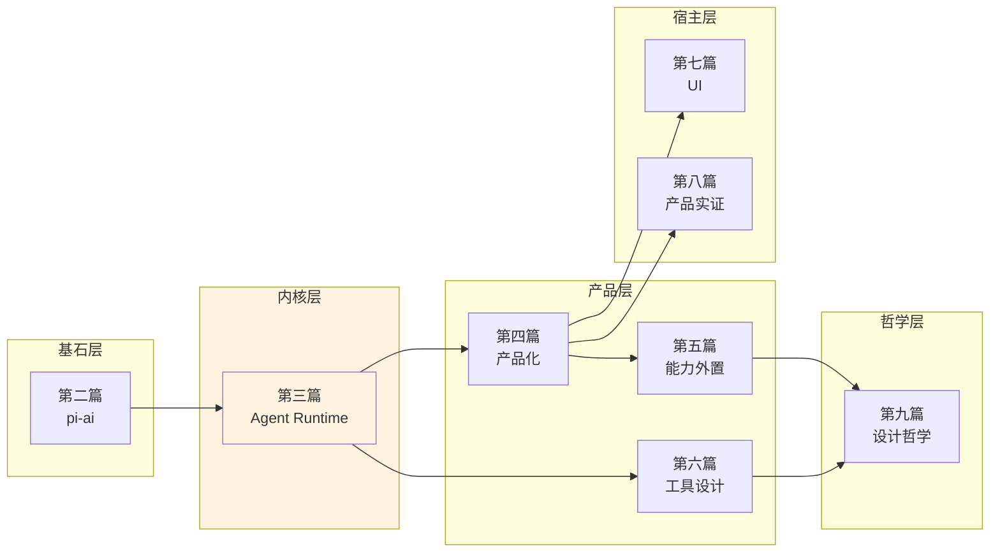

# 前言

这本书不是源码导读，也不是 API 文档。

它记录了一个 agent 运行时 — pi — 在设计过程中做出的关键决策。每一章回答一个设计问题，源码只在需要解释"为什么这样做"时出场。

## 这本书适合谁

- 有工程经验、想真正理解 agent 系统设计的开发者
- 准备给 pi 生态做扩展或贡献源码的人
- 想在自己的项目中借鉴 agent 架构设计经验的技术负责人

## 阅读准备

### 前置知识

- **TypeScript**：需要能读懂类型定义、泛型、async/await
- **LLM API 概念**：了解 prompt、tool calling、streaming 的基本概念
- **不需要**：不需要用过 pi，不需要 Node.js 框架经验

### 推荐阅读路径

**路径 A：架构师**（想了解设计决策）
> 第 1 章 → 第 8 章 → 第 10 章 → 第 30-32 章

**路径 B：开发者**（想贡献代码或写 extension）
> 第 2-3 章 → 第 8-10 章 → 第 15-16 章 → 第 19 章 → 附录 D

**路径 C：完整阅读**（从头到尾）
> 按目录顺序

### 全书知识地图

### 标记说明

- **源码引用**：`packages/agent/src/agent-loop.ts:155-232` — 文件路径 + 行号范围
- **取舍分析**：每章末尾的"得到了什么 / 放弃了什么"段落
- **Mermaid 图**：架构图、流程图、时序图嵌入在章节中
- **版本演化说明**：每章末尾标注分析基于的版本和后续变化

## 版本基线

本书核心分析基于 **pi-mono v0.66.0**（2026 年 4 月）。
