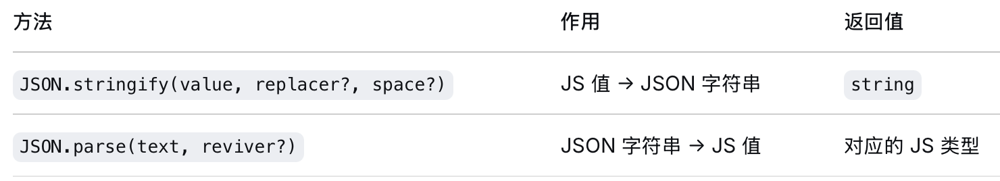

# Javascript、Typescript 相关知识（语法、项目）

## JS 生态技术栈

- **层一：运行时（操作系统）** - Node.js（后端引擎） / 浏览器（前端引擎）
- **层二：语言** - TypeScript / JavaScript
- **层三：开发工具链（Node.js 生态包）**
  - **包管理**：NPM / Yarn / pnpm
  - **代码质量**：ESLint（检查）、Prettier（格式化）
  - **构建/编译**：**Vite（新一代）** ← 替代 → Webpack + Babel（老一代）
- **层四：UI 框架（运行在浏览器）** - React / Vue
- **层五：全栈增强（运行在 Node.js + 浏览器）** - Next.js（React 生态） / Nuxt.js（Vue 生态）
- **层六：纯后端框架（运行在 Node.js）** - Express / NestJS

## JS&TS 语法

JavaScript 生态从**基础语言**到**类型增强**再到**UI描述**的层层扩展：

*   **`.js` (JavaScript)**：最基础的**通用脚本语言**。所有 JavaScript 环境（浏览器、Node.js）都能直接运行。
*   **`.ts` (TypeScript)**：`.js` 的**类型增强版**。它是 JavaScript 的**超集**，增加了**静态类型系统**。写代码时声明变量是什么类型（字符串、数字、对象等），编译器会在运行前帮你检查错误。`.ts` 不能直接在浏览器运行，需要编译成 `.js`。
*   **`.jsx` (JavaScript XML)**：`.js` 的 **React UI 扩展版**。它允许你在 JavaScript 中直接编写类似 HTML 的标签结构（`<div>Hello</div>`）。`.jsx` 同样需要 Babel 等工具编译后才能运行。
*   **`.tsx` (TypeScript XML)**：`.ts` 的 **React UI 扩展版**。它是 TypeScript 和 JSX 的结合体，让你在享受 TypeScript 类型安全的同时，也能使用 JSX 语法编写 UI。

简单来说：

*   **`.js` 是基础**，浏览器和 Node.js 都能直接运行。
*   **`.ts` 给 JS 加了类型**，让代码更健壮，更适合大型项目。
*   **`.jsx` 让 JS 能写 HTML 标签**，是 React 这类框架的“语法糖”。
*   **`.tsx` 是 `.ts` 和 `.jsx` 的融合**，既有类型又有 UI 描述能力。

**实际开发中如何选择？**

*   **纯逻辑/工具函数**（不涉及 UI）：用 `.ts`。
*   **React 组件文件**：用 `.tsx`。
*   **普通 JS 项目**：用 `.js`。
*   **React 项目（无 TS）**：用 `.jsx`。

```typescript
// JavaScript 写法（没有类型标注）
function add(a, b) {
  return a + b;
}

// TypeScript 写法（加了类型标注，a 和 b 必须是数字）
function add(a: number, b: number): number {
  return a + b;
}
```

**只有类型相关的语法（泛型、类型注解、`as`、`satisfies` 等）是 TS 特有的，其余所有控制流、内置对象、异步模式等都属于 JavaScript。**

### 类型系统

TypeScript 的类型标注只在开发阶段有用，编译成 JavaScript 后会被去掉，运行时跟普通 JS 一样。因此 TypeScript 的类型系统是**编译时**的，它主要保护：

- 防止**类型不匹配**（如把字符串传给期望数字的参数）。
- 捕获**拼写错误**或访问不存在的属性。
- 确保函数调用时**参数数量和形状正确**。
- 提供**智能提示**和**重构安全**。

但它无法保护**运行时**的数据安全——比如从 API、JSON.parse、用户输入等来源获得的数据，TypeScript 会盲目信任你声明的类型，实际值可能完全不符合。

**Zod 能帮它做的事情**：

- 在**运行时**验证数据并给出明确的错误信息。
- 允许你定义与 TypeScript 类型**同步**的 schema（`z.object({...})`），既用于运行时校验，又自动推导出静态类型。
- 对数据进行**转换/净化**（如将字符串 `"123"` 转为数字 `123`），确保数据真正符合类型要求。
- 提供 `.parse()`（失败抛异常）或 `.safeParse()`（返回结果对象），让你安全地处理外部数据。

#### 1、只使用 TypeScript（编译时检查，运行时无保护）

```typescript
// 定义类型
interface User {
  id: number;
  name: string;
  email: string;
}

// 一个需要 User 对象的函数
function sendWelcomeEmail(user: User) {
  console.log(`Sending email to ${user.email}`);
}

// 模拟从 API 获取的数据（实际运行时是 JSON.parse 的结果）
const rawData = JSON.parse(`{"id": "123", "name": "Alice", "email": "alice@example.com"}`);

// TypeScript 会信任我们声明的类型，但实际 rawData.id 是字符串 "123"
sendWelcomeEmail(rawData as User);  // 编译通过，但运行时可能出错
```

**问题**：TypeScript 无法阻止运行时的错误类型数据传入，因为类型断言 `as User` 绕过了检查。如果不用 `as User` 断言，依然能通过 TypeScript 编译，因为 `JSON.parse(...)` 的返回值类型是 `any`，而 `any` 类型可以赋值给任何类型（包括 `User`）。

#### 2、TypeScript + Zod 合作（最佳实践）

在程序边界处用 Zod 验证，通过后得到类型安全的值，后续逻辑全用 TypeScript 类型保护。

```typescript
import { z } from 'zod';

// 1. 定义 schema（一份定义，同时用于运行时验证和静态类型）
const UserSchema = z.object({
  id: z.number(),
  name: z.string().min(1),
  email: z.string().email(),
  // 可选字段可以有默认值
  role: z.enum(['admin', 'user']).default('user'),
});
type User = z.infer<typeof UserSchema>;

// 2. 一个需要 User 的业务函数（只依赖 TypeScript 类型）
function updateUserProfile(user: User, newName: string): User {
  return { ...user, name: newName };
}

// 3. 在“边界”处理外部数据（如 API 请求）
async function handleRequest(rawBody: unknown) {
  // 运行时验证
  const validationResult = UserSchema.safeParse(rawBody);
  if (!validationResult.success) {
    // 可以返回 400 错误，并打印详细错误
    console.error(validationResult.error);
    return { status: 400, body: 'Invalid user data' };
  }

  // 从这里开始，validUser 的类型就是 User，TypeScript 会保证后续代码的类型安全
  const validUser = validationResult.data;

  // 安全地调用业务函数
  const updated = updateUserProfile(validUser, 'New Name');
  
  return { status: 200, body: updated };
}

// 测试调用
handleRequest(JSON.parse(`{"id": 123, "name": "Alice", "email": "alice@example.com"}`));
// 成功：因为 id 是数字

handleRequest(JSON.parse(`{"id": "123", "name": "Alice", "email": "alice@example.com"}`));
// 失败：id 不是数字，返回 400
```

### 类型声明关键字

#### let / const

`let` `const` 用于声明一个**块级作用域**的变量/常量。基本语法如下：

```
let/const 变量名: 类型 = 初始值;
```

const 声明时**必须赋初始值**，禁止重新赋值；let 可以先声明后赋值，允许重新赋值

const **允许对象/数组内容修改**（const 只保证变量引用不变，不保证内部属性不变）

- **默认使用 `const`**：除非你需要对变量重新赋值（如循环计数器、累加器等），否则优先用 `const`。这能明确表达“这个变量不会改变”，避免意外修改。
- **使用 `let`**：当变量的值确实会变化时（例如 `let sum = 0; sum += x;`）。
- **避免使用 `var`**：在 TypeScript/现代 JavaScript 中，不再需要 `var`。

#### interface / type

```text
                TypeScript 类型系统
                        │
                        │  核心判断规则
                        ▼
                 结构兼容（structural typing）
              “看起来像，就可以当成那个类型”
                        │
        ┌───────────────┼───────────────┐
        │               │               │
        ▼               ▼               ▼
     type            interface        implements
   类型别名            接口            类上的显式声明
        │               │               │
        │               │               │
        │               │               └── 只用于 class
        │               │                   作用：让编译器检查类是否满足接口
        │               │
        │               └── 常用于对象结构、可扩展接口、声明合并
        │
        └── 常用于函数签名、联合类型、交叉类型、别名
```

1、`type` 就是**给一个类型起别名**。

```ts
type User = {
  id: string;
  name: string;
};

type Add = (a: number, b: number) => number;
```

它适合：
- 函数类型
- 联合类型
- 交叉类型
- 一次性类型别名

比如：

```ts
type Status = "idle" | "running" | "done";
```

这个只能用 `type`，不能用 `interface`。

2、`interface` 主要是**描述对象/类实例长什么样**。

```ts
interface User {
  id: string;
  name: string;
}
```

它适合：
- 对象结构
- class 的实例形状
- 需要被扩展的协议
- 声明合并

比如：

```ts
interface User {
  id: string;
}

interface User {
  name: string;
}
```

会自动合并成：

```ts
interface User {
  id: string;
  name: string;
}
```

这就是 `interface` 的一个重要特性，`type` 做不到。

3、`implements` 是是 **class 上的检查语法**。

```ts
interface User {
  id: string;
  name: string;
}

class Person implements User {
  id: string;
  name: string;

  constructor(id: string, name: string) {
    this.id = id;
    this.name = name;
  }
}
```

它的作用是：

```text
“这个类承诺自己符合 User 接口，请编译器帮我检查”
```

注意：
- `implements` 只给 `class` 用
- 它不是类型兼容的根本依据
- 真正的兼容依据仍然是结构兼容

#### 类型断言、交叉类型

```ts
const code = (error as Error & { code?: unknown }).code;
```

拆开看：

* error as ... 类型断言：我知道 TS 认为 error 的类型不完全匹配，但我确信可以这样用 

* Error & { code?: unknown } 交叉类型：在 Error 的基础上加一个可选的 code 字段，类型是 unknown 
* code?: unknown ? = 可选（可能不存在）， unknown = 不确定是 string/number/其他 
* .code 读取这个字段，不存在就是 undefined

#### 泛型 `<T>`？

泛型是一种"参数化的类型"，让函数/类可以处理不同类型的数据，同时保持类型安全：

```typescript
// 没有泛型：只能处理字符串数组
function getFirst(arr: string[]): string {
  return arr[0];
}

// 有泛型：可以处理任意类型的数组，返回值类型与数组元素类型一致
function getFirst<T>(arr: T[]): T {
  return arr[0];
}

// 使用时 TypeScript 自动推断类型
getFirst([1, 2, 3])       // T 被推断为 number，返回 number
getFirst(["a", "b"])      // T 被推断为 string，返回 string
```

在 pi 的代码中，`EventStream<T, R>` 的 `T` 是事件类型，`R` 是最终结果类型。

#### readonly

`readonly` 是 TypeScript 专用的关键字，用于在接口或类型中声明**只读属性**。赋值操作会在编译时报错，但编译后完全擦除，JS 运行时没有限制。

```ts
interface AgentState {
  readonly isStreaming: boolean;
  readonly errorMessage?: string;
}

const state: AgentState = { isStreaming: true };
state.isStreaming = false; // Error: Cannot assign to 'isStreaming'
```

`readonly` 也可用于数组和元组：

```ts
const arr: readonly number[] = [1, 2, 3];
arr.push(4);    // Error: Property 'push' does not exist on type 'readonly number[]'
arr[0] = 99;    // Error: Index signature in type 'readonly number[]' only permits reading
```

`readonly` 是**纯编译时约束**，运行时不存在。如果需要运行时不可变，要靠 `Object.freeze()`。

#### get / set 存取器

`get`/`set` 是 JavaScript 原生关键字（编译后保留），让属性的读写经过函数，而不是直接访问数据。

**在对象和 class 中使用（JS 原生，运行时生效）：**

```ts
class Temperature {
  #celsius;

  constructor(c: number) {
    this.#celsius = c;
  }

  get fahrenheit() {
    return this.#celsius * 9 / 5 + 32;
  }

  set fahrenheit(f: number) {
    this.#celsius = (f - 32) * 5 / 9;
  }
}

const t = new Temperature(100);
console.log(t.fahrenheit); // 212 —— 看起来像属性访问，实际调用了 get 函数
t.fahrenheit = 32;          // 看起来像赋值，实际触发了 set 函数
```

**在接口中声明（TS 类型语法，编译后擦除）：**

```ts
interface AgentState {
  set tools(tools: AgentTool<any>[]);
  get tools(): AgentTool<any>[];
}
```

这意味着实现该接口的对象，`tools` 不是普通数据属性，而是通过存取器函数访问。常见用途是在 setter 中**复制数组**，防止外部引用意外修改内部状态：

```ts
class Agent implements AgentState {
  private _tools: AgentTool<any>[] = [];

  set tools(tools: AgentTool<any>[]) {
    this._tools = tools.slice(); // 复制数组，断开外部引用
  }

  get tools(): AgentTool<any>[] {
    return this._tools;
  }
}

const myTools = [toolA, toolB];
agent.state.tools = myTools;  // 触发 setter，内部存的是副本
myTools.push(toolC);          // 修改原数组
// agent.state.tools.length 仍然是 2，不受影响
```

### 工具类型 Utility Types

TypeScript 的工具类型（Utility Types）是内置的"类型函数"，能基于现有类型变换出新类型，从而**避免重复定义类型，提升开发效率与代码可维护性**。它们全局可用，无需导入。

注意：工具类型**不是语言关键字**，而是 TypeScript 标准库里预定义的泛型类型别名（写在 `lib.es5.d.ts` 中的用户态代码）。`Omit`、`Record`、`Partial` 等本质上和你自己写的 `type MyType<T> = ...` 没有区别，只是 TS 帮你写好了。这和 `readonly`、`get`/`set` 等语言关键字不同——后者是语法的一部分，由编译器直接处理。

#### 对象类型操作 (最常用)

- **`Partial<T>`**：将类型 `T` 的所有属性变为**可选** (`?`)。

  **适用场景**：非常适用于**更新操作**（如PATCH请求），因为客户端可能只传递需要修改的部分字段。

  ```ts
  interface User { id: number; name: string; email: string; }
  // 假设要更新用户，所有字段都是可选的
  type UserUpdate = Partial<User>;
  // 等同于 { id?: number; name?: string; email?: string; }
  function updateUser(id: number, updateData: UserUpdate) { /* ... */ }
  updateUser(1, { name: "New Name" }); // OK
  ```

  **原理**：通过映射类型 `[P in keyof T]?` 为每个属性添加 `?` 修饰符。

- **`Required<T>`**：与 `Partial<T>` 相反，将类型 `T` 的所有**可选**属性变为**必选** (`-?`)。

  **适用场景**：当你需要一个类型的**完整版本**，确保所有属性都存在时使用。

  ```ts
  interface Props { a?: number; b?: string; }
  // 确保组件接收所有必需的 props
  type RequiredProps = Required<Props>;
  // 等同于 { a: number; b: string; }
  ```

- **`Readonly<T>`**：将类型 `T` 的所有属性变为**只读** (`readonly`)。

  **适用场景**：用于定义**不可变对象**，防止其属性被意外修改。

  ```ts
  interface Config { apiUrl: string; timeout: number; }
  // 确保配置对象在初始化后不被修改
  type ImmutableConfig = Readonly<Config>;
  const config: ImmutableConfig = { apiUrl: '...', timeout: 5000 };
  // config.apiUrl = 'new url'; // Error: 无法分配到 "apiUrl" ，因为它是只读属性
  ```

- **`Pick<T, K>`**：从类型 `T` 中**挑选**一组属性 `K` 来构造新类型。

  **适用场景**：当你需要一个类型中的**部分属性**时非常有用，例如从一个大对象中提取视图需要的数据。

  ```ts
  interface User { id: number; name: string; email: string; password: string; }
  // 创建一个只包含公开信息的类型
  type PublicUserInfo = Pick<User, 'id' | 'name' | 'email'>;
  // 等同于 { id: number; name: string; email: string; }
  ```

- **`Omit<T, K>`**：与 `Pick<T, K>` 相反，从类型 `T` 中**排除**一组属性 `K` 来构造新类型。

  **适用场景**：在**隐藏敏感信息**（如密码）或创建一个**不包含某些字段**的类型时使用。

  ```ts
  interface User { id: number; name: string; email: string; password: string; }
  // 创建一个不包含密码的用户类型，用于返回给前端
  type SafeUser = Omit<User, 'password'>;
  // 等同于 { id: number; name: string; email: string; }
  ```

- **`Record<K, T>`**：创建一个对象类型，其**属性键**的类型为 `K`，**属性值**的类型为 `T`。

  **适用场景**：非常适合用于**字典**、**映射**或**具有统一值类型**的对象，例如定义枚举的映射或API响应映射。

  ```ts
  // 定义一个对象，其键是字符串，值是数字
  type NumberDictionary = Record<string, number>;
  const scores: NumberDictionary = { 'Alice': 90, 'Bob': 85 };
  
  // 与联合类型结合，限制键的范围
  type Page = 'home' | 'about' | 'contact';
  type PageInfo = Record<Page, { title: string; path: string }>;
  const pages: PageInfo = {
      home: { title: 'Home', path: '/' },
      about: { title: 'About', path: '/about' },
      contact: { title: 'Contact', path: '/contact' }
  };
  ```

#### 联合类型与类型过滤

- **`Exclude<T, U>`**：从联合类型 `T` 中**排除**所有可赋值给联合类型 `U` 的成员。

  ```ts
  type T = 'a' | 'b' | 'c';
  type U = 'a';
  type Result = Exclude<T, U>; // Result 为 'b' | 'c'
  ```

- **`Extract<T, U>`**：从联合类型 `T` 中**提取**所有可赋值给联合类型 `U` 的成员。

  ```ts
  type T = 'a' | 'b' | 'c';
  type U = 'a' | 'd';
  type Result = Extract<T, U>; // Result 为 'a'
  ```

- **`NonNullable<T>`**：从类型 `T` 中**排除** `null` 和 `undefined`。

  ```ts
  type T = string | number | null | undefined;
  type Result = NonNullable<T>; // Result 为 string | number
  ```

#### 函数类型操作

- **`ReturnType<T>`**：获取函数类型 `T` 的**返回值类型**。

  **适用场景**：当你需要**复用某个函数的返回类型**，但又不想显式声明时非常有用。

  ```ts
  function createUser() {
      return { id: 1, name: 'Alice' };
  }
  // 自动推断 createUser 函数的返回值类型
  type User = ReturnType<typeof createUser>;
  // User 的类型为 { id: number; name: string; }
  ```

* **`Parameters<T>`**：获取函数类型 `T` 的**参数类型**，结果是一个**元组**类型。

  ```ts
  function greet(name: string, age: number): void {}
  type GreetParams = Parameters<typeof greet>; // GreetParams 为 [string, number]
  ```

#### 异步与高级类型

- **`Awaited<T>`**：递归地**解包** `Promise` 类型 `T`，获取其最终 resolved 的值类型。

  **适用场景**：在处理**异步操作**时，准确获取 `Promise` 内部的实际数据类型。

  ```ts
  type A = Awaited<Promise<string>>; // A 为 string
  type B = Awaited<Promise<Promise<number>>>; // B 为 number
  type C = Awaited<boolean | Promise<number>>; // C 为 boolean | number
  ```

- **`ThisParameterType<T>`**：提取函数类型 `T` 的 `this` 参数类型，如果函数没有 `this` 参数则返回 `unknown`。

- **`OmitThisParameter<T>`**：从函数类型 `T` 中移除 `this` 参数。

#### 字符串类型操作 (Template Literal Types)

- **`Uppercase<S>`**：将字符串字面量类型 `S` 转换为大写。
- **`Lowercase<S>`**：将字符串字面量类型 `S` 转换为小写。
- **`Capitalize<S>`**：将字符串字面量类型 `S` 的首字母转换为大写。
- **`Uncapitalize<S>`**：将字符串字面量类型 `S` 的首字母转换为小写。

这些字符串工具类型在需要**规范化**或**转换**字符串字面量类型时非常有用，常用于定义事件的命名约定等场景。

### 运算符

```ts
return this.activeRun?.promise ?? Promise.resolve();
```

这行代码用了两个 JavaScript 运算符： 可选链 （ ?. ）和 空值合并 （ ?? ）。

```ts
// 如果 this.activeRun 存在，取 .promise
// 如果 this.activeRun 是 null 或 undefined，返回 undefined
this.activeRun?.promise

// 如果左侧是 null 或 undefined，用右侧的值
A ?? B
```

完整等价于：

```ts
if (this.activeRun === null || this.activeRun === undefined) {
    // 没有活动 run，立即 resolve
    return Promise.resolve();
} else {
    // 有活动 run，返回该 run 的 promise（由 finishRun 在完成后 resolve）
    return this.activeRun.promise;
}
```

Promise.resolve() 是一个静态方法，返回一个已经兑现（resolved）的 Promise ，await 立即继续。

### JSON 相关方法



### AsyncIterable（异步可迭代）

普通数组可以用 `for...of` 遍历：

```typescript
for (const item of [1, 2, 3]) {
  console.log(item);  // 1, 2, 3
}
```

如果某个类 implements AsyncIterable<T>，就要实现 [Symbol.asyncIterator]() 方法，从而能被 for await...of 遍历：

```typescript
// 流式返回的数据不是一个完整数组，而是一个"管道"，数据陆续到达
for await (const chunk of openaiStream) {
  console.log(chunk);  // 每收到一小块数据就立即处理
}
```

### AbortController / AbortSignal

这是 JavaScript 的标准 API，用于取消正在进行的异步操作：

```typescript
// 创建一个控制器
const controller = new AbortController();

// 把它的 signal 传给异步操作
fetch("https://api.example.com", { signal: controller.signal });

// 2 秒后取消
setTimeout(() => controller.abort(), 2000);
// controller.abort() 会把 signal.aborted 设为 true
// fetch 检测到后会立即中断网络请求

function fetch(url, options) {
  const { signal } = options;
  return new Promise((resolve, reject) => {
    // 内部监听 abort 事件
    if (signal) {
      signal.addEventListener('abort', () => {
        // 中断网络请求
        reject(new DOMException('Aborted', 'AbortError'));
      });
    }
    // ... 发起真实网络请求
  });
}
```

### IIFE（立即执行函数表达式）

`(async () => { ... })()` 这种写法是"定义一个函数并立即执行它"：

```typescript
// 普通函数定义 + 调用
async function doWork() {
  // 做一些异步工作...
}
doWork();  // 调用

// IIFE 写法：定义和调用合二为一
(async () => {
  // 做一些异步工作...
})();
```

### function* 和 yield

`yield` 用在"生成器函数" function* 里，每次产出一个值后暂停，等下次被请求时再继续：

```typescript
// 生成器函数（注意 function* 星号）
function* count() {
  yield 1;  // 产出 1，暂停
  yield 2;  // 产出 2，暂停
  yield 3;  // 产出 3，暂停
}

for (const n of count()) {
  console.log(n);  // 1, 2, 3
}

// 在流式场景中，yield 让消费者"来一个处理一个"，
// 而不是等所有数据到齐才开始处理。
```

### "点火即忘"（fire and forget）模式

```typescript
export function agentLoop(
	prompts: AgentMessage[],
	context: AgentContext,
	config: AgentLoopConfig,
	signal?: AbortSignal,
	streamFn?: StreamFn,
): EventStream<AgentEvent, AgentMessage[]> {
	const stream = createAgentStream();

	void runAgentLoop(
		prompts,
		context,
		config,
		async (event) => {
			stream.push(event);
		},
		signal,
		streamFn,
	).then((messages) => {
		stream.end(messages);
	});

	return stream;
}

export async function runAgentLoop(...):
```

`async` 函数返回 `Promise`，但 `agentLoop()` 这里需要返回 `EventStream`（一个可以持续产出多个值的流）。所以函数本身是同步的——它创建流、启动后台任务、**立刻**返回流。

```typescript
void runAgentLoop(...).then((messages) => {
    stream.end(messages);
});
```

`agentLoop()` 内的这段代码是 fire and forget 模式：

- `runAgentLoop()` 是 async 异步的，返回 `Promise`
- `void` 表示"我不等它完成，也不关心返回值"

整个函数的执行顺序是：

```
agentLoop() 被调用
  1. const stream = createAgentStream()     ← 同步，创建空流
  2. void runAgentLoop(...).then(...)        ← 同步，启动后台任务（不等待）
  3. return stream                           ← 同步，立刻返回流
  
  （后台）runAgentLoop 执行中...
    → 每产生一个事件就 stream.push(event)    ← 流里有数据了
    → 循环结束 → stream.end(messages)        ← 流关闭
```

调用方拿到 `stream` 后可以立刻 `for await` 开始消费，事件会陆续到来。

如果这么写：

```typescript
async function agentLoop(): Promise<EventStream<...>> {
    await runAgentLoop(...);  // 调用方必须 await 才能拿到 stream
    return stream;            // 但此时循环已经结束了！
}

// 当前的写法（同步启动，异步填充）
function agentLoop(): EventStream<...> {
    void runAgentLoop(...);   // 后台启动，不等待
    return stream;            // 立刻返回，调用方可以边循环边消费
}
```

关键区别：用 `async` 的话，调用方必须 `await agentLoop()` 才能拿到 `stream`，但 `await` 会等到整个循环结束——那就失去了"实时流式消费"的意义。当前写法让调用方拿到流时，循环还在后台跑着，事件边产生边推入流。

### ...xxx 展开语法 spread syntax
#### 在数组里
```ts
[...prompts]
```
意思是把 prompts 这个数组里的元素一个个展开，放进新数组。

例如：

```ts
const prompts = ["a", "b"];
const x = [...prompts];
// x = ["a", "b"]
```
它的作用通常是： 复制数组 。

再看这个：

```ts
[...context.messages, ...prompts]
```

意思是把两个数组拼起来：

```ts
const a = [1, 2];
const b = [3, 4];
const c = [...a, ...b];
// c = [1, 2, 3, 4]
```

#### 在对象里

```ts
{
  ...context,
  messages: ...
}
```

意思是把 context 对象的所有字段展开到一个新对象里。

例如：

```ts
const context = {
  systemPrompt: "hi",
  messages: [1, 2],
  tools: ["t1"],
};

const x = {
  ...context,
  messages: [1, 2, 3],
};
```

结果相当于：

```ts
const x = {
  systemPrompt: "hi",
  messages: [1, 2, 3], // 覆盖原来的 messages
  tools: ["t1"],
};
```

注意： 后面同名字段会覆盖前面的字段 。

### [number] 和 Extract<联合类型, 条件>

```ts
export type AgentToolCall = Extract<AssistantMessage["content"][number], { type: "toolCall" }>;
```

第一步： AssistantMessage["content"]

AssistantMessage 的 content 字段是一个数组：

```ts
content: (TextContent | ThinkingContent | ToolCall)[]
```
第二步： [number]

这是 TypeScript 的索引访问语法。 数组[number] 取的是"数组元素的类型"：

```ts
(TextContent | ThinkingContent | ToolCall)[number]
= TextContent | ThinkingContent | ToolCall
```
就像 string[] 取 [number] 就是 string 。

第三步： Extract<联合类型, 条件>

Extract 是 TypeScript 内置工具类型，从联合类型中 筛选出匹配条件的成员 ：

```ts
Extract<TextContent | ThinkingContent | ToolCall, { type: 
"toolCall" }>
= ToolCall
```
因为只有 ToolCall 满足 { type: "toolCall" } 。

### map 数组方法

`map` 是 JavaScript 数组的一个**迭代方法**，它会**遍历原数组**，对每个元素执行一个回调函数，然后将回调函数的返回值组成一个长度相同的**新数组**返回。

```ts
const newArray = array.map((element, index, array) => {
  // 处理 element
  return 处理后的值;
});
```

- `element`：当前被处理的元素。
- `index`（可选）：当前元素的索引。
- `array`（可选）：调用 `map` 的原始数组。

```ts
// 1. 数字加倍
const nums = [1, 2, 3];
const doubled = nums.map(n => n * 2);   // [2, 4, 6]

// 2. 提取对象属性
const users = [{ name: 'Alice' }, { name: 'Bob' }];
const names = users.map(u => u.name);   // ['Alice', 'Bob']

// 3. 带索引使用
const arr = ['a', 'b'];
const result = arr.map((letter, idx) => `${idx}:${letter}`);
// ['0:a', '1:b']
```

## npm 包

### chalk 终端输出美化

一个 npm 包，用于**在终端输出彩色文字**。

基本用法：

```ts
import chalk from "chalk";

console.log(chalk.red("错误信息"));           // 红色文
字
console.log(chalk.green("成功"));             // 绿色
文字
console.log(chalk.bold("加粗的文字"));        // 加粗
console.log(chalk.dim("灰色/暗淡的文字"));    // 暗淡
console.log(chalk.blue.bold("蓝色加粗"));     // 链式组
合
```

### Linter (ESLint) 代码质量检查 和 Prettier 自动格式化

**JavaScript / TypeScript 生态圈**（即 Node.js 技术栈）的标配工具。

