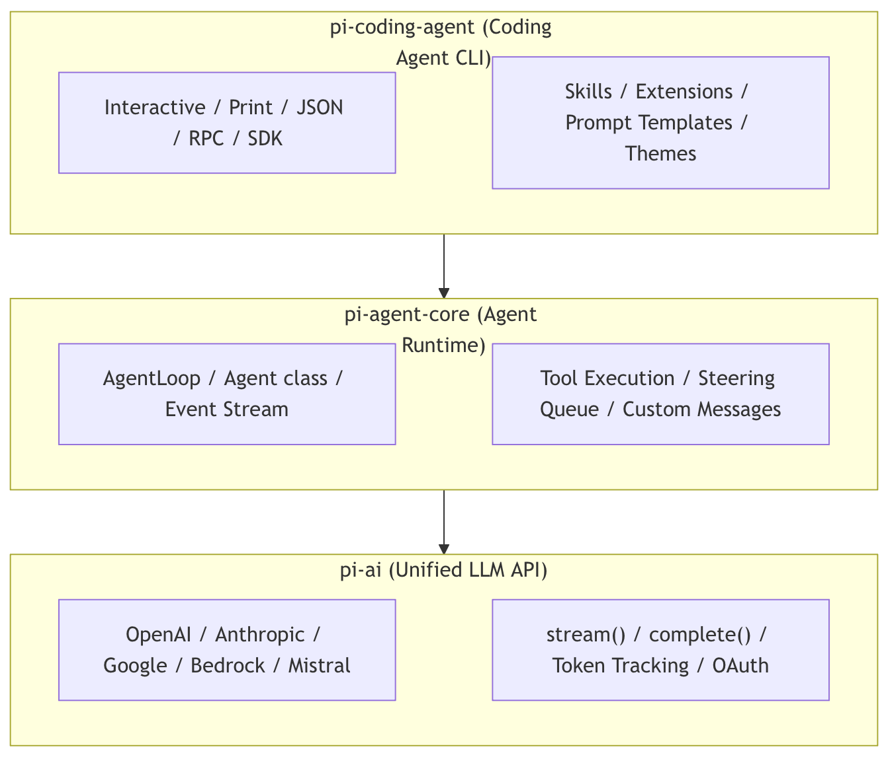
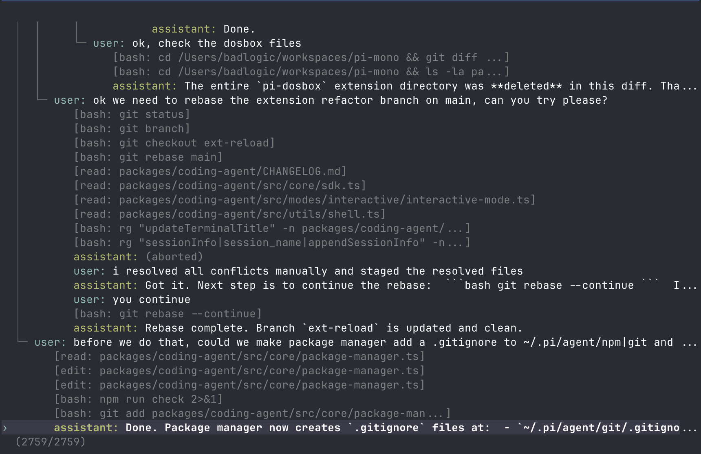
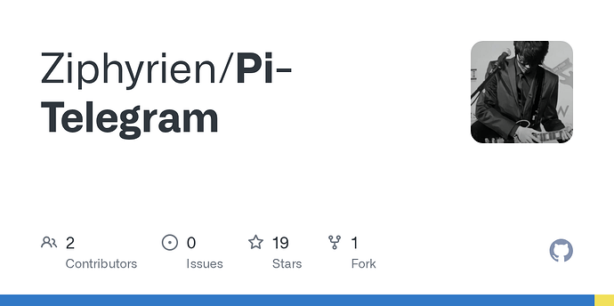

## [深度解析：pi-ai 与 pi-agent-core](https://guangzhengli.com/notes/pi-ai-and-agent-core-course)

## 2 解决的核心问题

市面上存在许多`LLM`编排框架，但大多数框架存在以下问题：

| 问题                                            | Pi Agent 的解法                                              |
| ----------------------------------------------- | ------------------------------------------------------------ |
| 与单一模型提供商深度绑定，迁移成本高            | `pi-ai`统一封装`20+`个主流模型提供商，接口完全一致           |
| 零值字段被`omitempty`静默丢弃，导致请求语义错误 | 使用指针类型保留显式零值，精确控制发往上游的请求内容         |
| 框架内置逻辑不可扩展/替换，需`fork`修改源码     | `Extensions`、`Skills`、自定义工具三层扩展机制，无需修改框架本身 |
| 长会话上下文溢出无处理，导致崩溃或截断          | 内置自动压缩（`Compaction`），支持手动和自动两种触发模式     |
| 无法在运行时从外部系统嵌入/控制`Agent`          | 提供 `RPC` 模式（`stdin/stdout JSON`协议）和 `SDK` 两种嵌入方式 |
| 工具调用串行执行，效率低                        | 支持并行工具调用（`parallel mode`）与串行模式可配置切换      |

## 3 架构设计

`Pi Agent`采用三层分层架构，各层职责清晰，可单独使用也可组合使用。



整个`Monorepo`包含以下主要包：

| 包名           | npm 包                          | 职责                                        |
| -------------- | ------------------------------- | ------------------------------------------- |
| `ai`           | `@mariozechner/pi-ai`           | 统一多模型`LLM API`抽象层                   |
| `agent`        | `@mariozechner/pi-agent-core`   | `Agent`运行时（工具调用、事件流、状态管理） |
| `coding-agent` | `@mariozechner/pi-coding-agent` | 交互式编码智能体`CLI`与`SDK`                |
| `mom`          | `@mariozechner/pi-mom`          | `Slack Bot`，将消息委托给编码 Agent         |
| `tui`          | `@mariozechner/pi-tui`          | 终端`UI`库（差量渲染）                      |
| `web-ui`       | `@mariozechner/pi-web-ui`       | `AI`对话`Web`组件                           |
| `pods`         | `@mariozechner/pi-pods`         | `GPU Pod`上`vLLM`部署管理`CLI`              |

### 3.1 pi-ai：统一 LLM 抽象层

`@mariozechner/pi-ai`是整个框架的基础，提供对`20+`个主流大模型提供商的统一封装，所有提供商都使用相同的接口。

**支持的提供商：**

| 类型         | 提供商                                                       |
| ------------ | ------------------------------------------------------------ |
| `API Key`    | `OpenAI`、`Anthropic`、`Google Gemini`、`Vertex AI`、`Amazon Bedrock`、`Mistral`、`Groq`、`Cerebras`、`xAI`、`OpenRouter`、`MiniMax` |
| `OAuth`订阅  | `Claude Pro/Max`、`GitHub Copilot`、`ChatGPT Plus/Pro（Codex）`、`Google Gemini CLI` |
| `OpenAI`兼容 | `Ollama`、`vLLM`、`LM Studio`等任意`OpenAI`兼容`API`         |

**核心特性：**

- **流式与非流式**：`stream()`和`complete()`两种调用方式，事件类型包括`text_delta`、`toolcall_start`、`toolcall_end`、`thinking_delta`等
- **思考/推理支持**：统一的`thinkingLevel`接口（`off`/`minimal`/`low`/`medium`/`high`/`xhigh`），自动处理各提供商差异
- **Token 与费用追踪**：每次响应自动统计输入/输出/缓存读写`Token`数量及费用
- **跨模型切换**：`Context`可序列化，支持在不同提供商之间无缝传递对话上下文
- **工具调用**：基于`TypeBox`的类型安全工具定义，支持流式部分参数解析

**基本使用示例：**

```typescript
import { Type, getModel, stream, complete, Context, Tool } from '@mariozechner/pi-ai';

const model = getModel('anthropic', 'claude-sonnet-4-20250514');

const tools: Tool[] = [{
  name: 'get_weather',
  description: 'Get current weather for a location',
  parameters: Type.Object({
    city: Type.String({ description: 'City name' })
  })
}];

const context: Context = {
  systemPrompt: 'You are a helpful assistant.',
  messages: [{ role: 'user', content: 'What is the weather in Tokyo?' }],
  tools
};

const s = stream(model, context);

for await (const event of s) {
  if (event.type === 'text_delta') {
    process.stdout.write(event.delta);
  } else if (event.type === 'toolcall_end') {
    console.log(`Tool called: ${event.toolCall.name}`);
  } else if (event.type === 'done') {
    console.log(`Stop reason: ${event.reason}`);
  }
}

const finalMessage = await s.result();
console.log(`Cost: $${finalMessage.usage.cost.total.toFixed(4)}`);
```

### 3.3 pi-coding-agent：交互式编码智能体

`@mariozechner/pi-coding-agent`是面向开发者的编码`Agent`，构建在`pi-agent-core`之上，提供完整的交互式终端界面，并暴露`SDK`和`RPC`接口供外部系统集成（`OpenClaw`就是通过这种方式嵌入`pi`的）。

#### 3.3.1 运行模式

| 模式             | 说明                                                      |
| ---------------- | --------------------------------------------------------- |
| `Interactive`    | 全功能终端`UI`，支持实时流式响应、命令、快捷键            |
| `Print` / `JSON` | 非交互式输出，适合脚本集成                                |
| `RPC`            | 通过 `stdin/stdout JSON` 协议控制 `Agent`，适合跨进程集成 |
| `SDK`            | 直接在 `TypeScript/Node.js` 代码中嵌入 `Agent` 能力       |

#### 3.3.2 内置工具

| 工具    | 功能                           |
| ------- | ------------------------------ |
| `read`  | 读取文件内容                   |
| `write` | 写入文件内容                   |
| `edit`  | 精确编辑文件（基于字符串替换） |
| `bash`  | 执行 Shell 命令                |
| `grep`  | 文件内容搜索                   |

#### 3.3.3 扩展机制

`pi-coding-agent`提供三个层次的扩展能力，均无需修改框架源码：

**1. Skills（技能）**

基于 [Agent Skills 标准](https://agentskills.io/)，以`Markdown`文件形式打包。`Agent`启动时加载技能列表（仅描述），需要时读取完整的`SKILL.md`内容。支持`/skill:name`命令手动触发。

```markdown
<!-- ~/.pi/agent/skills/my-skill/SKILL.md -->
# My Skill

Use this skill when the user asks about deployment.

## Steps
1. Check the current cluster status
2. Run the deployment script
```

**2. Extensions（扩展）**

`TypeScript`模块，可注册自定义工具、命令、事件处理器和`TUI`组件：

```typescript
import type { ExtensionAPI } from "@mariozechner/pi-coding-agent";
import { Type } from "@sinclair/typebox";

export default function(pi: ExtensionAPI) {
  // 注册自定义工具
  pi.registerTool({
    name: "deploy",
    label: "Deploy",
    description: "Deploy the application to the cluster",
    parameters: Type.Object({
      env: Type.String({ description: "Target environment" }),
    }),
    async execute(toolCallId, params, signal, onUpdate, ctx) {
      return {
        content: [{ type: "text", text: `Deployed to ${params.env}` }],
        details: {},
      };
    },
  });

  // 拦截工具调用
  pi.on("tool_call", async (event, ctx) => {
    if (event.toolName === "bash" && event.input.command?.includes("rm -rf")) {
      const ok = await ctx.ui.confirm("Warning", "Allow rm -rf?");
      if (!ok) return { block: true, reason: "Blocked by user" };
    }
  });

  // 注册自定义命令
  pi.registerCommand("status", {
    description: "Show cluster status",
    handler: async (args, ctx) => {
      ctx.ui.notify("Cluster: OK", "info");
    },
  });
}
```

**3. Prompt Templates（提示词模板）**

可复用的`Markdown`提示词文件，支持变量插值，通过`/template-name`触发：

```markdown
<!-- ~/.pi/agent/prompts/review.md -->
Review this code for bugs, security issues, and performance problems.
Focus on: {{focus}}
```

#### 3.3.4 Pi Packages

将`Extensions`、`Skills`、`Prompt Templates`、`Themes`打包为`npm`或`git`包，便于团队共享：

```bash
pi install npm:@foo/pi-tools       # 从 npm 安装
pi install git:github.com/user/repo # 从 git 安装
pi list                             # 查看已安装包
pi update                           # 更新所有包
pi config                           # 启用/禁用各组件
```

#### 3.3.5 会话管理

会话以`JSONL`格式存储，支持树状分支，所有历史保存在单个文件中：

```bash
pi -c                  # 继续最近的会话
pi -r                  # 浏览历史会话并选择
pi --no-session        # 临时模式（不保存会话）
pi --session <path>    # 使用指定会话文件
pi --fork <path>       # 从指定会话 fork 一个新会话
```

在交互模式中，`/tree`命令可以在会话树中导航、切换分支或从历史任意节点继续。`/compact`命令触发上下文压缩，保留近期消息并摘要旧内容，避免上下文窗口溢出。

## 4 配置参考

### 4.1 全局与项目级配置

| 路径                        | 作用域             |
| --------------------------- | ------------------ |
| `~/.pi/agent/settings.json` | 全局（所有项目）   |
| `.pi/settings.json`         | 项目级（覆盖全局） |

### 4.2 主要配置项

#### 4.2.1 模型与思考

| 配置项                 | 类型      | 默认值  | 说明                                                    |
| ---------------------- | --------- | ------- | ------------------------------------------------------- |
| `defaultProvider`      | `string`  | —       | 默认模型提供商（如`anthropic`）                         |
| `defaultModel`         | `string`  | —       | 默认模型`ID`                                            |
| `defaultThinkingLevel` | `string`  | `off`   | 思考级别：`off`/`minimal`/`low`/`medium`/`high`/`xhigh` |
| `hideThinkingBlock`    | `boolean` | `false` | 是否隐藏思考模块输出                                    |

#### 4.2.2 上下文压缩

| 配置项                        | 类型      | 默认值  | 说明                       |
| ----------------------------- | --------- | ------- | -------------------------- |
| `compaction.enabled`          | `boolean` | `true`  | 是否启用自动压缩           |
| `compaction.reserveTokens`    | `number`  | `16384` | 为`LLM`响应预留的`Token`数 |
| `compaction.keepRecentTokens` | `number`  | `20000` | 不压缩的近期`Token`数      |

#### 4.2.3 重试策略

| 配置项              | 类型      | 默认值  | 说明                       |
| ------------------- | --------- | ------- | -------------------------- |
| `retry.enabled`     | `boolean` | `true`  | 是否启用自动重试           |
| `retry.maxRetries`  | `number`  | `3`     | 最大重试次数               |
| `retry.baseDelayMs` | `number`  | `2000`  | 指数退避基础延迟（毫秒）   |
| `retry.maxDelayMs`  | `number`  | `60000` | 超出此延迟直接报错而非等待 |

**配置示例：**

```json
{
  "defaultProvider": "anthropic",
  "defaultModel": "claude-sonnet-4-20250514",
  "defaultThinkingLevel": "medium",
  "compaction": {
    "enabled": true,
    "reserveTokens": 16384,
    "keepRecentTokens": 20000
  },
  "retry": {
    "enabled": true,
    "maxRetries": 3,
    "baseDelayMs": 2000,
    "maxDelayMs": 60000
  }
}
```

## 5 使用示例

### 5.1 最小化 SDK 集成

```typescript
import { createAgentSession } from "@mariozechner/pi-coding-agent";

const { session } = await createAgentSession();

session.subscribe((event) => {
  if (event.type === "message_update" && event.assistantMessageEvent.type === "text_delta") {
    process.stdout.write(event.assistantMessageEvent.delta);
  }
});

await session.prompt("What files are in the current directory?");
```

### 5.2 指定模型与自定义工具集

```typescript
import {
  createAgentSession,
  createCodingTools,
  SessionManager,
  AuthStorage,
  ModelRegistry,
} from "@mariozechner/pi-coding-agent";

const authStorage = AuthStorage.create();
const modelRegistry = ModelRegistry.create(authStorage);

const cwd = "/path/to/project";

const { session } = await createAgentSession({
  cwd,
  tools: createCodingTools(cwd),        // read/write/edit/bash，绑定到指定 cwd
  sessionManager: SessionManager.inMemory(),
  authStorage,
  modelRegistry,
});

session.subscribe((event) => {
  if (event.type === "message_update" && event.assistantMessageEvent.type === "text_delta") {
    process.stdout.write(event.assistantMessageEvent.delta);
  }
});

await session.prompt("Refactor the main.ts file to use async/await.");
```

### 5.3 直接使用 pi-agent-core 构建自定义 Agent

```typescript
import { Agent } from "@mariozechner/pi-agent-core";
import { getModel, Type } from "@mariozechner/pi-ai";

const agent = new Agent({
  initialState: {
    systemPrompt: "You are a code review assistant.",
    model: getModel("anthropic", "claude-sonnet-4-20250514"),
    thinkingLevel: "low",
    tools: [
      {
        name: "read_file",
        label: "Read File",
        description: "Read the content of a file",
        parameters: Type.Object({
          path: Type.String({ description: "File path to read" }),
        }),
        async execute(toolCallId, params) {
          const content = await fs.readFile(params.path, "utf-8");
          return {
            content: [{ type: "text", text: content }],
            details: { path: params.path },
          };
        },
      },
    ],
  },
  convertToLlm: (messages) =>
    messages.filter(
      (m) => m.role === "user" || m.role === "assistant" || m.role === "toolResult"
    ),
  toolExecution: "parallel",
});

agent.subscribe((event) => {
  if (event.type === "message_update" && event.assistantMessageEvent.type === "text_delta") {
    process.stdout.write(event.assistantMessageEvent.delta);
  }
});

await agent.prompt("Review the code in src/main.ts and identify potential bugs.");
```

### 5.4 RPC 模式集成（OpenClaw 的集成方式）

`OpenClaw`通过启动`pi`的`RPC`子进程来嵌入编码`Agent`，外部通过`stdin/stdout`传递`JSON`协议消息：

```bash
pi --mode rpc --provider anthropic --model claude-sonnet-4-20250514
```

向`Agent`发送用户提示：

```json
{"id": "req-1", "type": "prompt", "message": "Read the README.md file"}
```

在`Agent`运行期间发送转向指令：

```json
{"type": "prompt", "message": "Actually, focus on CHANGELOG.md", "streamingBehavior": "steer"}
```

等`Agent`完成后追加跟进任务：

```json
{"type": "prompt", "message": "Summarize what you found", "streamingBehavior": "followUp"}
```

## 6 与 OpenClaw 的关系

`OpenClaw`将`Pi Agent`作为其智能体运行时的核心基础。在`OpenClaw`的架构中，`Gateway`负责管理渠道接入、会话路由和工具注册，而实际的`Agent`运行时则由嵌入的`pi-coding-agent`提供。具体来说：

- `OpenClaw`通过`RPC`模式或`SDK`方式启动并控制`pi`进程
- 用户发送的消息经`Gateway`路由后，通过`prompt`命令发送给`pi`
- `pi`调用大模型并执行工具，将流式事件回传给`Gateway`
- `Gateway`再将结果转发到对应的消息渠道（`WhatsApp`、`Telegram`等）

正是这种分层设计，使得`OpenClaw`可以聚焦于多渠道接入和`Gateway`管理，将复杂的`Agent`推理和工具执行能力完全委托给经过充分测试的`Pi Agent`框架。

理解`Pi Agent`的事件模型、工具系统和扩展机制，是深入开发`OpenClaw`自定义能力（如注册新工具、编写`Extension`、实现自定义`Skill`）的重要基础。


### 安装

```
npm install -g @mariozechner/pi-coding-agent
```

接着可通过`pi`命令来启动,或[为你的终端配置快捷键](https://github.com/badlogic/pi-mono/blob/main/packages/coding-agent/docs/terminal-setup.md)。

#### Windows

注意： 使用Windows的佬友还需要一个bash shell。检查顺序：

1. `~/.pi/agent/settings.json`中的自定义路径
2. Git Bash (`C:\Program Files\Git\bin\bash.exe`)
3. PATH 中的`bash.exe` (如Cygwin, MSYS2, WSL)

对于大多数佬友，[Git for Windows](https://git-scm.com/download/win) 足够了。

自定义 Shell 路径 ( `settings.json` )

```json
{ "shellPath": "C:\\cygwin64\\bin\\bash.exe" }
```

#### Termux（Android）

见[原文](https://github.com/badlogic/pi-mono/blob/main/packages/coding-agent/docs/termux.md)，因为要控制篇幅的需要便不再赘述。

### 模型配置

配置好后可以通过 `/model` （或 Ctrl+L）选择模型。

（pi有着优质的模型配置方式，但OpenClaw选择在此之上再造一层史这让我非常不理解。）

#### 订阅

对于具有一下订阅之一的佬友

- Claude Pro/Max
- ChatGPT Plus/Pro (Codex)
- GitHub Copilot
- Google Gemini CLI
- Google Antigravity

可通过`/login`进行登入，使用`/logout`登出。认证Token会被储存在`~/.pi/agent/auth.json`。

#### API 密钥

祥见[原文](https://github.com/badlogic/pi-mono/blob/main/packages/coding-agent/docs/providers.md)

可通过环境变量设置：

```bash
export ANTHROPIC_API_KEY=sk-ant-...
pi
```

或写入`~/.pi/agent/auth.json`。

```json
{
  "anthropic": { "type": "api_key", "key": "sk-ant-..." },
  "openai": { "type": "api_key", "key": "sk-..." },
  "google": { "type": "api_key", "key": "..." },
  "opencode": { "type": "api_key", "key": "..." }
}
```

如下表

| 供应商                 | 环境变量             | auth.json 键           |
| :--------------------- | :------------------- | :--------------------- |
| Anthropic              | ANTHROPIC_API_KEY    | anthropic              |
| Azure OpenAI Responses | AZURE_OPENAI_API_KEY | azure-openai-responses |
| OpenAI                 | OPENAI_API_KEY       | openai                 |
| Google Gemini          | GEMINI_API_KEY       | google                 |
| Mistral                | MISTRAL_API_KEY      | mistral                |
| Groq                   | GROQ_API_KEY         | groq                   |
| Cerebras               | CEREBRAS_API_KEY     | cerebras               |
| xAI                    | XAI_API_KEY          | xai                    |
| OpenRouter             | OPENROUTER_API_KEY   | openrouter             |
| Vercel AI Gateway      | AI_GATEWAY_API_KEY   | vercel-ai-gateway      |
| ZAI                    | ZAI_API_KEY          | zai                    |
| OpenCode Zen           | OPENCODE_API_KEY     | opencode               |
| Hugging Face           | HF_TOKEN             | huggingface            |
| Kimi For Coding        | KIMI_API_KEY         | kimi-coding            |
| MiniMax                | MINIMAX_API_KEY      | minimax                |
| MiniMax (中国)         | MINIMAX_CN_API_KEY   | minimax-cn             |

默认情况下auth.json是携带0600权限创建的（仅用户可读/写），Auth文件凭证优先于环境变量。

#### 第三方提供商

祥见[原文](https://github.com/badlogic/pi-mono/blob/main/packages/coding-agent/docs/models.md)

创建`~/.pi/agent/models.json`

完整示例

```json
{
  "providers": {  
    "CloseAI": {
      "baseUrl": "https://api.closeai.ai/v1",
      "api": "openai-responses",
      "apiKey": "sk-a1b1c4d5e14f5",
      "models": [
        {
          "id": "gpt-5.4",
          "name": "GPT-5.4",
          "reasoning": true,
          "input": [
            "text",
            "image"
          ],
          "contextWindow": 1000000,
          "maxTokens": 128000,
          "cost": { "input": 0, "output": 0, "cacheRead": 0, "cacheWrite": 0 }
        }
      ]
    }
  }
}
```

| API                  | 描述                             |
| :------------------- | :------------------------------- |
| openai-completions   | OpenAI Chat Completions (最兼容) |
| openai-responses     | OpenAI Responses API             |
| anthropic-messages   | Anthropic Messages API           |
| google-generative-ai | Google Generative AI             |

• 在 providers 层级设置的 api，作为该 provider 下所有 models 的默认值。

• 在 models 层级中，单个模型可以通过自己的 api 字段覆盖这个默认值。

• 如遇报错`Error: 403 Your request was blocked.`说明请求被cf阻断。自定义请求头加上UA即可：

```json
      "headers": {
        "User-Agent": "MyCustomClient/1.0"
      },
```

以下是御三家模型配置（要套到上面的完整配置中）。

```json
{
  "models": [
    {
      "id": "gpt-5.4",
      "name": "GPT 5.4",
      "reasoning": true,
      "input": ["text", "image"],
      "contextWindow": 1000000,
      "maxTokens": 128000
    },
    {
      "id": "claude-opus-4-6",
      "name": "Claude Opus 4.6",
      "reasoning": true,
      "input": ["text", "image"],
      "contextWindow": 200000,
      "maxTokens": 128000
    },
    {
      "id": "gemini-3.1-pro-preview",
      "name": "Gemini 3.1 Pro Preview",
      "reasoning": true,
      "input": ["text", "image"],
      "contextWindow": 1048576,
      "maxTokens": 65536
    }
  ]
}
```

每家站点的花费各不相同根据情况修改。

每次在Pi中键入`/model` 时，文件都会重新加载，因此在会话期间编辑`models.json`无需重启。

## 指南

详见[README](https://github.com/badlogic/pi-mono/tree/main/packages/coding-agent#readme)

### 编辑器

（指的是输入框）

| 功能      | 用法                                                         |
| :-------- | :----------------------------------------------------------- |
| 文件引用  | 输入 `@` 可模糊搜索项目文件                                  |
| 路径补全  | 按 `Tab` 自动补全路径                                        |
| 多行输入  | `Shift+Enter`（Windows Terminal 下也可用 `Ctrl+Enter`）      |
| 图片      | `Ctrl+V` 粘贴（Windows 下可用 `Alt+V`），或直接拖到终端      |
| Bash 命令 | `!command` 执行并把输出发给模型，`!!command` 执行但不发送输出 |

删除单词、撤销等使用标准编辑快捷键。详见 [此处](https://github.com/badlogic/pi-mono/blob/main/packages/coding-agent/docs/keybindings.md)。

### 命令

在编辑器里输入 `/` 可触发命令。[扩展](https://github.com/badlogic/pi-mono/tree/main/packages/coding-agent#extensions)可注册自定义命令，[技能](https://github.com/badlogic/pi-mono/tree/main/packages/coding-agent#skills)可用 `/skill:name` 调用，[提示词模板](https://github.com/badlogic/pi-mono/tree/main/packages/coding-agent#prompt-templates)可通过 `/templatename` 展开。

| 命令                | 说明                                                   |
| :------------------ | :----------------------------------------------------- |
| `/login`,`/logout`  | OAuth 登录/退出                                        |
| `/model`            | 切换模型                                               |
| `/scoped-models`    | 启用/禁用 `Ctrl+P` 轮换可选模型                        |
| `/settings`         | 设置思考等级、主题、消息投递、传输方式                 |
| `/resume`           | 从历史会话中恢复                                       |
| `/new`              | 新建会话                                               |
| `/name <name>`      | 设置会话显示名称                                       |
| `/session`          | 显示会话信息（路径、Token、费用）                      |
| `/tree`             | 跳转到会话任意节点并从那继续                           |
| `/fork`             | 从当前分支创建新会话                                   |
| `/compact [prompt]` | 手动压缩上下文，可自定义压缩提示                       |
| `/copy`             | 复制助手上一条回复到剪贴板                             |
| `/export [file]`    | 导出会话为 HTML 文件                                   |
| `/share`            | 上传为私有 GitHub Gist，并生成可分享 HTML 链接         |
| `/reload`           | 重载扩展、技能、提示词、上下文文件（主题会自动热更新） |
| `/hotkeys`          | 显示全部快捷键                                         |
| `/changelog`        | 显示版本更新记录                                       |
| `/quit`,`/exit`     | 退出 pi                                                |

### 消息队列

智能体工作时，你也可以继续发消息：

- **Enter**：排入一条*引导消息*，会在当前工具执行完后立即送达（并中断后续未执行工具）
- **Alt+Enter**：排入一条*跟进消息*，只会在代理完成全部工作后送达
- **Escape**：中止当前过程，并把已排队消息恢复到编辑器
- **Alt+Up**：把队列中的消息取回到编辑器

可在 [settings](https://github.com/badlogic/pi-mono/blob/main/packages/coding-agent/docs/settings.md) 配置投递方式：`steeringMode` 和 `followUpMode` 可设为 `"one-at-a-time"`（默认，收到回复后再发下一条）或 `"all"`（一次性发送队列全部消息）。`transport` 用于选择支持多传输的提供方通道偏好（`"sse"`、`"websocket"` 或 `"auto"`）。

### 会话

会话以 JSONL 树结构保存。每条记录都有 `id` 和 `parentId`，所以可以在同一个文件里直接分支，不必新建文件。文件格式见 [此处](https://github.com/badlogic/pi-mono/blob/main/packages/coding-agent/docs/session.md)。

### 管理

会话会自动保存到 `~/.pi/agent/sessions/`，并按工作目录（cwd）分组。

- `pi -c`：继续最近一次会话
- `pi -r`：浏览并选择历史会话
- `pi --no-session`：临时模式（不保存会话）
- `pi --session <path>`：使用指定会话文件或会话 ID

### 分支

**`/tree`**：在当前会话文件内浏览会话树。你可以选中任意历史节点，从那继续，并在不同分支间切换。所有历史都保留会话文件中。

[](https://github.com/badlogic/pi-mono/blob/main/packages/coding-agent/docs/images/tree-view.png)

- 输入关键词可搜索，`←/→` 翻页
- 过滤模式（Ctrl+O）：default → no-tools → user-only → labeled-only → all
- 按 `l` 可给条目标记书签

**`/fork`**：从当前分支创建一个新的会话文件。系统会打开选择器，复制到所选节点为止的历史，并把该节点消息放入编辑器，方便你继续修改。

### 设置

使用 `/settings` 修改常用选项，或直接编辑 JSON 文件：

| 位置                        | 范围 |
| :-------------------------- | :--- |
| `~/.pi/agent/settings.json` | 全局 |
| `.pi/settings.json`         | 项目 |

详见[此处](https://github.com/badlogic/pi-mono/blob/main/packages/coding-agent/docs/settings.md)。

### 项目上下文

Pi 在启动时会从以下位置加载 `AGENTS.md`（或 `CLAUDE.md`）：

- `~/.pi/agent/AGENTS.md` (全局)
- 父目录（从当前工作目录向上查找）
- 当前目录

用于项目说明、约束和常用命令封装。所有匹配的md文件将被拼接在一起。

#### 系统提示

用 `.pi/SYSTEM.md`（项目）或 `~/.pi/agent/SYSTEM.md`（全局）替换系统提示词或通过 `APPEND_SYSTEM.md` 追加在系统提示词末尾。

### 自定义

这部分的内容都可以封装为[pi package](https://github.com/badlogic/pi-mono/tree/main/packages/coding-agent#pi-packages)。

这里整理了公开的 Pi 包

[Packages - pi.dev](https://pi.dev/packages)

#### 提示词模板

将提示词封装为Markdown文件，输入`/文件名`展开。

```markdown
<!-- ~/.pi/agent/prompts/review.md --> 
Review this code for bugs, security issues, and performance problems. Focus on: {{focus}}
```

放置在 `~/.pi/agent/prompts/`（全局）, `.pi/prompts/`（项目）或封装为 [pi package](https://github.com/badlogic/pi-mono/tree/main/packages/coding-agent#pi-packages) 分享给别人.

#### 技能

按需加载的技能包，遵循 [Agent Skills 标准](https://agentskills.io/)。可通过输入/skill:name 调用，也可让 Agent 自动加载。

```markdown
<!-- ~/.pi/agent/skills/my-skill/SKILL.md --> 
# My Skill Use this skill when the user asks about X. 

## Steps 
1. Do this 
2. Then that
```

安装路径：

全局

- `~/.pi/agent/skills/`
- `~/.agents/skills/`

项目

- `.pi/skills/`
- `.agents/skills/`（从当前工作目录向上逐级查找父目录）

或封装为 [pi package](https://github.com/badlogic/pi-mono/tree/main/packages/coding-agent#pi-packages)。

详见[此处](https://github.com/badlogic/pi-mono/blob/main/packages/coding-agent/docs/skills.md).

pi作者维护的[技能包](https://github.com/badlogic/pi-skills)，包含浏览器控制，brave搜索等技能，pi和其它支持skill的项目都能直接使用。

#### 扩展

放入 `~/.pi/agent/extensions/`（全局）、`.pi/extensions/`（项目）或封装为 [pi package](https://github.com/badlogic/pi-mono/tree/main/packages/coding-agent#pi-packages) 分享给别人。

参见[文档](https://github.com/badlogic/pi-mono/blob/main/packages/coding-agent/docs/extensions.md)和[例子](https://github.com/badlogic/pi-mono/blob/main/packages/coding-agent/examples/extensions)。

#### 主题

内置暗色与明亮，修改主题配置后可热重载。

放入`~/.pi/agent/themes/`（全局），`.pi/themes/`（项目）或封装为 [pi package](https://github.com/badlogic/pi-mono/tree/main/packages/coding-agent#pi-packages) 分享给别人。

详见[此处](https://github.com/badlogic/pi-mono/blob/main/packages/coding-agent/docs/themes.md)。

**通过扩展与主题系统可以极大增强我们的使用体验！！！** 直接对模型说出需求即可，因为pi的系统提示词中包含了pi的文档路径。

## Pi Telegram Bot

这是我用pi编写出来的项目，可以在TG上与 Pi Agent 沟通。

且值得一提的是，我没有蠢到像OpenClaw一样手写MD到HTML的转换（难绷），而是直接使用已有包进行转换和标签清洗。

但目前暂时没有记忆系统，因为找不到合适的项目，希望佬友们能出谋划策。不过你可以把重要信息写入工作目录（cwd）下的的AGENTS.md会载入上下文。

具体信息README写的很清晰就不再重复发一遍。使用过程中有困难可以 [](https://deepwiki.com/Ziphyrien/Pi-Telegram)。



### [GitHub - Ziphyrien/Pi-Telegram](https://github.com/Ziphyrien/Pi-Telegram)