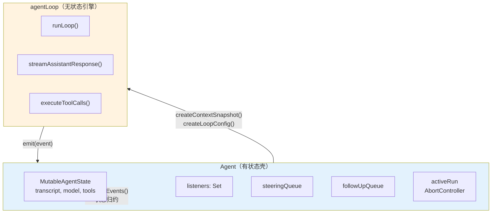

# 第 10 章：`Agent` — 循环之上的有状态壳

> **定位**：本章解析为什么一个无状态循环引擎之上还需要一个有状态的 `Agent` 类。
> 前置依赖：第 8 章（agentLoop）、第 9 章（工具执行管道）。
> 适用场景：当你想理解"循环"和"运行时对象"为什么必须分开，或者想为自己的 agent 系统设计状态管理。

## 为什么循环引擎不够？

第 8 章展示了 `agentLoop` 的无状态设计。但一个真正可用的 agent 需要更多：

- 它需要**记住**对话历史（transcript）
- 它需要**通知**多个订阅者关于状态变化（listeners）
- 它需要**接收**用户在执行过程中发来的消息（queues）
- 它需要**能被中断**（abort）
- 它需要**防止**同时运行两次（mutual exclusion）

这些都是有状态的需求。如果把它们塞进循环引擎，循环就不再是纯函数了 — 它会变成一个"知道太多"的上帝对象。

pi 的解决方案是在循环引擎之上套一个有状态的壳：`Agent` 类。循环引擎负责"转"，`Agent` 负责"管"。



`Agent` 向循环引擎提供两样东西：一个 context 快照（`createContextSnapshot`）和一个配置对象（`createLoopConfig`）。循环引擎通过事件回调（`emit`）把产出送回 `Agent`，`Agent` 在 `processEvents()` 中做状态归约。

## `Agent` 拥有什么

让我们逐一看 `Agent` 管理的五类状态。

### 1. MutableAgentState — 受控的可变状态

`Agent` 的核心状态是一个 `MutableAgentState` 对象：

```typescript
// packages/agent/src/agent.ts:57-91（简化）

type MutableAgentState = {
  systemPrompt: string;
  model: Model<any>;
  thinkingLevel: ThinkingLevel;
  // 外部看 readonly，赋值时自动 copy
  get tools(): AgentTool[];
  set tools(next: AgentTool[]);
  get messages(): AgentMessage[];
  set messages(next: AgentMessage[]);
  // 运行时状态
  isStreaming: boolean;
  streamingMessage?: AgentMessage;
  pendingToolCalls: Set<string>;
  errorMessage?: string;
};
```

这里有一个精巧的设计：`tools` 和 `messages` 使用 getter/setter 属性。当你赋值 `state.messages = newArray` 时，setter 会自动调用 `newArray.slice()` — 它总是存储一个副本。

```typescript
// packages/agent/src/agent.ts:80-85

get messages() {
  return messages;
},
set messages(nextMessages: AgentMessage[]) {
  messages = nextMessages.slice();  // ← 总是 copy
},
```

为什么要这样做？因为 `AgentMessage[]` 会被传递给循环引擎（`createContextSnapshot`）。如果不 copy，循环引擎修改数组时会直接影响 `Agent` 的状态，两者的状态就耦合了。copy-on-assign 保证了 `Agent` 的状态和循环引擎的工作数据是独立的。

同时，`isStreaming`、`streamingMessage`、`pendingToolCalls`、`errorMessage` 这四个字段在公开的 `AgentState` 接口中是 `readonly` 的：

```typescript
// packages/agent/src/types.ts:253-278

interface AgentState {
  // ... 可读写字段 ...
  readonly isStreaming: boolean;
  readonly streamingMessage?: AgentMessage;
  readonly pendingToolCalls: ReadonlySet<string>;
  readonly errorMessage?: string;
}
```

外部代码（UI 组件、extension）通过 `agent.state` 读取这些字段，但不能直接修改它们。只有 `Agent` 内部的 `processEvents()` 可以修改。这保证了运行时状态的单一真相源。

### 2. 事件订阅 — 有序且受信号保护

```typescript
// packages/agent/src/agent.ts:159-219

private readonly listeners = new Set<
  (event: AgentEvent, signal: AbortSignal) => Promise<void> | void
>();

subscribe(listener): () => void {
  this.listeners.add(listener);
  return () => this.listeners.delete(listener);
}
```

订阅模式的三个设计选择：

**1. listener 接收 AbortSignal**。每个 listener 都能感知当前 run 的中止信号。如果一个 listener 在处理事件时发现 `signal.aborted`，它可以选择跳过耗时操作（比如持久化）。

**2. listener 的 Promise 被 await**。`processEvents` 中的代码是：

```typescript
for (const listener of this.listeners) {
  await listener(event, signal);
}
```

这意味着 listener 按注册顺序串行执行。一个慢的 listener 会阻塞后续 listener。这是故意的 — 它保证了状态归约和事件通知的顺序一致性。如果 listener 并行执行，两个 listener 可能同时读到不一致的中间状态。

**3. `agent_end` 不等于 idle**。`agent_end` 事件只意味着循环引擎不再发射事件了。但 `Agent` 要等到**所有 listener 处理完 `agent_end`** 后才算真正 idle。这就是 `waitForIdle()` 和 `agent_end` 的区别：

```typescript
// packages/agent/src/agent.ts:293-295

waitForIdle(): Promise<void> {
  return this.activeRun?.promise ?? Promise.resolve();
}
```

`activeRun.promise` 在 `finishRun()` 中 resolve，而 `finishRun()` 在所有 listener 处理完毕之后才被调用。

### 3. 消息队列 — 两种节奏的输入

```typescript
// packages/agent/src/agent.ts:112-143

class PendingMessageQueue {
  private messages: AgentMessage[] = [];

  constructor(public mode: QueueMode) {}

  enqueue(message: AgentMessage): void {
    this.messages.push(message);
  }

  drain(): AgentMessage[] {
    if (this.mode === "all") {
      const drained = this.messages.slice();
      this.messages = [];
      return drained;
    }
    // "one-at-a-time" 模式
    const first = this.messages[0];
    if (!first) return [];
    this.messages = this.messages.slice(1);
    return [first];
  }
}
```

`Agent` 持有两个独立的消息队列：

- `steeringQueue`：`agent.steer(msg)` 入队，在 turn 间隙被消费
- `followUpQueue`：`agent.followUp(msg)` 入队，在 agent 本来要退出时被消费

每个队列有两种 drain 模式：

- `"all"`：一次性取出所有排队的消息
- `"one-at-a-time"`（默认）：一次只取一条，剩余的留到下次

为什么默认是 `one-at-a-time`？考虑这个场景：用户在 agent 执行 bash 命令时快速输入了三条 steering 消息。如果用 `"all"` 模式，三条消息会同时注入 context，LLM 需要一次理解三条指令。如果用 `"one-at-a-time"`，LLM 先处理第一条，在下一个 turn 间隙再收到第二条 — 就像人类对话中逐条回应，而不是一次性面对一堆请求。

队列和循环引擎的对接发生在 `createLoopConfig()` 中：

```typescript
// packages/agent/src/agent.ts:407-431（简化）

private createLoopConfig(): AgentLoopConfig {
  return {
    // ... 其他字段 ...
    getSteeringMessages: async () => {
      return this.steeringQueue.drain();
    },
    getFollowUpMessages: async () => {
      return this.followUpQueue.drain();
    },
  };
}
```

`Agent` 把队列的 `drain()` 方法包装成循环引擎需要的 `getSteeringMessages` 和 `getFollowUpMessages` 回调。循环引擎不知道消息从哪来 — 它只管调用回调取消息。

### 4. 中止控制 — 一个 AbortController 管全局

```typescript
// packages/agent/src/agent.ts:434-457（简化）

private async runWithLifecycle(
  executor: (signal: AbortSignal) => Promise<void>
): Promise<void> {
  const abortController = new AbortController();
  let resolvePromise = () => {};
  const promise = new Promise<void>((resolve) => {
    resolvePromise = resolve;
  });
  this.activeRun = { promise, resolve: resolvePromise, abortController };

  this._state.isStreaming = true;
  try {
    await executor(abortController.signal);
  } catch (error) {
    // 安全网：即使循环违反了"must not throw"契约，
    // Agent 也能合成一条失败消息而不是崩溃
    await this.handleRunFailure(
      error, abortController.signal.aborted
    );
  } finally {
    this.finishRun();
  }
}
```

`Agent` 还提供了 `continue()` 方法，它调用循环引擎的 `agentLoopContinue` — 从当前 transcript 继续，而不添加新的 prompt。当最后一条消息是 assistant 角色时，`continue()` 会先尝试排空 steering 队列或 follow-up 队列作为新的 prompt。这是 Agent 和循环引擎之间的一个精巧协调。

每次 `prompt()` 或 `continue()` 调用都会创建一个新的 `AbortController`。它的 signal 被传递给循环引擎、所有 listener、所有工具执行。当用户调用 `agent.abort()` 时：

```typescript
abort(): void {
  this.activeRun?.abortController.abort();
}
```

一个 `abort()` 调用就能中止整条链：LLM 流式响应被取消 → 工具执行被中止 → 循环退出。

### 5. 互斥锁 — 禁止重入

```typescript
async prompt(input): Promise<void> {
  if (this.activeRun) {
    throw new Error(
      "Agent is already processing a prompt. " +
      "Use steer() or followUp() to queue messages, " +
      "or wait for completion."
    );
  }
  // ...
}
```

`Agent` 通过检查 `activeRun` 来防止同时运行两个循环。这不是用 Mutex 实现的，而是一个简单的存在性检查 — 如果 `activeRun` 存在，说明有循环在跑，新的 `prompt()` 调用会抛异常。

注意错误信息的设计：它不只是说"不行"，还告诉调用者**应该怎么做** — "Use steer() or followUp() to queue messages, or wait for completion." 错误信息本身就是 API 文档。

## `processEvents`：状态归约器

`Agent` 接收循环引擎发射的事件，并在 `processEvents()` 中做状态归约。这个方法的逻辑类似 Redux 的 reducer — 给定当前状态和一个事件，更新状态 — 但不同于 Redux 的纯函数语义，这里是直接 mutation：

```typescript
// packages/agent/src/agent.ts:491-538（简化，省略了 signal 空值保护）

private async processEvents(event: AgentEvent): Promise<void> {
  switch (event.type) {
    case "message_start":
      this._state.streamingMessage = event.message;
      break;

    case "message_update":
      this._state.streamingMessage = event.message;
      break;

    case "message_end":
      this._state.streamingMessage = undefined;
      this._state.messages.push(event.message);
      break;

    case "tool_execution_start": {
      const pendingToolCalls = new Set(this._state.pendingToolCalls);
      pendingToolCalls.add(event.toolCallId);
      this._state.pendingToolCalls = pendingToolCalls;
      break;
    }

    case "tool_execution_end": {
      const pendingToolCalls = new Set(this._state.pendingToolCalls);
      pendingToolCalls.delete(event.toolCallId);
      this._state.pendingToolCalls = pendingToolCalls;
      break;
    }

    case "turn_end":
      if (event.message.role === "assistant"
        && event.message.errorMessage) {
        this._state.errorMessage = event.message.errorMessage;
      }
      break;

    case "agent_end":
      this._state.streamingMessage = undefined;
      break;
  }

  // 先归约状态，再通知 listener
  // 实际代码中还有 signal 空值保护：
  // if (!signal) throw new Error("listener invoked outside active run")
  const signal = this.activeRun?.abortController.signal;
  for (const listener of this.listeners) {
    await listener(event, signal);
  }
}
```

几个值得注意的设计细节：

**1. `pendingToolCalls` 每次修改都创建新 Set**。`tool_execution_start` 和 `tool_execution_end` 不是在原 Set 上 add/delete，而是创建一个新的 Set 再赋值。这是因为 `AgentState.pendingToolCalls` 是 `ReadonlySet` — 外部代码持有的引用不会被意外修改。新建 Set 保证了不可变语义。

**2. 状态归约在 listener 通知之前**。`switch` 语句先更新状态，然后才 `for` 循环通知 listener。这意味着 listener 在收到 `message_end` 事件时，`state.messages` 已经包含了这条消息，`state.streamingMessage` 已经被清空。listener 总是看到一致的状态。

**3. 不是所有事件都有状态变更**。`agent_start`、`turn_start`、`tool_execution_update` 都没有对应的状态修改 — 它们只被透传给 listener。归约器只处理真正影响状态的事件。

## `CustomAgentMessages`：类型安全的扩展点

`Agent` 管理的 `messages` 数组的类型是 `AgentMessage[]`。这个类型的定义隐藏了一个精妙的扩展机制：

```typescript
// packages/agent/src/types.ts:236-245

// 默认为空 — 应用通过声明合并扩展
export interface CustomAgentMessages {
  // Empty by default
}

// AgentMessage = LLM 消息 + 所有自定义消息
export type AgentMessage =
  Message | CustomAgentMessages[keyof CustomAgentMessages];
```

`CustomAgentMessages` 是一个空接口，但它使用了 TypeScript 的声明合并（declaration merging）。应用层可以这样扩展它：

```typescript
// 在 pi-coding-agent 中
declare module "@mariozechner/agent" {
  interface CustomAgentMessages {
    custom: CustomMessage;        // compaction 摘要、分支标记等
    bashExecution: BashMessage;   // bash 工具的结构化结果
  }
}
```

扩展之后，`AgentMessage` 自动变成：

```typescript
type AgentMessage =
  | Message          // user, assistant, toolResult
  | CustomMessage    // compaction, branch, notification
  | BashMessage;     // bash 结构化结果
```

**为什么不用普通的联合类型？**

如果把自定义消息硬编码到联合类型里，pi-agent-core 就需要知道 pi-coding-agent 的消息类型 — 依赖方向反了。声明合并让 pi-agent-core 定义框架（空的 `CustomAgentMessages`），pi-coding-agent 填充内容，依赖方向保持正确。

**为什么不用 `any` 或泛型？**

用 `any` 会丢失类型安全。用泛型 `Agent<TMessage>` 会让每个使用 Agent 的地方都要传类型参数。声明合并在全局生效，不需要传递类型参数，所有使用 `AgentMessage` 的地方自动包含自定义类型。

这和 `convertToLlm` 回调配合形成完整的设计：自定义消息在循环内部是一等公民（类型安全、可以被 `transformContext` 处理），在出门见 LLM 时被 `convertToLlm` 过滤掉。类型系统保证你不会忘记处理某种自定义消息。

## Agent 不管什么

理解 `Agent` 的边界和理解它的能力同样重要。以下是 `Agent` 明确不管的事情：

| 关注点             | Agent 的态度                                   | 谁管                         |
| ------------------ | ---------------------------------------------- | ---------------------------- |
| 会话持久化         | 不知道"会话"的存在                             | SessionManager（第 11 章）   |
| UI 渲染            | 只发射事件，不管谁听                           | TUI / Web UI（第 24 章）     |
| 认证               | 通过 `getApiKey` 回调获取，不管 token 怎么来的 | OAuth 模块（第 7 章）        |
| 模型选择           | 只持有一个 `model` 字段，不管怎么选的          | ModelRegistry（第 18 章）    |
| Context 压缩       | 通过 `transformContext` 委托，不管怎么压       | Compaction（第 12 章）       |
| System prompt 拼接 | 只持有一个 `systemPrompt` 字符串               | system-prompt.ts（第 14 章） |
| 工具注册           | 只持有 `tools[]`，不管工具从哪来               | Extension（第 15 章）        |

这张表揭示了一个设计原则：**Agent 只管运行时状态，不管配置和策略。** 它知道自己正在用什么模型（`state.model`），但不知道为什么选这个模型。它知道有哪些工具可用（`state.tools`），但不知道这些工具是怎么被发现和注册的。它知道 system prompt 是什么（`state.systemPrompt`），但不知道 prompt 是怎么从多个来源拼接出来的。

## 取舍分析

### 得到了什么

**1. 清晰的职责边界**。循环引擎是纯计算，Agent 是状态管理。两者可以独立演进 — 改循环逻辑不影响状态管理，改状态结构不影响循环逻辑。

**2. 可预测的状态变更**。所有状态修改都通过 `processEvents()` 这一个入口。想知道某个状态字段什么时候会变？只需要在 `processEvents()` 的 `switch` 语句中搜索。

**3. 灵活的消费者模型**。`subscribe()` 让任意多个消费者同时观察 Agent 的行为。TUI 订阅事件来渲染，session manager 订阅事件来持久化，extension 订阅事件来做自定义逻辑 — 它们互不干扰。

### 放弃了什么

**1. Agent 是一个胖接口**。`Agent` 类有 30+ 个公开方法和属性（包括 `subscribe`、`prompt`、`continue`、`steer`、`followUp`、`abort`、`waitForIdle`、`reset` 等方法，以及 `convertToLlm`、`transformContext`、`beforeToolCall`、`afterToolCall`、`streamFn`、`sessionId`、`transport`、`toolExecution` 等可配置字段）。如果你只想跑一个简单的 agent 循环，直接调用 `runAgentLoop()` 比创建一个 Agent 实例更直接。Agent 的价值在有状态、有交互的场景，对于一次性脚本反而是负担。

**2. 状态同步依赖事件顺序**。因为 listener 串行执行，一个慢的 listener（比如写磁盘的 session manager）会延迟后续 listener（比如渲染 UI 的 TUI）收到事件的时间。在实践中这通常不是问题（listener 的处理时间远小于 LLM 响应时间），但在极端情况下可能导致 UI 延迟。

**3. Agent 是单线程模型**。同一时间只能有一个 `prompt()` 或 `continue()` 在运行。这意味着不能实现"后台持续运行、前台随时查询"的模式。如果需要这种模式，必须在 Agent 之上再包一层异步调度器。

---

### 版本演化说明

> 本章核心分析基于 pi-mono v0.66.0。`Agent` 类的核心结构自引入以来保持稳定。
> `PendingMessageQueue` 的 `"all"` | `"one-at-a-time"` 模式是后来的增强，
> 早期版本只有 `"one-at-a-time"` 行为。`CustomAgentMessages` 声明合并机制
> 在 pi-agent-core 从 pi-coding-agent 分离时引入，解决了包间类型依赖问题。