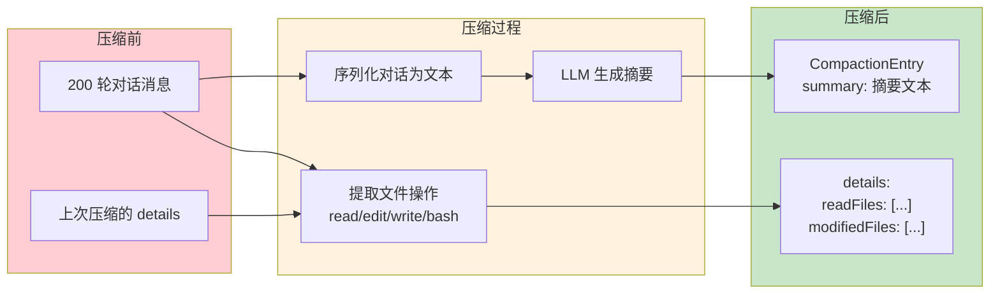

# 第 12 章：Compaction — 把无限对话装进有限窗口

> **定位**：本章解析 pi 如何在不丢失关键信息的前提下压缩超长对话。
> 前置依赖：第 11 章（会话树）、第 8 章（循环引擎的 transformContext）。
> 适用场景：当你想理解 agent 产品如何处理 context overflow，或者想设计自己的上下文管理策略。

## Context window 快满了，怎么办？

这是本章的核心设计问题。

用户和 agent 聊了 200 轮。每轮包含用户消息、assistant 响应、可能还有多个工具调用的输入输出。总 token 量轻松超过模型的 context window。

最简单的做法是截断 — 扔掉最早的消息。但 coding agent 的上下文不是闲聊，第 5 轮修改的文件结构可能是第 200 轮决策的基础。暴力截断会让 agent 丢失关键的工作记忆。

pi 的解决方案是 **compaction** — 用 LLM 自己来摘要旧对话，然后用摘要替换原始消息。

## 何时触发 Compaction

Compaction 不是每轮都触发的。pi 在每次 assistant 响应返回后检查 context 使用量，只在接近上限时触发。

### Token 计算策略

pi 用两种方式估算 context 占用量。首先，如果最近的 assistant 消息有 `usage` 字段（来自 API 的真实 token 统计），直接用它：

```typescript
// packages/coding-agent/src/core/compaction/compaction.ts:135-137

function calculateContextTokens(usage: Usage): number {
  return usage.totalTokens ||
    usage.input + usage.output + usage.cacheRead + usage.cacheWrite;
}
```

但如果最近的 assistant 消息之后又追加了新消息（比如用户的新输入），这些新消息没有 usage 数据。pi 对这些"尾部消息"使用 chars/4 的启发式估算：

```typescript
// packages/coding-agent/src/core/compaction/compaction.ts:232-249（简化）

function estimateTokens(message: AgentMessage): number {
  let chars = 0;
  switch (message.role) {
    case "user": {
      // 提取 text content 长度
      chars = /* text content length */;
      return Math.ceil(chars / 4);
    }
    case "assistant": {
      // 累加 text + thinking + toolCall 长度
      for (const block of message.content) {
        if (block.type === "text") chars += block.text.length;
        else if (block.type === "thinking") chars += block.thinking.length;
        else if (block.type === "toolCall")
          chars += block.name.length + JSON.stringify(block.arguments).length;
      }
      return Math.ceil(chars / 4);
    }
    // ... toolResult, bashExecution 等同理
  }
}
```

chars/4 是一个保守的启发式（偏向高估 token 数量）。宁可提前触发压缩，也不要因为低估而撞上 context window 的硬限制。对于图片消息，固定按 1200 token 估算。

`estimateContextTokens` 将两种策略组合：用最后一条有 usage 的 assistant 消息的真实 token 数，加上之后所有消息的启发式估算：

```typescript
// packages/coding-agent/src/core/compaction/compaction.ts:186-214（简化）

function estimateContextTokens(messages: AgentMessage[]): ContextUsageEstimate {
  const usageInfo = getLastAssistantUsageInfo(messages);

  if (!usageInfo) {
    // 没有任何 usage 数据，全部用启发式
    let estimated = 0;
    for (const message of messages) estimated += estimateTokens(message);
    return { tokens: estimated, usageTokens: 0, trailingTokens: estimated };
  }

  const usageTokens = calculateContextTokens(usageInfo.usage);
  let trailingTokens = 0;
  for (let i = usageInfo.index + 1; i < messages.length; i++) {
    trailingTokens += estimateTokens(messages[i]);
  }

  return { tokens: usageTokens + trailingTokens, usageTokens, trailingTokens };
}
```

### 触发判定和可配置阈值

判定逻辑只有一行，但背后有三个可配置参数：

```typescript
// packages/coding-agent/src/core/compaction/compaction.ts:115-125

interface CompactionSettings {
  enabled: boolean;          // 是否启用压缩
  reserveTokens: number;     // 为 prompt + 响应预留的 token 数
  keepRecentTokens: number;  // 压缩时保留的最近消息的 token 数
}

const DEFAULT_COMPACTION_SETTINGS = {
  enabled: true,
  reserveTokens: 16384,     // 预留 16K
  keepRecentTokens: 20000,  // 保留最近 20K token 的消息
};
```

触发条件：

```typescript
// packages/coding-agent/src/core/compaction/compaction.ts:219-222

function shouldCompact(contextTokens, contextWindow, settings): boolean {
  if (!settings.enabled) return false;
  return contextTokens > contextWindow - settings.reserveTokens;
}
```

当 `contextTokens > contextWindow - reserveTokens` 时触发。以 200K context window 为例：当 context 使用超过 200K - 16K = 184K token 时，开始压缩。

`reserveTokens` 的设计意图是为 LLM 响应留出空间。如果 context 已经用了 199K，LLM 只剩 1K token 生成响应，这基本没法用。16K 的默认值足以让 LLM 生成有意义的响应。

## 压缩不只是摘要

pi 的 compaction 做了两件事：对话摘要 + 文件操作追踪。



### 文件操作追踪

压缩时，`extractFileOperations` 函数扫描所有工具调用消息，提取文件操作记录：

```typescript
// packages/coding-agent/src/core/compaction/compaction.ts:32-36

interface CompactionDetails {
  readFiles: string[];      // agent 读过哪些文件
  modifiedFiles: string[];  // agent 修改过哪些文件
}
```

这些文件列表被存入 `CompactionEntry.details`。为什么要追踪文件操作？

因为 LLM 的摘要会丢失具体细节（"修改了 api-registry.ts 的第 42-52 行"可能被压缩成"更新了注册表"），但文件路径不能丢。agent 需要知道它在这个 session 中读过和改过哪些文件，才能在后续决策中避免重复读取或矛盾的修改。

`extractFileOperations` 的实现还有一个设计细节 — 它会**累积**上次压缩的文件列表：

```typescript
// packages/coding-agent/src/core/compaction/compaction.ts:41-61（简化）

function extractFileOperations(messages, entries, prevCompactionIndex) {
  const fileOps = createFileOps();

  // 从上次压缩的 details 中继承文件列表
  if (prevCompactionIndex >= 0) {
    const prevCompaction = entries[prevCompactionIndex];
    if (!prevCompaction.fromHook && prevCompaction.details) {
      const details = prevCompaction.details as CompactionDetails;
      for (const f of details.readFiles) fileOps.read.add(f);
      for (const f of details.modifiedFiles) fileOps.edited.add(f);
    }
  }

  // 从当前消息中提取新的文件操作
  for (const msg of messages) {
    extractFileOpsFromMessage(msg, fileOps);
  }

  return fileOps;
}
```

注意 `!prevCompaction.fromHook` 的检查 — 如果上次压缩是 extension 生成的（`fromHook: true`），不继承它的文件列表。因为 extension 的压缩策略可能和 pi 的不同，文件列表的格式不一定兼容。

`computeFileLists` 函数负责最终的分类 — 把 `read`、`written`、`edited` 三个 Set 合并为两个有序列表：

```typescript
// packages/coding-agent/src/core/compaction/utils.ts:62-67

function computeFileLists(fileOps: FileOperations) {
  const modified = new Set([...fileOps.edited, ...fileOps.written]);
  const readOnly = [...fileOps.read].filter(f => !modified.has(f)).sort();
  const modifiedFiles = [...modified].sort();
  return { readFiles: readOnly, modifiedFiles };
}
```

逻辑很清晰：如果一个文件既被 read 又被 edit，它归类为 modified 而不重复出现在 read 列表中。文件列表最终以 XML 标签格式追加到摘要文本后面：

```xml
<read-files>
/project/src/config.ts
/project/src/utils.ts
</read-files>

<modified-files>
/project/src/api-registry.ts
/project/src/router.ts
</modified-files>
```

### 对话序列化

在发送给 LLM 做摘要之前，对话不是原样传递的。`serializeConversation` 函数将结构化的 `Message[]` 转换为纯文本格式：

```typescript
// packages/coding-agent/src/core/compaction/utils.ts:109-162（简化）

function serializeConversation(messages: Message[]): string {
  const parts: string[] = [];
  for (const msg of messages) {
    if (msg.role === "user") {
      parts.push(`[User]: ${content}`);
    } else if (msg.role === "assistant") {
      // 分别序列化 thinking、text、tool calls
      if (thinkingParts.length > 0)
        parts.push(`[Assistant thinking]: ${thinkingParts.join("\n")}`);
      if (textParts.length > 0)
        parts.push(`[Assistant]: ${textParts.join("\n")}`);
      if (toolCalls.length > 0)
        parts.push(`[Assistant tool calls]: read(path="/src/foo.ts"); ...`);
    } else if (msg.role === "toolResult") {
      // 工具结果被截断到 2000 字符
      parts.push(`[Tool result]: ${truncateForSummary(content, 2000)}`);
    }
  }
  return parts.join("\n\n");
}
```

为什么要序列化而不是直接传递消息数组？因为如果直接把对话作为 messages 传给 LLM，LLM 可能会尝试"继续"对话而不是摘要它。序列化为纯文本放在 `<conversation>` 标签中，明确告诉 LLM"这是要被摘要的内容，不是要继续的对话"。

注意工具结果被截断到 2000 字符。一个 `read` 工具的结果可能包含整个文件的内容（几千行代码），但摘要不需要这些细节 — 它只需要知道 agent 读了什么文件、做了什么决策。

### 摘要生成策略

pi 使用一个专门的 system prompt 来指导摘要生成：

```typescript
// packages/coding-agent/src/core/compaction/utils.ts:168-170

const SUMMARIZATION_SYSTEM_PROMPT =
  `You are a context summarization assistant. Your task is to read a conversation ` +
  `between a user and an AI coding assistant, then produce a structured summary ` +
  `following the exact format specified.\n\n` +
  `Do NOT continue the conversation. Do NOT respond to any questions in the ` +
  `conversation. ONLY output the structured summary.`;
```

用户 prompt 则要求生成结构化的 checkpoint 摘要，包含固定的六个章节：Goal、Constraints & Preferences、Progress（Done / In Progress / Blocked）、Key Decisions、Next Steps、Critical Context。

如果这不是首次压缩（已有上一次的摘要），pi 使用 **update prompt** 而不是 fresh prompt — 将新消息和旧摘要一起发送，要求 LLM 更新而非重写：

```typescript
// packages/coding-agent/src/core/compaction/compaction.ts:540-558（简化）

let basePrompt = previousSummary
  ? UPDATE_SUMMARIZATION_PROMPT : SUMMARIZATION_PROMPT;

let promptText = `<conversation>\n${conversationText}\n</conversation>\n\n`;
if (previousSummary) {
  promptText += `<previous-summary>\n${previousSummary}\n</previous-summary>\n\n`;
}
promptText += basePrompt;
```

这种"增量更新"策略避免了随着压缩次数增加，摘要质量递减的问题。每次压缩都以上次摘要为基础，只需要处理新增的消息。

## 切点检测：保留多少、摘要多少

Compaction 不会把所有旧消息都摘要掉。它需要决定一个"切点" — 从哪里开始保留原始消息。

### 从后往前走

`findCutPoint` 从最新的 entry 往回走，累积 token 数，直到达到 `keepRecentTokens`（默认 20000）的阈值。切点在这个位置附近：

```typescript
// packages/coding-agent/src/core/compaction/compaction.ts:386-448（简化）

function findCutPoint(entries, startIndex, endIndex, keepRecentTokens) {
  const cutPoints = findValidCutPoints(entries, startIndex, endIndex);
  let accumulatedTokens = 0;
  let cutIndex = cutPoints[0];

  for (let i = endIndex - 1; i >= startIndex; i--) {
    const entry = entries[i];
    if (entry.type !== "message") continue;
    accumulatedTokens += estimateTokens(entry.message);
    if (accumulatedTokens >= keepRecentTokens) {
      // 找到最近的合法切点
      for (let c = 0; c < cutPoints.length; c++) {
        if (cutPoints[c] >= i) { cutIndex = cutPoints[c]; break; }
      }
      break;
    }
  }

  return { firstKeptEntryIndex: cutIndex, /* ... */ };
}
```

### 合法切点

不是任何位置都能切。`findValidCutPoints` 只允许在 user、assistant、bashExecution、custom 等消息处切割。**永远不在 toolResult 处切** — 因为 toolResult 必须紧跟在其对应的 tool call 之后，拆开它们会破坏对话结构。

### Turn splitting

还有一个复杂情况：如果切点落在一个 turn 的中间（比如 assistant 消息之后、toolResult 之前），pi 会做 "turn splitting" — 对这个 turn 的前半部分生成一个额外的 prefix 摘要，保留后半部分的原始消息。这确保保留的消息在语义上是完整的。

## JSONL 中的 CompactionEntry

压缩结果作为一个 `CompactionEntry` 写入 session 的 JSONL 文件（见第 11 章）。以下是一个真实的 entry 示例：

```json
{
  "type": "compaction",
  "id": "a1b2c3d4-e5f6-7890-abcd-ef1234567890",
  "parentId": "previous-entry-uuid",
  "timestamp": "2026-04-10T08:30:00.000Z",
  "summary": "## Goal\nRefactor the API registry...\n\n## Progress\n### Done\n- [x] Split monolithic registry into per-provider modules\n...\n\n<read-files>\n/src/config.ts\n</read-files>\n\n<modified-files>\n/src/api-registry.ts\n/src/providers/openai.ts\n</modified-files>",
  "firstKeptEntryId": "kept-entry-uuid",
  "tokensBefore": 185432,
  "details": {
    "readFiles": ["/src/config.ts", "/src/utils.ts"],
    "modifiedFiles": ["/src/api-registry.ts", "/src/providers/openai.ts"]
  }
}
```

关键字段解读：

- `summary`：LLM 生成的结构化摘要 + 文件操作列表，这是 LLM 在后续对话中能看到的内容
- `firstKeptEntryId`：切点之后第一条保留的 entry 的 UUID，用于重建 context 时定位
- `tokensBefore`：压缩前的 context token 数，用于展示"从 185K 压缩到 20K"
- `details`：结构化的文件列表，下次压缩时会被继承

### Extension 可以接管 Compaction

`CompactionEntry` 有一个 `fromHook` 字段：

```typescript
// packages/coding-agent/src/core/session-manager.ts:66-75

interface CompactionEntry<T = unknown> {
  type: "compaction";
  summary: string;
  firstKeptEntryId: string;
  tokensBefore: number;
  details?: T;            // extension 可以存任意数据
  fromHook?: boolean;     // true = extension 生成的
}
```

当 `fromHook: true` 时，pi 知道这个压缩不是自己生成的，在处理时会更保守（比如不继承其文件列表）。

Extension 为什么要接管 compaction？因为不同的 agent 场景对"什么信息重要"的判断不同。一个代码审查 agent 可能想保留所有 diff 细节，而一个项目管理 agent 可能只想保留决策点。默认的 compaction 策略无法满足所有场景。

## Compaction 在产品层而非 Runtime 层

一个关键的架构决策是：compaction 不在 agent-core 层（第 8-10 章的循环引擎），而在 coding-agent 层（产品层）。

循环引擎通过 `transformContext` 回调接入 compaction：当 context 接近上限时，`transformContext` 可以把旧消息替换为压缩摘要。但 compaction 的触发条件、压缩策略、摘要生成都是产品层的逻辑。

为什么？因为 compaction 需要知道太多产品级信息：
- 配置（是否启用压缩、保留多少 token）
- 会话结构（哪些 entry 是 compaction、哪些是分支摘要）
- 文件操作追踪（需要扫描工具调用消息）
- extension 的参与（`fromHook`）

这些都不是一个通用循环引擎应该知道的。

## 准备阶段与执行阶段的分离

`prepareCompaction` 和 `compact` 是两个独立的函数，前者做所有的 CPU 计算（找切点、提取文件操作、整理消息），后者做 I/O（调用 LLM 生成摘要）：

```typescript
// packages/coding-agent/src/core/compaction/compaction.ts:612-687（简化）

function prepareCompaction(pathEntries, settings): CompactionPreparation | undefined {
  // 1. 找到上次压缩的位置
  // 2. 估算当前 token 数
  // 3. findCutPoint 确定切点
  // 4. 分离 messagesToSummarize 和 turnPrefixMessages
  // 5. extractFileOperations 提取文件操作
  return {
    firstKeptEntryId, messagesToSummarize, turnPrefixMessages,
    isSplitTurn, tokensBefore, previousSummary, fileOps, settings,
  };
}
```

这种分离使得 extension 可以在 `prepare` 和 `compact` 之间插入自定义逻辑 — 比如修改 `messagesToSummarize` 列表、添加自定义的 details、或者完全替换摘要生成策略。

`compact` 函数接收 `CompactionPreparation` 并返回 `CompactionResult`。如果检测到 turn splitting，它会并行生成两个摘要（历史摘要 + turn prefix 摘要），然后合并：

```typescript
// packages/coding-agent/src/core/compaction/compaction.ts:737-756（简化）

if (isSplitTurn && turnPrefixMessages.length > 0) {
  const [historyResult, turnPrefixResult] = await Promise.all([
    generateSummary(messagesToSummarize, model, ...),
    generateTurnPrefixSummary(turnPrefixMessages, model, ...),
  ]);
  summary = `${historyResult}\n\n---\n\n**Turn Context:**\n\n${turnPrefixResult}`;
} else {
  summary = await generateSummary(messagesToSummarize, model, ...);
}
```

最后追加文件操作列表，返回结果：

```typescript
const { readFiles, modifiedFiles } = computeFileLists(fileOps);
summary += formatFileOperations(readFiles, modifiedFiles);
return { summary, firstKeptEntryId, tokensBefore, details: { readFiles, modifiedFiles } };
```

## 取舍分析

### 得到了什么

**1. 理论上无限的对话长度**。每次压缩后，context 回到可控范围内。用户可以和 agent 持续工作几百轮。

**2. 文件操作记忆不丢失**。即使对话细节被压缩了，agent 仍然知道它在这个 session 中接触过哪些文件。

**3. Extension 可定制**。通过 `fromHook` 机制和 prepare/compact 分离，不同的产品可以实现完全不同的压缩策略。

**4. 增量更新避免质量递减**。通过 previousSummary 机制，多次压缩不会产生"摘要的摘要"问题，而是持续更新同一个结构化文档。

### 放弃了什么

**1. 压缩是有损的**。LLM 生成的摘要不可能保留所有细节。一些 early-turn 的具体决策细节会丢失。

**2. 压缩本身消耗 token**。生成摘要需要一次额外的 LLM 调用，消耗 input token（读旧消息）和 output token（生成摘要）。`reserveTokens` 的 80% 被分配为摘要生成的 maxTokens。

**3. 压缩不可逆**。一旦压缩完成，原始消息在 LLM context 中被替换为摘要。虽然 JSONL 文件中原始 entry 仍然保留（第 11 章），但 LLM 不再能看到它们。

---

### 版本演化说明
> 本章核心分析基于 pi-mono v0.66.0。Compaction 的核心策略保持稳定。
> 文件操作追踪（`CompactionDetails`）和 extension 接管（`fromHook`）是后来添加的增强。
> `BranchSummaryEntry` 作为独立的分支摘要类型也是后来从 compaction 中分离出来的。
> 增量更新摘要（`UPDATE_SUMMARIZATION_PROMPT` + `previousSummary`）是后期加入的优化。
