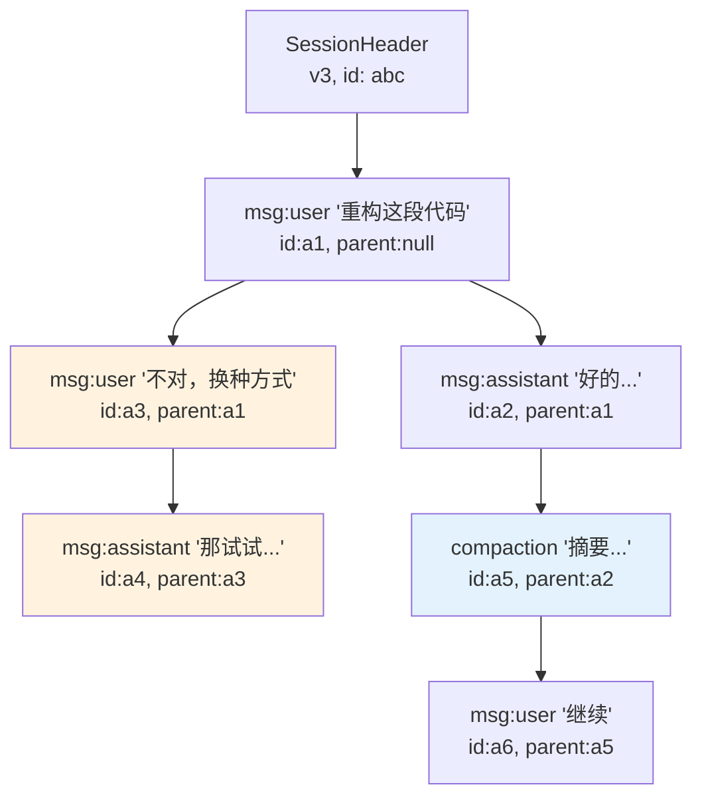
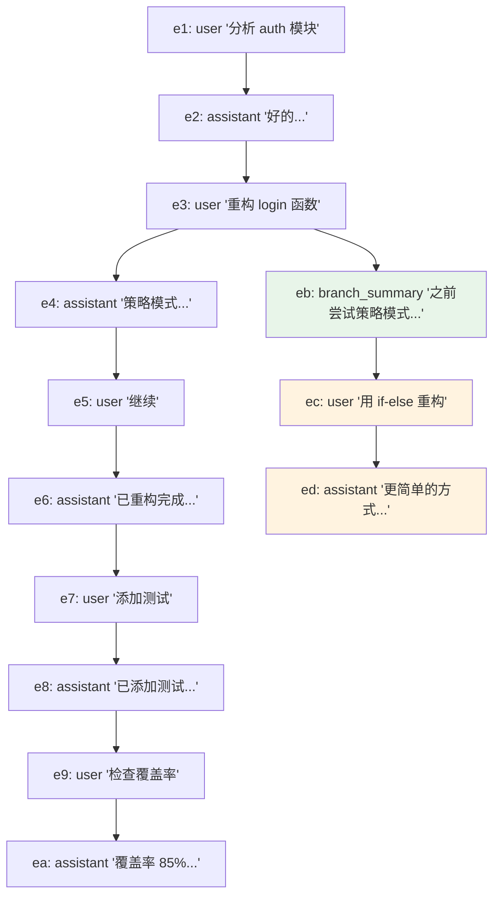

# 第 11 章：会话树 — 比"聊天记录"更好的数据模型

> **定位**：本章解析 pi 的会话持久化设计 — 为什么用树而不是列表，为什么用 JSONL 而不是数据库。
> 前置依赖：第 10 章（Agent 类的状态管理）。
> 适用场景：当你想理解 coding agent 为什么需要分支和回溯，或者想为自己的 agent 系统设计会话存储。

## Coding agent 的会话为什么不是线性的？

这是本章的核心设计问题。

聊天机器人的会话是线性的 — 一问一答，从头到尾。但 coding agent 的工作流本质上是非线性的：

- 用户让 agent 重构一段代码，agent 改了 5 个文件。用户发现改错了，想**回到改之前**，用不同的方式重试
- agent 执行了一个 bash 命令，结果不对。用户想**从那个命令之前**重新开始，换个命令
- 用户在第 20 轮发现第 5 轮的一个决策不对，想**跳回第 5 轮**创建一个新分支

如果用线性列表存储，这些操作要么不可能（无法回溯），要么需要复制整个会话历史（浪费存储）。

pi 的解决方案是**会话树** — 每条消息有一个 `parentId`，指向它的前驱消息。分支就是同一个父节点下的多个子节点。

## JSONL + parentId：极简的树形存储

会话文件是一个 JSONL（JSON Lines）文件，每行一个 JSON 对象。第一行是 session header，后续行是 session entries：

```typescript
// packages/coding-agent/src/core/session-manager.ts:29-36

interface SessionHeader {
  type: "session";
  version?: number;  // 当前 v3
  id: string;
  timestamp: string;
  cwd: string;
  parentSession?: string;  // fork 来源
}
```

`SessionHeader` 是会话文件的第一行，它不参与树结构，而是记录会话级别的元信息。`version` 字段驱动向后兼容的迁移逻辑（后文详述）。`parentSession` 在用户从一个分支创建新 session 文件时，记录来源 session 的路径，形成 session 之间的溯源链。

每个 entry 都有 `id` 和 `parentId`，形成树形结构：

```typescript
// packages/coding-agent/src/core/session-manager.ts:43-48

interface SessionEntryBase {
  type: string;
  id: string;
  parentId: string | null;  // null = 根节点
  timestamp: string;
}
```

`id` 是 8 位十六进制字符串，由 `randomUUID().slice(0, 8)` 生成，并通过碰撞检查确保唯一性。为什么不用完整的 UUID？因为这些 id 会出现在 TUI 的分支导航中，短 id 对人类更友好。`parentId` 指向前驱 entry 的 id，`null` 表示这是树的根节点（通常是用户的第一条消息）。



这张图中，`a3`（"不对，换种方式"）和 `a2`（"好的..."）共享同一个父节点 `a1`。这就是一个分支点。用户在 `a1` 之后走了两条路。`a5` 是一个 compaction entry — 它把 `a1→a2` 的对话压缩成摘要，`a6` 从摘要继续。

## 9 种 Entry 类型

`SessionEntry` 是 9 种类型的联合：

```typescript
// packages/coding-agent/src/core/session-manager.ts:137-146

type SessionEntry =
  | SessionMessageEntry      // 对话消息（user/assistant/toolResult）
  | ThinkingLevelChangeEntry // 思考级别变更
  | ModelChangeEntry         // 模型切换
  | CompactionEntry          // 上下文压缩摘要
  | BranchSummaryEntry       // 分支摘要
  | CustomEntry              // extension 数据（不进 LLM context）
  | CustomMessageEntry       // extension 消息（进 LLM context）
  | LabelEntry               // 用户书签
  | SessionInfoEntry;        // 会话元数据（显示名称）
```

这 9 种类型分为三层。理解这三层是理解整个 session 系统的关键。

### 核心层：影响 LLM context

核心层的 3 种类型直接参与 LLM context 的构建 — `buildSessionContext()` 函数在遍历树时，只有这些类型会被转换成发送给 LLM 的消息。

**SessionMessageEntry** — 对话的基本单元：

```typescript
// packages/coding-agent/src/core/session-manager.ts:50-53

interface SessionMessageEntry extends SessionEntryBase {
  type: "message";
  message: AgentMessage;
}
```

`message` 字段是 `AgentMessage` 类型，来自 pi-agent-core 层。它可以是 user 消息、assistant 消息、或 tool result。注意 `SessionMessageEntry` 本身并不区分消息角色 — 角色信息在 `message.role` 内部。这意味着一个 user 消息和一个 assistant 消息在 session 树中的地位是完全相同的：都是节点，都有 `parentId`，都可以被分支。

**CompactionEntry** — 上下文压缩的结果（第 12 章详述）：

```typescript
// packages/coding-agent/src/core/session-manager.ts:66-75

interface CompactionEntry<T = unknown> extends SessionEntryBase {
  type: "compaction";
  summary: string;
  firstKeptEntryId: string;
  tokensBefore: number;
  details?: T;
  fromHook?: boolean;
}
```

当对话变长、token 数接近 LLM 窗口限制时，pi 会把前面的对话压缩成一个摘要。`summary` 是压缩后的文本，`firstKeptEntryId` 标记从哪个 entry 开始保留原文（压缩点之后的消息不丢弃），`tokensBefore` 记录压缩前的 token 数。`details` 是一个泛型字段，让 extension 在压缩时附带结构化数据（比如文件操作索引）。`fromHook` 标记这个压缩是由 extension hook 生成的还是 pi 内置逻辑生成的。

**BranchSummaryEntry** — 分支时对被放弃路径的摘要：

```typescript
// packages/coding-agent/src/core/session-manager.ts:77-85

interface BranchSummaryEntry<T = unknown> extends SessionEntryBase {
  type: "branch_summary";
  fromId: string;
  summary: string;
  details?: T;
  fromHook?: boolean;
}
```

当用户跳回某个节点创建新分支时，pi 可以为被放弃的对话路径生成一个摘要，注入到新分支的上下文中。这样 LLM 在新分支中知道"之前尝试过什么、为什么不行"，避免重复犯错。`fromId` 指向分支点，`summary` 是旧路径的摘要。

### 元数据层：影响 session 状态

元数据层的 3 种类型记录会话过程中的配置变化。它们不生成 LLM 消息，但在 session reload 时恢复状态。

**ThinkingLevelChangeEntry** — 用户在对话中途切换了 thinking level（如从 `off` 切到 `high`）。`buildSessionContext()` 在遍历路径时会跟踪这个值，返回当前路径最后生效的 thinking level。

**ModelChangeEntry** — 用户在对话中途切换了模型（如从 Claude Sonnet 切到 Claude Opus）。同样在路径遍历时被提取，恢复到最后一次切换的状态。

**SessionInfoEntry** — 会话元数据，目前只有一个字段：`name`（用户自定义的会话显示名称）。这不是在树遍历中提取的，而是通过 `getSessionName()` 方法从后往前扫描最新的 `session_info` entry。

这三种类型的共同设计特点是：它们记录**事件**而非**状态**。不维护一个"当前配置"对象，而是把每次变更作为事件追加。最终状态通过重放事件得出。这是 event sourcing 的思想 — 在 append-only 的存储中，这是唯一合理的做法。

### 扩展层：为 extension 和用户提供扩展点

扩展层的 3 种类型是为生态设计的。它们让 extension 和用户可以在 session 中持久化自己的数据，而不需要修改 pi 的核心代码。

**CustomEntry** — extension 的私有数据仓库：

```typescript
// packages/coding-agent/src/core/session-manager.ts:97-101

interface CustomEntry<T = unknown> extends SessionEntryBase {
  type: "custom";
  customType: string;
  data?: T;
}
```

**不参与** LLM context。`customType` 是 extension 的标识符（如 `"my-extension:state"`），`data` 是任意结构化数据。用途：extension 在 session 中持久化内部状态。例如，一个代码审查 extension 可以把已审查的文件列表存为 `CustomEntry`，session reload 时扫描 `customType` 恢复状态。

**CustomMessageEntry** — extension 注入的 LLM 消息：

```typescript
// packages/coding-agent/src/core/session-manager.ts:128-134

interface CustomMessageEntry<T = unknown> extends SessionEntryBase {
  type: "custom_message";
  customType: string;
  content: string | (TextContent | ImageContent)[];
  details?: T;
  display: boolean;
}
```

**参与** LLM context — `buildSessionContext()` 会把它转换成 user 消息发送给 LLM。`content` 可以是纯文本或富媒体内容（文字 + 图片）。`display` 控制 TUI 渲染：`false` 表示完全隐藏（LLM 能看到但用户在界面上看不到），`true` 表示用特殊样式渲染（与普通 user 消息视觉区分）。`details` 存放 extension 私有元数据，不发送给 LLM。

`CustomEntry` 和 `CustomMessageEntry` 的关键区别值得再强调一次：

- `CustomEntry`：**不污染** LLM 对话。extension 的内部状态，LLM 看不到
- `CustomMessageEntry`：**影响** LLM 的输入。extension 主动向 LLM 注入额外上下文

这个区分让 extension 既能存储自己的状态（不干扰 LLM 对话质量），又能在需要时影响 LLM 的行为（比如注入项目约定、代码规范等上下文）。

**LabelEntry** — 用户书签：

```typescript
// packages/coding-agent/src/core/session-manager.ts:104-108

interface LabelEntry extends SessionEntryBase {
  type: "label";
  targetId: string;
  label: string | undefined;
}
```

`targetId` 指向被标记的 entry，`label` 是用户定义的标签文本。传 `undefined` 或空字符串表示清除标签。注意 `LabelEntry` 本身也是树节点（有 `id` 和 `parentId`），但它的语义是"对另一个 entry 的标注"。`buildSessionContext()` 完全忽略它。标签通过 `SessionManager` 内部的 `labelsById` Map 解析，在 `getTree()` 返回的树节点中作为 `label` 字段附带。

## SessionTreeNode：从 entry 列表到内存中的树

JSONL 文件是扁平的 — 所有 entry 按追加顺序排列，树结构隐含在 `parentId` 链中。要进行树操作（找分支、遍历路径、显示树形视图），需要先把扁平列表构建成内存中的树。这就是 `SessionTreeNode` 的角色：

```typescript
// packages/coding-agent/src/core/session-manager.ts:152-159

interface SessionTreeNode {
  entry: SessionEntry;
  children: SessionTreeNode[];
  /** Resolved label for this entry, if any */
  label?: string;
  /** Timestamp of the latest label change */
  labelTimestamp?: string;
}
```

`getTree()` 方法负责构建这棵树：

```typescript
// packages/coding-agent/src/core/session-manager.ts:1070-1107

getTree(): SessionTreeNode[] {
  const entries = this.getEntries();
  const nodeMap = new Map<string, SessionTreeNode>();
  const roots: SessionTreeNode[] = [];

  // 第一遍：创建所有节点，解析 label
  for (const entry of entries) {
    const label = this.labelsById.get(entry.id);
    const labelTimestamp = this.labelTimestampsById.get(entry.id);
    nodeMap.set(entry.id, { entry, children: [], label, labelTimestamp });
  }

  // 第二遍：建立父子关系
  for (const entry of entries) {
    const node = nodeMap.get(entry.id)!;
    if (entry.parentId === null || entry.parentId === entry.id) {
      roots.push(node);
    } else {
      const parent = nodeMap.get(entry.parentId);
      if (parent) {
        parent.children.push(node);
      } else {
        roots.push(node);  // 孤儿节点 → 当作根
      }
    }
  }
  // ... 按时间排序 children
  return roots;
}
```

构建逻辑分两遍遍历：第一遍为每个 entry 创建 `SessionTreeNode`，同时从 `labelsById` Map 解析标签；第二遍根据 `parentId` 建立父子关系。如果某个 entry 的 `parentId` 指向不存在的 id（可能是数据损坏），它被当作孤儿节点推入 `roots` 数组。最后，每个节点的 `children` 按时间戳排序，确保旧分支在前、新分支在后。

注意 `getTree()` 返回的是"防御性浅拷贝" — `entry` 对象是原始引用，但树结构（`children` 数组）是新建的。这意味着调用者可以安全地遍历树，而不会意外修改 `SessionManager` 的内部状态。

一个设计细节：正常的 session 应该只有一个根节点（第一条用户消息）。但 `getTree()` 返回的是 `SessionTreeNode[]`（数组），允许多个根。这是防御性设计 — 处理数据损坏或 `resetLeaf()` 后创建的多棵子树。

## buildSessionContext：从树到 LLM 消息数组

`buildSessionContext()` 是 session 存储和 Agent 运行时之间的桥梁。Agent 需要一个线性的消息数组来调用 LLM，而 session 是一棵树。这个函数的职责是：给定一个叶节点，沿 `parentId` 链回溯到根节点，收集路径上的消息，构建 `SessionContext`。

```typescript
// packages/coding-agent/src/core/session-manager.ts:310-348

function buildSessionContext(
  entries: SessionEntry[],
  leafId?: string | null,
  byId?: Map<string, SessionEntry>,
): SessionContext {
  // 1. 构建 id→entry 索引（如果没传入）
  if (!byId) {
    byId = new Map<string, SessionEntry>();
    for (const entry of entries) {
      byId.set(entry.id, entry);
    }
  }

  // 2. 找到叶节点
  let leaf: SessionEntry | undefined;
  if (leafId === null) {
    return { messages: [], thinkingLevel: "off", model: null };
  }
  if (leafId) {
    leaf = byId.get(leafId);
  }
  if (!leaf) {
    leaf = entries[entries.length - 1];  // 默认取最后一个
  }

  // 3. 从叶到根收集路径
  const path: SessionEntry[] = [];
  let current: SessionEntry | undefined = leaf;
  while (current) {
    path.unshift(current);
    current = current.parentId ? byId.get(current.parentId) : undefined;
  }
  // ...
}
```

路径收集之后，函数进入两个阶段：

**阶段一：提取元数据。** 遍历路径上的每个 entry，跟踪最后生效的 `thinkingLevel` 和 `model`，以及路径上最后一个 `CompactionEntry`。

**阶段二：构建消息数组。** 这里有两种情况：

1. **无 compaction**：路径上所有 `message`、`custom_message`、`branch_summary` 类型的 entry 依次转换成 `AgentMessage`，其他类型（`thinking_level_change`、`model_change`、`custom`、`label`、`session_info`）被跳过。

2. **有 compaction**：先输出压缩摘要消息，然后输出从 `firstKeptEntryId` 到 compaction 之间的保留消息，最后输出 compaction 之后的消息。这保证了 LLM 看到的是"摘要 + 保留的近期对话 + 最新对话"，而不是完整的历史。

```typescript
// packages/coding-agent/src/core/session-manager.ts:373-383

const appendMessage = (entry: SessionEntry) => {
  if (entry.type === "message") {
    messages.push(entry.message);
  } else if (entry.type === "custom_message") {
    messages.push(
      createCustomMessage(entry.customType, entry.content,
        entry.display, entry.details, entry.timestamp),
    );
  } else if (entry.type === "branch_summary" && entry.summary) {
    messages.push(createBranchSummaryMessage(
      entry.summary, entry.fromId, entry.timestamp));
  }
};
```

`appendMessage` 是一个局部函数，它定义了"哪些 entry 类型产生 LLM 消息"的规则。注意 `CustomMessageEntry` 被转换成 `CustomMessage`（一种特殊的 user 消息），而 `BranchSummaryEntry` 被转换成 `BranchSummaryMessage`。这些转换由 `messages.ts` 中的工厂函数完成，确保消息格式符合 LLM API 的要求。

返回的 `SessionContext` 包含三个字段：

```typescript
// packages/coding-agent/src/core/session-manager.ts:161-165

interface SessionContext {
  messages: AgentMessage[];      // 发送给 LLM 的消息数组
  thinkingLevel: string;         // 当前路径的 thinking level
  model: { provider: string; modelId: string } | null;
}
```

Agent 拿到 `SessionContext` 后，用 `messages` 调用 LLM，用 `thinkingLevel` 和 `model` 恢复当前配置。整个流程形成一条清晰的数据管线：**JSONL 文件 → entry 列表 → 树遍历 → 路径提取 → 消息数组 → LLM 调用**。

## Session 版本迁移：v1 → v2 → v3

会话格式经历了三个版本。向后兼容至关重要 — 用户的历史 session 文件不能因为升级 pi 而丢失。

**v1：纯线性列表。** 最早的版本没有 `id` 和 `parentId`，entry 按顺序排列，不支持分支。

**v2：加入树形结构。** 为每个 entry 生成 `id`，将前后关系转换成 `parentId` 链。

```typescript
// packages/coding-agent/src/core/session-manager.ts:211-237

function migrateV1ToV2(entries: FileEntry[]): void {
  const ids = new Set<string>();
  let prevId: string | null = null;

  for (const entry of entries) {
    if (entry.type === "session") {
      entry.version = 2;
      continue;
    }

    entry.id = generateId(ids);
    entry.parentId = prevId;
    prevId = entry.id;

    // 转换 compaction 的索引引用为 id 引用
    if (entry.type === "compaction") {
      const comp = entry as CompactionEntry
        & { firstKeptEntryIndex?: number };
      if (typeof comp.firstKeptEntryIndex === "number") {
        const targetEntry = entries[comp.firstKeptEntryIndex];
        if (targetEntry && targetEntry.type !== "session") {
          comp.firstKeptEntryId = targetEntry.id;
        }
        delete comp.firstKeptEntryIndex;
      }
    }
  }
}
```

迁移逻辑很直接：遍历所有 entry，为每个生成唯一 id，`parentId` 指向前一个 entry（因为 v1 是线性的，所以父节点就是前一个）。特殊处理 `CompactionEntry` — v1 用数组索引（`firstKeptEntryIndex`）标记保留起点，v2 改用 entry id（`firstKeptEntryId`）。

**v3：重命名 hookMessage → custom。** 早期 extension 消息的角色名叫 `hookMessage`，v3 统一改为 `custom`。这是一个语义清理。

```typescript
// packages/coding-agent/src/core/session-manager.ts:239-255

function migrateV2ToV3(entries: FileEntry[]): void {
  for (const entry of entries) {
    if (entry.type === "session") {
      entry.version = 3;
      continue;
    }
    if (entry.type === "message") {
      const msgEntry = entry as SessionMessageEntry;
      if (msgEntry.message
        && (msgEntry.message as { role: string }).role
          === "hookMessage") {
        (msgEntry.message as { role: string }).role = "custom";
      }
    }
  }
}
```

所有迁移由 `migrateToCurrentVersion()` 统一调度，在 `setSessionFile()` 加载文件时自动执行。迁移是就地修改（mutate in place），修改后用 `_rewriteFile()` 重写整个文件。这意味着迁移是单向的、不可逆的 — 一旦文件被升级到 v3，旧版本的 pi 无法读取它。这是一个有意识的取舍：pi 的更新频率足够高，不需要支持降级。

```typescript
// packages/coding-agent/src/core/session-manager.ts:261-271

function migrateToCurrentVersion(entries: FileEntry[]): boolean {
  const header = entries.find((e) => e.type === "session")
    as SessionHeader | undefined;
  const version = header?.version ?? 1;

  if (version >= CURRENT_SESSION_VERSION) return false;

  if (version < 2) migrateV1ToV2(entries);
  if (version < 3) migrateV2ToV3(entries);

  return true;
}
```

版本号采用递增整数（不是 semver），迁移链是线性的。加新版本时，只需在末尾加一个 `if (version < N) migrateVN_1ToVN(entries)`。这种"梯级迁移"模式简单、可组合、不容易出错。

## 具体案例：5 轮对话 + 在第 3 轮创建分支

让我们用一个具体的例子来理解 session tree 的工作流。

用户开始一个新 session，聊了 5 轮（10 条消息）。然后发现第 3 轮的方向不对，跳回第 3 轮的用户消息处创建新分支。

### 第一阶段：正常的 5 轮对话

JSONL 文件内容（简化，只保留关键字段）：

```json
{"type":"session","version":3,"id":"sess-001","timestamp":"...","cwd":"/project"}
{"type":"message","id":"e1","parentId":null,"message":{"role":"user","content":"分析 auth 模块"}}
{"type":"message","id":"e2","parentId":"e1","message":{"role":"assistant","content":"好的，我来看看..."}}
{"type":"message","id":"e3","parentId":"e2","message":{"role":"user","content":"重构 login 函数"}}
{"type":"message","id":"e4","parentId":"e3","message":{"role":"assistant","content":"我建议用策略模式..."}}
{"type":"message","id":"e5","parentId":"e4","message":{"role":"user","content":"继续"}}
{"type":"message","id":"e6","parentId":"e5","message":{"role":"assistant","content":"已重构完成..."}}
{"type":"message","id":"e7","parentId":"e6","message":{"role":"user","content":"添加测试"}}
{"type":"message","id":"e8","parentId":"e7","message":{"role":"assistant","content":"已添加 3 个测试..."}}
{"type":"message","id":"e9","parentId":"e8","message":{"role":"user","content":"检查覆盖率"}}
{"type":"message","id":"ea","parentId":"e9","message":{"role":"assistant","content":"覆盖率 85%..."}}
```

此时 `leafId = "ea"`，树是一条直线：`e1 → e2 → e3 → e4 → e5 → e6 → e7 → e8 → e9 → ea`。

### 第二阶段：在第 3 轮创建分支

用户发现策略模式太重了，想回到 `e3`（"重构 login 函数"）换一种方式。TUI 调用 `sessionManager.branch("e3")`，然后用户输入新消息。

pi 不修改任何已有 entry，只追加新行：

```json
{"type":"branch_summary","id":"eb","parentId":"e3","fromId":"e3","summary":"之前尝试用策略模式重构 login，完成了重构并添加了 3 个测试，覆盖率 85%"}
{"type":"message","id":"ec","parentId":"eb","message":{"role":"user","content":"用简单的 if-else 重构"}}
{"type":"message","id":"ed","parentId":"ec","message":{"role":"assistant","content":"好的，更简单的方式..."}}
```

此时 `leafId = "ed"`，树变成了：



### LLM 看到的消息

调用 `buildSessionContext(entries, "ed")` 时，函数从 `ed` 沿 `parentId` 回溯到根：`e1 → e2 → e3 → eb → ec → ed`。注意旧分支的 `e4` 到 `ea` 完全不在这条路径上。

LLM 收到的消息数组是：

1. `user: "分析 auth 模块"` ← e1
2. `assistant: "好的，我来看看..."` ← e2
3. `user: "重构 login 函数"` ← e3
4. `user: "[Branch Summary] 之前尝试用策略模式重构..."` ← eb（BranchSummaryEntry 转换的消息）
5. `user: "用简单的 if-else 重构"` ← ec
6. `assistant: "好的，更简单的方式..."` ← ed

LLM 知道之前试过策略模式（通过 branch summary），但上下文中只有新分支的对话。旧分支的 6 条消息不占用 token 预算。

### JSONL 文件的关键特性

整个过程中，JSONL 文件只做了 append 操作。原始的 10 行没有被修改或删除。分支操作的"成本"是 3 行新 entry（branch_summary + 2 条新消息），而不是复制前 6 行。这就是 `parentId` 树结构的核心价值：**分支是零拷贝的**。

## 取舍分析

### 得到了什么

**1. Append-only 的容错性。** JSONL 是 append-only 的 — 新 entry 只追加到文件末尾，不修改已有内容。即使进程在写入过程中崩溃，最坏情况是最后一行不完整（被丢弃），之前的所有 entry 完好无损。数据库在崩溃时可能损坏索引或事务日志。`parseSessionEntries()` 中的 `try/catch` 正是为此设计 — 跳过格式错误的行，解析剩余内容。

**2. 人类可读可修复。** JSONL 文件可以用任何文本编辑器打开、阅读、甚至手动修复。如果某个 entry 出了问题，用户可以直接删除那一行。`LabelEntry` 可以通过设置 `label: undefined` 来"删除"标签 — 不需要修改原始 entry，只需追加一个新的 label entry。

**3. 零依赖。** 不需要 SQLite、LevelDB 或任何外部存储引擎。`fs.appendFileSync` 就够了。pi 的 `_persist` 方法在有了第一条 assistant 消息后，要么 flush 全部内容，要么 append 单条 entry — 全部是同步文件 I/O，没有连接池、事务、WAL 日志等复杂性。

**4. 天然支持分支。** `parentId` 让分支和跳转变成了简单的"追加一个新 entry，它的 parentId 指向目标节点"。不需要复制任何数据。`branch()` 方法只有一行核心逻辑：`this.leafId = branchFromId`。

### 放弃了什么

**1. 没有随机访问。** 要找到某个 entry，必须从头读到尾构建 `byId` Map。对于长会话（几百轮），这意味着每次加载时要解析整个 JSONL 文件。实际的性能特征取决于文件大小：

- 10 轮对话（~20 entry，~10KB）：解析时间 < 1ms，可以忽略
- 100 轮对话（~200 entry，~100KB）：解析时间几毫秒，用户无感知
- 500 轮对话（~1000 entry，带 tool result 可能 ~5MB）：解析时间几十毫秒，首次加载有轻微延迟

`buildSessionContext()` 的时间复杂度是 O(N)（N = 总 entry 数），因为即使只需要一条路径，也要先构建 `byId` 索引。不过索引构建后，路径遍历本身是 O(D)（D = 树的深度，即路径长度）。

**2. 没有索引。** 不能按工具名、时间范围、文件路径等维度快速查询。全部依赖遍历。如果需要"找到所有修改了 auth.ts 的 tool call"，必须遍历所有 entry 并检查消息内容。

**3. 文件会持续增长。** compaction 压缩了 LLM context，但 JSONL 文件中的原始 entry 仍然保留。一个长时间使用的 session 可能有几 MB 的 JSONL 文件。`createBranchedSession()` 提供了一种"修剪"方式 — 提取单条路径到新文件，丢弃其他分支。但这创建的是新 session，不是原地修剪。

**4. 树的遍历需要全量加载。** 要构建树、找到某个分支、确定叶节点，都需要先把所有 entry 加载到内存。`SessionManager` 通过 `byId` Map 做了一层缓存，加载后的所有操作（`getBranch`、`getEntry`、`getChildren`）都是 O(1) 或 O(D) 的。但首次加载（`setSessionFile`）和迁移（`migrateToCurrentVersion`）必须全量读取和解析。

**5. 单进程写入。** `appendFileSync` 是同步阻塞调用，不支持并发写入。如果多个 pi 实例同时操作同一个 session 文件，会出现竞争条件。这对 pi 的使用场景不是问题 — 每个终端窗口是独立 session — 但对多用户场景（如团队共享 session）不适用。

对于 pi 的使用场景 — 单用户、本地文件系统、会话大小通常在 KB 到低 MB 级别 — JSONL 的简单性远胜于数据库的复杂性。选择一个"够用的简单方案"而不是"面面俱到的复杂方案"，这本身就是一个值得学习的工程决策。

---

### 版本演化说明
> 本章核心分析基于 pi-mono v0.66.0。Session 格式经历了 3 个版本：
> v1（无 id/parentId，纯线性）→ v2（加入 id/parentId 树形结构）→ v3（当前，统一 custom 角色名）。
> `CustomEntry`、`CustomMessageEntry`、`LabelEntry`、`SessionInfoEntry` 是后来添加的，
> 为 extension 生态和用户体验提供扩展点。旧版 session 文件通过 `migrateV1ToV2` 和 `migrateV2ToV3` 自动升级。
