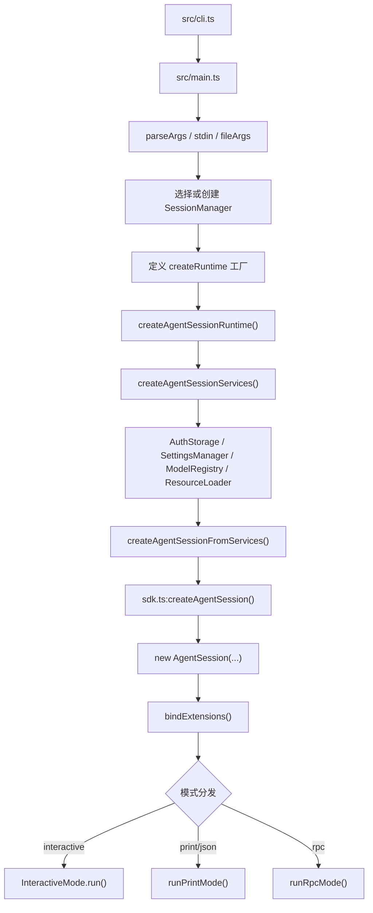

# pi-coding-agent：启动、运行时与三种 Mode

> **定位**：本篇把 `packages/coding-agent` 的启动链、运行时装配链、会话宿主、三种 mode 串成一张图。
> 前置依赖：建议先看 `tutorial/pi-coding-agent.md`。
> 适用场景：当你想知道 `pi` 命令从启动到进入 interactive/print/rpc 模式，中间到底经过了哪些对象。

## 先抓住一条主线

`coding-agent` 的启动链可以浓缩成一句话：

> **`main.ts` 负责决定“开什么壳”，`sdk.ts` 负责决定“造什么 session”，`agent-session.ts` 负责决定“这个 session 怎么活”。**

这三个文件分别解决三个不同层级的问题：

- `src/main.ts`
  - CLI 应用编排器
  - 负责参数、session 选择、服务创建、模式分发
- `src/core/sdk.ts`
  - 会话工厂
  - 负责把模型、工具、settings、resource loader、session context 装成 `AgentSession`
- `src/core/agent-session.ts`
  - 会话核心
  - 负责 prompt、持久化、tool hook、compaction、retry、bash、extensions

---

## 总启动图



这条链最值得注意的地方是：**runtime 创建和 session 创建是分离的。**

也就是说：

- `createAgentSessionServices()`
  - 先创建 cwd 绑定的基础设施
- `createAgentSessionFromServices()`
  - 再基于这些基础设施创建真正的 `AgentSession`

这不是多余抽象，而是让 CLI 层可以在真正创建 session 之前，先把下面这些事做完：

- 解析模型范围
- 决定 active tools
- 装载 extensions
- 收集 diagnostics
- 处理 CLI 传入的 API key / flags

---

## 第一层：`cli.ts` 是极薄入口

`src/cli.ts` 很薄，它的职责基本只有三件事：

1. 初始化进程级环境
2. 配置 HTTP dispatcher
3. 调 `main(process.argv.slice(2))`

这个薄入口说明一个很重要的设计判断：

> `coding-agent` 的复杂性不在 shell 入口，而在运行时装配。

也因此，真正值得读的是 `main.ts` 而不是 `cli.ts`。

---

## 第二层：`main.ts` 是产品启动编排器

### `main.ts` 在做什么

如果把 `main.ts` 的职责压缩成一个表：

| 阶段 | 负责什么 | 关键文件/函数 |
| --- | --- | --- |
| 1 | 解析 CLI 参数 | `cli/args.ts` |
| 2 | 读 stdin 与 `@file` 参数 | `readPipedStdin()`、`prepareInitialMessage()` |
| 3 | 决定运行模式 | `resolveAppMode()` |
| 4 | 选择/创建 session | `SessionManager`、`session-picker.ts` |
| 5 | 定义 `createRuntime` 工厂 | `main.ts` 内部闭包 |
| 6 | 创建 runtime | `createAgentSessionRuntime()` |
| 7 | 启动具体 mode | `InteractiveMode` / `runPrintMode()` / `runRpcMode()` |

它是典型的**产品壳层**代码：

- 不实现具体产品机制
- 但负责决定何时创建、按什么顺序创建、把哪些参数传给谁

### 为什么 `main.ts` 要自己定义 `createRuntime`

这是 `main.ts` 最关键的一个点。

它不会直接写死：

```typescript
const runtime = await createAgentSessionRuntime(...)
```

而是先定义一个 `createRuntime` 闭包，再交给 `createAgentSessionRuntime()` 使用。

这么做的原因是：

- session 切换时，cwd 可能变化
- cwd 变化时，`settingsManager` / `resourceLoader` / `modelRegistry` 这些服务都必须随 cwd 重建
- 所以 runtime 需要一个**“如何重新创建自己”**的工厂，而不是一次性建好的死对象

于是形成了这个分层：

```text
main.ts
  提供“如何创建一个 cwd 绑定 runtime”的工厂
    ↓
AgentSessionRuntime
  在 new / resume / fork / import 时反复调用这个工厂
```

---

## 第三层：`AgentSessionServices` 是 cwd 绑定基础设施层

`src/core/agent-session-services.ts` 的角色，经常比 `AgentSession` 本身更容易被忽略。

但它的价值非常大：

> **把“可随 cwd 切换而重建的基础设施”从“真正的会话对象”里剥离出来。**

### 这个服务层包括什么

`AgentSessionServices` 主要包含：

- `cwd`
- `agentDir`
- `authStorage`
- `settingsManager`
- `modelRegistry`
- `resourceLoader`
- `diagnostics`

你可以把它理解为：

```text
服务层 = 这个 cwd 下可用的环境事实
会话层 = 基于这些环境事实创建出来的业务对象
```

### 为什么服务层和会话层要分开

因为这两者变化频率不同：

- `services`
  - 依赖 cwd、settings、resource loading 结果
  - 在切 session / 切 cwd 时通常要整体重建
- `AgentSession`
  - 依赖服务层产物和会话上下文
  - 是产品层行为中心

如果把二者揉在一起，`newSession()`、`switchSession()`、`fork()` 的实现会更混乱：

- 一部分状态要保留
- 一部分状态要清空
- 一部分状态要按新 cwd 重建

拆开以后，心智模型清晰很多：

1. 先 tear down 旧 session
2. 再按目标 cwd 创建新的 services
3. 再基于新的 services 创建新的 `AgentSession`

---

## 第四层：`sdk.ts` 是会话工厂

### `createAgentSession()` 到底造了什么

`src/core/sdk.ts` 不是“给 npm 用户方便调用”的薄包装，它是真正的装配器。

它会：

1. 解析 cwd / agentDir
2. 创建或复用 `AuthStorage`
3. 创建或复用 `ModelRegistry`
4. 创建或复用 `SettingsManager`
5. 创建或复用 `SessionManager`
6. 创建或复用 `ResourceLoader`
7. 从已有 session 恢复 model / thinking level
8. 解析默认工具与自定义工具
9. 创建底层 `Agent`
10. 最终构造 `AgentSession`

这意味着：

> `sdk.ts` 干的不是“启动一个 CLI”，而是“把 coding-agent 产品需要的所有运行时依赖拼起来”。

### 它和 `main.ts` 的边界

`main.ts` 和 `sdk.ts` 容易被混淆，但两者其实分工很清楚：

- `main.ts`
  - 产品启动壳
  - 负责参数、模式、用户输入、runtime 重建策略
- `sdk.ts`
  - 会话装配厂
  - 负责创建可用的 `AgentSession`

可以理解成：

```text
main.ts 决定何时创建
sdk.ts 决定如何创建
```

---

## 第五层：`AgentSessionRuntime` 是当前会话宿主

`src/core/agent-session-runtime.ts` 的角色不是“再包一层 AgentSession”，而是：

> **持有当前激活的 session，并负责把“切换 session”这类操作从业务对象里拿出来。**

### 它主要解决什么问题

如果没有 `AgentSessionRuntime`，这些操作都得直接塞进 `AgentSession`：

- 新建 session
- 恢复另一个 session 文件
- fork 到新 session
- import 外部 session JSONL
- 切换 cwd
- dispose 旧 session 并 rebind UI

这样 `AgentSession` 会同时负责：

- 当前会话内的业务行为
- 当前会话之外的宿主行为

两种职责会缠在一起。

现在拆开以后：

- `AgentSession`
  - 只关心“当前会话内部怎么运行”
- `AgentSessionRuntime`
  - 关心“当前宿主现在持有哪一个会话”

### 它的几个核心方法

| 方法 | 作用 | 本质 |
| --- | --- | --- |
| `newSession()` | 创建全新 session | 当前宿主切到一个空白会话 |
| `switchSession()` | 打开已有 session | 当前宿主切到另一个 JSONL |
| `fork()` | 从旧节点分叉 | 基于当前会话的一段历史创建新 session |
| `importSession()` | 导入外部 JSONL | 把外部会话复制到 session 目录并切过去 |
| `dispose()` | 销毁当前 runtime | 释放旧会话与扩展上下文 |

### 为什么它要有 `rebindSession`

切换 session 后，TUI / RPC / print mode 这些上层壳都还活着。

它们需要把：

- 旧的 `session` 引用
- 旧的 extension UI context
- 旧的 event subscription

替换成新的。

`AgentSessionRuntime` 通过 `rebindSession()` 提供这个钩子，让宿主 UI 可以在 session 替换后重新绑定，而不必重启整个应用。

这使得：

> **“切会话”变成重绑对象，而不是重启进程。**

---

## 第六层：`AgentSession` 才是真正的业务核心

`src/core/agent-session.ts` 是全包最重要的类。

它的复杂性来自一个事实：

> 它不是单纯的 “Agent 包装器”，而是把 coding-agent 的产品行为全部加在 `Agent` 外面。

### 它管的事情远超 `prompt()`

`AgentSession` 同时管理：

- 当前 `Agent`
- `SessionManager`
- `SettingsManager`
- `ModelRegistry`
- `ResourceLoader`
- base tools / custom tools / extension tools
- steering / follow-up 队列
- 自动 compaction
- overflow recovery
- bash 执行
- auto retry
- branch summary
- extension 绑定与资源扩展

这些状态都集中在一个对象里，所以这个类本质上像一个**产品内核**，而不是一个 data class。

### 它最值得关注的几个入口

| 方法 | 作用 |
| --- | --- |
| `prompt()` | 用户主输入入口，进入完整 turn 流程 |
| `compact()` | 手动触发上下文压缩 |
| `bindExtensions()` | 把扩展系统真正接进当前会话 |
| `executeBash()` | 从 session 层执行外部命令并记录消息 |
| `navigateTree()` | 会话树导航 |
| `reload()` | 重新加载 settings / resources / extensions |

### 为什么 `AgentSession` 一上来就订阅 `Agent`

构造函数里最重要的两件事是：

1. `this.agent.subscribe(this._handleAgentEvent)`
2. `this._installAgentToolHooks()`

这意味着 `AgentSession` 从一开始就把自己插在底层 `Agent` 的事件流上。

于是只要底层 agent 有行为：

- 消息开始/更新/结束
- tool call 前/后
- turn 结束

`AgentSession` 就能立即做产品层逻辑：

- 追加 session entry
- 更新 UI 队列
- 判断是否要自动 compaction
- 触发 extension event
- 触发 retry

所以最准确的理解不是：

> `AgentSession` 持有一个 `Agent`

而是：

> `AgentSession` 通过订阅和 hook，把 `Agent` 升格成了一个产品 session。

---

## 三种 Mode 为什么能共用一套核心

### `interactive`

`interactive` 是最重的模式。

它需要：

- 全屏 TUI
- 键盘输入与快捷键
- footer / selector / tree / diff / thinking block 等组件
- extension UI 注入
- session 切换和 rebind

但它依然没有重写 session 逻辑。它只是：

- 绑定 `AgentSessionRuntime`
- 订阅 `AgentSession` 事件
- 把事件渲染成 TUI 组件

### `print`

`print` 模式最能说明这套分层为什么干净。

它不需要：

- 全屏 UI
- session tree 可视化
- 复杂的用户交互

它只需要：

1. 创建 runtime
2. 绑定 extensions
3. 调 `session.prompt()`
4. 监听输出
5. 按 text/json 打印结果

也就是说，**print 模式只是换了外壳，没有换内核。**

### `rpc`

`rpc` 模式再进一步：

- 它甚至不是给人看的
- 而是给另一个宿主程序调用的

它把 JSONL RPC 请求映射到：

- `runtime` 的 session lifecycle
- `session` 的 prompt / setModel / compact / navigateTree 等方法

这再次说明 `coding-agent` 的产品边界设计得很清楚：

> 会话核心和 I/O 壳是分离的，所以同一套核心既能支撑 TUI，也能支撑 headless RPC。

---

## 目录级文件地图

### `src/core/` 中与启动链直接相关的文件

| 文件 | 定位 | 被谁调用 | 它主要调用谁 |
| --- | --- | --- | --- |
| `agent-session-runtime.ts` | 当前会话宿主 | `main.ts`、SDK | `createRuntime` 工厂、`SessionManager` |
| `agent-session-services.ts` | cwd 服务工厂 | `main.ts`、`agent-session-runtime.ts` | `AuthStorage`、`SettingsManager`、`ModelRegistry`、`DefaultResourceLoader` |
| `sdk.ts` | `AgentSession` 装配器 | `agent-session-services.ts`、外部 SDK | `SessionManager`、`ResourceLoader`、`AgentSession` |
| `agent-session.ts` | 会话内核 | `sdk.ts`、`AgentSessionRuntime`、modes | `Agent`、`SessionManager`、`ExtensionRunner`、`compaction/*` |
| `session-manager.ts` | 会话树/持久化 | `sdk.ts`、`AgentSession`、CLI session 选择器 | JSONL、context build |
| `model-resolver.ts` | 模型解析器 | `main.ts`、`sdk.ts` | `ModelRegistry` |
| `auth-storage.ts` | 凭据存储 | services 层 | 文件系统 |

### `src/modes/` 中与外壳直接相关的文件

| 文件 | 定位 | 被谁调用 | 它主要调用谁 |
| --- | --- | --- | --- |
| `interactive/interactive-mode.ts` | 交互模式宿主 | `main.ts` | `AgentSessionRuntime`、TUI 组件 |
| `print-mode.ts` | 单次输出宿主 | `main.ts` | `AgentSessionRuntime.session.prompt()` |
| `rpc/rpc-mode.ts` | headless RPC 宿主 | `main.ts` | `AgentSessionRuntime`、`AgentSession` |

---

## 为什么 runtime / services / session 三层拆得这么细

这一点是整层架构最值得强调的设计。

如果不拆，会出现两种坏结果：

### 坏结果 1：一个类承担两种生命周期

- 会话内生命周期
  - prompt
  - tool calls
  - retry
  - compaction
- 宿主生命周期
  - new session
  - resume
  - fork
  - import
  - UI rebind

这两类生命周期天然不同，不该由同一对象同时负责。

### 坏结果 2：cwd 绑定的环境状态和会话状态缠在一起

例如切 session 时，哪些东西要变？

- `cwd`
- `settingsManager`
- `resourceLoader`
- `modelRegistry`
- `systemPrompt`
- 可能的 extension runtime

这些都是环境层的变化，不该和“当前 turn 队列里有哪些消息”放在同一个对象里处理。

所以最终拆成：

```text
宿主层：AgentSessionRuntime
环境层：AgentSessionServices
业务层：AgentSession
```

这是整个启动架构最核心的设计判断。

---

## 和后续专题的衔接

本篇到这里先收住，因为再往下就会进入具体产品机制：

- 如果你要看 session 如何持久化、为什么是树而不是线性消息列表
  - 看 `pi-session-tree.md`
- 如果你要看上下文何时压缩、怎么选切点、摘要如何写回 session
  - 看 `pi-compaction.md`
- 如果你要看 settings / AGENTS.md / SYSTEM.md 怎么叠加
  - 看 `pi-config-layers.md`
- 如果你要看最终 system prompt 怎么拼出来
  - 看 `pi-system-prompt.md`

本篇负责建立一个最重要的总视角：

> `coding-agent` 的启动不是“启动一个 CLI”。
> 它本质上是在**启动一个可切换、可恢复、可扩展的 session runtime**，
> 然后再给这个 runtime 套上 interactive / print / rpc 三种外壳。
