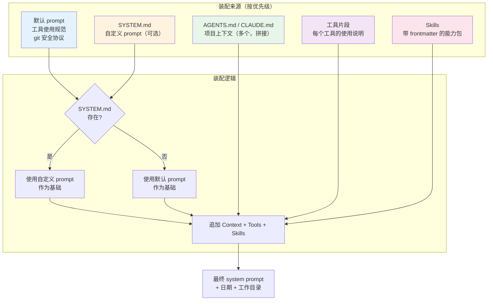
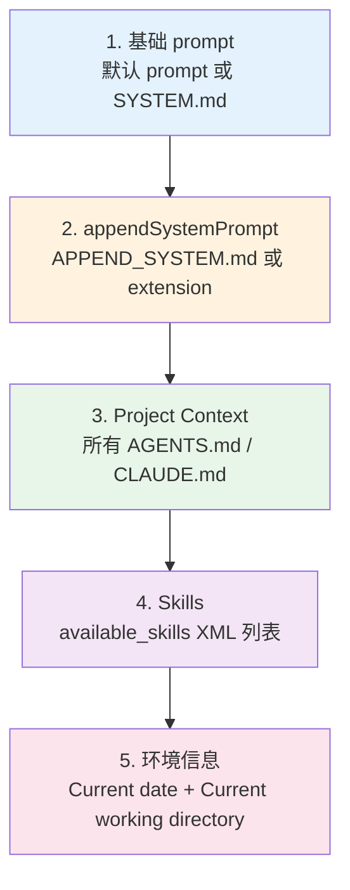

# 第 14 章：System Prompt 是一套装配流程

> **定位**：本章解析 pi 的 system prompt 如何从多个来源动态拼接而成。
> 前置依赖：第 13 章（三级配置覆盖）。
> 适用场景：当你想理解 pi 的 prompt 为什么那么长，或者想定制 prompt 的行为。

## Prompt 不是一个字符串

这是本章的核心设计问题。

打开 pi 的 system prompt，你会看到一段几千 token 的文本。但这段文本不是手写的一整块 — 它是从 5 个来源动态装配出来的。



### 装配入口：`buildSystemPrompt`

```typescript
// packages/coding-agent/src/core/system-prompt.ts:8-25（接口）

interface BuildSystemPromptOptions {
  customPrompt?: string;        // SYSTEM.md 的内容
  selectedTools?: string[];     // 启用的工具列表
  toolSnippets?: Record<string, string>;  // 工具说明片段
  promptGuidelines?: string[];  // 额外的指引条目
  appendSystemPrompt?: string;  // 追加文本
  cwd?: string;                 // 工作目录
  contextFiles?: Array<{ path: string; content: string }>;  // AGENTS.md
  skills?: Skill[];             // 已发现的 skills
}
```

注意这个函数不做**任何** I/O 操作 — 所有输入都是预加载的。文件发现（搜索 AGENTS.md）、skill 发现（搜索 skill 文件）、配置读取 — 这些都在调用 `buildSystemPrompt` 之前完成。函数本身是纯粹的字符串拼接。

## 默认 Prompt：非 SYSTEM.md 路径

当用户没有提供 `SYSTEM.md` 时，pi 使用内建的默认 prompt。这是大多数用户的路径，也是 prompt 装配中最复杂的分支。

### 工具列表注入

默认 prompt 首先构建可用工具的列表。一个工具只有在调用者提供了 `toolSnippets`（一行描述）时才会出现在列表中：

```typescript
// packages/coding-agent/src/core/system-prompt.ts:85-89

const tools = selectedTools || ["read", "bash", "edit", "write"];
const visibleTools = tools.filter(name => !!toolSnippets?.[name]);
const toolsList = visibleTools.length > 0
  ? visibleTools.map(name => `- ${name}: ${toolSnippets![name]}`).join("\n")
  : "(none)";
```

这意味着 extension 注册的自定义工具也可以出现在 system prompt 中 — 只要 extension 提供了 `toolSnippets`。最终在 prompt 中呈现为：

```
Available tools:
- read: Read files from the filesystem
- bash: Execute shell commands
- edit: Make targeted edits to existing files
- write: Create or overwrite files
```

### Guidelines 动态生成

Guidelines 不是硬编码的列表 — 它根据可用工具动态生成，并去重：

```typescript
// packages/coding-agent/src/core/system-prompt.ts:91-125（简化）

const guidelinesList: string[] = [];
const guidelinesSet = new Set<string>();
const addGuideline = (guideline: string): void => {
  if (guidelinesSet.has(guideline)) return;
  guidelinesSet.add(guideline);
  guidelinesList.push(guideline);
};

const hasBash = tools.includes("bash");
const hasGrep = tools.includes("grep");
const hasFind = tools.includes("find");

// 根据可用工具组合生成不同的指引
if (hasBash && !hasGrep && !hasFind && !hasLs) {
  addGuideline("Use bash for file operations like ls, rg, find");
} else if (hasBash && (hasGrep || hasFind || hasLs)) {
  addGuideline("Prefer grep/find/ls tools over bash for file exploration " +
    "(faster, respects .gitignore)");
}

// 注入 extension 提供的额外指引
for (const guideline of promptGuidelines ?? []) {
  const normalized = guideline.trim();
  if (normalized.length > 0) addGuideline(normalized);
}

// 总是包含的基础指引
addGuideline("Be concise in your responses");
addGuideline("Show file paths clearly when working with files");
```

去重机制（`guidelinesSet`）确保即使 extension 提供的 guideline 和内建的重复，也不会出现两次。guideline 的注入顺序是：工具相关的指引 → extension 提供的指引 → 通用指引。

### 默认 Prompt 的完整结构

所有部分拼接后，默认 prompt 的结构如下：

```typescript
// packages/coding-agent/src/core/system-prompt.ts:127-143

let prompt = `You are an expert coding assistant operating inside pi, ` +
  `a coding agent harness. You help users by reading files, ` +
  `executing commands, editing code, and writing new files.

Available tools:
${toolsList}

In addition to the tools above, you may have access to other ` +
  `custom tools depending on the project.

Guidelines:
${guidelines}

Pi documentation (read only when the user asks about pi itself, ` +
  `its SDK, extensions, themes, skills, or TUI):
- Main documentation: ${readmePath}
- Additional docs: ${docsPath}
- Examples: ${examplesPath} (extensions, custom tools, SDK)
...`;
```

注意最后一段 — pi 把自己的文档路径注入到了 prompt 中。但只建议 agent 在用户**主动询问 pi 相关话题**时才去读这些文档。这是一个巧妙的设计：不预加载文档内容（节省 token），但告诉 agent 文档在哪里（按需加载）。

### appendSystemPrompt 注入

`appendSystemPrompt` 来自 `APPEND_SYSTEM.md` 文件或 extension 的追加文本。它在基础 prompt 之后、context files 之前注入：

```typescript
// packages/coding-agent/src/core/system-prompt.ts:145-147

if (appendSection) {
  prompt += appendSection;
}
```

这是一个"轻量级定制"入口 — 不需要替换整个 system prompt，只需要追加额外的规则。

## Context Files 注入

无论是默认 prompt 还是自定义 prompt，context files（AGENTS.md / CLAUDE.md）的注入逻辑相同：

```typescript
// packages/coding-agent/src/core/system-prompt.ts:149-156

if (contextFiles.length > 0) {
  prompt += "\n\n# Project Context\n\n";
  prompt += "Project-specific instructions and guidelines:\n\n";
  for (const { path: filePath, content } of contextFiles) {
    prompt += `## ${filePath}\n\n${content}\n\n`;
  }
}
```

每个 context file 作为一个独立的 section 注入，用文件路径作为标题。这样 LLM 能看到规则来自哪个文件，有助于在规则冲突时理解优先级。

context files 的加载顺序（在第 13 章详述）决定了它们在 prompt 中的顺序 — 全局在前，当前目录在后。由于 LLM 的近因偏差（recency bias），后面的内容通常更受重视，这恰好与我们的优先级期望一致：目录级规则 > 项目级规则 > 全局规则。

## Skills 注入

Skills 的注入稍复杂一些。`formatSkillsForPrompt` 将 skill 列表转换为结构化的 XML 格式：

```typescript
// packages/coding-agent/src/core/skills.ts:339-365

function formatSkillsForPrompt(skills: Skill[]): string {
  const visibleSkills = skills.filter(s => !s.disableModelInvocation);

  if (visibleSkills.length === 0) return "";

  const lines = [
    "\n\nThe following skills provide specialized instructions for specific tasks.",
    "Use the read tool to load a skill's file when the task matches its description.",
    "When a skill file references a relative path, resolve it against " +
      "the skill directory and use that absolute path in tool commands.",
    "",
    "<available_skills>",
  ];

  for (const skill of visibleSkills) {
    lines.push("  <skill>");
    lines.push(`    <name>${escapeXml(skill.name)}</name>`);
    lines.push(`    <description>${escapeXml(skill.description)}</description>`);
    lines.push(`    <location>${escapeXml(skill.filePath)}</location>`);
    lines.push("  </skill>");
  }

  lines.push("</available_skills>");
  return lines.join("\n");
}
```

几个设计要点值得注意：

**1. 只注入元数据，不注入内容**。每个 skill 只注入 name、description 和 location。Skill 的完整内容（可能有几千行）不会出现在 system prompt 中。LLM 根据 description 判断是否需要加载某个 skill，然后用 `read` 工具读取完整内容。这是一种典型的"延迟加载"策略 — 把 skill 发现和 skill 使用分开。

**2. XML 格式**。使用 `<available_skills>` / `<skill>` 这样的 XML 标签而不是 Markdown 或 JSON。XML 在 prompt 中是一个非常好的结构化格式 — 它有明确的开始和结束标记，不会与 Markdown 混淆，LLM 对 XML 的解析也非常可靠。

**3. `disableModelInvocation` 过滤**。有些 skill 被标记为不允许模型自动调用（可能因为它们有副作用或者只用于手动触发）。这些 skill 不会出现在 prompt 中。

**4. 路径解析指引**。prompt 中明确告诉 LLM：如果 skill 文件引用了相对路径，要相对于 skill 目录解析。这避免了路径混乱的问题。

### 为什么 Skills 需要 read 工具

代码中有一个细微的条件判断。在默认 prompt 路径中：

```typescript
// packages/coding-agent/src/core/system-prompt.ts:159-161

if (hasRead && skills.length > 0) {
  prompt += formatSkillsForPrompt(skills);
}
```

在自定义 prompt 路径中：

```typescript
// packages/coding-agent/src/core/system-prompt.ts:66-69

const customPromptHasRead = !selectedTools || selectedTools.includes("read");
if (customPromptHasRead && skills.length > 0) {
  prompt += formatSkillsForPrompt(skills);
}
```

只有当 `read` 工具可用时才注入 skills。原因是：skill 是指向文件的指针（"这个 skill 的内容在 `~/.pi/skills/tdd.md`"），不是内联的全文。agent 需要用 `read` 工具来读取 skill 的完整内容。如果 `read` 工具不可用（极少数受限场景），注入 skill 列表反而会误导 agent — 它知道有这些 skill 存在，但没法读取它们。

## 尾部注入：日期与工作目录

无论走哪条路径（默认 prompt 或自定义 prompt），最后都会追加日期和工作目录：

```typescript
// packages/coding-agent/src/core/system-prompt.ts:163-166

prompt += `\nCurrent date: ${date}`;
prompt += `\nCurrent working directory: ${promptCwd}`;
return prompt;
```

这两个信息放在最后有一个实际考量：它们是 prompt 中最容易被模型注意到的信息（近因偏差），且是模型执行文件操作时最需要的上下文 — 知道当前在哪个目录下工作，才能正确解析相对路径。

Windows 路径中的反斜杠会被替换为正斜杠：`resolvedCwd.replace(/\\/g, "/")`。这是因为 LLM 在处理路径时对正斜杠更可靠（反斜杠容易被解释为转义字符）。

日期的注入看似简单，但对 agent 行为有实际影响。没有日期信息，LLM 可能会生成过时的 API 调用或推荐已废弃的库版本。有了日期，LLM 可以基于其训练数据的时间范围做出更合理的判断。

## 自定义 Prompt 路径

如果用户提供了 `SYSTEM.md`（通过 `customPrompt` 参数），装配逻辑简化了很多：

```typescript
// packages/coding-agent/src/core/system-prompt.ts:49-76（完整的 customPrompt 分支）

if (customPrompt) {
  let prompt = customPrompt;

  // 追加 appendSystemPrompt
  if (appendSection) prompt += appendSection;

  // 追加项目上下文文件
  if (contextFiles.length > 0) {
    prompt += "\n\n# Project Context\n\n";
    prompt += "Project-specific instructions and guidelines:\n\n";
    for (const { path, content } of contextFiles) {
      prompt += `## ${path}\n\n${content}\n\n`;
    }
  }

  // 追加 skills（需要 read 工具可用）
  if (customPromptHasRead && skills.length > 0) {
    prompt += formatSkillsForPrompt(skills);
  }

  // 最后追加日期和工作目录
  prompt += `\nCurrent date: ${date}`;
  prompt += `\nCurrent working directory: ${promptCwd}`;
  return prompt;
}
```

关键区别：自定义 prompt 路径**没有**默认 prompt 中的工具列表、guidelines 生成、pi 文档路径注入。用户完全控制 prompt 的基础部分。但 context files、skills、日期、工作目录仍然会自动追加 — 因为这些是"环境信息"，不管 prompt 怎么定制，agent 都需要知道当前的项目规则和可用能力。

这种"基础可替换、环境自动追加"的设计在两个需求之间取得了平衡：
- 用户想完全控制 prompt 的核心指令（"你是一个代码审查专家"）
- 系统需要确保 agent 能看到项目规则和可用工具（这些不应该被用户误删）

这也解释了为什么 `buildSystemPrompt` 的参数设计中，`customPrompt` 和 `contextFiles`/`skills` 是独立的。如果自定义 prompt 和环境信息耦合在一起，用户要么全盘接管（包括 AGENTS.md 和 skills 的注入逻辑），要么完全不能定制。分离参数让"基础替换"和"环境注入"成为正交的两个维度。

## Context Files 的加载时机

一个常见的问题是：context files 是在 session 启动时加载一次，还是每次构建 prompt 时重新加载？

答案是前者。`buildSystemPrompt` 接收预加载的 `contextFiles` 数组，不做任何文件 I/O。但 `ResourceLoader` 的 `reload()` 方法会重新发现和加载 context files：

```typescript
// packages/coding-agent/src/core/resource-loader.ts:451-453（在 reload 中）

const agentsFiles = {
  agentsFiles: loadProjectContextFiles({ cwd: this.cwd, agentDir: this.agentDir })
};
```

这意味着如果用户在会话中创建了一个新的 `AGENTS.md` 文件，它不会自动生效 — 需要等到下一次 `reload`（比如 settings 变更时触发）。这是一个有意的设计权衡：避免每轮对话都进行文件系统遍历，但代价是 context files 的变更不是实时的。

对于大多数使用场景来说这不是问题，因为 AGENTS.md 通常在 session 开始前就已经存在。但如果用户需要在会话中途修改项目规则，他们需要知道这个延迟。

## 完整装配顺序总结



每一层的注入都是 append — 后面的内容追加在前面的后面。这个设计决定了 LLM 看到信息的顺序，也隐含了优先级：越后面的信息越容易被 LLM 重视。

## 取舍分析

### 得到了什么

**1. 无限可定制**。从完全替换 system prompt（SYSTEM.md）到精细追加规则（AGENTS.md），用户可以控制 prompt 的任何部分。

**2. Prompt 随上下文变化**。不同的工作目录可能有不同的 AGENTS.md，不同的项目可能有不同的 skills。Prompt 自动适应当前环境。

**3. 关注点分离**。默认 prompt 管工具使用规范，AGENTS.md 管项目规则，skills 管能力扩展。每个来源负责自己的领域。

**4. 纯函数设计**。`buildSystemPrompt` 不做任何 I/O，所有输入都是预加载的。这使得它易于测试、可预测、不会有副作用。所有的文件发现、配置读取都在调用链的上游完成。

### 放弃了什么

**1. Prompt 的最终形态难以预测**。5 个来源动态拼接，用户不容易知道 LLM 到底收到了什么 prompt。当 agent 行为不符合预期时，需要检查多个来源。

**2. Prompt 可能很长**。多个 AGENTS.md + 多个 skills + 默认规范 + 追加文本，最终 prompt 可能有几千 token。这压缩了留给实际对话的 context 空间。

**3. 拼接顺序隐含了优先级**。后来的内容在 prompt 的后面，LLM 倾向于更重视后面的内容（近因偏差）。这意味着 AGENTS.md 的规则比默认 prompt 的规则更容易被遵守 — 这是有意的设计，但如果两者矛盾，行为可能不直觉。

**4. 自定义 prompt 失去工具指引**。选择 SYSTEM.md 路径的用户不会得到自动生成的 guidelines 和工具列表。如果他们忘记在 SYSTEM.md 中说明工具用法，agent 可能不知道怎么正确使用工具。这是完全控制的代价。

## 与其他章节的联系

Prompt 装配是 pi 产品层的"信息入口" — 它决定了 LLM 在整个会话中看到的第一段文本。理解这个装配过程有助于理解后续章节中的多个机制：

- **第 12 章的 compaction**：压缩后的摘要替换旧消息，但 system prompt 保持不变。这意味着 AGENTS.md 中的规则在压缩后仍然有效 — 它们不在消息历史中，而在 system prompt 中。
- **第 13 章的配置层**：Settings 控制 prompt 的间接行为（比如启用哪些工具决定了 `selectedTools`），而 AGENTS.md 和 SYSTEM.md 直接影响 prompt 内容。两个系统互补但不重叠。
- **第 15 章的 extension**：Extension 通过 `toolSnippets`、`promptGuidelines`、`appendSystemPrompt` 三个维度影响 prompt 装配。Extension 不能替换默认 prompt，但可以在其基础上追加工具、指引和自定义文本。
- **第 16 章的 skills**：Skills 是 prompt 中最"轻量"的部分 — 只注入一个列表，完整内容按需加载。这种延迟加载策略使得即使有几百个 skill，prompt 的长度也不会失控。

整个装配流程的哲学可以总结为一句话：**system prompt 是 agent 的"宪法"，它不应该被频繁修改，但应该能够反映当前环境的全部约束**。默认 prompt 提供通用宪法条款，AGENTS.md 提供地方法规，skills 提供执业指南，日期和工作目录提供当前国情。每一层都有明确的职责，每一层都可以独立定制。

---

### 版本演化说明
> 本章核心分析基于 pi-mono v0.66.0。Prompt 装配的来源随产品演进不断增加：
> skills 支持、prompt templates、extension 追加文本都是后来添加的。
> `buildSystemPrompt` 的纯函数设计（不做 I/O）自始至终保持不变。
> `formatSkillsForPrompt` 使用 XML 格式注入 skill 列表，这个格式在多次实验后被选中。
> `APPEND_SYSTEM.md` 是后来添加的，作为 SYSTEM.md 完全替换的轻量级替代方案。
