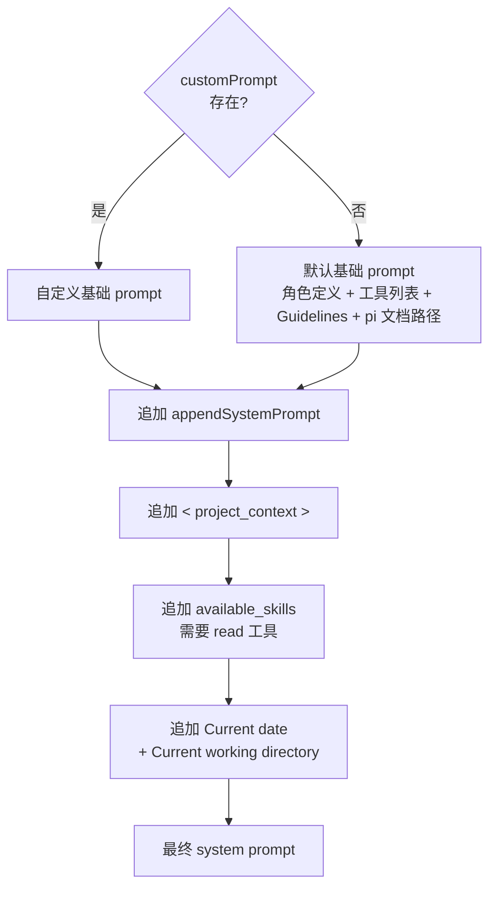
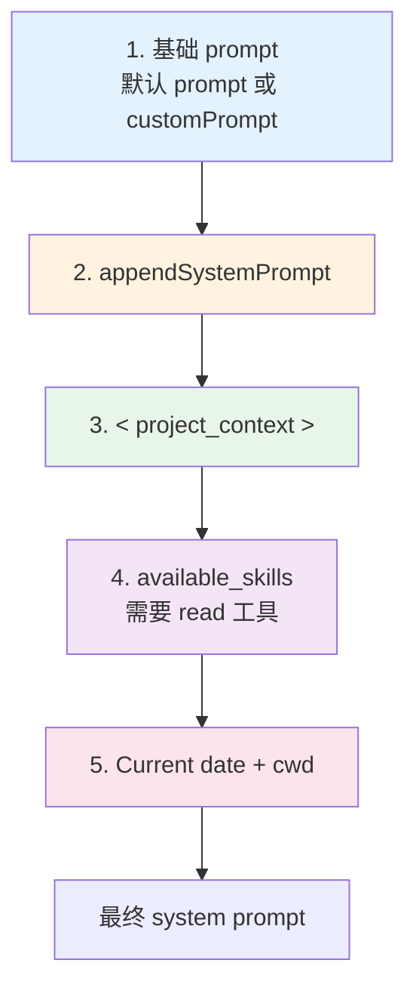

# System Prompt 是一套装配流程

在 pi 里，system prompt 不是仓库中写死的一整段文本，而是一次会话启动时由 `buildSystemPrompt()` 动态拼接出来的字符串。

可以概括成两条主分支：

- 自定义分支：调用方提供 `customPrompt`，以它作为基础 prompt
- 默认分支：未提供 `customPrompt`，用内建默认 prompt 作为基础

两条分支之后都会继续追加一部分“环境信息”，包括：

- `appendSystemPrompt`
- 项目上下文文件 `contextFiles`
- skills 列表（仅当 `read` 工具可用）
- 当前日期和工作目录



## 装配入口：`buildSystemPrompt`

当前接口如下：

```ts
/** 构建系统提示的配置选项 */
export interface BuildSystemPromptOptions {
	/** 自定义系统提示（替换默认提示）。设置了此项则跳过默认的工具列表和指南生成。 */
	customPrompt?: string;
	/** 要包含的工具列表。默认: [read, bash, edit, write] */
	selectedTools?: string[];
	/** 工具的单行描述片段，按工具名索引。只有在此处有条目的工具才会出现在 "Available tools" 中。 */
	toolSnippets?: Record<string, string>;
	/** 追加到默认系统提示指南中的额外准则条目。 */
	promptGuidelines?: string[];
	/** 追加到系统提示末尾的附加文本。 */
	appendSystemPrompt?: string;
	/** 当前工作目录。 */
	cwd: string;
	/** 预加载的项目上下文文件列表（如 AGENTS.md 等）。 */
	contextFiles?: Array<{ path: string; content: string }>;
	/** 预加载的技能列表。 */
	skills?: Skill[];
}
```

有两个点和旧理解不一样：

- `cwd` 现在是必填，不是可选
- `buildSystemPrompt()` 本身仍然不做任何 I/O，它只消费上游已经准备好的 `contextFiles` 和 `skills`

也就是说：

- 文件发现
- settings 读取
- skill 扫描
- 上下文文件装载

都发生在 `buildSystemPrompt()` 之前。这个函数本身依然是纯粹的字符串拼接器。

## 当前装配顺序

不管是默认分支还是自定义分支，当前代码的装配顺序都是固定的：

1. 生成基础 prompt
2. 追加 `appendSystemPrompt`
3. 追加 `contextFiles`
4. 追加 skills 列表
5. 追加日期和工作目录

这个顺序在代码里是显式写出来的，不是概念上的“优先级推断”。

## 自定义 Prompt 分支

如果调用方传入了 `customPrompt`，`buildSystemPrompt()` 会直接以它作为基础字符串：

```ts
if (customPrompt) {
  let prompt = customPrompt;
  ...
  return prompt;
}
```

这一分支的特点是：

- 不生成默认的工具列表
- 不生成默认的 Guidelines
- 不注入 pi 文档路径
- 但仍然会自动追加 `appendSystemPrompt`、项目上下文、skills、日期和 cwd

所以“自定义 prompt”并不等于“完全接管最终 system prompt”。更准确地说，它只替换了基础段，后面的环境段仍由系统统一追加。

### 自定义分支的完整结构

```ts
if (customPrompt) {
  let prompt = customPrompt;

  if (appendSection) {
    prompt += appendSection;
  }

  if (contextFiles.length > 0) {
    prompt += "\n\n<project_context>\n\n";
    prompt += "Project-specific instructions and guidelines:\n\n";
    for (const { path: filePath, content } of contextFiles) {
      prompt += `<project_instructions path="${filePath}">\n${content}\n</project_instructions>\n\n`;
    }
    prompt += "</project_context>\n";
  }

  const customPromptHasRead = !selectedTools || selectedTools.includes("read");
  if (customPromptHasRead && skills.length > 0) {
    prompt += formatSkillsForPrompt(skills);
  }

  prompt += `\nCurrent date: ${date}`;
  prompt += `\nCurrent working directory: ${promptCwd}`;
  return prompt;
}
```

旧版教程里一个已经过时的点是：项目上下文不再用 Markdown 标题块 `# Project Context` / `## path` 注入，而是使用 XML 风格包装：

- `<project_context>`
- `<project_instructions path="...">`

这让上下文块边界更明确，也更利于模型识别“这是一组项目规则文件”。

## 默认 Prompt 分支

如果没有 `customPrompt`，pi 会构建内建默认 prompt。

默认分支包含四大块内容：

- 角色定义
- 可见工具列表
- 动态生成的 Guidelines
- pi 文档和示例路径

### 工具列表注入

默认分支先计算“真正可见的工具列表”：

```ts
const tools = selectedTools || ["read", "bash", "edit", "write"];
const visibleTools = tools.filter((name) => !!toolSnippets?.[name]);
const toolsList =
  visibleTools.length > 0
    ? visibleTools.map((name) => `- ${name}: ${toolSnippets![name]}`).join("\n")
    : "(none)";
```

这里有两个细节：

- 默认工具集合是 `read`、`bash`、`edit`、`write`
- 即使某个工具实际启用了，只要没有对应的 `toolSnippets`，它就不会出现在 “Available tools” 列表里

这意味着 extension 注入的自定义工具也能出现在默认 prompt 中，但前提是调用链上给它提供了可展示的一行说明。

### Guidelines 动态生成

当前代码里的 Guidelines 不是一整段硬编码文本，而是按工具组合动态生成并去重。

核心逻辑是：

```ts
const hasBash = tools.includes("bash");
const hasGrep = tools.includes("grep");
const hasFind = tools.includes("find");
const hasLs = tools.includes("ls");
const hasRead = tools.includes("read");

if (hasBash && !hasGrep && !hasFind && !hasLs) {
  addGuideline("Use bash for file operations like ls, rg, find");
} else if (hasBash && (hasGrep || hasFind || hasLs)) {
  addGuideline("Prefer grep/find/ls tools over bash for file exploration (faster, respects .gitignore)");
}

for (const guideline of promptGuidelines ?? []) {
  const normalized = guideline.trim();
  if (normalized.length > 0) {
    addGuideline(normalized);
  }
}

addGuideline("Be concise in your responses");
addGuideline("Show file paths clearly when working with files");
```

几点值得注意：

- `promptGuidelines` 会被 trim 后注入
- 所有 guideline 通过 `Set` 去重
- 通用 guideline 总是在最后补上
- `hasRead` 在这里先被算出，后面 skills 注入还会复用

所以默认分支下 guideline 的顺序是：

1. 文件探索工具相关 guideline
2. 外部追加的 guideline
3. 通用 guideline

### 默认 Prompt 的实际结构

当前代码中的默认 prompt 比旧版文档描述更具体。除了基本的角色定义和工具说明，它还显式告诉模型：

- 什么时候才去读 pi 文档
- `docs/...` 和 `examples/...` 路径应该如何解析
- 用户问到哪些主题时应该去看哪些文档
- 处理 pi 自身问题时应优先读取文档和示例，并沿交叉链接继续读

也就是说，默认 prompt 不只是“你是一个 coding assistant”，它已经把“如何研究 pi 自身文档”也编码进去了。

这部分是当前实现相较旧版教程最容易漏掉的更新之一。

## `appendSystemPrompt`：轻量扩展点

`appendSystemPrompt` 会先被规范成：

```ts
const appendSection = appendSystemPrompt ? `\n\n${appendSystemPrompt}` : "";
```

然后在基础 prompt 之后立刻追加。

这意味着它的位置固定在：

- 基础 prompt 之后
- `contextFiles` 之前
- `skills` 之前
- 日期 / cwd 之前

它的语义是“补充规则”，不是替换规则。

## Context Files 注入

无论默认分支还是自定义分支，项目上下文文件都采用同一套 XML 包装：

```ts
if (contextFiles.length > 0) {
  prompt += "\n\n<project_context>\n\n";
  prompt += "Project-specific instructions and guidelines:\n\n";
  for (const { path: filePath, content } of contextFiles) {
    prompt += `<project_instructions path="${filePath}">\n${content}\n</project_instructions>\n\n`;
  }
  prompt += "</project_context>\n";
}
```

这和旧版 Markdown 结构不同。当前结构有几个直接好处：

- 文件边界更清晰
- 每个文件的来源路径直接挂在 `path` 属性上
- 模型能更稳定地区分“系统指令正文”和“项目上下文文件集合”

因此当前教程更适合把它理解为“结构化注入的一组上下文文件”，而不是“简单拼接几段 Markdown”。

## Skills 注入

skills 仍然采用“只注入元数据，不内联完整内容”的策略。

`formatSkillsForPrompt()` 会先过滤：

```ts
const visibleSkills = skills.filter((s) => !s.disableModelInvocation);
```

也就是说：

- `disableModelInvocation = true` 的 skill 不会出现在 system prompt 里
- 这类 skill 只能通过显式命令或其他手动路径使用

之后函数会输出一个 XML 结构的 skills 列表，告诉模型：

- 有哪些 skill
- 每个 skill 的名字
- 描述
- 文件位置

而不会把 `SKILL.md` 全文直接塞进 system prompt。

这是一种典型的延迟加载设计：

- system prompt 里只放目录
- 真正需要时再用 `read` 去加载 skill 内容

### 为什么 Skills 依赖 `read`

当前代码在两条分支里都显式做了判断。

默认分支：

```ts
if (hasRead && skills.length > 0) {
  prompt += formatSkillsForPrompt(skills);
}
```

自定义分支：

```ts
const customPromptHasRead = !selectedTools || selectedTools.includes("read");
if (customPromptHasRead && skills.length > 0) {
  prompt += formatSkillsForPrompt(skills);
}
```

原因很简单：

- skill 在 prompt 里只是“文件位置 + 描述”
- 如果没有 `read` 工具，模型知道 skill 存在也没法读取完整内容
- 这时把 skill 列表注入反而会造成误导

## 尾部注入：日期与工作目录

两条分支最后都会追加：

```ts
prompt += `\nCurrent date: ${date}`;
prompt += `\nCurrent working directory: ${promptCwd}`;
```

这里有两个实现细节：

- 日期由当前运行时动态生成，格式是 `YYYY-MM-DD`
- `cwd` 会把 Windows 反斜杠统一替换成正斜杠

这两个信息总是放在末尾。它们不是“提示工程里的装饰信息”，而是运行时环境的一部分：

- 日期影响模型对版本、新旧 API、时效信息的判断
- 工作目录影响相对路径解析和文件操作决策

## Context Files 的加载时机

`buildSystemPrompt()` 自己不加载文件，只消费上游传入的 `contextFiles`。

因此上下文文件的真实加载时机不在这里，而在 `ResourceLoader.reload()` 上游。

这意味着：

- 会话运行中修改 `AGENTS.md`
- 或者中途新增一个上下文文件

通常不会自动反映到当前已构建好的 system prompt 中，除非上游资源重新加载并重新构建 prompt。

这仍然延续了 pi 的一个核心取舍：

- 不在 prompt 构建时做 I/O
- 用上游 reload 机制承担发现和刷新责任

## 当前实现下的完整装配顺序



## 设计取舍

### 得到了什么

**1. `buildSystemPrompt()` 仍然是纯函数**

它不依赖文件系统状态，不做扫描、不读文件、不访问配置源，只负责字符串组装。

**2. 自定义和环境信息分离**

调用方可以替换基础 prompt，但系统仍能稳定附加项目上下文、skills、日期和 cwd。

**3. Skills 延迟加载**

system prompt 不会因为 skill 很多而无限膨胀，模型只在需要时才读取 skill 文件。

**4. 项目上下文结构化更强**

`<project_context>` / `<project_instructions>` 的 XML 包装比旧版 Markdown 拼接更容易被模型稳定消费。

### 放弃了什么

**1. 最终 prompt 仍不容易直接“看出来”**

它由多个来源拼接而成，行为异常时仍然需要分别检查基础 prompt、append 文本、上下文文件和 skills。

**2. Prompt 长度仍会增长**

多个 contextFiles、较长的 append 文本、较多的 skill 元数据都可能显著增加 system prompt 长度。

**3. 自定义 prompt 分支不再自动获得默认文档引导**

一旦使用 `customPrompt`，默认分支里那些关于 pi 文档路径、示例位置和研究策略的说明都不会自动存在。

## 一句话总结

当前代码里的 `system-prompt.ts` 可以概括成一句话：

**pi 先选择一个基础 prompt，再以固定顺序追加补充规则、项目上下文、skills 元数据和运行时环境信息；其中基础 prompt 可替换，但环境注入始终由系统统一完成。**

---

### 版本说明

本章内容已按当前仓库中的 `packages/coding-agent/src/core/system-prompt.ts` 和 `packages/coding-agent/src/core/skills.ts` 实现更新。旧版教程中关于 Markdown 形式的项目上下文注入、`cwd` 可选、默认 prompt 结构过于简化等描述，均已改为贴合现状代码的版本。
