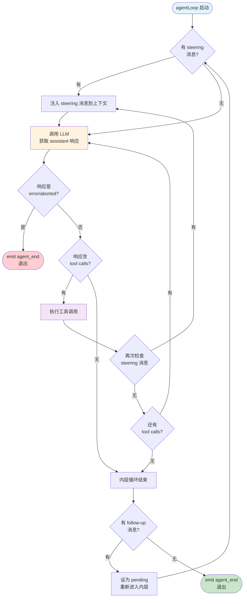

# 第 8 章：`agentLoop` — 发动机只管转

> **定位**：本章解剖 pi 整个系统真正的发动机 — 无状态的 agent 循环引擎。
> 前置依赖：第 6 章（事件流设计）。
> 适用场景：当你想理解"一次 agent 执行到底经历了什么"，或者想把 pi 的循环引擎用在自己的系统里。

## 一个 agent 循环应该知道多少？

这是本章的核心设计问题。

一个直觉上的答案是"越多越好" — 循环引擎应该知道怎么管理会话、怎么重试失败的请求、怎么压缩超长上下文、怎么持久化中间状态。毕竟，这些都是"循环过程中"会遇到的问题。

但 pi 给出了一个反直觉的答案：**循环引擎应该知道尽可能少的东西。**

打开 `packages/agent/src/agent-loop.ts`，文件头的注释只有一句话：

```
Agent loop that works with AgentMessage throughout.
Transforms to Message[] only at the LLM call boundary.
```

这句话定义了整个循环引擎的边界：它只管把消息送进 LLM、把 LLM 的响应拿回来、如果响应里有工具调用就执行工具、然后决定要不要继续。它不知道消息从哪来，不知道消息要存到哪去，不知道哪些工具应该被允许，不知道上下文快溢出了。

这个选择的代价是：所有这些"循环之外"的功能都必须由上层来实现。

这个选择的收益是：循环引擎可以被任何上层随意组合 — 终端 CLI、Slack bot、Web UI、甚至一个测试用例，都可以用同一个循环，只要提供不同的配置。

接下来我们拆解这个引擎的内部结构。

## 双层循环：内层忙碌，外层等待

`agentLoop` 的核心是一个约 70 行的 `runLoop()` 函数。它的设计可以用一张图概括：



这张图展示了两个嵌套的 `while` 循环各自的职责：

**内层循环**负责"持续工作"：调用 LLM → 执行工具 → 检查 steering 消息 → 再调用 LLM。只要还有工具调用要执行，或者有用户的 steering 消息要注入，它就不停。

**外层循环**负责"被唤醒"：当内层循环结束（agent 本来要停下来），外层检查有没有 follow-up 消息。有的话，把它设为 pending，重新启动内层循环。

为什么要分两层？因为 steering 和 follow-up 的语义不同：

- **Steering**（转向）：用户在 agent 工作过程中插入一条新指令，比如"别改那个文件，换一种方式"。它在当前 turn 的工具执行完成后注入，影响下一次 LLM 调用。
- **Follow-up**（追加）：用户在 agent 完成后追加一条新任务，比如"好的，现在写测试"。它只在 agent 本来要退出时才被消费。

这两种消息的消费时机不同，所以需要两层循环来区分。如果只有一层循环，就没法区分"agent 还在干活时插入的指令"和"agent 干完活后追加的新任务"。

## 源码解剖：`runLoop()` 的 80 行

让我们看看实际代码。为了聚焦设计，这里展示 `runLoop()` 的核心结构（简化版，省略了 `turn_start`/`turn_end` 事件发射和 `firstTurn` 首轮保护逻辑，完整版见源码）：

```typescript
// packages/agent/src/agent-loop.ts:155-232（简化）

async function runLoop(
  currentContext: AgentContext,
  newMessages: AgentMessage[],
  config: AgentLoopConfig,
  signal: AbortSignal | undefined,
  emit: AgentEventSink,
  streamFn?: StreamFn,
): Promise<void> {
  let pendingMessages: AgentMessage[] =
    (await config.getSteeringMessages?.()) || [];

  // 外层循环：处理 follow-up 消息
  while (true) {
    let hasMoreToolCalls = true;

    // 内层循环：处理 tool calls 和 steering 消息
    while (hasMoreToolCalls || pendingMessages.length > 0) {
      // emit turn_start（首轮由调用者发射，此处省略）

      // 1. 注入 pending 消息，每条发射 message_start/end
      if (pendingMessages.length > 0) {
        for (const message of pendingMessages) {
          // emit message_start, message_end
          currentContext.messages.push(message);
          newMessages.push(message);
        }
        pendingMessages = [];
      }

      // 2. 调用 LLM，获取 assistant 响应
      const message = await streamAssistantResponse(
        currentContext, config, signal, emit, streamFn
      );
      newMessages.push(message);

      // 3. 错误或中止 → emit turn_end + agent_end，退出
      if (message.stopReason === "error"
        || message.stopReason === "aborted") {
        return;
      }

      // 4. 提取 tool calls，有则执行
      const toolCalls = message.content
        .filter((c) => c.type === "toolCall");
      hasMoreToolCalls = toolCalls.length > 0;

      if (hasMoreToolCalls) {
        const toolResults = await executeToolCalls(
          currentContext, message, config, signal, emit
        );
        for (const result of toolResults) {
          currentContext.messages.push(result);
          newMessages.push(result);
        }
      }

      // emit turn_end
      // 5. 检查有无 steering 消息
      pendingMessages =
        (await config.getSteeringMessages?.()) || [];
    }

    // 内层结束，检查 follow-up 消息
    const followUpMessages =
      (await config.getFollowUpMessages?.()) || [];
    if (followUpMessages.length > 0) {
      pendingMessages = followUpMessages;
      continue; // 重新进入内层
    }

    break; // 无 follow-up，真正退出
  }
}
```

整个函数只有一个 `return`（错误退出）和一个 `break`（正常退出）。控制流清晰到可以逐行朗读。

注意几个设计细节：

**1. `pendingMessages` 的复用**。无论是 steering 消息还是 follow-up 消息，都通过同一个 `pendingMessages` 变量注入内层循环。外层循环的唯一动作就是把 follow-up 消息赋值给 `pendingMessages`，然后 `continue` 重新进入内层。两种消息共享同一条注入通道，但消费时机不同。

**2. 错误通过 `stopReason` 传递，而不是异常**。当 LLM 调用失败时，`streamAssistantResponse` 不会抛异常 — 它返回一个 `stopReason` 为 `"error"` 的消息。这和第 6 章讲的"错误编码进事件流"的设计一脉相承。循环引擎不需要 try-catch，它只需要检查 `stopReason`。

**3. 函数签名是纯函数式的**。`runLoop` 接收 context、config、signal，返回 void（通过 `newMessages` 数组收集产出）。它不持有任何状态，不修改任何外部变量（除了 `currentContext.messages` 和 `newMessages` 这两个被调用者传入的可变引用）。

## 消息变换管道：只在 LLM 边界发生

`runLoop()` 把"调 LLM"委托给了 `streamAssistantResponse()`。这个函数做了一件非常重要的事：**把 AgentMessage 世界和 LLM Message 世界桥接起来**。

```typescript
// packages/agent/src/agent-loop.ts:238-271（简化，完整的流式
// 事件处理约 90 行，这里只展示管道结构）

async function streamAssistantResponse(
  context: AgentContext,
  config: AgentLoopConfig,
  signal: AbortSignal | undefined,
  emit: AgentEventSink,
  streamFn?: StreamFn,
): Promise<AssistantMessage> {
  // 第一步：AgentMessage[] → AgentMessage[]（可选裁剪）
  let messages = context.messages;
  if (config.transformContext) {
    messages = await config.transformContext(messages, signal);
  }

  // 第二步：AgentMessage[] → Message[]（格式转换）
  const llmMessages = await config.convertToLlm(messages);

  // 第三步：组装 LLM 上下文并调用
  const llmContext: Context = {
    systemPrompt: context.systemPrompt,
    messages: llmMessages,
    tools: context.tools,
  };

  const response = await streamFunction(
    config.model, llmContext, { ...config, signal }
  );
  // ... 事件流处理 ...
}
```

这里有一条关键的设计边界：**AgentMessage 和 LLM Message 是两种不同的类型**。

`AgentMessage` 是 pi 的内部消息格式，它可以包含自定义消息类型（通过 `CustomAgentMessages` 声明合并扩展），可以包含 UI 通知、compaction 摘要、分支标记等 LLM 根本不需要看到的内容。

`Message` 是 pi-ai 层定义的 LLM 兼容消息格式，只包含 LLM 能理解的内容：`user`、`assistant`、`toolResult`。

两者之间的转换通过一条两步管道完成：

```
AgentMessage[]
    │
    ├── transformContext()  ← 可选：裁剪、注入外部上下文
    │
    ├── convertToLlm()     ← 必须：过滤自定义消息、格式转换
    │
    ▼
Message[] → LLM
```

**为什么 `transformContext` 和 `convertToLlm` 要分开？**

`transformContext` 操作的是 `AgentMessage[]`，它知道所有自定义消息类型。典型用途是 context window 管理 — 当消息太多时，裁剪老消息或替换为摘要。这个操作必须在 `AgentMessage` 层面完成，因为自定义消息可能包含裁剪决策所需的元数据。

`convertToLlm` 操作的是从 `AgentMessage[]` 到 `Message[]` 的转换。它过滤掉 LLM 不认识的消息类型（比如 `notification`、`compaction_summary`），把自定义消息转换成 LLM 能理解的格式。

如果把这两步合成一步，`transformContext` 就必须同时理解 AgentMessage 语义和 LLM 消息格式 — 关注点耦合了。

**为什么转换只在 LLM 调用边界发生？**

文件头注释给出了答案：`Agent loop that works with AgentMessage throughout. Transforms to Message[] only at the LLM call boundary.`

循环内部全程使用 `AgentMessage`。工具执行返回的是 `ToolResultMessage`（AgentMessage 的一种），用户的 steering 消息也是 `AgentMessage`。转换只在调用 LLM 的那一刻发生。

这意味着循环内部可以处理任意的自定义消息类型，而不需要关心 LLM 是否认识它们。自定义消息在循环内部是一等公民，只在出门见 LLM 时才被过滤。

## `AgentLoopConfig`：循环引擎的全部知识

一个"无状态引擎"需要知道什么才能工作？答案就藏在 `AgentLoopConfig` 里。这个类型定义了循环引擎的全部外部依赖：

```typescript
// packages/agent/src/types.ts:96-214（关键字段，简化）

interface AgentLoopConfig extends SimpleStreamOptions {
  model: Model<any>;

  // 消息变换管道
  convertToLlm: (messages: AgentMessage[])
    => Message[] | Promise<Message[]>;
  transformContext?: (messages: AgentMessage[], signal?: AbortSignal)
    => Promise<AgentMessage[]>;

  // 消息队列
  getSteeringMessages?: () => Promise<AgentMessage[]>;
  getFollowUpMessages?: () => Promise<AgentMessage[]>;

  // 工具执行控制
  beforeToolCall?: (context, signal?)
    => Promise<BeforeToolCallResult | undefined>;
  afterToolCall?: (context, signal?)
    => Promise<AfterToolCallResult | undefined>;
  toolExecution?: "sequential" | "parallel";

  // API 密钥动态解析（支持同步或异步返回）
  getApiKey?: (provider: string)
    => Promise<string | undefined> | string | undefined;
}
```

注意这个设计的纪律：

- `convertToLlm` 是必须提供的（循环没有默认的转换逻辑，但 `Agent` 类提供了一个默认实现：只保留 `user`、`assistant`、`toolResult` 三种角色）
- `transformContext` 是可选的（不提供就不裁剪）
- `getSteeringMessages` 和 `getFollowUpMessages` 是可选的（不提供就没有消息队列）
- `beforeToolCall` 和 `afterToolCall` 是可选的（不提供就没有工具钩子；返回 `undefined` 表示不做任何修改）
- `getApiKey` 是可选的（注释说明了用途："important for expiring tokens"，支持同步或异步返回以适配不同的认证后端）

循环引擎不假设任何可选功能的存在。它只在功能被提供时使用它们。这就是为什么同一个循环可以被极简的测试用例使用（只提供 `model` 和 `convertToLlm`），也可以被全功能的 coding agent 使用（提供所有字段）。

多数回调函数的注释里有一条统一的契约：**"Contract: must not throw or reject."** 这和 `StreamFn` 的契约一脉相承（详见第 6 章）。`convertToLlm`、`transformContext`、`getApiKey`、`getSteeringMessages`、`getFollowUpMessages` 都遵守此契约 — 循环引擎不对它们做错误恢复，如果抛了异常整个循环会意外终止。

但 `beforeToolCall` 和 `afterToolCall` 例外 — 它们**没有**此契约。循环引擎对它们做了防御性 try-catch（详见第 9 章）。这个区别反映了一个设计判断：消息变换管道是系统内部代码，有义务保证不出错；而工具钩子可能是外部扩展代码，引擎需要为它们兜底。

## 事件发射：循环的唯一输出通道

`runLoop()` 的返回值是 `Promise<void>` — 它不返回任何东西。循环的所有产出都通过 `emit` 回调发射：

```typescript
type AgentEventSink = (event: AgentEvent) => Promise<void> | void;
```

这是一个故意的设计选择：**循环引擎不决定谁消费它的产出**。它只管往 `emit` 里塞事件，至于这些事件是被 TUI 渲染、被 session manager 持久化、还是被测试用例断言，循环不知道也不关心。

事件类型形成了一个完整的生命周期：

```
agent_start
  └── turn_start
        ├── message_start (user/steering message)
        ├── message_end
        ├── message_start (assistant response)
        ├── message_update (streaming delta)
        ├── message_end
        ├── tool_execution_start
        ├── tool_execution_update (partial result)
        ├── tool_execution_end
        └── turn_end
  └── turn_start (next turn)
        └── ...
agent_end
```

每个订阅者都能从这个事件流中重建整个执行过程的完整状态。这也是为什么 pi 能做会话录制和回放 — 只需要序列化事件流。

## 取舍分析

现在让我们退后一步，评估这个设计的得失。

### 得到了什么

**1. 极致的可组合性**。循环引擎是一个纯函数 — 给它输入（context + config），它产出事件流。任何上层都可以组合它：

- CLI 的 Agent 类用它跑交互式会话
- Slack bot 的 mom 用它跑一次性回复
- 测试用例直接调用 `runAgentLoop()` 验证行为
- 甚至可以用两个循环嵌套实现 sub-agent（外层循环的工具调用里启动内层循环）

**2. 可测试性**。因为循环不持有状态，测试只需要构造输入和检查输出。不需要 mock 数据库、不需要启动 UI、不需要连接真实的 LLM（提供一个假的 `streamFn` 就行）。

**3. 关注点分离**。会话持久化是 session manager 的事；UI 渲染是 TUI 的事；错误重试是上层的事；context 压缩是 compaction 模块的事。循环不参与其中任何一个。

### 放弃了什么

**1. 不能自己管理会话**。循环不知道"会话"这个概念的存在。它每次调用都接收一个新鲜的 `AgentContext`，不关心这个 context 是从哪来的（内存、JSONL 文件、数据库、测试固件）。如果你想要会话持久化，必须在上层实现。

**2. 不能自己重试**。当 LLM 返回错误时，循环直接退出。它不会自动重试，不会 backoff，不会切换备用模型。所有重试逻辑必须由调用者实现（通常是 Agent 类或 AgentSession）。

**3. 不能自己压缩上下文**。当 context window 快满时，循环不会自动触发 compaction。它只是把消息传给 `transformContext` — 如果调用者没提供这个回调，循环会带着越来越长的上下文继续调用 LLM，直到 provider 拒绝请求。

**4. 需要上层正确组装 `AgentLoopConfig`**。循环的灵活性是以配置复杂度为代价的。`AgentLoopConfig` 有十几个字段，每个回调都有自己的契约（must not throw）。如果上层组装错了 — 比如 `convertToLlm` 遗漏了某种自定义消息类型 — 循环不会报错，只会产生意外的 LLM 行为。

### 这个取舍值得吗？

对于 pi 的定位 — 一个支撑多种产品形态的 agent 运行时 — 这个取舍是值得的。

如果循环引擎自己管理会话，Slack bot（用 channel 做会话）和 CLI（用 JSONL 文件做会话）就需要不同的循环实现。如果循环引擎自己重试，有些场景（自动化管道）想要快速失败，有些场景（交互式 CLI）想要无限重试，循环就要为不同的重试策略膨胀。

**把循环做薄，是为了让上层做厚时有足够的自由度。**

这正是整本书的主线：如何用尽可能薄的内核，撑起尽可能丰富的产品。在循环引擎这一层，这条主线得到了最纯粹的体现。

---

### 版本演化说明

> 本章核心分析基于 pi-mono v0.66.0。`runLoop()` 的双层循环结构自引入以来保持稳定，
> steering/follow-up 消息队列的设计在早期版本中从单队列拆分为双队列。