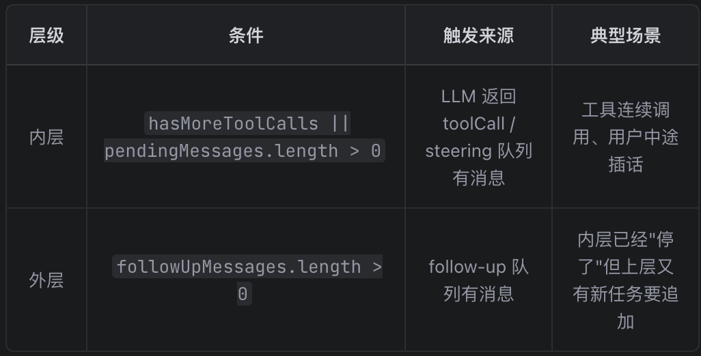
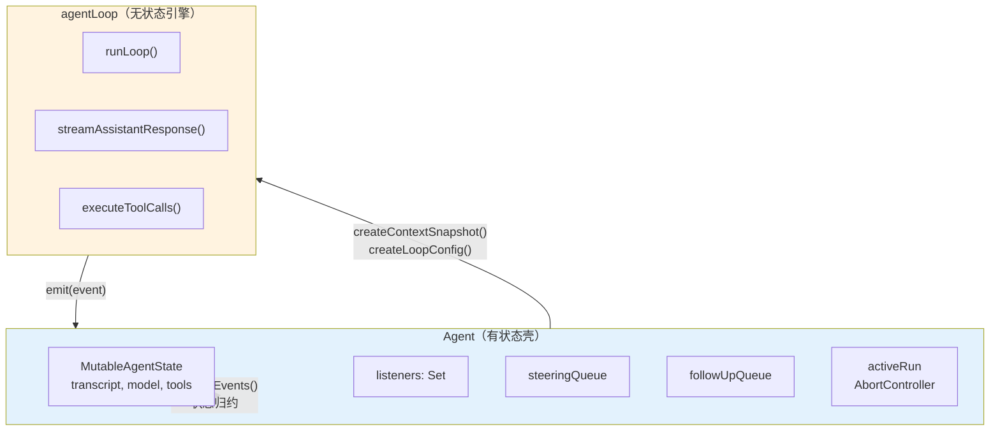
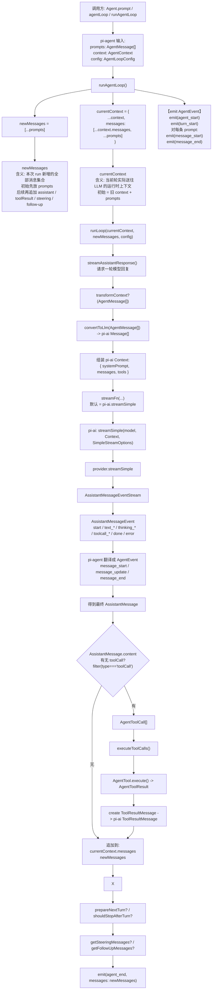
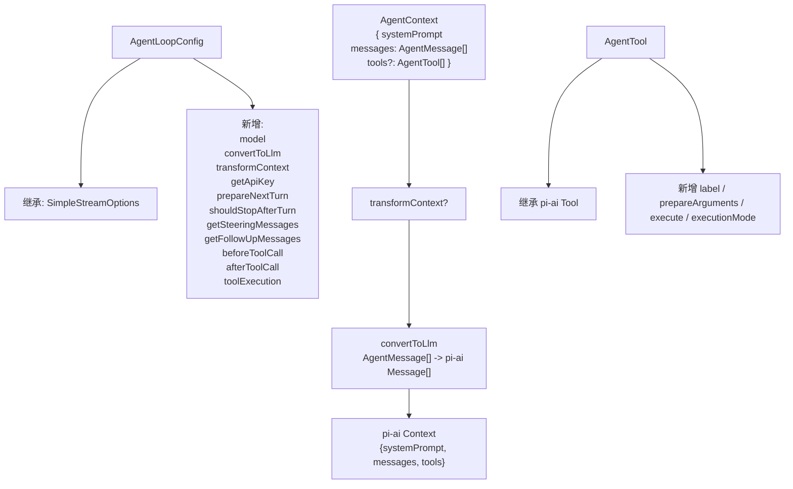
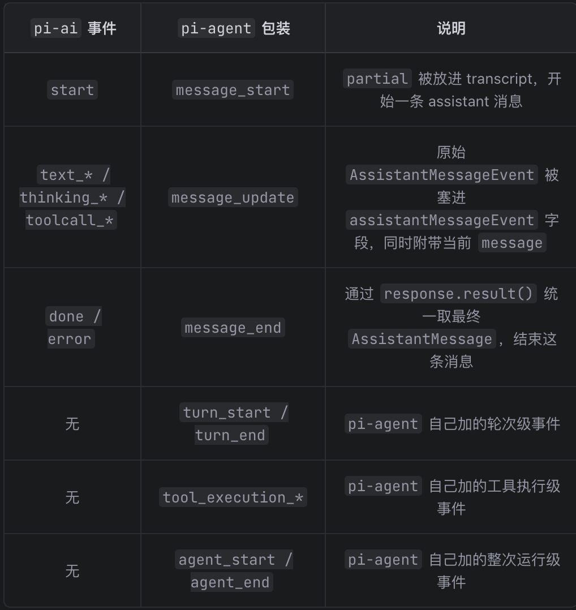

# [pi-agent](https://github.com/badlogic/pi-mono/tree/main/packages/agent)

整个 pi monorepo 的 **agent 引擎层**。

- pi-ai 负责： 模型请求抽象、provider 兼容、流式事件、最终 AssistantMessage
- pi-agent 负责： 把 pi-ai 的“单次 provider stream 流”包装成“多轮 agent 循环 + 工具执行 + 生命周期事件”

它对上暴露的是：

- 无状态的 agent 循环引擎（`runAgentLoop` / `runAgentLoopContinue`）
- 有状态的运行时壳层（`Agent` 类）
- 高层产品化编排外壳（`AgentHarness`）
- 完整的事件协议（`AgentEvent`）
- 工具定义与执行管道（`AgentTool` / prepare -> execute -> finalize）
- 消息队列（steering / follow-up）
- Session 持久化与树导航
- Skills / Prompt Templates 资源系统
- Compaction / Branch Summary 长会话能力

而对下，它依赖的是：

- `pi-ai` 的 `streamSimple()` 发起 LLM 请求
- `pi-ai` 的 `AssistantMessageEventStream` 消费流式事件
- `pi-ai` 的 `validateToolArguments()` 校验工具参数
- `pi-ai` 的 `Message` / `AssistantMessage` / `ToolResultMessage` 消息类型

## 整个包的分层图

从底层往上层看，`packages/agent/src` 可以分成四层：

```
四、高层产品化层
   harness/agent-harness.ts    ← session、skills、prompt templates、hooks、compaction
   harness/types.ts            ← harness 专属类型（Session、Skill、PromptTemplate、FileSystem、Shell）
   harness/skills.ts           ← SKILL.md 文件加载与解析
   harness/prompt-templates.ts ← prompt template 加载与解析
   harness/messages.ts         ← 自定义消息类型声明合并 + convertToLlm
   harness/system-prompt.ts    ← system prompt 拼接
   harness/compaction/         ← 上下文压缩与分支总结算法
   harness/session/            ← session 持久化（JSONL / memory）

三、有状态运行时层
   agent.ts                    ← Agent 类：状态管理、事件订阅、队列、abort、生命周期

二、无状态引擎层
   agent-loop.ts               ← 核心循环：runLoop()、streamAssistantResponse()、工具执行管道
   
一、核心类型层
	types.ts                    ← 核心协议：AgentMessage、AgentEvent、AgentTool、AgentLoopConfig

公共入口
   index.ts                    ← 统一 re-export
   proxy.ts                    ← 代理工具函数
```

```ts
Agent (agent.ts)               ← 高层：状态管理 + 事件订阅 + 消息队列
  │
  └── agentLoop (agent-loop.ts)  ← 低层：双重循环编排 + LLM 调用 + 工具执行
        │
        └── streamSimple (pi-ai)   ← 底层：LLM API 调用
```

每一层解决不同粒度的问题，也面向不同的使用者。

1、**无状态引擎层**（`agent-loop.ts`）是一个**纯函数**。给它 context + config，它产出事件流。它不知道"会话"、"UI"、"持久化"这些概念。

谁需要它？

- 测试代码：直接调用 `runAgentLoop()`，提供假的 `streamFn`，验证行为
- 嵌套 agent：外层工具执行里启动内层循环
- 极简场景：一次性脚本，不需要状态管理

2、**有状态壳层**（`agent.ts`）在循环引擎之上加了**运行时状态**：transcript、订阅者、消息队列、abort 控制。

谁需要它？

- `coding-agent` 的 `AgentSession`：用 `Agent` 管理运行时，再包一层会话能力
- 需要交互式对话的应用：`prompt()` / `steer()` / `followUp()` API 比直接调循环方便得多

3、**产品化外壳层**（`harness/agent-harness.ts`）在 `Agent` 之上加了**产品能力**：session 持久化、skills、prompt templates、compaction、树导航。

谁需要它？

- 任何需要"会话存档 + 历史压缩 + 技能系统"但不想自己造轮子的应用
- 目前主要是测试和示例在用，尚未被 `coding-agent` 采纳

**注意：`coding-agent` 实际上用的是 `Agent`（第二层）+ 自己的 `AgentSession`，而不是 `AgentHarness`。** 原因是 `AgentSession` 在 `AgentHarness` 之前就已存在，它包含了更复杂的业务逻辑（扩展命令、bash 消息管理、模型认证验证、自定义 compaction 策略等），迁移成本大于收益。`AgentHarness` 是后来从 `AgentSession` 中提炼出的通用框架，两者核心调用链相同（都是准备消息 → 调 `runAgentLoop()`），但 `AgentSession` 的业务层更厚。

### `src/`

| 文件              | 定位                 | 核心功能 / 关键导出                                                                                                                              | 主要被谁调用                                   | 它主要调用谁                                        |
| ----------------- | -------------------- | ------------------------------------------------------------------------------------------------------------------------------------------------ | ---------------------------------------------- | --------------------------------------------------- |
| index.ts          | 包公共入口           | 统一 re-export 所有公共 API                                                                                                                      | `packages/coding-agent`、外部 npm 使用者        | 各子模块                                            |
| types.ts          | 核心协议文件         | `AgentMessage`、`AgentEvent`、`AgentTool`、`AgentContext`、`AgentLoopConfig`、`AgentState`、`StreamFn`、`QueueMode`、`ThinkingLevel`              | 几乎所有源码文件                               | 无运行时调用                                        |
| agent-loop.ts     | 无状态循环引擎       | `agentLoop`、`agentLoopContinue`、`runAgentLoop`、`runAgentLoopContinue`、`runLoop`、`streamAssistantResponse`、`executeToolCalls`               | `agent.ts`、`agent-harness.ts`                 | `pi-ai` 的 `streamSimple`、`validateToolArguments`  |
| agent.ts          | 有状态运行时壳       | `Agent` 类：`prompt()`、`continue()`、`abort()`、`steer()`、`followUp()`、`subscribe()`、`processEvents()`                                       | `packages/coding-agent`、测试代码              | `agent-loop.ts` 的 `runAgentLoop` / `runAgentLoopContinue` |
| proxy.ts          | 代理工具函数         | `createProxyTool` 等辅助函数                                                                                                                     | 外部调用者                                     | 无                                                  |

#### `harness/`

`harness/` 是这个包最"厚"的一层。它在纯 `Agent` 之上增加了产品化能力。

| 文件                         | 定位                       | 核心功能 / 关键导出                                                                                               | 主要被谁调用                | 它主要调用谁                                     |
| ---------------------------- | -------------------------- | ----------------------------------------------------------------------------------------------------------------- | --------------------------- | ------------------------------------------------ |
| agent-harness.ts             | 高层编排外壳               | `AgentHarness` 类：`prompt()`、`skill()`、`promptFromTemplate()`、`compact()`、`navigateTree()`、`abort()`        | `packages/coding-agent`     | `agent-loop.ts`、`session.ts`、`compaction.ts`    |
| types.ts                     | harness 专属类型           | `Skill`、`PromptTemplate`、`Session`、`SessionStorage`、`FileSystem`、`Shell`、`ExecutionEnv`、各种 Event 类型    | harness 内部所有文件        | 无运行时调用                                      |
| messages.ts                  | 自定义消息 + convertToLlm  | `BashExecutionMessage`、`CustomMessage`、`BranchSummaryMessage`、`CompactionSummaryMessage`、`convertToLlm()`      | `agent-harness.ts`          | 无                                                |
| skills.ts                    | SKILL.md 加载与解析        | `loadSkills()`、`loadSourcedSkills()`、`formatSkillInvocation()`                                                  | `agent-harness.ts`          | `ExecutionEnv` 文件系统操作                       |
| prompt-templates.ts          | Prompt Template 加载与解析 | `loadPromptTemplates()`、`loadSourcedPromptTemplates()`、`formatPromptTemplateInvocation()`、`substituteArgs()`    | `agent-harness.ts`          | `ExecutionEnv` 文件系统操作                       |
| system-prompt.ts             | System Prompt 拼接         | `buildSystemPrompt()` 等                                                                                          | `agent-harness.ts`          | `skills.ts`、`prompt-templates.ts`               |
| compaction/compaction.ts     | 上下文压缩算法             | `compact()`、`prepareCompaction()`、`shouldCompact()`、`estimateTokens()`                                         | `agent-harness.ts`          | `pi-ai` 的 `streamSimple`                        |
| compaction/branch-summarization.ts | 分支总结算法         | `generateBranchSummary()`、`collectEntriesForBranchSummary()`                                                     | `agent-harness.ts`          | `pi-ai` 的 `streamSimple`                        |
| session/session.ts           | Session 核心逻辑           | `Session` 类：`buildContext()`、`appendMessage()`、`moveTo()`、`getBranch()`                                      | `agent-harness.ts`          | `SessionStorage`                                 |
| session/jsonl-repo.ts        | JSONL Session 仓库         | `JsonlSessionRepo`：基于文件系统的 session 持久化                                                                 | `packages/coding-agent`     | `jsonl-storage.ts`                               |
| session/memory-repo.ts       | 内存 Session 仓库          | `MemorySessionRepo`：基于内存的 session 持久化（测试用）                                                          | 测试代码                    | `memory-storage.ts`                              |
| utils/shell-output.ts        | Shell 输出辅助             | shell 输出截断、格式化                                                                                           | `packages/coding-agent`     | 无                                                |
| utils/truncate.ts            | 文本截断辅助               | 文本截断工具函数                                                                                                  | harness 内部                | 无                                                |

## 一、核心类型层 `types.ts`

`types.ts` 是整个包的协议文件。它定义了循环引擎的"语言"——所有层之间通过这些类型通信。文件按 7 大分类组织，下面逐一对应。

### 第 1 组：基础运行模式与配置枚举

包含 `StreamFn`、`ToolExecutionMode`、`QueueMode`、`ThinkingLevel` 四个类型。

#### StreamFn — 流式函数类型

```typescript
export type StreamFn = (
  ...args: Parameters<typeof streamSimple>
) => ReturnType<typeof streamSimple> | Promise<ReturnType<typeof streamSimple>>;
```

`StreamFn` 签名与 `pi-ai` 的 `streamSimple()` 完全一致。默认值就是 `streamSimple`，但上层可以替换它（比如 `coding-agent` 在 `sdk.ts` 里包了一层，附加 apiKey / headers / retry 策略）。

```
agent-loop.ts 的 streamFn 参数
  │
  ├── 来自 Agent → 默认 streamSimple，或调用方通过 AgentOptions 传入
  │     └── coding-agent/sdk.ts 传入包装版（+apiKey +headers +retry）
  │
  └── 来自 AgentHarness → 自己创建包装版（+auth +headers +hook系统）
        └── 最终也调 streamSimple
```

> * StreamFunction （pi-ai 层） — "provider 级函数签名"
>
>   - 参数是 泛化的 ： Model<TApi> 、 Context 、 TOptions
>
>   - 返回值 只能是 AssistantMessageEventStream
>
>   - 定位：约束所有 provider 的 stream() 实现都长这样
>
>
> * StreamFn （pi-agent 层） — "agent 循环可替换的函数签名"
>
>   - 参数是 从 streamSimple 推导出来的 （ ...args: Parameters<typeof streamSimple> ），不是手写的
>
>   - 返回值 多了 Promise<AssistantMessageEventStream> （允许异步返回流）
>
>   - 定位：约束 agent 循环内部调用的 streamFn 参数
>
> 为什么 StreamFn 要允许 Promise ？因为上层（如 coding-agent/sdk.ts ）的包装函数可能内部有 await，因此函数必须是 async 的：
>
> ```
> // coding-agent/sdk.ts
> streamFn: async (model, context, options) => {
>     const auth = await modelRegistry.getApiKeyAndHeaders
>     (model);  // ← 有 await，getApiKeyAndHeaders() 是异步的
>     return streamSimple(model, context, { ... });
> }
> ```
> 这个函数的返回值是 Promise<AssistantMessageEventStream> ，不是 AssistantMessageEventStream 。 StreamFn 通过 | Promise<ReturnType<typeof streamSimple>> 兼容了这种情况。

#### ToolExecutionMode / QueueMode / ThinkingLevel

```typescript
export type ToolExecutionMode = "sequential" | "parallel";
export type QueueMode = "all" | "one-at-a-time";
export type ThinkingLevel = "off" | "minimal" | "low" | "medium" | "high" | "xhigh";
```

这三个枚举分别控制：
- `ToolExecutionMode`：`AgentTool.executionMode` 和 `AgentLoopConfig.toolExecution` 的取值类型
- `QueueMode`：`Agent` 构造时 `steeringMode` / `followUpMode` 的取值类型
- `ThinkingLevel`：`AgentState.thinkingLevel` 和 `AgentLoopTurnUpdate.thinkingLevel` 的取值类型

### 第 2 组：Message 消息

包含 `CustomAgentMessages` 和 `AgentMessage`。

```typescript
// pi-ai 包中默认的 LLM 消息
export type Message = UserMessage | AssistantMessage | ToolResultMessage;

// 应用可通过声明合并扩展的自定义消息
export interface CustomAgentMessages {
  // 默认为空
}

// AgentMessage = LLM 消息 + 所有自定义消息
export type AgentMessage = Message | CustomAgentMessages[keyof CustomAgentMessages];
```

这个设计的核心思想是：**自定义消息在循环内部是一等公民，只在出门见 LLM 时才被过滤。**

`CustomAgentMessages` 使用 TypeScript 的声明合并（declaration merging）。应用层可以这样扩展：

```typescript
// /harness/messages.ts 和 coding-agent 包中的 messages.ts
declare module "../types.ts" {
  interface CustomAgentMessages {
    bashExecution: BashExecutionMessage;
    custom: CustomMessage;
    branchSummary: BranchSummaryMessage;
    compactionSummary: CompactionSummaryMessage;
  }
}
```

扩展之后，`AgentMessage` 自动变成：

```typescript
type AgentMessage =
  | UserMessage
  | AssistantMessage
  | ToolResultMessage
  | BashExecutionMessage
  | CustomMessage
  | BranchSummaryMessage
  | CompactionSummaryMessage;
```

**为什么不用普通的联合类型？** 因为 pi-agent-core 不应该知道 pi-coding-agent 的消息类型。声明合并让依赖方向保持正确。

**为什么不用 `any` 或泛型？** 用 `any` 丢失类型安全。用泛型 `Agent<TMessage>` 会让每个使用 Agent 的地方都要传类型参数。声明合并在全局生效，不需要传递。

### 第 3 组：Tool 工具定义与执行结果

包含 `AgentToolCall`、`AgentToolResult`、`AgentToolUpdateCallback`、`AgentTool`。

#### AgentToolCall — 工具调用内容块提取

```typescript
export type AgentToolCall = Extract<AssistantMessage["content"][number], { type: "toolCall" }>;
```

从 `AssistantMessage.content` 联合类型中提取 `type: "toolCall"` 的成员。用于钩子上下文（`BeforeToolCallContext.toolCall`、`AfterToolCallContext.toolCall`）的类型标注。

#### AgentToolResult — 工具执行结果

```typescript
export interface AgentToolResult<T> {
  content: (TextContent | ImageContent)[];  // 返回给模型的文本或图片
  details: T;                                // 用于日志/UI 的任意结构化详情
  terminate?: boolean;                       // 提示 Agent 应在当前工具批次后停止
}
```

工具的 `execute` 函数返回这个结构。`content` 会被送回 LLM 作为工具结果消息，`details` 留给 UI 渲染或日志。`terminate` 是软信号——仅当批次中**所有**已完成的工具结果都设为 `true` 时才触发提前终止。

#### AgentToolUpdateCallback — 流式更新回调

```typescript
export type AgentToolUpdateCallback<T = any> = (partialResult: AgentToolResult<T>) => void;
```

工具执行函数的第四个参数 `onUpdate`。长时间运行的工具（如 bash 命令）可以通过它实时推送部分结果，UI 可以据此显示进度。

#### AgentTool — 工具定义接口

```typescript
export interface AgentTool<TParameters extends TSchema = TSchema, TDetails = any>
  extends Tool<TParameters> {
  label: string;
  prepareArguments?: (args: unknown) => Static<TParameters>;
  execute: (
    toolCallId: string,
    params: Static<TParameters>,
    signal?: AbortSignal,
    onUpdate?: AgentToolUpdateCallback<TDetails>,
  ) => Promise<AgentToolResult<TDetails>>;
  executionMode?: ToolExecutionMode;
}
```

`AgentTool` 扩展了 `pi-ai` 的 `Tool`（包含 name、description、parameters schema），增加了：

- `label`：UI 显示用的人类可读标签
- `prepareArguments`：参数预处理钩子（兼容性适配）
- `execute`：真正的执行函数
- `executionMode`：单工具级别的串行/并行覆盖

### 第 4 组：AgentEvent 事件协议

包含 `AgentEvent`。

```typescript
export type AgentEvent =
  // Agent 生命周期
  | { type: "agent_start" }
  | { type: "agent_end"; messages: AgentMessage[] }
  // 轮次生命周期
  | { type: "turn_start" }
  | { type: "turn_end"; message: AgentMessage; toolResults: ToolResultMessage[] }
  // 消息生命周期
  | { type: "message_start"; message: AgentMessage }
  | { type: "message_update"; message: AgentMessage; assistantMessageEvent: AssistantMessageEvent }
  | { type: "message_end"; message: AgentMessage }
  // 工具执行生命周期
  | { type: "tool_execution_start"; toolCallId: string; toolName: string; args: any }
  | { type: "tool_execution_update"; toolCallId: string; toolName: string; args: any; partialResult: any }
  | { type: "tool_execution_end"; toolCallId: string; toolName: string; result: any; isError: boolean };
```

| 事件                    | 触发时机                                              |
| ----------------------- | ----------------------------------------------------- |
| `agent_start`           | `Agent`开始处理                                       |
| `agent_end`             | `Agent`处理完成（所有订阅者`await`结束后才`resolve`） |
| `turn_start`            | 新一轮`LLM`调用开始                                   |
| `turn_end`              | 本轮`LLM`调用结束（含工具执行结果）                   |
| `message_start`         | 任意消息开始（`user/assistant/toolResult`）           |
| `message_update`        | 仅限`assistant`消息，包含流式增量`delta`              |
| `message_end`           | 消息完整接收                                          |
| `tool_execution_start`  | 工具开始执行                                          |
| `tool_execution_update` | 工具流式进度更新                                      |
| `tool_execution_end`    | 工具执行结束                                          |

事件形成一个完整的生命周期：

```
agent_start
  └── turn_start
        ├── message_start (user/steering Message)
        ├── message_end 
        ├── message_start (assistantMessage — 开始流式)
        ├── message_update × N (text_delta, thinking_delta, toolcall_delta...)
        ├── message_end
        ├── tool_execution_start ("read", {path: "/foo"})
        ├── tool_execution_update × N (流式进度)
        ├── tool_execution_end (结果)
        ├── message_start (toolResultMessage)
        ├── message_end (toolResultMessage)
        └── turn_end { message, toolResults }
  └── turn_start (如果有更多工具调用)
        └── ...
  └── agent_end { messages: [所有新产生的消息] }
```

> **AssistantMessageEvent 和 AgentEvent 的核心区别：**
>
> - AssistantMessageEvent：pi-ai 产出，只覆盖"一条消息的流式拼接"（text/thinking/toolcall 的 start/delta/end）
> - AgentEvent：pi-agent 产出，覆盖"整个 agent 运行周期"（agent/turn/message/tool 四层生命周期），其中 message_update 事件里会透传 assistantMessageEvent 作为嵌套字段
>
> 所以 **AgentEvent 是 AssistantMessageEvent 的超集包装：它把单条消息的流式事件包进更大的 agent 生命周期里，同时增加了工具执行、轮次管理、agent 启停等 pi-ai 不关心的事件。**
>

### 第 5 组：Agent 循环钩子结果与上下文

包含 `BeforeToolCallResult`、`AfterToolCallResult`、`BeforeToolCallContext`、`AfterToolCallContext`、`ShouldStopAfterTurnContext`、`AgentLoopTurnUpdate`、`PrepareNextTurnContext`。

这些类型是 `AgentLoopConfig` 中各钩子函数的参数和返回值。

#### 工具调用钩子结果

```typescript
/** beforeToolCall 返回值：阻止执行 + 原因 */
export interface BeforeToolCallResult {
  block?: boolean;
  reason?: string;
}

/** afterToolCall 返回值：部分覆盖工具结果 */
export interface AfterToolCallResult {
  content?: (TextContent | ImageContent)[];  // 替换完整 content 数组
  details?: unknown;                          // 替换 details 载荷
  isError?: boolean;                          // 替换错误标志
  terminate?: boolean;                        // 替换提前终止提示
}
```

`BeforeToolCallResult` 只需要"要不要阻止"和"为什么"。`AfterToolCallResult` 的每个字段都是可选的——省略的字段保留原始工具结果值。

#### 工具调用钩子上下文

```typescript
/** beforeToolCall / afterToolCall 共享的上下文字段 */
interface ToolCallContextBase {
  assistantMessage: AssistantMessage;  // 请求工具调用的助手消息
  toolCall: AgentToolCall;             // 原始工具调用块
  args: unknown;                       // 已验证的工具参数
  context: AgentContext;               // 当前 Agent 上下文
}

/** beforeToolCall 上下文 */
export interface BeforeToolCallContext extends ToolCallContextBase {}

/** afterToolCall 上下文，额外携带已执行的结果 */
export interface AfterToolCallContext extends ToolCallContextBase {
  result: AgentToolResult<any>;  // 执行前的工具结果
  isError: boolean;              // 是否被当作错误处理
}
```

#### 轮次停止判断与轮次更新

```typescript
/** shouldStopAfterTurn 上下文 */
export interface ShouldStopAfterTurnContext {
  message: AssistantMessage;          // 完成该轮次的助手消息
  toolResults: ToolResultMessage[];   // 该轮次的工具结果
  context: AgentContext;              // 追加后的当前上下文
  newMessages: AgentMessage[];        // 如果此时退出，循环将返回的消息
}

/** prepareNextTurn 的返回值：替换下一轮的运行时状态 */
export interface AgentLoopTurnUpdate {
  context?: AgentContext;        // 新上下文
  model?: Model<any>;            // 新模型
  thinkingLevel?: ThinkingLevel; // 新思考级别
}

/** prepareNextTurn 上下文（与 shouldStopAfterTurn 完全一致） */
export interface PrepareNextTurnContext extends ShouldStopAfterTurnContext {}
```

`ShouldStopAfterTurnContext.newMessages` 是关键——它告诉钩子"如果现在停止，这次调用会返回什么"，方便判断是否还有未处理的工作。

### 第 6 组：AgentState — 持久状态

`AgentState` 是 Agent 实例**长期持有**的运行时状态，跨 run 持久存在。**低层 agent-loop.ts 不持有也不关心 AgentState。** 它是无状态的纯函数式循环引擎，通过 `emit` 回调向上推送事件；`Agent` 类通过 `processEvents()` 把事件归约为 `AgentState`。

```typescript
export interface AgentState {
	/** 随每次模型请求发送的系统提示。 */
	systemPrompt: string;
	/** 用于后续轮次的活跃模型。 */
	model: Model<any>;
	/** 后续轮次请求的推理级别。 */
	thinkingLevel: ThinkingLevel;
	/** 可用工具。赋新数组会复制顶层数组。 */
	set tools(tools: AgentTool<any>[]);
	get tools(): AgentTool<any>[];
	/** 对话记录。赋新数组会复制顶层数组。 */
	set messages(messages: AgentMessage[]);
	get messages(): AgentMessage[];
	/** 当 Agent 正在处理提示或继续时为 true。在等待的 `agent_end` 监听器完成之前一直保持 true。 */
	readonly isStreaming: boolean;
	/** 当前流式响应的部分助手消息（如有）。 */
	readonly streamingMessage?: AgentMessage;
	/** 当前正在执行的工具调用 ID。 */
	readonly pendingToolCalls: ReadonlySet<string>;
	/** 最近一次失败或中止的助手轮次的错误消息（如有）。 */
	readonly errorMessage?: string;
}
```

> 这里有一个精巧的设计，**`tools` 和 `messages` 使用 getter/setter 属性**。当你赋值 `state.messages = newArray` 时，setter 会自动调用 `newArray.slice()` — 它总是存储一个副本。
>
> 这样设计的目的是：由于 `AgentMessage[]` 会被传递给循环引擎（`createContextSnapshot`）。如果不 copy，循环引擎修改数组时会直接影响 `Agent` 的状态，两者的状态就耦合了。**copy-on-assign 保证了 `Agent` 的状态和循环引擎的工作数据是独立的**。
>
> 同时，`isStreaming`、`streamingMessage`、`pendingToolCalls`、`errorMessage` 这四个字段在公开的 `AgentState` 接口中是 `readonly` 的。外部代码（UI 组件、extension）通过 `agent.state` 读取这些字段，但不能直接修改它们。只有 `Agent` 内部的 `processEvents()` 可以修改。这保证了运行时状态的单一真相源。

外部消费者（UI 层）通过 agent.state getter 拿到只读视图，用来渲染：

- isStreaming → 显示加载状态
- streamingMessage → 实时渲染流式文本
- pendingToolCalls → 显示哪些工具正在执行
- errorMessage → 显示错误
- messages / tools → 对话历史和可用工具列表

### 第 7 组：每次 run 的临时输入 — AgentContext + AgentLoopConfig

Agent 每次 `prompt()` / `continue()` 时，从 `AgentState` + 实例属性动态生成两个**临时值对象**作为**快照**，交给无状态循环引擎，用完即弃：

- **`AgentContext`** — 本次运行的上下文快照（系统提示、消息历史、工具列表）
  - 由 Agent 类的私有方法 `createContextSnapshot()` 生成，数组字段通过 `.slice()` 复制，保证循环引擎运行期间外部对 `agent.state` 的修改不会污染循环。

- **`AgentLoopConfig`** — 本次运行的配置
  
  1、模型、消息转换、上下文变换；2、API 密钥解析；3、轮次停止、轮次准备、引导消息、后续消息等生命周期钩子；4、工具执行模式与工具调用钩子
  
  - 由 Agent 类的私有方法 `createLoopConfig()` 生成，定义了循环引擎的全部外部依赖。
  - 其中，`convertToLlm` 是**必须**提供的（循环没有默认的转换逻辑），其他所有字段都是**可选的**（不提供就不使用该功能），多数回调有"不得抛异常"的契约；`beforeToolCall` / `afterToolCall` 例外（被 try-catch 保护）。

```typescript
export interface AgentContext {
  systemPrompt: string;       // 随请求包含的系统提示
  messages: AgentMessage[];   // 模型可见的对话记录（快照，与 _state.messages 独立）
  tools?: AgentTool<any>[];   // 本次运行可用的工具（快照，与 _state.tools 独立）
}
```

```typescript
export interface AgentLoopConfig extends SimpleStreamOptions {
  model: Model<any>;
  // 在每次 LLM 调用之前将 AgentMessage[] 转换为 LLM 兼容的 Message[]
  convertToLlm: (messages: AgentMessage[]) => Message[] | Promise<Message[]>;
  // 在 convertToLlm 之前对上下文应用的可选转换
  // 适用于在 AgentMessage 级别操作的场景：上下文窗口管理（裁剪旧消息）、从外部来源注入上下文
  transformContext?: (messages: AgentMessage[], signal?: AbortSignal) => Promise<AgentMessage[]>;
  // 为每次 LLM 调用动态解析 API 密钥，适用于短期 OAuth 令牌（例如 GitHub Copilot）
  getApiKey?: (provider: string) => Promise<string | undefined> | string | undefined;
  // 在每个轮次完全完成并发出 turn_end 之后调用，如果返回 true，循环发出 agent_end 并在轮询引导或后续队列之前退出
  shouldStopAfterTurn?: (context: ShouldStopAfterTurnContext) => boolean | Promise<boolean>;
  // 在 turn_end 之后、循环决定是否启动另一个提供商请求之前调用
  // 返回替换的上下文/模型/思考状态以影响本次运行的下一轮次
  prepareNextTurn?: (
    context: PrepareNextTurnContext,
  ) => AgentLoopTurnUpdate | undefined | Promise<AgentLoopTurnUpdate | undefined>;
  // 返回在运行中注入对话的引导消息
  getSteeringMessages?: () => Promise<AgentMessage[]>;
  // 返回在 Agent 本应停止后处理的后续消息
  getFollowUpMessages?: () => Promise<AgentMessage[]>;
  // 工具执行模式
  toolExecution?: ToolExecutionMode;

  // 在工具执行之前、参数验证之后调用
  // 返回 `{ block: true }` 以阻止执行。循环会发出一个错误工具结果
  // 该钩子接收 Agent 中止信号，有责任遵守该信号。
  beforeToolCall?: (context: BeforeToolCallContext, signal?: AbortSignal) => Promise<BeforeToolCallResult | undefined>;

  // 在工具执行完成之后、`tool_execution_end` 和工具结果消息事件发出之前调用
  // 返回 `AfterToolCallResult` 以覆盖已执行工具结果的部分内容：
  // - `content` 替换完整的 content 数组
  // - `details` 替换完整的 details 载荷
  // - `isError` 替换错误标志
  // - `terminate` 替换提前终止提示
  // 该钩子接收 Agent 中止信号，有责任遵守该信号。
  afterToolCall?: (context: AfterToolCallContext, signal?: AbortSignal) => Promise<AfterToolCallResult | undefined>;
}
```

#### 不同抛异常策略的场景

```
beforeToolCall / afterToolCall
├─ 场景：单个工具调用失败
├─ 影响范围：只影响这个工具
├─ 容错策略：捕获异常，返回错误结果，继续运行
└─ 设计意图：工具失败是预期场景，不应终止整个对话

convertToLlm / prepareNextTurn / transformContext / shouldStopAfterTurn 等
├─ 场景：核心流程出错
├─ 影响范围：整个对话循环
├─ 容错策略：不捕获，让异常传播，终止 run
└─ 设计意图：这些是"基础设施"，出错说明是严重问题
```

```
shouldStopAfterTurn() 抛出异常
        ↓
runLoop() 没有捕获，继续向上抛
        ↓
runAgentLoop() 没有捕获，继续向上抛
        ↓
runWithLifecycle() 的 catch 块捕获
        ↓
调用 handleRunFailure()，发出失败事件
        ↓
finally 块调用 finishRun()，清理状态
```

```ts
// agent.ts
private async runWithLifecycle(executor: (signal: AbortSignal) => Promise<void>): Promise<void> {
    // ...
    try {
        await executor(abortController.signal);  // ← 执行 runAgentLoop
    } catch (error) {
        // ← 异常最终在这里被捕获
        await this.handleRunFailure(error, abortController.signal.aborted);
    } finally {
        this.finishRun();  // ← 清理状态
    }
}
```

#### 上层 ApiKey 的使用

```ts
// agent-loop.ts
// 每次请求前动态解析 apiKey，而不是在 Agent 构造时缓存。
// 这样可以兼容短期令牌、OAuth 刷新或外部密钥轮换。
streamAssistantResponse(...): Promise<AssistantMessage> {
    ...
    const resolvedApiKey = (config.getApiKey ? await config.getApiKey(config.model.provider) : undefined) || config.apiKey;
```

```ts
// 方式 1：环境变量（最简单）
const agent = new Agent({
    // 不传 getApiKey，使用默认行为
    // streamSimple 会从环境变量读取 OPENAI_API_KEY 等
});

// 方式 2：固定 key
const agent = new Agent({
    // 通过 SimpleStreamOptions.apiKey 传入
});

// 方式 3：动态 key（多 provider、密钥轮换）
const agent = new Agent({
    getApiKey: async (provider) => {
        switch (provider) {
            case "openai":
                return process.env.OPENAI_API_KEY;
            case "anthropic":
                return process.env.ANTHROPIC_API_KEY;
            case "github-copilot":
                return await getCopilotToken();  // 检查令牌是否过期，如果过期则刷新
            default:
                return undefined;
        }
    }
});
```

#### 上层如何填充 AgentLoopConfig

实际有两个上层各自实现了 `createLoopConfig()` 方法，把内部状态和钩子映射成这个纯配置对象。

**`Agent`（agent.ts）** — 轻量上层，字段来源是构造函数选项 + 内部队列：

```typescript
private createLoopConfig(options: { skipInitialSteeringPoll?: boolean } = {}): AgentLoopConfig {
    let skipInitialSteeringPoll = options.skipInitialSteeringPoll === true;
    return {
        // ---- 从 _state 映射 ----
        model: this._state.model,
        reasoning: this._state.thinkingLevel === "off" ? undefined : this._state.thinkingLevel,
        
        // ---- 从 Agent 实例属性透传 ----
        sessionId: this.sessionId,
        onPayload: this.onPayload,
        onResponse: this.onResponse,
        transport: this.transport,
        thinkingBudgets: this.thinkingBudgets,
        maxRetryDelayMs: this.maxRetryDelayMs,
        toolExecution: this.toolExecution,
        beforeToolCall: this.beforeToolCall,
        afterToolCall: this.afterToolCall,
        convertToLlm: this.convertToLlm,
        transformContext: this.transformContext,
        getApiKey: this.getApiKey,
        
        // ---- 闭包包装 ----
        prepareNextTurn: this.prepareNextTurn
            ? async () => await this.prepareNextTurn?.(this.signal) : undefined,
        getSteeringMessages: async () => {
            if (skipInitialSteeringPoll) { skipInitialSteeringPoll = false; return []; }
            return this.steeringQueue.drain();
        },
        getFollowUpMessages: async () => this.followUpQueue.drain(),
    };
}
```

| 字段                  | 来源                                                         | 说明                                                         |
| --------------------- | ------------------------------------------------------------ | ------------------------------------------------------------ |
| `model`               | `this._state.model`                                          | 从 AgentState 取当前模型                                     |
| `convertToLlm`        | 用户传入 → `AgentOptions.convertToLlm`，不传则用 `defaultConvertToLlm`（只保留 user/assistant/toolResult 三种角色） | 唯一必须字段，但 Agent 也提供了默认实现                      |
| `transformContext`    | 用户传入 → `AgentOptions.transformContext`                   | 可选，不传就不做变换                                         |
| `getApiKey`           | 用户传入 → `AgentOptions.getApiKey`                          | 可选，用于短期 OAuth 令牌等场景                              |
| `shouldStopAfterTurn` | **未提供**                                                   | Agent 不使用此钩子                                           |
| `prepareNextTurn`     | 用户传入 → `AgentOptions.prepareNextTurn`，包装为闭包透传 signal | 可选                                                         |
| `getSteeringMessages` | 内部 `steeringQueue.drain()`                                 | 从 PendingMessageQueue 排空消息；continue 时跳过首次 poll 避免重复消费 |
| `getFollowUpMessages` | 内部 `followUpQueue.drain()`                                 | 同上                                                         |
| `toolExecution`       | 用户传入 → `AgentOptions.toolExecution`，默认 `"parallel"`   | —                                                            |
| `beforeToolCall`      | 用户传入 → `AgentOptions.beforeToolCall`                     | 原样透传                                                     |
| `afterToolCall`       | 用户传入 → `AgentOptions.afterToolCall`                      | 原样透传                                                     |

**`AgentHarness`（harness/agent-harness.ts）** — 高层上层，字段来源是 session + hook 系统：

```typescript
private createLoopConfig(
    getTurnState: () => AgentHarnessTurnState<TSkill, TPromptTemplate, TTool>,
    setTurnState: (turnState: AgentHarnessTurnState<TSkill, TPromptTemplate, TTool>) => void,
): AgentLoopConfig {
    const turnState = getTurnState();
    return {
        model: turnState.model,
        reasoning: turnState.thinkingLevel === "off" ? undefined : turnState.thinkingLevel,
        convertToLlm,
        transformContext: async (messages) => {
            const result = await this.emitHook({ type: "context", messages: [...messages] });
            return result?.messages ?? messages;
        },
        beforeToolCall: async ({ toolCall, args }) => {
            const result = await this.emitHook({
                type: "tool_call",
                toolCallId: toolCall.id,
                toolName: toolCall.name,
                input: args as Record<string, unknown>,
            });
            return result ? { block: result.block, reason: result.reason } : undefined;
        },
        afterToolCall: async ({ toolCall, args, result, isError }) => {
            const patch = await this.emitHook({
                type: "tool_result",
                toolCallId: toolCall.id,
                toolName: toolCall.name,
                input: args as Record<string, unknown>,
                content: result.content,
                details: result.details,
                isError,
            });
            return patch
                ? { content: patch.content, details: patch.details, isError: patch.isError, terminate: patch.terminate }
                : undefined;
        },
        prepareNextTurn: async () => {
            await this.flushPendingSessionWrites();
            const nextTurnState = await this.createTurnState();
            setTurnState(nextTurnState);
            return {
                context: this.createContext(nextTurnState),
                model: nextTurnState.model,
                thinkingLevel: nextTurnState.thinkingLevel,
            };
        },
        getSteeringMessages: async () => this.drainQueuedMessages(this.steerQueue, this.steeringQueueMode),
        getFollowUpMessages: async () => this.drainQueuedMessages(this.followUpQueue, this.followUpQueueMode),
    };
}
```

| 字段                  | 来源                                                     | 说明                                                         |
| --------------------- | -------------------------------------------------------- | ------------------------------------------------------------ |
| `model`               | `turnState.model`                                        | 从 session 的 turn state 取                                  |
| `convertToLlm`        | 内置的 `convertToLlm`（来自 `harness/messages.ts`）      | 比 Agent 的默认版本更丰富：额外处理 `bashExecution` → user 文本、`custom` → user、`branchSummary` / `compactionSummary` → user 摘要 |
| `transformContext`    | 调用 `emitHook({ type: "context" })`                     | 让 hook 系统有机会在每轮 LLM 请求前修改消息（如上下文裁剪）  |
| `getApiKey`           | 通过 `getApiKeyAndHeaders` 包装                          | 把高层的 `getApiKeyAndHeaders(model)` 拆成 apiKey 和 headers |
| `shouldStopAfterTurn` | **未提供**                                               | 同 Agent，不使用此钩子                                       |
| `prepareNextTurn`     | 调用 `flushPendingSessionWrites()` + `createTurnState()` | 刷新待写入的 session 数据，重建 turn state，返回新的 context/model/thinkingLevel |
| `getSteeringMessages` | `drainQueuedMessages(steerQueue, steeringQueueMode)`     | 支持配置队列模式（"all" 或 "one-at-a-time"）                 |
| `getFollowUpMessages` | `drainQueuedMessages(followUpQueue, followUpQueueMode)`  | 同上                                                         |
| `toolExecution`       | **未提供**                                               | 使用循环默认值（"parallel"）                                 |
| `beforeToolCall`      | 调用 `emitHook({ type: "tool_call" })`                   | 把 hook 结果转换为 `BeforeToolCallResult`                    |
| `afterToolCall`       | 调用 `emitHook({ type: "tool_result" })`                 | 把 hook 结果转换为 `AfterToolCallResult`                     |

对比要点：

- Agent 更"裸"：直接从 this._state 和构造函数选项映射，包含 skipInitialSteeringPoll 逻辑
- AgentHarness 更"厚"：通过 emitHook() 桥接 hook 系统， prepareNextTurn 包含 session 刷新和 turn state 重建
- 两者都没有提供 `shouldStopAfterTurn`，说明这个钩子是留个更上层（或测试）按需使用的

##### 上层 prepareNextTurn 轮次间钩子的实现

```ts
// AgentLoopConfig 中的定义
prepareNextTurn?: (
    context: PrepareNextTurnContext,
  ) => AgentLoopTurnUpdate | undefined | Promise<AgentLoopTurnUpdate | undefined>;
```

**调用位置**：在 `agent-loop.ts` 的 `runLoop()` 函数中，`turn_end` 事件之后、下一轮 LLM 请求之前，动态修改下一轮的配置（模型、上下文、思考级别等）。

* **返回值**是 `undefined`，不做修改，继续用当前配置；
* **返回值**是 `AgentLoopTurnUpdate`，包含**可选的新上下文、新模型、新思考级别**，替换下一轮的对应参数。

```
第 1 轮 LLM 请求
    ↓
助手回复 + 工具执行
    ↓
turn_end 事件
    ↓
prepareNextTurn() ← 可以修改下一轮的参数
    ↓
第 2 轮 LLM 请求（使用修改后的参数）
```

```typescript
// agent-loop.ts
const nextTurnContext = {
    message,                    // 本轮的助手回复
    toolResults,                // 本轮的工具执行结果
    context: currentContext,     // 当前上下文（已追加本轮消息）
    newMessages,                // 本次 runAgentLoop 累计的新消息
};

const nextTurnSnapshot = await config.prepareNextTurn?.(nextTurnContext);

if (nextTurnSnapshot) {
    // 如果钩子返回了新上下文，替换当前上下文
    currentContext = nextTurnSnapshot.context ?? currentContext;
    // 如果钩子返回了新模型或思考级别，合并到 config 中
    config = {
        ...config,
        model: nextTurnSnapshot.model ?? config.model,
        reasoning: nextTurnSnapshot.thinkingLevel === undefined
            ? config.reasoning
            : nextTurnSnapshot.thinkingLevel === "off"
                ? undefined
                : nextTurnSnapshot.thinkingLevel,
    };
}
```

**上层的实现：**他们都覆盖了原有的定义，都没有使用循环引擎中 prepareNextTurn 允许接受的 context 参数，Agent 只能访问 signal，AgentHarness 则能通过 this 访问实例状态。

1、**Agent 透传 signal 终止信号，让用户可以在每轮后做自定义逻辑**

```ts
// agent.ts 中的 createLoopConfig()
prepareNextTurn: this.prepareNextTurn
            ? async () => await this.prepareNextTurn?.(this.signal) : undefined,
```

```ts
const agent = new Agent({
    prepareNextTurn: async (signal) => {
        // 如果已被中止，不做任何修改，快速返回
        if (signal?.aborted) {
            return undefined;
        }
        
        // 正常逻辑：每 5 轮切换一次模型
        if (turnCount % 5 === 0) {
            return { model: cheaperModel };
        }
        return undefined;
    }
});

// 外部中止 agent
agent.abort();  // 触发 signal.aborted = true

// 下一轮 prepareNextTurn 调用时：
// signal.aborted === true → 返回 undefined，不做任何修改
```

2、**AgentHarness 自己实现，刷新 session 写入、重建 turn state**（可能切换模型、裁剪上下文）

```ts
// agent-harness.ts 中的 createLoopConfig()
prepareNextTurn: async () => {
    await this.flushPendingSessionWrites();
    const nextTurnState = await this.createTurnState();
    setTurnState(nextTurnState);
    return {
        context: this.createContext(nextTurnState),
        model: nextTurnState.model,
        thinkingLevel: nextTurnState.thinkingLevel,
    };
},
```

#### 上层如何填充 AgentContext

**`Agent`（agent.ts）** — 直接从内部状态取快照：

```typescript
private createContextSnapshot(): AgentContext {
    return {
        systemPrompt: this._state.systemPrompt,
        messages: this._state.messages.slice(),
        tools: this._state.tools.slice(),
    };
}
```

| 字段           | 来源                      | 说明                                           |
| -------------- | ------------------------- | ---------------------------------------------- |
| `systemPrompt` | `this._state.systemPrompt` | 构造时初始化，运行中固定不变                   |
| `messages`     | `this._state.messages`     | 完整历史，`.slice()` 生成副本避免引用泄漏     |
| `tools`        | `this._state.tools`        | 构造时初始化，固定不变                         |

**`AgentHarness`（harness/agent-harness.ts）** — 从 turnState 动态计算：

```typescript
private createContext(
    turnState: AgentHarnessTurnState<TSkill, TPromptTemplate, TTool>,
    systemPrompt?: string,
): AgentContext {
    return {
        systemPrompt: systemPrompt ?? turnState.systemPrompt,
        messages: turnState.messages.slice(),
        tools: turnState.activeTools.slice(),
    };
}
```

| 字段           | 来源                           | 说明                                           |
| -------------- | ------------------------------ | ---------------------------------------------- |
| `systemPrompt` | `turnState.systemPrompt`，可覆盖 | 每次 turn 可通过参数覆盖                       |
| `messages`     | `turnState.messages`           | 可能经过 compaction / context window 裁剪      |
| `tools`        | `turnState.activeTools`        | 动态激活，不同 turn 可能有不同的工具集         |

对比要点：

- `Agent` 的 `tools` 是静态的——构造时设定，整个生命周期不变
- `AgentHarness` 的 `tools` 是动态的——`activeTools` 根据 skill、prompt template 等因素每次 turn 重新计算
- `Agent` 的 `messages` 是完整历史；`AgentHarness` 的 `messages` 可能经过压缩/裁剪
- 两者都用 `.slice()` 生成副本，保证低层循环拿到的是独立快照，不会意外修改上层状态

## 二、无状态引擎层 `agent-loop.ts`

这是整个 `pi-agent-core` 的心脏。定义了 agent 的"生命节奏"。

### 设计哲学：循环引擎应该知道尽可能少的东西

一个直觉上的答案是"越多越好"——循环引擎应该知道怎么管理会话、怎么重试失败的请求、怎么压缩超长上下文、怎么持久化中间状态。毕竟，这些都是"循环过程中"会遇到的问题。

但 pi 给出了一个反直觉的答案：**循环引擎应该知道尽可能少的东西。**它只管把消息送进 LLM、把 LLM 的响应拿回来、如果响应里有工具调用就执行工具、然后决定要不要继续。它不知道消息从哪来，不知道消息要存到哪去，不知道哪些工具应该被允许，不知道上下文快溢出了。它**最终只返回 newMessages，包含本轮所有新消息（含工具结果）**。

* **代价**：所有这些"循环之外"的功能都必须由上层来实现——会话持久化、错误重试、context 压缩、UI 渲染，全都不在循环引擎的职责范围内。
* **收益**：循环引擎可以被任何上层随意组合——终端 CLI、Slack bot、Web UI、甚至一个测试用例，都可以用同一个循环，只要提供不同的配置。**把循环做薄，是为了让上层做厚时有足够的自由度。**

这个哲学贯穿了整个包的三层设计：每一层只知道它必须知道的东西，其余的委托给上层。

### 公开 API `runAgentLoop()`

agent-loop.ts 导出 4 个函数，形成两对：

| 函数                       | 用途         | 是否添加新消息 | 返回类型                            |
| -------------------------- | ------------ | -------------- | ----------------------------------- |
| `agentLoop()`              | 带 prompt 启 | 是             | `EventStream<AgentEvent, AgentMessage[]>` |
| `agentLoopContinue()`      | 从 context 续 | 否             | `EventStream<AgentEvent, AgentMessage[]>` |
| `runAgentLoop()`           | 带 prompt 启 | 是             | `Promise<AgentMessage[]>`           |
| `runAgentLoopContinue()`   | 从 context 续 | 否             | `Promise<AgentMessage[]>`           |

`agentLoop()` / `agentLoopContinue()` 是 EventStream 版本（立即返回流，异步执行）。
`runAgentLoop()` / `runAgentLoopContinue()` 是 Promise 版本（await 直到完成）。

实际使用中，`Agent` 类调用的是 Promise 版本（`runAgentLoop` / `runAgentLoopContinue`）。

```ts
export function agentLoop(
	prompts: AgentMessage[],
	context: AgentContext,
	config: AgentLoopConfig,
	signal?: AbortSignal,
	streamFn?: StreamFn,
): EventStream<AgentEvent, AgentMessage[]> {
	const stream = createAgentStream(); // 创建 `EventStream` 供 UI/外层编排消费

    // 异步启动 `runAgentLoop()`，每次 emit 事件推入 stream
	void runAgentLoop(
		prompts,
		context,
		config,
		async (event) => {
			stream.push(event);
		},
		signal,
		streamFn,
	).then((messages) => {
		stream.end(messages); // 循环结束后调用 `stream.end()` 传递最终消息列表
	});

	return stream; // 立即返回 stream（调用方可提前订阅）
}

/** 把低层事件流封装成 `EventStream<AgentEvent, AgentMessage[]>`，供 UI 或外层编排消费。 */
function createAgentStream(): EventStream<AgentEvent, AgentMessage[]> {
	return new EventStream<AgentEvent, AgentMessage[]>(
		(event: AgentEvent) => event.type === "agent_end",
		(event: AgentEvent) => (event.type === "agent_end" ? event.messages : []),
	);
}

/** Agent 事件接收器函数：异步或同步回调，用于接收 agent 生命周期中的所有事件。 */
export type AgentEventSink = (event: AgentEvent) => Promise<void> | void;

export async function runAgentLoop(
  messages: AgentMessage[],
  context: AgentContext,
  config: AgentLoopConfig,
  emit: AgentEventSink,  // ← 回调
  signal?: AbortSignal,
  streamFn?: StreamFn,
): Promise<AgentMessage[]> {
    // 将 prompts 拷贝到 newMessages，同时追加到 context.messages
	const newMessages: AgentMessage[] = [...prompts];
	const currentContext: AgentContext = {
		...context,
		messages: [...context.messages, ...prompts],
	};

	await emit({ type: "agent_start" }); // 发射 `agent_start` 事件标记整个 agent 运行开始
	await emit({ type: "turn_start" }); // 发射 `turn_start` 事件标记第一轮开始
    // 为每条 prompt 消息发射 message_start/message_end 事件
	for (const prompt of prompts) {
		await emit({ type: "message_start", message: prompt });
		await emit({ type: "message_end", message: prompt });
	}

	await runLoop(currentContext, newMessages, config, signal, emit, streamFn); // 调用 `runLoop()` 进入主循环
	return newMessages; // 返回本次 run 产生的所有新消息
}
```

### 双层循环 `runLoop()` — steer/followup

`runLoop()` 是整个引擎的核心。公开 API 内部都调用了它：

```
agentLoop()                -> runAgentLoop()        -> runLoop()
agentLoopContinue()        -> runAgentLoopContinue() -> runLoop()
```

它的设计分为两层循环：

* 内层循环：一次迭代的完整时序

  ```
  内层循环 while (hasMoreToolCalls || pendingMessages.length > 0):
  │
  ├─ 1. emit turn_start（非第一轮）
  ├─ 2. 注入 pendingMessages（steering/follow-up）
  ├─ 3. streamAssistantResponse → assistantMessage
  │      ↓
  │   error/aborted? ──是──→ emit turn_end → agent_end → return
  │      │
  │      否
  │      ↓
  ├─ 4. 有 toolCall?
  │      │
  │   ┌──是────────────────────────────────────────────────┐
  │   │  executeToolCalls()                                │
  │   │    → hasMoreToolCalls = !terminate                 │
  │   │    → 追加 toolResults: ToolResultMessage[] 到 context/newMessages │
  │   └────────────────────────────────────────────────────┘
  │      │
  │   ┌──否──────────────────────┐
  │   │  hasMoreToolCalls = false│
  │   └──────────────────────────┘
  │      │
  ├─ 5. emit turn_end（无论是否有 toolCall，每轮都发）
  │      │
  ├─ 6. prepareNextTurn()（允许上层改写下一轮参数）
  │      │
  ├─ 7. shouldStopAfterTurn()?（判断现在是否应该停止）
  │      │
  │   ┌──是──→ agent_end → return
  │   │
  │   否
  │   │
  ├─ 8. getSteeringMessages() → pendingMessages
  │      │
  │   ┌──有──→ 继续内层循环（回到步骤 1）
  │   │
  │   无
  │   │
  └─ 9. 内层循环结束 → 跳到外层
  ```

  prepareNextTurn() 和 shouldStopAfterTurn() 两者输入相同，PrepareNextTurnContext extends ShouldStopAfterTurnContext 结构完全一致，但职责不同：

  - prepareNextTurn 是"修改者"，负责调整下一轮参数
  - shouldStopAfterTurn 是"裁判"，负责决定是否继续

  ```ts
  prepareNextTurn: async (context) => {
      // 场景 1：切换模型（先用强模型思考，再用弱模型执行）
      if (context.newMessages.length > 10) {
          return { model: cheaperModel };
      }
      // 场景 2：裁剪上下文
      if (context.context.messages.length > 100) {
          return { context: { ...context.context, messages: context.context.messages.slice(-50) } };
      }
      return undefined; // 不修改
  }
  
  shouldStopAfterTurn: async (context) => {
      // 场景 1：上下文即将超出容量
      if (estimateTokens(context.context) > MAX_TOKENS * 0.9) {
          return true; // 停止
      }
      // 场景 2：已完成目标
      if (context.message.stopReason === "end_turn") {
          return true; // 停止
      } 
      return false; // 继续
  }
  ```

* 外层循环的唯一职责：

  ```
  内层循环结束（意味着：没有工具要执行，也没有 steering）
      ↓
  getFollowUpMessages() ──有──→ pendingMessages = follow-up → continue → 重入内层
      │
      无
      ↓
  break → agent_end
  ```

pi 支持在 `Agent` 运行期间注入**转向消息与跟进消息**，无需等待 `Agent` 停止：

```typescript
// agent.ts 提供了消息队列操作
// 向正在工作的 Agent 发送转向指令
agent.steer({ role: "user", content: "Stop! Focus on file X instead.", timestamp: Date.now() });

// 等 Agent 彻底完成后追加任务
agent.followUp({ role: "user", content: "Now write a summary.", timestamp: Date.now() });
```

为什么要分两层？因为 steering 和 follow-up 的语义不同、消费时机不同：

- **Steering**（转向消息）：用户在 agent 工作过程中插入一条新指令，比如"别改那个文件，换一种方式"。它在当前 turn 的工具执行完成后注入，影响下一次 LLM 调用。
- **Follow-up**（追加消息）：用户在 agent 完成后追加一条新任务，比如"好的，现在写测试"。它只在 agent 本来要退出时才被消费。

如果只有一层循环，就没法区分"agent 还在干活时插入的指令"和"agent 干完活后追加的新任务"。

**函数总流程：**

```ts
runLoop(initialContext, newMessages, initialConfig, signal, emit, streamFn)
│
│   初始化：
│   ├── currentContext = initialContext
│   ├── config = initialConfig
│   ├── firstTurn = true
│   └── pendingMessages = config.getSteeringMessages()  // 第一次轮询用户中途插话
│
│   ┌─────────────────── 外层 while(true) ───────────────────────┐
│   │   职责："被唤醒"                                             │
│   │   条件：内层循环结束后，检查 follow-up 队列                     │
│   │   退出：没有 follow-up → break → agent_end                   │
│   │                                                            │
│   │   let hasMoreToolCalls = true                              │
│   │                                                            │
│   │   ┌─── 内层 while (hasMoreToolCalls || pending.length>0) ──┐│
│   │   │   职责："持续工作"                                       ││
│   │   │   条件：还有工具要执行 或 有待注入消息                      ││
│   │   │   退出：无工具 且 无 pending → 跳到外层                    ││
│   │   │                                                        ││
│   │   │   1. emit(turn_start)  								 ││
│   │   │   // 非首轮才发，首轮的已经在 runLoop 外部发了              ││
│   │   │                                                        ││
│   │   │   2. 注入 pendingMessages 到 transcript                 ││
│   │   │      ├── emit(message_start) / emit(message_end)       ││
│   │   │      ├── currentContext.messages.push(msg)             ││
│   │   │      └── newMessages.push(msg)                         ││
│   │   │                                                        ││
│   │   │   3. streamAssistantResponse() → 请求一轮模型回复，得到 assistantMessage ││
│   │   │      ├── config.transformContext() // 高层消息变换（摘要、裁剪）││
│   │   │      ├── config.convertToLlm() // AgentMessage -> LLM Message 边界转换 ││
│   │   │      └── streamFn() / streamSimple() // 调用 pi-ai 的流式 API ││
│   │   │                                                        ││
│   │   │   4. 若 stopReason === "error" || "aborted"            ││
│   │   │      → emit(turn_end) → emit(agent_end) → return       ││
│   │   │                                                        ││
│   │   │   5. 从 assistantMessage.content 提取 toolCalls         ││
│   │   │                                                        ││
│   │   │   6. 若有 toolCalls                                     ││
│   │   │      ├── executeToolCalls() → toolResults // 工具分发器，具体流程见后文 ││
│   │   │      ├── hasMoreToolCalls = !terminate                 ││
│   │   │      └── 追加 toolResults 到 context + newMessages      ││
│   │   │                                                        ││
│   │   │   7. emit(turn_end)                                    ││
│   │   │                                                        ││
│   │   │   8. config.prepareNextTurn() // 轮结束后的统一改写钩子    ││
│   │   │      → 可替换 context / model / thinkingLevel           ││
│   │   │                                                        ││
│   │   │   9. config.shouldStopAfterTurn() // 停机判断			   ││
│   │   │      → true → emit(agent_end) → return                 ││
│   │   │                                                        ││
│   │   │   10. pendingMessages = config.getSteeringMessages()   ││
│   │   │       // 再次轮询，允许用户在工具执行期间插话                ││
│   │   │                                                        ││
│   │   └───────────── 内层循环结束 ←──────────────────────────────┘│
│   │                                                             │
│   │   // 走到这里：无 toolCall 且 无 pending steering              │
│   │   11. followUpMessages = config.getFollowUpMessages()       │
│   │                                                             │
│   │   12. 若有 follow-up                                         │
│   │       → pendingMessages = followUpMessages                  │
│   │       → continue （回到外层循环顶部，重新进入内层循环）           │
│   │                                                             │
│   │   13. 若无 follow-up                                         │
│   │       → break                                               │
│   └─────────────────────────────────────────────────────────────┘
│
└── emit({ type: "agent_end", messages: newMessages })
```

注意几个设计细节：

1. **`pendingMessages` 的复用**。无论是 steering 消息还是 follow-up 消息，都通过同一个 `pendingMessages` 变量注入内层循环。外层循环的唯一动作就是把 follow-up 消息赋值给 `pendingMessages`，然后 `continue` 重新进入内层。两种消息共享同一条注入通道，但消费时机不同。

2. **错误通过 `stopReason` 传递，而不是异常**。当 LLM 调用失败时，`streamAssistantResponse` 不会抛异常 — 它返回一个 `stopReason` 为 `"error"` 的消息。这和 pi-ai 层流式机制的"错误编码进事件流"设计一脉相承。循环引擎不需要 try-catch，它只需要检查 `stopReason`。

3. **函数签名是纯函数式的**。`runLoop` 接收 context、config、signal，返回 void（通过 `newMessages` 数组收集产出）。它不持有任何状态，不修改任何外部变量（除了 `currentContext.messages` 和 `newMessages` 这两个被调用者传入的可变引用）。

4. 循环的所有产出都通过 `emit` 回调发射，不返回任何东西。这保证了：

   - 多个消费者可以同时观察（UI 渲染、session 持久化、日志）
   - 消费者之间互不干扰
   - 可以做会话录制和回放（序列化事件流）


### `streamAssistantResponse()` — 转换管道，与 pi-ai 的桥接点，请求一轮模型回复

`runLoop()` 把"调 LLM"委托给了 `streamAssistantResponse()`。它完成 4 层转换：

```ts
async function streamAssistantResponse(
  context: AgentContext, config: AgentLoopConfig,
  signal: AbortSignal | undefined, emit: AgentEventSink, streamFn?: StreamFn,
): Promise<AssistantMessage> {
  // 第 1 层：AgentMessage[] -> AgentMessage[]（可选裁剪）
  let messages = context.messages;
  if (config.transformContext) {
    messages = await config.transformContext(messages, signal);
  }

  // 第 2 层：AgentMessage[] -> Message[]（格式转换）
  // agent.ts 提供了默认的 defaultConvertToLlm 函数
  const llmMessages = await config.convertToLlm(messages);

  // 第 3 层：组装 pi-ai Context 并调用 streamFn
  const llmContext: Context = {
    systemPrompt: context.systemPrompt,
    messages: llmMessages,
    tools: context.tools,
  };
  const streamFunction = streamFn || streamSimple;
  // 每次请求前动态解析 apiKey
  const resolvedApiKey = (config.getApiKey ? await config.getApiKey(config.model.provider) : undefined) || config.apiKey;
  const response = await streamFunction(config.model, llmContext, { ...config, apiKey: resolvedApiKey, signal,});

  // 第 4 层：AssistantMessageEvent -> AgentEvent
  let partialMessage: AssistantMessage | null = null;
  let addedPartial = false; // 状态标志，用来追踪是否已经将 partial message 添加到了 context.messages 中，避免重复添加
  for await (const event of response) {
    switch (event.type) {
      case "start":
        // start 提供一个可增量修改的 assistant message 雏形
        partialMessage = event.partial;
        context.messages.push(partialMessage);
        addedPartial = true;
        await emit({ type: "message_start", message: { ...partialMessage } });
        break;
      case "text_delta" / "thinking_delta" / "toolcall_delta" / ...:
        // 替换 context 末尾的 partial message，emit message_update
        if (partialMessage) {
          // provider 每给出一个新的 partial，我们都用它替换 context 末尾的占位消息。
          // 这样外层看到的 transcript 始终接近“当前最新状态”。
          partialMessage = event.partial;
          context.messages[context.messages.length - 1] = partialMessage;
          await emit({
            type: "message_update",
            assistantMessageEvent: event,
            message: { ...partialMessage },
          });
        }
        break;
      case "done" / "error": {
        // 不直接信任 event 自带的局部结果，而是统一通过 response.result() 取到 provider 归并后的最终 AssistantMessage。
        const finalMessage = await response.result();
        if (addedPartial) {
          context.messages[context.messages.length - 1] = finalMessage;
        } else {
          context.messages.push(finalMessage);
        }
        if (!addedPartial) {
          await emit({ type: "message_start", message: { ...finalMessage } });
        }
          await emit({ type: "message_end", message: finalMessage });
        return finalMessage;
      }
    }
  }
  // 某些 provider 可能在 for await 自然结束后才让 result() 可用；
  // 这里做一次兜底，保证总能拿到最终消息。
  const finalMessage = await response.result();
	if (addedPartial) {
		context.messages[context.messages.length - 1] = finalMessage;
	} else {
		context.messages.push(finalMessage);
		await emit({ type: "message_start", message: { ...finalMessage } });
	}
	await emit({ type: "message_end", message: finalMessage });
	return finalMessage;
}
```

* 为什么需要 `addedPartial` 状态标志？

  ```
  正常流程：
      start → text_delta → text_delta → done
      ↓
      addedPartial = true（在 start 时设置）
      ↓
      done 时：替换末尾消息（不是 push）
  
  异常流程（某些 provider 可能跳过 start）：
      text_delta → text_delta → done
      ↓
      addedPartial = false（没有收到 start）
      ↓
      done 时：push 新消息 + 补发 message_start 事件
  ```

* **为什么 `transformContext` 和 `convertToLlm` 要分开？**

  * `transformContext` 操作的是 `AgentMessage[]`，它知道所有自定义消息类型。典型用途是 context window 管理。

  * `convertToLlm` 操作的是 `AgentMessage[] -> Message[]` 的转换。它过滤掉 LLM 不认识的消息类型。

  如果合成一步，`transformContext` 就必须同时理解 AgentMessage 语义和 LLM 消息格式——关注点耦合了。

### 工具执行生命周期

pi-ai 是纯粹的"模型通信层"，工具的生命周期管理在 agent 层。

```
agent 层：注册工具 -> 构建 Context（含 tools 定义）-> 调用 pi-ai 的 stream()
pi-ai 层：把 tools 转成 API 格式 -> 发请求 -> 流式解析出 ToolCall -> 返回给 agent
agent 层：收到 ToolCall -> 执行工具 -> 构造 ToolResultMessage -> 塞回 Context -> 再调 pi-ai
pi-ai 层：把 ToolResultMessage 转成 API 格式 -> 发下一轮请求...
```

1、pi-ai 层内部用的 `Tool` 类型是这样的：

```typescript
// pi-ai 的统一格式
{
  name: "read_file",
  description: "读取文件内容",
  parameters: { type: "object", properties: { path: { type: "string" } }, required: ["path"] }
}
```

发给 OpenAI API 时，需要转成 OpenAI 要求的格式：

```json
{
  "type": "function",
  "function": {
    "name": "read_file",
    "description": "读取文件内容",
    "parameters": { ... },
    "strict": false
  }
}
```

发给 Anthropic API 时，又是另一种格式：

```json
{
  "name": "read_file",
  "description": "读取文件内容",
  "input_schema": { ... }
}
```

"转成 API 格式"就是具体的 provider `convertTools()` 做的事——把同一套 `Tool` 定义，适配成不同 provider 各自要求的结构。这样 agent 层只需要定义一次工具，不用关心底层用的是 OpenAI 还是 Anthropic。

2、pi-agent 层的流程则是：

```typescript
// agent-loop.ts 

// runLoop 函数内部
    // assistant 最终消息里若包含 toolCall block，就进入工具执行阶段。
    // filter 从助手消息的 content 数组中，取出 type 为 "toolCall" 的内容块组成新数组。
    const toolCalls = message.content.filter((c) => c.type === "toolCall");

    const toolResults: ToolResultMessage[] = [];
    hasMoreToolCalls = false;
    if (toolCalls.length > 0) {
        // executeToolCalls 会自行决定串行还是并行，并返回本批工具结果 executedToolBatch。
        const executedToolBatch = await executeToolCalls(currentContext, message, config, signal, emit);
        toolResults.push(...executedToolBatch.messages);
        // terminate=true 表示“这批工具已经明确要求对话在此终止”。
        hasMoreToolCalls = !executedToolBatch.terminate;

        // toolResult 也是 transcript 的一部分，必须追加到 context/newMessages，
        // 否则下一轮 assistant 将看不到工具返回。
        for (const result of toolResults) {
            currentContext.messages.push(result);
            newMessages.push(result);
        }
    }
```

```ts
/**
 * 执行助手消息中的工具调用。
 *
 * 决策职责只有一件事：本批工具调用走串行还是并行。
 * 真正执行分别落到 `executeToolCallsSequential()` / `executeToolCallsParallel()`。
 */
async function executeToolCalls(
	currentContext: AgentContext,
	assistantMessage: AssistantMessage,
	config: AgentLoopConfig,
	signal: AbortSignal | undefined,
	emit: AgentEventSink,
): Promise<ExecutedToolCallBatch> {
	const toolCalls = assistantMessage.content.filter((c) => c.type === "toolCall");
	const hasSequentialToolCall = toolCalls.some(
		(tc) => currentContext.tools?.find((t) => t.name === tc.name)?.executionMode === "sequential",
	);
	if (config.toolExecution === "sequential" || hasSequentialToolCall) {
		return executeToolCallsSequential(currentContext, assistantMessage, toolCalls, config, signal, emit);
	}
	return executeToolCallsParallel(currentContext, assistantMessage, toolCalls, config, signal, emit);
}

/**
 * 工具调用的执行结果汇总类型。
 *
 * 谁使用我：
 * - `executeToolCallsSequential()` / `executeToolCallsParallel()` 返回此类型
 * - `runLoop()` 消费 `messages` 和 `terminate` 字段
 *
 * 字段说明：
 * - `messages`: 本批工具产生的 `ToolResultMessage[]`，会追加到 context 和 newMessages
 * - `terminate`: 若为 true，表示本批所有工具都要求终止，不再继续执行后续工具轮次
 */
type ExecutedToolCallBatch = {
	messages: ToolResultMessage[];
	terminate: boolean;
};
```

当部分工具需要串行执行时，系统通过 executionMode 属性实现细粒度的执行模式控制：

1. 工具级别声明 ：每个工具可以在定义时设置 executionMode: "sequential" 或 executionMode: "parallel"
2. 全局降级规则 ：只要批次中有一个工具声明了 executionMode: "sequential" ， 整个批次都会降级为串行执行 ，即使全局配置是并行模式

#### Parallel vs Sequential 两种执行策略

**Sequential 模式**：每个工具独立完成整条管道（prepare -> execute -> finalize），然后才开始下一个。

**Parallel 模式**的设计更微妙：

1. **Prepare 串行**：按 assistant 输出顺序稳定执行，保证钩子调用的确定性
2. **Execute 并行**：所有通过 prepare 的工具同时开始执行
3. **Finalize 按源顺序**：结果按 LLM 返回的工具调用顺序处理

```mermaid
sequenceDiagram
    participant AgentLoop as Agent Loop
    participant P as Prepare
    participant E as Execute
    participant F as Finalize

    Note over AgentLoop: === Sequential ===
    AgentLoop->>P: prepare(tool_1)
    P-->>E: execute(tool_1)
    E-->>F: finalize(tool_1)
    AgentLoop->>P: prepare(tool_2)
    P-->>E: execute(tool_2)
    E-->>F: finalize(tool_2)

    Note over AgentLoop: === Parallel ===
    AgentLoop->>P: prepare(tool_1)
    AgentLoop->>P: prepare(tool_2)
    AgentLoop->>E: execute(tool_1) 同时
    AgentLoop->>E: execute(tool_2) 同时
    E-->>F: finalize(tool_1) 按源顺序
    E-->>F: finalize(tool_2) 按源顺序
```



**`executeToolCallsSequential()` 串行执行函数** 和 **`executeToolCallsParallel()` 并行执行函数** 共享完全相同的子步骤，即**一条三阶段管道 prepare → execute → finalize**，核心区别只有一个：**execute 这一步串行还是并行**

* 串行 `executeToolCallsSequential()`：

  ```ts
  async function executeToolCallsSequential(
  	currentContext: AgentContext,
  	assistantMessage: AssistantMessage,
  	toolCalls: AgentToolCall[],
  	config: AgentLoopConfig,
  	signal: AbortSignal | undefined,
  	emit: AgentEventSink,
  ): Promise<ExecutedToolCallBatch> {
      // 收集器：存储每个工具的最终结果（含原始 toolCall + 执行结果 + isError 标记）
      // 用于最后调用 shouldTerminateToolBatch() 判断是否终止整个批次
      const finalizedCalls: FinalizedToolCallOutcome[] = [];
      // 收集器：存储转换后的 ToolResultMessage，返回给上层添加到上下文供下次 LLM 调用
      const messages: ToolResultMessage[] = [];
  
      for (const toolCall of toolCalls) {
          → 立即 emit 发送 tool_execution_start 运行时事件
          // 1、准备
          → prepareToolCall()，查找工具定义、参数预处理、schema 校验、执行 before hook、检查 abort
          if (preparation.kind === "immediate") （工具不存在/参数无效/hook 阻断），直接组装 finalized
          else
            // 2、执行
            → executePreparedToolCall()，函数内 emit tool_execution_update，返回 AgentToolResult<T>
            // 3、后处理
            → finalizeExecutedToolCall()，返回 finalized: FinalizedToolCallOutcome {toolCall, result: AgentToolResult, isError}
          → emitToolExecutionEnd()，发送 tool_execution_end 运行时事件
          → createToolResultMessage()，将 FinalizedToolCallOutcome 转换为 ToolResultMessage
          → emitToolResultMessage()，将结果转为 ToolResultMessage 并通过 emit 发送
          → 将 finalized、ToolResultMessage 两个结果推入两个收集器 finalizedCalls、messages
          → 检查 signal?.aborted 信号，用户取消时立即跳出循环，不再执行后续工具
      }
  
      // 最终返回
      return {
          messages, // 所有工具的 ToolResultMessage 数组（追加到 context 和 newMessages，供下次 LLM 调用）
          terminate: shouldTerminateToolBatch(finalizedCalls), // 是否应终止整个工具批次
      };
  }
  ```
  
  ```ts
  // 把最终工具执行结果封装成标准 ToolResultMessage
  function createToolResultMessage(finalized: FinalizedToolCallOutcome): ToolResultMessage {
  	return {
  		role: "toolResult",
  		toolCallId: finalized.toolCall.id,
  		toolName: finalized.toolCall.name,
  		content: finalized.result.content,
  		details: finalized.result.details,
  		isError: finalized.isError,
  		timestamp: Date.now(),
  	};
  }
  ```
  
  ```ts
  /**
   * 判断本批工具调用是否全部要求终止对话。
   * 逻辑：
   * - 空批次（无 finalized 调用）返回 false，不影响后续流程
   * - 非空批次中，只有当每一个工具的 result.terminate 都为 true 时才返回 true
   * - 任一工具未设置 terminate，则本批不终止，内层循环继续下一轮 assistant 请求
   */
  function shouldTerminateToolBatch(finalizedCalls: FinalizedToolCallOutcome[]): boolean {
  	return finalizedCalls.length > 0 && finalizedCalls.every((finalized) => finalized.result.terminate === true);
  }
  ```
  
  > `emitToolExecutionEnd()` 和 `emitToolResultMessage()` 发送的事件分开的原因：
  >
  >  - **tool_execution_end** 是 **UI 消费的运行时事件**；
  >  - **message_start、message_end** 事件中的 ToolResultMessage 是 LLM 消费的 transcript 持久消息，会进入上下文。
  
* 并行 `executeToolCallsParallel()`：

  ```ts
  async function executeToolCallsParallel(
  	currentContext: AgentContext,
  	assistantMessage: AssistantMessage,
  	toolCalls: AgentToolCall[],
  	config: AgentLoopConfig,
  	signal: AbortSignal | undefined,
  	emit: AgentEventSink,
  ): Promise<ExecutedToolCallBatch> {
      // 收集器：存储"已完成结果"或"待执行的 thunk 函数"（混合数组）
      // immediate 的工具直接存 FinalizedToolCallOutcome，需要执行的存 async 函数
      const finalizedCalls: FinalizedToolCallEntry[] = [];
  
      // ====== 第一阶段：串行 preflight ======
      for (const toolCall of toolCalls) {
          → 按 assistant 原始顺序 emit 发送 tool_execution_start 事件
          → prepareToolCall()
          if (preparation.kind === "immediate") {
              → 直接组装 FinalizedToolCallOutcome（工具不存在/参数无效/hook 阻断）
              → emit tool_execution_end
              → push 到 finalizedCalls（已完成的结果，非函数）
              → 检查 signal?.aborted，跳出
              → continue（跳过后续，不参与并行执行）
          }
          // 需要真正执行的工具：暂存为 thunk（async 函数），不立即执行
          → push async () => { execute → finalize → emit tool_execution_end → return finalized } 到 finalizedCalls
          → 检查 signal?.aborted，跳出
      }
  
      // ====== 第二阶段：并发执行 ======
      // Promise.all 并发执行所有 thunk，immediate 项直接 Promise.resolve 返回
      // 结果顺序与原始 toolCalls 一致（Promise.all 保序）
      const orderedFinalizedCalls = await Promise.all(
          finalizedCalls.map(entry =>
              typeof entry === "function" ? entry() : Promise.resolve(entry)
          )
      );
  
      // ====== 第三阶段：统一转换并返回 ======
      for (const finalized of orderedFinalizedCalls) {
          → createToolResultMessage()，转换为 ToolResultMessage
          → emitToolResultMessage()，发送 message_start/message_end 事件
          → push 到 messages 收集器
      }
  
      return {
          messages, // 所有工具的 ToolResultMessage 数组
          terminate: shouldTerminateToolBatch(orderedFinalizedCalls), // 是否终止批次
      };
  }
  ```
  
  为什么 prepare 要串行，execute 可以并行？
  
  - prepare 包含 beforeToolCall 钩子，可能有校验、阻断逻辑，需要按 assistant 输出顺序稳定执行
  - execute 是真正的工具执行（如发 HTTP 请求、跑 bash 命令），互不影响，可以同时跑。只有等所有 prepare 都完成后，才用 Promise.all 一起执行。这样保证结果顺序和原始 toolCalls 顺序一致。
  
  第二阶段并行的细节设计： finalizedCalls 是一个混合数组，包含两种元素：
  
  ```ts
  // 类型 1：直接的值（立即结果，比如工具未找到）
  finalizedCalls.push({
      toolCall,
      result: preparation.result,
      isError: preparation.isError,
  });
  
  // 类型 2：异步函数（延迟执行的 thunk）
  finalizedCalls.push(async () => {
      const executed = await executePreparedToolCall(...);
      const finalized = await finalizeExecutedToolCall(...);
      return finalized;
  });
  ```
  
  await Promise.all() 并发执行时，元素是函数就调用 entry()，是值就包装成 Promise 再 resolve
  
  完整流程：
  
  ```ts
  finalizedCalls = [
      { toolCall, result, isError },  // 立即结果（工具未找到）
      async () => { ... },            // 异步函数（需要执行工具）
      { toolCall, result, isError },  // 立即结果（参数校验失败）
      async () => { ... },            // 异步函数（需要执行工具）
  ]
  
  map 后：
  [
      Promise.resolve({ toolCall, result, isError }),  // 包装成 Promise
      entry(),                                         // 调用函数，返回 Promise
      Promise.resolve({ toolCall, result, isError }),
      entry(),
  ]
  
  Promise.all()：并发执行所有 Promise，等待全部完成
  
  结果：orderedFinalizedCalls = [结果1, 结果2, 结果3, 结果4]
  // 顺序与原始 toolCalls 一致
  ```

#### 三阶段执行管道

**阶段 1：Prepare — `prepareToolCall()`**

单个工具调用的 preflight 阶段：查找工具定义、参数预处理、schema 校验、执行 before hook、检查 abort。

```typescript
async function prepareToolCall(...): Promise<PreparedToolCall | ImmediateToolCallOutcome> {
  // 1. 查找工具定义
  const tool = currentContext.tools?.find(t => t.name === toolCall.name);
  if (!tool) return { kind: "immediate", result: createErrorToolResult(...), isError: true };

  // 2. 如果工具自带了 prepareArguments，就先做一次轻量预处理
  const preparedToolCall = prepareToolCallArguments(tool, toolCall);

  // 3. 用 pi-ai 的统一校验器确保 toolCall 参数符合 schema
  const validatedArgs = validateToolArguments(tool, preparedToolCall);

  // 4. beforeToolCall 钩子（可阻止执行）
  if (config.beforeToolCall) {
    const beforeResult = await config.beforeToolCall({ ... }, signal);
    if (beforeResult?.block) return { kind: "immediate", ... };
  }

  // 5. 全部通过
  return { kind: "prepared", toolCall, tool, args: validatedArgs };
}
```

```ts
// 工具参数预处理：调用工具自定义的 prepareArguments 钩子。
// 谁调用我：prepareToolCall() 在查找工具定义之后、校验参数之前调用
// 我调用谁：tool.prepareArguments()（如果工具定义了此方法）
function prepareToolCallArguments(tool: AgentTool<any>, toolCall: AgentToolCall): AgentToolCall {
	if (!tool.prepareArguments) {
		return toolCall;
	}
	const preparedArguments = tool.prepareArguments(toolCall.arguments);
	if (preparedArguments === toolCall.arguments) {
		return toolCall;
	}
	return {
		...toolCall,
		arguments: preparedArguments as Record<string, any>,
	};
}
```

```ts
/** 
 * 统一构造错误工具结果，避免每条错误路径重复拼装内容，返回 AgentToolResult
 * 谁调用我：
 * - `prepareToolCall()` 在工具未找到、参数校验失败、before hook 阻断、abort 等场景
 * - `executePreparedToolCall()` 在 tool.execute() 抛错时
 * - `finalizeExecutedToolCall()` 在 afterToolCall hook 抛错时
 */
function createErrorToolResult(message: string): AgentToolResult<any> {
	return {
		content: [{ type: "text", text: message }],
		details: {},
	};
}
```

prepare 的返回类型是判别联合：`kind: "prepared"` 表示可以执行，`kind: "immediate"` 表示直接返回错误。

```ts
// prepareToolCall 的成功返回类型：工具已找到、参数已校验、before hook 已通过。
type PreparedToolCall = {
	kind: "prepared";
	toolCall: AgentToolCall;
	tool: AgentTool<any>;
	args: unknown;
};

/**
 * prepareToolCall 的"短路"返回类型：不需要真正执行工具。
 *
 * 触发场景：
 * - 工具未找到（tool === undefined）
 * - 参数校验失败（validateToolArguments 抛错）
 * - beforeToolCall hook 返回 block=true
 * - AbortSignal 已触发
 */
type ImmediateToolCallOutcome = {
	kind: "immediate";
	result: AgentToolResult<any>;
	isError: boolean;
};
```

**阶段 2：Execute — `executePreparedToolCall()`**

真正调用工具，同时把工具侧的增量更新翻译成 `tool_execution_update` 事件。

```typescript
async function executePreparedToolCall(prepared, signal, emit): Promise<ExecutedToolCallOutcome> {
  const updateEvents: Promise<void>[] = [];
  try {
    const result = await prepared.tool.execute(
      prepared.toolCall.id, prepared.args, signal,
      (partialResult) => {
        // 把工具侧的 partialResult 翻译成 tool_execution_update 事件
        updateEvents.push(Promise.resolve(emit({ type: "tool_execution_update", ... })));
      },
    );
    await Promise.all(updateEvents);
    return { result, isError: false };
  } catch (error) {
    await Promise.all(updateEvents);
    return { result: createErrorToolResult(...), isError: true };
  }
}
```

注意：工具的 `execute()` 是**允许抛异常的**。循环引擎会捕获异常并转换为 `isError: true` 的结果。这和 `AgentLoopConfig` 的回调不同（它们要求"不得抛异常"）。

```ts
/**
 * 工具真正执行后的结果类型（execute 阶段产出）。
 *
 * 谁产生我：`executePreparedToolCall()` 在 tool.execute() 完成后返回
 * 谁消费我：`finalizeExecutedToolCall()` 接收此类型，再经过 afterToolCall hook 得到最终结果
 *
 * 与 FinalizedToolCallOutcome 的区别：
 * - 此类型不含 toolCall 字段（执行阶段不关心原始请求）
 * - FinalizedToolCallOutcome 是最终版本，包含 toolCall 且经过 afterToolCall 改写
 */
type ExecutedToolCallOutcome = {
	result: AgentToolResult<any>;
	isError: boolean;
};

/**
 * 并行执行路径的中间类型：可以是已完成的结果，也可以是尚未执行的 thunk。
 *
 * 为什么需要这个类型：
 * - `executeToolCallsParallel()` 在 prepare 阶段按顺序处理每个 toolCall
 * - immediate 结果直接存为 FinalizedToolCallOutcome
 * - 需要真正执行的工具存为 async thunk，稍后通过 `Promise.all` 并发执行
 * - 最终通过 `typeof === "function"` 区分两者
 *
 * 谁产生我：`executeToolCallsParallel()` 的 prepare 循环
 * 谁消费我：`executeToolCallsParallel()` 内部的 `Promise.all` 展开
 */
type FinalizedToolCallEntry = FinalizedToolCallOutcome | (() => Promise<FinalizedToolCallOutcome>);
```

**阶段 3：Finalize — `finalizeExecutedToolCall()`**

允许 `afterToolCall()` 改写结果、错误标记和 terminate 提示。

```typescript
async function finalizeExecutedToolCall(...): Promise<FinalizedToolCallOutcome> {
  let result = executed.result;
  let isError = executed.isError;

  if (config.afterToolCall) {
    const afterResult = await config.afterToolCall({ ... }, signal);
    if (afterResult) {
      result = {
        content: afterResult.content ?? result.content,    // 字段级覆盖
        details: afterResult.details ?? result.details,
        terminate: afterResult.terminate ?? result.terminate,
      };
      isError = afterResult.isError ?? isError;
    }
  }
  return { toolCall: prepared.toolCall, result, isError };
}
```

`afterToolCall` 的返回值是**部分覆盖**语义：省略的字段保留原值。这让钩子可以做精确修改。

```ts
/**
 * 工具执行的最终结果类型：包含原始 toolCall 引用，可用于构造 ToolResultMessage。
 *
 * 谁产生我：
 * - `finalizeExecutedToolCall()` 从 ExecutedToolCallOutcome 转换而来
 * - 串行/并行路径中 immediate 分支直接构造
 *
 * 谁消费我：
 * - `emitToolExecutionEnd()` 发射 tool_execution_end 事件
 * - `createToolResultMessage()` 构造标准 ToolResultMessage
 * - `shouldTerminateToolBatch()` 判断是否终止本轮工具批次
 */
type FinalizedToolCallOutcome = {
	toolCall: AgentToolCall;
	result: AgentToolResult<any>;
	isError: boolean;
};
```

### 结构化拆分工具结果

**核心思想：将工具返回结果拆分为“给 LLM 看的”和“给 UI 显示的”**

大多数统一 LLM API 只让工具返回一段文本/JSON 给 LLM，但这段文本不一定包含 UI 需要展示的所有信息（例如 diff 预览、文件元数据、执行时间）。开发者不得不**解析文本输出再重组 UI 数据**，很麻烦。

pi 的解决方案：工具同时返回两路数据，各取所需。

```
┌─────────────────────────────────────────────────────────────────────────────┐
│ coding-agent 层（具体工具）                                                  │
│                                                                             │
│  工具 execute() 返回 AgentToolResult<TDetails>：                             │
│    content: [{ type: "text", text: "文件内容..." }]       给 LLM 看         │
│    details: { diff: "...", firstChangedLine: 42 }        给 UI 看           │
│    terminate?: true                                      给循环引擎的信号    │
└─────────────────────────────────────────────────────────────────────────────┘
                                    |
                                    v
┌─────────────────────────────────────────────────────────────────────────────┐
│ pi-agent 层（循环引擎）                                                      │
│                                                                             │
│  finalizeExecutedToolCall()  after hook 可修改 result                       │
│         |                                                                   │
│         v                                                                   │
│  createToolResultMessage(finalized) 转换为 ToolResultMessage：              │
│    role: "toolResult"                                                       │
│    toolCallId / toolName                                                    │
│    content  <-- 从 AgentToolResult.content 复制                             │
│    details  <-- 从 AgentToolResult.details 复制                             │
│    timestamp                                                                │
│                                                                             │
│  shouldTerminateToolBatch() 消费 terminate 字段（不传给 ai 层）             │
└─────────────────────────────────────────────────────────────────────────────┘
                                    |
                                    v
┌─────────────────────────────────────────────────────────────────────────────┐
│ pi-ai 层（模型抽象）                                                         │
│                                                                             │
│  ToolResultMessage 进入上下文，发送给 LLM：                                  │
│    content  LLM 能看到（文本、图片）                                         │
│    details  LLM 不关心，但保留在 transcript 中供 UI 读取                     │
└─────────────────────────────────────────────────────────────────────────────┘
```

| AgentToolResult (agent) | ToolResultMessage (ai) | 说明                      |
| ----------------------- | ---------------------- | ------------------------- |
| content                 | content                | 直接复制，LLM 能看到      |
| details                 | details                | 直接复制，LLM 不关心      |
| terminate               | 不映射                 | 仅 agent 层消费，控制循环 |
| -                       | role                   | 固定 "toolResult"         |
| -                       | toolCallId             | 来自 toolCall.id          |
| -                       | toolName               | 来自 toolCall.name        |
| -                       | isError                | 来自执行结果              |
| -                       | timestamp              | Date.now()                |

**具体工具层实现：**每个工具填充不同的 details 供 TUI 渲染

- edit 工具：details.diff（diff 字符串）、details.firstChangedLine（首行变更行号）-> TUI 渲染文件编辑预览
- find 工具：details.resultLimitReached（结果数量限制）、details.truncation（截断信息）-> TUI 显示截断警告

TUI 渲染时通过 renderResult(result, options, theme) 回调读取 result.details 构建富文本 UI，而 result.content 里的文本只给 LLM 看。

**扩展系统层实现：**

扩展的 tool_result handler 可以同时修改 content（给 LLM 的）和 details（给 UI 的），实现对工具结果的拦截和增强。这也是 afterToolCall hook 存在的意义 - 让上层有机会改写工具结果。

**设计优势：**

1. **关注点分离**：LLM 只看到它需要理解的内容，UI 拿到它需要渲染的数据
2. **无需二次解析**：传统做法需要从 LLM 输出中解析 JSON 再提取 UI 数据，现在直接拿 details
3. **循环控制独立**：terminate 字段完全在 agent 层闭环，不污染 ai 层的消息协议

### 工具执行的取舍

**得到了什么：**

1. **钩子增加了可观测性和可控性**。`beforeToolCall` 让产品层可以实现权限弹窗、速率限制、安全策略。`afterToolCall` 让产品层可以实现审计日志、敏感信息脱敏、结果增强。

2. **参数验证把模型的错误变成可恢复的对话**。TypeBox 验证失败时，循环把清晰的错误信息作为工具结果返回给模型，模型在下一轮可以修正参数重试。

3. **parallel 模式的"prepare 串行 + execute 并行"兼顾了安全和性能**。串行 prepare 保证安全检查的一确定性，并行 execute 减少了多工具调用的等待时间。

**放弃了什么：**

1. **钩子有额外的异步开销**。不提供钩子时没有开销，但一旦提供了钩子——即使它每次都返回 undefined，`await` 的异步调度成本就会叠加。

2. **钩子异常被 try-catch 防御，代价是静默失败**。钩子的 bug 可能表现为"工具莫名失败"，而不是清晰的错误信息。

3. **parallel 模式下工具之间无法共享中间状态**。如果两个工具调用之间有依赖关系（比如"先读文件再编辑"），parallel 模式会产生竞态。pi 的解决方案是让 LLM 自己管理依赖——如果两个操作有依赖，LLM 应该在两个不同的 turn 中分别发起。
## 三、有状态壳层 `agent.ts`

`agent-loop.ts` 是无状态的纯函数式循环引擎——给它消息和配置，它产出事件流。但一个真正可用的 agent 需要更多：

- 它需要**记住**对话历史（transcript）
- 它需要**通知**多个订阅者关于状态变化（listeners）
- 它需要**接收**用户在执行过程中发来的消息（queues）
- 它需要**能被中断**（abort）
- 它需要**防止**同时运行两次（mutual exclusion）

pi 的解决方案是在循环引擎之上加一层**有状态壳层**：`Agent` 类，它**持有对话历史、模型、工具等运行时状态 `AgentState`，维护 steering / follow-up 消息队列，把回调式的低层循环包装成 `prompt()` / `continue()` / `abort()` 等高层 API**。

> "回调式"指的是 agent-loop.ts 的 runAgentLoop() 不会把结果直接返回给你，而是通过你传入的 emit 回调函数逐个推送事件。调用方这样用：
>
> ```ts
> await runAgentLoop(messages, context, config, async (event) => {
>   // 每产出一个事件，循环引擎就调用这个函数
>     console.log(event.type);  // "message_start", "tool_execution_start", ...
>     });
>   ```
>   



### Agent 类内部字段与构造器

Agent 实例持有 5 个私有字段和 14 个公开配置字段。它们不是随意堆放的——每个字段都有明确的角色。

```typescript
class Agent {
  // ---- 私有字段：运行时状态 ----
  private _state: MutableAgentState;              // 对话历史、模型、运行态
  private readonly listeners = new Set<(event: AgentEvent, signal: AbortSignal) => Promise<void> | void>();     // 事件订阅者，一个用 Set 存储的回调函数集合，用于实现事件订阅/发布模式
  private readonly steeringQueue: PendingMessageQueue;  // steering 消息队列
  private readonly followUpQueue: PendingMessageQueue;  // follow-up 消息队列
  private activeRun?: ActiveRun;                   // 当前 run 的生命周期元数据

  // ---- 公开字段：配置和钩子（可运行时替换） ----
  public convertToLlm: ...;
  public transformContext?: ...;
  public streamFn: ...;
  // ... 共 14 个，见下文
}
```

14 个公开配置字段的完整列表（全部可选，可运行时替换）：

| 字段 | 默认值 | 用途 |
|---|---|---|
| `convertToLlm` | `defaultConvertToLlm`（只保留 user/assistant/toolResult） | Agent 消息 → LLM 消息 |
| `transformContext` | `undefined` | convertToLlm 前变换上下文（如裁剪旧消息） |
| `streamFn` | `streamSimple`（pi-ai） | LLM 流式调用函数 |
| `getApiKey` | `undefined` | 动态获取 API 密钥 |
| `onPayload` | `undefined` | 发送前检查/替换 HTTP payload |
| `onResponse` | `undefined` | 收到 HTTP 响应后的回调 |
| `beforeToolCall` | `undefined` | 工具执行前拦截（可阻断） |
| `afterToolCall` | `undefined` | 工具执行后拦截（可覆盖结果） |
| `prepareNextTurn` | `undefined` | 轮次结束后准备下一轮（可替换模型/上下文） |
| `sessionId` | `undefined` | 会话标识符，传给 provider 用于缓存 |
| `thinkingBudgets` | `undefined` | 各推理级别的 token 预算 |
| `transport` | `"auto"` | 传输方式偏好 |
| `maxRetryDelayMs` | `undefined` | 最大重试延迟 |
| `toolExecution` | `"parallel"` | 工具执行模式 |

```ts
// 步骤：
// 1. 创建可变状态（createMutableAgentState）
// 2. 注入所有可选的 hook 和配置
// 3. 创建 steering 和 follow-up 两个消息队列
constructor(options: AgentOptions = {}) {
    this._state = createMutableAgentState(options.initialState);
    this.convertToLlm = options.convertToLlm ?? defaultConvertToLlm;
    this.transformContext = options.transformContext;
    this.streamFn = options.streamFn ?? streamSimple;
    this.getApiKey = options.getApiKey;
    this.onPayload = options.onPayload;
    this.onResponse = options.onResponse;
    this.beforeToolCall = options.beforeToolCall;
    this.afterToolCall = options.afterToolCall;
    this.prepareNextTurn = options.prepareNextTurn;
    this.steeringQueue = new PendingMessageQueue(options.steeringMode ?? "one-at-a-time");
    this.followUpQueue = new PendingMessageQueue(options.followUpMode ?? "one-at-a-time");
    this.sessionId = options.sessionId;
    this.thinkingBudgets = options.thinkingBudgets;
    this.transport = options.transport ?? "auto";
    this.maxRetryDelayMs = options.maxRetryDelayMs;
    this.toolExecution = options.toolExecution ?? "parallel";
}
```

示例：如何构造一个 Agent 实例

```typescript
const agent = new Agent({
  // ---- initialState：写入 _state，各有默认值 ----
  // 初始状态（系统提示、模型、推理级别、工具、历史消息）
  initialState: {
    systemPrompt: 'You are a helpful assistant.',  // 默认 ""
    model: getModel('anthropic', 'claude-sonnet-4-20250514'),  // 默认占位模型（不可用）
    thinkingLevel: 'medium',  // 默认 "off"，可选 off | minimal | low | medium | high | xhigh
    tools: [],                // 默认 []
    messages: [],             // 默认 []
  },

  // ---- 14 个公开配置字段：全部可选，可运行时替换 ----
  convertToLlm: (messages) => messages.filter(      // 消息转换钩子，默认 defaultConvertToLlm
    m => m.role === 'user' || m.role === 'assistant' || m.role === 'toolResult'
  ),
  transformContext: async (messages, signal) => pruneOldMessages(messages),  // 上下文变换钩子，默认 undefined
  streamFn: streamSimple,                           // 默认 streamSimple（pi-ai）
  getApiKey: async (provider) => getKey(provider),   // 默认 undefined
  onPayload: async (payload) => payload,             // 默认 undefined
  onResponse: async (response) => {},                // 默认 undefined
  // 工具执行拦截钩子
  beforeToolCall: async ({ toolCall, args }) => {    // 默认 undefined
    if (toolCall.name === 'bash' && args.command.includes('rm -rf')) {
      return { block: true, reason: 'Dangerous command blocked' };
    }
  },
  afterToolCall: async ({ toolCall, result, isError }) => {  // 默认 undefined
    if (!isError) return { details: { ...result.details, audited: true } };
  },
  prepareNextTurn: async (signal) => undefined,      // 默认 undefined
  sessionId: 'my-session',                           // 默认 undefined
  thinkingBudgets: { medium: 5000, high: 10000 },    // 默认 undefined
  transport: 'auto',                                 // 默认 "auto"
  maxRetryDelayMs: 30000,                            // 默认 undefined
  toolExecution: 'parallel',                         // 默认 "parallel"

  // ---- 队列模式 ----
  steeringMode: 'one-at-a-time',   // 默认 "one-at-a-time"
  followUpMode: 'one-at-a-time',   // 默认 "one-at-a-time"
});
```

所有参数都是可选的——`new Agent()` 不传任何参数也能编译通过。但实际要能跑起来，至少需要提供 `initialState.model` 和 API 密钥（通过 `getApiKey` 或环境变量）。

> 下文中 1-4 的函数和字段是 `agent.ts` 内部的私有实现，不对外导出。5 是 `types.ts` 和 `agent.ts` 对外导出的公共类型，上层（如 coding-agent）通过它们与 Agent 交互。

#### 1、内部工具函数和常量

```ts
/**
 * 默认的 convertToLlm：只保留 LLM 能理解的三种消息角色。
 *
 * 调用链：Agent.constructor → 作为 this.convertToLlm 的默认值
 * 被调用：agent-loop.ts 每次 LLM 请求前调用 convertToLlm(messages)
 */
function defaultConvertToLlm(messages: AgentMessage[]): Message[] {
	return messages.filter(
		(message) => message.role === "user" || message.role === "assistant" || message.role === "toolResult",
	);
}

/** 空的 usage 对象，用于错误/中止场景下填充 AssistantMessage。 */
const EMPTY_USAGE = {
	input: 0,
	output: 0,
	cacheRead: 0,
	cacheWrite: 0,
	totalTokens: 0,
	cost: { input: 0, output: 0, cacheRead: 0, cacheWrite: 0, total: 0 },
};

/** 默认模型占位符，Agent 未设置模型时使用。 */
const DEFAULT_MODEL = {
	id: "unknown",
	name: "unknown",
	api: "unknown",
	provider: "unknown",
	baseUrl: "",
	reasoning: false,
	input: [],
	cost: { input: 0, output: 0, cacheRead: 0, cacheWrite: 0 },
	contextWindow: 0,
	maxTokens: 0,
} satisfies Model<any>;
```

#### 2、MutableAgentState — 可变状态（agent.ts，不对外导出）

`AgentState` 是对外暴露的只读接口（`isStreaming`、`pendingToolCalls` 等都是 `readonly`）。Agent 内部使用 `MutableAgentState`——同样的字段，但可写。

```typescript
type MutableAgentState = Omit<AgentState,
  "isStreaming" | "streamingMessage" | "pendingToolCalls" | "errorMessage"
> & {
  isStreaming: boolean;           // AgentState 中是 readonly
  streamingMessage?: AgentMessage; // AgentState 中是 readonly
  pendingToolCalls: Set<string>;   // AgentState 中是 readonly
  errorMessage?: string;           // AgentState 中是 readonly
};
```

通过 `createMutableAgentState()` 创建，使用 getter/setter 实现**赋值时拷贝**语义：

```typescript
function createMutableAgentState(initialState?): MutableAgentState {
  let tools = initialState?.tools?.slice() ?? [];
  let messages = initialState?.messages?.slice() ?? [];

  return {
    systemPrompt: initialState?.systemPrompt ?? "",
    model: initialState?.model ?? DEFAULT_MODEL,
    thinkingLevel: initialState?.thinkingLevel ?? "off",
    get tools() { return tools; },
    set tools(next) { tools = next.slice(); },      // 赋值时拷贝
    get messages() { return messages; },
    set messages(next) { messages = next.slice(); }, // 赋值时拷贝
    isStreaming: false,
    streamingMessage: undefined,
    pendingToolCalls: new Set(),
    errorMessage: undefined,
  };
}
```

`agent.state` getter 返回的就是这个对象（向上转型为只读的 `AgentState`）。外部代码可以读取所有状态，也可以通过 `agent.state.tools = [...]` 赋值，但 setter 内部会 `.slice()` 复制，切断外部引用。

#### 3、PendingMessageQueue — 消息队列（agent.ts，不对外导出）

Agent 持有两个独立的队列实例：

```typescript
class PendingMessageQueue {
  private messages: AgentMessage[] = [];
  public mode: QueueMode; // "one-at-a-time" | "all"

  enqueue(message: AgentMessage): void { this.messages.push(message); }
  hasItems(): boolean { return this.messages.length > 0; }
  clear(): void { this.messages = []; }

  drain(): AgentMessage[] {
    if (this.mode === "all") {
      const drained = this.messages.slice();
      this.messages = [];
      return drained;
    }
    // "one-at-a-time"：每次只取最老的一条
    const first = this.messages[0];
    if (!first) return [];
    this.messages = this.messages.slice(1);
    return [first];
  }
}
```

- `steeringQueue`：用户通过 `agent.steer(msg)` 入队，在 turn 间隙被循环引擎的 `getSteeringMessages` 回调消费
- `followUpQueue`：用户通过 `agent.followUp(msg)` 入队，在 agent 本来要停止时被 `getFollowUpMessages` 回调消费

两个队列的 `mode` 可通过 `agent.steeringMode` / `agent.followUpMode` 在运行中根据需要随时切换。

#### 4、ActiveRun — 单次运行的生命周期元数据（agent.ts，不对外导出）

```typescript
type ActiveRun = {
  promise: Promise<void>;           // waitForIdle() 返回的 Promise
  resolve: () => void;              // finishRun() 时手动 resolve
  abortController: AbortController; // 本次 run 的中止控制器
};
```

Agent 同一时间只能有一个 `activeRun`。`prompt()` / `continue()` 开始时创建，`finishRun()` 结束时清除。

```ts
// runWithLifecycle() 创建 ActiveRun（互斥 + 中止 + 空闲等待的共同基础）
const abortController = new AbortController(); // 1、创建中止控制器：用于外部取消当前 run
let resolvePromise = () => {}; // 2、声明一个空的 resolve 函数（占位）
const promise = new Promise<void>((resolve) => { resolvePromise = resolve; }); // 3、创建 Promise，在构造函数中"捕获" resolve 函数
//    执行后：
//    - promise 是一个"待兑现"的 Promise
//    - resolvePromise 现在指向了真的 resolve 函数
// 4. 打包成 activeRun 对象
this.activeRun = { 
    promise,              // 给 waitForIdle() 用
    resolve: resolvePromise,  // 给 finishRun() 用
    abortController       // 给 abort() 用
};
```

```ts
private finishRun(): void {
  ...
  this.activeRun?.resolve();   // 唤醒 waitForIdle() 的等待者
  this.activeRun = undefined;  // 允许下一次 run
}
```

它同时承载了三个职责：

1. **互斥锁（`if (this.activeRun) throw`）**

   ```json
   async prompt(input): Promise<void> {
     if (this.activeRun) {
       throw new Error("Agent is already processing...");
     }
     // 创建 activeRun，开始执行
     this.activeRun = { promise, resolve, abortController };
     // ...
   }
   
   // finishRun() 中清除
   this.activeRun = undefined;  // 允许下一次 run
   ```

2. **中止控制（`abort()`）**

   ```json
   // 每次 run 创建时，同时创建 AbortController
   this.activeRun = { ..., abortController: new AbortController() };
   
   // abort() 直接操作 activeRun 上的 controller
   abort(): void {
     this.activeRun?.abortController.abort();
   }
   ```

   `AbortController` 存在 `activeRun` 上（而不是类的顶层字段），所以每次 run 都有独立的中止控制器。`abort()` 一次调用就能中止整条链——循环引擎、工具执行、listener 都通过同一个 signal 感知到中止。

3. **空闲等待（`waitForIdle()`）**

   ```json
   // waitForIdle() 返回这个 Promise
   waitForIdle(): Promise<void> {
     return this.activeRun?.promise ?? Promise.resolve();
   }
   
   // finishRun() 时手动 resolve，唤醒等待者
   this.activeRun?.resolve();
   ```
   
   这是一个手动控制的 Promise：创建时不 resolve，等到 `finishRun()` 调用时才 resolve。调用 `waitForIdle()` 的代码会阻塞在这个 Promise 上，直到 run 结束。

> **为什么放在一起？**
>
> 三个功能依赖同一组状态：**是否在跑**（`activeRun` 是否存在）和**这一次跑的元数据**（`abortController`、`promise`/`resolve`）。如果分开存三个字段，需要手动保证它们同步创建、同步清除。放在一个对象里，创建和清除就是一行代码的事，不会出现"中止控制器还在但 run 已经结束了"之类的不一致状态。

#### 5、AgentOptions / AgentState / AgentContext / AgentLoopConfig 四个生命周期接口

只有 AgentOptions 定义在 agent.ts，对外导出；其他接口都定义在 types.ts，对外导出

```
构造时                    每次 run 时                    循环引擎内部
─────────               ──────────                    ──────────
AgentOptions            AgentContext + AgentLoopConfig   AgentLoopConfig
  ↓                       ↓                                ↓
new Agent(options)      createContextSnapshot()          runAgentLoop()
  ↓                     createLoopConfig()               runLoop()
  ↓                       ↓                                ↓
_state                  快照 + 配置（用完即弃）           纯函数式循环
(AgentState via getter)                                                  
```

| 接口 | 定义位置 | 谁持有 | 何时创建 | 生命周期 |
|---|---|---|---|---|
| `AgentState` | `types.ts` | Agent._state（通过 getter 暴露） | 构造时 | 持久，跨 run |
| `AgentOptions` | `agent.ts` | 构造函数参数 | `new Agent(options)` 时 | 一次性，构造后丢弃 |
| `AgentContext` | `types.ts` | 低层 loop 参数 | 每次 `createContextSnapshot()` | 单次 run，用完即弃 |
| `AgentLoopConfig` | `types.ts` | 低层 loop 参数 | 每次 `createLoopConfig()` | 单次 run，用完即弃 |

`AgentState` 是 Agent 持久持有的可变状态。`AgentOptions` 是构造时的配置输入。`AgentContext` 和 `AgentLoopConfig` 是每次 run 时从 `AgentState` + Agent 实例属性动态生成的**值对象**——低层循环引擎消费它们，但不持有 Agent 的引用。

```ts
/** Agent 构造函数的选项。 */
export interface AgentOptions {
	/** 初始状态（系统提示、模型、工具、历史消息等）。 */
	initialState?: Partial<Omit<AgentState, "pendingToolCalls" | "isStreaming" | "streamingMessage" | "errorMessage">>;
	/** 将 AgentMessage[] 转换为 LLM 兼容的 Message[]。 */
	convertToLlm?: (messages: AgentMessage[]) => Message[] | Promise<Message[]>;
	/** 在 convertToLlm 之前对上下文做变换（如裁剪旧消息）。 */
	transformContext?: (messages: AgentMessage[], signal?: AbortSignal) => Promise<AgentMessage[]>;
	/** 流式函数，默认使用 pi-ai 的 streamSimple。 */
	streamFn?: StreamFn;
	/** 动态获取 API 密钥。 */
	getApiKey?: (provider: string) => Promise<string | undefined> | string | undefined;
	/** 发送前检查/替换 payload 的回调。 */
	onPayload?: SimpleStreamOptions["onPayload"];
	/** 收到 HTTP 响应后的回调。 */
	onResponse?: SimpleStreamOptions["onResponse"];
	/** 工具执行前的拦截钩子（可阻止执行）。 */
	beforeToolCall?: (context: BeforeToolCallContext, signal?: AbortSignal) => Promise<BeforeToolCallResult | undefined>;
	/** 工具执行后的拦截钩子（可覆盖结果）。 */
	afterToolCall?: (context: AfterToolCallContext, signal?: AbortSignal) => Promise<AfterToolCallResult | undefined>;
	/** 轮次结束后准备下一轮的钩子（可替换上下文/模型）。 */
	prepareNextTurn?: (
		signal?: AbortSignal,
	) => Promise<AgentLoopTurnUpdate | undefined> | AgentLoopTurnUpdate | undefined;
	/** steering 消息的队列模式。 */
	steeringMode?: QueueMode;
	/** follow-up 消息的队列模式。 */
	followUpMode?: QueueMode;
	/** 会话标识符，传给 provider 用于缓存。 */
	sessionId?: string;
	/** 各推理级别的 token 预算。 */
	thinkingBudgets?: ThinkingBudgets;
	/** 传输方式偏好。 */
	transport?: Transport;
	/** 最大重试延迟（毫秒）。 */
	maxRetryDelayMs?: number;
	/** 工具执行模式（顺序 / 并行）。 */
	toolExecution?: ToolExecutionMode;
}
```

##### `AgentOptions`（构造时）vs `AgentLoopConfig`（每次 run 时）

1、AgentOptions 独有：用户才能提供的东西

```ts
// 初始状态 — 只有用户知道初始值
initialState?: Partial<AgentState>;

// 流式函数 — 依赖注入，用户决定用哪个 HTTP 库
streamFn?: StreamFn;

// 队列模式 — 用户的使用偏好
steeringMode?: QueueMode;
followUpMode?: QueueMode;
```

为什么 LoopConfig 不需要？

* initialState：循环引擎不关心初始状态，它只接收当前状态（通过 AgentContext ） 

* streamFn：不是配置，是依赖注入，在 runAgentLoop() 参数中单独传递

  ```ts
  // AgentLoopConfig 继承了 SimpleStreamOptions
  export interface AgentLoopConfig extends SimpleStreamOptions {
      // ...
  }
  
  // SimpleStreamOptions 包含 onPayload、onResponse 等 HTTP 层回调
  // streamFn 是使用这些回调的"执行器"
  
  // 关系：
  // streamFn: (model, context, options) => stream
  //                                 ↑
  //                         这里的 options 包含了 config 中的 onPayload、onResponse
  ```

* steeringMode：队列模式是 Agent 内部实现细节，循环引擎只调用 getSteeringMessages()

2、AgentLoopConfig 独有：循环引擎才能生成的东西

```ts
// 模型 — 每次 run 可能不同（prepareNextTurn 可切换）
model: Model<any>;

// 队列消费函数 — Agent 内部状态，循环引擎不需要知道队列实现
getSteeringMessages?: () => Promise<AgentMessage[]>;
getFollowUpMessages?: () => Promise<AgentMessage[]>;

// 停止判断 — 循环引擎的控制流钩子
shouldStopAfterTurn?: (context) => boolean;
```

为什么 AgentOptions 不需要？

* model：用户通过 initialState.model 传入，Agent 存在 _state 中
* getSteeringMessages、getFollowUpMessages：用户不直接控制，Agent 用内部队列自动生成
* shouldStopAfterTurn：Agent 不使用此钩子，留给更上层（如 AgentHarness）或测试

3、签名不同的字段：prepareNextTurn

```ts
// AgentOptions — 用户定义，接收 signal
prepareNextTurn?: (signal?: AbortSignal) => Promise<AgentLoopTurnUpdate | undefined>;

// AgentLoopConfig — 循环引擎调用，接收 context
prepareNextTurn?: (context: PrepareNextTurnContext) => Promise<AgentLoopTurnUpdate | undefined>;
```

### 数据流全景：有状态壳层 ↔ 无状态循环引擎

每次 `prompt()` / `continue()` 调用时，有如下三个步骤：

1. **打包**：`Agent` 向循环引擎提供两样东西：一个 context 快照（`createContextSnapshot`）和一个配置对象（`createLoopConfig`）
2. **执行**：循环引擎通过事件回调（`emit`）把产出送回 `Agent`
3. **归约**：`Agent` 在 `processEvents()` 中把事件消化回状态。

这三个步骤通过 `createContextSnapshot()` → `createLoopConfig()` → `runAgentLoop()` → `processEvents()` 串联。

```ts
Agent（有状态，持久持有 _state / queues / AgentOptions 传入的配置字段）
  │
  │  prompt() / continue() 时：
  │
  ├─ ① createContextSnapshot() ───→ AgentContext（快照，用完即弃）
  │     messages.slice(), tools.slice()
  │
  ├─ ② createLoopConfig() ────────→ AgentLoopConfig（配置，用完即弃）
  │     model, convertToLlm, beforeToolCall ...
  │     getSteeringMessages → steeringQueue.drain()
  │     getFollowUpMessages → followUpQueue.drain()
  │
  │                              ┌──────────────────────────────┐
  ├─────────────────────────────→│  runAgentLoop(messages,      │
  │                              │    context, config, emit)    │
  │                              │                              │
  │                              │  无状态循环引擎：               │
  │                              │  LLM 调用 → 工具执行 → 循环     │
  │                              │                              │
  │                              │  每产出一个事件 → emit(event)  │
  │                              │  最终返回 newMessages		 │
  │                              └──────────┬───────────────────┘
  │                                         │
  │  ③ processEvents(event) ←──────────────┘
  │     状态归约：更新 _state
  │     广播：串行 await 每个 listener
  │
  ▼
外部通过 agent.state 读取最新状态
```

#### 出路：`createContextSnapshot()` + `createLoopConfig()`

**`createContextSnapshot()`** 从 `_state` 复制出一份独立的 `AgentContext`：

```typescript
private createContextSnapshot(): AgentContext {
  return {
    systemPrompt: this._state.systemPrompt,
    messages: this._state.messages.slice(),  // 复制，断开引用
    tools: this._state.tools.slice(),        // 复制，断开引用
  };
}
```

为什么要复制：低层循环引擎是异步的。如果它直接引用 `this._state.messages`，在循环运行期间外部对 `agent.state.messages` 的修改会污染循环引擎的上下文。快照保证循环引擎拿到的是**运行开始时的一致性副本**。

**`createLoopConfig()`** 把 Agent 的状态和配置映射成低层循环引擎需要的纯配置对象：

```typescript
private createLoopConfig(options?: { skipInitialSteeringPoll?: boolean }): AgentLoopConfig {
  let skipInitialSteeringPoll = options?.skipInitialSteeringPoll === true;
  return {
    // ---- 从 _state 映射 ----
    model: this._state.model,
    reasoning: this._state.thinkingLevel === "off" ? undefined : this._state.thinkingLevel,

    // ---- 从 Agent 实例属性透传 ----
    sessionId: this.sessionId,
    onPayload: this.onPayload,
    onResponse: this.onResponse,
    transport: this.transport,
    thinkingBudgets: this.thinkingBudgets,
    maxRetryDelayMs: this.maxRetryDelayMs,
    toolExecution: this.toolExecution,
    beforeToolCall: this.beforeToolCall,
    afterToolCall: this.afterToolCall,
    convertToLlm: this.convertToLlm,
    transformContext: this.transformContext,
    getApiKey: this.getApiKey,

    // ---- 闭包包装 ----
    prepareNextTurn: this.prepareNextTurn
      ? async () => await this.prepareNextTurn?.(this.signal)
      : undefined,
    getSteeringMessages: async () => {
      if (skipInitialSteeringPoll) { skipInitialSteeringPoll = false; return []; }
      return this.steeringQueue.drain();
    },
    getFollowUpMessages: async () => this.followUpQueue.drain(),
  };
}
```

`AgentLoopConfig` 的设计意图：低层循环引擎**不需要知道 Agent 类的存在**。它只消费一个纯配置对象。所有对 Agent 实例的引用都藏在闭包里。

#### 回路：`processEvents()` — 状态归约器

Agent 调用循环引擎时，传入回调函数：接收 event 参数，调用 this.processEvents(event)

```ts
// agent.ts
await runAgentLoop(
    ...
    (event) => this.processEvents(event),  // ← 传入回调函数
    ...
);
```

循环引擎接收回调函数作为 emit 参数

```ts
// agent-loop.ts
export async function runAgentLoop(
    ...
    emit: AgentEventSink,  // ← 接收回调函数
    ...
): Promise<AgentMessage[]> {
```

所以循环引擎 `emit({ type: "message_start", message })`，Agent调用 `this.processEvents({ type: "message_start", message })`，做两件事：**归约状态** → **广播 listener**。

```typescript
private async processEvents(event: AgentEvent): Promise<void> {
  // 第一步：归约状态
  switch (event.type) {
    case "message_start":
      this._state.streamingMessage = event.message;
      break;
    case "message_update":
      this._state.streamingMessage = event.message;
      break;
    case "message_end":
      this._state.streamingMessage = undefined;
      this._state.messages.push(event.message);  // 只有 message_end 才提交到 transcript
      break;
    case "tool_execution_start": {
      // 不可变替换 Set，方便外层状态观察
      // 为什么创建新 Set 而不是直接修改？
      // → 如果直接 this._state.pendingToolCalls.add(id)，外部引用同一个 Set 的代码
      //   无法感知变化（引用没变）。创建新 Set 触发赋值，让 MutableAgentState 的
      //   setter 可以拦截（如果有的话），也让 UI 层可以通过引用比较判断状态是否更新。
      const pendingToolCalls = new Set(this._state.pendingToolCalls);
      // 把正在执行的工具 ID 加入"待完成集合"
      pendingToolCalls.add(event.toolCallId);
      // 用新 Set 替换旧 Set（不可变更新模式）
      this._state.pendingToolCalls = pendingToolCalls;
      break;
    }
	case "tool_execution_end": {
      // 同样创建新 Set，保持不可变性
      const pendingToolCalls = new Set(this._state.pendingToolCalls
      // 工具执行完成，从"待完成集合"中移除
      pendingToolCalls.delete(event.toolCallId)
      // 用新 Set 替换旧 Set
      this._state.pendingToolCalls = pendingToolCalls;
      break;
    }
	case "turn_end":
      // errorMessage 在 turn 末尾稳定写入，避免流式中途闪烁
      // 为什么不 message_update 时就写入？
      // → 流式过程中 errorMessage 可能是临时值（比如网络抖动的瞬时错误），
      //   如果立即写入会导致 UI 闪烁（错误出现 → 消失）。
      //   等到 turn_end 时才写入，保证 errorMessage 是最终确定的值。
      if (event.message.role === "assistant" && event.message.errorMessage) {
          // 只处理 assistant 角色的错误消息
          // 只在有 errorMessage 时才写入（避免覆盖之前的值）
          this._state.errorMessage = event.message.errorMessage;
      }
      break;
    case "agent_end":
      this._state.streamingMessage = undefined;
      break;
  }

  // 第二步：广播 listener（状态已更新，listener 看到的是一致的状态）
  const signal = this.activeRun!.abortController.signal;
  for (const listener of this.listeners) {
    await listener(event, signal);
  }
}
```

所以 **`AgentState.messages` 包含完整的对话记录**，持久维护，而**循环引擎返回的 newMessages** 只包含本轮的消息，结束后返回：

```
messages: [
    { role: "user", content: "帮我搜索一下" },          // 用户消息
    { role: "assistant", content: "...", toolCalls: [...] },  // 助手消息（含工具调用）
    { role: "toolResult", content: "搜索结果..." },      // 工具结果 ← 也在 messages 中
    { role: "assistant", content: "根据搜索结果..." },   // 下一轮助手回复
]
```

三个设计细节：

1. **`pendingToolCalls` 每次修改都创建新 Set**。不在原 Set 上 add/delete，而是创建新 Set 再赋值。这保证了 `AgentState.pendingToolCalls`（`ReadonlySet`）的不可变语义——外部持有的引用不会被意外修改。

2. **状态归约在 listener 通知之前**。listener 在收到 `message_end` 时，`state.messages` 已经包含这条消息，`state.streamingMessage` 已清空。listener 总是看到一致的状态。

3. **不是所有事件都有状态变更**。`agent_start`、`turn_start`、`tool_execution_update` 没有对应的状态修改——它们只被透传给 listener。


### 公开 API

Agent 的公开 API 按功能分为五组。

#### 运行控制 — prompt / continue / abort / waitForIdle / reset

```typescript
// 发起一次新的 prompt（三种输入形式，内部归一化为 AgentMessage[]）
// 调用链：prompt() → normalizePromptInput() → runPromptMessages() → runWithLifecycle() → runAgentLoop()
async prompt(message: AgentMessage | AgentMessage[]): Promise<void>;
async prompt(input: string, images?: ImageContent[]): Promise<void>;
async prompt(input: string | AgentMessage | AgentMessage[], images?: ImageContent[]): Promise<void> {
    if (this.activeRun) {
        throw new Error(
            "Agent is already processing a prompt. Use steer() or followUp() to queue messages, or wait for completion.",
        );
    }
    const messages = this.normalizePromptInput(input, images);
    await this.runPromptMessages(messages);
}

// 从当前 transcript 继续运行（不添加新消息）
// 调用链：continue() → runContinuation() → runWithLifecycle() → runAgentLoopContinue()
// 前提：最后一条消息必须是 user 或 toolResult 角色。如果最后一条是 assistant，会尝试从队列中取出消息走 prompt 流程。
async continue(): Promise<void> {
    if (this.activeRun) {
        throw new Error("Agent is already processing. Wait for completion before continuing.");
    }

    const lastMessage = this._state.messages[this._state.messages.length - 1];
    if (!lastMessage) {
        throw new Error("No messages to continue from");
    }

    if (lastMessage.role === "assistant") {
        // 最后一条是 assistant，直接 continue 会违反低层 loop 的要求。
        // 优先尝试从队列取出消息，走 prompt 流程。
        const queuedSteering = this.steeringQueue.drain();
        if (queuedSteering.length > 0) {
            await this.runPromptMessages(queuedSteering, { skipInitialSteeringPoll: true });
            return;
        }

        const queuedFollowUps = this.followUpQueue.drain();
        if (queuedFollowUps.length > 0) {
            await this.runPromptMessages(queuedFollowUps);
            return;
        }

        throw new Error("Cannot continue from message role: assistant");
    }

    await this.runContinuation();
}
```

```ts
// 新开一轮带 prompt 的 agent run
private async runPromptMessages(
    messages: AgentMessage[],
    options: { skipInitialSteeringPoll?: boolean } = {},
): Promise<void> {
    await this.runWithLifecycle(async (signal) => { // 通过 runWithLifecycle 包装生命周期
        await runAgentLoop( // 调用低层 runAgentLoop
            messages,
            this.createContextSnapshot(), // 创建上下文快照（避免低层 loop 持有可变 state）
            this.createLoopConfig(options), // 创建 loop 配置（映射所有 hook 和队列）
            (event) => this.processEvents(event),
            signal,
            this.streamFn,
        );
    });
}

// continuation 版本，基于当前 transcript 直接续跑
private async runContinuation(): Promise<void> {
    await this.runWithLifecycle(async (signal) => {
        await runAgentLoopContinue(
            this.createContextSnapshot(),
            this.createLoopConfig(),
            (event) => this.processEvents(event),
            signal,
            this.streamFn,
        );
    });
}
```

`runPromptMessages()` 等价于：

```ts
private async runPromptMessages(messages: AgentMessage[], options = {}): Promise<void> {
    // 1. 定义一个"执行函数"
    const executor = async (signal: AbortSignal) => {
        // 2. 在这个函数内部调用低层循环
        await runAgentLoop(
            messages,
            this.createContextSnapshot(),
            this.createLoopConfig(options),
            (event) => this.processEvents(event),  // 事件回调
            signal,
            this.streamFn,
        );
    };
    
    // 3. 把执行函数传给生命周期管理器
    await this.runWithLifecycle(executor);
}
```

`prompt()` 和 `continue()` 的本质是一样的：`runWithLifecycle(() => runAgentLoop(...))`。区别在于 `prompt()` 追加新消息，`continue()` 基于当前 transcript 续跑。

* `prompt()` 的输入归一化：把三种 prompt 输入形式统一归一化成 `AgentMessage[]`

  ```ts
  private normalizePromptInput(input: string | AgentMessage | AgentMessage[], images?: ImageContent[]): AgentMessage[] {
    if (Array.isArray(input)) return input;
    if (typeof input !== "string") return [input];
    const content: Array<TextContent | ImageContent> = [{ type: "text", text: input }];
    if (images && images.length > 0) content.push(...images);
    return [{ role: "user", content, timestamp: Date.now() }];
  }
  ```

* `continue()` 的 assistant 消息回退：低层循环引擎要求 `continue` 时最后一条消息必须是 `user` 或 `toolResult`。如果最后一条是 `assistant`（上一轮正常结束了），Agent 会尝试从队列取出待处理消息走 `prompt()` 流程，而不是直接报错。

```ts
// 中止当前 run
abort(): void {
    this.activeRun?.abortController.abort();
}

/**
 * 等待当前 run 及所有事件监听器完成。
 * 返回：activeRun.promise，finishRun() 时 resolve
 */
waitForIdle(): Promise<void> {
    return this.activeRun?.promise ?? Promise.resolve();
}

// 清空 transcript、运行态和队列（测试用，不触发事件）
reset(): void {
    this._state.messages = [];
    this._state.isStreaming = false;
    this._state.streamingMessage = undefined;
    this._state.pendingToolCalls = new Set<string>();
    this._state.errorMessage = undefined;
    this.clearFollowUpQueue();
    this.clearSteeringQueue();
}
```

#### 状态访问

```typescript
get state(): AgentState {
    return this._state; // 只读视图，返回 _state（向上转型）
}
get signal(): AbortSignal | undefined {
    return this.activeRun?.abortController.signal; // 当前 run 的 AbortSignal
}
```

`state` 返回的就是 `MutableAgentState` 实例，但类型标注为只读的 `AgentState`。外部可以读取所有字段，赋值 `tools` / `messages` 时 setter 会复制数组。

#### 队列操作

```ts
/** 清空 steering 队列。 */
clearSteeringQueue(): void {
    this.steeringQueue.clear();
}
/** 清空 follow-up 队列。 */
clearFollowUpQueue(): void {
    this.followUpQueue.clear();
}
/** 清空所有队列。 */
clearAllQueues(): void {
    this.clearSteeringQueue();
    this.clearFollowUpQueue();
}
/** 是否有待处理的队列消息。 */
hasQueuedMessages(): boolean {
    return this.steeringQueue.hasItems() || this.followUpQueue.hasItems();
}
```

**消息注入：**

```typescript
// 入队一条 steering 消息：在当前助手轮次结束后注入
steer(message: AgentMessage): void {
    this.steeringQueue.enqueue(message);
}
// 入队一条 follow-up 消息：在 Agent 本应停止时注入
followUp(message: AgentMessage): void {
    this.followUpQueue.enqueue(message);
}
```

`steer()` 在当前助手轮次结束后注入（通过 `getSteeringMessages` 回调消费）。`followUp()` 在 agent 本来要停止时注入（通过 `getFollowUpMessages` 回调消费）。两者都是非阻塞的——入队后立即返回，不等待消费。

**队列模式控制：**

```typescript
/** steering 消息的队列模式。 */
set steeringMode(mode: QueueMode) {
    this.steeringQueue.mode = mode; // "one-at-a-time" | "all"
}
get steeringMode(): QueueMode {
    return this.steeringQueue.mode;
}

/** follow-up 消息的队列模式。 */
set followUpMode(mode: QueueMode) {
    this.followUpQueue.mode = mode;
}
get followUpMode(): QueueMode {
    return this.followUpQueue.mode;
}
```

#### 事件订阅 subscribe

```typescript
/**
 * 订阅 Agent 生命周期事件。
 * 调用方：UI 层、日志层、测试代码
 * 返回值：取消订阅的函数
 
 * 监听器按注册顺序串行 await，包含在当前 run 的结算中。
 * `agent_end` 是最后一次事件，但 Agent 在所有 agent_end 监听器 settle 后才算空闲。
 */
subscribe(listener: (event: AgentEvent, signal: AbortSignal) => Promise<void> | void): () => void {
    this.listeners.add(listener);
    return () => this.listeners.delete(listener);
}
```

`subscribe()` 的三个设计选择：

- listener 接收 `AbortSignal`：能感知当前 run 的中止
- listener 的 Promise 在 `processEvents()` 被逐个 await：按注册顺序串行执行，保证状态归约和事件通知的顺序一致
- `agent_end` 不等于 idle：Agent 要等所有 `agent_end` listener 处理完才算空闲

```ts
// UI 层订阅，实时更新界面
const unsubscribe_ui = agent.subscribe((event, signal) => {
    switch (event.type) {
        case "message_start":
            renderMessageStart(event.message);
            break;
        case "message_update":
            updateStreamingMessage(event.message);
            break;
        case "tool_execution_start":
            showLoadingIndicator(event.toolCallId);
            break;
        case "agent_end":
            hideLoadingIndicator();
            break;
    }
});

// 日志层订阅，记录所有事件
const unsubscribe_log = agent.subscribe((event) => {
    logger.info("Agent event:", event.type, event);
});

// 不需要时：
unsubscribe_ui();  // 从 Set 中移除
unsubscribe_log();
```

### 核心机制：`runWithLifecycle()`

`runWithLifecycle()` 是 `runAgentLoop` 的一层**生命周期壳**，负责三件事：创建 `ActiveRun`、异常兜底、清理运行态。

```typescript
private async runWithLifecycle(executor: (signal: AbortSignal) => Promise<void>): Promise<void> {
  // 1. 创建 ActiveRun（互斥 + 中止 + 空闲等待的共同基础）
  const abortController = new AbortController();
  let resolvePromise = () => {};
  const promise = new Promise<void>((resolve) => { resolvePromise = resolve; });
  this.activeRun = { promise, resolve: resolvePromise, abortController };

  // 2. 初始化运行态
  this._state.isStreaming = true;
  this._state.streamingMessage = undefined;
  this._state.errorMessage = undefined;

  try {
    // 3. 执行循环引擎
    await executor(abortController.signal);
  } catch (error) {
    // 4. 异常兜底：补发最小失败事件序列
    await this.handleRunFailure(error, abortController.signal.aborted);
  } finally {
    // 5. 清理运行态（无论成功还是失败）
    this.finishRun();
  }
}
```

#### `handleRunFailure()`

循环引擎正常运行时会按协议发出完整事件序列（`message_start` → `message_end` → `turn_end` → `agent_end`）。如果引擎内部抛出未捕获异常，事件序列会中断。`handleRunFailure()` 补发一组最小失败事件，确保所有 listener 能收到一致的生命周期信号：

```typescript
private async handleRunFailure(error: unknown, aborted: boolean): Promise<void> {
  // 1、构造一个 stopReason 为 "aborted" 或 "error" 的 AssistantMessage
  const failureMessage = {
    role: "assistant",
    content: [{ type: "text", text: "" }],
    api: this._state.model.api,
    provider: this._state.model.provider,
    model: this._state.model.id,
    usage: EMPTY_USAGE,
    stopReason: aborted ? "aborted" : "error",
    errorMessage: error instanceof Error ? error.message : String(error),
    timestamp: Date.now(),
  } satisfies AgentMessage;

  // 2、按顺序发出 message_start → message_end → turn_end → agent_end
  await this.processEvents({ type: "message_start", message: failureMessage });
  await this.processEvents({ type: "message_end", message: failureMessage });
  await this.processEvents({ type: "turn_end", message: failureMessage, toolResults: [] });
  await this.processEvents({ type: "agent_end", messages: [failureMessage] });
}
```

#### `finishRun()`

无论成功还是失败，finally 块都会调用它：

```typescript
private finishRun(): void {
  this._state.isStreaming = false;
  // 清空 streamingMessage 和 pendingToolCalls
  this._state.streamingMessage = undefined;
  this._state.pendingToolCalls = new Set<string>();
  this.activeRun?.resolve();   // 唤醒 waitForIdle() 的等待者
  this.activeRun = undefined;  // 清除 activeRun（允许下一次 run）
}
```

注意：`finishRun()` 不会回滚 transcript。即使 run 失败，已经通过 `message_end` 提交到 `state.messages` 的内容会保留。

### Agent 不管什么

| 关注点 | Agent 的态度 | 谁管 |
|---|---|---|
| 会话持久化 | 不知道"会话"的存在 | Session / Harness |
| UI 渲染 | 只发射事件，不管谁听 | TUI / Web UI |
| 认证 | 通过 `getApiKey` 回调获取 | OAuth 模块 |
| 模型选择 | 只持有一个 `model` 字段 | pi-ai `getModel(...)` |
| Context 压缩 | 通过 `transformContext` 委托 | Compaction |
| System prompt 拼接 | 只持有一个 `systemPrompt` 字符串 | system-prompt.ts |
| 工具注册 | 只持有 `tools[]` | Extension |

**Agent 只管运行时状态，不管配置和策略。** 它知道自己正在用什么模型，但不知道为什么选这个模型。它知道有哪些工具可用，但不知道这些工具是怎么被发现和注册的。

### Agent 的取舍

**得到了什么：**

1. **清晰的职责边界**。循环引擎是纯计算，Agent 是状态管理。两者可以独立演进。
2. **可预测的状态变更**。所有状态修改都通过 `processEvents()` 这一个入口。
3. **灵活的消费者模型**。`subscribe()` 让任意多个消费者同时观察 Agent 的行为，互不干扰。

**放弃了什么：**

1. **胖接口**。30+ 个公开方法和属性。简单场景直接调用 `runAgentLoop()` 更直接。
2. **状态同步依赖事件顺序**。listener 串行执行，一个慢的 listener 会延迟后续 listener。
3. **单线程模型**。同一时间只能有一个 `prompt()` / `continue()` 在运行。

## 四、高层产品化层 `harness/agent-harness.ts`

`AgentHarness` 是 `packages/agent` 的最上层。在 `Agent` 之上增加了产品化能力。

### AgentHarness 拥有什么

| 能力                   | 实现方式                                                                                       |
| ---------------------- | ---------------------------------------------------------------------------------------------- |
| Session 持久化         | `Session` 接口 + `SessionStorage` 抽象（JSONL / memory 实现）                                 |
| Skills                 | `loadSkills()` 从目录加载 `SKILL.md` 文件，格式化为用户消息注入                                |
| Prompt Templates       | `loadPromptTemplates()` 从目录加载 `.md` 文件，支持参数替换                                    |
| Hook 系统              | `on(type, handler)` 注册具名 hook，`emitHook()` 触发并采用"最后一个非 undefined 返回值"策略   |
| Provider 请求控制      | `before_provider_request` / `before_provider_payload` / `after_provider_response` hook         |
| Compaction             | `compact()` 调用 compaction 算法压缩历史，结果以 session entry 落盘                            |
| Branch Summary         | `navigateTree()` 切换 session 树叶子节点，必要时生成分支总结                                   |
| 消息队列               | steer / followUp / nextTurn 三种队列                                                           |
| 工具管理               | `setTools()` / `setActiveTools()` 动态管理工具集                                               |
| Model / Thinking Level | `setModel()` / `setThinkingLevel()` 运行时切换，变更记录到 session                             |

### `AgentHarness` vs `Agent` 的关键区别

| 维度           | `Agent`                              | `AgentHarness`                                 |
| -------------- | ------------------------------------ | ---------------------------------------------- |
| Session        | 不知道"会话"的存在                   | 持有 `Session`，自动持久化消息                 |
| 消息队列       | `PendingMessageQueue`（drain 模式）  | 三种队列（steer / followUp / nextTurn）        |
| 事件系统       | `subscribe(listener)`                | `subscribe()` + `on(type, handler)` 具名 hook  |
| Tool Call 钩子 | `beforeToolCall` / `afterToolCall`   | 通过 `tool_call` / `tool_result` hook 实现     |
| Context 变换   | `transformContext` 回调              | 通过 `context` hook 实现                       |
| StreamFn       | 直接使用或简单包装                   | 包装了 auth / headers / retry / hook 等完整链路 |
| 错误处理       | `handleRunFailure` 补发事件          | `normalizeHarnessError` 统一错误分类           |
| 生命周期       | `isStreaming` + `activeRun`          | `phase` 状态机（idle / turn / compaction / branch_summary / retry） |

### `executeTurn()` — 核心执行方法

```typescript
private async executeTurn(turnState, text, options?): Promise<AssistantMessage> {
  // 1. 构造用户消息
  let messages = [createUserMessage(text, options?.images)];

  // 2. 处理 nextTurnQueue（上一轮结束后排队的消息）
  if (this.nextTurnQueue.length > 0) {
    const queuedMessages = this.nextTurnQueue.splice(0);
    messages = [...queuedMessages, messages[0]];
  }

  // 3. 触发 before_agent_start hook
  const beforeResult = await this.emitHook({ type: "before_agent_start", ... });
  if (beforeResult?.messages) messages = [...messages, ...beforeResult.messages];

  // 4. 调用低层 runAgentLoop
  const newMessages = await runAgentLoop(
    messages,
    this.createContext(turnState, beforeResult?.systemPrompt),
    this.createLoopConfig(getTurnState, setTurnState),
    (event) => this.handleAgentEvent(event, signal),
    abortController.signal,
    this.createStreamFn(getTurnState),
  );

  // 5. 返回最后一条 assistant 消息
  return newMessages.filter(m => m.role === "assistant").pop();
}
```

### Hook 系统

`AgentHarness` 的 hook 系统是它与 `Agent` 最大的区别。`Agent` 只有少数几个回调（`beforeToolCall` / `afterToolCall` / `prepareNextTurn`），而 `AgentHarness` 提供了完整的 hook 体系：

| Hook 类型                   | 触发时机                           | 可以做什么                                   |
| --------------------------- | ---------------------------------- | -------------------------------------------- |
| `before_agent_start`        | 每次 turn 开始前                   | 注入额外消息、修改 system prompt             |
| `context`                   | 每次 LLM 请求前                    | 裁剪/注入消息                               |
| `tool_call`                 | 工具执行前                         | 阻止执行、审计                               |
| `tool_result`               | 工具执行后                         | 覆盖结果、脱敏                               |
| `before_provider_request`   | provider 请求前                    | 修改 streamOptions（headers / timeout 等）   |
| `before_provider_payload`   | payload 发送前                     | 修改请求 payload                             |
| `after_provider_response`   | 收到 HTTP 响应后                   | 记录响应头、诊断                             |
| `session_before_compact`    | compaction 执行前                  | 取消、提供自定义 compaction 结果             |
| `session_compact`           | compaction 完成后                  | 审计                                         |
| `session_before_tree`       | 树导航前                           | 取消、提供自定义 summary                     |
| `session_tree`              | 树导航后                           | 审计                                         |

### Session 持久化

`AgentHarness` 通过 `Session` 接口实现会话持久化：

```typescript
interface Session {
  buildContext(): Promise<SessionContext>;
  getMetadata(): Promise<SessionMetadata>;
  getLeafId(): Promise<string | null>;
  appendMessage(message: AgentMessage): Promise<void>;
  appendCompaction(summary, firstKeptEntryId, tokensBefore, details, fromHook): Promise<string>;
  appendModelChange(provider: string, modelId: string): Promise<void>;
  appendThinkingLevelChange(level: string): Promise<void>;
  moveTo(targetId: string, summary?): Promise<string | null>;
  getBranch(): Promise<SessionTreeEntry[]>;
  getEntry(id: string): Promise<SessionTreeEntry | undefined>;
  // ...
}
```

Session 的存储模型是一棵**树**（不是线性列表）。每个 entry 有 `id` 和 `parentId`，支持分支和回溯。

消息在 `handleAgentEvent()` 中自动持久化：

```typescript
private async handleAgentEvent(event: AgentEvent, signal?: AbortSignal): Promise<void> {
  if (event.type === "message_end") {
    await this.session.appendMessage(event.message);  // 自动持久化
    await this.emitAny(event, signal);
    return;
  }
  if (event.type === "turn_end") {
    await this.emitAny(event, signal);
    await this.flushPendingSessionWrites();  // 冲刷缓存的写操作
    await this.emitOwn({ type: "save_point" });
    return;
  }
  if (event.type === "agent_end") {
    await this.flushPendingSessionWrites();
    this.phase = "idle";
    await this.emitAny(event, signal);
    await this.emitOwn({ type: "settled" });
    return;
  }
  await this.emitAny(event, signal);
}
```

### `convertToLlm` — 自定义消息的 LLM 转换

`harness/messages.ts` 提供了 `AgentHarness` 使用的 `convertToLlm` 实现：

```typescript
export function convertToLlm(messages: AgentMessage[]): Message[] {
  return messages.map((m): Message | undefined => {
    switch (m.role) {
      case "bashExecution":
        if (m.excludeFromContext) return undefined;
        return { role: "user", content: [{ type: "text", text: bashExecutionToText(m) }], timestamp: m.timestamp };
      case "custom":
        return { role: "user", content: typeof m.content === "string" ? [{ type: "text", text: m.content }] : m.content, timestamp: m.timestamp };
      case "branchSummary":
        return { role: "user", content: [{ type: "text", text: BRANCH_SUMMARY_PREFIX + m.summary + BRANCH_SUMMARY_SUFFIX }], timestamp: m.timestamp };
      case "compactionSummary":
        return { role: "user", content: [{ type: "text", text: COMPACTION_SUMMARY_PREFIX + m.summary + COMPACTION_SUMMARY_SUFFIX }], timestamp: m.timestamp };
      case "user":
      case "assistant":
      case "toolResult":
        return m;
      default:
        return undefined;  // 过滤掉 LLM 不认识的消息
    }
  }).filter((m): m is Message => m !== undefined);
}
```

这就是"自定义消息在循环内部是一等公民，只在出门见 LLM 时才被过滤"的具体实现。

## 最短调用链

### 从 `Agent.prompt()` 到 LLM 响应

```ts
Agent.prompt("帮我做一件事")
  → normalizePromptInput()              // "帮我做一件事" → [{ role: "user", content: [...] }]
  → runPromptMessages()
  → runWithLifecycle()                   // 创建 AbortController, 设置 isStreaming=true
  → runAgentLoop()                       // agent-loop.ts
  → runLoop()                            // 双层循环
  → streamAssistantResponse()            // 桥接到 pi-ai
    → config.transformContext()           // 可选裁剪
    → config.convertToLlm()              // AgentMessage[] → Message[]
    → streamFn(model, context, options)   // 默认 streamSimple()
    → for await (event of response)       // 消费流式事件
    → emit message_start / message_update / message_end
  → 检查 tool calls
  → 若有工具则执行（prepare → execute → finalize）
  → emit turn_end
  → 检查 shouldStopAfterTurn
  → 检查 steering / follow-up
  → emit agent_end
  → finishRun()                          // isStreaming=false, resolve waitForIdle
```

### 从 `AgentHarness.prompt()` 到 LLM 响应

```ts
AgentHarness.prompt("帮我做一件事")
  → createTurnState()                    // 组装 session、resources、model、tools
  → executeTurn()
    → 处理 nextTurnQueue
    → emitHook("before_agent_start")
    → createLoopConfig()                 // 映射 hook/queue 到 AgentLoopConfig
    → createStreamFn()                   // 包装 auth/headers/retry/hook
    → runAgentLoop()
    → handleAgentEvent()                 // 接收低层事件，持久化到 session
  → 返回最后一条 assistant 消息
```

# pi-agent 到 pi-ai 的总流程图



## pi-agent 层对 pi-ai 层字段的包装




