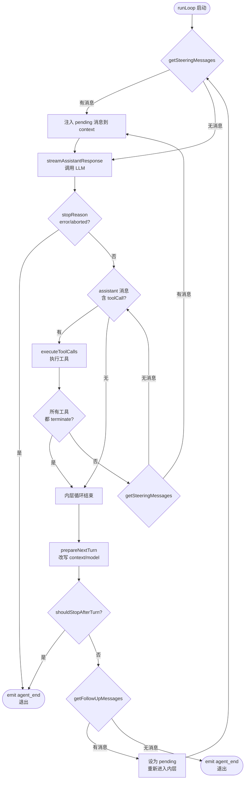

### Minimal agent scaffold 最小代理支架

pi-ai 提供了一个[代理循环](https://github.com/badlogic/pi-mono/blob/main/packages/ai/src/agent/agent-loop.ts)来处理完整的流程编排：处理用户消息、执行工具调用、将结果反馈给 LLM，并重复此过程，直到模型无需工具调用即可生成响应。该循环还支持通过回调进行消息排队：每次循环结束后，它会请求队列中的消息，并在下一次助手响应之前注入这些消息。该循环会为所有操作发出事件，从而可以轻松构建响应式 UI。

代理循环不允许您指定最大步数或类似其他统一 LLM API 中常见的参数。我从未发现过需要这些参数的场景，所以为什么要添加它们呢？循环会一直运行，直到代理发出完成指令。不过，除了循环之外， [pi-agent-core](https://github.com/badlogic/pi-mono/tree/main/packages/agent)还提供了一个 `Agent` 类，其中包含一些真正有用的功能：状态管理、简化的事件订阅、两种模式（一次一条或全部同时）的消息队列、附件处理（图像、文档）以及传输抽象，允许您直接运行代理或通过代理运行代理。


### pi-ai 是纯粹的"模型通信层"，工具的生命周期管理在 agent 层。

```
agent 层：注册工具 -> 构建 Context（含 tools 
定义）-> 调用 pi-ai 的 stream()
pi-ai 层：把 tools 转成 API 格式 -> 发请求 
-> 流式解析出 ToolCall -> 返回给 agent
agent 层：收到 ToolCall -> 执行工具 -> 构造 
ToolResultMessage -> 塞回 Context -> 再调 
pi-ai
pi-ai 层：把 ToolResultMessage 转成 API 格
式 -> 发下一轮请求...
```
pi-ai 内部用的 `Tool` 类型是这样的：

```typescript
// pi-ai 的统一格式
{
  name: "read_file",
  description: "读取文件内容",
  parameters: { type: "object", properties: { path: { type: "string" } }, required: ["path"] }
}
```

发给 OpenAI API 时，需要转成 OpenAI 要求的格式：

```json
{
  "type": "function",
  "function": {
    "name": "read_file",
    "description": "读取文件内容",
    "parameters": { ... },
    "strict": false
  }
}
```

发给 Anthropic API 时，又是另一种格式：

```json
{
  "name": "read_file",
  "description": "读取文件内容",
  "input_schema": { ... }
}
```

"转成 API 格式"就是 `convertTools()` 做的事——把同一套 `Tool` 定义，适配成不同 provider 各自要求的结构。这样 agent 层只需要定义一次工具，不用关心底层用的是 OpenAI 还是 Anthropic。


### 完整的工具调用流程是两轮对话

第一轮：模型请求调用工具

pi-ai 的 provider（如 openai-completions.ts）通过流式 chunk 拼接出这个 tool_calls 数组，连同 id: "call_abc123" 一起放进 AssistantMessage 返回给 agent 层。

agent 层执行工具

```
agent 收到 AssistantMessage
  → 发现 content 里有 ToolCall（name: 
  "read_file", arguments: {path: "/tmp/a.
  txt"}）
  → 调用实际的 read_file 函数，拿到结果 
  "hello world"
  → 构造 ToolResultMessage: { toolCallId: 
  "call_abc123", content: "hello world" }
```
第二轮：把结果回灌给 API

```
你的应用 → API: [
  { role: "user", content: "请帮我读取 /
  tmp/a.txt" },
  { role: "assistant", tool_calls: [{ id: 
  "call_abc123", ... }] },
  { role: "tool", tool_call_id: 
  "call_abc123", content: "hello world" },
  //                     
  ^^^^^^^^^^^^^^^^^^^^  就是靠这个 id 关联的
]
API → 你的应用: "文件内容是 hello world"
```
pi-ai 在这个流程中的角色 ：只负责把 ToolCall （含 id）从流式 chunk 里拼出来返回，以及把 ToolResultMessage（含 tool_call_id）转成 API 格式发回去。执行工具和构造 ToolResultMessage 是 agent 层的事。

# [pi-agent-core](https://github.com/badlogic/pi-mono/tree/main/packages/agent)

整个 pi monorepo 的 **agent 引擎层**。

本质是：**围绕一条 assistant 消息，执行"请求模型 -> 产出消息 -> 执行工具 -> 继续下一轮"的循环，并把过程全部事件化。**

它对上暴露的是：

- 无状态的 agent 循环引擎（`runAgentLoop` / `runAgentLoopContinue`）
- 有状态的运行时壳层（`Agent` 类）
- 高层产品化编排外壳（`AgentHarness`）
- 完整的事件协议（`AgentEvent`）
- 工具定义与执行管道（`AgentTool` / prepare -> execute -> finalize）
- 消息队列（steering / follow-up）
- Session 持久化与树导航
- Skills / Prompt Templates 资源系统
- Compaction / Branch Summary 长会话能力

而对下，它依赖的是：

- `pi-ai` 的 `streamSimple()` 发起 LLM 请求
- `pi-ai` 的 `AssistantMessageEventStream` 消费流式事件
- `pi-ai` 的 `validateToolArguments()` 校验工具参数
- `pi-ai` 的 `Message` / `AssistantMessage` / `ToolResultMessage` 消息类型

## 设计哲学：循环引擎应该知道尽可能少的东西

一个直觉上的答案是"越多越好"——循环引擎应该知道怎么管理会话、怎么重试失败的请求、怎么压缩超长上下文、怎么持久化中间状态。毕竟，这些都是"循环过程中"会遇到的问题。

但 pi 给出了一个反直觉的答案：**循环引擎应该知道尽可能少的东西。**

`agent-loop.ts` 文件头的注释只有一句话：

```
Agent loop that works with AgentMessage throughout.
Transforms to Message[] only at the LLM call boundary.
```

这句话定义了整个循环引擎的边界：它只管把消息送进 LLM、把 LLM 的响应拿回来、如果响应里有工具调用就执行工具、然后决定要不要继续。它不知道消息从哪来，不知道消息要存到哪去，不知道哪些工具应该被允许，不知道上下文快溢出了。

**这个选择的代价是**：所有这些"循环之外"的功能都必须由上层来实现——会话持久化、错误重试、context 压缩、UI 渲染，全都不在循环引擎的职责范围内。

**这个选择的收益是**：循环引擎可以被任何上层随意组合——终端 CLI、Slack bot、Web UI、甚至一个测试用例，都可以用同一个循环，只要提供不同的配置。

如果循环引擎自己管理会话，Slack bot（用 channel 做会话）和 CLI（用 JSONL 文件做会话）就需要不同的循环实现。如果循环引擎自己重试，有些场景（自动化管道）想要快速失败，有些场景（交互式 CLI）想要无限重试，循环就要为不同的重试策略膨胀。

**把循环做薄，是为了让上层做厚时有足够的自由度。**

这个哲学贯穿了整个包的三层设计：每一层只知道它必须知道的东西，其余的委托给上层。

## 整个包的分层图

从底层往上层看，`packages/agent/src` 可以分成 3 层：

```
高层产品化层
   harness/agent-harness.ts    ← session、skills、prompt templates、hooks、compaction
   harness/types.ts            ← harness 专属类型（Session、Skill、PromptTemplate、FileSystem、Shell）
   harness/skills.ts           ← SKILL.md 文件加载与解析
   harness/prompt-templates.ts ← prompt template 加载与解析
   harness/messages.ts         ← 自定义消息类型声明合并 + convertToLlm
   harness/system-prompt.ts    ← system prompt 拼接
   harness/compaction/         ← 上下文压缩与分支总结算法
   harness/session/            ← session 持久化（JSONL / memory）

有状态运行时层
   agent.ts                    ← Agent 类：状态管理、事件订阅、队列、abort、生命周期

无状态引擎层
   agent-loop.ts               ← 核心循环：runLoop()、streamAssistantResponse()、工具执行管道
   types.ts                    ← 核心协议：AgentMessage、AgentEvent、AgentTool、AgentLoopConfig

公共入口
   index.ts                    ← 统一 re-export
   proxy.ts                    ← 代理工具函数
```

### `src/`

| 文件              | 定位                 | 核心功能 / 关键导出                                                                                                                              | 主要被谁调用                                   | 它主要调用谁                                        |
| ----------------- | -------------------- | ------------------------------------------------------------------------------------------------------------------------------------------------ | ---------------------------------------------- | --------------------------------------------------- |
| index.ts          | 包公共入口           | 统一 re-export 所有公共 API                                                                                                                      | `packages/coding-agent`、外部 npm 使用者        | 各子模块                                            |
| types.ts          | 核心协议文件         | `AgentMessage`、`AgentEvent`、`AgentTool`、`AgentContext`、`AgentLoopConfig`、`AgentState`、`StreamFn`、`QueueMode`、`ThinkingLevel`              | 几乎所有源码文件                               | 无运行时调用                                        |
| agent-loop.ts     | 无状态循环引擎       | `agentLoop`、`agentLoopContinue`、`runAgentLoop`、`runAgentLoopContinue`、`runLoop`、`streamAssistantResponse`、`executeToolCalls`               | `agent.ts`、`agent-harness.ts`                 | `pi-ai` 的 `streamSimple`、`validateToolArguments`  |
| agent.ts          | 有状态运行时壳       | `Agent` 类：`prompt()`、`continue()`、`abort()`、`steer()`、`followUp()`、`subscribe()`、`processEvents()`                                       | `packages/coding-agent`、测试代码              | `agent-loop.ts` 的 `runAgentLoop` / `runAgentLoopContinue` |
| proxy.ts          | 代理工具函数         | `createProxyTool` 等辅助函数                                                                                                                     | 外部调用者                                     | 无                                                  |

#### `harness/`

`harness/` 是这个包最"厚"的一层。它在纯 `Agent` 之上增加了产品化能力。

| 文件                         | 定位                       | 核心功能 / 关键导出                                                                                               | 主要被谁调用                | 它主要调用谁                                     |
| ---------------------------- | -------------------------- | ----------------------------------------------------------------------------------------------------------------- | --------------------------- | ------------------------------------------------ |
| agent-harness.ts             | 高层编排外壳               | `AgentHarness` 类：`prompt()`、`skill()`、`promptFromTemplate()`、`compact()`、`navigateTree()`、`abort()`        | `packages/coding-agent`     | `agent-loop.ts`、`session.ts`、`compaction.ts`    |
| types.ts                     | harness 专属类型           | `Skill`、`PromptTemplate`、`Session`、`SessionStorage`、`FileSystem`、`Shell`、`ExecutionEnv`、各种 Event 类型    | harness 内部所有文件        | 无运行时调用                                      |
| messages.ts                  | 自定义消息 + convertToLlm  | `BashExecutionMessage`、`CustomMessage`、`BranchSummaryMessage`、`CompactionSummaryMessage`、`convertToLlm()`      | `agent-harness.ts`          | 无                                                |
| skills.ts                    | SKILL.md 加载与解析        | `loadSkills()`、`loadSourcedSkills()`、`formatSkillInvocation()`                                                  | `agent-harness.ts`          | `ExecutionEnv` 文件系统操作                       |
| prompt-templates.ts          | Prompt Template 加载与解析 | `loadPromptTemplates()`、`loadSourcedPromptTemplates()`、`formatPromptTemplateInvocation()`、`substituteArgs()`    | `agent-harness.ts`          | `ExecutionEnv` 文件系统操作                       |
| system-prompt.ts             | System Prompt 拼接         | `buildSystemPrompt()` 等                                                                                          | `agent-harness.ts`          | `skills.ts`、`prompt-templates.ts`               |
| compaction/compaction.ts     | 上下文压缩算法             | `compact()`、`prepareCompaction()`、`shouldCompact()`、`estimateTokens()`                                         | `agent-harness.ts`          | `pi-ai` 的 `streamSimple`                        |
| compaction/branch-summarization.ts | 分支总结算法         | `generateBranchSummary()`、`collectEntriesForBranchSummary()`                                                     | `agent-harness.ts`          | `pi-ai` 的 `streamSimple`                        |
| session/session.ts           | Session 核心逻辑           | `Session` 类：`buildContext()`、`appendMessage()`、`moveTo()`、`getBranch()`                                      | `agent-harness.ts`          | `SessionStorage`                                 |
| session/jsonl-repo.ts        | JSONL Session 仓库         | `JsonlSessionRepo`：基于文件系统的 session 持久化                                                                 | `packages/coding-agent`     | `jsonl-storage.ts`                               |
| session/memory-repo.ts       | 内存 Session 仓库          | `MemorySessionRepo`：基于内存的 session 持久化（测试用）                                                          | 测试代码                    | `memory-storage.ts`                              |
| utils/shell-output.ts        | Shell 输出辅助             | shell 输出截断、格式化                                                                                           | `packages/coding-agent`     | 无                                                |
| utils/truncate.ts            | 文本截断辅助               | 文本截断工具函数                                                                                                  | harness 内部                | 无                                                |

## 为什么分三层

这个包的三层设计不是偶然的。每一层解决不同粒度的问题，也面向不同的使用者。

### 第一层：无状态引擎（`agent-loop.ts`）

这一层是一个**纯函数**。给它 context + config，它产出事件流。它不知道"会话"、"UI"、"持久化"这些概念。

谁需要它？

- 测试代码：直接调用 `runAgentLoop()`，提供假的 `streamFn`，验证行为
- 嵌套 agent：外层工具执行里启动内层循环
- 极简场景：一次性脚本，不需要状态管理

### 第二层：有状态壳层（`agent.ts`）

这一层在循环引擎之上加了**运行时状态**：transcript、订阅者、消息队列、abort 控制。

谁需要它？

- `coding-agent` 的 `AgentSession`：用 `Agent` 管理运行时，再包一层会话能力
- 需要交互式对话的应用：`prompt()` / `steer()` / `followUp()` API 比直接调循环方便得多

### 第三层：产品化外壳（`harness/agent-harness.ts`）

这一层在 `Agent` 之上加了**产品能力**：session 持久化、skills、prompt templates、compaction、树导航。

谁需要它？

- `coding-agent`：直接用 `AgentHarness` 搭建完整会话
- 任何需要"会话存档 + 历史压缩 + 技能系统"的应用

```
使用者                          调用哪一层
─────────────────────────────────────────────────
测试代码                        runAgentLoop()（第一层）
嵌套 agent                      agentLoop()（第一层）
简单 bot                        new Agent()（第二层）
coding-agent                    new AgentHarness()（第三层）
```

## 核心类型层 `types.ts`

`types.ts` 是整个包的协议文件。它定义了循环引擎的"语言"——所有层之间通过这些类型通信。

### 1. AgentMessage — 统一消息类型

```typescript
// 默认的 LLM 消息
type Message = UserMessage | AssistantMessage | ToolResultMessage;

// 应用可通过声明合并扩展的自定义消息
export interface CustomAgentMessages {
  // 默认为空
}

// AgentMessage = LLM 消息 + 所有自定义消息
export type AgentMessage = Message | CustomAgentMessages[keyof CustomAgentMessages];
```

这个设计的核心思想是：**自定义消息在循环内部是一等公民，只在出门见 LLM 时才被过滤。**

`CustomAgentMessages` 使用 TypeScript 的声明合并（declaration merging）。应用层可以这样扩展：

```typescript
// 在 messages.ts 中
declare module "../types.ts" {
  interface CustomAgentMessages {
    bashExecution: BashExecutionMessage;
    custom: CustomMessage;
    branchSummary: BranchSummaryMessage;
    compactionSummary: CompactionSummaryMessage;
  }
}
```

扩展之后，`AgentMessage` 自动变成：

```typescript
type AgentMessage =
  | UserMessage
  | AssistantMessage
  | ToolResultMessage
  | BashExecutionMessage
  | CustomMessage
  | BranchSummaryMessage
  | CompactionSummaryMessage;
```

**为什么不用普通的联合类型？** 因为 pi-agent-core 不应该知道 pi-coding-agent 的消息类型。声明合并让依赖方向保持正确。

**为什么不用 `any` 或泛型？** 用 `any` 丢失类型安全。用泛型 `Agent<TMessage>` 会让每个使用 Agent 的地方都要传类型参数。声明合并在全局生效，不需要传递。

### 2. AgentEvent — 事件协议

```typescript
export type AgentEvent =
  // Agent 生命周期
  | { type: "agent_start" }
  | { type: "agent_end"; messages: AgentMessage[] }
  // 轮次生命周期
  | { type: "turn_start" }
  | { type: "turn_end"; message: AgentMessage; toolResults: ToolResultMessage[] }
  // 消息生命周期
  | { type: "message_start"; message: AgentMessage }
  | { type: "message_update"; message: AgentMessage; assistantMessageEvent: AssistantMessageEvent }
  | { type: "message_end"; message: AgentMessage }
  // 工具执行生命周期
  | { type: "tool_execution_start"; toolCallId: string; toolName: string; args: any }
  | { type: "tool_execution_update"; toolCallId: string; toolName: string; args: any; partialResult: any }
  | { type: "tool_execution_end"; toolCallId: string; toolName: string; result: any; isError: boolean };
```

事件形成一个完整的生命周期：

```
agent_start
  └── turn_start
        ├── message_start (user/steering message)
        ├── message_end
        ├── message_start (assistant response)
        ├── message_update (streaming delta)  ← 可能多次
        ├── message_end
        ├── tool_execution_start              ← 每个工具一次
        ├── tool_execution_update (partial)   ← 可能多次
        ├── tool_execution_end
        └── turn_end
  └── turn_start (next turn)
        └── ...
agent_end
```

核心区别：

- AssistantMessageEvent：pi-ai 产出，只覆盖"一条消息的流式拼接"（text/thinking/toolcall 的 start/delta/end）
- AgentEvent：pi-agent 产出，覆盖"整个 agent 运行周期"（agent/turn/message/tool 四层生命周期），其中 message_update 事件里会透传 assistantMessageEvent 作为嵌套字段

所以 AgentEvent 是 AssistantMessageEvent 的超集包装：它把单条消息的流式事件包进更大的 agent 生命周期里，同时增加了工具执行、轮次管理、agent 启停等 pi-ai 不关心的事件。

### 3. AgentTool — 工具定义

```typescript
export interface AgentTool<TParameters extends TSchema = TSchema, TDetails = any>
  extends Tool<TParameters> {
  label: string;
  prepareArguments?: (args: unknown) => Static<TParameters>;
  execute: (
    toolCallId: string,
    params: Static<TParameters>,
    signal?: AbortSignal,
    onUpdate?: AgentToolUpdateCallback<TDetails>,
  ) => Promise<AgentToolResult<TDetails>>;
  executionMode?: ToolExecutionMode;
}
```

`AgentTool` 扩展了 `pi-ai` 的 `Tool`（包含 name、description、parameters schema），增加了：

- `label`：UI 显示用的人类可读标签
- `prepareArguments`：参数预处理钩子（兼容性适配）
- `execute`：真正的执行函数
- `executionMode`：单工具级别的串行/并行覆盖

### 4. AgentLoopConfig — 循环引擎的全部知识

```typescript
export interface AgentLoopConfig extends SimpleStreamOptions {
  model: Model<any>;
  convertToLlm: (messages: AgentMessage[]) => Message[] | Promise<Message[]>;
  transformContext?: (messages: AgentMessage[], signal?: AbortSignal) => Promise<AgentMessage[]>;
  getApiKey?: (provider: string) => Promise<string | undefined> | string | undefined;
  shouldStopAfterTurn?: (context: ShouldStopAfterTurnContext) => boolean | Promise<boolean>;
  prepareNextTurn?: (context: PrepareNextTurnContext) => AgentLoopTurnUpdate | undefined | Promise<...>;
  getSteeringMessages?: () => Promise<AgentMessage[]>;
  getFollowUpMessages?: () => Promise<AgentMessage[]>;
  toolExecution?: ToolExecutionMode;
  beforeToolCall?: (context: BeforeToolCallContext, signal?: AbortSignal) => Promise<BeforeToolCallResult | undefined>;
  afterToolCall?: (context: AfterToolCallContext, signal?: AbortSignal) => Promise<AfterToolCallResult | undefined>;
}
```

这个类型定义了循环引擎的全部外部依赖。注意设计纪律：

- `convertToLlm` 是**必须**提供的（循环没有默认的转换逻辑）
- 其他所有字段都是**可选的**（不提供就不使用该功能）
- 多数回调有"不得抛异常"的契约；`beforeToolCall` / `afterToolCall` 例外（被 try-catch 保护）

### 5. StreamFn — 流式函数类型

```typescript
export type StreamFn = (
  ...args: Parameters<typeof streamSimple>
) => ReturnType<typeof streamSimple> | Promise<ReturnType<typeof streamSimple>>;
```

`StreamFn` 签名与 `pi-ai` 的 `streamSimple()` 完全一致。默认值就是 `streamSimple`，但上层可以替换它（比如 `coding-agent` 在 `sdk.ts` 里包了一层，附加 apiKey / headers / retry 策略）。

## 无状态引擎层 `agent-loop.ts`

这是整个 `pi-agent-core` 的心脏。约 700 行代码，定义了 agent 的"生命节奏"。

### 公开 API

这个文件导出 4 个函数，形成两对：

| 函数                       | 用途         | 是否添加新消息 | 返回类型                            |
| -------------------------- | ------------ | -------------- | ----------------------------------- |
| `agentLoop()`              | 带 prompt 启 | 是             | `EventStream<AgentEvent, AgentMessage[]>` |
| `agentLoopContinue()`      | 从 context 续 | 否             | `EventStream<AgentEvent, AgentMessage[]>` |
| `runAgentLoop()`           | 带 prompt 启 | 是             | `Promise<AgentMessage[]>`           |
| `runAgentLoopContinue()`   | 从 context 续 | 否             | `Promise<AgentMessage[]>`           |

`agentLoop()` / `agentLoopContinue()` 是 EventStream 版本（立即返回流，异步执行）。
`runAgentLoop()` / `runAgentLoopContinue()` 是 Promise 版本（await 直到完成）。

实际使用中，`Agent` 类调用的是 Promise 版本（`runAgentLoop` / `runAgentLoopContinue`）。

### 双层循环：`runLoop()`

`runLoop()` 是整个引擎的核心。它的设计可以用一张图概括：



**内层循环**负责"持续工作"：调用 LLM -> 执行工具 -> 检查 steering -> 再调用 LLM。

**外层循环**负责"被唤醒"：当内层循环结束（agent 本来要停下来），检查有没有 follow-up 消息。

### `streamAssistantResponse()` — 与 pi-ai 的桥接点

这是整个系统里最有代表性的桥接函数。它完成 4 层转换：

```typescript
async function streamAssistantResponse(
  context: AgentContext, config: AgentLoopConfig,
  signal: AbortSignal | undefined, emit: AgentEventSink, streamFn?: StreamFn,
): Promise<AssistantMessage> {
  // 第 1 层：AgentMessage[] -> AgentMessage[]（可选裁剪）
  let messages = context.messages;
  if (config.transformContext) {
    messages = await config.transformContext(messages, signal);
  }

  // 第 2 层：AgentMessage[] -> Message[]（格式转换）
  const llmMessages = await config.convertToLlm(messages);

  // 第 3 层：组装 pi-ai Context 并调用 streamFn
  const llmContext: Context = {
    systemPrompt: context.systemPrompt,
    messages: llmMessages,
    tools: context.tools,
  };
  const response = await streamFunction(config.model, llmContext, { ...config, signal });

  // 第 4 层：AssistantMessageEvent -> AgentEvent
  for await (const event of response) {
    switch (event.type) {
      case "start":
        // 推送 partial message 到 context，emit message_start
        break;
      case "text_delta" / "thinking_delta" / "toolcall_delta" / ...:
        // 替换 context 末尾的 partial message，emit message_update
        break;
      case "done" / "error":
        // 用 response.result() 取最终消息，emit message_end
        return finalMessage;
    }
  }
}
```

**为什么 `transformContext` 和 `convertToLlm` 要分开？**

* `transformContext` 操作的是 `AgentMessage[]`，它知道所有自定义消息类型。典型用途是 context window 管理。
* `convertToLlm` 操作的是 `AgentMessage[] -> Message[]` 的转换。它过滤掉 LLM 不认识的消息类型。

如果合成一步，`transformContext` 就必须同时理解 AgentMessage 语义和 LLM 消息格式——关注点耦合了。

### 工具执行管道：三阶段设计

工具执行不是简单的"找到工具，传参数，拿结果"。它是一条三阶段管道：

```
prepare → execute → finalize
```

#### 阶段 1：Prepare — `prepareToolCall()`

```typescript
async function prepareToolCall(...): Promise<PreparedToolCall | ImmediateToolCallOutcome> {
  // 1. 查找工具定义
  const tool = currentContext.tools?.find(t => t.name === toolCall.name);
  if (!tool) return { kind: "immediate", result: createErrorToolResult(...), isError: true };

  // 2. 参数预处理
  const preparedToolCall = prepareToolCallArguments(tool, toolCall);

  // 3. TypeBox schema 校验
  const validatedArgs = validateToolArguments(tool, preparedToolCall);

  // 4. beforeToolCall 钩子（可阻止执行）
  if (config.beforeToolCall) {
    const beforeResult = await config.beforeToolCall({ ... }, signal);
    if (beforeResult?.block) return { kind: "immediate", ... };
  }

  // 5. 全部通过
  return { kind: "prepared", toolCall, tool, args: validatedArgs };
}
```

返回类型是判别联合：`kind: "prepared"` 表示可以执行，`kind: "immediate"` 表示直接返回错误。

#### 阶段 2：Execute — `executePreparedToolCall()`

```typescript
async function executePreparedToolCall(prepared, signal, emit): Promise<ExecutedToolCallOutcome> {
  const updateEvents: Promise<void>[] = [];
  try {
    const result = await prepared.tool.execute(
      prepared.toolCall.id, prepared.args, signal,
      (partialResult) => {
        // 把工具侧的 partialResult 翻译成 tool_execution_update 事件
        updateEvents.push(Promise.resolve(emit({ type: "tool_execution_update", ... })));
      },
    );
    await Promise.all(updateEvents);
    return { result, isError: false };
  } catch (error) {
    await Promise.all(updateEvents);
    return { result: createErrorToolResult(...), isError: true };
  }
}
```

注意：工具的 `execute()` 是**允许抛异常的**。循环引擎会捕获异常并转换为 `isError: true` 的结果。这和 `AgentLoopConfig` 的回调不同（它们要求"不得抛异常"）。

#### 阶段 3：Finalize — `finalizeExecutedToolCall()`

```typescript
async function finalizeExecutedToolCall(...): Promise<FinalizedToolCallOutcome> {
  let result = executed.result;
  let isError = executed.isError;

  if (config.afterToolCall) {
    const afterResult = await config.afterToolCall({ ... }, signal);
    if (afterResult) {
      result = {
        content: afterResult.content ?? result.content,    // 字段级覆盖
        details: afterResult.details ?? result.details,
        terminate: afterResult.terminate ?? result.terminate,
      };
      isError = afterResult.isError ?? isError;
    }
  }
  return { toolCall: prepared.toolCall, result, isError };
}
```

`afterToolCall` 的返回值是**部分覆盖**语义：省略的字段保留原值。这让钩子可以做精确修改。

### Parallel vs Sequential：两种执行策略

```typescript
async function executeToolCalls(...): Promise<ExecutedToolCallBatch> {
  if (config.toolExecution === "sequential" || hasSequentialToolCall) {
    return executeToolCallsSequential(...);
  }
  return executeToolCallsParallel(...);  // 默认
}
```

**Sequential 模式**：每个工具独立完成整条管道（prepare -> execute -> finalize），然后才开始下一个。

**Parallel 模式**的设计更微妙：

1. **Prepare 串行**：按 assistant 输出顺序稳定执行，保证钩子调用的确定性
2. **Execute 并行**：所有通过 prepare 的工具同时开始执行
3. **Finalize 按源顺序**：结果按 LLM 返回的工具调用顺序处理

```mermaid
sequenceDiagram
    participant Loop as Agent Loop
    participant P as Prepare
    participant E as Execute
    participant F as Finalize

    Note over Loop: === Sequential ===
    Loop->>P: prepare(tool_1)
    P-->>E: execute(tool_1)
    E-->>F: finalize(tool_1)
    Loop->>P: prepare(tool_2)
    P-->>E: execute(tool_2)
    E-->>F: finalize(tool_2)

    Note over Loop: === Parallel ===
    Loop->>P: prepare(tool_1)
    Loop->>P: prepare(tool_2)
    Loop->>E: execute(tool_1) 同时
    Loop->>E: execute(tool_2) 同时
    E-->>F: finalize(tool_1) 按源顺序
    E-->>F: finalize(tool_2) 按源顺序
```

### 具体场景：读文件 + 编辑文件

用一个真实场景把三阶段管道串起来。假设 LLM 在一个 turn 中同时返回了两个工具调用：`read` 和 `edit`（parallel 模式）。

**Prepare 阶段**（串行）：

1. 循环 emit `tool_execution_start` for `read`——注意这发生在 prepare **之前**，所以即使工具最终验证失败，UI 也能看到"正在准备"的状态
2. `read` 通过 prepare：工具存在 -> TypeBox 验证 path 是 string -> `beforeToolCall` 检查文件权限 -> 返回 `kind: "prepared"`
3. 循环 emit `tool_execution_start` for `edit`
4. `edit` 通过 prepare：工具存在 -> TypeBox 验证 edits 数组格式 -> `beforeToolCall` 检查不在禁止列表 -> 返回 `kind: "prepared"`

**Execute 阶段**（并行）：

5. `read.execute()` 和 `edit.execute()` 同时启动
6. `read` 先完成（只是读磁盘），但它的结果**等待**被 finalize
7. `edit` 后完成（要写磁盘），它的结果也等待被 finalize

**Finalize 阶段**（按源顺序）：

8. 先 finalize `read` 的结果——`afterToolCall` 可以脱敏文件内容
9. 再 finalize `edit` 的结果——`afterToolCall` 可以记录审计日志

注意一个微妙之处：如果 `read` 的 prepare 失败了（比如 `beforeToolCall` 阻止了它），它的错误结果会在 prepare 循环中**立即**被加入 results 数组。然后 `edit` 继续 prepare 和 execute。最终 results 数组的顺序是：`read`（prepare 阶段的 immediate 结果）-> `edit`（execute + finalize 的结果）。

### 工具执行的取舍

**得到了什么：**

1. **钩子增加了可观测性和可控性**。`beforeToolCall` 让产品层可以实现权限弹窗、速率限制、安全策略。`afterToolCall` 让产品层可以实现审计日志、敏感信息脱敏、结果增强。

2. **参数验证把模型的错误变成可恢复的对话**。TypeBox 验证失败时，循环把清晰的错误信息作为工具结果返回给模型，模型在下一轮可以修正参数重试。

3. **parallel 模式的"prepare 串行 + execute 并行"兼顾了安全和性能**。串行 prepare 保证安全检查的一确定性，并行 execute 减少了多工具调用的等待时间。

**放弃了什么：**

1. **钩子有额外的异步开销**。不提供钩子时没有开销，但一旦提供了钩子——即使它每次都返回 undefined——`await` 的异步调度成本就会叠加。

2. **钩子异常被 try-catch 防御，代价是静默失败**。钩子的 bug 可能表现为"工具莫名失败"，而不是清晰的错误信息。

3. **parallel 模式下工具之间无法共享中间状态**。如果两个工具调用之间有依赖关系（比如"先读文件再编辑"），parallel 模式会产生竞态。pi 的解决方案是让 LLM 自己管理依赖——如果两个操作有依赖，LLM 应该在两个不同的 turn 中分别发起。

## 有状态壳层 `agent.ts`

`Agent` 是对低层 `runAgentLoop*()` 的有状态封装。约 878 行代码。

### Agent 拥有什么

#### 1. MutableAgentState — 受控的可变状态

```typescript
type MutableAgentState = {
  systemPrompt: string;
  model: Model<any>;
  thinkingLevel: ThinkingLevel;
  get tools(): AgentTool[];       // 赋值时自动 copy
  set tools(next: AgentTool[]);
  get messages(): AgentMessage[];  // 赋值时自动 copy
  set messages(next: AgentMessage[]);
  isStreaming: boolean;
  streamingMessage?: AgentMessage;
  pendingToolCalls: Set<string>;
  errorMessage?: string;
};
```

`tools` 和 `messages` 使用 getter/setter，赋值时自动 `slice()` 拷贝。这保证了 Agent 的状态和循环引擎的工作数据是独立的。

#### 2. PendingMessageQueue — 两种节奏的输入

```typescript
class PendingMessageQueue {
  private messages: AgentMessage[] = [];
  public mode: QueueMode;  // "all" | "one-at-a-time"

  drain(): AgentMessage[] {
    if (this.mode === "all") {
      const drained = this.messages.slice();
      this.messages = [];
      return drained;
    }
    // "one-at-a-time"：每次只取最老的一条
    const first = this.messages[0];
    if (!first) return [];
    this.messages = this.messages.slice(1);
    return [first];
  }
}
```

`Agent` 持有两个独立的队列：

- `steeringQueue`：`agent.steer(msg)` 入队，在 turn 间隙被消费
- `followUpQueue`：`agent.followUp(msg)` 入队，在 agent 本来要退出时被消费

为什么默认是 `one-at-a-time`？考虑用户快速输入三条 steering 消息。如果用 `"all"` 模式，三条会同时注入 context，LLM 需要一次理解三条指令。`"one-at-a-time"` 让 LLM 先处理第一条，下个 turn 间隙再收到第二条——就像人类对话中逐条回应。

#### 3. 事件订阅 — 有序且受信号保护

```typescript
private readonly listeners = new Set<
  (event: AgentEvent, signal: AbortSignal) => Promise<void> | void
>();

subscribe(listener): () => void {
  this.listeners.add(listener);
  return () => this.listeners.delete(listener);
}
```

三个设计选择：

1. **listener 接收 AbortSignal**：能感知当前 run 的中止
2. **listener 的 Promise 被 await**：按注册顺序串行执行，保证状态归约和事件通知的顺序一致
3. **`agent_end` 不等于 idle**：Agent 要等所有 `agent_end` listener 处理完才算空闲

#### 4. 中止控制 — 一个 AbortController 管全局

每次 `prompt()` / `continue()` 都创建新的 `AbortController`。它的 signal 被传递给循环引擎、所有 listener、所有工具执行。一个 `abort()` 调用就能中止整条链。

#### 5. 互斥锁 — 禁止重入

```typescript
async prompt(input): Promise<void> {
  if (this.activeRun) {
    throw new Error(
      "Agent is already processing a prompt. " +
      "Use steer() or followUp() to queue messages, " +
      "or wait for completion."
    );
  }
  // ...
}
```

### `processEvents()` — 状态归约器

`Agent` 接收循环引擎发射的事件，在 `processEvents()` 中做状态归约：

```typescript
private async processEvents(event: AgentEvent): Promise<void> {
  switch (event.type) {
    case "message_start":
      this._state.streamingMessage = event.message;
      break;
    case "message_update":
      this._state.streamingMessage = event.message;
      break;
    case "message_end":
      this._state.streamingMessage = undefined;
      this._state.messages.push(event.message);  // 只有 message_end 才提交到 transcript
      break;
    case "tool_execution_start":
      this._state.pendingToolCalls = new Set([...this._state.pendingToolCalls, event.toolCallId]);
      break;
    case "tool_execution_end":
      const next = new Set(this._state.pendingToolCalls);
      next.delete(event.toolCallId);
      this._state.pendingToolCalls = next;
      break;
    case "turn_end":
      if (event.message.role === "assistant" && event.message.errorMessage) {
        this._state.errorMessage = event.message.errorMessage;
      }
      break;
    case "agent_end":
      this._state.streamingMessage = undefined;
      break;
  }

  // 先归约状态，再通知 listener
  for (const listener of this.listeners) {
    await listener(event, this.activeRun!.abortController.signal);
  }
}
```

几个值得注意的设计细节：

**1. `pendingToolCalls` 每次修改都创建新 Set**。`tool_execution_start` 和 `tool_execution_end` 不是在原 Set 上 add/delete，而是创建一个新的 Set 再赋值。这是因为 `AgentState.pendingToolCalls` 是 `ReadonlySet`——外部代码持有的引用不会被意外修改。新建 Set 保证了不可变语义。

**2. 状态归约在 listener 通知之前**。`switch` 语句先更新状态，然后才 `for` 循环通知 listener。这意味着 listener 在收到 `message_end` 事件时，`state.messages` 已经包含了这条消息，`state.streamingMessage` 已经被清空。listener 总是看到一致的状态。

**3. 不是所有事件都有状态变更**。`agent_start`、`turn_start`、`tool_execution_update` 都没有对应的状态修改——它们只被透传给 listener。归约器只处理真正影响状态的事件。

### Agent 不管什么

理解 `Agent` 的边界和理解它的能力同样重要：

| 关注点             | Agent 的态度                                   | 谁管              |
| ------------------ | ---------------------------------------------- | ----------------- |
| 会话持久化         | 不知道"会话"的存在                             | Session / Harness |
| UI 渲染            | 只发射事件，不管谁听                           | TUI / Web UI      |
| 认证               | 通过 `getApiKey` 回调获取，不管 token 怎么来的 | OAuth 模块        |
| 模型选择           | 只持有一个 `model` 字段，不管怎么选的          | ModelRegistry     |
| Context 压缩       | 通过 `transformContext` 委托，不管怎么压       | Compaction        |
| System prompt 拼接 | 只持有一个 `systemPrompt` 字符串               | system-prompt.ts  |
| 工具注册           | 只持有 `tools[]`，不管工具从哪来               | Extension         |

**Agent 只管运行时状态，不管配置和策略。** 它知道自己正在用什么模型（`state.model`），但不知道为什么选这个模型。它知道有哪些工具可用（`state.tools`），但不知道这些工具是怎么被发现和注册的。它知道 system prompt 是什么（`state.systemPrompt`），但不知道 prompt 是怎么从多个来源拼接出来的。

### `runWithLifecycle()` — 生命周期壳层

```typescript
private async runWithLifecycle(executor: (signal: AbortSignal) => Promise<void>): Promise<void> {
  const abortController = new AbortController();
  const promise = new Promise<void>((resolve) => { resolvePromise = resolve; });
  this.activeRun = { promise, resolve: resolvePromise, abortController };
  this._state.isStreaming = true;

  try {
    await executor(abortController.signal);
  } catch (error) {
    // 低层 loop 未按协议发出失败事件时，补发最小失败事件
    await this.handleRunFailure(error, abortController.signal.aborted);
  } finally {
    this.finishRun();  // isStreaming = false, resolve promise, 清除 activeRun
  }
}
```

### 公开 API 调用链

```
Agent.prompt(input)
  → normalizePromptInput()        // string | AgentMessage | AgentMessage[] → AgentMessage[]
  → runPromptMessages()
  → runWithLifecycle()
  → runAgentLoop()                // agent-loop.ts
  → runLoop()                     // 双层循环

Agent.continue()
  → 检查最后一条消息角色
  → 如果是 assistant：尝试从队列取出消息走 prompt 流程
  → 如果是 user/toolResult：runContinuation()
  → runWithLifecycle()
  → runAgentLoopContinue()

Agent.abort()
  → activeRun.abortController.abort()

Agent.waitForIdle()
  → activeRun.promise
```

### Agent 的取舍

**得到了什么：**

1. **清晰的职责边界**。循环引擎是纯计算，Agent 是状态管理。两者可以独立演进——改循环逻辑不影响状态管理，改状态结构不影响循环逻辑。

2. **可预测的状态变更**。所有状态修改都通过 `processEvents()` 这一个入口。想知道某个状态字段什么时候会变？只需要在 `processEvents()` 的 `switch` 语句中搜索。

3. **灵活的消费者模型**。`subscribe()` 让任意多个消费者同时观察 Agent 的行为。TUI 订阅事件来渲染，session manager 订阅事件来持久化，extension 订阅事件来做自定义逻辑——它们互不干扰。

**放弃了什么：**

1. **Agent 是一个胖接口**。30+ 个公开方法和属性。如果你只想跑一个简单的 agent 循环，直接调用 `runAgentLoop()` 比创建一个 Agent 实例更直接。

2. **状态同步依赖事件顺序**。listener 串行执行，一个慢的 listener（比如写磁盘的 session manager）会延迟后续 listener（比如渲染 UI 的 TUI）收到事件的时间。

3. **Agent 是单线程模型**。同一时间只能有一个 `prompt()` 或 `continue()` 在运行。如果需要"后台持续运行、前台随时查询"的模式，必须在 Agent 之上再包一层异步调度器。

## 高层产品化层 `harness/agent-harness.ts`

`AgentHarness` 是 `packages/agent` 的最上层。约 1055 行代码，在 `Agent` 之上增加了产品化能力。

### AgentHarness 拥有什么

| 能力                   | 实现方式                                                                                       |
| ---------------------- | ---------------------------------------------------------------------------------------------- |
| Session 持久化         | `Session` 接口 + `SessionStorage` 抽象（JSONL / memory 实现）                                 |
| Skills                 | `loadSkills()` 从目录加载 `SKILL.md` 文件，格式化为用户消息注入                                |
| Prompt Templates       | `loadPromptTemplates()` 从目录加载 `.md` 文件，支持参数替换                                    |
| Hook 系统              | `on(type, handler)` 注册具名 hook，`emitHook()` 触发并采用"最后一个非 undefined 返回值"策略   |
| Provider 请求控制      | `before_provider_request` / `before_provider_payload` / `after_provider_response` hook         |
| Compaction             | `compact()` 调用 compaction 算法压缩历史，结果以 session entry 落盘                            |
| Branch Summary         | `navigateTree()` 切换 session 树叶子节点，必要时生成分支总结                                   |
| 消息队列               | steer / followUp / nextTurn 三种队列                                                           |
| 工具管理               | `setTools()` / `setActiveTools()` 动态管理工具集                                               |
| Model / Thinking Level | `setModel()` / `setThinkingLevel()` 运行时切换，变更记录到 session                             |

### `AgentHarness` vs `Agent` 的关键区别

| 维度           | `Agent`                              | `AgentHarness`                                 |
| -------------- | ------------------------------------ | ---------------------------------------------- |
| Session        | 不知道"会话"的存在                   | 持有 `Session`，自动持久化消息                 |
| 消息队列       | `PendingMessageQueue`（drain 模式）  | 三种队列（steer / followUp / nextTurn）        |
| 事件系统       | `subscribe(listener)`                | `subscribe()` + `on(type, handler)` 具名 hook  |
| Tool Call 钩子 | `beforeToolCall` / `afterToolCall`   | 通过 `tool_call` / `tool_result` hook 实现     |
| Context 变换   | `transformContext` 回调              | 通过 `context` hook 实现                       |
| StreamFn       | 直接使用或简单包装                   | 包装了 auth / headers / retry / hook 等完整链路 |
| 错误处理       | `handleRunFailure` 补发事件          | `normalizeHarnessError` 统一错误分类           |
| 生命周期       | `isStreaming` + `activeRun`          | `phase` 状态机（idle / turn / compaction / branch_summary / retry） |

### `executeTurn()` — 核心执行方法

```typescript
private async executeTurn(turnState, text, options?): Promise<AssistantMessage> {
  // 1. 构造用户消息
  let messages = [createUserMessage(text, options?.images)];

  // 2. 处理 nextTurnQueue（上一轮结束后排队的消息）
  if (this.nextTurnQueue.length > 0) {
    const queuedMessages = this.nextTurnQueue.splice(0);
    messages = [...queuedMessages, messages[0]];
  }

  // 3. 触发 before_agent_start hook
  const beforeResult = await this.emitHook({ type: "before_agent_start", ... });
  if (beforeResult?.messages) messages = [...messages, ...beforeResult.messages];

  // 4. 调用低层 runAgentLoop
  const newMessages = await runAgentLoop(
    messages,
    this.createContext(turnState, beforeResult?.systemPrompt),
    this.createLoopConfig(getTurnState, setTurnState),
    (event) => this.handleAgentEvent(event, signal),
    abortController.signal,
    this.createStreamFn(getTurnState),
  );

  // 5. 返回最后一条 assistant 消息
  return newMessages.filter(m => m.role === "assistant").pop();
}
```

### Hook 系统

`AgentHarness` 的 hook 系统是它与 `Agent` 最大的区别。`Agent` 只有少数几个回调（`beforeToolCall` / `afterToolCall` / `prepareNextTurn`），而 `AgentHarness` 提供了完整的 hook 体系：

| Hook 类型                   | 触发时机                           | 可以做什么                                   |
| --------------------------- | ---------------------------------- | -------------------------------------------- |
| `before_agent_start`        | 每次 turn 开始前                   | 注入额外消息、修改 system prompt             |
| `context`                   | 每次 LLM 请求前                    | 裁剪/注入消息                               |
| `tool_call`                 | 工具执行前                         | 阻止执行、审计                               |
| `tool_result`               | 工具执行后                         | 覆盖结果、脱敏                               |
| `before_provider_request`   | provider 请求前                    | 修改 streamOptions（headers / timeout 等）   |
| `before_provider_payload`   | payload 发送前                     | 修改请求 payload                             |
| `after_provider_response`   | 收到 HTTP 响应后                   | 记录响应头、诊断                             |
| `session_before_compact`    | compaction 执行前                  | 取消、提供自定义 compaction 结果             |
| `session_compact`           | compaction 完成后                  | 审计                                         |
| `session_before_tree`       | 树导航前                           | 取消、提供自定义 summary                     |
| `session_tree`              | 树导航后                           | 审计                                         |

### Session 持久化

`AgentHarness` 通过 `Session` 接口实现会话持久化：

```typescript
interface Session {
  buildContext(): Promise<SessionContext>;
  getMetadata(): Promise<SessionMetadata>;
  getLeafId(): Promise<string | null>;
  appendMessage(message: AgentMessage): Promise<void>;
  appendCompaction(summary, firstKeptEntryId, tokensBefore, details, fromHook): Promise<string>;
  appendModelChange(provider: string, modelId: string): Promise<void>;
  appendThinkingLevelChange(level: string): Promise<void>;
  moveTo(targetId: string, summary?): Promise<string | null>;
  getBranch(): Promise<SessionTreeEntry[]>;
  getEntry(id: string): Promise<SessionTreeEntry | undefined>;
  // ...
}
```

Session 的存储模型是一棵**树**（不是线性列表）。每个 entry 有 `id` 和 `parentId`，支持分支和回溯。

消息在 `handleAgentEvent()` 中自动持久化：

```typescript
private async handleAgentEvent(event: AgentEvent, signal?: AbortSignal): Promise<void> {
  if (event.type === "message_end") {
    await this.session.appendMessage(event.message);  // 自动持久化
    await this.emitAny(event, signal);
    return;
  }
  if (event.type === "turn_end") {
    await this.emitAny(event, signal);
    await this.flushPendingSessionWrites();  // 冲刷缓存的写操作
    await this.emitOwn({ type: "save_point" });
    return;
  }
  if (event.type === "agent_end") {
    await this.flushPendingSessionWrites();
    this.phase = "idle";
    await this.emitAny(event, signal);
    await this.emitOwn({ type: "settled" });
    return;
  }
  await this.emitAny(event, signal);
}
```

### `convertToLlm` — 自定义消息的 LLM 转换

`harness/messages.ts` 提供了 `AgentHarness` 使用的 `convertToLlm` 实现：

```typescript
export function convertToLlm(messages: AgentMessage[]): Message[] {
  return messages.map((m): Message | undefined => {
    switch (m.role) {
      case "bashExecution":
        if (m.excludeFromContext) return undefined;
        return { role: "user", content: [{ type: "text", text: bashExecutionToText(m) }], timestamp: m.timestamp };
      case "custom":
        return { role: "user", content: typeof m.content === "string" ? [{ type: "text", text: m.content }] : m.content, timestamp: m.timestamp };
      case "branchSummary":
        return { role: "user", content: [{ type: "text", text: BRANCH_SUMMARY_PREFIX + m.summary + BRANCH_SUMMARY_SUFFIX }], timestamp: m.timestamp };
      case "compactionSummary":
        return { role: "user", content: [{ type: "text", text: COMPACTION_SUMMARY_PREFIX + m.summary + COMPACTION_SUMMARY_SUFFIX }], timestamp: m.timestamp };
      case "user":
      case "assistant":
      case "toolResult":
        return m;
      default:
        return undefined;  // 过滤掉 LLM 不认识的消息
    }
  }).filter((m): m is Message => m !== undefined);
}
```

这就是"自定义消息在循环内部是一等公民，只在出门见 LLM 时才被过滤"的具体实现。

## 最短调用链

### 从 `Agent.prompt()` 到 LLM 响应

```
Agent.prompt("帮我做一件事")
  → normalizePromptInput()              // "帮我做一件事" → [{ role: "user", content: [...] }]
  → runPromptMessages()
  → runWithLifecycle()                   // 创建 AbortController, 设置 isStreaming=true
  → runAgentLoop()                       // agent-loop.ts
  → runLoop()                            // 双层循环
  → streamAssistantResponse()            // 桥接到 pi-ai
    → config.transformContext()           // 可选裁剪
    → config.convertToLlm()              // AgentMessage[] → Message[]
    → streamFn(model, context, options)   // 默认 streamSimple()
    → for await (event of response)       // 消费流式事件
    → emit message_start / message_update / message_end
  → 检查 tool calls
  → 若有工具则执行（prepare → execute → finalize）
  → emit turn_end
  → 检查 shouldStopAfterTurn
  → 检查 steering / follow-up
  → emit agent_end
  → finishRun()                          // isStreaming=false, resolve waitForIdle
```

### 从 `AgentHarness.prompt()` 到 LLM 响应

```
AgentHarness.prompt("帮我做一件事")
  → createTurnState()                    // 组装 session、resources、model、tools
  → executeTurn()
    → 处理 nextTurnQueue
    → emitHook("before_agent_start")
    → createLoopConfig()                 // 映射 hook/queue 到 AgentLoopConfig
    → createStreamFn()                   // 包装 auth/headers/retry/hook
    → runAgentLoop()
    → handleAgentEvent()                 // 接收低层事件，持久化到 session
  → 返回最后一条 assistant 消息
```

## coding-agent 如何把 pi-ai 和 pi-agent-core 接起来

前面我们一直在看两个"库"：`pi-ai` 和 `pi-agent-core`。但你实际运行的 `pi` 命令，并不是直接在调用这两个库的某个裸函数。真正把它们接起来的是 `packages/coding-agent`。

它做的事可以概括成一句话：

> 用 `coding-agent` 自己的 **session / settings / extensions / tools / modes**，把 `pi-agent-core` 的 `Agent`（或 `AgentHarness`）包起来，再把底层模型请求通过 `pi-ai` 的 `streamSimple()` 发出去，最后把事件交给 TUI 或 print/RPC 模式消费。

### 接线全图

```text
CLI main()
  -> createAgentSessionServices()
  -> createAgentSessionFromServices()
  -> createAgentSession()
      -> new Agent(...)                          // 来自 pi-agent-core
           └─ streamFn(...) => streamSimple(...)  // 来自 pi-ai
      -> new AgentSession(...)                   // coding-agent 自己的高层会话壳
  -> new AgentSessionRuntime(...)                // 支持切 session / fork / resume
  -> InteractiveMode / PrintMode / RpcMode
       └─ session.subscribe(...)
            └─ 把 AgentSessionEvent 渲染到 UI / stdout / RPC
```

### 第一步：sdk.ts 创建 Agent 并包装 streamFn

如果你只允许自己精读一个 `coding-agent` 文件，先读 `core/sdk.ts`。这里才是真正把两个库接起来的地方。

```typescript
// core/sdk.ts（简化）
agent = new Agent({
  initialState: { ... },
  convertToLlm: convertToLlmWithBlockImages,
  streamFn: async (model, context, options) => {
    // 从 ModelRegistry 动态获取 apiKey / headers
    // 从 SettingsManager 获取 retry / timeout / transport
    // 给 OpenRouter 等 provider 加 attribution headers
    // 透传 sessionId
    return streamSimple(model, context, { ... });
  },
  transformContext: async (...) => { ... },
  beforeToolCall: async (...) => { ... },
  afterToolCall: async (...) => { ... },
  ...
});
```

注意 `streamFn` 不是直接用 `streamSimple`，而是**包了一层**。这一层是 `coding-agent` 对 `pi-ai` 的"产品化适配层"——附加 apiKey、headers、retry 策略、provider 特定的 attribution headers。

### 第二步：AgentSession 接住 Agent 事件

创建完 Agent 后，sdk.ts 进一步创建 `AgentSession`：

```typescript
const session = new AgentSession({ agent, sessionManager, settingsManager, ... });
```

`AgentSession` 在构造函数里订阅 Agent 事件：

```typescript
this._unsubscribeAgent = this.agent.subscribe(this._handleAgentEvent);
```

`_handleAgentEvent()` 做三件事：

1. 转发给 extensions
2. 转发给自己的 session 监听者
3. 做 session 持久化、自动重试、自动 compaction

```text
pi-agent-core.AgentEvent
  -> AgentSession._handleAgentEvent()
  -> extension events
  -> AgentSessionEvent
  -> SessionManager append / retry / compaction / queue update
```

### 第三步：AgentSessionRuntime 管理 session 切换

`coding-agent` 不是只跑一个固定 session，它支持 `/new`、`/resume`、`/fork`、`/import`、`/switch`。`AgentSessionRuntime` 的职责是持有当前 session，在切 session 时 teardown 旧 runtime，再创建并 apply 新 runtime。

### 第四步：模式层消费事件渲染 UI

InteractiveMode 不直接和 Agent 对接，而是订阅 `AgentSessionEvent`：

```typescript
this.unsubscribe = this.session.subscribe(async (event) => {
  await this.handleEvent(event);
});
```

在 `handleEvent()` 里根据事件类型做不同处理：

- `agent_start` -> 开启工作状态
- `queue_update` -> 刷新排队中的消息显示
- `message_start` -> 创建用户/assistant/custom 对应组件
- `message_update` -> 增量刷新 streaming assistant 组件
- `tool_execution_*` -> 渲染工具执行组件

模式层的角色是**事件消费者，而不是控制流所有者**。这保证了一个很健康的分层：

- 控制流在 `pi-agent-core`
- provider 在 `pi-ai`
- 会话与产品能力在 `AgentSession`
- 渲染与交互在 mode / TUI

### 完整路径

```text
main.ts
  -> createAgentSessionRuntime(...)
  -> createAgentSessionFromServices(...)
  -> createAgentSession()                         // core/sdk.ts
      -> new Agent(...)                          // pi-agent-core
          -> streamFn(...) => streamSimple(...)  // pi-ai
      -> new AgentSession(...)
  -> new InteractiveMode(runtime)
      -> session.subscribe(handleEvent)
      -> session.prompt(...)
          -> agent.prompt(...)
              -> runAgentLoop()
                  -> streamAssistantResponse()
                      -> streamFn()
                          -> pi-ai.streamSimple()
                              -> provider
                              -> AssistantMessageEventStream
                  -> AgentEvent
          -> AgentSession._handleAgentEvent()
              -> session persistence / extensions / retry / compaction
              -> AgentSessionEvent
      -> InteractiveMode.handleEvent()
          -> TUI 渲染
```

### 开发时应该从哪一层下手

| 你要改什么               | 先看哪个文件                             |
| ------------------------ | ---------------------------------------- |
| 模型请求前后的行为       | `core/sdk.ts`                            |
| 消息发送前后的会话逻辑   | `core/agent-session.ts`                  |
| 切换 session / fork      | `core/agent-session-runtime.ts`          |
| UI 怎么响应事件          | `modes/interactive/interactive-mode.ts`  |

## 阅读建议

1. **先读协议层**
   - `types.ts`——理解 AgentMessage、AgentEvent、AgentTool、AgentLoopConfig

2. **再读无状态引擎**
   - `agent-loop.ts`——重点看 `runLoop()` 的双层循环、`streamAssistantResponse()` 的四层转换、工具执行的三阶段管道

3. **再读有状态壳层**
   - `agent.ts`——重点看 `processEvents()` 的状态归约、`runWithLifecycle()` 的生命周期管理、`PendingMessageQueue` 的 drain 模式

4. **再读高层 harness**
   - `harness/agent-harness.ts`——重点看 `executeTurn()` 的编排逻辑、`createLoopConfig()` 的 hook 映射、`handleAgentEvent()` 的持久化策略
   - `harness/messages.ts`——理解 `convertToLlm` 如何处理自定义消息
   - `harness/skills.ts` / `harness/prompt-templates.ts`——理解资源加载机制

5. **最后看 coding-agent 怎么接线**
   - `core/sdk.ts`——创建 Agent、包装 streamFn
   - `core/agent-session.ts`——接住 Agent 事件、做产品化增强
   - `modes/interactive/interactive-mode.ts`——消费事件渲染 UI

## 核心设计思想

### 1. 纯函数引擎 + 有状态壳层

循环引擎是纯函数（输入 context + config，输出事件流），所有状态管理在 `Agent` 层。这让循环引擎可以被任意上层组合——测试、嵌套 agent、不同产品形态。

### 2. 事件驱动

循环的所有产出都通过 `emit` 回调发射，不返回任何东西。这保证了：

- 多个消费者可以同时观察（UI 渲染、session 持久化、日志）
- 消费者之间互不干扰
- 可以做会话录制和回放（序列化事件流）

### 3. 错误编码进事件流

LLM 调用失败时，`streamAssistantResponse` 不抛异常——它返回一个 `stopReason` 为 `"error"` 的消息。循环引擎不需要 try-catch，只需要检查 `stopReason`。

### 4. 转换只在 LLM 边界发生

循环内部全程使用 `AgentMessage`。工具返回的是 `ToolResultMessage`，用户 steering 消息也是 `AgentMessage`。转换只在调用 LLM 的那一刻发生（`convertToLlm`）。

### 5. 钩子的两种契约

- **系统内部回调**（`convertToLlm`、`transformContext`、`getSteeringMessages` 等）：不得抛异常
- **外部扩展钩子**（`beforeToolCall`、`afterToolCall`）：被 try-catch 保护

这个区别反映了一个设计判断：系统内部代码有义务保证不出错；外部扩展代码由引擎兜底。
