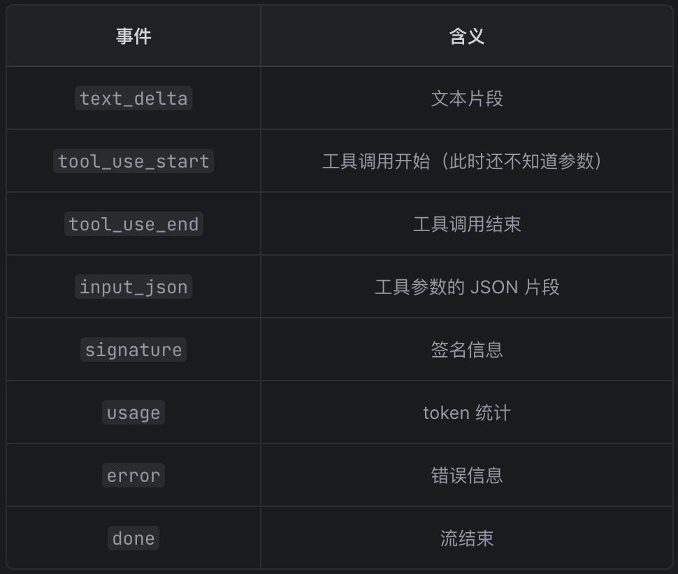
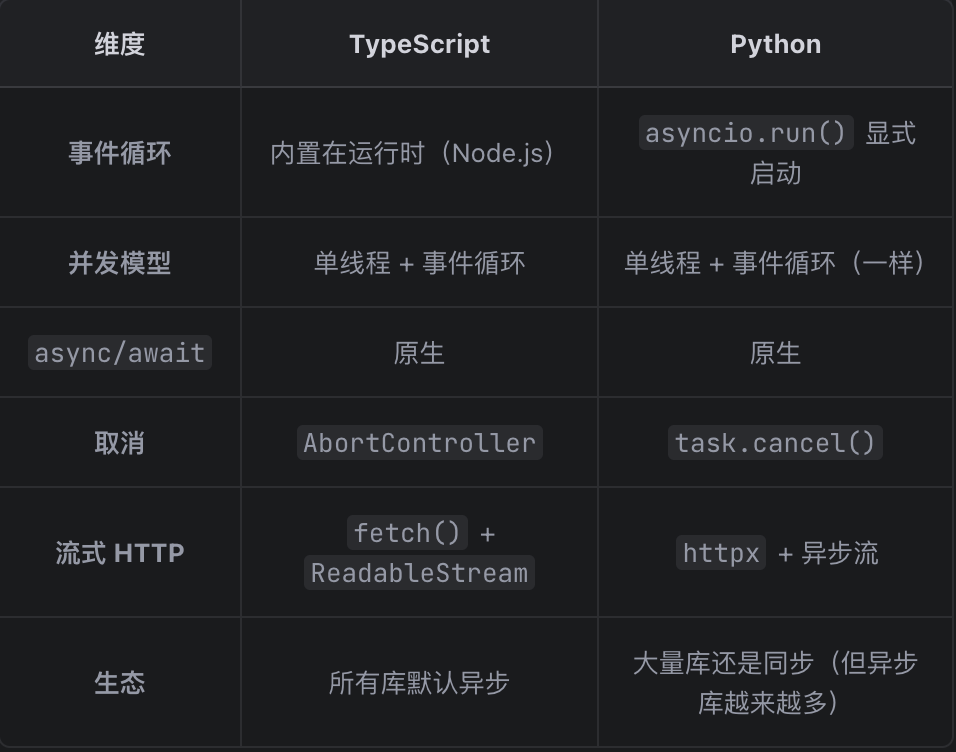
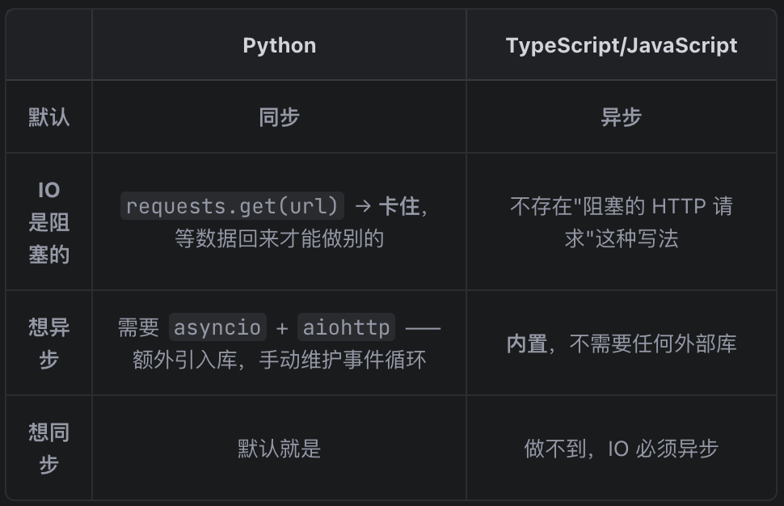
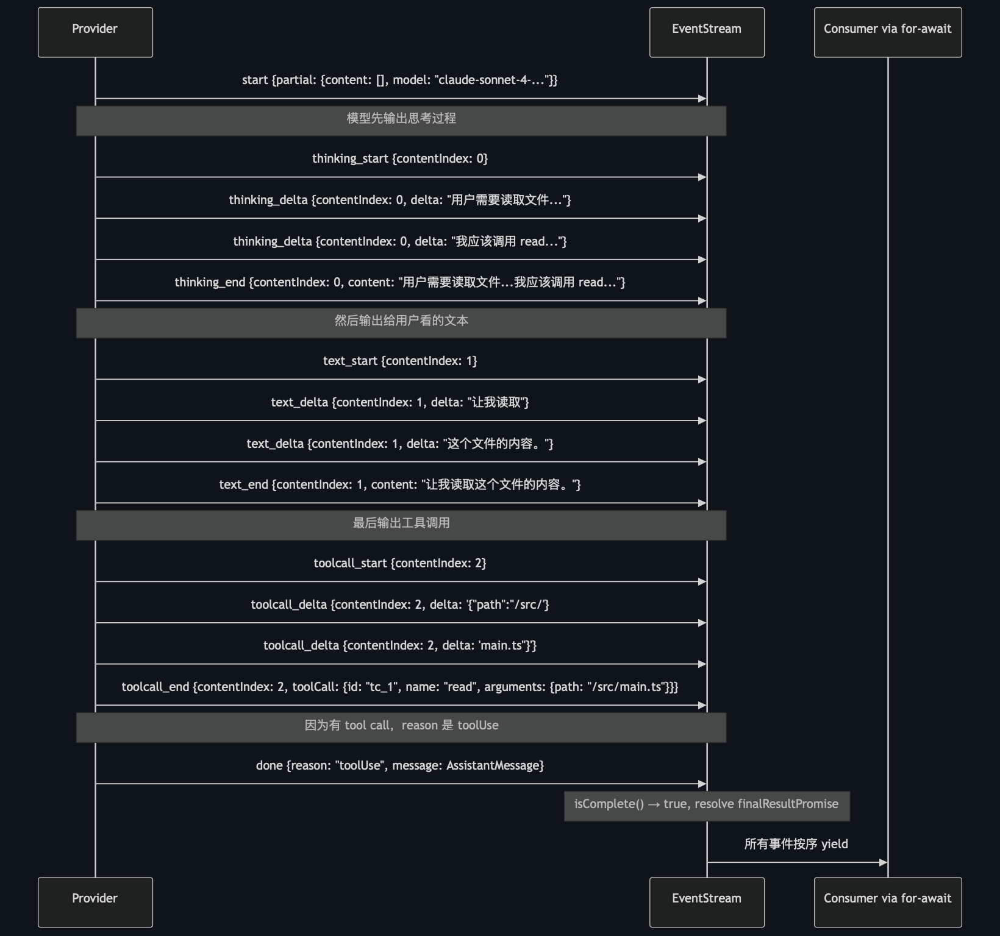
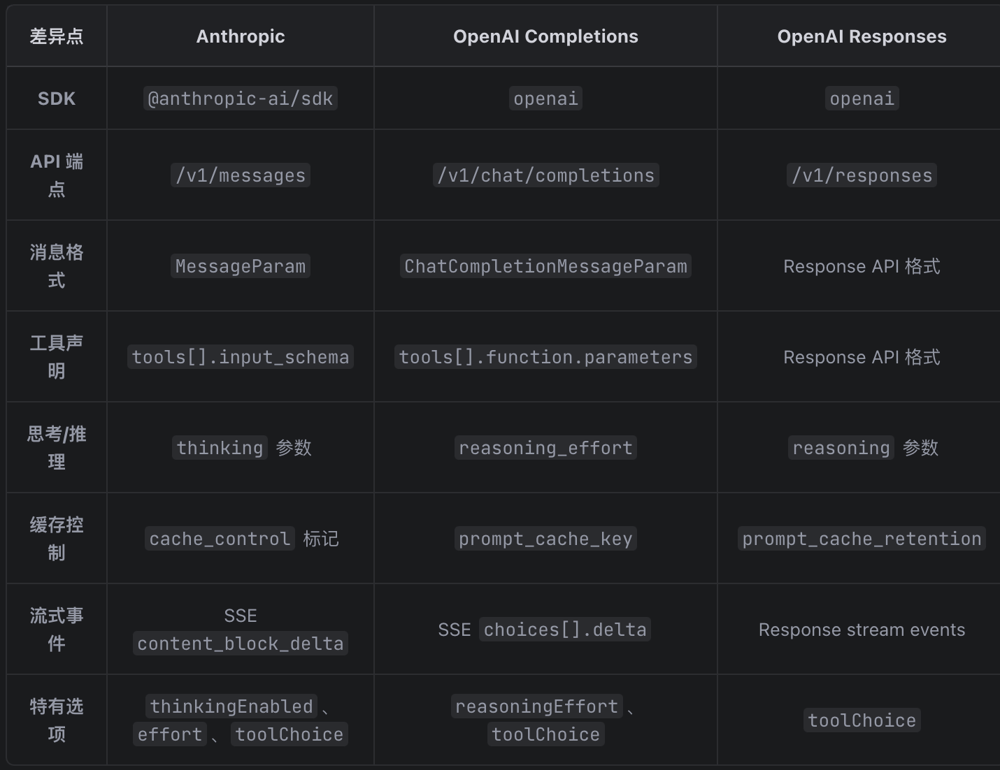
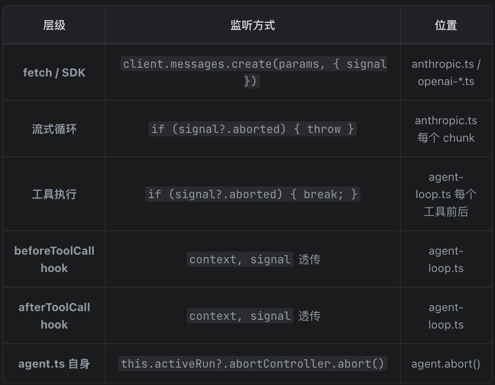

# Agent 流式机制（for loop 同步/EventStream 异步）

## 三层抽象

```
第三层：自己的 EventStream / 事件总线    ← pi-agent, Claude Code
        ↑ 在 SDK 之上再加一层事件分发
第二层：OpenAI / Anthropic SDK 的流式    ← 大多数项目
        ↑ SDK 封装了 HTTP、SSE 解析、重试
第一层：裸 HTTP 流式                     ← 少数项目（追求极致控制）
        ↑ fetch() + ReadableStream / httpx 裸调
```

每个 SDK 内部都是 fetch() + ReadableStream （或 Node.js 的 http 模块），但 SDK 帮你处理了：

- 请求格式化（不同 API 的 body 结构不同）
- SSE 解析（Server-Sent Events 的逐行解析）
- 错误重试
- 认证头


Pi 在 SDK 之上做的"脏活"是：

- 把所有 SDK 不同的流格式统一成 AssistantMessageEventStream
- 统一的 abort 信号传递
- 统一的部分结果保存
- 统一的成本计算
- 统一的 thinking/toolCall 增量解析

### httpx + 异步流 和 fetch() + ReadableStream


这两个概念其实是**同一件事在不同语言里的实现**——就是 HTTP 请求怎么边收边处理，而不是等全部收完再处理。

```python
# llm.py —— 用的是 OpenAI SDK
from openai import OpenAI

stream = self.client.chat.completions.create(**params)
#    ↑ 这个 stream 的底层就是 httpx 的流式 HTTP

for chunk in stream:
    # ↑ SDK 帮我们解析了 SSE 协议
    # 我们直接拿到解析好的 chunk 对象
    if chunk.choices[0].delta.content:
        print(chunk.choices[0].delta.content, end="")
```

#### 1、先理解传统方式（非流式）

做一个 HTTP 请求，拿到完整响应：

```python
# Python — 传统方式（requests 库）
response = requests.post("https://api.openai.com/v1/chat/completions", json=body)
data = response.json()
# ↑ 必须等服务器把整段 JSON 返回完，才能拿到 data
```

```typescript
// TypeScript — 传统方式（fetch）
const response = await fetch("https://api.openai.com/v1/chat/completions", { method: "POST", body });
const data = await response.json();
// ↑ 和 Python 一样，必须等全部数据到达
```

**问题**：LLM 生成"你好世界"要几秒钟，你只能干等，然后突然一次性看到全部文字。

#### 2、流式方式（边收边看）

（1）**TypeScript 的 `fetch()` + `ReadableStream`**

```typescript
// 浏览器/Node.js
const response = await fetch(url, options);
// response.body 是一个 ReadableStream——"可读流"

const reader = response.body.getReader();
// reader —— 你可以"读"这个流

while (true) {
    const { done, value } = await reader.read();
    //        ↑     ↑
    //       是否结束了  本次收到的一小块数据（字节数组）
    if (done) break;
    
    const text = new TextDecoder().decode(value);
    // 把字节转成文字
    process(text);  // 立即处理这一小块
}
```

**`ReadableStream` 是什么**：一个**数据会逐渐到达的管道**。你不需要等全部数据到齐，每次 `await reader.read()` 拿到当前已经到达的一小段，处理完再等下一段。

（2）**Python 的 `httpx` + 异步流**

**`httpx` 是什么**：Python 的一个 HTTP 库，相当于 `requests` 的现代替代品。区别是：

|      | `requests` | `httpx`  |
| ---- | ---------- | -------- |
| 同步 | ✅          | ✅        |
| 异步 | ❌          | ✅        |
| 流式 | 支持但笨重 | 原生支持 |

```python
# 安装 httpx
# pip install httpx
import httpx

# 同步流式
with httpx.Client() as client:
    with client.stream("POST", url, json=body) as response:
        for chunk in response.iter_bytes():
            # chunk —— 一小段字节数据
            process(chunk)
            # ↑ 边收边处理

# 异步流式
async with httpx.AsyncClient() as client:
    async with client.stream("POST", url, json=body) as response:
        async for chunk in response.aiter_bytes():
            process(chunk)
```

`client.stream()` 返回的是一个**流式响应**，`iter_bytes()` / `aiter_bytes()` 就是逐块读取这个"管道"。

#### 3、回到 LLM 调用场景

（1）**TypeScript（fetch + ReadableStream）**

```typescript
const response = await fetch("https://api.deepseek.com/v1/chat/completions", {
    method: "POST",
    body: JSON.stringify({ ...messages, stream: true }),
});

const reader = response.body.getReader();
while (true) {
    const { done, value } = await reader.read();
    if (done) break;
    
    const lines = new TextDecoder().decode(value);
    for (const line of lines.split("\n")) {
        if (line.startsWith("data: ")) {
            const json = JSON.parse(line.slice(6));
            const token = json.choices[0].delta.content;
            if (token) process(token);  // ← 每收到一个 token 就处理
        }
    }
}
```

（2）**Python（httpx）**

```python
import httpx
import json

with httpx.Client() as client:
    with client.stream("POST", "https://api.deepseek.com/v1/chat/completions",
        json={"model": "deepseek-chat", "messages": messages, "stream": True}
    ) as response:
        for line in response.iter_lines():
            if line.startswith("data: "):
                json_data = json.loads(line[6:])
                token = json_data["choices"][0]["delta"].get("content")
                if token:
                    process(token)  # ← 每收到一个 token 就处理
```

#### 4、总结

| 语言       | 发起请求            | 流接口                   | 读数据                   |
| ---------- | ------------------- | ------------------------ | ------------------------ |
| TypeScript | `fetch()`           | `ReadableStream`         | `reader.read()`          |
| Python     | `httpx`             | `response.iter_bytes()`  | `for chunk in ...`       |
| Python     | `httpx.AsyncClient` | `response.aiter_bytes()` | `async for chunk in ...` |

**`ReadableStream`** = JS 里的"流式数据管道"

**`httpx`** = Python 里支持流式 HTTP 的库

**两者关系**：`fetch().body` 返回 `ReadableStream`，`httpx.stream()` 返回 `iter_bytes()`——做的事一模一样，都是让你在数据还没到齐的时候就能开始处理。

## pi-ai 流式架构详解

pi-ai 最重要的一段注释在 `types.ts` 的 `StreamFunction` 类型定义上：

```typescript
// packages/ai/src/types.ts

// Contract:
// - Must return an AssistantMessageEventStream.
// - Once invoked, request/model/runtime failures should be encoded in the
//   returned stream, not thrown.
// - Error termination must produce an AssistantMessage with stopReason
//   "error" or "aborted" and errorMessage, emitted via the stream protocol.
export type StreamFunction<TApi extends Api, TOptions extends StreamOptions> = (
  model: Model<TApi>,
  context: Context,
  options?: TOptions,
) => AssistantMessageEventStream;
```

这三条规则定义了整个系统的错误处理哲学：

**规则 1：必须返回事件流**。不是 Promise，不是回调，是 `AssistantMessageEventStream`。调用者总是拿到一个流对象，然后 `for await` 消费事件。

**规则 2：一旦调用，错误编码进流里**。`StreamFunction` 本身不抛异常。网络超时、API 限流、模型不存在 — 所有失败都通过流中的事件传递。这意味着调用者不需要 try-catch。

**规则 3：错误终止必须产出完整的 `AssistantMessage`**。即使请求失败了，流也必须产出一个带 `stopReason: "error"` 和 `errorMessage` 的 `AssistantMessage`。调用者总是可以调 `stream.result()` 拿到一个消息对象 — 成功的或失败的。

### Pi 为什么选 EventStream

pi-agent 选择 EventStream（事件总线）而不是简单的 for-loop，本质上是因为规模不同导致的需求差异 。

#### 核心原因：事件类型数量和消费者数量

一般的 agent 只处理两种事件—— content （文本）和 tool_call （工具调用），只有一个消费者——终端打印，通过回调阻塞执行：

```python
LLM.chat() → on_token 回调 → print(token)
```

```python
# 同步，一个做完再做下一个
for chunk in stream:                    # ← 边收边处理
    if delta.content:
        on_token(delta.content)         # ← 回调里打印，阻塞
    if delta.tool_calls:
        tc_map[idx]["args"] += ...      # ← 累积，等流结束才执行工具
```

等流结束，agent.chat() 才拿到 LLMResponse，然后再串行执行工具：

```
agent.chat()
  ├── for chunk in stream: ...          ← 收完全部 chunk
  ├── for tc in resp.tool_calls:
  │     result = tool.execute(...)      ← 串行执行每个工具
  │     messages.append(result)
  └── llm.chat(messages)               ← 把结果喂回去，下一轮
```

pi-agent 的事件类型多得多：



不同消费者对不同事件感兴趣：

- UI 层：关注 text_delta （渲染文字）和 tool_use_start （显示"正在执行..."）
- 日志：所有事件都想记录
- 工具执行器：只关心 tool_use_start/end
  EventStream 天然支持按事件类型过滤订阅。

```
LLM API 流式响应
    │
    ▼
EventStream（事件总线）
    │
    ├── text_delta → UI 渲染层（实时打印文字）
    ├── tool_use   → StreamingToolExecutor
    │                   ├── 启动工具执行
    │                   ├── 工具结果 → 插回对话流
    │                   └── 重新请求 LLM（继续下一轮）
    ├── usage      → Token 计数器
    ├── error      → 错误处理
    └── done       → 结束
```

用 for-loop + 回调，一个回调里塞这么多逻辑会变成：

```python
def on_token(token):
    ui.render(token)           # 渲染
    stats.count(token)         # 统计
    logger.log(token)          # 日志
    # 万一某个崩了就全崩了...
```

EventStream 让每个消费者独立注册、独立消费，一个崩了不影响别的。

```typescript
// 伪代码——Claude Code 的异步架构
const stream = new EventStream(response);

// 三个消费者并行运行，互不等待
await Promise.all([
    ui.render(stream),            // UI 渲染
    tool_executor.run(stream),    // 工具执行器
    logger.record(stream),        // 日志记录
]);
```

> 最关键的差异：**工具执行的时机**
>
> Claude Code/Pi 可以在 LLM 还在流式输出的时候就开始执行工具 。比如 LLM 先返回了 tool_use （参数是写文件的请求），Claude Code 可以在 LLM 继续输出文本的同时， 并行执行写文件操作 。
>
> 一般的 Agent 必须等 LLM 流式响应完全结束，拿到完整的 LLMResponse 之后，才能开始执行工具。这也是为什么架构更简单——同步模型天然不需要处理"工具还没执行完，LLM 下一轮的文本又来了"这种并发问题。

#### 解耦 + 可测试性

```python
# 一般的 Agent 的做法——紧耦合
stream = client.chat(...)
for chunk in stream:
    if chunk.content:
        on_token(chunk.content)    # ← 处理和消费绑死在一起

# pi-agent 的做法——松耦合
stream = EventStream(client.chat(...))
# 任何地方都可以独立消费：
asyncio.create_task(ui.render(stream))       # UI
asyncio.create_task(logger.record(stream))    # 日志
asyncio.create_task(tool_executor.listen(stream))  # 工具
```

测试时，没有 LLM 也能测试：

```python
# 伪造事件流测试 UI 层
fake_stream = EventStream()
fake_stream.push("text_delta", "hello")
fake_stream.push("tool_use_start", {...})
fake_stream.push("done")

await ui.render(fake_stream)
# 断言 UI 正确渲染了 "hello" 和工具调用指示
```

#### TS 天生异步



1、**TypeScript/JavaScript 是"单线程，但不能阻塞"**

所有 JS/TS 代码跑在一个线程上（事件循环），但它的设计规则是：任何可能耗时的操作都不能阻塞线程，必须用异步。这是由 JavaScript 的出身决定的——它诞生于浏览器。

2、**关键区别：强制 vs 可选**



Python 里异步是可选的 —— 你的代码可以全都是同步的，只有需要高并发时才引入 asyncio。

JavaScript 里异步是强制的 —— 标准库的 fetch() 、文件读写、数据库查询、定时器……全都是异步的。你不是"要不要用异步"的问题，而是"怎么处理异步"的问题。

### 整体架构与数据流图

pi-ai 的流式架构由三个核心组件组成：

```
用户调用
   |
   v
+------------------+      +--------------------------+      +---------------------+
| stream() 入口    | ---> | EventStream 事件流引擎   | <--- | Provider 实现        |
| (路由层)         |      | (生产者-消费者队列)      |      | (OpenAI/Anthropic等) |
|                  |      |                          |      |                     |
| 根据模型类型     |      | - 接收 push 的事件       |      | - 发起 HTTP 请求     |
| 选择对应的       |      | - 暴露给消费者的迭代器   |      | - 解析 SSE 流        |
| provider 流函数    |      | - 终结时解析 Promise     |      | - 处理 abort 信号    |
+------------------+      +--------------------------+      +---------------------+
```

完整数据流图：

```
你的代码                                pi-ai 内部
  |
  | const controller = new AbortController();
  | const s = stream(model, context, { signal: controller.signal });
  | ---------------------------------------------------->
  |                                                     |
  |                           +--- stream.ts 入口 ------+
  |                           | 查注册表，找到 provider  |
  |                           +---+--------------------+
  |                               |
  |                     +---------v--------------------+
  |                     | provider.stream() 被调用      |
  |                     |                              |
  |                     | 1. new AssistantMessageEventStream()  创建事件流
  |                     | 2. (async () => { ... })()   启动后台异步任务
  |                     | 3. output = { content: [] }  创建空的"工作区"
  |                     | 4. await client.responses.create(...)      发起网络请求
  |                     +---------+--------------------+
  |                               |
  |                               v   for await 循环开始
  |                     +--------------------------+
  |                     | 收到 chunk "你好"        |
  |                     | output.content += "你好" |
  |                     | stream.push(text_delta)  |
  |                     +----------+---------------+
  |                                |
  | for await (event of s) {       |
  | <------- text_delta "你好" ----+  （实时到达你的代码）
  | }                              |
  |                                |
  |                     +----------v---------------+
  |                     | 收到 chunk "世界"        |
  |                     | output.content += "世界" |
  |                     | stream.push(text_delta)  |
  |                     +----------+---------------+
  |                                |
  | <------- text_delta "世界" ----+
  |                                |
  |   ---- 2 秒后 controller.abort() ----
  |                                |
  |                     +----------v---------------+
  |                     | HTTP 连接断开            |
  |                     | for await 抛出异常       |
  |                     +----------+---------------+
  |                                |
  |                     +----------v---------------+
  |                     | catch 块:                |
  |                     | output = {               |
  |                     |   content: [             |
  |                     |     {text:"你好世界"}    |
  |                     |   ],                     |
  |                     |   stopReason: "aborted"  |
  |                     | }                        |
  |                     | stream.push({            |
  |                     |   type: "error",         |
  |                     |   error: output          |
  |                     | })                       |
  |                     | stream.end()             |
  |                     +----------+---------------+
  |                                |
  | for await 循环退出             |
  |                                |
  | const result = await s.result();  拿到带部分内容的最终结果
  | result.content === [{text: "你好世界"}]
```

整个流程用一句话概括：

> **在后台异步任务中，用一个 `output` 对象不断原地修改，通过 `stream.push()` 实时把增量事件推给消费者。成功时 push `done`，失败/中止时 push `error`（`error` 里携带了含有部分内容的 `output`）。**

| 特性            | 解决什么问题                             | 类比                                           |
| --------------- | ---------------------------------------- | ---------------------------------------------- |
| Abort           | 用户不想等了时，能立即停止请求，释放资源 | 看视频时按暂停，服务器停止发送后续数据         |
| Partial Results | 请求被取消后，已生成的内容不会丢失       | 写文档写到一半停电了，下次开机还能恢复         |
| Signal 透传     | 无论请求走到哪一步都能取消               | 不只是能暂停视频播放，还能在下载过程中随时取消 |

---

### 1 stream() 入口函数

```typescript
// packages/ai/src/stream.ts
export function stream<TApi extends Api>(
  model: Model<TApi>,           // 模型信息（包含 api 类型、baseUrl 等）
  context: Context,              // 对话上下文（系统提示、消息列表、工具列表）
  options?: ProviderStreamOptions // 可选参数（含 apiKey、signal、temperature 等）
): AssistantMessageEventStream { // 返回一个事件流对象

  // 根据 model.api（如 "openai-completions"）从注册表找到对应的 provider
  const provider = resolveApiProvider(model.api);

  // 调用该 provider 的 stream 函数，返回事件流
  return provider.stream(model, context, options as StreamOptions);
}
```

---

### 2 AssistantMessageEventStream 事件流引擎

这是整个架构最精巧的部分。我会从最简单的概念开始，一步步带你理解它。

#### 2.1 它要解决什么问题？

想象一个场景：你在跟 ChatGPT 对话，它的回答不是一次给完，而是像打字一样一个字一个字蹦出来。

这就是**流式（streaming）**：数据不是一次性到齐，而是陆续到达。

这就带来一个问题——**生产者**（网络请求陆续返回数据）和**消费者**（你的代码处理数据）的速度不一样：
- 网络可能一次给你三个字，也可能一次给一个字
- 你的处理代码可能很慢（比如要渲染到页面），跟不上到达速度
- 或者你的代码处理很快，但网络数据还没到

怎么协调？需要一个"中间人"在两者之间缓冲。

#### 2.2 从最简单的例子开始理解

我们先忘掉 TypeScript 语法，用最简单的伪代码理解这个思路。

**场景 1：同步队列（最简单的情况）**

想象一个快递柜：
- 快递员（生产者）把包裹放进柜子
- 你（消费者）去柜子里取包裹

```javascript
// 最简单的队列：一个数组
const queue = [];

// 快递员放包裹
queue.push("包裹A");
queue.push("包裹B");

// 你去取包裹
const item = queue.shift();  // "包裹A"
const item2 = queue.shift(); // "包裹B"
```

这个很简单，但有一个问题：如果你去取的时候柜子是空的，你会拿到 `undefined`，然后程序就乱了。

**场景 2：快递柜空了怎么办？**

理想的体验是：柜子空了，你就**等一会儿**，等快递员放了新包裹，再通知你来取。

在 JavaScript 里，"等一会儿"用 `Promise` 来实现：

```javascript
// Promise 就像一个"暂存盒"，你把东西放进去，
// 有人在另一端等着取。放进去的那一刻，等着的人就被唤醒。

function waitForItem(queue) {
  if (queue.length > 0) {
    // 有现成的 → 直接返回
    return Promise.resolve(queue.shift()); // 从数组里取出第一个元素，然后用一个"立刻完成的 Promise"包装一下返回。
  } else {
    // 没有 → 返回一个 Promise，等有人 push 的时候再解析
    return new Promise((resolve) => {
      // 把 resolve 函数存起来，等生产者 push 时调用它
      waitingCallbacks.push(resolve);
    });
  }
}

// 当快递员放包裹时
function push(item) {
  if (waitingCallbacks.length > 0) {
    // 有人在等 → 直接把包裹给他（唤醒那个 Promise）
    const callback = waitingCallbacks.shift();
    callback(item);
  } else {
    // 没人等 → 放入柜子
    queue.push(item);
  }
}
```

#### 2.3 `EventStream.ts` 的真实代码

理解了上面的思路后，现在看真实代码。它本质上就是上面那个"快递柜"的 TypeScript 版本。

##### 第一部分：两个队列

```typescript
export class EventStream<T, R = T> implements AsyncIterable<T> {
  // ---- 队列 1：存数据 ----
  // 存放已 push 但还没被消费者取走的事件
  // （相当于快递柜里还没被取走的包裹）
  private queue: T[] = [];

  // ---- 队列 2：存等待者 ----
  // 存放正在等数据的消费者的"唤醒函数"
  // （相当于在快递柜前排队等着取件的人）
  // 里面的每个元素都是一个函数，这个函数接收一个 IteratorResult<T> 参数（JavaScript 迭代器协议里规定的格式 { value: 值, done: 是否结束 }），返回 void —— 这正好就是 Promise 的 resolve 函数的类型。
  private waiting: ((value: IteratorResult<T>) => void)[] = [];

  // 流是否已结束
  private done = false;
}
```

- T — 流中每个事件的类型。 push(event: T) 写入的、 for await (const event of stream) 读出的都是 T 。
- R — 流的最终结果类型，默认等于 T 。 result(): Promise<R> 返回的类型。

为什么需要两个队列？因为生产者和消费者不一定同时在线：
- 如果生产者先到（数据来了但消费者还没开始读）→ 数据存入 `queue`
- 如果消费者先到（想读但数据还没来）→ 消费者的"唤醒函数"存入 `waiting`
- 两个队列互为镜像：一个存数据等消费，一个存消费者等数据

##### 第二部分：push() — 生产者往里塞数据

```typescript
push(event: T): void {
  // 如果流已经结束，不再接收新事件
  if (this.done) return;

  // 如果有消费者在等（waiting 队列非空）
  const waiter = this.waiting.shift();  // 取出第一个等待者
  if (waiter) {
    // 直接把事件交给它（唤醒那个等待中的 Promise）
    waiter({ value: event, done: false });
  } else {
    // 没人等 → 放入缓冲区排队
    this.queue.push(event);
  }
}
```

##### 第三部分：for await — 消费者从里取数据

```typescript
// 这个特殊的方法名 [Symbol.asyncIterator] 是 JavaScript 的约定：
// 实现了它，就能用 for await...of 语法遍历 EventStream 对象
async *[Symbol.asyncIterator](): AsyncIterator<T> {
  while (true) {
    if (this.queue.length > 0) {
      // 情况 1：缓冲区有数据 → 直接取走并返回给消费者
      // yield 是"产出一个值然后暂停"的意思（详见前置知识）
      yield this.queue.shift()!;

    } else if (this.done) {
      // 情况 2：缓冲区空了，且流已结束 → 退出循环
      // return 在生成器函数里意味着"遍历结束"
      return;

    } else {
      // 情况 3：缓冲区空了，但流还没结束 → 需要等待
      // await 一个新的 Promise，它的 resolve 函数会被存入 waiting 队列
      // 这个 Promise 会一直处于 pending 状态，因为 resolve 没有被执行
      // 直到生产者后来 push() 数据时，会调用这个 resolve，唤醒这里的 await，所以 result 就是 { value: event, done: }
      const result = await new Promise<IteratorResult<T>>(
        (resolve) => this.waiting.push(resolve)
      );
      if (result.done) return;  // 如果是"结束信号"，退出循环
      yield result.value;       // 否则把值 yield 给消费者
    }
  }
}
```

| 特性                     | 说明                                                         |
| ------------------------ | ------------------------------------------------------------ |
| await 的本质             | 等待一个 Thenable 对象，并获取其 fulfillment value           |
| Promise<T> 的 T          | 声明了这个 fulfillment value 的类型                          |
| await promise 的结果类型 | 就是 T（由 TypeScript 从 Promise<T> 中提取，运行时由 `resolve` 把值塞给 Promise 的函数） |
| 普通泛型类               | 不支持 await，除非它们实现了 then 方法                       |

所以，“await 自动提取泛型参数”是 Promise + await 组合的特权，而不是泛型类的通用行为。其他泛型类要想获得类似效果，必须自己实现 Thenable 接口。

一句话总结：**await + Promise + resolve 三者配合，实现了"没数据就等，有数据就继续"的效果。**

#### 2.4 finalResultPromise — "流结束后你能拿到什么"

除了逐个事件的实时消费，消费者还想在流结束后拿到一个"完整结果"。
这个功能通过 `finalResultPromise` 实现。

```typescript
export class EventStream<T, R = T> implements AsyncIterable<T> {
  // ... 前面的 queue、waiting、done ...

  // 这是一个 Promise，代表"流结束后最终结果"
  private finalResultPromise: Promise<R>;

  // 这是 finalResultPromise 的"开关"——调用它就能让 Promise 完成
  private resolveFinalResult!: (result: R) => void;

  constructor(isComplete: (event: T) => boolean, extractResult: (event: T) => R) {
    // isComplete: 判断一个事件是否是"终结事件"（done 或 error）
    // extractResult: 从终结事件中提取最终结果
    this.isComplete = isComplete;
    this.extractResult = extractResult;

    // 创建 Promise 时，立即拿到它的 resolve 函数，存起来备用
    // 注意：此时 Promise 处于"pending"（等待中）状态
    // 直到后面 push() 收到终结事件，调用 resolveFinalResult，它才会完成
    this.finalResultPromise = new Promise((resolve) => {
      this.resolveFinalResult = resolve; 
    });
  }
}
```

constructor 是 new EventStream() 时自动调用的，作用就是初始化 EventStream 的状态 ：

- 存好两个判断函数（ isComplete 和 extractResult ），它们的具体实现由子类 AssistantMessageEventStream 提供
- 创建 finalResultPromise 并把 resolve 存起来
- 初始化空的 queue 、 waiting 、 done = false

**`new Promise((resolve) => { this.resolveResult = resolve })` 是什么意思？**

这是 JavaScript Promise 的一个常见模式，叫做"外部化 resolve"：

```javascript
// 通常我们这样用 Promise（resolve 在内部调用）：
const promise = new Promise((resolve) => {
  // 做一些异步操作...
  setTimeout(() => resolve("完成"), 1000);
});
const value = await promise; // 1 秒后得到 "完成"

// 但有时我们需要在外部（比如另一个函数里）决定何时 resolve：
let externalResolve;
const promise = new Promise((resolve) => {
  externalResolve = resolve;  // 把 resolve 存到外部变量
});
// ... 过了很久 ...
externalResolve("完成");  // 在另一个地方手动触发
const value = await promise; // 得到 "完成"

// EventStream 就是用了这种模式：
// - constructor 里创建 Promise，把 resolve 存到 this.resolveFinalResult
// - push() 里收到终结事件时调用 this.resolveFinalResult(结果)
// - 消费者用 await stream.result() 等待，直到 resolve 被调用
```

#### 2.5 `push()` 完整版 — 加上终结事件处理

现在你理解了 `finalResultPromise`，来看完整的 `push()`：

```typescript
push(event: T): void {
  if (this.done) return;

  // --- 新增部分：检查是否是终结事件 ---
  // isComplete 是构造时传入的函数，判断 event 是否是 done 或 error
  if (this.isComplete(event)) {
    this.done = true;

    // extractResult 是构造时传入的函数，从事件中取出最终结果
    // 对于 done 事件 → 取出 event.message（完整的 AssistantMessage）
    // 对于 error 事件 → 取出 event.error（含部分内容的 AssistantMessage）
    //
    // this.resolveFinalResult(结果) 调用后：
    //   - finalResultPromise 从 "pending" 变为 "fulfilled"
    //   - 所有 await stream.result() 的代码被唤醒，拿到这个结果
    this.resolveFinalResult(this.extractResult(event));
  }
  // --- 新增部分结束 ---

  // 和之前一样：有消费者在等就直接给，没有就入队
  const waiter = this.waiting.shift();
  if (waiter) {
    waiter({ value: event, done: false });
  } else {
    this.queue.push(event);
  }
}
```

**用一句话说清楚 `this.resolveFinalResult(this.extractResult(event))` 在干什么**：

> 从终结事件（done/error）中提取最终结果，然后触发 finalResultPromise，让所有 `await stream.result()` 的代码拿到这个结果。

#### 2.6 `result()` — 消费者获取最终结果

```typescript
result(): Promise<R> {
  return this.finalResultPromise;
}
```

消费者有两种方式拿到数据：

```typescript
const s = stream(model, context);

// 方式 1：用 for await 逐个处理事件（实时流式）
// 每收到一个事件就立即处理，适合需要实时显示的场景
for await (const event of s) {
  if (event.type === "text_delta") {
    process.stdout.write(event.delta);  // 一个字一个字打出来
  }
}

// 方式 2：等流结束后获取完整结果
// 不管流怎么结束（正常/出错/中止），都能拿到最终结果
const finalMessage = await s.result();
// finalMessage 是完整的 AssistantMessage 对象
// 如果是中止，finalMessage.stopReason === "aborted"
// 如果是正常结束，finalMessage.stopReason === "stop"
```

#### 2.7 `end()` — 主动结束事件流

`push()` 是被动结束：收到终结事件（done/error）时自动关闭。而 `end()` 是**主动结束**：生产者明确告诉消费者"没有后续事件了"。

```typescript
end(result?: R): void {
  this.done = true;
  if (result !== undefined) {
    this.resolveFinalResult(result);
  }
  while (this.waiting.length > 0) {
    const waiter = this.waiting.shift()!;
    waiter({ value: undefined as any, done: true });
  }
}
```

**谁调用 `end()`？**

- provider 在正常完成或异常兜底后调用
- `register-builtins.ts` 的 `forwardStream()` 在转发完所有 inner 事件后调用

**逐步拆解：**

**第 1 步：`this.done = true`**

标记流已关闭。之后所有 `push()` 调用会被忽略（`push()` 开头检查 `if (this.done) return`）。

**第 2 步：`if (result !== undefined) this.resolveFinalResult(result)`**

如果调用方显式传入了 `result`，就用它来兑现 `finalResultPromise`。

什么时候需要传？看 `forwardStream()` 的例子：

```typescript
// forwardStream 转发完所有 inner 事件后：
target.end();  // 不传 result

// 为什么？因为 inner 的终结事件（done/error）已经被 forwardStream
// 通过 push() 转发到 target 了。push() 遇到终结事件时会自动调用
// resolveFinalResult(extractResult(event))。
// 所以 end() 不需要再传 result，否则会重复 resolve（虽然不会报错，
// 但第二次 resolve 会被忽略）。

// 什么时候需要传？当流被主动关闭、但没有经过正常的 done/error 事件路径时。
// 例如某些异常兜底场景，需要直接给出一个结果。
```

**第 3 步：唤醒所有挂起的消费者**

```typescript
while (this.waiting.length > 0) {
  const waiter = this.waiting.shift()!;
  waiter({ value: undefined as any, done: true });
}
```

还记得 `[Symbol.asyncIterator]()` 里的逻辑吗？消费者读不到数据时会挂起：

```typescript
// 消费者在 for await 循环里等待
const result = await new Promise<IteratorResult<T>>((resolve) => this.waiting.push(resolve));
if (result.done) return;  // done=true → 退出 for await 循环
```

`end()` 里的 while 循环就是在遍历所有挂起的消费者，给每个发一个 `{ done: true }`。
如果不做这一步，这些消费者会永远卡在 `await` 上，`for await` 循环永远不会退出。

**`as any` 的原因：**

TypeScript 的 `IteratorResult<T>` 类型在 `done: true` 时要求 `value` 仍是 `T` 类型，
但流结束时没有实际值可给。`as any` 绕过这个类型检查，运行时 `undefined` 是完全合法的。

**`end()` vs `push()` 终结事件的区别：**

```
push() 收到 done/error 事件：
  ├── isComplete(event) === true
  ├── done = true
  ├── resolveFinalResult(extractResult(event))  ← 从事件中提取结果
  └── 终结事件本身也会进入 queue 或交给 waiter  ← 消费者能收到这个事件

end(result?) 被调用：
  ├── done = true
  ├── resolveFinalResult(result)  ← 只在显式传入时兑现
  └── 给所有 waiter 发 { done: true }  ← 消费者收到的是结束信号，不是事件
```

简单说：`push()` 是"最后一个事件触发结束"，`end()` 是"生产者主动关门"。

#### 2.8 `AssistantMessageEventStream` 子类

理解了 `EventStream<T, R>` 基类后，子类就很简单了：

```typescript
export class AssistantMessageEventStream extends EventStream<
  AssistantMessageEvent,  // T：每个事件的类型
  AssistantMessage        // R：最终结果的类型
> {
  constructor() {
    super(
      // isComplete：什么事件算"终结"？
      // 只有 "done" 和 "error" 类型的事件才算终结
      (event) => event.type === "done" || event.type === "error",

      // extractResult：从终结事件中取出什么作为最终结果？
      // done 事件 → 取 event.message
      // error 事件 → 取 event.error
      (event) => {
        if (event.type === "done") {
          return event.message;    // 正常结束 → 返回完整 AssistantMessage
        } else if (event.type === "error") {
          return event.error;      // 异常结束 → 返回含部分内容的 AssistantMessage
        }
        throw new Error("Unexpected event type for final result");
      },
    );
  }
}
```

它只是告诉基类：
- **什么时候算结束**：收到 `done` 或 `error` 事件
- **结束时返回什么**：事件里的 `message` 或 `error` 字段（都是 `AssistantMessage` 对象）

#### 2.8 事件协议 `AssistantMessageEvent`

每个从流里出来的事件都是以下类型之一：

```typescript
// packages/ai/src/types.ts
export type AssistantMessageEvent =
  // 流开始（附带初始的空 AssistantMessage）
  | { type: "start"; partial: AssistantMessage }
```

```typescript
  // 文本块开始/增量/结束
  | { type: "text_start"; contentIndex: number; partial: AssistantMessage }
  | { type: "text_delta"; contentIndex: number; delta: string; partial: AssistantMessage }
  | { type: "text_end"; contentIndex: number; content: string; partial: AssistantMessage }
```

* **`text_start`** — 一段文本内容开始。`contentIndex` 指向 `AssistantMessage.content` 数组中的位置。
* **`text_delta`** — 文本增量。`delta` 是新增的文本片段（通常是一个或几个 token）。这是流式渲染的核心事件 — TUI 收到 `text_delta` 后立即追加显示。
* **`text_end`** — 一段文本结束。`content` 是这段文本的完整内容（所有 delta 的拼接结果）。消费者可以用它来做最终校验，而不需要自己累积 delta。

```typescript
  // 思考块开始/增量/结束（模型的推理过程）
  | { type: "thinking_start"; contentIndex: number; partial: AssistantMessage }
  | { type: "thinking_delta"; contentIndex: number; delta: string; partial: AssistantMessage }
  | { type: "thinking_end"; contentIndex: number; content: string; partial: AssistantMessage }
```

* **`thinking_start/delta/end`** — 与文本事件结构完全相同，但语义不同。这些事件对应模型的 extended thinking 输出（如 Claude 的 thinking blocks）。消费者可以选择性地显示或隐藏 thinking 内容。版本演化说明：这组事件是后来添加的，最初的设计只有 text 和 toolcall。

```typescript
  // 工具调用块开始/增量/结束
  | { type: "toolcall_start"; contentIndex: number; partial: AssistantMessage }
  | { type: "toolcall_delta"; contentIndex: number; delta: string; partial: AssistantMessage }
  | { type: "toolcall_end"; contentIndex: number; toolCall: ToolCall; partial: AssistantMessage }
```

* **`toolcall_start`** — 模型开始生成一个 tool call。此时工具名称可能已经确定，但参数还在流式生成中。
* **`toolcall_delta`** — 工具调用参数的增量。`delta` 是 JSON 参数字符串的一部分。与 text_delta 不同，tool call 的 delta 通常是不可直接渲染的 JSON 片段。
* **`toolcall_end`** — 工具调用完成。`toolCall` 字段携带完整的 `ToolCall` 对象，包含 `id`、`name`、`arguments`。这是循环引擎真正需要的事件 — 拿到完整的 tool call 后，引擎可以开始执行工具。

```typescript
  // 正常结束
  | { type: "done"; reason: "stop" | "length" | "toolUse"; message: AssistantMessage }
  // 异常结束（含中止）
  | { type: "error"; reason: "aborted" | "error"; error: AssistantMessage };
```

终止事件是整个事件协议中最关键的部分。它分为两种：

**`done`** — 正常终止。`reason` 告诉消费者**为什么**流结束了：

- `"stop"` — 模型自然结束输出。最常见的情况，表示模型认为回答已经完整。
- `"length"` — 达到 max tokens 限制，输出被截断。这不是错误，但消费者应该知道回答可能不完整。
- `"toolUse"` — 模型决定调用工具。注意这里是 `"toolUse"` 而不是 `"tool_use"` — pi 使用驼峰命名作为内部统一值，而不是照搬某个具体 provider 的命名。

**`error`** — 错误终止。`reason` 区分两种错误：

- `"error"` — 请求失败。网络超时、API 限流、模型返回错误响应等。
- `"aborted"` — 用户主动中止。通常是 AbortSignal 触发的取消操作。

两种终止事件都携带完整的 `AssistantMessage` 对象（`done.message` 和 `error.error`）。注意类型定义使用了 TypeScript 的 `Extract` 工具类型来约束 reason 的可选值 — `done` 只能携带 `"stop" | "length" | "toolUse"`，`error` 只能携带 `"error" | "aborted"`。这是编译时保证，不是运行时检查。

##### `contentIndex` 和 `partial` 的设计意图

每个中间事件（除了 `start`、`done`、`error`）都携带两个公共字段：

- **`contentIndex: number`** — 指向 `AssistantMessage.content` 数组中的位置。一次 LLM 响应可能包含多个内容块（先 thinking，再 text，再 tool call），`contentIndex` 标识当前事件属于哪个块。
- **`partial: AssistantMessage`** — **到当前事件为止的完整 AssistantMessage 快照**。这个 partial 对象随着事件推进不断更新。消费者不需要自己维护状态，这意味着消费者随时都能拿到"到目前为止已收到的全部内容"。

#### 2.9 最终结果类型 `AssistantMessage`

无论流式消费还是一次性消费，最终拿到的都是 `types.ts` 中的 `AssistantMessage`。

#### 2.9 EventStream 完整生命周期图

```
创建 EventStream
  ├── 创建 empty queue []
  ├── 创建 empty waiting []
  ├── 创建 finalResultPromise（pending 状态）
  │     └── 把 resolve 存到 this.resolveFinalResult
  │
  │  -- 生产者和消费者开始工作 --
  │
  ├── 生产者 push("start")  → queue: ["start"] 或直接给 waiting 消费者
  ├── 生产者 push("text_delta:你")  → 同上
  ├── 生产者 push("text_delta:好")  → 同上
  │
  ├── 消费者 for await 取出 "start"
  ├── 消费者 for await 取出 "text_delta:你"
  ├── 消费者 for await 取出 "text_delta:好"
  │
  ├── 生产者 push("done")  ← 终结事件！
  │     ├── this.done = true
  │     ├── this.resolveFinalResult(event.message)  ← finalResultPromise 被 resolve
  │     └── 把 "done" 事件也推给消费者（让消费者知道流结束了）
  │
  ├── 消费者 for await 取出 "done" → 循环结束
  ├── 消费者 await s.result() → 立即返回 event.message（因为 Promise 已完成）
  │
  └── 生命周期结束
```



关键观察：

1. **`contentIndex` 递增**：thinking 是 0，text 是 1，toolcall 是 2。这个数字对应最终 `AssistantMessage.content` 数组的下标。
2. **每个内容块都有完整的 start/delta/end 周期**。消费者可以用 `_start` 和 `_end` 作为状态机的转换边界。
3. **`done` 的 reason 是 `"toolUse"`**，不是 `"stop"`。因为模型输出了 tool call，循环引擎收到这个 reason 后知道需要执行工具并继续循环。
4. **每个中间事件都携带 `partial`**。如果消费者在收到第二个 `text_delta` 后崩溃了，重启后只需要看最后一个 `partial` 就知道完整状态。

对比另一个场景 — 纯文本回答（没有 tool call）：

事件序列会简单得多：`start` → `text_start` → 多个 `text_delta` → `text_end` → `done {reason: "stop"}`。没有 thinking（如果模型不支持或未启用 extended thinking），没有 tool call，`contentIndex` 始终为 0。

再对比一个错误场景 — API 限流：

`start` → `error {reason: "error", error: AssistantMessage{stopReason: "error", errorMessage: "Rate limited: retry after 30s"}}`。流可能只有两个事件就结束了。但消费者的处理逻辑不需要特殊化 — `for await` 正常迭代，`stream.result()` 正常返回一个 `AssistantMessage`，只是 `stopReason` 是 `"error"`。

---

### 3 API 协议的具体 provider 实现 — 如何处理流式请求

这些 provider 文件就是"翻译官"，把 pi-ai 的统一语言翻译成各 SDK 的方言，再把 SDK 的方言翻译回统一语言。

#### 真正发请求的 provider

anthropic.ts — Anthropic Messages API

openai-completions.ts — OpenAI Chat Completions API

openai-responses.ts — OpenAI Responses API

openai-responses-shared.ts — Responses API 共享逻辑

faux.ts — 测试用模拟 provide

#### providers/、utils/ 共享工具

provider 文件之间有大量重复逻辑（消息转换、参数提取、缓存 key 处理等），这些被抽取到共享工具中：

| 文件 | 作用 | 被谁用 |
|---|---|---|
| **transform-messages.ts** | 预处理消息：图片降级为占位文本、思考块跨模型处理、工具调用 ID 归一化（450+ 字符截断）、孤立 ToolCall 自动补合成错误结果、跳过 error/aborted 消息 | 所有 provider 的 `convertMessages()` |
| **simple-options.ts** | `buildBaseOptions()` 把 SimpleStreamOptions 提取为 StreamOptions；`adjustMaxTokensForThinking()` 在总预算内分配 thinking 预算；`clampReasoning()` 把 "xhigh" 降级为 "high" | 所有 provider 的 `streamSimple*()` |
| **openai-prompt-cache.ts** | 把 sessionId 截断到 64 字符（OpenAI API 限制），仅 9 行 | openai-completions + openai-responses |
| **utils/** 下的工具 | `sanitizeSurrogates()` 清理非法 Unicode；`parseStreamingJson()` 增量解析不完整 JSON；`headersToRecord()` Headers 转 Record；`shortHash()` 快速哈希；`validateToolArguments()` 参数校验 + 类型强制转换 | 各 provider + 外部包 |

#### 每个 provider 文件做 6 件事

每个 provider 文件的结构高度一致，差异只在于 SDK 的方言不同。以 openai-completions.ts 为例：

**1、类型转换（统一 → SDK 原生）**

把 pi-ai 的统一类型翻译成各 SDK 要求的格式。这是各 provider 之间**差异最大**的部分。

- `convertMessages()`：统一 Message → SDK 的消息格式（OpenAI 要 `{role, content}`，Anthropic 要 `{role, content}` 但字段语义不同）
- `convertTools()`：统一 Tool → SDK 的工具声明（OpenAI 用 `type: "function"` 嵌套，Anthropic 用 `input_schema`）
- 内部还会调用 `transformMessages()` 做预处理、`sanitizeSurrogates()` 清理非法字符

**2、组装完整 payload（buildParams）**

把转换后的 messages/tools 和其他参数（maxTokens、temperature、prompt cache key、reasoning effort 等）合并为 SDK 要求的完整请求体。每个 provider 的字段名和嵌套结构不同，但组装逻辑一致：基础字段 → 可选字段 → 工具 → 缓存控制 → 推理配置。

**3、Hook 拦截（onPayload / onResponse）**

两个可选的生命周期 hook，让调用方介入请求过程：

- `onPayload(payload, model)`：发送前触发，可修改 payload（如强制覆盖 temperature），返回修改后的 payload 或 undefined（不修改）
- `onResponse({ status, headers }, model)`：收到 HTTP 响应后、读取 SSE 流之前触发，用于监控/日志/限流检测

**4、调用 SDK 流式接口 + 事件转换（SDK 原生 → 统一）**

创建 SDK 客户端 → 发起流式请求 → 遍历 SSE chunk 流，把每个 provider 原生事件翻译为统一的 `AssistantMessageEvent`（text_delta、thinking_delta、toolcall_delta 等）。这是每个 provider 文件最复杂的部分，下面单独详解。

**5、用量解析与费用计算**

从流的最后一个 chunk 中提取 token 用量（input/output/cacheRead/cacheWrite），调用 `calculateCost(model, usage)` 按模型定价计算费用。usage 附在 AssistantMessage 上，随每个事件的 `partial` 字段实时返回。

**6、错误处理与收尾**

- 流正常结束后：终结所有未完成的内容块（push text_end/toolcall_end 等）
- 检查 abort signal 和 stopReason
- catch 块中：清理临时字段（partialArgs、streamIndex 等流式草稿数据），设置 stopReason 为 "error" 或 "aborted"，push error 事件
- 最后调用 `stream.end()` 关闭事件流

#### 主骨架（以 openai-completions.ts 为例）

每个 provider 都导出两个函数：

```typescript
// 完整参数版本（provider 特有选项）
export const streamOpenAICompletions: StreamFunction<"openai-completions", OpenAICompletionsOptions> = ...;

// 简化参数版本（统一的 SimpleStreamOptions）
export const streamSimpleOpenAICompletions: StreamFunction<"openai-completions", SimpleStreamOptions> = ...;
```

导入了什么：

```typescript
1. OpenAI 官方 SDK，用于创建客户端和发起 Chat Completions API 请求
import OpenAI from "openai";

2. OpenAI SDK 的类型定义，用于流式 chunk、消息参数等的类型约束
import type {
	ChatCompletionAssistantMessageParam, // assistant 角色消息的参数类型
	ChatCompletionChunk, // 流式 chunk 的类型（包含 delta、finish_reason 等）
	ChatCompletionContentPart, // 内容块的联合类型（text | image_url）
	ChatCompletionContentPartImage, // 图片内容块类型
	ChatCompletionContentPartText, // 文本内容块类型
	ChatCompletionDeveloperMessageParam, // developer 角色消息参数（推理模型使用）
	ChatCompletionMessageParam, // 所有消息类型的联合类型
	ChatCompletionSystemMessageParam, // system 角色消息参数
	ChatCompletionToolMessageParam, // tool 结果消息参数
} from "openai/resources/chat/completions.js";

3. env-api-keys.ts 中的 getEnvApiKey()，从环境变量获取 API key，提供给 streamOpenAICompletions() 调用

4. models.ts 中的 calculateCost()，根据 token 用量计算费用，提供给 parseChunkUsage() 调用，clampThinkingLevel()，将推理级别钳位到模型支持的范围，提供给 streamSimpleOpenAICompletions() 调用

5. types.ts 中 pi-ai 的核心类型定义

6. utils/event-stream.ts 中的 AssistantMessageEventStream 事件流类

7. utils/headers.ts 中的 headersToRecord() 将 Headers 对象转为普通 Record，用于 onResponse 回调

8. utils/json-parse.ts 中的 parseStreamingJson()，解析流式 JSON（工具调用参数是分 chunk 到达的，需要增量解析），提供给 streamOpenAICompletions 处理 finishBlock() 和 toolcall_delta

9. utils/sanitize-unicode.ts 中的 sanitizeSurrogates()，清理 Unicode 代理对字符，避免发送非法 UTF-16 到 API，提供给 convertMessages() 调用

10. providers/openai-prompt-cache.ts 中的 clampOpenAIPromptCacheKey()，将 session ID 钳位到 prompt cache key 的长度限制，提供给 buildParams() 调用

11. providers/simple-options.ts 中的 buildBaseOptions()，从 SimpleStreamOptions 提取基础选项，提供给 streamSimpleOpenAICompletions() 调用

12. providers/transform-messages.ts 中的 transformMessages()，预处理消息：合并连续同角色消息、规范化 tool call ID 等，提供给 convertMessages() 调用
```

主骨架都是一致的：

```
1. new AssistantMessageEventStream()，立即返回事件流，后台的网络请求在 IIFE 里异步执行
2. 创建一个空的 "工作区" 对象 output
3. 创建 provider client
4. 构造 payload
5. 发起流式 HTTP 请求
6. 发 start 事件
7. 遍历 SSE chunk 流，把 provider 原生事件翻译成统一事件
8. 成功 -> done 事件
9. 失败/中止 -> error 事件
10. end()
```

详细注释代码：

```typescript
// packages/ai/src/providers/openai-completions.ts
export const streamOpenAICompletions: StreamFunction<"openai-completions", OpenAICompletionsOptions> = (
	model: Model<"openai-completions">,
	context: Context,
	options?: OpenAICompletionsOptions,
): AssistantMessageEventStream => {
	// 1. 创建事件流并立即返回。
	// 调用方可以立即订阅事件，异步处理在下面的 IIFE 中进行。
	const stream = new AssistantMessageEventStream();

	// 2. 异步 IIFE：所有实际工作在这里进行，不阻塞返回。
	(async () => {
		// 3. 创建一个空的 "工作区" 对象，后续增量更新它
		// 它同时也是每个事件的 partial 字段，让订阅者能实时看到"当前为止的完整消息"。
		const output: AssistantMessage = {
			role: "assistant",
			content: [],
			api: model.api,
			provider: model.provider,
			model: model.id,
			usage: {
				input: 0,
				output: 0,
				cacheRead: 0,
				cacheWrite: 0,
				totalTokens: 0,
				cost: { input: 0, output: 0, cacheRead: 0, cacheWrite: 0, total: 0 },
			},
			stopReason: "stop",
			timestamp: Date.now(),
		};

		try {
			// 4. 解析认证和兼容性配置。
			// apiKey 优先级：显式传入的 options.apiKey > 环境变量 > 空字符串
			const apiKey = options?.apiKey || getEnvApiKey(model.provider) || "";
			// 获取模型的兼容性配置（哪些 OpenAI 特性该模型支持/不支持）
			const compat = getCompat(model);
			// 解析缓存策略（short/long/none）
			const cacheRetention = resolveCacheRetention(options?.cacheRetention);
			// 只有在缓存策略不是 "none" 时才传 session ID 用于缓存亲和性
			const cacheSessionId = cacheRetention === "none" ? undefined : options?.sessionId;

			// 5. 创建 OpenAI SDK 客户端。
			// 内部会设置 apiKey、baseURL、默认 headers（含 session 亲和性 headers）
			const client = createClient(model, context, apiKey, options?.headers, cacheSessionId, compat);

			// 6. 构建请求 payload（messages、tools、stream_options 等）。
			let params = buildParams(model, context, options, compat, cacheRetention);

			// 7. 调用 onPayload 回调，允许调用方在发送前修改 payload。
			const nextParams = await options?.onPayload?.(params, model);
			if (nextParams !== undefined) {
				params = nextParams as OpenAI.Chat.Completions.ChatCompletionCreateParamsStreaming;
			}

			// 8. 构建请求选项（signal、timeout、重试次数）。
			const requestOptions = {
				...(options?.signal ? { signal: options.signal } : {}),
				...(options?.timeoutMs !== undefined ? { timeout: options.timeoutMs } : {}),
				maxRetries: options?.maxRetries ?? 0,
			};

			// 9. 发起流式 HTTP 请求。
			// .withResponse() 同时返回 SDK stream 和原始 HTTP response，response 是 HTTP 响应对象，包含 status（状态码）和 headers（响应头），用来传给 onResponse() 回调
			const { data: openaiStream, response } = await client.chat.completions
				.create(params, requestOptions)
				.withResponse();

			// 10. 调用 onResponse 回调，让调用方知道响应状态。
			await options?.onResponse?.({ status: response.status, headers: headersToRecord(response.headers) }, model);

			// 11. 推送 "start" 事件，通知订阅者流式处理开始。
			stream.push({ type: "start", partial: output });

            // 12. 流式处理的内部类型和状态

            // 类型定义：
            StreamingToolCallBlock    // 在 ToolCall 基础上增加 partialArgs（JSON 片段累积）和 streamIndex（OpenAI 的 index）
            StreamingBlock            // 流式块的联合类型：TextContent | ThinkingContent | StreamingToolCallBlock
            StreamingToolCallDelta    // OpenAI delta 中单个工具调用的类型

            // 状态变量：
            textBlock                 // 当前活跃的文本块（全局只有一个）
            thinkingBlock             // 当前活跃的思考块（全局只有一个）
            hasFinishReason           // 是否收到 finish_reason
            toolCallBlocksByIndex     // 工具调用块的 streamIndex 索引（Map<number, StreamingToolCallBlock>）
            toolCallBlocksById        // 工具调用块的 id 索引（Map<string, StreamingToolCallBlock>）
            blocks                    // output.content 的引用，类型断言为 StreamingBlock[]

            // 内部函数：
            getContentIndex(block)    // 获取块在 content 数组中的索引（用于事件的 contentIndex 字段）
            finishBlock(block)        // 终结一个内容块：text → push text_end，thinking → push thinking_end，toolCall → 解析 partialArgs 为最终 JSON + 删除临时字段 + push toolcall_end
            ensureTextBlock()         // 确保有活跃文本块，没有则创建并 push text_start
            ensureThinkingBlock(sig)  // 确保有活跃思考块，没有则创建并 push thinking_start；sig 记录推理字段来源
            ensureToolCallBlock(tc)   // 确保工具调用块存在，没有则创建并 push toolcall_start；通过 streamIndex + id 双重索引匹配后续 delta（因为两者可能不在同一个 chunk 到达）
      
            // 13. 遍历 SSE chunk 流
      
            // 每个 chunk 的处理：
            //   元信息提取    responseId（所有 chunk 共享）、responseModel（可能与请求不同）
            //   usage 解析    parseChunkUsage(chunk.usage, model) → 填充 output.usage + calculateCost()
            //   finish_reason 映射    mapStopReason() → stopReason（stop/length/toolUse/error）
            //   文本增量      delta.content → ensureTextBlock() + 追加文本 + push text_delta
            //   推理增量      delta.reasoning_content/reasoning → ensureThinkingBlock() + push thinking_delta
            //   工具调用增量  delta.tool_calls → ensureToolCallBlock() + 累积 partialArgs + parseStreamingJson() + push toolcall_delta
            //   推理签名      delta.reasoning_details → 附加到对应 toolCall 的 thoughtSignature（llama.cpp + gpt-oss）
            
			// 14. 流结束后的清理和验证
            
			// 完成所有未终结的内容块（推送 *_end 事件）
			for (const block of blocks) {
				finishBlock(block);
			}

			// 验证：请求是否被中止
			if (options?.signal?.aborted) {
				throw new Error("Request was aborted");
			}
			if (output.stopReason === "aborted") {
				throw new Error("Request was aborted");
			}
			// 验证：provider 是否返回了错误
			if (output.stopReason === "error") {
				throw new Error(output.errorMessage || "Provider returned an error stop reason");
			}
			// 验证：流是否正常结束（有些 provider 不返回 finish_reason）
			if (!hasFinishReason) {
				throw new Error("Stream ended without finish_reason");
			}

			// 15. 推送 "done" 事件，表示流式处理成功完成。
			stream.push({ type: "done", reason: output.stopReason, message: output });
			stream.end();
		} catch (error) {

			// 16. 错误处理：清理临时字段，推送错误事件
            
			// 清理所有内容块的临时字段（index、partialArgs、streamIndex）
			// 这些字段只在流式处理过程中有意义，不应出现在最终结果中
			for (const block of output.content) {
				delete (block as { index?: number }).index;
				delete (block as { partialArgs?: string }).partialArgs;
				delete (block as { streamIndex?: number }).streamIndex;
			}

			// 设置错误状态
			output.stopReason = options?.signal?.aborted ? "aborted" : "error";
			output.errorMessage = error instanceof Error ? error.message : JSON.stringify(error);
			// 某些 provider 在 error.error.metadata.raw 中提供额外错误信息
			const rawMetadata = (error as any)?.error?.metadata?.raw;
			if (rawMetadata) output.errorMessage += `\n${rawMetadata}`;

			stream.push({ type: "error", reason: output.stopReason, error: output });
			stream.end();
		}
	})();

	// 17. 立即返回事件流（IIFE 在后台异步执行）
	return stream;
};
```

##### 缓存路由的实现

两层机制配合：prompt_cache_key 告诉 API "缓存什么"，session 亲和性 headers 告诉负载均衡器 "路由到哪"。

* 第一层：请求级 — `prompt_cache_key` （让 API 知道哪些请求可以共享缓存）

  OpenAI API 用 prompt_cache_key 标识"这些请求的 prompt 前缀是相同的"。同一 key 的请求，API 会尝试复用之前缓存的 KV cache（系统提示、工具定义等不变的部分），避免重复计算。

* 第二层：路由级 — session 亲和性 headers（让请求打到同一台后端）

  ```typescript
  // createClient() 里
  if (sessionId && compat.
  sendSessionAffinityHeaders) {
      headers.session_id = sessionId;
      headers["x-client-request-id"] = 
      sessionId;
      headers["x-session-affinity"] = 
      sessionId;
  }
  ```

  OpenAI 的 API 是分布式的，多台机器各持有各自的 KV cache。如果同一个 session 的请求被负载均衡打到不同机器，即使 prompt_cache_key 相同，也命中不了缓存（因为缓存在另一台机器上）。

  这三个 header 告诉 OpenAI 的负载均衡器： 这个 session 的请求都路由到同一台机器 。这样 prompt_cache_key 对应的缓存就能被命中。

##### OpenAI SDK 的 API 设计决定 `create()` 接收两个参数

第 1 个参数：`params` — 发给 OpenAI API 的 请求体 （HTTP Body），会序列化为 JSON 发到 POST /v1/chat/completions ：

```typescript
{
    model: "gpt-4o",
    messages: [...],      // 对话内容
    tools: [...],         // 工具定义
    stream: true,
    temperature: 0.7,
    max_completion_tokens: 4096,
    // ... 所有 API 文档里定义的参数
}
```
第 2 个参数：`requestOptions` — 不发给 API ，是给 SDK 客户端自己用的控制选项：

```typescript
{
    signal: abortSignal,    // 控制取消
    （SDK 内部用它 abort fetch）
    timeout: 30000,         // 控制超时
    （SDK 内部用 setTimeout）
    maxRetries: 0,          // 控制重试
    （SDK 内部的重试逻辑）
}
```
为什么要分两个： 职责不同。 params 是业务数据（模型、消息、工具）， requestOptions 是传输控制（取消、超时、重试）。如果混在一起，SDK 就需要从请求体里挑出自己的控制字段再剥离，容易跟 API 字段冲突（比如 API 未来可能也定义 timeout 字段）。

##### 遍历处理每个 chunk

```typescript
// 12. 流式处理的内部类型和状态
// 13. 遍历 SSE chunk 流
```

这是每个 provider 文件最复杂的部分。核心问题：**OpenAI 的 SSE chunk 只包含增量片段，如何把它们拼成完整的 AssistantMessage？**

1、**流式处理需要维护几个关键状态**：

| 状态 | 作用 | 说明 |
|---|---|---|
| `textBlock` / `thinkingBlock` | 当前活跃的文本/思考块 | 每种类型**只有一个**活跃块，后续增量追加到同一个块 |
| `toolCallBlocksByIndex` / `toolCallBlocksById` | 工具调用块的双重索引 | 工具调用有多个，用 Map 按 streamIndex 和 id 双重查找 |
| `hasFinishReason` | 是否收到 finish_reason | 流结束后检查，没有则说明流异常中断 |
| `partialArgs`（临时字段） | 工具调用参数的 JSON 片段累积 | 流结束后 delete，不出现在最终结果中 |

2、**OpenAI 每个 chunk 的结构**：`{ id, model, usage?, choices: [{ delta, finish_reason }] }`

```
收到 chunk
  │
  ├─ 提取元信息：responseId（所有 chunk 共享）、responseModel（可能与请求不同）
  ├─ 解析 usage（通常在最后一个 chunk，部分 provider 放在 choice.usage 里兜底）
  ├─ 处理 finish_reason → 映射为 stopReason（stop/length/toolUse/error）
  │
  └─ 处理 delta（增量内容）：
      ├─ delta.content → ensureTextBlock() + 追加文本 + push text_delta
      ├─ delta.reasoning_content/reasoning → ensureThinkingBlock() + 追加推理 + push thinking_delta
      │   （注意：不同 provider 字段名不同，只用第一个非空字段避免重复）
      ├─ delta.tool_calls → ensureToolCallBlock() + 累积 partialArgs + 增量解析 JSON + push toolcall_delta
      └─ delta.reasoning_details → 附加加密推理签名到对应 toolCall（llama.cpp + gpt-oss 场景）
```

3、三个 `ensure*Block` 函数（ensureTextBlock、ensureThinkingBlock、ensureToolCallBlock）的共同模式：

- **文本和思考**：全局只维护一个活跃块（`textBlock`、`thinkingBlock`），第一次收到增量时创建块并 push `*_start` 事件，后续增量追加到同一个块。所以 `content` 里文本和思考最多各一个块。

- **工具调用**：每个工具调用是独立的块，通过双重索引（streamIndex + id）匹配后续 delta。因为 OpenAI 可能先返回 index 再返回 id，也可能反过来，所以需要两个 Map 交叉查找。

  index 是流式拼接用的 （知道这个 delta 属于第几个工具调用）， id 是语义关联用的 （把后续返回的 tool result 关联回对应的 tool call）。

4、**工具调用参数的增量解析**

工具调用的参数 JSON 是逐 chunk 到达的（如 `{"pa` → `{"path":` → `{"path": "/tmp/` → `{"path": "/tmp/a.txt"}`）。处理方式：

1. 每收到一段 JSON 片段，追加到 `partialArgs` 字符串
2. 调用 `parseStreamingJson(partialArgs)` 尝试解析（四层降级：标准解析 → 修复+解析 → partial-json 库 → 空对象）
3. 解析结果覆盖 `block.arguments`，这样流式过程中 `event.partial` 就能看到"当前为止尽可能完整"的参数

5、**finishBlock：流结束时的收尾**

流结束后对所有块调用 `finishBlock()`：

- **文本块**：push `text_end` 事件，携带完整文本
- **思考块**：push `thinking_end` 事件，携带完整推理内容
- **工具调用块**：对 `partialArgs` 做最终解析（此时 JSON 应该是完整的），删除临时字段（`partialArgs`、`streamIndex`），push `toolcall_end` 事件

6、**output 的引用共享机制**

`output` 是一个**可变对象**，整个流式过程中持续被修改。每次 `stream.push({ partial: output })` 传的都是同一个引用，所以消费者拿到的 `event.partial` 总是包含"到目前为止"的最新内容——不需要关心增量拼接，直接读 `event.partial.content` 就能看到当前的完整消息。

#### 不同 provider 差异

provider 文件之间虽然细节不同，但主骨架大体一致，差异点通常集中在：

- message 转换方式
- tool call 编码方式
- thinking 支持方式
- 图片 / 多模态字段
- usage / cache / pricing 计算



---

### 4 Abort 中止与 Partial 部分结果保留

完整生命周期：

```
谁创建 Controller → signal 传给谁 → 谁监听 → 谁触发 abort
```

第一步：Controller 在哪创建

```typescript
// agent.ts
private async runWithLifecycle(executor: (signal: AbortSignal) => Promise<void>): Promise<void> {
    // 每次 run 都创建一个独立的 AbortController
    const abortController = new AbortController();
    
    this.activeRun = { promise, resolve: resolvePromise, abortController };
    
    // 把 controller.signal 传给 executor（即 agent-loop）
    await executor(abortController.signal);
}
```

第二步：signal 在哪被定义

```typescript
// agent.ts
type ActiveRun = {
    promise: Promise<void>;
    resolve: () => void;
    abortController: AbortController;  // 存在 activeRun 上
};
// agent.ts
get signal(): AbortSignal | undefined {
    return this.activeRun?.abortController.signal;  // 从 controller 取出 signal
}
```

第三步：谁触发 abort

```typescript
// agent.ts
abort(): void {
    this.activeRun?.abortController.abort();  // 外部调用 agent.abort()
}
```

调用方（UI 层 / 用户按取消按钮）调用 agent.abort() → controller.abort() → signal.aborted = true

第四步：signal 透传到哪

```
agent.abort()
    │
    ▼
agent.ts: controller.abort()
    │
    signal.aborted = true
    │
    ├─ agent.ts 自身检查
    │   └─ activeRun.abortController.signal.aborted
    │
    ▼
agent-loop.ts: runAgentLoop(prompts, context, config, signal)
    │
    signal 透传到每个子函数：
    ├─ executeToolCallsSequential(context, msg, toolCalls, config, signal, emit)
    ├─ executeToolCallsParallel(context, msg, toolCalls, config, signal, emit)
    ├─ prepareToolCall(context, msg, toolCall, config, signal)
    ├─ executePreparedToolCall(preparation, signal, emit)
    └─ finalizeExecutedToolCall(context, msg, preparation, executed, config, signal)
    │
    ▼
stream.ts → options.signal 传给 provider
    │
    ▼
anthropic.ts: streamAnthropic(model, context, options)
    │
    ├─ client.messages.create(params, { signal: options.signal })
    │   └─ 传给 Node.js 的 fetch() → 取消 TCP 连接
    │
    └─ for await (const event of response) {
           if (signal?.aborted) { throw ... }  ← 每个 chunk 检查
       }
```

第五步：谁在监听 signal



```typescript
// 1. signal 传给 SDK → 传给 fetch → 取消网络请求
const response = await client.messages.create(params, {
    signal: options.signal,
});

// 2. 流式循环中每个 chunk 都检查
for await (const event of response) {
    if (signal?.aborted) {
        throw new Error("Request was aborted");
    }
    // 处理 text_delta、toolcall_delta 等...
}

// 3. 结束时根据 signal 状态决定 stopReason
output.stopReason = options?.signal?.aborted ? "aborted" : "error";
stream.push({ type: "error", reason: output.stopReason, error: output });
```

第六步：abort 后发生了什么

```
agent.abort()
    │
    ├─ fetch 被取消 → 网络层报错
    ├─ for await 流式循环检测到 aborted → throw new Error 抛出异常
    ("Request was aborted")
    │
    ▼
anthropic.ts catch 块处理异常
    │
    output.stopReason = "aborted"
    output.errorMessage = "Request was aborted"
    stream.push({ type: "error", reason: 
    "aborted", error: output })
    stream.end()
    │
    ▼
agent-loop.ts 收到 error 事件
    │
    emit({ type: "turn_end", ... })
    emit({ type: "agent_end", ... })
    │
    ▼
agent.ts runWithLifecycle 的 finally 块
    │
    this.finishRun()  ← 清理状态，resolve 
    waitForIdle()
```

#### 对比正常结束和中止结束

| 场景 | stopReason | 事件类型 | output.content 包含 |
|------|-----------|---------|-------------------|
| 模型正常说完 | `"stop"` | `done` | 完整内容 |
| 达到 token 上限 | `"length"` | `done` | 截断的内容 |
| 模型要调用工具 | `"toolUse"` | `done` | 含 toolCall 块 |
| 用户中止 | `"aborted"` | `error` | 已收到的部分内容 |
| 网络错误 | `"error"` | `error` | 已收到的部分内容 |

#### Partial 部分结果是怎么保留的

从 stream 创建到结束，始终只有一个 `output` 对象。所有对它的修改都是"原地修改"（mutate），不是创建新对象。

```typescript
catch (error) {
  // 清理只在流式过程中需要的临时字段（不影响最终结果）
  for (const block of output.content) {
    delete (block as { index?: number }).index;          // 流式用的索引
    delete (block as { partialArgs?: string }).partialArgs; // JSON 拼接缓冲区
  }

  // 根据是否是 abort 设置 stopReason
  output.stopReason = options?.signal?.aborted ? "aborted" : "error";
  output.errorMessage = error.message;

  // 把含有部分结果的 output 推送给消费者
  stream.push({ type: "error", reason: output.stopReason, error: output });
  stream.end();
}
```

#### 消费者怎么拿部分结果

有两种方式：

```typescript
const s = stream(model, context, { signal: controller.signal });

// 方式 1：在 for await 循环中，通过 event.partial 拿到实时快照
for await (const event of s) {
  if (event.type === "text_delta") {
    // event.partial.content 包含到目前为止的所有内容
    console.log("已收到:", event.partial.content);
  }
}

// 方式 2：流结束后，通过 s.result() 拿到最终结果（含部分结果）
const result = await s.result();
if (result.stopReason === "aborted") {
  console.log("中止前的内容:", result.content);
  // result.content 里包含中止前已收到的所有 text/thinking/toolCall
}
```

### tradeoff

#### 得到了什么

**1. 会话录制和回放**。因为所有交互都是事件流，只需序列化事件就能录制完整的会话过程。回放时重放事件，不需要重新调用 LLM。

**2. 统一的错误处理路径**。成功和失败走同一条路 — 都是事件流里的事件。调用者不需要两套处理逻辑（try-catch + event handler）。

**3. 消费者解耦**。生产者（provider）和消费者（循环引擎、TUI、session manager）通过事件流解耦。provider 不知道谁在消费事件，消费者不知道事件来自哪个 provider。

**4. 流式和非流式的统一**。`stream.result()` 让不关心过程的调用者用一行代码拿到最终结果。底层机制完全相同，不需要维护两套 API。

**5. 渐进式消费**。`partial` 字段让消费者可以在任何时刻获取当前的完整快照，而不需要自己维护累积状态。这大幅简化了 TUI 渲染逻辑。

#### 放弃了什么

**1. 每个消费者都要写状态机**。消费事件流比消费 `Promise<string>` 复杂得多。消费者需要跟踪 `start`/`delta`/`end` 状态，处理部分消息的累积。这是流式设计的固有复杂性。（`partial` 字段在一定程度上缓解了这个问题，但消费者仍然需要理解事件协议。）

**2. 调试更困难**。事件流的执行过程是异步的、交错的。当出问题时，需要查看完整的事件序列才能定位原因，比查看一个同步的函数调用栈要困难。

**3. "Must not throw"契约需要每个 provider 遵守**。如果某个 provider 的实现不小心抛了异常而没有编码进事件流，调用者的 `for await` 会收到一个意外的 rejection，整个调用链可能崩溃。这个契约是信任性的，没有编译时强制。

**4. `partial` 的内存开销**。每个中间事件都携带完整的 `partial` AssistantMessage 快照。对于一个长回答，可能有数百个 delta 事件，每个都带一份完整快照。这是用内存换取消费者的简单性。
