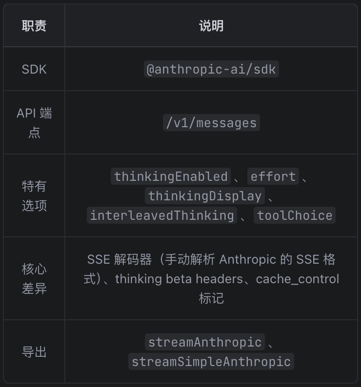
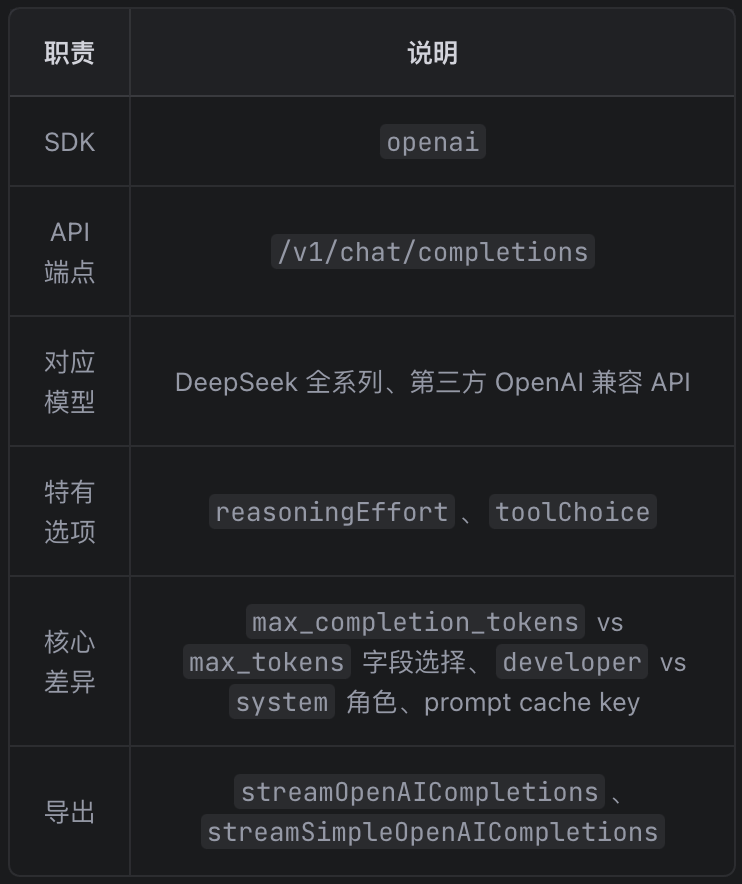
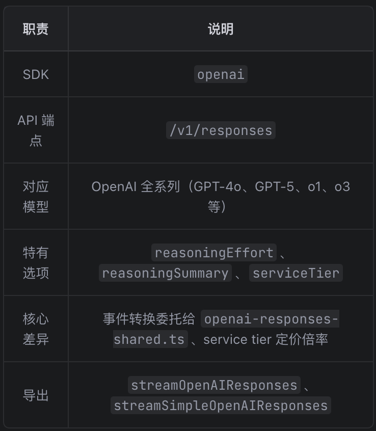
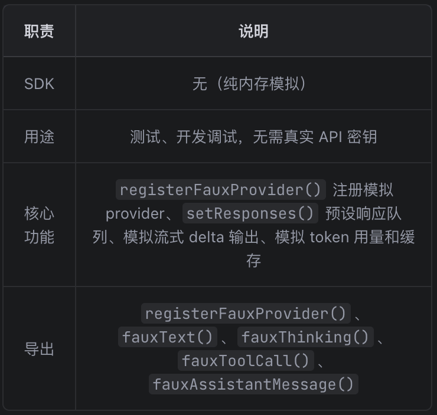
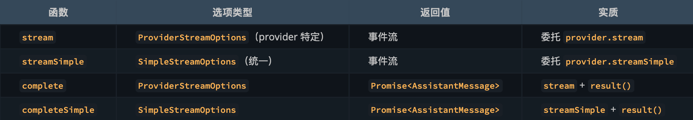

# [pi](https://github.com/earendil-works/pi/tree/main/packages/coding-agent)

> 资料
>
> https://mariozechner.at/posts/2025-11-30-pi-coding-agent/（🌟🌟🌟）
>
> https://github.com/ZhangHanDong/pi-book（🌟🌟）
>
> https://github.com/cellinlab/how-pi-agent-works（🌟）

> Pi 奉行近乎激进的可扩展性，因此无需、也不愿替你规定工作流。许多在别的工具中“内建”的能力，在这里都可通过 extensions、skills，或安装第三方 pi packages 来实现。这样既能让核心保持精简，又能让你按自己的工作方式塑造 Pi。
>
> 不做 MCP。 你可以构建带有 README 的 CLI 工具（见 Skills），也可以编写 extension，为 Pi 增加 MCP 支持。为何如此？
>
> 不设 sub-agents。 实现路径有很多：可借助 tmux 启动多个 Pi 实例，或用 extensions 自行搭建，亦可安装按你思路实现的软件包。
>
> 不弹 permission popups。 你可以在容器中运行，或通过 extensions 构建与自身环境及安全要求相匹配的确认流程。
>
> 不设 plan mode。 计划可直接写入文件，或借助 extensions 自行实现，或安装相应软件包。
>
> 不内置 to-dos。 它们容易让模型困惑。请使用 TODO.md，或用 extensions 自定义。
>
> 不提供后台 bash。 请使用 tmux：全程可观测，交互更直接。

`OpenClaw` 底层的 Agent 正是基于 `Pi Agent` 框架实现的（具体而言，`OpenClaw`通过 `RPC` 模式或 `SDK` 方式集成了 `pi-coding-agent`）

```
pi-tui (终端渲染库)  ← 零内部依赖，纯 UI / 渲染层

pi-ai  (LLM 统一 API) — 模型、provider、流式事件、成本/usage	 ← 零内部依赖，纯 AI 层

pi-agent-core (agent 引擎) — agent loop、工具执行、事件分发、状态管理  ← 依赖 pi-ai
    
pi-coding-agent (完整 CLI 终端应用) — 会话、命令、工具、TUI、扩展系统  ← 依赖以上三个
```

pi-mono 是一个 npm workspace monorepo，包含四个包。

npm workspace 不保证构建顺序。如果你运行 `npm run build`，npm 会并行构建所有包 — 但包之间有依赖关系，并行构建会失败。

pi-mono 通过在根 `package.json` 的 `build` 脚本中**手动编排构建顺序**来解决这个问题：

```json
{
  "build": "cd packages/tui && npm run build && cd ../ai && npm run build && cd ../agent && npm run build && cd ../coding-agent && npm run build"
}
```

# [pi-ai](https://github.com/badlogic/pi-mono/tree/main/packages/ai)

整个 pi monorepo 的**统一 LLM API 层**。

本质是：**用一套统一的模型、消息、工具、流式事件协议，屏蔽掉不同 provider (OpenAI / Anthropic) 之间的协议差异。**这也是阅读源码时不失真的关键心法。

> 实际上只需要使用四个 API： [OpenAI 的 Completions API](https://platform.openai.com/docs/api-reference/chat/create) 、他们较新的 [Responses API](https://platform.openai.com/docs/api-reference/responses) 、 [Anthropic 的 Messages API](https://docs.anthropic.com/en/api/messages) 

也就是说，它对上暴露的是：

- 统一模型查询接口
- 统一的 `stream()` / `complete()` / `streamSimple()` / `completeSimple()`
- 统一的 `AssistantMessage`
- 统一的 `AssistantMessageEventStream`
- 统一的工具 schema / tool call / tool result 协议
- 统一的 usage / cost / abort / cache / reasoning 抽象

而对下，它要做的是：

- 跟不同 provider 的 SDK / HTTP API 打交道
- 构造每家自己的 payload
- 把每家的增量流式事件翻译回统一协议
- 兼容跨 provider 的上下文 handoff

## 整个包的分层图

从底层往上层看，`packages/ai/src` 可以分成 6 层：

```
对外入口层
   index.ts / stream.ts / images.ts

provider 适配层
   providers/*.ts / providers/images/*.ts

注册表与模型元信息层
   api-registry.ts / images-api-registry.ts / models.ts / image-models.ts
   env-api-keys.ts / session-resources.ts

核心类型层
   types.ts

共享基础设施层
   utils/event-stream.ts / validation.ts / json-parse.ts / headers.ts / ...

模型信息生成层
   model.ts
   models.generated.ts / image-models.generated.ts
   scripts/generate-models.ts / scripts/generate-image-models.ts
```

### `src/`

| 文件                      | 定位                 | 核心功能 / 关键导出                                          | 主要被谁调用                                               | 它主要调用谁                           |
| ------------------------- | -------------------- | ------------------------------------------------------------ | ---------------------------------------------------------- | -------------------------------------- |
| index.ts                  | 包公共入口           | 统一 re-export 所有公共 API                                  | `packages/agent`、`packages/coding-agent`、外部 npm 使用者 | 各子模块                               |
| types.ts                  | 核心协议文件         | `Model`、`Context`、`AssistantMessage`、`AssistantMessageEvent`、`StreamOptions` | 几乎所有源码文件                                           | 无运行时调用                           |
| stream.ts                 | 文本入口调度层       | `stream`、`complete`、`streamSimple`、`completeSimple`       | 外部调用者、`packages/agent`                               | `api-registry.ts`                      |
| images.ts                 | 图片入口调度层       | `generateImages`                                             | 外部调用者                                                 | `images-api-registry.ts`               |
| api-registry.ts           | 文本 provider 注册表 | `registerApiProvider`、`getApiProvider`                      | `stream.ts`、`providers/register-builtins.ts`              | 包装已注册 provider                    |
| images-api-registry.ts    | 图片 provider 注册表 | `registerImagesApiProvider`、`getImagesApiProvider`          | `images.ts`、图片 provider 注册层                          | 包装图片 provider                      |
| models.ts                 | 文本模型注册表       | `getModel`、`getModels`、`getProviders`、`calculateCost`、`clampThinkingLevel` | 外部调用者、provider、agent                                | `models.generated.ts`                  |
| image-models.ts           | 图片模型注册表       | `getImageModel`、`getImageModels`、`getImageProviders`       | 外部调用者                                                 | `image-models.generated.ts`            |
| models.generated.ts       | 生成产物             | 文本模型元信息常量 `MODELS`                                  | `models.ts`                                                | 无                                     |
| image-models.generated.ts | 生成产物             | 图片模型元信息常量 `IMAGE_MODELS`                            | `image-models.ts`                                          | 无                                     |
| env-api-keys.ts           | 认证发现层           | `findEnvKeys`、`getEnvApiKey`                                | provider、外部调用者                                       | Node/Bun 环境变量 / ADC / AWS 凭证来源 |
| session-resources.ts      | 会话资源清理注册表   | `registerSessionResourceCleanup`、`cleanupSessionResources`  | 需要维护 session 资源的 provider                           | cleanup 回调集合                       |

#### `providers/`

`providers/` 是这个包最“厚”的一层。

这里的每个文件都在做一件类似的事情：

> 把 `pi-ai` 的统一消息 / 工具 / 事件协议，翻译成某家 provider 的请求与响应协议。

| 文件                       | 定位                             | 核心功能 / 关键方法                                          | 主要被谁调用                      | 它主要调用谁                               |
| -------------------------- | -------------------------------- | ------------------------------------------------------------ | --------------------------------- | ------------------------------------------ |
| register-builtins.ts       | 内置文本 provider 注册层         | `registerBuiltInApiProviders`、`resetApiProviders`、懒加载包装器 | `stream.ts` 通过副作用导入        | `api-registry.ts`、各 provider 动态 import |
| openai-responses.ts        | OpenAI Responses 主实现          | `streamOpenAIResponses`、`streamSimpleOpenAIResponses`、`createClient`、`buildParams` | `register-builtins.ts`            | OpenAI SDK、`openai-responses-shared.ts`   |
| openai-responses-shared.ts | OpenAI Responses 共享翻译层      | `convertResponsesMessages`、`convertResponsesTools`、`processResponsesStream` | `openai-responses.ts`             | `transform-messages.ts`、`json-parse.ts`   |
| openai-completions.ts      | OpenAI Chat Completions 兼容实现 | `streamOpenAICompletions`、`streamSimpleOpenAICompletions`   | `register-builtins.ts`            | OpenAI SDK、若干兼容 helper                |
| anthropic.ts               | Anthropic Messages 实现          | `streamAnthropic`、`streamSimpleAnthropic`                   | `register-builtins.ts`            | Anthropic SDK                              |
| openai-prompt-cache.ts     | OpenAI prompt cache helper       | cache key 规范化                                             | OpenAI provider                   | sessionId 等                               |
| simple-options.ts          | `streamSimple()` 统一参数桥      | `buildBaseOptions`、`adjustMaxTokensForThinking`             | 各 provider 的 `streamSimple*`    | `types.ts`                                 |
| transform-messages.ts      | 跨 provider 上下文转换层         | `transformMessages`                                          | 多个 provider 的 buildParams 阶段 | 统一消息协议                               |
| faux.ts                    | 测试 / 演示 provider             | `registerFauxProvider`、`fauxAssistantMessage`、`fauxText` 等 | 测试、演示代码                    | `api-registry.ts`                          |

| 文件                 | 定位                 | 核心功能                                                | 主要被谁调用               | 它主要调用谁                         |
| -------------------- | -------------------- | ------------------------------------------------------- | -------------------------- | ------------------------------------ |
| register-builtins.ts | 图片 provider 注册层 | `registerBuiltInImagesApiProviders`、懒加载包装         | `images.ts` 通过副作用导入 | `images-api-registry.ts`             |
| openrouter.ts        | OpenRouter 图片实现  | `generateImagesOpenRouter`、`buildParams`、`parseUsage` | 图片 provider 注册层       | OpenAI SDK Chat Completions 兼容接口 |

#### `utils/`

`utils/` 是整个包最底层的基础设施层。其中最关键的是 event-stream.ts，它是整个流式协议的底座。它解释了为什么：

- provider 可以立刻返回一个流对象
- 调用者可以 `for await`
- 调用者又可以 `await result()`

| 文件                | 定位               | 核心功能 / 关键方法                          | 主要被谁调用                   |
| ------------------- | ------------------ | -------------------------------------------- | ------------------------------ |
| event-stream.ts     | 流式事件引擎       | `EventStream`、`AssistantMessageEventStream` | 所有文本 provider              |
| diagnostics.ts      | 诊断结构辅助       | `AssistantMessageDiagnostic` 及相关帮助方法  | provider、错误恢复逻辑         |
| headers.ts          | HTTP 头规范化      | `headersToRecord` 等                         | provider 的 `onResponse`       |
| json-parse.ts       | 流式 JSON 容错解析 | `parseStreamingJson`                         | tool call 流式参数解析         |
| hash.ts             | 短哈希工具         | `shortHash`                                  | tool call id 规范化、cache key |
| sanitize-unicode.ts | Unicode 清洗       | `sanitizeSurrogates`                         | 多数 provider                  |
| validation.ts       | 工具参数校验       | `validateToolCall` 等                        | 外部调用者、agent loop         |
| typebox-helpers.ts  | TypeBox 语法辅助   | `StringEnum` 等                              | 外部调用者、tool schema        |
| overflow.ts         | 上下文溢出辅助     | 溢出检测 / 相关错误处理                      | provider、上层逻辑             |
| node-http-proxy.ts  | 代理请求支持       | Node 侧 HTTP/HTTPS proxy                     | 需要代理的 provider            |

### `scripts/` 

`scripts/` 不是运行时核心逻辑，但它对模型系统至关重要。

| 文件                     | 定位                   | 功能                                                 |
| ------------------------ | ---------------------- | ---------------------------------------------------- |
| generate-models.ts       | 文本模型元信息生成脚本 | 拉取 provider/model 数据，生成 `models.generated.ts` |
| generate-image-models.ts | 图片模型元信息生成脚本 | 生成 `image-models.generated.ts`                     |
| generate-test-image.ts   | 测试资源脚本           | 生成测试用图片资源                                   |

除测试脚本外，在 npm run build 时自动执行，因为在 package.json 中设置了 scripts：

```json
// packages/ai/package.json
{
    "scripts": {
        "generate-models": "node scripts/generate-models.ts",
        "build": "npm run generate-models && npm run generate-image-models && tsgo -p tsconfig.build.json"
    }
}
```

这几份脚本解释了一个关键事实：

> `pi-ai` 的模型列表不是运行时从远端实时拉的，而是构建时生成到代码里的。

这就是为什么：

- `getModel()` 查询很快
- IDE 可以获得强类型提示
- 模型元信息可以直接参与 cost / compat / reasoning 逻辑

## 3 条主调用链

### 文本流式请求主链

```
外部调用:
  streamSimple(model, context, options)

入口层:
  src/stream.ts
    -> resolveApiProvider(model.api)

注册表层:
  src/api-registry.ts
    -> getApiProvider(api)

内置 provider 注册层:
  src/providers/register-builtins.ts
    -> 返回懒加载包装器
    -> 第一次请求时动态 import 真实 provider

provider 层:
  src/providers/openai-responses.ts
    -> createClient()
    -> buildParams()
    -> OpenAI SDK 发请求
    -> processResponsesStream()

共享翻译层:
  src/providers/openai-responses-shared.ts
    -> SDK 事件 -> AssistantMessageEvent
    -> 最终组装 AssistantMessage

返回上游:
  AssistantMessageEventStream
    -> for await 消费增量
    -> result() 拿最终消息
```

### 非流式文本请求主链

```text
completeSimple()
  -> streamSimple()
  -> provider 流式实现
  -> await stream.result()
```

也就是说，`complete()` / `completeSimple()` 并不是另一套 provider 实现，而是**复用流式链路**，只是不消费中间事件。

### 图片生成主链

```text
generateImages(model, context, options)
  -> src/images.ts
  -> src/images-api-registry.ts
  -> src/providers/images/register-builtins.ts
  -> src/providers/images/openrouter.ts
  -> OpenAI SDK Chat Completions 兼容接口
  -> AssistantImages
```

图片 API 和文本 API 结构是平行的，两者共享的是：

- 模型元信息设计
- options 设计
- usage/cost 设计
- 注册表模式

只是简化了：

- 不需要 `EventStream`
- 不需要 `AssistantMessageEvent`
- 不需要 tool call

## 阅读建议

1. 先读协议层
   - types.ts

2. 再读入口调度层
   - stream.ts
   - api-registry.ts
   - register-builtins.ts

3. 再读流式基础设施
   - event-stream.ts

4. 精读一个 provider 样板
   - openai-responses.ts
   - openai-responses-shared.ts

5. 最后横向看其它 provider 差异

## 核心类型层 `types.ts`

1、API / ImagesApi / Provider / ImagesProvider / Thinking推理级别相关 / 统一 options — 协议标识与请求配置

> 注意区分：这里的 Provider 是服务商名称，只是用来自动补全，不涉及代码实现
>
> ```typescript
> // 这只是一个字符串标识，代表"哪家公司"
> export type KnownProvider = "anthropic" | "openai";
> export type Provider = KnownProvider | string;
> 
> // 用在 Model 上
> {
>     provider: "deepseek",  // ← 只是一个名字，不包含任何实现
>     api: "openai-completions",
> }
> ```
>
> api-registry.ts 中的 RegisteredApiProvider（协议实现）是一个包含实际 stream 函数的对象

* StreamOptions：所有文本 provider 共享的基础请求选项。
* SimpleStreamOptions extends StreamOptions：简化入口使用的统一 options，更偏"上层统一抽象"，增加了 reasoning / thinkingBudgets
* ProviderStreamOptions = StreamOptions & Record<string, unknown>：Provider 级完整 options，在统一的 StreamOptions 基础上允许附加任意字段，给各 provider 自己扩展

2、Message / Content / Tool / Usage — 会话数据结构

3、EventStream 事件协议 — 流式事件的类型定义

4、OpenAI / Anthropic 兼容层配置 — provider 差异化的兼容选项

5、Model / ImagesModel 统一模型元信息 — 模型的静态描述

6、对外暴露的函数类型 — StreamFunction / ImagesFunction

## 模型信息生成层 `scripts/` `models.ts`

generate-models.ts 脚本在 npm run build 时自动构建 models.generated.ts，包含 `MODELS`（所有的 `Model` 类）

`MODELS` 的调用链：

```json
models.generated.ts
    │
    │  export const MODELS = { ... }
    │
    ▼
models.ts
    │
    │  import { MODELS } from "./models.generated.ts"
    │  │
    │  ├─ 模块加载时：MODELS → modelRegistry (Map)
    │  │
    │  ├─ export function getModel(provider, modelId)     → 查询单个模型
    │  ├─ export function getProviders()                   → 获取所有 provider
    │  ├─ export function getModels(provider)              → 获取某 provider 下所有模型
    │  ├─ export function calculateCost(model, usage)      → 计算费用
    │  ├─ export function getSupportedThinkingLevels(model) → 获取支持的推理级别
    │  ├─ export function clampThinkingLevel(model, level)  → 钳位推理级别
    │  └─ export function modelsAreEqual(a, b)             → 比较两个模型
    │
    ▼
index.ts（barrel file）
    │
    │  export * from "./models.ts"
    │
    ▼
上层调用方
    │
    ├─ packages/agent
    │   └─ import { getModel } from "@earendil-works/pi-ai"
    │       └─ getModel("openai", "gpt-4o") → Model<"openai-responses">
    │
    ├─ packages/coding-agent
    │   └─ import { getModel } from "@earendil-works/pi-ai"
    │
    └─ 测试代码
        └─ import { getModel } from "../src/models.ts"
```

## Provider 懒加载 → 注册表调度 → 公共 API

<u>**简历写法 — Provider 懒加载与注册表调度**：</u>

* <u>设计泛型类型擦除 + 运行时 API 校验的 Provider 注册表，实现同一协议（如 OpenAI Completions）跨多服务商复用</u>

* <u>通过 import() 动态导入 + Promise 缓存的懒加载包装器，将 10+ Provider 的 SDK 加载延迟至首次调用，启动零成本</u>

> Provider 是两条链路的交汇点
>
> - 往上 ：懒加载 → 注册表 → 统一入口 stream/streamSimple（暴露给调用方）
> - 往下 ：事件流 + 工具函数（provider 内部实现时调用）
>
> ```json
>                 调用方（agent / coding-agent / 外部使用者）
>                               │
>                               ▼
> ┌─────────────────────────────────────────────────────────┐
> │  Provider 懒加载 → 轻量公共 API（从 provider 往上）        │
> │                                                         │
> │  stream.ts          ← 统一入口                          │
> │       │                                                 │
> │  api-registry.ts    ← 注册表查询                        │
> │       │                                                 │
> │  register-builtins.ts ← 懒加载包装                      │
> │       │                                                 │
> │       ▼                                                 │
> │  ┌─────────────────────────────────────────────────┐   │
> │  │  provider（分界点）                                │   │
> │  │  anthropic.ts / openai-completions.ts / ...      │   │
> │  └─────────────────────────────────────────────────┘   │
> └─────────────────────────────────────────────────────────┘
>                               │
>                               ▼
> ┌─────────────────────────────────────────────────────────┐
> │  统一事件流机制（从 provider 往下）                        │
> │                                                         │
> │  event-stream.ts     ← AssistantMessageEventStream      │
> │  json-parse.ts       ← provider 调用的 JSON 解析        │
> │  overflow.ts         ← provider 调用的 overflow 处理     │
> │  diagnostics.ts      ← provider 调用的诊断信息           │
> │  validation.ts       ← provider 调用的 schema 校验       │
> │  sanitize-unicode.ts ← provider 调用的 unicode 清理      │
> │  headers.ts          ← provider 调用的 header 处理       │
> │  hash.ts             ← provider 调用的哈希计算           │
> └─────────────────────────────────────────────────────────┘
> ```

### `env-api-keys.ts` 提供 apikey

```typescript
env-api-keys.ts
│
├─ export getEnvApiKey(provider) → 获取 API 密钥值
├─ export findEnvKeys(provider)  → 获取已设置的环境变量名（诊断用）
│
├─ 被 3 个文本 provider 调用（获取 API 密钥）：
│   ├─ anthropic.ts:434        → options?.apiKey ?? getEnvApiKey(model.provider) ?? ""
│   ├─ anthropic.ts:668        → options?.apiKey || getEnvApiKey(model.provider)
│   ├─ openai-completions.ts:137 → options?.apiKey || getEnvApiKey(model.provider) || ""
│   ├─ openai-completions.ts:425 → options?.apiKey || getEnvApiKey(model.provider)
│   ├─ openai-responses.ts:136  → options?.apiKey || getEnvApiKey(model.provider) || ""
│   └─ openai-responses.ts:208  → options?.apiKey || getEnvApiKey(model.provider)
│
├─ 被 1 个图片 provider 调用：
│   └─ images/openrouter.ts:53  → options?.apiKey || getEnvApiKey(model.provider)
│
└─ 被 stream.ts 重导出：
    └─ export { getEnvApiKey } from "./env-api-keys.ts"
        └─ 上层可直接 import { getEnvApiKey } from "@earendil-works/pi-ai"
```

### `/Providers` 下的具体 provider

#### 每个 provider 文件做 4 件事

1、类型转换（统一 → SDK 原生）

```typescript
// 统一的 Message → Anthropic 的 MessageParam
function convertMessages(messages: Message[]): MessageParam
[] { ... }

// 统一的 Tool → Anthropic 的工具声明
function convertTools(tools: Tool[]): AnthropicTool[] 
{ ... }

// 统一的 ThinkingContent → Anthropic 的 thinking 参数
function convertThinking(thinking: ThinkingContent): 
AnthropicThinking { ... }
```
2、调用 SDK 流式接口

```typescript
// 创建 Anthropic SDK 客户端
const client = new Anthropic({ apiKey });

// 调用流式 API
const response = await client.messages.create({
    model: model.id,
    messages: convertedMessages,
    tools: convertedTools,
    stream: true,
});
```

3、事件转换（SDK 原生 → 统一）

```typescript
// Anthropic 的 SSE 事件 → 统一的 AssistantMessageEvent
for await (const event of response) {
    if (event.type === 'content_block_delta') {
        stream.push({
            type: 'text_delta',
            delta: event.delta.text,
            partial: currentAssistantMessage,
        });
    }
    // ... 其他事件类型
}
```

4、导出两个函数

```typescript
// 完整参数版本（provider 特有选项）
export const streamAnthropic: StreamFunction<"anthropic-messages", AnthropicOptions> = ...;

// 简化参数版本（统一的 SimpleStreamOptions）
export const streamSimpleAnthropic: StreamFunction<"anthropic-messages", SimpleStreamOptions> = ...;
```

只要求实现者提供 stream 和 streamSimple 两个方法。没有 complete、没有 embed、没有 tokenCount：

* stream：接收完整的 StreamOptions（types.ts 中定义，包含 provider 特定选项），返回事件流

* streamSimple：接收 SimpleStreamOptions（统一选项 + reasoning level），返回事件流

为什么不直接用一个 stream 方法？因为两者的职责不同：

stream 是给知道自己在做什么的调用者用的 — 它传递 provider 特定的选项（比如 Anthropic 的 cache control、Google 的 safety settings）。类型是 StreamFunction<TApi, TOptions>，其中 TOptions 是泛型的。

streamSimple 是给不关心 provider 差异的调用者用的 — 它只传递统一选项（temperature、maxTokens、reasoning level）。循环引擎（第 8 章）用的就是 streamSimple。

各 provider 的差异化处理：


总结：这些 provider 文件就是"翻译官"，把 pi-ai 的统一语言翻译成各 SDK 的方言，再把 SDK 的方言翻译回统一语言。

#### 真正发请求的 provider

anthropic.ts — Anthropic Messages API（约 676 行）



openai-completions.ts — OpenAI Chat Completions API（约 425 行）



openai-responses.ts — OpenAI Responses API（约 364 行）



openai-responses-shared.ts — Responses API 共享逻辑（约 676 行）

- convertResponsesMessages() ：统一 Message → Responses input 格式
- convertResponsesTools() ：统一 Tool → Responses tools 格式
- processResponsesStream() ：SDK 流事件 → AssistantMessageEvent 协议事件
- 被 openai-responses.ts 调用，也可能被自定义 Responses 兼容 provider 复用

faux.ts — 测试用模拟 provider（约 499 行）



#### provider 共享工具层
**transform-messages.ts — 统一消息格式转换（跨 provider 复用）**

- 图片降级 ：不支持图片的模型，把 ImageContent 替换为占位文本
- 思考块处理 ：跨模型时丢弃 redacted thinking；同模型保留签名用于回放
- 工具调用 ID 归一化 ：OpenAI Responses 的 450+ 字符 ID 截断为 Anthropic 兼容的 64 字符
- 孤立工具调用补全 ：没有对应 ToolResult 的 ToolCall 自动插入合成错误结果
- 错误/中止消息跳过 ：stopReason 为 error/aborted 的 AssistantMessage 不参与回放
simple-options.ts — SimpleStreamOptions → StreamOptions 映射

- buildBaseOptions() ：把统一参数提取为 provider 可直接使用的 StreamOptions
- adjustMaxTokensForThinking() ：在总 token 预算内分配 thinking 预算和输出预算
- clampReasoning() ：把 "xhigh" 降级为 "high"（部分 provider 不支持 xhigh）
openai-prompt-cache.ts — OpenAI prompt cache key 截断

- 把 sessionId 截断到 64 字符（OpenAI API 限制）
- 仅 9 行，被 openai-completions 和 openai-responses 共用

**simple-options.ts — SimpleStreamOptions → StreamOptions 映射**

- buildBaseOptions() ：把统一参数提取为 provider 可直接使用的 StreamOptions
- adjustMaxTokensForThinking() ：在总 token 预算内分配 thinking 预算和输出预算
- clampReasoning() ：把 "xhigh" 降级为 "high"（部分 provider 不支持 xhigh）


**openai-prompt-cache.ts — OpenAI prompt cache key 截断**

- 把 sessionId 截断到 64 字符（OpenAI API 限制）
- 仅 9 行，被 openai-completions 和 openai-responses 共用

### `providers/register-builtins.ts` — 实现每个 provider 的懒加载包装器

- 通过 `import("./xxx.ts")` 等导入各 provider 的 `XxxOptions`

- `loadXxxProviderModule()` 能够通过 import("./xxx.ts") 等懒加载各 provider 的导出对象中的 `streamXxx()` 和 `streamSimpleXxx()` 两个流函数，将他们包装成统一的懒加载 provider 模块 `XxxProviderModule`

  并定义了懒加载的 `XxxProviderModulePromise` 缓存确保每个 provider 模块只被加载一次

  ```typescript
  interface LazyProviderModule<
  	TApi extends Api,
  	TOptions extends StreamOptions,
  	TSimpleOptions extends SimpleStreamOptions,
  > {
  	stream: (model: Model<TApi>, context: Context, options?: TOptions) => AsyncIterable<AssistantMessageEvent>;
  	streamSimple: (
  		model: Model<TApi>,
  		context: Context,
  		options?: TSimpleOptions,
  	) => AsyncIterable<AssistantMessageEvent>;
  }
  
  interface AnthropicProviderModule {
  	streamAnthropic: StreamFunction<"anthropic-messages", AnthropicOptions>;
  	streamSimpleAnthropic: StreamFunction<"anthropic-messages", SimpleStreamOptions>;
  }
  
  interface OpenAICompletionsProviderModule {
  	streamOpenAICompletions: StreamFunction<"openai-completions", OpenAICompletionsOptions>;
  	streamSimpleOpenAICompletions: StreamFunction<"openai-completions", SimpleStreamOptions>;
  }
  
  interface OpenAIResponsesProviderModule {
  	streamOpenAIResponses: StreamFunction<"openai-responses", OpenAIResponsesOptions>;
  	streamSimpleOpenAIResponses: StreamFunction<"openai-responses", SimpleStreamOptions>;
  }
  ```

* `createLazyStream()` / `createLazySimpleStream()` 将 `loadXxxProviderModule()` 传入的各 provider 的 `LazyProviderModule` 包装成统一的 `StreamFunction<TApi, TOptions>` 懒加载流式函数 `streamXxx()` / `streamSimpleXxx`

  这个 StreamFunction 函数本质上是重新封装了一层 outer EventStream 事件流，然后调用 `forwardStream(outer, inner)` 与 inner EventStream 事件流桥接

  ```
  inner (openai-responses.ts 创建)     forwardStream      outer (register-builtins.ts 创建)
  ┌─────────────────────────┐         ┌──────────┐         ┌─────────────────────────┐
  │ HTTP 流事件 → pi 事件协议 │ ──push──▶│ for await│ ──push──▶│ 懒加载桥接，立即返回给调用方 │
  └─────────────────────────┘         └──────────┘         └─────────────────────────┘
  ```
  
  **注意区分 anthropic.ts 和 register-builtins.ts 中的 streamXxx**
  
  ```typescript
  // anthropic.ts 中的 streamAnthropic —— 真正的实现
  export const streamAnthropic: StreamFunction<"anthropic-messages", AnthropicOptions> = (
      model, context, options
  ) => {
      const stream = new AssistantMessageEventStream();
      // 创建 Anthropic SDK client
      // 发起 API 请求
      // 处理 SSE 事件
      // 转换成统一的 AssistantMessageEvent
      // ...
      return stream;
  };
  
  // register-builtins.ts 中的 streamAnthropic —— 懒加载包装器
  export const streamAnthropic = createLazyStream(loadAnthropicProviderModule);
  // 内部逻辑：
  // 1. 创建一个空的 outer 事件流
  // 2. 异步 import("./anthropic.ts")
  // 3. 加载成功后，forwardStream(AssistantMessageEventStream, streamAnthropic) 把真正的 streamAnthropic 的事件转发到 AssistantMessageEventStream 事件流
  // 4. 加载失败则用 createLazyLoadErrorMessage() 创建错误消息并推送到事件流
  // 5. 立即返回事件流
  ```
  
  为什么这么做？
  
  ```
  场景：应用启动时，import 了 stream.ts
  
  如果不做懒加载：
  ├─ stream.ts 导入 register-builtins.ts
  ├─ register-builtins.ts 导入 anthropic.ts（加载 Anthropic SDK ~500ms）
  ├─ register-builtins.ts 导入 openai-completions.ts（加载 OpenAI SDK ~300ms）
  ├─ register-builtins.ts 导入 openai-responses.ts（加载 OpenAI SDK ~300ms）
  └─ 总启动时间：~1100ms 😱
  
  做了懒加载：
  ├─ stream.ts 导入 register-builtins.ts
  ├─ register-builtins.ts 只注册"空壳"函数（~0ms）
  └─ 总启动时间：~0ms ✅
  
  第一次调用 streamAnthropic 时：
  ├─ 加载 anthropic.ts（~500ms）
  ├─ 调用真正的 streamAnthropic
  └─ 后续调用直接复用缓存的模块
  ```
  
  

- stream.ts 导入 register-builtins.ts，自动触发 `registerBuiltInApiProviders()` 注册所有内置 provider 到全局注册表
- 导出 `resetApiProviders()` 供测试重置注册表（调用 api-registry.ts 中的 `clearApiProviders` 后重新注册）

### `api-registry.ts` API 注册表 — `stream.ts` 和 `register-builtins.ts` 中 provider 懒加载包装器之间的桥接层

整个注册表的 API 面只有五个函数：`registerApiProvider`（注册）、`getApiProvider`（查找单个）、`getApiProviders`（列出全部）、`unregisterApiProviders`（按 sourceId 批量注销）、`clearApiProviders`（清空，用于测试）。其中前四个是常用的。

```typescript
apiProviderRegistry = new Map<string, RegisteredApiProvider>()

type RegisteredApiProvider = {
	provider: ApiProviderInternal;
	sourceId?: string; // ?表示可选
};

// 对外暴露的强类型 provider 接口
export interface ApiProvider<TApi extends Api = Api, TOptions extends StreamOptions = StreamOptions> {
	api: TApi;
	stream: StreamFunction<TApi, TOptions>;
	streamSimple: StreamFunction<TApi, SimpleStreamOptions>;
}

// 注册表内部存储的类型擦除后的 provider
interface ApiProviderInternal {
	api: Api;
	stream: ApiStreamFunction;
	streamSimple: ApiStreamSimpleFunction;
}

export function registerApiProvider<TApi extends Api, TOptions extends StreamOptions>(
	provider: ApiProvider<TApi, TOptions>,
	sourceId?: string,
): void {
	apiProviderRegistry.set(provider.api, {
		provider: {
			api: provider.api,
			stream: wrapStream(provider.api, provider.stream),
			streamSimple: wrapStreamSimple(provider.api, provider.streamSimple),
		},
		sourceId,
	});
}
```

register-builtins.ts 中的 `registerBuiltInApiProviders()` 调用了 api-registry.ts 中的 `registerApiProvider()`，

* 传入了懒加载包装器 `streamXxx()` 和 `streamSimpleXxx()` 封装为**范型的 `ApiProvider`**（**对外暴露的强类型 provider 接口**）

* 再通过 `wrapStream()` / `wrapStreamSimple()` 做一层**精妙的封装**，先做校验 `model.api !== api`，再封装泛型的懒加载包装器 `StreamFunction<TApi, TOptions>`，**最终包装成非泛型的** `ApiStreamFunction`

  > 为什么需要**类型擦除**？
  >
  > 因为 `Map<string, RegisteredApiProvider>` 只能存一种类型。如果 Map 的 value 类型带泛型参数（比如 `ApiProvider<TApi, TOptions>`），每个 entry 的泛型参数不同。
  >
  > 解决方案是经典的**"入口检查 + 内部擦除"模式**：
  >
  > 1. **注册时**：泛型约束保证 provider 的 `stream` 函数类型与 `api` 一致
  > 2. **存储时**：`wrapStream` 把泛型函数包装为非泛型的 `ApiStreamFunction`
  > 3. **取出时**：`getApiProvider` 返回 `ApiProviderInternal`（非泛型），调用者拿到的函数签名丢失了 `TOptions` 信息
  > 4. **运行时**：`model.api !== api` 检查保证不会把 Anthropic 的 model 传给 OpenAI 的 stream 函数

* 将非范型的 `ApiStreamFunction` / `ApiStreamFunction` 包装为 `ApiProviderInternal`（注册表内部存储的类型擦除后的 provider）

* 最后将 (api, RegisteredApiProvider) 注册到全局注册表 `apiProviderRegistry`

  > `RegisteredApiProvider` 中的 `sourceId` 用于标记 provider 来源，方便按来源批量卸载。比如自定义 extension 注册了一批 provider。

  每个 API（协议） 对应一个 RegisteredApiProvider（协议实现）（Map 的特性：相同 key 会覆盖，后注册的覆盖先注册的）

### `stream.ts` — 薄到透明的公共 API 层



**提供对外统一流式入口 `stream(api)` / `streamSimple(api)`**

> `streamSimple()` 是上层真正常用的 API 面，因为这层把 reasoning / timeout / signal / headers / cache 这些参数统一好了。

* 他们都通过 `resolveApiProvider(api)` 从注册表中得到被封装了两层的 provider，从而调用具体 provider（anthropic.ts）中的 `streamXxx()` / `streamSimpleXxx()`

  ```typescript
  ┌─ 第二层封装：api-registry 的 `wrapStream()`
  │	└─ 非范型包装
  │   └─ 校验 model.api === api
  │
  ├─ 第一层封装：register-builtins 的懒加载包装器
  │   └─ `loadXxxProviderModule()` 异步加载 anthropic.ts
  │
  └─ 最下层：anthropic.ts 的真正实现 `streamXxx()`
          └─ 创建 SDK client、发起请求、处理流
  ```

非流式入口 `complete()` / `completeSimple()` 不是独立的实现 — 它们只是对 stream 版本调用 `.result()` 的语法糖。这就是为什么 `ApiProvider` 接口只需要两个方法而不是四个：**stream 是原语，complete 是派生**。

这个文件的存在证明了注册表设计的成功：98 行的 `api-registry.ts` 承担了全部复杂性，公共 API 层薄到几乎可以内联。对调用者来说，`stream(model, context, options)` 看起来就像在直接调用 provider，注册表完全隐形。

```typescript
streamSimple(model, context, options)          // stream.ts 入口
    │
    ├─ model.api = "anthropic-messages"
    │   └─ register-builtins.ts (懒加载)
    │       └─ anthropic.ts
    │           ├─ transform-messages.ts  ← 消息预处理
    │           ├─ simple-options.ts      ← 参数映射
    │           └─ @anthropic-ai/sdk      ← 真实 API 调用
    │
    ├─ model.api = "openai-completions"
    │   └─ register-builtins.ts (懒加载)
    │       └─ openai-completions.ts
    │           ├─ transform-messages.ts
    │           ├─ simple-options.ts
    │           ├─ openai-prompt-cache.ts
    │           └─ openai SDK
    │
    ├─ model.api = "openai-responses"
    │   └─ register-builtins.ts (懒加载)
    │       └─ openai-responses.ts
    │           ├─ openai-responses-shared.ts  ← 消息/工具转换 + 流处理
    │           ├─ simple-options.ts
    │           ├─ openai-prompt-cache.ts
    │           └─ openai SDK
    │
    └─ model.api = "faux:*" (测试)
        └─ faux.ts (直接注册，不走懒加载)
```

### 实战：添加一个新 api&provider 的完整步骤

添加 DeepSeek provider 不需要重写任何 API 实现，只需要使用 OpenAI 兼容的 API：

```
在 types.ts 的 KnownProvider 联合中加入 "deepseek"。这不是必须的（Provider = KnownProvider | string，任意字符串都合法），但加入后 IDE 会提供自动补全。
1. 在 generate-models.ts 中定义模型元信息（自动生成到 
models.generated.ts）
2. api 字段指向 "openai-completions"（复用已有的协议实
现）
3. provider 字段设为 "deepseek"（用于读取 API 密钥）
4. baseUrl 指向 DeepSeek 的 API 地址
5. compat 字段覆盖不兼容的行为
```

```typescript
// generate-models.ts
if (data.deepseek?.models) {
    for (const [modelId, model] of Object.entries(data.deepseek.models)) {
        const m = model as ModelsDevModel;
        if (m.tool_call !== true) continue;

        models.push({
            id: modelId,
            name: m.name || modelId,
            api: "openai-completions",
            provider: "deepseek",
            baseUrl: "https://api.deepseek.com/v1",
            reasoning: m.reasoning === true,
            input: m.modalities?.input?.includes("image") ? ["text", "image"] : ["text"],
            cost: {
                input: m.cost?.input || 0,
                output: m.cost?.output || 0,
                cacheRead: m.cost?.cache_read || 0,
                cacheWrite: m.cost?.cache_write || 0,
            },
            contextWindow: m.limit?.context || 4096,
            maxTokens: m.limit?.output || 4096,
            compat: {
                supportsDeveloperRole: false,
            },
        });
    }
}
```

如果是一个新的 api 和 provider，则需要

1、协议层

- types.ts

你可能要改：

- `KnownApi`
- `KnownProvider`
- provider 专属 `XxxOptions`
- 兼容层配置接口

2、provider 实现层

新增：

- `src/providers/your-provider.ts`

至少要实现：

- `streamYourProvider()`
- `streamSimpleYourProvider()`

3、注册层

改：

- register-builtins.ts

你要补：

1. `loadYourProviderModule()`
2. `streamYourProvider` / `streamSimpleYourProvider`
3. `registerBuiltInApiProviders()` 中的注册逻辑

4、模型元信息层

改：

- generate-models.ts
- 生成后的 models.generated.ts

5、认证发现层

改：env-api-keys.ts

6、文档与测试

改：

- `README.md`
- `test/` 下相关测试

### 优点

**1. 无限扩展性**。任何人都可以在运行时注册新的 provider，不需要修改 pi-ai 的代码。Extension 可以在用户启动后动态加载 provider。

**2. Provider 和 Api 的解耦**。同一个 api 协议可以被多个 provider 复用。增加 Azure OpenAI 或 GitHub Copilot 不需要重写 OpenAI 的 api 实现。

**3. 极简的公共 API**。注册表只暴露 5 个函数。用户面对的 `stream.ts` 只有 4 个函数。新的 provider 开发者只需要实现 `stream` 和 `streamSimple` 两个方法。

**4. 启动零成本**。延迟加载确保了只有实际使用的 provider 模块才会被加载。10 个内建 provider 中，一次会话通常只加载 1-2 个。

**5. 复杂性集中**。整个 pi-ai 层的"设计复杂性"集中在 `api-registry.ts` 和 `register-builtins.ts` 中，`stream.ts` 是纯粹的委托。

## 统一事件流机制 EventStream

见 [pi-ai-streaming-architecture.md](./pi-ai-streaming-architecture.md)

<u>**简历写法 — 统一事件流机制：**</u>

* 基于生产者-消费者模型，设计双缓冲队列 + Promise 挂起/唤醒机制的异步事件流引擎（AssistantMessageEventStream），支持多消费者独立订阅与并行消费；实现 LLM 流式输出期间并行执行工具调用，消除传统 for-loop 架构下"等流结束才能执行工具"的阻塞瓶颈

* 封装增量事件协议（text_delta / thinking_delta / toolcall_delta），在统一抽象层内完成多 SDK 流格式归一化、成本追踪与错误归一化；通过 AbortSignal 全链路透传实现流式中断下的部分结果保全

## Context handoff 跨模型上下文交接

pi-ai 从设计之初就考虑到了不同提供商之间的上下文切换。由于每个提供商都有自己追踪工具调用和思维轨迹的方式，因此只能尽力而为。例如，如果在会话中途从 Anthropic 切换到 OpenAI，Anthropic 的思维轨迹会被转换成助手消息中的内容块，并以 `<thinking></thinking>` 标签分隔。这种做法是否合理尚待商榷，因为 Anthropic 和 OpenAI 返回的思维轨迹实际上并不能反映幕后发生的情况。

这些提供程序还会将已签名的数据块插入到事件流中，后续包含相同消息的请求必须重放这些数据块。在同一提供程序内切换模型时，也会出现这种情况。这导致后台存在繁琐的抽象和转换管道。

```typescript
import { getModel, complete, Context } from '@mariozechner/pi-ai';

// Start with Claude
const claude = getModel('anthropic', 'claude-sonnet-4-5');
const context: Context = {
  messages: []
};

context.messages.push({ role: 'user', content: 'What is 25 * 18?' });
const claudeResponse = await complete(claude, context, {
  thinkingEnabled: true
});
context.messages.push(claudeResponse);

// Switch to GPT - it will see Claude's thinking as <thinking> tagged text
const gpt = getModel('openai', 'gpt-5.1-codex');
context.messages.push({ role: 'user', content: 'Is that correct?' });
const gptResponse = await complete(gpt, context);
context.messages.push(gptResponse);

// Switch to Gemini
const gemini = getModel('google', 'gemini-2.5-flash');
context.messages.push({ role: 'user', content: 'What was the question?' });
const geminiResponse = await complete(gemini, context);

// Serialize context to JSON (for storage, transfer, etc.)
const serialized = JSON.stringify(context);

// Later: deserialize and continue with any model
const restored: Context = JSON.parse(serialized);
restored.messages.push({ role: 'user', content: 'Summarize our conversation' });
const continuation = await complete(claude, restored);
```


### Structured split tool results 结构化拆分工具结果

#### 核心思想：将工具返回结果拆分为“给 LLM 看的”和“给 UI 显示的”

大多数统一 LLM API 只让工具返回一段文本/JSON 给 LLM，但这段文本不一定包含 UI 需要展示的所有信息（例如图表、富文本）。开发者不得不**解析文本输出再重组 UI 数据**，很麻烦。

pi-ai 允许工具同时返回：

- **`output`**（或 content 中的 `text` 块）→ 给 LLM 理解使用。
- **`details`**（或额外的 `image` 块）→ 直接供 UI 渲染，无需再解析。

并且：

- 工具参数通过 **TypeBox schema + AJV** 自动校验，失败时给出详细错误。
- 可以返回**图片附件**（转成 base64 及 MIME 类型），以各提供商原生格式传递。

#### 简单总结

> pi-ai 在工具调用上做了两件大多数库没做的事：**把工具返回内容分成“LLM 逻辑部分”和“UI 展示部分”**，并且能在工具参数**流式传输过程中就部分解析 JSON** 给 UI 实时预览。

### Minimal agent scaffold 最小代理支架

pi-ai 提供了一个[代理循环](https://github.com/badlogic/pi-mono/blob/main/packages/ai/src/agent/agent-loop.ts)来处理完整的流程编排：处理用户消息、执行工具调用、将结果反馈给 LLM，并重复此过程，直到模型无需工具调用即可生成响应。该循环还支持通过回调进行消息排队：每次循环结束后，它会请求队列中的消息，并在下一次助手响应之前注入这些消息。该循环会为所有操作发出事件，从而可以轻松构建响应式 UI。

代理循环不允许您指定最大步数或类似其他统一 LLM API 中常见的参数。我从未发现过需要这些参数的场景，所以为什么要添加它们呢？循环会一直运行，直到代理发出完成指令。不过，除了循环之外， [pi-agent-core](https://github.com/badlogic/pi-mono/tree/main/packages/agent)还提供了一个 `Agent` 类，其中包含一些真正有用的功能：状态管理、简化的事件订阅、两种模式（一次一条或全部同时）的消息队列、附件处理（图像、文档）以及传输抽象，允许您直接运行代理或通过代理运行代理。


