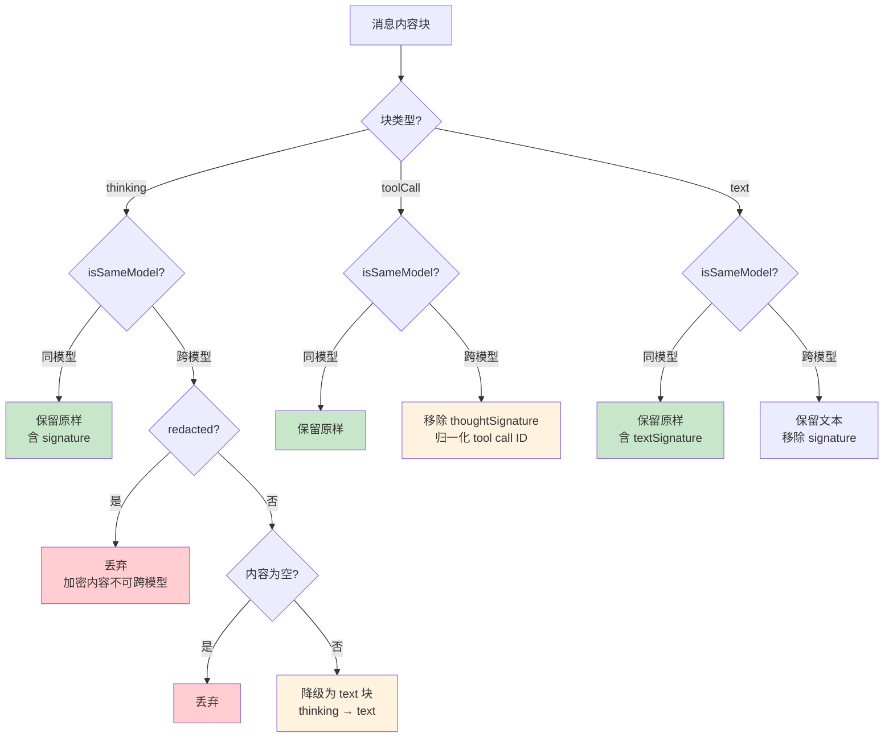

# [pi-ai](https://github.com/badlogic/pi-mono/tree/main/packages/ai)

整个 pi monorepo 的**统一 LLM API 层**。

本质是：**用一套统一的模型、消息、工具、流式事件协议，屏蔽掉不同 provider (OpenAI / Anthropic) 之间的协议差异。**这也是阅读源码时不失真的关键心法。

> 实际上只需要使用四个 API： [OpenAI 的 Completions API](https://platform.openai.com/docs/api-reference/chat/create) 、他们较新的 [Responses API](https://platform.openai.com/docs/api-reference/responses) 、 [Anthropic 的 Messages API](https://docs.anthropic.com/en/api/messages) 

也就是说，它对上暴露的是：

- 统一模型查询接口
- 统一的流式/非流式函数 `stream()` / `complete()` / `streamSimple()` / `completeSimple()`
- 统一的返回消息 `AssistantMessage`
- 统一的事件流 `AssistantMessageEventStream`
- 统一的工具 schema / tool call / tool result 协议

- 统一的 usage / cost / abort / cache / reasoning 抽象

而对下，它要做的是：

- 跟不同 provider 的 SDK / HTTP API 打交道
- 构造每家自己的 payload
- 把每家的增量流式事件翻译回统一协议
- 兼容跨 provider 的上下文 handoff

**基本使用示例：**

```typescript
import { Type, getModel, stream, complete, Context, Tool } from '@mariozechner/pi-ai';

const model = getModel('anthropic', 'claude-sonnet-4-20250514');

const tools: Tool[] = [{
  name: 'get_weather',
  description: 'Get current weather for a location',
  parameters: Type.Object({
    city: Type.String({ description: 'City name' })
  })
}];

const context: Context = {
  systemPrompt: 'You are a helpful assistant.',
  messages: [{ role: 'user', content: 'What is the weather in Tokyo?' }],
  tools
};

const s = stream(model, context);

for await (const event of s) {
  if (event.type === 'text_delta') {
    process.stdout.write(event.delta);
  } else if (event.type === 'toolcall_end') {
    console.log(`Tool called: ${event.toolCall.name}`);
  } else if (event.type === 'done') {
    console.log(`Stop reason: ${event.reason}`);
  }
}

const finalMessage = await s.result();
console.log(`Cost: $${finalMessage.usage.cost.total.toFixed(4)}`);
```

## 整个包的分层图

`packages/ai/src` 可以分成四层：

```
四、Provider 懒加载 → 注册表调度 → 公共 API
对外入口层
   index.ts / stream.ts / images.ts

注册表与模型元信息层
   api-registry.ts / images-api-registry.ts / models.ts / image-models.ts
   env-api-keys.ts / session-resources.ts
   
中间：provider 适配层
   providers/*.ts / providers/images/*.ts

三、统一事件流机制 EventStream
共享基础设施层
   utils/event-stream.ts / validation.ts / json-parse.ts / headers.ts / ...

二、模型信息生成层
   models.generated.ts / image-models.generated.ts
   scripts/generate-models.ts / scripts/generate-image-models.ts

一、核心类型层
   types.ts
```

### `src/`

| 文件                      | 定位                 | 核心功能 / 关键导出                                          | 主要被谁调用                                               | 它主要调用谁                           |
| ------------------------- | -------------------- | ------------------------------------------------------------ | ---------------------------------------------------------- | -------------------------------------- |
| index.ts                  | 包公共入口           | 统一 re-export 所有公共 API                                  | `packages/agent`、`packages/coding-agent`、外部 npm 使用者 | 各子模块                               |
| types.ts                  | 核心协议文件         | `Model`、`Context`、`AssistantMessage`、`AssistantMessageEvent`、`StreamOptions` | 几乎所有源码文件                                           | 无运行时调用                           |
| stream.ts                 | 文本入口调度层       | `stream`、`complete`、`streamSimple`、`completeSimple`       | 外部调用者、`packages/agent`                               | `api-registry.ts`                      |
| images.ts                 | 图片入口调度层       | `generateImages`                                             | 外部调用者                                                 | `images-api-registry.ts`               |
| api-registry.ts           | 文本 provider 注册表 | `registerApiProvider`、`getApiProvider`                      | `stream.ts`、`providers/register-builtins.ts`              | 包装已注册 provider                    |
| images-api-registry.ts    | 图片 provider 注册表 | `registerImagesApiProvider`、`getImagesApiProvider`          | `images.ts`、图片 provider 注册层                          | 包装图片 provider                      |
| models.ts                 | 文本模型注册表       | `getModel`、`getModels`、`getProviders`、`calculateCost`、`clampThinkingLevel` | 外部调用者、provider、agent                                | `models.generated.ts`                  |
| image-models.ts           | 图片模型注册表       | `getImageModel`、`getImageModels`、`getImageProviders`       | 外部调用者                                                 | `image-models.generated.ts`            |
| models.generated.ts       | 生成产物             | 文本模型元信息常量 `MODELS`                                  | `models.ts`                                                | 无                                     |
| image-models.generated.ts | 生成产物             | 图片模型元信息常量 `IMAGE_MODELS`                            | `image-models.ts`                                          | 无                                     |
| env-api-keys.ts           | 认证发现层           | `findEnvKeys`、`getEnvApiKey`                                | provider、外部调用者                                       | Node/Bun 环境变量 / ADC / AWS 凭证来源 |
| session-resources.ts      | 会话资源清理注册表   | `registerSessionResourceCleanup`、`cleanupSessionResources`  | 需要维护 session 资源的 provider                           | cleanup 回调集合                       |

#### `providers/`

`providers/` 是这个包最“厚”的一层。

这里的每个文件都在做一件类似的事情：

> 把 `pi-ai` 的统一消息 / 工具 / 事件协议，翻译成某家 provider 的请求与响应协议。

| 文件                       | 定位                             | 核心功能 / 关键方法                                          | 主要被谁调用                      | 它主要调用谁                               |
| -------------------------- | -------------------------------- | ------------------------------------------------------------ | --------------------------------- | ------------------------------------------ |
| register-builtins.ts       | 内置文本 provider 注册层         | `registerBuiltInApiProviders`、`resetApiProviders`、懒加载包装器 | `stream.ts` 通过副作用导入        | `api-registry.ts`、各 provider 动态 import |
| openai-responses.ts        | OpenAI Responses 主实现          | `streamOpenAIResponses`、`streamSimpleOpenAIResponses`、`createClient`、`buildParams` | `register-builtins.ts`            | OpenAI SDK、`openai-responses-shared.ts`   |
| openai-responses-shared.ts | OpenAI Responses 共享翻译层      | `convertResponsesMessages`、`convertResponsesTools`、`processResponsesStream` | `openai-responses.ts`             | `transform-messages.ts`、`json-parse.ts`   |
| openai-completions.ts      | OpenAI Chat Completions 兼容实现 | `streamOpenAICompletions`、`streamSimpleOpenAICompletions`   | `register-builtins.ts`            | OpenAI SDK、若干兼容 helper                |
| anthropic.ts               | Anthropic Messages 实现          | `streamAnthropic`、`streamSimpleAnthropic`                   | `register-builtins.ts`            | Anthropic SDK                              |
| openai-prompt-cache.ts     | OpenAI prompt cache helper       | cache key 规范化                                             | OpenAI provider                   | sessionId 等                               |
| simple-options.ts          | `streamSimple()` 统一参数桥      | `buildBaseOptions`、`adjustMaxTokensForThinking`             | 各 provider 的 `streamSimple*`    | `types.ts`                                 |
| transform-messages.ts      | 跨 provider 上下文转换层         | `transformMessages`                                          | 多个 provider 的 buildParams 阶段 | 统一消息协议                               |
| faux.ts                    | 测试 / 演示 provider             | `registerFauxProvider`、`fauxAssistantMessage`、`fauxText` 等 | 测试、演示代码                    | `api-registry.ts`                          |

| 文件                 | 定位                 | 核心功能                                                | 主要被谁调用               | 它主要调用谁                         |
| -------------------- | -------------------- | ------------------------------------------------------- | -------------------------- | ------------------------------------ |
| register-builtins.ts | 图片 provider 注册层 | `registerBuiltInImagesApiProviders`、懒加载包装         | `images.ts` 通过副作用导入 | `images-api-registry.ts`             |
| openrouter.ts        | OpenRouter 图片实现  | `generateImagesOpenRouter`、`buildParams`、`parseUsage` | 图片 provider 注册层       | OpenAI SDK Chat Completions 兼容接口 |

#### `utils/`

`utils/` 是整个包最底层的基础设施层。其中最关键的是 event-stream.ts，它是整个流式协议的底座。它解释了为什么：

- provider 可以立刻返回一个流对象
- 调用者可以 `for await`
- 调用者又可以 `await result()`

| 文件                | 定位               | 核心功能 / 关键方法                          | 主要被谁调用                   |
| ------------------- | ------------------ | -------------------------------------------- | ------------------------------ |
| event-stream.ts     | 流式事件引擎       | `EventStream`、`AssistantMessageEventStream` | 所有文本 provider              |
| diagnostics.ts      | 诊断结构辅助       | `AssistantMessageDiagnostic` 及相关帮助方法  | provider、错误恢复逻辑         |
| headers.ts          | HTTP 头规范化      | `headersToRecord` 等                         | provider 的 `onResponse`       |
| json-parse.ts       | 流式 JSON 容错解析 | `parseStreamingJson`                         | tool call 流式参数解析         |
| hash.ts             | 短哈希工具         | `shortHash`                                  | tool call id 规范化、cache key |
| sanitize-unicode.ts | Unicode 清洗       | `sanitizeSurrogates`                         | 多数 provider                  |
| validation.ts       | 工具参数校验       | `validateToolCall` 等                        | 外部调用者、agent loop         |
| typebox-helpers.ts  | TypeBox 语法辅助   | `StringEnum` 等                              | 外部调用者、tool schema        |
| overflow.ts         | 上下文溢出辅助     | 溢出检测 / 相关错误处理                      | provider、上层逻辑             |

typebox-helpers.ts 帮你写 schema， validation.ts 用 schema 校验参数。

### `scripts/` 

`scripts/` 不是运行时核心逻辑，但它对模型系统至关重要。

| 文件                     | 定位                   | 功能                                                 |
| ------------------------ | ---------------------- | ---------------------------------------------------- |
| generate-models.ts       | 文本模型元信息生成脚本 | 拉取 provider/model 数据，生成 `models.generated.ts` |
| generate-image-models.ts | 图片模型元信息生成脚本 | 生成 `image-models.generated.ts`                     |
| generate-test-image.ts   | 测试资源脚本           | 生成测试用图片资源                                   |

除测试脚本外，在 npm run build 时自动执行，因为在 package.json 中设置了 scripts：

```json
// packages/ai/package.json
{
    "scripts": {
        "generate-models": "node scripts/generate-models.ts",
        "build": "npm run generate-models && npm run generate-image-models && tsgo -p tsconfig.build.json"
    }
}
```

这几份脚本解释了一个关键事实：

> `pi-ai` 的模型列表不是运行时从远端实时拉的，而是构建时生成到代码里的。

这就是为什么：

- `getModel()` 查询很快
- IDE 可以获得强类型提示
- 模型元信息可以直接参与 cost / compat / reasoning 逻辑

## 3 条主调用链

### 文本流式请求主链

```
外部调用:
  streamSimple(model, context, options)

入口层:
  src/stream.ts
    -> resolveApiProvider(model.api)

注册表层:
  src/api-registry.ts
    -> getApiProvider(api)

内置 provider 注册层:
  src/providers/register-builtins.ts
    -> 返回懒加载包装器
    -> 第一次请求时动态 import 真实 provider

provider 层:
  src/providers/openai-responses.ts
    -> createClient()
    -> buildParams()
    -> OpenAI SDK 发请求
    -> processResponsesStream()

共享翻译层:
  src/providers/openai-responses-shared.ts
    -> SDK 事件 -> AssistantMessageEvent
    -> 最终组装 AssistantMessage

返回上游:
  AssistantMessageEventStream
    -> for await 消费增量
    -> result() 拿最终消息
```

### 非流式文本请求主链

```text
completeSimple()
  -> streamSimple()
  -> provider 流式实现
  -> await stream.result()
```

也就是说，`complete()` / `completeSimple()` 并不是另一套 provider 实现，而是**复用流式链路**，只是不消费中间事件。

### 图片生成主链

```text
generateImages(model, context, options)
  -> src/images.ts
  -> src/images-api-registry.ts
  -> src/providers/images/register-builtins.ts
  -> src/providers/images/openrouter.ts
  -> OpenAI SDK Chat Completions 兼容接口
  -> AssistantImages
```

图片 API 和文本 API 结构是平行的，两者共享的是：

- 模型元信息设计
- options 设计
- usage/cost 设计
- 注册表模式

只是简化了：

- 不需要 `EventStream`
- 不需要 `AssistantMessageEvent`
- 不需要 tool call

## 阅读建议

1. 先读协议层
   - types.ts

2. 再读入口调度层
   - stream.ts
   - api-registry.ts
   - register-builtins.ts

3. 再读流式基础设施
   - event-stream.ts

4. 精读一个 provider 样板
   - openai-responses.ts
   - openai-responses-shared.ts

5. 最后横向看其它 provider 差异

## 一、核心类型层 `types.ts`

### 1、API / ImagesApi / Provider / ImagesProvider / Thinking推理级别相关 / 统一 options — 协议标识与请求配置

#### API 协议标识

```typescript
/**
 * 内置文本 provider 的 API 协议名。
 * 这些值对应注册表里的 key，也对应 `model.api` 字段。
 */
export type KnownApi = "openai-completions" | "openai-responses" | "anthropic-messages";

/**
 * API 协议的完整类型 = 内置值 + 任意自定义字符串。
 * 使用 `(string & {})` 技巧：保留自动补全能力，同时允许外部扩展方注册自己的 provider。
 */
export type Api = KnownApi | (string & {});

/** 内置图片生成 provider 的 API 协议名。 */
export type KnownImagesApi = "openrouter-images";

/** 图片 API 协议的完整类型，同样允许自定义扩展。 */
export type ImagesApi = KnownImagesApi | (string & {});
```

#### Provider 服务商标识

注意：这里的 Provider 是**服务商名称**，只是用来自动补全，不涉及代码实现。

```typescript
/** Provider 表示服务提供商（公司），而不是具体 API 协议。 */
export type KnownProvider = "anthropic" | "openai";
export type Provider = KnownProvider | string;

/** 内置图片生成服务商标识。 */
export type KnownImagesProvider = "openrouter";
export type ImagesProvider = KnownImagesProvider | string;

// 用在 Model 上
{
 provider: "deepseek",  // ← 只是一个名字，不包含任何实现
 api: "openai-completions",
}
```

api-registry.ts 中的 RegisteredApiProvider 才是**真正的 API 协议实现**，是一个包含实际 stream 函数的对象。

#### Thinking 推理级别

```typescript
/**
 * `pi-ai` 对外提供的统一推理档位。
 * provider 内部再通过 `thinkingLevelMap` 把这些档位映射成自己的具体字段。
 *
 * - "minimal"：最低推理开销
 * - "low" / "medium" / "high"：逐步增加推理深度
 * - "xhigh"：仅部分模型系列支持
 */
export type ThinkingLevel = "minimal" | "low" | "medium" | "high" | "xhigh";

/**
 * 包含 "off" 的完整推理级别。
 * "off" 表示关闭推理/思考功能。
 */
export type ModelThinkingLevel = "off" | ThinkingLevel;

/**
 * 推理级别映射表。
 * 把 pi-ai 的统一档位映射到 provider/model 特定的值。
 * - 缺少的 key 使用 provider 默认值
 * - null 标记该级别不被支持
 */
export type ThinkingLevelMap = Partial<Record<ModelThinkingLevel, string | null>>;

/** 各推理级别的 token 预算（仅适用于 token-based provider）。 */
export interface ThinkingBudgets {
	minimal?: number;
	low?: number;
	medium?: number;
	high?: number;
}
```

#### 传输方式与缓存策略

```typescript
/**
 * 所有文本 provider 共享的基础缓存策略。
 * - "none"：不缓存
 * - "short"：短期缓存（默认）
 * - "long"：长期缓存
 */
export type CacheRetention = "none" | "short" | "long";

/**
 * 传输方式偏好。
 * 某些 provider 同时支持多种传输方式（如 SSE / WebSocket）。
 * 调用方可以表达偏好，具体 provider 决定是否支持。
 */
export type Transport = "sse" | "websocket" | "websocket-cached" | "auto";
```

#### 统一请求选项

```typescript
/**
 * 所有文本 provider 共享的基础请求选项。
 *
 * 设计目标：
 * - 给 `stream()` / `complete()` 一套尽量统一的参数面
 * - 把 provider 特有参数留给各自的 `XxxOptions`（如 AnthropicOptions）
 *
 * 调用链：
 * - 上层应用 / agent 先构造 `StreamOptions`
 * - `stream.ts` 原样转给 provider
 * - provider 再把这些统一字段映射到 SDK / HTTP 请求参数
 */
export interface StreamOptions {
	/** 采样温度，控制输出随机性。 */
	temperature?: number;
	/** 最大输出 token 数。 */
	maxTokens?: number;
	/** 用于取消请求的 AbortSignal。 */
	signal?: AbortSignal;
	/** API 密钥，优先级高于环境变量。 */
	apiKey?: string;
	/** 传输方式偏好，不支持的 provider 会忽略此选项。 */
	transport?: Transport;
	/** Prompt 缓存保留策略，默认 "short"。 */
	cacheRetention?: CacheRetention;
	/**
	 * 可选的会话标识符，支持会话级缓存的 provider 可用于 prompt caching、
	 * 请求路由等。不支持的 provider 会忽略。
	 */
	sessionId?: string;
	/**
	 * 发送前检查或替换 payload 的回调。
	 * 返回 undefined 保持 payload 不变。
	 */
	onPayload?: (payload: unknown, model: Model<Api>) => unknown | undefined | Promise<unknown | undefined>;
	/** 收到 HTTP 响应后、消费 body 流之前的回调。 */
	onResponse?: (response: ProviderResponse, model: Model<Api>) => void | Promise<void>;
	/** 自定义 HTTP headers，与 provider 默认值合并，可覆盖。 */
	headers?: Record<string, string>;
	/** HTTP 请求超时（毫秒）。例如 OpenAI / Anthropic SDK 默认 10 分钟。 */
	timeoutMs?: number;
	/** 客户端最大重试次数。例如 OpenAI / Anthropic SDK 默认 2 次。 */
	maxRetries?: number;
	/**
	 * 服务器请求长等待时的最大重试延迟（毫秒）。
	 * 如果服务器请求的延迟超过此值，立即失败并报错，让上层重试逻辑处理。
	 * 默认 60000（60 秒），设为 0 禁用上限。
	 */
	maxRetryDelayMs?: number;
	/**
	 * 可选的请求元数据。Provider 只提取自己理解的字段。
	 * 例如 Anthropic 使用 `user_id` 进行滥用追踪和限流。
	 */
	metadata?: Record<string, unknown>;
}

/**
 * Provider 级完整 options。
 * 在统一的 StreamOptions 基础上允许附加任意字段，给各 provider 自己扩展。
 */
export type ProviderStreamOptions = StreamOptions & Record<string, unknown>;

/**
 * 图片生成/编辑接口的统一 options。
 * 与文本版本结构基本对称，去掉了文本特有的字段（如 temperature、cacheRetention）。
 */
export interface ImagesOptions {
	signal?: AbortSignal;
	apiKey?: string;
	/** 发送前检查或替换 payload 的回调。 */
	onPayload?: (payload: unknown, model: ImagesModel<ImagesApi>) => unknown | undefined | Promise<unknown | undefined>;
	/** 收到 HTTP 响应后的回调。 */
	onResponse?: (response: ProviderResponse, model: ImagesModel<ImagesApi>) => void | Promise<void>;
	/** 自定义 HTTP headers。 */
	headers?: Record<string, string>;
	/** HTTP 请求超时（毫秒）。 */
	timeoutMs?: number;
	/** 客户端最大重试次数。 */
	maxRetries?: number;
	/** 最大重试延迟（毫秒）。 */
	maxRetryDelayMs?: number;
	/** 可选的请求元数据。 */
	metadata?: Record<string, unknown>;
}

/** Provider 级图片 options，在 ImagesOptions 基础上允许任意扩展字段。 */
export type ProviderImagesOptions = ImagesOptions & Record<string, unknown>;

/**
 * 简化入口使用的统一 options。
 *
 * 与 `StreamOptions` 的区别：
 * - `StreamOptions` 更偏 provider 底层
 * - `SimpleStreamOptions` 更偏"上层统一抽象"，增加了 reasoning / thinkingBudgets
 *
 * `packages/agent` 和 `packages/coding-agent` 更常走这条参数面。
 */
export interface SimpleStreamOptions extends StreamOptions {
	/** 推理级别，provider 内部映射为具体字段。 */
	reasoning?: ThinkingLevel;
	/** 各推理级别的 token 预算（仅 token-based provider）。 */
	thinkingBudgets?: ThinkingBudgets;
}
```

* `StreamOptions`：所有文本 provider 共享的基础请求选项。
* `SimpleStreamOptions extends StreamOptions`：简化入口使用的统一 options，更偏"上层统一抽象"，增加了 reasoning / thinkingBudgets
* `ProviderStreamOptions = StreamOptions & Record<string, unknown>`：Provider 级完整 options，在统一的 StreamOptions 基础上允许附加任意字段，给各 provider 自己扩展

`onPayload` 和 `onResponse` 函数是一对：

* `onPayload` 在 provider 构造好请求体、发送给 API 之前 触发，让你可以拦截或修改请求参数。

  ```typescript
  const stream = streamSimple(model, context, {
    onPayload: (payload, model) => {
      // 场景 1：调试 —— 打印实际发给 API 的完整请求体
      console.log("Sending to", model.provider, JSON.stringify(payload, null, 2));
  
      // 场景 2：强制覆盖参数 —— 比如把 temperature 锁死为 0
      const p = payload as any;
      p.temperature = 0;
  
      // 返回修改后的 payload（或返回 undefined 表示不修改）
      return p;
    },
  });
  ```

* `onResponse` 在 provider 则是在收到 HTTP 响应后、开始读取 SSE 流之前触发。

  ```typescript
  const stream = streamSimple(model, context, {
    // onResponse 会在拿到 HTTP 响应头时立刻被调用
    onResponse: (response, model) => {
      // response 就是 ProviderResponse 类型：{ status, headers }
  
      // 场景 1：监控/日志 —— 记录每次请求的响应状态
      console.log(`[${model.provider}] HTTP ${response.status}`);
  
      // 场景 2：检测限流 —— OpenAI 返回 429 时 headers 里有 retry-after
      if (response.status === 429) {
        const retryAfter = response.headers["retry-after"];
        console.warn(`Rate limited, retry after ${retryAfter}s`);
      }
  
      // 场景 3：调试 —— 查看请求 ID 用于联系 API 支持
      const requestId = response.headers["x-request-id"];
      if (requestId) {
        console.log(`Request ID for support: ${requestId}`);
      }
    },
  });
  ```

  * `ProviderResponse` 是 `onResponse` 回调的参数类型。 

### 2、Message / Content / Tool / Usage — 会话数据结构

#### 三种 Message 消息类型（User/Assistant/ToolResult）

```typescript
/** 用户消息。 */
export interface UserMessage {
	role: "user";
	content: string | (TextContent | ImageContent)[];
	/** Unix 时间戳（毫秒）。 */
	timestamp: number;
}

/**
 * Assistant 的最终消息结构。
 *
 * 这是 `pi-ai` 最核心的数据对象之一：
 * - provider 在流式过程中逐步构造它
 * - `AssistantMessageEvent.partial` 指向的是它的"进行中版本"
 * - `done.message` / `error.error` 最终收敛到它
 * - `packages/agent` 的 transcript 里也会保存它
 */
export interface AssistantMessage {
    /** 固定值。与 `UserMessage`（`role: "user"`）和 `ToolResultMessage`（`role: "toolResult"`）一起构成三种消息类型，用于对话历史的类型区分。 */
	role: "assistant";
    /** 内容数组。一次响应可以包含多种类型的内容块：纯文本（`TextContent`）、思考过程（`ThinkingContent`）、工具调用（`ToolCall`）。数组的顺序对应模型输出的顺序。 */
	content: (TextContent | ThinkingContent | ToolCall)[];
	/** 使用的 API 协议名。 */
	api: Api;
	/** 服务提供商名。 */
	provider: Provider;
	/** 实际使用的模型名称。 */
	model: string;
	/** 实际响应的模型 ID（当与请求的 model 不同时出现）。 */
	responseModel?: string;
	/** Provider 特定的响应/消息标识符。 */
	responseId?: string;
	/** 经过脱敏的 provider/运行时诊断信息，用于故障和恢复分析。 */
	diagnostics?: AssistantMessageDiagnostic[];
	/** token 使用统计。 */
	usage: Usage;
	/** 停止原因。 */
	stopReason: StopReason;
	/** 错误消息（仅在 stopReason 为 "error" 或 "aborted" 时存在）。 */
	errorMessage?: string;
	/** Unix 时间戳（毫秒）。 */
	timestamp: number;
}

/**
 * 工具执行结果消息。
 * 供"工具 -> 模型"回灌上下文使用，告诉模型工具调用的结果。
 */
export interface ToolResultMessage<TDetails = any> {
	role: "toolResult";
	/** 对应的工具调用 ID。 */
	toolCallId: string;
	/** 工具名称。 */
	toolName: string;
	/** 结果内容，支持文本和图片。 */
	content: (TextContent | ImageContent)[];
	/** 任意结构化详情（供日志或 UI 使用）。 */
	details?: TDetails;
	/** 是否为错误结果。 */
	isError: boolean;
	/** Unix 时间戳（毫秒）。 */
	timestamp: number;
}
```

#### `content` 内容块

```typescript
/**
 * 文本签名 V1 格式。
 * 目前主要用于某些 provider（如 OpenAI Responses）的文本块元数据回放。
 */
export interface TextSignatureV1 {
	v: 1;
	id: string;
	phase?: "commentary" | "final_answer";
}

/**
 * 基础文本块。
 * assistant / user / tool result 的 content 中最常见的内容类型。
 */
export interface TextContent {
	type: "text";
	text: string;
	/**
	 * 文本签名，用于 OpenAI Responses 的消息元数据。
	 * 可以是旧版 id 字符串或 TextSignatureV1 JSON。
	 */
	textSignature?: string;
}

/**
 * 思考/推理块。
 * 这类块通常不会直接显示给终端用户，但在多 provider handoff 和上下文回放时很重要。
 */
export interface ThinkingContent {
	type: "thinking";
	thinking: string;
	/** 思考签名，例如 OpenAI Responses 的 reasoning item ID。 */
	thinkingSignature?: string;
	/**
	 * 当为 true 时，思考内容被安全过滤器脱敏。
	 * 不透明的加密载荷存储在 `thinkingSignature` 中，
	 * 可以回传给 API 以保持多轮对话连续性。
	 */
	redacted?: boolean;
}

/**
 * 图片块，统一使用 base64 + MIME 类型。
 */
export interface ImageContent {
	type: "image";
	data: string; // base64 编码的图片数据
	mimeType: string; // 如 "image/jpeg"、"image/png"
}

/**
 * 统一工具调用块。
 *
 * 设计意义：
 * - 不同 provider 对 tool call 的原生表示不同（OpenAI、Anthropic 各有格式）
 * - `pi-ai` 统一把它们落成一个 `toolCall` 块，方便上层 agent 执行
 */
export interface ToolCall {
	type: "toolCall";
	id: string;
	name: string;
	arguments: Record<string, any>;
	/** Google 特有：不透明签名，用于复用思考上下文。 */
	thoughtSignature?: string;
}
```

#### `usage` 计费

```typescript
/**
 * 统一 usage / 计费结构。
 * provider 会把自己的 token 统计和价格规则转换成这里的结构。
 */
export interface Usage {
	/** 输入 token 数。 */
	input: number;
	/** 输出 token 数。 */
	output: number;
	/** 缓存读取 token 数。 */
	cacheRead: number;
	/** 缓存写入 token 数。 */
	cacheWrite: number;
	/** 总 token 数。 */
	totalTokens: number;
	/** 费用明细（单位：美元）。 */
	cost: {
		input: number;
		output: number;
		cacheRead: number;
		cacheWrite: number;
		total: number;
	};
}
```

`Usage` 同时记录 token 数量和费用。`cacheRead` 和 `cacheWrite` 是 prompt caching 相关的统计 — 不是所有 provider 都支持，不支持的填 0。`cost` 嵌套对象把 token 数量按各 provider 的价格转换成了美元金额，让上层不需要知道定价细节。

#### `stopReason` 停止原因

```typescript
/**
 * 统一表达 assistant 响应是如何结束的。
 * - "stop"：正常结束
 * - "length"：达到最大 token 限制
 * - "toolUse"：请求工具调用
 * - "error"：发生错误
 * - "aborted"：被中止
 */
export type StopReason = "stop" | "length" | "toolUse" | "error" | "aborted";
```

#### `Tool` 工具定义

```typescript
/**
 * 工具定义：名字、描述、参数 schema。
 * `parameters` 使用 TypeBox schema，provider 会再把它翻译成各自的工具声明格式。
 */
export interface Tool<TParameters extends TSchema = TSchema> {
	name: string;
	description: string;
	parameters: TParameters;
}
```

#### `Context` 请求上下文

```typescript
/**
 * 文本模型请求上下文：system prompt + 历史消息 + 可用工具。
 * 这是传给 `stream()` / `streamSimple()` 的核心参数。
 */
export interface Context {
	/** 系统提示词。 */
	systemPrompt?: string;
	/** 历史消息列表。 */
	messages: Message[];
	/** 可用工具列表。 */
	tools?: Tool[];
}
```

#### 图片相关的会话数据结构

```typescript
/** 图片接口的输入内容类型。 */
export type ImagesInputContent = TextContent | ImageContent;
/** 图片接口的输出内容类型。 */
export type ImagesOutputContent = TextContent | ImageContent;

/**
 * 图片模型的输入上下文。
 * 比对话模型更简单，直接是一组输入块。
 */
export interface ImagesContext {
	input: ImagesInputContent[];
}

/** 图片接口的停止原因。 */
export type ImagesStopReason = "stop" | "error" | "aborted";

/**
 * 图片接口的最终返回结果。
 * 结构上与 AssistantMessage 对称，但更简单（没有 thinking、toolCall 等）。
 */
export interface AssistantImages {
	api: ImagesApi;
	provider: ImagesProvider;
	model: string;
	output: ImagesOutputContent[];
	responseId?: string;
	usage?: Usage;
	stopReason: ImagesStopReason;
	errorMessage?: string;
	/** Unix 时间戳（毫秒）。 */
	timestamp: number;
}
```

### 3、EventStream 事件协议 — 流式事件的类型定义

```typescript
/** 重导出事件流类型。 */
export type { AssistantMessageEventStream } from "./utils/event-stream.ts";

/** AssistantMessageEventStream 的事件协议。 */
export type AssistantMessageEvent = ...
```

### 4、OpenAI / Anthropic 兼容层配置 — provider 差异化的兼容选项

不同 provider 的 API 存在细微差异。这些 Compat 接口允许调用方覆盖基于 URL 的自动检测，为自定义 provider 指定兼容行为。

```typescript
/** OpenAI Completions API 兼容配置。 */
export interface OpenAICompletionsCompat {...}
/** OpenAI Responses API 兼容配置。 */
export interface OpenAIResponsesCompat {...}
/** Anthropic Messages API 兼容配置。 */
export interface AnthropicMessagesCompat {...}
```

### 5、Model / ImagesModel 统一模型元信息 — 模型的静态描述

```typescript
/** 统一模型元信息。 */
export interface Model<TApi extends Api> {
	/** 模型 ID，如 "gpt-4o"、"claude-3-opus-20240229"。 */
	id: string;
	/** 模型显示名称。 */
	name: string;
	/** 使用的 API 协议名。 */
	api: TApi;
	/** 服务提供商名。 */
	provider: Provider;
	/** API 基础 URL。 */
	baseUrl: string;
	/** 是否支持推理/思考功能。 */
	reasoning: boolean;
	/**
	 * 推理级别映射表。
	 * 把 pi-ai 的统一档位映射到 provider/model 特定的值。
	 */
	thinkingLevelMap?: ThinkingLevelMap;
	/** 支持的输入类型（文本 / 图片）。 */
	input: ("text" | "image")[];
	/** 计费单价（美元/百万 token）。 */
	cost: {
		input: number;
		output: number;
		cacheRead: number;
		cacheWrite: number;
	};
	/** 上下文窗口大小（token 数）。 */
	contextWindow: number;
	/** 最大输出 token 数。 */
	maxTokens: number;
	/** 默认 HTTP headers。 */
	headers?: Record<string, string>;
	/**
	 * 兼容层覆盖项。
	 * 根据 TApi 泛型自动推断为对应的 Compat 类型。
	 * 未设置时，provider 会基于 baseUrl 自动检测。
	 */
	compat?: TApi extends "openai-completions"
		? OpenAICompletionsCompat
		: TApi extends "openai-responses"
			? OpenAIResponsesCompat
			: TApi extends "anthropic-messages"
				? AnthropicMessagesCompat
				: never;
}

/**
 * 图片模型元信息。
 * 复用 Model 的大部分字段，去掉文本模型专属能力（reasoning、contextWindow、maxTokens、compat）。
 */
export interface ImagesModel<TApi extends ImagesApi>
	extends Omit<Model<Api>, "api" | "provider" | "reasoning" | "contextWindow" | "maxTokens" | "compat"> {
	/** 使用的图片 API 协议名。 */
	api: TApi;
	/** 图片服务提供商名。 */
	provider: ImagesProvider;
	/** 支持的输出类型（文本 / 图片）。 */
	output: ("text" | "image")[];
}
```

### 6、对外暴露的函数类型 — StreamFunction / ImagesFunction

```typescript
/**
 * 通用文本流式函数类型。
 *
 * 约定：
 * - 必须返回 AssistantMessageEventStream
 * - 一旦调用，请求/模型/运行时故障应编码到返回的流中，不应抛出
 * - 错误终止必须产生 stopReason 为 "error" 或 "aborted" 的 AssistantMessage，
 *   通过流协议发出
 */
export type StreamFunction<TApi extends Api = Api, TOptions extends StreamOptions = StreamOptions> = (
	model: Model<TApi>,
	context: Context,
	options?: TOptions,
) => AssistantMessageEventStream;

/**
 * 图片生成函数类型。
 * 与 StreamFunction 对称，但返回 Promise（非流式）。
 */
export type ImagesFunction<TApi extends ImagesApi = ImagesApi, TOptions extends ImagesOptions = ImagesOptions> = (
	model: ImagesModel<TApi>,
	context: ImagesContext,
	options?: TOptions,
) => Promise<AssistantImages>;
```

和具体实现的关系可以这样理解：

```text
StreamFunction         = 函数类型（描述长相）
stream()               = 一个具体实现
streamSimple()         = 另一个具体实现
provider.stream()      = 更底层的具体实现
```

例如 `stream.ts` 里的：

- `stream(model, context, options?: ProviderStreamOptions): AssistantMessageEventStream`
- `streamSimple(model, context, options?: SimpleStreamOptions): AssistantMessageEventStream`

它们的签名都满足 `StreamFunction`，只是 `options` 的具体类型不同：

- `stream()` 更接近 `StreamFunction<TApi, ProviderStreamOptions>`
- `streamSimple()` 更接近 `StreamFunction<TApi, SimpleStreamOptions>`

所以这一层的价值主要有两个：

1. 给“可替换的流式函数”提供统一类型约束  
   比如上层要接收一个自定义 stream wrapper，就可以直接标成 `StreamFunction`

2. 把“函数长什么样”与“函数怎么实现”分开  
   这样 `stream()`、`streamSimple()`、mock 实现、带重试/日志的包装实现，都能共享同一套签名约束

## 二、模型信息生成层 `scripts/` `models.ts`

generate-models.ts 脚本在 npm run build 时自动构建 models.generated.ts，包含 `MODELS`（所有的 `Model` 类）

`MODELS` 的调用链：

```json
models.generated.ts
    │
    │  export const MODELS = { ... }
    │
    ▼
models.ts
    │
    │  import { MODELS } from "./models.generated.ts"
    │  │
    │  ├─ 模块加载时：MODELS → modelRegistry (Map)
    │  │
    │  ├─ export function getModel(provider, modelId)     → 查询单个模型
    │  ├─ export function getProviders()                   → 获取所有 provider
    │  ├─ export function getModels(provider)              → 获取某 provider 下所有模型
    │  ├─ export function calculateCost(model, usage)      → 计算费用
    │  ├─ export function getSupportedThinkingLevels(model) → 获取支持的推理级别
    │  ├─ export function clampThinkingLevel(model, level)  → 钳位推理级别
    │  └─ export function modelsAreEqual(a, b)             → 比较两个模型
    │
    ▼
index.ts（barrel file）
    │
    │  export * from "./models.ts"
    │
    ▼
上层调用方
    │
    ├─ packages/agent
    │   └─ import { getModel } from "@earendil-works/pi-ai"
    │       └─ getModel("openai", "gpt-4o") → Model<"openai-responses">
    │
    ├─ packages/coding-agent
    │   └─ import { getModel } from "@earendil-works/pi-ai"
    │
    └─ 测试代码
        └─ import { getModel } from "../src/models.ts"
```

## Provider 是下面两部分的交汇点

- 往上 ：懒加载 → 注册表 → 统一入口 stream/streamSimple（暴露给调用方）
- 往下 ：事件流 + 工具函数（provider 内部实现时调用）

```json
                调用方（agent / coding-agent / 外部使用者）
                              │
                              ▼
┌─────────────────────────────────────────────────────────┐
│  Provider 懒加载 → 轻量公共 API（从 provider 往上）        │
│                                                         │
│  stream.ts          ← 统一入口                          │
│       │                                                 │
│  api-registry.ts    ← 注册表查询                        │
│       │                                                 │
│  register-builtins.ts ← 懒加载包装                      │
│       │                                                 │
│       ▼                                                 │
│  ┌─────────────────────────────────────────────────┐   │
│  │  provider（分界点）                                │   │
│  │  anthropic.ts / openai-completions.ts / ...      │   │
│  └─────────────────────────────────────────────────┘   │
└─────────────────────────────────────────────────────────┘
                              │
                              ▼
┌─────────────────────────────────────────────────────────┐
│  统一事件流机制（从 provider 往下）                        │
│                                                         │
│  event-stream.ts     ← AssistantMessageEventStream      │
│  json-parse.ts       ← provider 调用的 JSON 解析        │
│  overflow.ts         ← provider 调用的 overflow 处理     │
│  diagnostics.ts      ← provider 调用的诊断信息           │
│  validation.ts       ← provider 调用的 schema 校验       │
│  sanitize-unicode.ts ← provider 调用的 unicode 清理      │
│  headers.ts          ← provider 调用的 header 处理       │
│  hash.ts             ← provider 调用的哈希计算           │
└─────────────────────────────────────────────────────────┘
```

## 三、Provider 懒加载 → 注册表调度 → 公共 API

<u>**简历写法 — Provider 懒加载与注册表调度**：</u>

* <u>设计泛型类型擦除 + 运行时 API 校验的 Provider 注册表，实现同一协议（如 OpenAI Completions）跨多服务商复用</u>

* <u>通过 import() 动态导入 + Promise 缓存的懒加载包装器，将 10+ Provider 的 SDK 加载延迟至首次调用，启动零成本</u>

### `env-api-keys.ts` 提供 apikey

```typescript
env-api-keys.ts
│
├─ export getEnvApiKey(provider) → 获取 API 密钥值
├─ export findEnvKeys(provider)  → 获取已设置的环境变量名（诊断用）
│
├─ 被 3 个文本 provider 调用（获取 API 密钥）：
│   ├─ anthropic.ts:434        → options?.apiKey ?? getEnvApiKey(model.provider) ?? ""
│   ├─ anthropic.ts:668        → options?.apiKey || getEnvApiKey(model.provider)
│   ├─ openai-completions.ts:137 → options?.apiKey || getEnvApiKey(model.provider) || ""
│   ├─ openai-completions.ts:425 → options?.apiKey || getEnvApiKey(model.provider)
│   ├─ openai-responses.ts:136  → options?.apiKey || getEnvApiKey(model.provider) || ""
│   └─ openai-responses.ts:208  → options?.apiKey || getEnvApiKey(model.provider)
│
├─ 被 1 个图片 provider 调用：
│   └─ images/openrouter.ts:53  → options?.apiKey || getEnvApiKey(model.provider)
│
└─ 被 stream.ts 重导出：
    └─ export { getEnvApiKey } from "./env-api-keys.ts"
        └─ 上层可直接 import { getEnvApiKey } from "@earendil-works/pi-ai"
```

### `/Providers` 下的具体 provider 提供流函数

每个 Provider 提供 stream 和 streamSimple 两个方法。没有 complete、没有 embed、没有 tokenCount：

* stream 是给知道自己在做什么的调用者用的：接收完整的 StreamOptions（types.ts 中定义，包含 provider 特定选项），返回事件流。

* streamSimple 是给不关心 provider 差异的调用者用的：接收 SimpleStreamOptions，返回事件流。

### `providers/register-builtins.ts` — 实现每个 provider 的懒加载包装器

- 通过 `import("./xxx.ts")` 等导入各 provider 的 `XxxOptions`

- `loadXxxProviderModule()` 能够通过 import("./xxx.ts") 等懒加载各 provider 的导出对象中的 `streamXxx()` 和 `streamSimpleXxx()` 两个流函数，将他们包装成统一的懒加载 provider 模块 `XxxProviderModule`

  并定义了懒加载的 `XxxProviderModulePromise` 缓存确保每个 provider 模块只被加载一次

  ```typescript
  interface LazyProviderModule<
  	TApi extends Api,
  	TOptions extends StreamOptions,
  	TSimpleOptions extends SimpleStreamOptions,
  > {
  	stream: (model: Model<TApi>, context: Context, options?: TOptions) => AsyncIterable<AssistantMessageEvent>;
  	streamSimple: (
  		model: Model<TApi>,
  		context: Context,
  		options?: TSimpleOptions,
  	) => AsyncIterable<AssistantMessageEvent>;
  }
  
  interface AnthropicProviderModule {
  	streamAnthropic: StreamFunction<"anthropic-messages", AnthropicOptions>;
  	streamSimpleAnthropic: StreamFunction<"anthropic-messages", SimpleStreamOptions>;
  }
  
  interface OpenAICompletionsProviderModule {
  	streamOpenAICompletions: StreamFunction<"openai-completions", OpenAICompletionsOptions>;
  	streamSimpleOpenAICompletions: StreamFunction<"openai-completions", SimpleStreamOptions>;
  }
  
  interface OpenAIResponsesProviderModule {
  	streamOpenAIResponses: StreamFunction<"openai-responses", OpenAIResponsesOptions>;
  	streamSimpleOpenAIResponses: StreamFunction<"openai-responses", SimpleStreamOptions>;
  }
  ```

* `createLazyStream()` / `createLazySimpleStream()` 将 `loadXxxProviderModule()` 传入的各 provider 的 `LazyProviderModule` 包装成统一的 `StreamFunction<TApi, TOptions>` 懒加载流式函数 `streamXxx()` / `streamSimpleXxx`

  这个 StreamFunction 函数本质上是重新封装了一层 outer EventStream 事件流，然后调用 `forwardStream(outer, inner)` 与 inner EventStream 事件流桥接

  ```
  inner (openai-responses.ts 创建)     forwardStream      outer (register-builtins.ts 创建)
  ┌─────────────────────────┐         ┌──────────┐         ┌─────────────────────────┐
  │ HTTP 流事件 → pi 事件协议 │ ──push──▶│ for await│ ──push──▶│ 懒加载桥接，立即返回给调用方 │
  └─────────────────────────┘         └──────────┘         └─────────────────────────┘
  ```
  
  **注意区分 anthropic.ts 和 register-builtins.ts 中的 streamXxx**
  
  ```typescript
  // anthropic.ts 中的 streamAnthropic —— 真正的实现
  export const streamAnthropic: StreamFunction<"anthropic-messages", AnthropicOptions> = (
      model, context, options
  ) => {
      const stream = new AssistantMessageEventStream();
      // 创建 Anthropic SDK client
      // 发起 API 请求
      // 处理 SSE 事件
      // 转换成统一的 AssistantMessageEvent
      // ...
      return stream;
  };
  
  // register-builtins.ts 中的 streamAnthropic —— 懒加载包装器
  export const streamAnthropic = createLazyStream(loadAnthropicProviderModule);
  // 内部逻辑：
  // 1. 创建一个空的 outer 事件流
  // 2. 异步 import("./anthropic.ts")
  // 3. 加载成功后，forwardStream(AssistantMessageEventStream, streamAnthropic) 把真正的 streamAnthropic 的事件转发到 AssistantMessageEventStream 事件流
  // 4. 加载失败则用 createLazyLoadErrorMessage() 创建错误消息并推送到事件流
  // 5. 立即返回事件流
  ```
  
  为什么这么做？
  
  ```
  场景：应用启动时，import 了 stream.ts
  
  如果不做懒加载：
  ├─ stream.ts 导入 register-builtins.ts
  ├─ register-builtins.ts 导入 anthropic.ts（加载 Anthropic SDK ~500ms）
  ├─ register-builtins.ts 导入 openai-completions.ts（加载 OpenAI SDK ~300ms）
  ├─ register-builtins.ts 导入 openai-responses.ts（加载 OpenAI SDK ~300ms）
  └─ 总启动时间：~1100ms 😱
  
  做了懒加载：
  ├─ stream.ts 导入 register-builtins.ts
  ├─ register-builtins.ts 只注册"空壳"函数（~0ms）
  └─ 总启动时间：~0ms ✅
  
  第一次调用 streamAnthropic 时：
  ├─ 加载 anthropic.ts（~500ms）
  ├─ 调用真正的 streamAnthropic
  └─ 后续调用直接复用缓存的模块
  ```
  
  

- stream.ts 导入 register-builtins.ts，自动触发 `registerBuiltInApiProviders()` 注册所有内置 provider 到全局注册表
- 导出 `resetApiProviders()` 供测试重置注册表（调用 api-registry.ts 中的 `clearApiProviders` 后重新注册）

### `api-registry.ts` API 注册表 — `stream.ts` 和 `register-builtins.ts` 中 provider 懒加载包装器之间的桥接层

整个注册表的 API 面只有五个函数：`registerApiProvider`（注册）、`getApiProvider`（查找单个）、`getApiProviders`（列出全部）、`unregisterApiProviders`（按 sourceId 批量注销）、`clearApiProviders`（清空，用于测试）。其中前四个是常用的。

```typescript
apiProviderRegistry = new Map<string, RegisteredApiProvider>()

type RegisteredApiProvider = {
	provider: ApiProviderInternal;
	sourceId?: string; // ?表示可选
};

// 对外暴露的强类型 provider 接口
export interface ApiProvider<TApi extends Api = Api, TOptions extends StreamOptions = StreamOptions> {
	api: TApi;
	stream: StreamFunction<TApi, TOptions>;
	streamSimple: StreamFunction<TApi, SimpleStreamOptions>;
}

// 注册表内部存储的类型擦除后的 provider
interface ApiProviderInternal {
	api: Api;
	stream: ApiStreamFunction;
	streamSimple: ApiStreamSimpleFunction;
}

export function registerApiProvider<TApi extends Api, TOptions extends StreamOptions>(
	provider: ApiProvider<TApi, TOptions>,
	sourceId?: string,
): void {
	apiProviderRegistry.set(provider.api, {
		provider: {
			api: provider.api,
			stream: wrapStream(provider.api, provider.stream),
			streamSimple: wrapStreamSimple(provider.api, provider.streamSimple),
		},
		sourceId,
	});
}
```

register-builtins.ts 中的 `registerBuiltInApiProviders()` 调用了 api-registry.ts 中的 `registerApiProvider()`，

* 传入了懒加载包装器 `streamXxx()` 和 `streamSimpleXxx()` 封装为**范型的 `ApiProvider`**（**对外暴露的强类型 provider 接口**）

* 再通过 `wrapStream()` / `wrapStreamSimple()` 做一层**精妙的封装**，先做校验 `model.api !== api`，再封装泛型的懒加载包装器 `StreamFunction<TApi, TOptions>`，**最终包装成非泛型的** `ApiStreamFunction`

  > 为什么需要**类型擦除**？
  >
  > 因为 `Map<string, RegisteredApiProvider>` 只能存一种类型。如果 Map 的 value 类型带泛型参数（比如 `ApiProvider<TApi, TOptions>`），每个 entry 的泛型参数不同。
  >
  > 解决方案是经典的**"入口检查 + 内部擦除"模式**：
  >
  > 1. **注册时**：泛型约束保证 provider 的 `stream` 函数类型与 `api` 一致
  > 2. **存储时**：`wrapStream` 把泛型函数包装为非泛型的 `ApiStreamFunction`
  > 3. **取出时**：`getApiProvider` 返回 `ApiProviderInternal`（非泛型），调用者拿到的函数签名丢失了 `TOptions` 信息
  > 4. **运行时**：`model.api !== api` 检查保证不会把 Anthropic 的 model 传给 OpenAI 的 stream 函数

* 将非范型的 `ApiStreamFunction` / `ApiStreamFunction` 包装为 `ApiProviderInternal`（注册表内部存储的类型擦除后的 provider）

* 最后将 (api, RegisteredApiProvider) 注册到全局注册表 `apiProviderRegistry`

  > `RegisteredApiProvider` 中的 `sourceId` 用于标记 provider 来源，方便按来源批量卸载。比如自定义 extension 注册了一批 provider。

  每个 API（协议） 对应一个 RegisteredApiProvider（协议实现）（Map 的特性：相同 key 会覆盖，后注册的覆盖先注册的）

### `stream.ts` — 薄到透明的公共 API 层


**提供对外统一流式入口 `stream(api)` / `streamSimple(api)`**

> `streamSimple()` 是上层真正常用的 API 面，因为这层把 reasoning / timeout / signal / headers / cache 这些参数统一好了。

* 他们都通过 `resolveApiProvider(api)` 从注册表中得到被封装了两层的 provider，从而调用具体 provider（anthropic.ts）中的 `streamXxx()` / `streamSimpleXxx()`

  ```typescript
  ┌─ 第二层封装：api-registry 的 `wrapStream()`
  │	└─ 非范型包装
  │   └─ 校验 model.api === api
  │
  ├─ 第一层封装：register-builtins 的懒加载包装器
  │   └─ `loadXxxProviderModule()` 异步加载 anthropic.ts
  │
  └─ 最下层：anthropic.ts 的真正实现 `streamXxx()`
          └─ 创建 SDK client、发起请求、处理流
  ```

非流式入口 `complete()` / `completeSimple()` 不是独立的实现 — 它们只是对 stream 版本调用 `.result()` 的语法糖。这就是为什么 `ApiProvider` 接口只需要两个方法而不是四个：**stream 是原语，complete 是派生**。

这个文件的存在证明了注册表设计的成功：98 行的 `api-registry.ts` 承担了全部复杂性，公共 API 层薄到几乎可以内联。对调用者来说，`stream(model, context, options)` 看起来就像在直接调用 provider，注册表完全隐形。

```typescript
streamSimple(model, context, options)          // stream.ts 入口
    │
    ├─ model.api = "anthropic-messages"
    │   └─ register-builtins.ts (懒加载)
    │       └─ anthropic.ts
    │           ├─ transform-messages.ts  ← 消息预处理
    │           ├─ simple-options.ts      ← 参数映射
    │           └─ @anthropic-ai/sdk      ← 真实 API 调用
    │
    ├─ model.api = "openai-completions"
    │   └─ register-builtins.ts (懒加载)
    │       └─ openai-completions.ts
    │           ├─ transform-messages.ts
    │           ├─ simple-options.ts
    │           ├─ openai-prompt-cache.ts
    │           └─ openai SDK
    │
    ├─ model.api = "openai-responses"
    │   └─ register-builtins.ts (懒加载)
    │       └─ openai-responses.ts
    │           ├─ openai-responses-shared.ts  ← 消息/工具转换 + 流处理
    │           ├─ simple-options.ts
    │           ├─ openai-prompt-cache.ts
    │           └─ openai SDK
    │
    └─ model.api = "faux:*" (测试)
        └─ faux.ts (直接注册，不走懒加载)
```

### 实战：添加一个新 api&provider 的完整步骤

添加 DeepSeek provider 不需要重写任何 API 实现，只需要使用 OpenAI 兼容的 API：

```
在 types.ts 的 KnownProvider 联合中加入 "deepseek"。这不是必须的（Provider = KnownProvider | string，任意字符串都合法），但加入后 IDE 会提供自动补全。
1. 在 generate-models.ts 中定义模型元信息（自动生成到 
models.generated.ts）
2. api 字段指向 "openai-completions"（复用已有的协议实
现）
3. provider 字段设为 "deepseek"（用于读取 API 密钥）
4. baseUrl 指向 DeepSeek 的 API 地址
5. compat 字段覆盖不兼容的行为
```

```typescript
// generate-models.ts
if (data.deepseek?.models) {
    for (const [modelId, model] of Object.entries(data.deepseek.models)) {
        const m = model as ModelsDevModel;
        if (m.tool_call !== true) continue;

        models.push({
            id: modelId,
            name: m.name || modelId,
            api: "openai-completions",
            provider: "deepseek",
            baseUrl: "https://api.deepseek.com/v1",
            reasoning: m.reasoning === true,
            input: m.modalities?.input?.includes("image") ? ["text", "image"] : ["text"],
            cost: {
                input: m.cost?.input || 0,
                output: m.cost?.output || 0,
                cacheRead: m.cost?.cache_read || 0,
                cacheWrite: m.cost?.cache_write || 0,
            },
            contextWindow: m.limit?.context || 4096,
            maxTokens: m.limit?.output || 4096,
            compat: {
                supportsDeveloperRole: false,
            },
        });
    }
}
```

如果是一个新的 api 和 provider，则需要

1、协议层

- types.ts

你可能要改：

- `KnownApi`
- `KnownProvider`
- provider 专属 `XxxOptions`
- 兼容层配置接口

2、provider 实现层

新增：

- `src/providers/your-provider.ts`

至少要实现：

- `streamYourProvider()`
- `streamSimpleYourProvider()`

3、注册层

改：

- register-builtins.ts

你要补：

1. `loadYourProviderModule()`
2. `streamYourProvider` / `streamSimpleYourProvider`
3. `registerBuiltInApiProviders()` 中的注册逻辑

4、模型元信息层

改：

- generate-models.ts
- 生成后的 models.generated.ts

5、认证发现层

改：env-api-keys.ts

6、文档与测试

改：

- `README.md`
- `test/` 下相关测试

### 优点

**1. 无限扩展性**。任何人都可以在运行时注册新的 provider，不需要修改 pi-ai 的代码。Extension 可以在用户启动后动态加载 provider。

**2. Provider 和 Api 的解耦**。同一个 api 协议可以被多个 provider 复用。增加 Azure OpenAI 或 GitHub Copilot 不需要重写 OpenAI 的 api 实现。

**3. 极简的公共 API**。注册表只暴露 5 个函数。用户面对的 `stream.ts` 只有 4 个函数。新的 provider 开发者只需要实现 `stream` 和 `streamSimple` 两个方法。

**4. 启动零成本**。延迟加载确保了只有实际使用的 provider 模块才会被加载。10 个内建 provider 中，一次会话通常只加载 1-2 个。

**5. 复杂性集中**。整个 pi-ai 层的"设计复杂性"集中在 `api-registry.ts` 和 `register-builtins.ts` 中，`stream.ts` 是纯粹的委托。

## 四、统一事件流机制 EventStream

见 [pi-ai-streaming-architecture.md](./pi-ai-streaming-architecture.md)

## Context handoff 跨模型上下文交接

pi-ai 从设计之初就考虑到了不同提供商之间的上下文切换。由于每个提供商都有自己追踪工具调用和思维轨迹的方式，因此只能尽力而为。例如，如果在会话中途从 Anthropic 切换到 OpenAI，Anthropic 的 thinking 块会被降级为普通文本块（丢失 thinkingSignature）。

`Context` 可序列化，支持在不同提供商之间无缝传递对话上下文。

```typescript
import { getModel, complete, Context } from '@mariozechner/pi-ai';

// Start with Claude
const claude = getModel('anthropic', 'claude-sonnet-4-5');
const context: Context = {
  messages: []
};

context.messages.push({ role: 'user', content: 'What is 25 * 18?' });
const claudeResponse = await complete(claude, context, {
  thinkingEnabled: true
});
context.messages.push(claudeResponse);

// Switch to GPT - Claude's thinking will be downgraded to plain text
const gpt = getModel('openai', 'gpt-5.1-codex');
context.messages.push({ role: 'user', content: 'Is that correct?' });
const gptResponse = await complete(gpt, context);
context.messages.push(gptResponse);

// Serialize context to JSON (for storage, transfer, etc.)
const serialized = JSON.stringify(context);

// Later: deserialize and continue with any model
const restored: Context = JSON.parse(serialized);
restored.messages.push({ role: 'user', content: 'Summarize our conversation' });
const continuation = await complete(claude, restored);
```

**用户在 Claude 上聊了 50 轮，现在要切到 GPT — 历史消息怎么办？**

直觉上，LLM 消息就是"角色 + 文本"。但实际上，每家厂商的消息格式都携带了 provider 特有的元数据。

`transformMessages()` 函数解决了这些问题。它的策略可以概括为一句话：**尽可能保留，不能保留的安全降级，绝不让变换导致 API 调用失败。**

**跨模型转换发生的位置**：在 provider 内部 streamXxx 每次发 HTTP 请求之前调用 buildParams()->convertMessages()->transformMessages()

### 变换策略：同模型保持，跨模型降级

`transformMessages` 的核心判断逻辑围绕一个布尔值 `isSameModel`：

```typescript
// packages/ai/src/providers/transform-messages.ts
const isSameModel =
  assistantMsg.provider === model.provider &&
  assistantMsg.api === model.api &&
  assistantMsg.model === model.id;
```

这不是简单的"同 provider"判断 — 它要求 provider、api、model ID 三者完全一致。同一个 provider 的不同模型（比如 `claude-sonnet-4-6` 和 `claude-opus-4-6`）也被视为"不同模型"。

基于这个判断，变换策略如下：



### Thinking Block 变换：完整的决策树

Thinking block 是整个变换逻辑中最复杂的部分。这不是因为代码多，而是因为 thinking 块有多种形态，每种的处理策略不同。先看类型定义：

```typescript
// packages/ai/src/types.ts
export interface ThinkingContent {
  type: "thinking";
  thinking: string;
  thinkingSignature?: string;
  redacted?: boolean;
}
```

一个 `ThinkingContent` 可以是以下几种情况：

1. **正常的思维内容** — `thinking` 有文本，没有 `redacted`，可能有 `thinkingSignature`
2. **被安全过滤的思维** — `redacted === true`，`thinkingSignature` 存储加密后的不透明载荷
3. **OpenAI 加密推理** — `thinking` 为空，但 `thinkingSignature` 存在（OpenAI 的 reasoning item ID）
4. **空思维块** — `thinking` 为空或纯空白，没有 signature

每种情况的处理逻辑完全不同。`transformMessages` 中的完整决策：

**第一层判断：`block.redacted`**。Redacted thinking 是安全过滤的产物。当 Anthropic 的安全系统认为某段思维内容不适合展示时，会将其替换为加密载荷，存储在 `thinkingSignature` 中。跨模型时，这段加密内容对目标模型来说就是乱码，所以直接丢弃（`return []`）。

**第二层判断：`isSameModel && block.thinkingSignature`**。这是专门处理 OpenAI 加密推理（encrypted reasoning）的分支。OpenAI 的 reasoning model（如 o1、o3）不会暴露推理文本，但会返回一个 reasoning item ID 作为 `thinkingSignature`。此时 `thinking` 字段为空字符串，但 `thinkingSignature` 存在。如果是同模型重放，这个 signature 必须保留 — 模型需要它来延续推理上下文。关键点在于：这个分支在 redacted 检查**之后**，所以它不会误处理 redacted blocks。

**第三层判断：空内容检查**。如果 `thinking` 为空或纯空白，且不是上面两种有 signature 的情况，那这个块就没有任何有用信息，直接丢弃。

**第四层：同模型保留，跨模型降级**。如果有实际的思维文本，同模型原样保留（包括 signature），跨模型则降级为普通 `text` 块 — 文本内容保留，但失去了"这是模型的内部推理"这层语义信息。

### Text Block 变换：看似简单的清洗

Text block 是最"普通"的内容类型，但即使是文本块，跨模型时也需要变换：

```typescript
if (block.type === "text") {
  if (isSameModel) return block;
  return {
    type: "text" as const,
    text: block.text,
  };
}
```

同模型时原样返回，跨模型时构造一个新的 `TextContent` 对象，只保留 `type` 和 `text` 两个字段。为什么不能直接 `return block`？因为 `TextContent` 类型上还有一个可选字段：

```typescript
export interface TextContent {
  type: "text";
  text: string;
  textSignature?: string;
}
```

`textSignature` 是 OpenAI Responses API 附加的元数据 — 可能是 legacy ID 字符串，也可能是 `TextSignatureV1` JSON（包含版本号、ID 和 phase 信息）。同模型时保留这些元数据有助于 API 重放的准确性；跨模型时，这些 provider 特有的元数据对目标模型毫无意义，甚至可能引起兼容性问题。

通过构造一个新对象而非修改原对象，代码保证了跨模型时 `textSignature` 被干净地剥离。这是一种典型的"白名单"策略：不是"检查并删除已知的无关字段"，而是"只复制已知需要的字段"。白名单策略更安全 — 如果未来 `TextContent` 增加了新的 provider 特有字段，白名单策略会自动将其排除在跨模型变换之外，无需修改变换代码。

### Tool Call ID 归一化：一个具体的例子

OpenAI Responses API 生成的 tool call ID 长这样：

```
fc_682e1b1b5c9081919ecae4e2b4f73f710cf7bd7c89b44df5|call_RJxMmhTWpikOz4UMgkJbopvl
```

450+ 字符，包含 `|` 字符。如果把这个 ID 原样传给 Anthropic，API 会拒绝 — Anthropic 要求 `^[a-zA-Z0-9_-]+$`，最多 64 字符。

`transformMessages` 通过 `normalizeToolCallId` 回调解决这个问题：

```typescript
if (!isSameModel && normalizeToolCallId) {
  const normalizedId = normalizeToolCallId(
    toolCall.id, model, assistantMsg
  );
  if (normalizedId !== toolCall.id) {
    toolCallIdMap.set(toolCall.id, normalizedId);
    normalizedToolCall = { ...normalizedToolCall, id: normalizedId };
  }
}
```

注意 `toolCallIdMap` 的设计：当一个 tool call ID 被归一化后，映射关系被存储起来。后续遇到对应的 `toolResult` 消息时，它的 `toolCallId` 也会被同步更新：

```typescript
if (msg.role === "toolResult") {
  const normalizedId = toolCallIdMap.get(msg.toolCallId);
  if (normalizedId && normalizedId !== msg.toolCallId) {
    return { ...msg, toolCallId: normalizedId };
  }
}
```

tool call 和 tool result 的 ID 必须匹配，否则 API 会报错。归一化必须双向一致。

同样值得注意的是 `thoughtSignature` 的处理：Google 的 tool call 携带 `thoughtSignature` 用于思维链上下文复用，跨模型时这个字段被删除。这和 text block 的白名单策略不同 — tool call 由于有 `id`、`name`、`arguments` 等关键字段需要精确保留，这里用的是"黑名单"策略：显式删除已知的无关字段。

### 第二遍扫描：合成缺失的 Tool Result

`transformMessages` 做了两遍扫描。第一遍处理内容变换（thinking 降级、ID 归一化、text signature 清洗）。第二遍处理一个更隐蔽的问题：**孤立的 tool call**。

#### 孤立 tool call 是怎么产生的？

当 assistant 消息中有 tool call，但对应的 tool result 缺失时，API 会报错。这种"孤立"有几种成因：

1. **用户中途 abort 了 agent 循环** — assistant 发出了 tool call，但 tool 还没执行用户就按了 Ctrl+C
2. **tool 执行过程中发生了错误** — result 消息没有被正确记录
3. **用户在 tool call 和 tool result 之间切换了模型** — 新模型看到了前模型的 tool call，但没有对应的 result

#### 合成逻辑的完整代码

第二遍扫描的核心是一个状态机，追踪"当前有哪些待回复的 tool call"：

```typescript
const result: Message[] = [];
let pendingToolCalls: ToolCall[] = [];
let existingToolResultIds = new Set<string>();

for (let i = 0; i < transformed.length; i++) {
  const msg = transformed[i];

  if (msg.role === "assistant") {
    // If we have pending orphaned tool calls from a
    // previous assistant, insert synthetic results now
    if (pendingToolCalls.length > 0) {
      for (const tc of pendingToolCalls) {
        if (!existingToolResultIds.has(tc.id)) {
          result.push({
            role: "toolResult",
            toolCallId: tc.id,
            toolName: tc.name,
            content: [{ type: "text", text: "No result provided" }],
            isError: true,
            timestamp: Date.now(),
          } as ToolResultMessage);
        }
      }
      pendingToolCalls = [];
      existingToolResultIds = new Set();
    }
```

注意这里的时序：当遇到一条新的 assistant 消息时，如果前一条 assistant 还有未回复的 tool call，在新 assistant **之前**插入合成的 tool result。这保证了消息序列始终满足 `assistant(tool_call) → toolResult → assistant` 的交替模式。

#### 错误/中止消息的跳过

紧接着合成逻辑之后，是对 error 和 aborted 消息的处理：

```typescript
// packages/ai/src/providers/transform-messages.ts:126-134

// Skip errored/aborted assistant messages entirely.
// These are incomplete turns that shouldn't be replayed:
// - May have partial content (reasoning without message,
//   incomplete tool calls)
// - Replaying them can cause API errors (e.g., OpenAI
//   "reasoning without following item")
// - The model should retry from the last valid state
const assistantMsg = msg as AssistantMessage;
if (assistantMsg.stopReason === "error"
  || assistantMsg.stopReason === "aborted") {
  continue;
}
```

被 `continue` 跳过的消息不会出现在最终结果中。源码注释精确地解释了原因：这些消息可能包含不完整的内容 — 比如 OpenAI 模型可能返回了 reasoning 但还没来得及生成后续内容就中断了，重放这样的消息会触发 "reasoning without following item" 错误。

#### 用户消息打断 Tool 流

第二遍扫描还处理一种特殊场景：**用户消息打断了 tool 流**。正常的 agent 循环是 `assistant(tool_call) → toolResult → assistant`，但用户可以在任何时候发送新消息。如果用户在 assistant 发出 tool call 后、tool result 返回前发送了新消息，tool call 就变成了孤立的：

```typescript
、} else if (msg.role === "user") {
  // User message interrupts tool flow - insert synthetic
  // results for orphaned calls
  if (pendingToolCalls.length > 0) {
    for (const tc of pendingToolCalls) {
      if (!existingToolResultIds.has(tc.id)) {
        result.push({
          role: "toolResult",
          toolCallId: tc.id,
          toolName: tc.name,
          content: [{ type: "text",
                      text: "No result provided" }],
          isError: true,
          timestamp: Date.now(),
        } as ToolResultMessage);
      }
    }
    pendingToolCalls = [];
    existingToolResultIds = new Set();
  }
  result.push(msg);
}
```

这段代码和 assistant 消息触发的合成逻辑几乎一样 — 因为处理策略是相同的：在用户消息**之前**插入合成的 tool result，修复断裂的消息序列。`existingToolResultIds` 的检查保证了如果部分 tool call 已经有了真实的 result（比如 assistant 发了 3 个 tool call，2 个已经有 result，用户在第 3 个执行完之前发了消息），只为缺失的那些补充合成 result。

合成的 tool result 都标记为 `isError: true`，内容为 `"No result provided"`。这个设计有双重目的：一是满足 API 的格式要求（每个 tool call 必须有对应的 result），二是给模型一个信号 — 这个工具调用的结果是不可靠的，模型应该考虑重新调用或采取其他策略。

### 具体例子：从 Claude 到 GPT 的消息变换

以下是一个 3 消息对话在跨模型变换前后的对比。假设用户在 Claude（`claude-sonnet-4-6`）上进行了对话，现在要切换到 GPT（`gpt-4o`）。

**变换前**（Claude 原生消息）：

```json
[
  { "role": "user", "content": "查看 src/main.rs 的内容" },
  {
    "role": "assistant",
    "provider": "anthropic", "api": "messages",
    "model": "claude-sonnet-4-6",
    "content": [
      { "type": "thinking",
        "thinking": "用户要看文件内容，我用 read 工具",
        "thinkingSignature": "sig_abc123..." },
      { "type": "text",
        "text": "我来读取文件内容。",
        "textSignature": "{\"v\":1,\"id\":\"msg_01X...\",\"phase\":\"commentary\"}" },
      { "type": "toolCall",
        "id": "toolu_01ABC", "name": "read",
        "arguments": { "path": "src/main.rs" } }
    ],
    "stopReason": "toolUse"
  },
  {
    "role": "toolResult",
    "toolCallId": "toolu_01ABC",
    "toolName": "read",
    "content": [{ "type": "text", "text": "fn main() { ... }" }],
    "isError": false
  }
]
```

**变换后**（发送给 GPT 的消息）：

```json
[
  { "role": "user", "content": "查看 src/main.rs 的内容" },
  {
    "role": "assistant",
    "provider": "anthropic", "api": "messages",
    "model": "claude-sonnet-4-6",
    "content": [
      { "type": "text",
        "text": "用户要看文件内容，我用 read 工具" },
      { "type": "text",
        "text": "我来读取文件内容。" },
      { "type": "toolCall",
        "id": "toolu_01ABC", "name": "read",
        "arguments": { "path": "src/main.rs" } }
    ]
  },
  {
    "role": "toolResult",
    "toolCallId": "toolu_01ABC",
    "toolName": "read",
    "content": [{ "type": "text", "text": "fn main() { ... }" }],
    "isError": false
  }
]
```

变换产生了以下变化：

| 内容           | 变换前                         | 变换后         | 说明                                            |
| -------------- | ------------------------------ | -------------- | ----------------------------------------------- |
| Thinking block | `type: "thinking"` + signature | `type: "text"` | 降级为普通文本，signature 丢失                  |
| Text block     | 含 `textSignature`             | 无 signature   | 文本保留，元数据剥离                            |
| Tool call      | 原样                           | 原样           | Claude 的 ID 格式恰好符合大多数 provider 的要求 |
| Tool result    | 原样                           | 原样           | ID 未变，无需更新                               |
| User message   | 原样                           | 原样           | 用户消息从不变换                                |

**丢失了什么？**

- thinking 块从结构化思维降级为普通文本。GPT 不知道这段文字是前一个模型的内部推理 — 它看到的只是一段额外的 text block。这意味着 GPT 不会用自己的 reasoning 能力来"接着想"，而是把这段文字当作 assistant 说过的话来理解。
- `textSignature` 被剥离。如果后续再切回 Claude，这个 signature 已经不可恢复。
- `thinkingSignature` 被丢弃。Claude 的 thinking 连续性在切换到 GPT 的那一刻就中断了。

**保留了什么？**

- 所有的文本内容 — 思维内容虽然降级了，但文字本身没丢
- 完整的 tool call / tool result 对 — GPT 可以看到前模型调用了什么工具、得到了什么结果
- 对话的因果链 — 用户问了什么、模型做了什么、结果是什么，这条语义链完整保留

这就是"有损但安全"的核心含义：丢失的是 provider 特有的元数据和语义标注，保留的是对话的内容和因果关系。

### 白名单 vs 黑名单的一致性问题

值得注意的是，变换代码对不同块类型使用了不同的"清洗"策略：

- **Text blocks**：白名单 — 构造新对象，只包含 `type` 和 `text`
- **Tool calls**：黑名单 — 在原对象上显式删除 `thoughtSignature`

这种不一致是有原因的：text block 的字段少且稳定（`type`、`text`、`textSignature`），白名单实现简单且安全。Tool call 的字段多且关键（`id`、`name`、`arguments` 都不能丢），白名单实现需要枚举所有需要保留的字段，增加了维护负担和遗漏风险。但这种不一致也带来了未来的风险 — 如果 `ToolCall` 类型增加了新的 provider 特有字段，黑名单策略需要记得更新变换代码。

核心判断：**有损交接好过不能交接。** 丢失一些 thinking 细节，比"切换模型后对话完全中断"要好得多。
