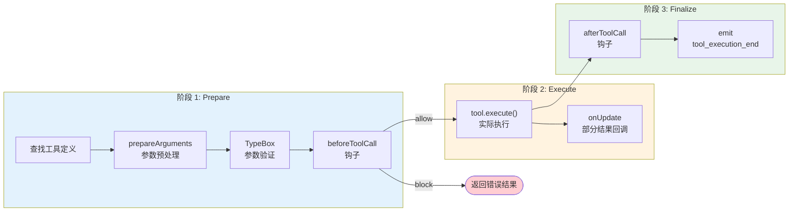

# 第 9 章：工具执行不是插件调用

> **定位**：本章解剖循环引擎中工具执行管道的三阶段设计。
> 前置依赖：第 8 章（agentLoop 双层循环）。
> 适用场景：当你想理解 pi 如何让工具调用既安全又灵活，或者想为自己的 agent 系统设计工具执行策略。

## 为什么工具调用不能简单地"调一下"？

上一章展示了 `runLoop()` 如何在内层循环中调用 `executeToolCalls()`。那个调用看起来只是一行代码：

```typescript
const toolResults = await executeToolCalls(
  currentContext, message, config, signal, emit
);
```

但如果展开 `executeToolCalls()`，你会发现它并不是简单地"找到工具，传参数，拿结果"。它是一条精心设计的三阶段管道：**prepare → execute → finalize**。

为什么需要三阶段？因为工具执行面临三个现实问题：

1. **LLM 会犯错**。模型可能调用一个不存在的工具，传入格式错误的参数，甚至调用被禁止的工具。这些错误必须在执行之前被拦截。
2. **执行过程需要被观测**。安全审计、权限控制、速率限制 — 这些横切关注点需要在执行前后有插入点。
3. **多个工具调用的执行策略不同**。LLM 一次可能返回多个工具调用，串行还是并行执行，不同场景有不同的最优策略。

三阶段管道为每个问题提供了解决位置。

## 三阶段管道

让我们用一张图看清整条管道：



### 阶段 1：Prepare — 在执行之前把一切验证完

`prepareToolCall()` 是第一阶段的入口。它做三件事，任何一件失败都会产生一个 `immediate` 结果（跳过执行，直接返回错误）：

```typescript
// packages/agent/src/agent-loop.ts:472-522（简化）

async function prepareToolCall(
  currentContext, assistantMessage, toolCall, config, signal
): Promise<PreparedToolCall | ImmediateToolCallOutcome> {
  // 1. 查找工具 — 模型调了个不存在的工具？
  const tool = currentContext.tools?.find(t => t.name === toolCall.name);
  if (!tool) {
    return {
      kind: "immediate",
      result: createErrorToolResult(
        `Tool ${toolCall.name} not found`
      ),
      isError: true,
    };
  }

  try {
    // 2. 参数验证 — 模型传了错误的参数格式？
    const preparedToolCall = prepareToolCallArguments(tool, toolCall);
    const validatedArgs = validateToolArguments(tool, preparedToolCall);

    // 3. beforeToolCall 钩子 — 上层说不许执行？
    if (config.beforeToolCall) {
      const beforeResult = await config.beforeToolCall(
        { assistantMessage, toolCall, args: validatedArgs, context },
        signal,
      );
      if (beforeResult?.block) {
        return {
          kind: "immediate",
          result: createErrorToolResult(
            beforeResult.reason || "Tool execution was blocked"
          ),
          isError: true,
        };
      }
    }

    // 全部通过，返回"已准备好"的工具调用
    return { kind: "prepared", toolCall, tool, args: validatedArgs };
  } catch (error) {
    // 验证失败或钩子抛异常 → 转为 immediate 错误结果
    return {
      kind: "immediate",
      result: createErrorToolResult(
        error instanceof Error ? error.message : String(error)
      ),
      isError: true,
    };
  }
}
```

注意整个 prepare 体被 try-catch 包裹。这保证了不论是 `validateToolArguments` 抛出验证错误、还是 `beforeToolCall` 钩子意外崩溃，结果都是一个 `immediate` 错误 — 循环不会中断。

返回类型的设计也值得关注：`PreparedToolCall | ImmediateToolCallOutcome`。这是一个判别联合（discriminated union），用 `kind` 字段区分两种情况：

- `kind: "prepared"` — 验证通过，可以执行
- `kind: "immediate"` — 验证失败，直接返回错误结果，跳过执行阶段

这个设计让调用者不需要 try-catch。检查 `kind` 就知道下一步该做什么。

**`prepareArguments` 的用途**：有些工具需要在验证之前预处理参数。比如 edit 工具需要把旧版 API 的 `oldText`/`newText` 顶层字段转换成新的 `edits[]` 数组格式。这个钩子允许工具自己做参数兼容性处理。

**`validateToolArguments` 的作用**：使用 TypeBox schema 做运行时验证。如果模型传了 `{ path: 123 }` 而 schema 要求 `path` 是 string，验证会失败，循环返回一个清晰的错误信息给模型，模型有机会在下一轮修正。

**`beforeToolCall` 钩子的位置选择**：注意它在参数验证**之后**。这意味着钩子拿到的 `args` 是已验证的、类型安全的。钩子不需要自己做参数验证。同时，钩子可以访问完整的 `context`（包括之前的消息历史），这让基于上下文的安全策略成为可能 — 比如"如果模型在最近 3 轮内已经修改了 5 个文件，阻止进一步的写操作"。

### 阶段 2：Execute — 实际运行工具

只有通过 prepare 阶段的工具调用才会进入 execute：

```typescript
// packages/agent/src/agent-loop.ts:524-559（简化）

async function executePreparedToolCall(
  prepared: PreparedToolCall,
  signal: AbortSignal | undefined,
  emit: AgentEventSink,
): Promise<ExecutedToolCallOutcome> {
  const updateEvents: Promise<void>[] = [];

  try {
    const result = await prepared.tool.execute(
      prepared.toolCall.id,
      prepared.args,
      signal,
      (partialResult) => {
        updateEvents.push(
          Promise.resolve(emit({
            type: "tool_execution_update",
            toolCallId: prepared.toolCall.id,
            toolName: prepared.toolCall.name,
            args: prepared.toolCall.arguments,
            partialResult,
          }))
        );
      },
    );
    await Promise.all(updateEvents);
    return { result, isError: false };
  } catch (error) {
    await Promise.all(updateEvents);
    return {
      result: createErrorToolResult(
        error instanceof Error ? error.message : String(error)
      ),
      isError: true,
    };
  }
}
```

这个阶段相对直接，但有两个设计细节值得注意：

**1. `onUpdate` 回调**。工具执行可能是长时间运行的（比如一个 bash 命令）。`onUpdate` 让工具可以在执行过程中发射部分结果，这些部分结果通过事件流传递给 UI，让用户看到实时进度。注意 `updateEvents` 数组 — 所有 update 事件的 Promise 都被收集起来，在工具执行完成后 `await Promise.all(updateEvents)` 确保所有事件都被发射完毕。

**2. 这里允许 try-catch**。和 `AgentLoopConfig` 的回调不同（它们要求"must not throw"），工具的 `execute` 方法是**允许抛异常的**。`AgentTool` 接口的文档明确说明："Throw on failure instead of encoding errors in content." 循环引擎会捕获异常并转换为 `isError: true` 的结果。

为什么工具允许抛异常？因为工具是外部代码 — 它可能是用户通过 extension 注册的，pi 不能假设它会正确处理所有错误。循环引擎对工具做了 try-catch 兜底。同样，`beforeToolCall` 和 `afterToolCall` 钩子也被 try-catch 保护，因为它们也可能来自 extension 代码。

相比之下，`convertToLlm`、`transformContext` 等消息管道回调有明确的"must not throw"契约（详见第 8 章），因为它们是系统内部代码，循环引擎不对它们做防御性捕获。

### 阶段 3：Finalize — 执行后审计和修改

```typescript
// packages/agent/src/agent-loop.ts:561-595（简化）

async function finalizeExecutedToolCall(
  currentContext, assistantMessage, prepared, executed,
  config, signal, emit,
): Promise<ToolResultMessage> {
  let result = executed.result;
  let isError = executed.isError;

  // afterToolCall 钩子：可以修改结果
  if (config.afterToolCall) {
    const afterResult = await config.afterToolCall(
      { assistantMessage, toolCall: prepared.toolCall,
        args: prepared.args, result, isError, context },
      signal,
    );
    if (afterResult) {
      result = {
        content: afterResult.content ?? result.content,
        details: afterResult.details ?? result.details,
      };
      isError = afterResult.isError ?? isError;
    }
  }

  return emitToolCallOutcome(prepared.toolCall, result, isError, emit);
}
```

`afterToolCall` 钩子的设计非常精妙。它的返回值是**部分覆盖**语义：

- 返回 `undefined` → 不修改任何东西
- 返回 `{ content: [...] }` → 只替换 content，保留原来的 details 和 isError
- 返回 `{ isError: false }` → 只把错误标记改为成功，保留原来的 content 和 details

这种"字段级覆盖"设计让钩子可以做非常精确的修改：

- **安全审计**：记录工具调用日志，但不修改结果（返回 undefined）
- **敏感信息脱敏**：替换 content 中的 API key、密码等（返回 `{ content: [...] }`）
- **错误降级**：某些工具的"错误"其实是预期的（比如 grep 没找到匹配），改 isError 为 false
- **结果增强**：在 details 中注入额外元数据供 UI 展示

## Parallel vs Sequential：两种执行策略

当 LLM 一次返回多个工具调用时，pi 提供了两种执行策略：

```typescript
// packages/agent/src/agent-loop.ts:336-348

async function executeToolCalls(...) {
  if (config.toolExecution === "sequential") {
    return executeToolCallsSequential(...);
  }
  return executeToolCallsParallel(...);  // 默认
}
```

两种策略的差异不只是"串行 vs 并行"那么简单。让我们对比它们的执行时序：

```mermaid
sequenceDiagram
    participant Loop as Agent Loop
    participant P as Prepare
    participant E as Execute
    participant F as Finalize

    Note over Loop: === Sequential 模式 ===
    Loop->>P: prepare(tool_1)
    P-->>E: prepared
    E-->>F: executed
    F-->>Loop: result_1
    Loop->>P: prepare(tool_2)
    P-->>E: prepared
    E-->>F: executed
    F-->>Loop: result_2

    Note over Loop: === Parallel 模式 ===
    Loop->>P: prepare(tool_1)
    P-->>Loop: prepared_1
    Loop->>P: prepare(tool_2)
    P-->>Loop: prepared_2
    Loop->>E: execute(prepared_1) 同时
    Loop->>E: execute(prepared_2) 同时
    E-->>F: executed_1
    F-->>Loop: result_1
    E-->>F: executed_2
    F-->>Loop: result_2
```

**Sequential 模式**：每个工具调用独立完成整条管道（prepare → execute → finalize），然后才开始下一个。简单、可预测、但慢。

**Parallel 模式**的设计更微妙。它**不是**完全并行的：

1. **Prepare 阶段串行**。所有工具调用按顺序通过 prepare，包括参数验证和 `beforeToolCall` 钩子（这些字段都定义在第 8 章介绍的 `AgentLoopConfig` 中）。串行 prepare 保证了钩子调用的**确定性顺序** — 钩子可以基于"第几个工具调用"做决策（比如"同一个 turn 中最多允许 3 次文件写操作"），而不需要担心并发导致的非确定性。
2. **Execute 阶段并行**。所有通过 prepare 的工具调用同时开始执行。
3. **Finalize 阶段按源顺序**。结果按 LLM 返回的工具调用顺序（不是执行完成顺序）进行 finalize 和事件发射。

来看代码中 parallel 模式的关键段落：

```typescript
// packages/agent/src/agent-loop.ts:390-438（简化）

async function executeToolCallsParallel(...) {
  const results: ToolResultMessage[] = [];
  const runnableCalls: PreparedToolCall[] = [];

  // 串行 prepare
  for (const toolCall of toolCalls) {
    const preparation = await prepareToolCall(...);
    if (preparation.kind === "immediate") {
      results.push(await emitToolCallOutcome(...));
    } else {
      runnableCalls.push(preparation);
    }
  }

  // 并行 execute（同时启动所有）
  const runningCalls = runnableCalls.map((prepared) => ({
    prepared,
    execution: executePreparedToolCall(prepared, signal, emit),
  }));

  // 按源顺序 finalize
  for (const running of runningCalls) {
    const executed = await running.execution;
    results.push(
      await finalizeExecutedToolCall(..., running.prepared, executed, ...)
    );
  }

  return results;
}
```

注意第二步的 `runnableCalls.map(...)` — 它在创建 `runningCalls` 数组时就调用了 `executePreparedToolCall()`。这意味着所有 execute 调用在 `map` 完成时就已经开始了（Promise 被创建了）。然后第三步的 `for` 循环按顺序 `await` 每个 Promise — 如果第二个工具比第一个先完成，它的结果会等到第一个 finalize 完之后才被处理。

**为什么 finalize 要按源顺序？**

因为 `afterToolCall` 钩子需要访问 `context`（包括之前的工具结果）。如果 finalize 按完成顺序处理，钩子看到的 context 就是非确定性的 — 同样的输入在不同运行中可能看到不同的 context 状态。按源顺序 finalize 保证了确定性。

## 取舍分析

### 三阶段管道的收益

**1. 钩子增加了系统的可观测性和可控性**。`beforeToolCall` 让产品层可以实现权限弹窗（"允许执行 bash？"）、速率限制、安全策略。`afterToolCall` 让产品层可以实现审计日志、敏感信息脱敏、结果增强。这些横切关注点不需要修改循环引擎的代码。

**2. 参数验证把模型的错误变成可恢复的对话**。当 TypeBox 验证失败时，循环把清晰的错误信息作为工具结果返回给模型。模型在下一轮可以修正参数重试。如果没有验证，错误的参数会导致工具内部崩溃，产生不可恢复的失败。

**3. parallel 模式的"prepare 串行 + execute 并行"兼顾了安全和性能**。串行 prepare 保证安全检查的一致性，并行 execute 减少了多工具调用的等待时间。

### 三阶段管道的代价

**1. 当提供了钩子时，每次工具调用都有额外的异步开销**。循环引擎会先检查 `config.beforeToolCall` 是否存在，存在才 `await` 调用。所以不提供钩子时没有开销。但一旦提供了钩子 — 即使它每次都返回 undefined（不做任何修改）— `await` 的异步调度成本就会叠加。对于高频、低延迟的工具调用场景，这个开销值得注意。

**2. 钩子异常被 try-catch 防御，但代价是静默失败**。与第 8 章介绍的消息变换管道回调不同（它们有明确的"must not throw"契约），`beforeToolCall` 和 `afterToolCall` 被循环引擎的 try-catch 包裹。钩子抛异常不会终止循环，但异常会被转换为工具错误结果 — 这意味着钩子的 bug 可能表现为"工具莫名失败"，而不是清晰的错误信息。

**3. parallel 模式下，工具之间无法共享中间状态**。并行执行的工具彼此独立，无法看到对方的执行结果。如果两个工具调用之间有依赖关系（比如"先读文件再编辑"），parallel 模式会产生竞态。pi 的解决方案是让 LLM 自己管理依赖 — 如果两个操作有依赖，LLM 应该在两个不同的 turn 中分别发起。

## 一个具体场景：读文件 + 编辑文件

让我们用一个真实场景把三阶段管道串起来。假设 LLM 在一个 turn 中同时返回了两个工具调用：`read` 和 `edit`（parallel 模式）。

**Prepare 阶段**（串行）：

1. 循环 emit `tool_execution_start` for `read` — 注意这发生在 prepare **之前**，所以即使工具最终验证失败，UI 也能看到"正在准备"的状态
2. `read` 通过 prepare：工具存在 → TypeBox 验证 path 是 string → `beforeToolCall` 检查文件权限 → 返回 `kind: "prepared"`
3. 循环 emit `tool_execution_start` for `edit`
4. `edit` 通过 prepare：工具存在 → TypeBox 验证 edits 数组格式 → `beforeToolCall` 检查不在禁止列表 → 返回 `kind: "prepared"`

**Execute 阶段**（并行）：

5. `read.execute()` 和 `edit.execute()` 同时启动
6. `read` 先完成（只是读磁盘），但它的结果**等待**被 finalize
7. `edit` 后完成（要写磁盘），它的结果也等待被 finalize

**Finalize 阶段**（按源顺序）：

8. 先 finalize `read` 的结果 — `afterToolCall` 可以脱敏文件内容
9. 再 finalize `edit` 的结果 — `afterToolCall` 可以记录审计日志

注意一个微妙之处：如果两个工具调用中，`read` 的 prepare 失败了（比如 `beforeToolCall` 阻止了它），它的错误结果会在 prepare 循环中**立即**被加入 `results` 数组。然后 `edit` 继续 prepare 和 execute。最终 `results` 数组的顺序是：`read`（prepare 阶段的 immediate 结果）→ `edit`（execute + finalize 的结果）。

这个设计的核心判断是：**工具执行不是一个独立的子系统，而是循环的有机组成部分。** 三阶段管道让循环引擎在不增加核心复杂度的前提下，为上层提供了精确的控制点。

---

### 版本演化说明

> 本章核心分析基于 pi-mono v0.66.0。三阶段管道自引入以来结构稳定。
> `parallel` 执行模式在较早版本中作为默认策略引入，取代了最初的纯 `sequential` 模式。
> `prepareArguments` 钩子是后来为支持 edit 工具 API 演进而添加的。