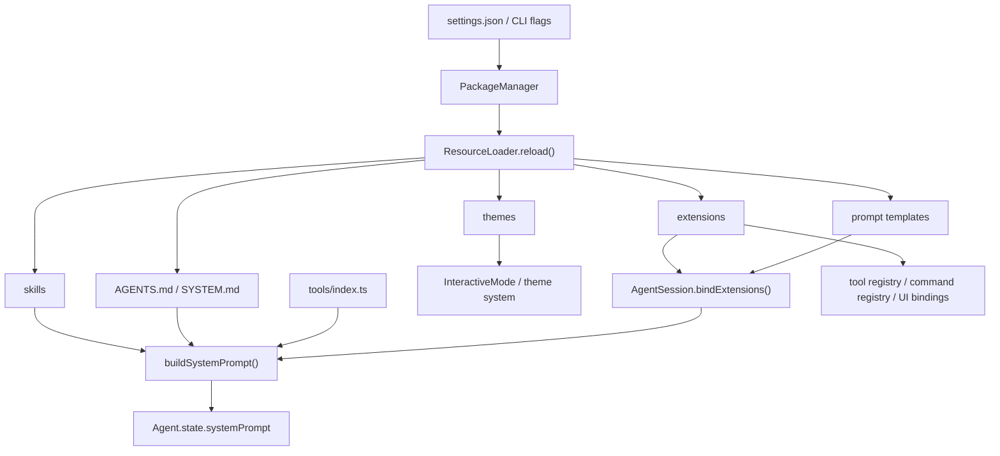
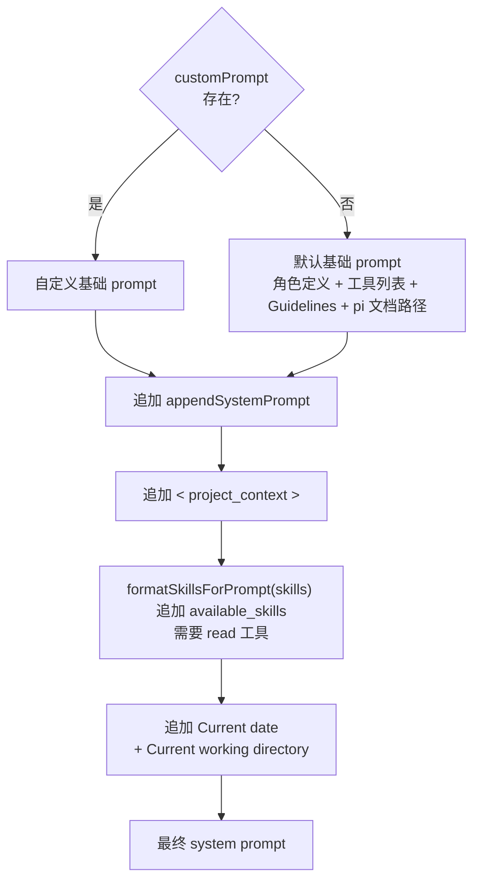
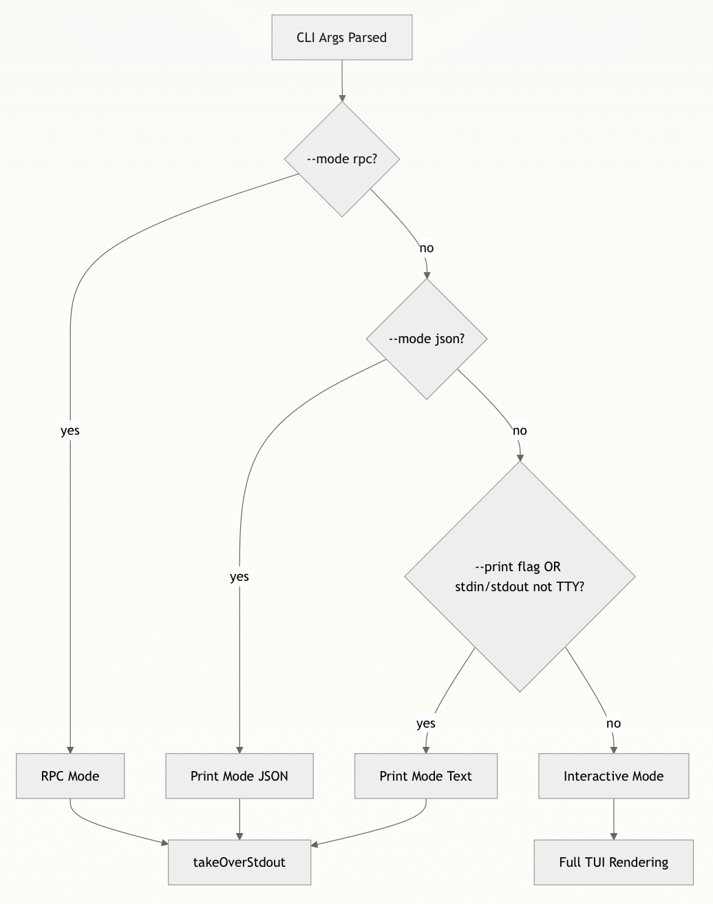

# [pi-coding-agent](https://github.com/earendil-works/pi-mono/tree/main/packages/coding-agent)

整个 pi monorepo 的**产品层 / 运行时编排层**。

如果说：

- `pi-ai` 解决的是"怎么和不同 LLM provider 说话"
- `pi-agent-core` 解决的是"怎么跑一轮 agent loop、怎么调工具、怎么维护消息状态"

那么 `pi-coding-agent` 解决的就是：

> **怎么把统一模型层和通用 agent loop 装配成一个可长期工作、可持久化、可扩展、可交互的 coding agent 产品。**

它对上暴露的是：

- CLI 产品入口 `pi`
- SDK 编程入口 `createAgentSession()` / `createAgentSessionRuntime()`
- 交互模式、print 模式、RPC 模式
- 会话树、压缩、分支、配置、system prompt、extension、skills、tools 这一整套产品机制

它对下负责的是：

- 调 `pi-ai` 找模型、拿认证、发请求、做流式输出
- 调 `pi-agent-core` 驱动 agent loop 和 tool call
- 把会话持久化到 JSONL
- 把 AGENTS.md / SYSTEM.md / skills / extensions / themes / prompts 这些外部资源装进运行时
- 把 TUI、CLI、RPC 这些不同 I/O 外壳接到同一个会话核心上

---

## 一个最小例子

先看最小编程接口，建立直觉：

```typescript
import { createAgentSession } from "@earendil-works/pi-coding-agent";

const { session } = await createAgentSession();

session.subscribe((event) => {
  if (event.type === "message_update") {
    // 这里可以接自己的 UI
  }
});

await session.prompt("帮我阅读当前项目的入口并解释启动流程");
```

这个例子背后，`pi-coding-agent` 已经替你做了很多产品层工作：

- 选择和恢复 session
- 装载默认工具
- 加载 settings / AGENTS.md / SYSTEM.md / skills / extensions
- 恢复模型与 thinking level
- 组装 system prompt
- 将所有消息和状态写回 session 文件

---

## 整个包的分层图

`packages/coding-agent/src` 可以粗分成六层：

```text
六、产品外壳层
    cli.ts: Node CLI 真正入口，负责进程级初始化后转给 main.ts
    main.ts: 启动编排器，负责参数解析、session 选择、runtime 创建、模式分发
    
    bun/cli.ts: Bun 打包产物入口壳，解决 Bun 环境下的启动适配
    bun/restore-sandbox-env.ts: Bun 沙箱环境变量恢复，解决 Bun 打包后环境差异
    
    config.ts: 全局常量定义（APP_NAME、路径、环境变量 key、版本检查等）
    migrations.ts: 应用级数据迁移（旧版本目录结构升级等）
    index.ts: 公共 API 聚合导出，定义对外的模块边界
    package-manager-cli.ts: 包管理 CLI 入口，独立于主 agent 进程运行
    
    cli/args.ts: CLI 参数类型定义和解析（--model、--session、--resume 等所有 flag）
    cli/config-selector.ts: 启动时配置源选择（交互式或参数驱动）
    cli/file-processor.ts: 文件参数处理器（--file 传入的文件预处理）
    cli/initial-message.ts: 启动时的初始消息处理（--prompt / 管道输入等）
    cli/list-models.ts: --list-models 命令实现，列出所有可用 provider/model
    cli/session-picker.ts: --resume 的交互式会话选择器 UI

五、运行模式层
    modes/index.ts: 运行模式统一导出
    modes/print-mode.ts: 一次性执行壳，把 session 输出成纯文本或 JSON 事件流
    modes/interactive/interactive-mode.ts: 交互式 TUI 主控制器，管理输入循环和组件编排
    modes/interactive/theme/theme.ts: 主题系统，管理颜色方案和 UI 样式
    modes/interactive/components/index.ts: 组件导出聚合
    modes/interactive/components/assistant-message.ts: 助手消息渲染组件
    modes/interactive/components/user-message.ts: 用户消息渲染组件
    modes/interactive/components/user-message-selector.ts: 用户消息选择器（/resume 时选择起点）
    modes/interactive/components/custom-message.ts: 自定义消息渲染组件
    modes/interactive/components/custom-editor.ts: 自定义编辑器组件（command mode）
    modes/interactive/components/footer.ts: 状态栏组件（token/费用/耗时显示）
    modes/interactive/components/settings-selector.ts: /settings 配置面板
    modes/interactive/components/model-selector.ts: /model 切换面板
    modes/interactive/components/scoped-models-selector.ts: Ctrl+P 限定模型切换面板
    modes/interactive/components/thinking-selector.ts: /thinking 思维级别切换面板
    modes/interactive/components/auth-selector.ts: /login 认证提供方选择面板
    modes/interactive/components/theme-selector.ts: /theme 主题切换面板
    modes/interactive/components/tree-selector.ts: /tree 会话树导航面板
    modes/interactive/components/session-selector.ts: /session 会话列表面板
    modes/interactive/components/session-selector-search.ts: 会话搜索过滤
    modes/interactive/components/config-selector.ts: 配置选项选择器
    modes/interactive/components/extension-selector.ts: 扩展选择面板
    modes/interactive/components/extension-input.ts: 扩展输入组件
    modes/interactive/components/extension-editor.ts: 扩展编辑器组件
    modes/interactive/components/show-images-selector.ts: 图片显示配置面板
    modes/interactive/components/bash-execution.ts: bash 命令执行 UI 组件
    modes/interactive/components/tool-execution.ts: 工具调用执行状态 UI
    modes/interactive/components/diff.ts: 代码 diff 渲染组件
    modes/interactive/components/skill-invocation-message.ts: 技能调用消息渲染
    modes/interactive/components/compaction-summary-message.ts: 压缩摘要消息渲染
    modes/interactive/components/branch-summary-message.ts: 分支摘要消息渲染
    modes/interactive/components/keybinding-hints.ts: 快捷键提示组件
    modes/interactive/components/login-dialog.ts: 登录对话框
    modes/interactive/components/dynamic-border.ts: 动态边框渲染
    modes/interactive/components/bordered-loader.ts: 带边框的加载动画
    modes/interactive/components/countdown-timer.ts: 倒计时组件（重试延迟显示）
    modes/interactive/components/visual-truncate.ts: 可视化截断组件
    modes/interactive/components/armin.ts: armin 特效组件
    modes/interactive/components/earendil-announcement.ts: 公告栏组件
    modes/rpc/rpc-mode.ts: headless RPC 模式主控制器，把 AgentSessionRuntime 暴露为 JSONL 协议
    modes/rpc/rpc-types.ts: RPC 协议类型定义（请求/响应/事件类型）
    modes/rpc/rpc-client.ts: RPC 客户端实现，管理 stdin/stdout JSONL 通信
    modes/rpc/jsonl.ts: JSONL 解析与序列化工具

四、会话运行时层
    core/agent-session-runtime.ts: 当前激活 session 的宿主，负责 new/resume/fork/import/switch
    core/agent-session-services.ts: cwd 绑定的基础设施工厂，集中创建 settings、auth、model registry、resource loader
    core/sdk.ts: 会话装配入口，把模型、工具、session manager、resource loader 拼成 AgentSession
    core/agent-session.ts: 产品核心对象，负责 prompt、持久化、扩展绑定、bash、compaction、tree navigation

三、产品机制层
    core/session-manager.ts: session tree、JSONL entry 持久化、上下文重建
    core/compaction/*: 长对话压缩、branch summary、文件操作摘要和切点计算
    core/settings-manager.ts: 全局/项目 settings 加载、深度合并、迁移与持久化
    core/system-prompt.ts: 把工具、context files、skills、日期、cwd 拼成最终 system prompt
    core/resource-loader.ts: 统一装载 extensions、skills、prompts、themes、AGENTS.md、SYSTEM.md
    core/model-registry.ts: provider/model 注册表，API key 解析和模型发现
    core/model-resolver.ts: 默认模型选择、CLI 覆盖、scoped models 优先级解析
    core/prompt-templates.ts: prompt template 的发现、解析与运行时展开
    core/package-manager.ts: 把 settings 中声明的包来源（npm/git/local）解析成资源路径
    core/bash-executor.ts: bash 命令执行引擎，在伪终端中运行命令并流式返回输出
    core/exec.ts: 子进程生命周期封装，管理 spawn/kill/signal 和输出缓冲
    core/messages.ts: 自定义消息类型编码（BashExecutionMessage/CustomMessage）与转换器
    core/slash-commands.ts: 斜杠命令解析与路由（/model /session /settings /name 等）
    core/keybindings.ts: 快捷键常量和默认绑定（Ctrl+P/Ctrl+O/Escape 等）及处理函数
    core/output-guard.ts: 模型输出守卫，拦截敏感信息、过滤无效输出
    core/session-cwd.ts: session 文件头中的 cwd 解析与恢复

二、扩展与工具层
    core/extensions/*: extension 协议定义、加载器、运行器和桥接层
    core/extensions/types.ts: extension 类型系统（Extension、ExtensionRuntime、事件/钩子接口）
    core/extensions/loader.ts: extension 加载器，从文件系统加载 d.ts/js 扩展代码
    core/extensions/runner.ts: extension 运行时，管理生命周期和事件分发
    core/extensions/wrapper.ts: extension 包装器，给 agent 暴露 API 入口
    core/extensions/index.ts: extension 模块统一导出
    core/skills.ts: skill 发现、frontmatter 解析、冲突处理和 <available_skills> 注入
    core/tools/index.ts: 内建工具集合统一导出和注册
    core/tools/read.ts: 文件读取工具（schema + 执行逻辑）
    core/tools/edit.ts: 文件编辑工具（基于 SearchReplace 模式）
    core/tools/write.ts: 文件写入工具
    core/tools/bash.ts: bash 命令执行工具
    core/tools/grep.ts: 文本搜索工具（ripgrep 封装）
    core/tools/find.ts: 文件名搜索工具
    core/tools/ls.ts: 目录列表工具
    core/tools/edit-diff.ts: 编辑差异生成和预览
    core/tools/tool-definition-wrapper.ts: AgentTool → ToolDefinition 包装器
    core/tools/file-mutation-queue.ts: 文件变更队列，管理批量编辑的顺序执行
    core/tools/output-accumulator.ts: 工具输出累积器，聚集流式输出为完整结果
    core/tools/truncate.ts: 输出截断工具，防止过大的工具结果爆上下文
    core/tools/render-utils.ts: 工具结果渲染辅助函数
    core/tools/path-utils.ts: 路径安全检查与规范化

一、基础支撑层
    core/event-bus.ts: 轻量事件总线，给扩展和运行时传播内部事件
    core/messages.ts: 消息内容辅助逻辑和消息级工具函数
    core/timings.ts: 耗时统计，记录工具调用、LLM 请求、压缩各阶段耗时
    core/diagnostics.ts: 诊断信息收集，/diagnostics 命令的数据来源
    core/auth-storage.ts: API 密钥持久化存储，支持加密和跨进程共享
    core/auth-guidance.ts: 认证引导文案生成，未登录时的提示信息
    core/telemetry.ts: 匿名遥测数据收集和上报
    core/footer-data-provider.ts: 状态栏数据计算（token 数、费用、耗时等）
    core/http-dispatcher.ts: HTTP 请求调度器，管理重试、超时和并发
    core/resolve-config-value.ts: 配置值解析工具，统一处理 env var 和 settings 读取
    core/provider-display-names.ts: provider ID 到展示名称的映射（如 anthropic-vertex → Anthropic）
    core/source-info.ts: 工具来源标识（builtin / extension / sdk-custom）
    core/defaults.ts: 全局默认常量（默认模型、超时、路径等兜底值）
    core/index.ts: core 模块公共 API 聚合导出
    utils/ansi.ts: ANSI 转义序列处理
    utils/changelog.ts: changelog 版本检查和展示
    utils/child-process.ts: 子进程管理辅助
    utils/clipboard.ts: 剪贴板操作（统一接口）
    utils/clipboard-image.ts: 剪贴板图片提取
    utils/clipboard-native.ts: 平台原生剪贴板
    utils/exif-orientation.ts: 图片 EXIF 方向处理
    utils/frontmatter.ts: Markdown frontmatter 解析
    utils/fs-watch.ts: 文件系统监听
    utils/git.ts: git 操作辅助
    utils/html.ts: HTML 导出辅助
    utils/image-convert.ts: 图片格式转换
    utils/image-resize.ts: 图片尺寸调整
    utils/image-resize-core.ts: 图片缩放核心算法
    utils/image-resize-worker.ts: 图片缩放 Worker 线程
    utils/mime.ts: MIME 类型检测
    utils/paths.ts: 路径处理工具
    utils/photon.ts: 终端渲染底层库
    utils/pi-user-agent.ts: HTTP User-Agent 生成
    utils/shell.ts: shell 环境检测和配置（PS1、ANSI 支持等）
    utils/sleep.ts: sleep 工具函数
    utils/syntax-highlight.ts: 代码语法高亮
    utils/tools-manager.ts: 工具生命周期管理器
    utils/version-check.ts: 版本检查（新版本通知）
    utils/windows-self-update.ts: Windows 自助更新
```

```
┌───────────────────────────────────────────────────────────────────────────┐
│                         六、产品外壳层                                      │
│                                                                           │
│   cli.ts                      main.ts                     bun/cli.ts      │
│   (Node CLI 入口) ────────→ (启动编排器) ←──────────── (Bun 适配入口)         │
│   进程级初始化               参数解析 / session选择                           │
│                              runtime创建 / 模式分发                         │
│                                    │                                      │
├────────────────────────────────────┼──────────────────────────────────────┤
│                         五、运行模式层                                      │
│                                    │                                      │
│         ┌──────────────────────────┼──────────────────────────┐           │
│         ▼                          ▼                          ▼           │
│  modes/interactive/*       modes/print-mode.ts        modes/rpc/*         │
│  ┌──────────────────┐    ┌──────────────────┐    ┌──────────────────┐     │
│  │ InteractiveMode  │    │ PrintMode        │    │ RpcServer        │     │
│  │ (交互式 TUI 壳)   │    │ (一次性执行壳)     │    │ (headless JSONL) │     │
│  │                  │    │                  │    │                  │     │
│  │ • settings-select│    │ • --print-events │    │ • JSONL 协议      │     │
│  │ • 主题系统        │    │ • --print-latest  │    │ • stdin/stdout  │     │
│  │ • 组件系统        │    │ • 管道模式         │    │ • 外部集成        │     │
│  └────────┬─────────┘    └────────┬─────────┘    └────────┬─────────┘     │
│           │                       │                       │               │
│           └───────────────────────┼───────────────────────┘               │
│                                   │                                       │
├───────────────────────────────────┼───────────────────────────────────────┤
│                       四、会话运行时层                                       │
│                                   │                                       │
│  ┌────────────────────────────────┼──────────────────────────────────┐    │
│  │                    AgentSessionRuntime (组合容器)                   │   │
│  │                                                                    │   │
│  │  fork() / newSession() / switchSession() / resume() / import()     │   │
│  │    └→ 销毁旧 session → 重新走完整创建链路 → 替换 .session               │   │
│  │                                                                    │   │
│  │  ┌───────────────────────────────────────────────────────────┐     │   │
│  │  │              agent-session-services.ts                    │     │   │
│  │  │           (cwd 绑定的基础设施工厂)                           │     │   │
│  │  │                                                           │     │   │
│  │  │  createAgentSessionServices()                             │     │   │
│  │  │    → AuthStorage / SettingsManager / ModelRegistry        │     │   │
│  │  │    → DefaultResourceLoader / Extension加载                 │     │   │
│  │  │                                                           │     │   │
│  │  │  createAgentSessionFromServices()                         │     │   │
│  │  │    → 模型分辨率 / 工具注册 / 参数合并                         │     │   │
│  │  │    └──────────────────────┐                               │    │   │
│  │  └───────────────────────────┼───────────────────────────────┘    │   │
│  │                              ▼                                    │   │
│  │  ┌──────────────────────────────────────────────────────────┐     │   │
│  │  │                     sdk.ts (唯一工厂)                     │     │   │
│  │  │                 createAgentSession(options)              │     │   │
│  │  │                                                          │     │   │
│  │  │  new Agent(...) + new AgentSession({...})                │     │   │
│  │  │                                                          │     │   │
│  │  │  ┌──────────────────────────────────────────────────┐    │     │   │
│  │  │  │              AgentSession (核心对象)              │    │     │   │
│  │  │  │                                                  │    │     │   │
│  │  │  │  session.start()  /  session.submit()            │    │     │   │
│  │  │  │  session.interrupt()  /  session.pause()         │    │     │   │
│  │  │  │                                                  │    │     │   │
│  │  │  │  组装并持有以下全部产品机制层模块 ────────────────────┼┐   │     │   │
│  │  │  └──────────────────────────────────────────────────┘│   │     │   │
│  │  └──────────────────────────────────────────────────────┼───┘     │   │
│  └─────────────────────────────────────────────────────────┼─────────┘   │
│                                                            │             │
├────────────────────────────────────────────────────────────┼─────────────┤
│                       三、产品机制层                         │             │
│                                                            │             │
│  ┌────────────────────────┐  ┌──────────────────────────┐  │             │
│  │   session-manager.ts   │  │   settings-manager.ts    │  │             │
│  │                        │  │                          │  │             │
│  │  • session tree        │  │  • global/project merge  │  │             │
│  │  • JSONL 追加式持久化    │  │  • 脏字段追踪增量写入       │  │             │
│  │  • branch / fork       │  │  • 文件锁保护 (withLock)   │  │             │
│  │  • buildSessionContext │  │  • 序列化写入队列           │  │             │
│  │  • 9 种 Entry 类型      │  │  • 版本迁移                │  │             │
│  └────────────────────────┘  └──────────────────────────┘  │             │
│                                                            │             │
│  ┌───────────────────────┐  ┌──────────────────────────┐   │             │
│  │  compaction/*         │  │   resource-loader.ts     │   │             │
│  │                       │  │                          │   │             │
│  │  • 长对话压缩          │  │  • extensions 统一装载     │◄──┘             │
│  │  • branch summary     │  │  • skills / prompts      │                 │
│  │  • 文件操作摘要         │  │  • themes / AGENTS.md    │                 │
│  │  • 切点计算            │  │  • SYSTEM.md 上下文       │                 │
│  └───────────────────────┘  └──────────────────────────┘                 │
│                                                                          │
│  ┌───────────────────────┐  ┌──────────────────────────┐                 │
│  │   system-prompt.ts    │  │  model-registry.ts       │                 │
│  │                       │  │  model-resolver.ts       │                 │
│  │  • tools + context    │  │                          │                 │
│  │  • skills 注入         │  │  • provider/model 可见性  │                 │
│  │  • guidelines 格式化   │  │  • 默认模型解析            │                 │
│  │  • 日期 / cwd 拼接     │  │  • CLI 覆盖 / scoped      │                 │
│  └───────────────────────┘  └──────────────────────────┘                 │
│                                                                          │
│  ┌───────────────────────┐  ┌──────────────────────────┐                 │
│  │  prompt-templates.ts  │  │  package-manager.ts      │                 │
│  │  • 模板发现与解析       │  │  • package 来源 → 资源     │                 │
│  │  • 变量展开            │  │  • 路径解析与缓存           │                 │
│  └───────────────────────┘  └──────────────────────────┘                 │
│                                                                          │
├──────────────────────────────────────────────────────────────────────────┤
│                       二、扩展与工具层                                      │
│                                                                          │
│  ┌───────────────────────┐  ┌──────────────────────────┐                 │
│  │  extensions/*         │  │   skills.ts              │                 │
│  │                       │  │                          │                 │
│  │  • extension 协议      │  │  • SKILL.md 发现与解析    │                 │
│  │  • 加载器 / 运行器      │  │  • frontmatter 提取      │                  │
│  │  • 桥接层 (生命周期)    │  │  • 冲突处理 / 去重         │                 │
│  │  • 自定义工具注册       │  │  • available_skills 注入  │                 │
│  └───────────────────────┘  └──────────────────────────┘                 │
│                                                                          │
│  ┌────────────────────────────────────────────────────────────────┐      │
│  │                       tools/*                                  │      │
│  │                                                                │      │
│  │  read.ts / edit.ts / write.ts / bash.ts / find.ts / grep.ts    │      │
│  │  ls.ts / glob.ts / web-search.ts / web-fetch.ts / task.ts      │      │
│  │                                                                │      │
│  │  • 工具 schema 定义 + 执行逻辑                                    │      │
│  │  • 权限控制 / 路径安全检查                                         │      │
│  │  • agent → tool call → toolResult 三角                          │      │
│  └────────────────────────────────────────────────────────────────┘      │
│                                                                          │
├──────────────────────────────────────────────────────────────────────────┤
│                       一、基础支撑层                                        │
│                                                                           │
│  ┌──────────────┐ ┌──────────────┐ ┌──────────────┐ ┌──────────────┐      │
│  │  utils/*     │ │  event-bus   │ │  messages    │ │  timings     │      │
│  │              │ │              │ │              │ │  diagnostics │      │
│  │  • shell     │ │  • 轻量事件   │ │  • 消息辅助   │ │  • 耗时统计    │      │
│  │  • 路径       │ │  • 扩展传播   │ │  • 内容判断   │ │  • 诊断输出    │      │
│  │  • 图片       │ │  • 生命周期   │ │  • 格式转换   │ │  • 运行时观测  │      │
│  │  • 剪贴板     │ │              │ │              │ │              │      │
│  │  • HTML导出   │ │              │ │              │ │              │      │
│  │  • 版本检查   │ │              │ │              │ │              │       │
│  └──────────────┘ └──────────────┘ └──────────────┘ └──────────────┘       │
│                                                                            │
└────────────────────────────────────────────────────────────────────────────┘
```

**主线 1：运行时主线**

* `cli.ts -> main.ts -> createAgentSessionRuntime() -> createAgentSession() -> AgentSession -> Interactive/Print/RPC`

**主线 2：资源注入主线**

- `settings -> package manager -> resource loader -> extensions/skills/prompts/themes -> system prompt -> active tools`

- main.ts → runtime → services → sdk.ts 是完整的创建链

- sdk.ts = AgentSession 的唯一工厂 ，组装所有产品机制层模块（sessionManager / settingsManager / resourceLoader / modelRegistry）。无论是 CLI 还是外部 SDK 消费者，最终都经过这里。

- services 层负责在 AgentSession 创建前完成模型分辨率和工具注册

- agent-session-runtime.ts = 组合外壳 ，不继承 AgentSession，而是持有它并支持热替换（fork 时销毁重建）

- modes/interactive 是消费者 ，通过 runtime.session 拿到 AgentSession，再调 sessionManager 的 append 方法和 settingsManager 的 setter 等

  ```
  InteractiveMode.run(runtime)                              
        │                                                      
        ├→ runtime.session.sessionManager.appendMessage(...)    
        ├→ runtime.session.settingsManager.setTheme(...)        
        ├→ runtime.fork()  →  内部重建 AgentSession              
        └→ runtime.session.resourceLoader.reload()
  ```

## 配置文件

* package.json 是一个 JSON 格式的元数据文件，用于描述 JavaScript 项目的基本信息、依赖关系、构建配置和发布规范。它是 npm（Node Package Manager）生态系统的核心组成部分。

  ```json
  {
    "name": "@earendil-works/pi-coding-agent",      // npm 包名，发布到 npm 时用这个名字
    "version": "0.75.5",                            // 当前版本号，遵循 semver（主版本.次版本.补丁）
    "description": "Coding agent CLI with read, bash, edit, write tools and session management",  // 包的简短描述，npm search 时会显示
  
    "type": "module",                               // 使用 ES Modules（import/export）而非 CommonJS（require）
  
    "piConfig": {                                   // pi 自定义字段，非 npm 标准，pi 内部读取来确定项目级配置目录名
      "configDir": ".pi"                            // 项目根目录下的配置文件夹名（如 .pi/settings.json、.pi/AGENTS.md）
    },
  
    "bin": {                                        // npm 全局安装时创建的 CLI 命令
      "pi": "dist/cli.js"                           // 用户敲 `pi` 时执行 dist/cli.js
    },
  
    "main": "./dist/index.js",                      // CommonJS 时代的主要入口，现在被 "exports" 取代，但保留兼容性
    "types": "./dist/index.d.ts",                   // TypeScript 类型声明入口，供导入这个包的项目获得类型提示
  
    "exports": {                                    // Node.js 的现代模块入口映射，控制 `import "xxx"` 时解析到哪个文件
      ".": {                                        // import "@earendil-works/pi-coding-agent" 时
        "types": "./dist/index.d.ts",              //   TypeScript 去哪找类型 index.d.ts
        "import": "./dist/index.js"                //   Node.js 运行时去哪找代码 index.js
      },
      "./hooks": {                                  // import "@earendil-works/pi-coding-agent/hooks" 时（子路径导出）
        "types": "./dist/core/hooks/index.d.ts",   //   类型解析到 hooks/index.d.ts
        "import": "./dist/core/hooks/index.js"     //   运行时解析到 hooks/index.js
      }
    },
  
    "files": [                                      // npm publish 时只包含这些文件/目录到包里
      "dist",                                       //   编译产物
      "docs",                                       //   文档
      "examples",                                   //   示例代码
      "CHANGELOG.md",                               //   变更日志
      "npm-shrinkwrap.json"                         //   锁定依赖版本（发布时用）
    ],
  
    "scripts": {                                    // npm run xxx 执行的脚本
      "clean": "shx rm -rf dist",                   // 清理编译产物（shx 是跨平台的 shell 命令封装）
      "build": "tsgo -p tsconfig.build.json && shx chmod +x dist/cli.js && npm run copy-assets",  // 编译 TS -> JS，给 cli.js 加可执行权限，复制静态资源
      "build:binary": "...",                        // 编译成独立 Bun 二进制文件（用于发布独立可执行程序）
      "copy-assets": "...",                         // 复制主题 JSON、图标 PNG、HTML 模板等静态资源到 dist/
      "copy-binary-assets": "...",                  // Bun 二进制构建时的资源复制（路径不同）
      "test": "vitest --run",                       // 运行测试（vitest，单次运行）
      "shrinkwrap": "node ../../scripts/generate-coding-agent-shrinkwrap.mjs",  // 生成锁文件，固定发布包的依赖版本
      "prepublishOnly": "npm run clean && npm run build && npm run shrinkwrap"  // npm publish 之前自动执行：清理 -> 编译 -> 生成锁文件
    },
  
    "dependencies": {                               // 运行时依赖（用户安装这个包时会自动安装这些）
      "@earendil-works/pi-agent-core": "^0.75.5",   // agent 循环引擎
      "@earendil-works/pi-ai": "^0.75.5",           // AI 模型调用层
      "@earendil-works/pi-tui": "^0.75.5",          // 终端 UI 框架
  	...
    },
  
    "overrides": {                                  // 强制覆盖传递依赖的版本（解决安全漏洞或兼容性问题）
      "rimraf": "6.1.2",
      "gaxios": { "rimraf": "6.1.2" }
    },
  
    "optionalDependencies": {                       // 可选依赖，安装失败不会中断（比如剪贴板功能）
      "@mariozechner/clipboard": "0.3.6"
    },
  
    "devDependencies": {                            // 开发时依赖（不会随包发布）
      "@types/cross-spawn": "6.0.6",                // 类型定义
      "@types/diff": "7.0.2",
      "@types/hosted-git-info": "3.0.5",
      "@types/ms": "2.1.0",
      "@types/node": "24.12.4",
      "@types/proper-lockfile": "4.1.4",
      "shx": "0.4.0",                               // 跨平台 shell 命令（在 scripts 里用）
      "typescript": "5.9.3",                        // TypeScript 编译器
      "vitest": "3.2.4"                             // 测试框架
    },
  
    "keywords": [                                   // npm 搜索关键词
      "coding-agent", "ai", "llm", "cli", "tui", "agent"
    ],
  
    "author": "Mario Zechner",                      // 作者
    "license": "MIT",                               // 开源协议
  
    "repository": {                                 // 源码仓库地址
      "type": "git",
      "url": "git+https://github.com/earendil-works/pi-mono.git",
      "directory": "packages/coding-agent"          // 在 monorepo 中的子目录位置
    },
  
    "engines": {                                    // 要求的 Node.js 最低版本
      "node": ">=22.19.0"
    }
  }
  ```

* npm-shrinkwrap.json - npm 锁定文件，确保依赖版本在所有环境中保持一致。与 package-lock.json 类似，但会被发布到 npm 注册表中。

  自动生成，由 scripts/generate-coding-agent-shrinkwrap.mjs 脚本从根目录的 package-lock.json 提取和转换而来。不要手动编辑。

* tsconfig.build.json - TypeScript 构建配置，用于将 TypeScript 代码编译为 JavaScript。指定了输出目录、根目录和包含/排除的文件。手写。

* tsconfig.examples.json - 示例代码的 TypeScript 配置，专门用于检查 examples/ 目录下的示例文件。配置了路径别名，让示例代码可以直接引用本地源代码而不是编译后的包。手写。

* vitest.config.ts - Vitest 测试框架的配置文件，设置测试环境、超时时间、依赖处理和路径别名。路径别名让测试可以直接引用源代码，便于调试和开发。手写。

## 一、主调用链（产品外壳层、会话运行时层）

从 `pi` 命令启动到进入交互模式，主调用链路本质上是在**启动一个可切换、可恢复、可扩展的 session runtime**，然后再给这个 runtime 套上 interactive / print / rpc 三种外壳：

`cli.ts -> main.ts -> runtime -> services -> session -> modes`

### `cli.ts` CLI 入口文件（shebang 脚本）

```
1、设置进程元数据（标题、环境变量）
2、配置全局 HTTP 调度器（core/http-dispatcher.ts 中的 `configureHttpDispatcher`）
3、启动应用（main.ts 中的 main(argv)）
```

```ts
// ── import ──────────────────────────────────────────────────────────
// 应用名称常量，用于设置进程标题和窗口标识
import { APP_NAME } from "./config.ts";
// 配置 undici 全局 HTTP 调度器，统一管理所有出站 HTTP 请求的行为（超时、重试等）
import { configureHttpDispatcher } from "./core/http-dispatcher.ts";
// 应用主函数，负责解析参数并启动对应的运行模式
import { main } from "./main.ts";

// ── 进程设置 ──
// 设置进程标题，使其在 `ps` / `top` 等工具中显示为应用名称而非 "node"
process.title = APP_NAME;
// 这里标记当前进程为 coding-agent
process.env.PI_CODING_AGENT = "true";
// 禁用 Node.js 的 process.emitWarning，避免在运行过程中输出无关的警告信息干扰用户
process.emitWarning = (() => {}) as typeof process.emitWarning;

// ── 创建支持代理的 undici 全局 HTTP 调度器 ───
// 1、后续程序发起的 fetch() 请求都走这个配置。这样就不用每个请求都单独设置代理和超时了
// 2、main() 启动后， SettingsManager 会读取用户的配置文件：~/.pi/agent/settings.json （全局设置）.pi/settings.json （项目设置），如果用户在这里设置了自定义超时或代理， SettingsManager 会再次调用 该函数用新值覆盖默认值
configureHttpDispatcher();

// ── 启动应用 ──
// 将命令行参数（去掉前两个元素：node 和脚本路径）传入 main 函数，
// 由 main.ts 根据参数决定进入哪种运行模式（交互模式 / 打印模式 / RPC 模式）。
main(process.argv.slice(2));
```

> 1、process 是 Node.js 的**全局对象**，代表当前运行的进程。
>
> * process.env 就像一张"进程信息贴纸"，启动时 Shell 已经贴了一些（PATH、HOME、API_KEY...），代码运行时可以再往上贴自己的标签
>
> * process.argv 是 Node.js 用来获取**命令行参数**的全局数组
>
>   示例：
>
>   ```sh
>   pi --mode rpc -p "hello"
>   ```
>
>   此时 process.argv 为：
>
>   ```ts
>   [
>     "/usr/local/bin/node",         // argv[0] - Node 路径
>     "/path/to/dist/cli.js",        // argv[1] - 脚本路径
>     "--mode",                      // argv[2] - 第一个实参
>     "rpc",                         // argv[3]
>     "-p",                          // argv[4]
>     "hello"                        // argv[5]
>   ]
>   ```
>
> 2、package.json 里的 bin 字段设置
>
> ```json
> {
>   "name": "pi-coding-agent",
>   "bin": {
>     "pi": "./dist/cli.js"
>   }
> }
> ```
>
> npm 读到这个配置后，在 npm install -g 时会自动在全局 bin/ 目录（比如 /usr/local/bin/ ）创建一个符号链接 pi 指向 ./dist/cli.js。当用户敲 pi 时，系统沿着符号链接找到 cli.js ，看到它的 shebang #!/usr/bin/env node，就用 node 来执行它。
>
> 3、undici 是 Node.js 官方的 HTTP 客户端库。
>
> ```ts
> fetch(url)          ← 你写的代码，对外接口
>    ▼
> undici              ← 真正的 HTTP 收发引擎
>    ├─ dispatcher    ← 可替换的"零件": 控制怎么建连接、走不走代理
>    └─ 其他底层组件   ← DNS 解析、TLS 握手、连接池...
> ```

### `main.ts` 产品启动编排器

```ts
main.ts 
参数：args: 命令行参数数组（不含 node 和脚本路径），options: 可选配置（如扩展工厂）
  -> 阶段 1 - 初始化和预处理：
      1、重置计时器（core/timings.ts 中的 `resetTimings`）
      2、检测离线模式（--offline 或 PI_OFFLINE 环境变量），跳过联网更新
      3、Windows 平台清理自更新隔离文件（utils/windows-self-update.ts 中的 `cleanupWindowsSelfUpdateQuarantine`） 
      
  -> 阶段 2 - 包管理命令处理：
	  1、调用 `handlePackageCommand` 处理包管理命令 install、remove、list、update
 	  2、调用 `handleConfigCommand` 处理配置命令 config
      
  -> 阶段 3 - 参数解析和模式决策：
	  1、解析 CLI 参数（cli/args.ts 中的 `parseArgs`），报告诊断信息，计时 time("parseArgs");
	  2、调用 `resolveAppMode` 确定应用运行模式：interactive 默认 / print / json / rpc
	  3、非交互模式下接管 stdout（core/output-guard.ts 中的 `takeOverStdout`）以保护输出，将 process.stdout.write 重定向到 stderr
      
  -> 阶段 4 - 快速退出路径：
	  1、--version: 输出版本号后退出 console.log(VERSION);
	  2、--export: 导出会话为 HTML 后退出（core/export-html/index.ts 中的 `exportFromFile`）
	  3、RPC 模式下禁止 @file 参数 console.error(chalk.red("Error...");
      
  -> 阶段 5 - 会话管理器创建：
	  1、调用 `validateForkFlags` 验证 --fork 标志冲突
	  2、执行数据迁移（migration.ts 中的 `runMigrations`），计时 time("runMigrations");
	  3、创建启动阶段的 SettingsManager，仅用于会话目录查找（core/settings-manager.ts 中的 `SettingsManager.create`），调用 `reportDiagnostics` 将诊断信息输出到 stderr
	  4、解析会话目录（core/settings-manager.ts 中的 `startupSettingsManager.getSessionDir`）
	  5、调用 `createSessionManager` 创建会话管理器，根据 --no-session/--fork/--session/--resume/--continue 决策
	  6、检查会话的 cwd 是否存在问题（session-cwd.ts 中的 `getMissingSessionCwdIssue`），调用 `promptForMissingSessionCwd` 处理会话 cwd 缺失问题
      计时 time("createSessionManager");

  -> 阶段 6 - 运行时服务初始化：
	  1、调用 `resolveCliPaths` 解析 CLI 路径参数（extensions、skills、promptTemplates、themes）
	  2、创建 AuthStorage（auth-storage.ts 中的 AuthStorage.create）
	  3、定义 createRuntime 工厂函数，内部：
		a. 创建会话服务（agent-session-services.ts 中的 `createAgentSessionServices`）
		b. 解析模型作用域（model-resolver.ts 中的 `resolveModelScope`）
		c. 调用 `buildSessionOptions` 构建会话选项
		d. 处理 --api-key 参数（auth-storage.ts 中的 `authStorage.setRuntimeApiKey`）
		e. 创建会话（core/agent-session-services.ts 中的 `createAgentSessionFromServices`），然后设置思考级别（core/agent-session.ts 中的 `setThinkingLevel`）
        计时 time("createRuntime");
	  4、执行运行时创建（core/agent-session-runtime.ts 中的 `createAgentSessionRuntime`）
        a. 断言会话工作目录存在（core/session-cwd.ts 中的 `assertSessionCwdExists`）
        b. 调用 `createRuntime`
      5、配置 HTTP 请求分发器的空闲超时时间（http-dispatcher.ts 中的 `configureHttpDispatcher`）

  -> 阶段 7 - 后处理和模式启动：
	  1、--help: 显示帮助信息后退出（cli/args.ts 中的 `printHelp`）
	  2、--list-models: 列出可用模型后退出（cli/list-models.ts 中的 `listModels`）
	  3、调用 `readPipedStdin` 读取管道 stdin 输入（RPC 模式跳过，因为 stdin 用于 JSON-RPC 通信），计时 time("readPipedStdin");
	  4、调用 `prepareInitialMessage` 准备会话初始消息，计时 time("prepareInitialMessage");
	  5、初始化主题（modes/interactive/theme 中的 `initTheme` ），计时 time("initTheme");
  	  6、显示迁移弃用警告（migration.ts 中的 `showDeprecationWarnings`），计时 time("resolveModelScope");
	  7、调用 `reportDiagnostics` 报告诊断信息，如有错误则退出，计时 time("createAgentSession");
	  8、根据应用模式启动运行：
        a. 每种情况都会先将所有计时记录输出到 stderr（core/timing.ts 中的 `printTimings`）
		b. rpc: runRpcMode(runtime) / interactive: InteractiveMode.run(runtime) / print/json: runPrintMode(runtime)
```


### 会话运行时外壳

```
main.ts
  -> 1、定义 createRuntime 工厂函数
  -> 2、createAgentSessionRuntime(createRuntime, initialOptions) // 把工厂和初始结果装进 runtime
  	-> （1）先调用 createRuntime(initialOptions) 工厂
  	  -> createAgentSessionServices(...) // 先造 services
  	    -> 返回 AgentSessionServices
  	  -> createAgentSessionFromServices(...) // 再基于 services 造 AgentSession
  	    -> 内部委托给 sdk.ts:createAgentSession(...)，得到 AgentSession(...)
  	    -> 返回 { session, extensionsResult, modelFallbackMessage }
  	  -> 工厂返回 { session, services, diagnostics, modelFallbackMessage }
 	-> （2）再 new AgentSessionRuntime(session, services, createRuntime, diagnostics, modelFallbackMessage)
```

> **为什么 `main.ts` 要自己定义 `createRuntime`？**这是最关键的一个点。
>
> 它不会直接写死：
>
> ```typescript
> const runtime = await createAgentSessionRuntime(...)
> ```
>
> 而是先定义一个 `createRuntime` 闭包，再交给 `createAgentSessionRuntime()` 使用。
>
> 这么做的原因是：
>
> - session 切换时，cwd 可能变化
> - cwd 变化时，`settingsManager` / `resourceLoader` / `modelRegistry` 这些服务都必须随 cwd 重建
> - 所以 runtime 需要一个**“如何重新创建自己”**的工厂，而不是一次性建好的死对象
>
> 于是：
>
> ```text
> main.ts
>   提供“如何创建一个 cwd 绑定 runtime”的工厂
>     ↓
> AgentSessionRuntime
>   在 new / resume / fork / import 时反复调用这个工厂
> ```
>

三层对象：

```ts
宿主层：AgentSessionRuntime
环境层：AgentSessionServices
业务层：AgentSession
```

> **为什么要分三层？**
>
> 1、AgentSessionRuntime 与AgentSession 分层：两类生命周期，不该由同一对象同时负责
>
> * `AgentSession` 只负责“这个 session 怎么活”，承担**会话生命周期**
> * 产品层还要支持：`newSession()`、`switchSession()`、`fork()`、`importFromJsonl()`，承担**宿主生命周期**
>
> 2、AgentSessionServices 与AgentSession 分层：cwd 绑定的环境状态和会话状态应该分开
>
> 让 CLI 层可以在真正创建 session 之前，先把下面这些事做完：
>
> - 解析模型范围
> - 决定 active tools
> - 装载 extensions
> - 收集 diagnostics
> - 处理 CLI 传入的 API key / flags

#### `core/agent-session.ts` **产品层真正的核心对象**

- 解决的是**运行问题**，关心“这轮对话怎么跑”
- 真正负责 prompt、持久化消息、tool hooks、extension 扩展绑定、compaction、bash、tree navigation

```ts
export class AgentSession {
	/** LLM 调用引擎，负责消息发送/流式响应/工具调用 */
	readonly agent: Agent;
	/** 会话持久化管理器，负责 JSONL 写入、分支、上下文重建 */
	readonly sessionManager: SessionManager;
	/** 配置管理器，负责全局/项目级设置的合并与持久化 */
	readonly settingsManager: SettingsManager;

	/** 会话级别绑定的模型白名单，可为不同 session 限定不同的 provider/model */
	private _scopedModels: Array<{ model: Model<any>; thinkingLevel?: ThinkingLevel }>;

	// -----------------------------------------------------------------
	// 事件订阅
	// -----------------------------------------------------------------

	/** Agent 事件订阅的取消函数，dispose 时调用以解绑 */
	private _unsubscribeAgent?: () => void;
	/** 外部注册的事件监听器列表 */
	private _eventListeners: AgentSessionEventListener[] = [];

	// -----------------------------------------------------------------
	// 用户交互消息队列
	// -----------------------------------------------------------------

	/** 待处理的 steer 打断消息队列，用于 UI 显示。消息被投递后移除。 */
	private _steeringMessages: string[] = [];
	/** 待处理的 follow-up 后续消息队列，用于 UI 显示。消息被投递后移除。 */
	private _followUpMessages: string[] = [];
	/** 排队等待在下一次用户提示词中作为上下文附带发送的消息。 */
	private _pendingNextTurnMessages: CustomMessage[] = [];

	// -----------------------------------------------------------------
	// 压缩（Compaction）
	// -----------------------------------------------------------------

	/** 手动触发的压缩取消控制器 */
	private _compactionAbortController: AbortController | undefined = undefined;
	/** 上下文溢出时自动触发的压缩取消控制器 */
	private _autoCompactionAbortController: AbortController | undefined = undefined;
	/** 当前轮次是否已尝试过溢出恢复（避免重复压缩死循环） */
	private _overflowRecoveryAttempted = false;

	// -----------------------------------------------------------------
	// 分支摘要
	// -----------------------------------------------------------------

	/** 分支摘要请求的取消控制器 */
	private _branchSummaryAbortController: AbortController | undefined = undefined;

	// -----------------------------------------------------------------
	// 自动重试
	// -----------------------------------------------------------------

	/** 重试请求的取消控制器 */
	private _retryAbortController: AbortController | undefined = undefined;
	/** 当前重试次数计数器 */
	private _retryAttempt = 0;

	// -----------------------------------------------------------------
	// Bash 执行
	// -----------------------------------------------------------------

	/** Bash 执行的取消控制器 */
	private _bashAbortController: AbortController | undefined = undefined;
	/** Bash 执行完成后待持久化的消息队列（先排队，batch 写入） */
	private _pendingBashMessages: BashExecutionMessage[] = [];

	// -----------------------------------------------------------------
	// 扩展系统
	// -----------------------------------------------------------------

	/** 扩展运行时，管理所有已加载扩展的生命周期和钩子 */
	private _extensionRunner!: ExtensionRunner;
	/** 当前会话的轮次计数（从 0 开始，每次用户提交递增） */
	private _turnIndex = 0;

	/** 资源加载器，统一管理 skills/prompts/themes/AGENTS.md 等外部资源 */
	private _resourceLoader: ResourceLoader;
	/** SDK 消费者注入的自定义工具定义列表 */
	private _customTools: ToolDefinition[];
	/** 内建工具的基础定义集合 */
	private _baseToolDefinitions: Map<string, ToolDefinition> = new Map();
	/** 当前工作目录 */
	private _cwd: string;
	/** 扩展运行时的间接引用，用于延迟注入或外部访问 */
	private _extensionRunnerRef?: { current?: ExtensionRunner };
	/** 构造时指定的初始激活工具名称列表 */
	private _initialActiveToolNames?: string[];
	/** 允许使用的工具白名单（Set 以 O(1) 检查） */
	private _allowedToolNames?: Set<string>;
	/** 内建工具覆盖映射，用于替换默认的工具实现 */
	private _baseToolsOverride?: Record<string, AgentTool>;
	/** 会话启动事件（startup / resume / fork 等） */
	private _sessionStartEvent: SessionStartEvent;
	/** 扩展提供的 UI 上下文，供交互模式使用 */
	private _extensionUIContext?: ExtensionUIContext;
	/** 扩展命令上下文操作，供命令面板使用 */
	private _extensionCommandContextActions?: ExtensionCommandContextActions;
	/** 用户中止当前操作时调用的扩展中断处理器 */
	private _extensionAbortHandler?: () => void;
	/** 会话关闭时的扩展清理处理器 */
	private _extensionShutdownHandler?: ShutdownHandler;
	/** 扩展错误事件的监听器 */
	private _extensionErrorListener?: ExtensionErrorListener;
	/** 取消扩展错误监听的函数 */
	private _extensionErrorUnsubscriber?: () => void;

	/** 模型注册表，用于 API 密钥解析和 provider/model 发现 */
	private _modelRegistry: ModelRegistry;

	// -----------------------------------------------------------------
	// 工具注册与提示词
	// -----------------------------------------------------------------

	/** 工具名 → AgentTool 实例的注册表，供扩展系统的 getTools/setTools 使用 */
	private _toolRegistry: Map<string, AgentTool> = new Map();
	/** 工具名 → ToolDefinitionEntry（定义 + 元数据） */
	private _toolDefinitions: Map<string, ToolDefinitionEntry> = new Map();
	/** 工具名 → prompt 片段，用于 system prompt 中的工具描述 */
	private _toolPromptSnippets: Map<string, string> = new Map();
	/** 工具名 → 使用指南数组，用于 system prompt 中的行为约束 */
	private _toolPromptGuidelines: Map<string, string[]> = new Map();

	// -----------------------------------------------------------------
	// 系统提示词
	// -----------------------------------------------------------------

	/** 基础系统提示词（不含扩展附加内容），每轮对话重新应用扩展附加 */
	private _baseSystemPrompt = "";
	/** 上一次 _rebuildSystemPrompt() 使用的参数缓存，用于需要重新构建时复用 */
	private _baseSystemPromptOptions!: BuildSystemPromptOptions;

	constructor(config: AgentSessionConfig) {
		// ── 三大只读服务 ──
		this.agent = config.agent;
		this.sessionManager = config.sessionManager;
		this.settingsManager = config.settingsManager;

		// ── 模型与会话范围 ──
		this._scopedModels = config.scopedModels ?? [];

		// ── 资源与工具注入 ──
		this._resourceLoader = config.resourceLoader;
		this._customTools = config.customTools ?? [];
		this._cwd = config.cwd;

		// ── 模型注册表 ──
		this._modelRegistry = config.modelRegistry;

		// ── 扩展系统 ──
		this._extensionRunnerRef = config.extensionRunnerRef;

		// ── 工具策略 ──
		this._initialActiveToolNames = config.initialActiveToolNames;
		this._allowedToolNames = config.allowedToolNames ? new Set(config.allowedToolNames) : undefined;
		this._baseToolsOverride = config.baseToolsOverride;

		// ── 会话启动事件（默认 startup） ──
		this._sessionStartEvent = config.sessionStartEvent ?? { type: "session_start", reason: "startup" };

		// ── 订阅 agent 事件（持久化、扩展、自动压缩、重试）──
		this._unsubscribeAgent = this.agent.subscribe(this._handleAgentEvent);
		this._installAgentToolHooks();

		// ── 构建运行时：注册工具、绑定扩展、初始化 system prompt ──
		this._buildRuntime({
			activeToolNames: this._initialActiveToolNames,
			includeAllExtensionTools: true,
		});
	}

```

```ts
01. 初始化与工具钩子 (477-582)
    modelRegistry getter
    _getRequiredRequestAuth       
    _getCompactionRequestAuth     
    _installAgentToolHooks

02. 事件系统 (583-859)
    _emit, _emitQueueUpdate, _handleAgentEvent
    _willRetryAfterAgentEnd       
    _getUserMessageText, _findLastAssistantMessage
    _replaceMessageInPlace, _emitExtensionEvent
    subscribe, _disconnectFromAgent
    _reconnectToAgent, dispose

03. 只读状态 (860-1054)
    state/model/thinkingLevel/isStreaming/systemPrompt/retryAttempt getters
    getActiveToolNames, getAllTools
    getToolDefinition             
    setActiveToolsByName
    isCompacting/messages/steeringMode/followUpMode getters
    sessionFile/sessionId/sessionName/scopedModels getters
    setScopedModels, promptTemplates getter

04. 系统提示词 (从 03 中拆出)
    _normalizePromptSnippet       
    _normalizePromptGuidelines    
    _rebuildSystemPrompt          

05. 提示词与消息发送 (原 提示词管理)
    _runAgentPrompt               
    _handlePostAgentRun
    prompt, _tryExecuteExtensionCommand
    _expandSkillCommand, steer, followUp
    _queueSteer, _queueFollowUp
    _throwIfExtensionCommand
    sendCustomMessage, sendUserMessage
    clearQueue, pendingMessageCount getter
    getSteeringMessages, getFollowUpMessages
    resourceLoader getter         
    abort

06. 模型管理 (原 模型管理)
    _emitModelSelect              
    setModel, cycleModel
    _cycleScopedModel             
    _cycleAvailableModel          

07. 思维级别 (原 思维级别管理)
    setThinkingLevel, cycleThinkingLevel
    getAvailableThinkingLevels, supportsThinking
    _getThinkingLevelForModelSwitch  
    _clampThinkingLevel           

08. 消息队列模式 (合并 队列模式管理)
    setSteeringMode, setFollowUpMode

09. 上下文压缩 (从原 压缩 中拆出，仅保留压缩逻辑)
    compact, abortCompaction
    abortBranchSummary
    _checkCompaction, _runAutoCompaction
    setAutoCompactionEnabled, autoCompactionEnabled getter

10. 扩展与运行时 (从原 压缩 中拆出)
    bindExtensions
    extendResourcesFromExtensions
    buildExtensionResourcePaths   
    getExtensionSourceLabel       
    _applyExtensionBindings       
    _refreshCurrentModelFromRegistry  
    _bindExtensionCore            
    _refreshToolRegistry
    _buildRuntime, reload

11. 自动重试
    _isNonRetryableProviderLimitError  
    _isRetryableError
    _prepareRetry, abortRetry
    isRetrying/autoRetryEnabled getters
    setAutoRetryEnabled

12. Bash 执行
    executeBash, recordBashResult, abortBash
    isBashRunning/hasPendingBashMessages getters
    _flushPendingBashMessages

13. 会话信息与导出 (合并 会话管理 + 树状导航后半段)
    setSessionName
    navigateTree, getUserMessagesForForking
    _extractUserMessageText      
    getSessionStats
    getContextUsage               
    exportToHtml, exportToJsonl

14. 辅助方法 (合并 工具方法 + 扩展系统)
    getLastAssistantText
    createReplacedSessionContext  
    hasExtensionHandlers
    extensionRunner getter
```


#### `core/agent-session-services.ts` **与 cwd 绑定的环境基础设施集合**

- 解决的是 **cwd 环境问题**，关心“这轮对话是站在哪个目录里跑”，包含 `createAgentSessionServices()` 函数，以这个目录为中心，向外推导出当前 session 可见的配置、资源、上下文规则和相对路径语义，具体包括：
  - 项目配置环境
    - 这个目录下有没有 .pi/settings.json
  - 上下文规则环境
    - 从这个目录向上找哪些 AGENTS.md / CLAUDE.md
  - 资源发现环境
    - 这个项目下有哪些本地 extensions / skills / prompts / themes
  - 路径解析环境
    - 用户说“读 src/index.ts ”时， src/index.ts 相对谁解析
  - session 归属环境
    - 这个 session 属于哪个项目/子目录视角
- 负责创建 `authStorage`、`settingsManager`、`modelRegistry`、`resourceLoader` 等


#### `core/sdk.ts` **会话装配逻辑**

- 解决的是**会话装配问题**，包含 `createAgentSession()` 函数，真正把 `pi-ai + pi-agent-core + tools + prompt + session context` 组装成会话的工厂


#### `core/agent-session-runtime.ts` **当前激活 session 的宿主对象**

- AgentSessionRuntime 持有 AgentSession、AgentSessionServices，也持有“如何重新创建它们”的 createRuntime 工厂函数
- 它不负责“具体一轮 prompt 怎么跑”，而负责“当前宿主现在挂着哪个 session，以及如何切换到另一个 session”


例如 `switchSession()` 的流程是：

1. 打开目标 `SessionManager`
2. teardown 当前 session
3. 用同一个 `createRuntime` 工厂重新创建一套新的 `services + session`
4. `apply()` 到 runtime
5. `rebindSession()` 让 UI 或外部宿主重新绑定新 session

`newSession()`、`fork()`、`importFromJsonl()` 也都是同样套路：

- 先准备新的 `SessionManager`
- 再重建一整套 runtime 结果
- 最后替换当前 `session/services`

## 二、AgentSession 中的加载链（Extension、skills、工具）


### AgentSession 资源注入主线（全部经 ResourceLoader 统一加载后提供）

怎样把 settings、packages、extensions、skills、prompts、themes、tools 装进一个统一运行时。

**把原本会散落在不同地方的外部能力，统一收口到 `ResourceLoader -> AgentSession -> system prompt + active tools` 这条链上。**

这条链背后有三层含义：

1. **发现层**
   - 这些资源从哪来
2. **装配层**
   - 它们以什么顺序被合并
3. **消费层**
   - 最终由谁真正使用



#### packageManager

#### Extensions

#### Skills

#### prompt-templates


### 会话生命周期服务（构造函数直接注入 AgentSession，不走 ResourceLoader）

#### sessionManager

完全无关。管理会话树，与资源发现无交集。

#### settingsManager

SettingsManager 传给 ResourceLoader 用于解析 package 路径，但本身不受 ResourceLoader 管理。

#### modelRegistry

完全无关。管理 API 密钥和模型元数据。
provider/model 池


#### AGENTS.md

```
┌────────────────────────────────────────────────────────────────────────┐
│                        ResourceLoader.reload()                         │
│  this.agentsFiles = loadProjectContextFiles({ cwd, agentDir })         │
│                          │                                             │
│                          ├→ ~/.pi/agent/AGENTS.md  (全局上下文)          │
│                          ├→ /home/user/AGENTS.md     (祖先层级)          │
│                          └→ /home/user/proj/AGENTS.md (项目上下文)       │
│  存储在 ResourceLoader._agentsFiles                                     │
└──────────────────────────────────┬─────────────────────────────────────┘
                                   │ getAgentsFiles()
                                   ▼
```


### tools/* 第三条路径（AgentSession._buildRuntime() 编程式构建）

完全无关。内建工具是硬编码的，不来自外部文件。


resource-loader 和 SessionManager 是平行关系，各自提供 LLM 上下文的一部分，在 LLM 请求层合并：

* SessionManager.buildSessionContext() 消息读取链路

* resource-loader.ts → loadProjectContextFiles() → AGENTS.md 等项目上下文

  - The base system prompt 基本系统提示

  - Project-specific instructions
    项目特定说明

  - Available tools 可用工具

  - Session history 会话历史记录

  - User messages 用户消息

  - Any relevant skill or extension instructions
    任何相关的技能或扩展说明

### AgentSession 如何构建上下文

```
┌─────────────────────────────────────────────────────────────────────┐
│ 第一层：AgentSession — 分别准备两部分                                   │
│                                                                     │
│  1. 系统提示词                                                        │
│  ┌──────────────────────────────────────────────────────────────┐   │
│  │ _rebuildSystemPrompt()                                       │   │
│  │   ├─ resourceLoader.getSkills()        → <available_skills>  │   │
│  │   ├─ resourceLoader.getAgentsFiles()   → <project_context>   │   │
│  │   ├─ resourceLoader.getSystemPrompt()  → customPrompt        │   │
│  │   ├─ resourceLoader.getAppendSystemPrompt() → appendPrompt   │   │
│  │   ├─ _toolPromptSnippets               → 工具描述             │   │
│  │   └─ _toolPromptGuidelines             → 工具指南             │   │
│  │        │                                                     │   │
│  │        ▼ buildSystemPrompt() [system-prompt.ts]              │   │
│  │   _baseSystemPrompt (string)                                 │   │
│  └──────────────────────────────────────────────────────────────┘   │
│                                                                     │
│  2. 会话消息                                                         │
│  ┌──────────────────────────────────────────────────────────────┐   │
│  │ buildSessionContext() [session-manager.ts]                   │   │
│  └──────────────────────────────────────────────────────────────┘   │
│                                                                     │
│  3. 合并到 Agent 状态（agent-session.ts prompt() 方法）                │
│  ┌──────────────────────────────────────────────────────────────┐   │
│  │ // 扩展系统最后一次机会修改 system prompt                         │   │
│  │ const result = await this._extensionRunner                    │   │
│  │     .emitBeforeAgentStart(text, images,                       │   │
│  │         this._baseSystemPrompt,                               │   │
│  │         this._baseSystemPromptOptions);                       │   │
│  │                                                               │   │
│  │ this.agent.state.systemPrompt = result?.systemPrompt          │   │
│  │     ?? this._baseSystemPrompt;   // 扩展修改过就用修改版      │   │
│  │                                                               │   │
│  │ // 用户消息追加到 agent.state.messages                        │   │
│  │ this.agent.state.messages.push(userMessage);                  │   │
│  └──────────────────────────────────────────────────────────────┘   │
└─────────────────────────────────────────────────────────────────────┘
                                    │
                                    ▼
┌─────────────────────────────────────────────────────────────────────┐
│ 第二层：Agent — 快照 + 转换                                            │
│                                                                     │
│  agent.prompt(messages) → agent.ts                                  │
│    │                                                                │
│    ├─ createContextSnapshot() → AgentContext                        │
│    │    { systemPrompt, messages[], tools[] }                       │
│    │                                                                │
│    └─ runAgentLoop() → agent-loop.ts                                │
│         │                                                           │
│         ├─ transformContext(messages)     ← 可选钩子（修剪/注入）      │
│         │                                                           │
│         ├─ convertToLlm(messages)      ← AgentMessage[] → Message[] │
│         │    (bashExecution/custom 角色 → 标准 user/assistant/tool)  │
│         │                                                           │
│         └─ Context {                                                │
│                systemPrompt: "你是...",                              │
│                messages: [                                          │
│                  { role: "user", content: "..." },                  │
│                  { role: "assistant", content: "..." },             │
│                  { role: "toolResult", ... },                       │
│                ],                                                   │
│                tools: [read, edit, write, bash, ...]                │
│            }                                                        │
└─────────────────────────────────────────────────────────────────────┘
                                    │
                                    ▼
┌─────────────────────────────────────────────────────────────────────┐
│ 第三层：Provider — 转换为 API 格式                                     │
│                                                                     │
│  streamSimple(model, context, options) → ai/src/stream.ts           │
│    │                                                                │
│    ├─ Anthropic:                                                    │
│    │    context.systemPrompt → params.system (独立字段)              │
│    │    context.messages     → params.messages                      │
│    │    context.tools        → params.tools                         │
│    │                                                                │
│    ├─ OpenAI:                                                       │
│    │    context.systemPrompt → params[0] { role: "system" }         │
│    │    context.messages     → params[1..n]                         │
│    │    context.tools        → params.tools                         │
│    │                                                                │
│    └─ before_provider_request 钩子 ← 扩展最后一次拦截                  │
└─────────────────────────────────────────────────────────────────────┘
```

1、system-prompt.ts 是 ResourceLoader 的消费方，从 ResourceLoader 取数据（skills/contextFiles）做最终格式化。 → 对应 **静态上下文（技能、规则、工具描述），每轮不变，仅工具切换/资源重载时重建**

```
system-prompt.ts 在 AgentSession (agent-session.ts) 中有两个触发场景：
│
├─ setActiveToolsByName(toolNames)       
│     (用户通过 /tools 命令或编程方式切换激活工具集)
│     └─ this._baseSystemPrompt = this._rebuildSystemPrompt(validToolNames)
│          this.agent.state.systemPrompt = this._baseSystemPrompt
│
├─ extendResourcesFromExtensions(reason)
│     (扩展在启动/重载时动态注入新技能、提示、主题后重建)
│     └─ this._baseSystemPrompt = this._rebuildSystemPrompt(this.getActiveToolNames())
│          this.agent.state.systemPrompt = this._baseSystemPrompt
│
└─ _rebuildSystemPrompt(toolNames)        ← private
       │
       │  组装 BuildSystemPromptOptions：
       │    contextFiles ← resourceLoader.getAgentsFiles()
       │    skills       ← resourceLoader.getSkills()
       │    customPrompt ← resourceLoader.getSystemPrompt()
       │    toolSnippets ← tool registry
       │    ...
       │
       └─ buildSystemPrompt(options) 
```

每次重建后，结果存入 `this.agent.state.systemPrompt = this._baseSystemPrompt`，下一轮 LLM 调用时自动生效。

2、SessionManager.buildSessionContext() 消息读取链路 → 对应 **动态上下文（对话历史），每轮新增用户消息，压缩/分叉时重建**


两者在 agent-session.ts 的 prompt() 方法中 分别写入 agent.state.systemPrompt 和 agent.state.messages ，然后由 Agent 在发送前打包成 Context { systemPrompt, messages, tools } ，最终由 provider 映射为 API 格式。


```
┌─────────────────────────────────────────────────────────────────────┐
│                       AgentSession 构造函数                          │
│                          (sdk.ts:420)                               │
│                                                                     │
│   注入的模块分为两类：                                                │
│                                                                     │
│   ┌─────────────────────────┐    ┌──────────────────────────────┐   │
│   │  会话生命周期服务        │    │  资源注入主线                 │   │
│   │  (独立注入，不走         │    │  (全部经 ResourceLoader       │   │
│   │   ResourceLoader)       │    │   统一加载后提供)              │   │
│   │                         │    │                              │   │
│   │  ● sessionManager       │    │  ResourceLoader.reload()      │   │
│   │    (会话树/持久化)       │    │    │                          │   │
│   │                         │    │    ├─ packageManager          │   │
│   │  ● settingsManager      │    │    │  解析 package 来源       │   │
│   │    (配置合并/持久化)     │    │    │   → 返回路径列表         │   │
│   │                         │    │    │                          │   │
│   │  ● modelRegistry        │    │    ├─ loadExtensions()        │   │
│   │    (API密钥/模型池)      │    │    │  → extensions/loader.ts  │   │
│   │                         │    │    │                          │   │
│   └─────────────────────────┘    │    ├─ loadSkills()            │   │
│                                  │    │  → skills.ts             │   │
│                                  │    │                          │   │
│                                  │    ├─ loadPromptTemplates()   │   │
│                                  │    │  → prompt-templates.ts   │   │
│                                  │    │                          │   │
│                                  │    ├─ loadProjectContextFiles │   │
│                                  │    │  → AGENTS.md / CLAUDE.md │   │
│                                  │    │                          │   │
│                                  │    ├─ discoverSystemPromptFile│   │
│                                  │    │  → SYSTEM.md             │   │
│                                  │    │                          │   │
│                                  │    └─ loadThemes()            │   │
│                                  │       → modes/interactive/    │   │
│                                  │         theme/                │   │
│                                  └──────────────────────────────┘   │
│                                                                     │
│   ┌──────────────────────────────────────────────────────────────┐  │
│   │                   tools/* (第三条路径)                         │  │
│   │                                                              │  │
│   │  不走 ResourceLoader，在 AgentSession._buildRuntime() 中      │  │
│   │  直接调用 createAllToolDefinitions() 编程式构建。              │  │
│   │  输入是 SettingsManager 的 shell/image 设置，                │  │
│   │  与 ResourceLoader 完全无关。                                 │  │
│   └──────────────────────────────────────────────────────────────┘  │
└─────────────────────────────────────────────────────────────────────┘

                      ResourceLoader (数据加载)
                      ════════════════════════
                      加载用户可配置的外部资源：
                      
                      ● extensions  →  d.ts/js 插件代码
                      ● skills      →  SKILL.md 技能文件  
                      ● prompts     →  prompt 模板文件
                      ● themes      →  主题 CSS/配置
                      ● AGENTS.md   →  项目级规则上下文
                      ● SYSTEM.md   →  用户自定义 system prompt
                      
                      这些资源的共同特征：
                      都是"用户/项目自行提供的文件"，
                      路径来自 SettingsManager 的 packages/
                      extensions/skills/prompts/themes 配置。
                      
                      
  不走 ResourceLoader 的模块            与 ResourceLoader 的关系
  ════════════════════════            ════════════════════════
  
  sessionManager                      完全无关。管理会话树，
    会话持久化与树导航                  与资源发现无交集。
    
  settingsManager                     部分交叉。SettingsManager
    配置管理                           传给 ResourceLoader 用于
                                      解析 package 路径，但本身
                                      不受 ResourceLoader 管理。
    
  modelRegistry                       完全无关。管理 API 密钥
    provider/model 池                 和模型元数据。
    
  tools/*                             完全无关。内建工具是硬编码
    工具 schema + 执行逻辑             的，不来自外部文件。
    
  system-prompt.ts                    消费方。从 ResourceLoader
    prompt 组装                        取数据（skills/contextFiles）
                                      做最终格式化，但不依赖
                                      ResourceLoader 接口。
    
  compaction/*                        完全无关。操作会话树内的
    压缩与摘要                         压缩条目。
```

```
skills.ts
  ├─ loadSkills(paths)         ← ResourceLoader 调用（加载数据）
  └─ formatSkillsForPrompt()  ← system-prompt.ts 直接 import（格式化输出）

prompt-templates.ts
  ├─ loadPromptTemplates()    ← ResourceLoader 调用（加载数据）
  └─ expandPromptTemplate()   ← AgentSession 直接 import（运行时展开用户输入）
```


### 设置管理器 `core/settings-manager.ts`：全局、项目级 Settings.json

文件定位：coding-agent 的设置持久化层，负责从文件系统或内存加载 settings.json

提供：

* Settings 接口：所有可配置项的类型定义
* SettingsManager 类：设置的读取、写入、热重载、变更追踪、持久化
* FileSettingsStorage / InMemorySettingsStorage：文件和内存两种存储后端
* deepMergeSettings()：递归合并全局和项目设置（项目级优先）

调用链路：

* 被 agent 启动时创建，加载并合并全局/项目设置
* 被 TUI/CLI 各模块调用，获取/修改各项配置
* 调用 config.ts 获取 agent 目录和配置目录名
* 使用 proper-lockfile 实现文件锁，防止并发写入冲突

#### `Settings` 接口：完整的可配置维度

`settings.json` 存储结构化配置。Settings 接口定义了 pi 所有可配置的维度：

```typescript
/** 核心设置接口，定义所有可配置项 */
export interface Settings {
	// 版本与会话持久化
	lastChangelogVersion?: string;
	sessionDir?: string; // 自定义会话存储目录（与 --session-dir CLI 标志格式相同）

	// 默认模型与推理行为
	defaultProvider?: string;
	defaultModel?: string;
	enabledModels?: string[]; // 模型循环模式列表（与 --models CLI 标志格式相同）
	defaultThinkingLevel?: "off" | "minimal" | "low" | "medium" | "high" | "xhigh";
	thinkingBudgets?: ThinkingBudgetsSettings; // 自定义思考级别的 token 预算
	transport?: TransportSetting; // 传输层模式，默认: "auto"
	retry?: RetrySettings; // 重试设置
	httpIdleTimeoutMs?: number; // HTTP 头/体空闲超时时间（毫秒），0 表示禁用

	// 对话与运行流程
	steeringMode?: "all" | "one-at-a-time"; // 消息引导模式
	followUpMode?: "all" | "one-at-a-time"; // 跟进消息模式
	compaction?: CompactionSettings; // 压缩设置
	branchSummary?: BranchSummarySettings; // 分支摘要设置
	hideThinkingBlock?: boolean; // 是否隐藏思考过程块
	quietStartup?: boolean; // 静默启动模式
	collapseChangelog?: boolean; // 更新后显示精简 changelog（用 /changelog 查看完整版）

	// Shell 与命令执行
	shellPath?: string; // 自定义 shell 路径（如 Windows Cygwin 用户使用）
	shellCommandPrefix?: string; // 每条 bash 命令前添加的前缀（如 "shopt -s expand_aliases" 以支持别名）
	npmCommand?: string[]; // npm 包查找/安装命令，argv 格式（如 ["mise", "exec", "node@20", "--", "npm"]）

	// 外观与交互
	theme?: string;
	terminal?: TerminalSettings; // 终端显示设置
	images?: ImageSettings; // 图片处理设置
	doubleEscapeAction?: "fork" | "tree" | "none"; // 编辑器为空时双击 Escape 的操作（默认: "tree"）
	treeFilterMode?: "default" | "no-tools" | "user-only" | "labeled-only" | "all"; // 打开 /tree 时的默认过滤模式
	editorPaddingX?: number; // 输入编辑器的水平内边距（默认: 0）
	autocompleteMaxVisible?: number; // 自动补全下拉列表的最大可见项数（默认: 5）
	showHardwareCursor?: boolean; // 在定位终端光标以支持 IME 的同时显示硬件光标
	markdown?: MarkdownSettings; // Markdown 渲染设置
	warnings?: WarningSettings; // 警告设置

	// 资源来源与扩展能力
	packages?: PackageSource[]; // npm/git 包来源数组（字符串或带过滤器的对象）
	extensions?: string[]; // 本地扩展文件路径或目录数组
	skills?: string[]; // 本地技能文件路径或目录数组
	prompts?: string[]; // 本地提示模板文件路径或目录数组
	themes?: string[]; // 本地主题文件路径或目录数组
	enableSkillCommands?: boolean; // 是否将技能注册为 /skill:name 命令，默认: true

	// 统计与遥测
	enableInstallTelemetry?: boolean; // 是否启用安装遥测（匿名版本/更新 ping），默认: true
}
```

每个子接口和字段也值得展开看看，展示了 pi 在不同维度上提供的精细控制：

```typescript
interface CompactionSettings {
  enabled?: boolean;         // default: true
  reserveTokens?: number;    // default: 16384
  keepRecentTokens?: number; // default: 20000
}

interface BranchSummarySettings {
  reserveTokens?: number;    // default: 16384
  skipPrompt?: boolean;      // default: false
}

interface RetrySettings {
  enabled?: boolean;     // default: true
  maxRetries?: number;   // default: 3
  baseDelayMs?: number;  // default: 2000（指数退避：2s, 4s, 8s）
  maxDelayMs?: number;   // default: 60000
}

interface TerminalSettings {
  showImages?: boolean;      // default: true
  clearOnShrink?: boolean;   // default: false
}

interface ImageSettings {
  autoResize?: boolean;      // default: true（最大 2000x2000）
  blockImages?: boolean;     // default: false
}

interface ThinkingBudgetsSettings {
  minimal?: number;
  low?: number;
  medium?: number;
  high?: number;
}

interface MarkdownSettings {
  codeBlockIndent?: string;  // default: "  "
}

/** 压缩（compaction）设置 */
export interface CompactionSettings {
	enabled?: boolean; // 是否启用压缩，默认: true
	reserveTokens?: number; // 为压缩后的响应预留的 token 数，默认: 16384
	keepRecentTokens?: number; // 压缩时保留的最近对话 token 数，默认: 20000
}

/** 分支摘要设置 */
export interface BranchSummarySettings {
	reserveTokens?: number; // 为摘要提示和 LLM 响应预留的 token 数，默认: 16384
	skipPrompt?: boolean; // 为 true 时跳过"是否生成摘要"的提示，默认为不生成摘要，默认: false
}

/** Provider 级别的重试设置 */
export interface ProviderRetrySettings {
	timeoutMs?: number; // SDK/provider 请求超时时间（毫秒）
	maxRetries?: number; // SDK/provider 重试次数
	maxRetryDelayMs?: number; // 服务端要求的最大延迟时间，超过则失败，默认: 60000
}

/** 重试设置 */
export interface RetrySettings {
	enabled?: boolean; // 是否启用重试，默认: true
	maxRetries?: number; // 最大重试次数，默认: 3
	baseDelayMs?: number; // 指数退避基础延迟（毫秒），默认: 2000（2s → 4s → 8s）
	provider?: ProviderRetrySettings; // Provider 级别的重试设置
}

/** 终端显示设置 */
export interface TerminalSettings {
	showImages?: boolean; // 是否在终端中显示图片，默认: true（仅在终端支持时有效）
	imageWidthCells?: number; // 终端内联图片的首选宽度（以终端单元格为单位），默认: 60
	clearOnShrink?: boolean; // 内容缩小时是否清除空行，默认: false
	showTerminalProgress?: boolean; // 是否显示 OSC 9;4 终端进度指示器，默认: false
}

/** 图片处理设置 */
export interface ImageSettings {
	autoResize?: boolean; // 是否自动缩放图片至 2000x2000 最大尺寸以提高模型兼容性，默认: true
	blockImages?: boolean; // 是否阻止所有图片发送给 LLM provider，默认: false
}

/** 思考级别自定义 token 预算设置 */
export interface ThinkingBudgetsSettings {
	minimal?: number;
	low?: number;
	medium?: number;
	high?: number;
}

/** Markdown 渲染设置 */
export interface MarkdownSettings {
	codeBlockIndent?: string; // 代码块缩进字符，默认: "  "（两个空格）
}

/** 警告设置 */
export interface WarningSettings {
	anthropicExtraUsage?: boolean; // 是否显示 Anthropic 额外使用量警告，默认: true
}

/** 传输层设置类型 */
export type TransportSetting = Transport;

/**
 * 外部能力的来源配置。支持两种格式：
 * - 字符串形式：从该包加载所有资源
 * - 对象形式：可指定过滤要加载的资源类型
 */
export type PackageSource =
	| string
	| {
			source: string; // npm 包名或 git URL
			extensions?: string[]; // 只加载指定 extensions
			skills?: string[]; // 只加载指定 skills
			prompts?: string[]; // 只加载指定 prompts
			themes?: string[]; // 只加载指定 themes
	  };
```

* PackageSource 的设计让用户可以安装一个大型的能力包（比如包含 20 个 skills 的社区包），但只启用其中几个。配置示例：

  ```json
  {
    "packages": [
      "pi-community-skills",
      { "source": "pi-advanced-tools", "skills": ["tdd", "code-review"] }
    ]
  }
  ```

* 注意接口中所有字段都是 optional（`?`）。这是"渐进式定制"的基础 — 用户只需要设置自己关心的字段，其他全部使用默认值。

* 每一层的默认值都经过精心选择。比如 `retry.baseDelayMs = 2000` 配合指数退避产生 2s → 4s → 8s 的重试间隔 — 既不会因为太频繁而被 API 限流，也不会因为等太久而影响用户体验。`compaction.keepRecentTokens = 20000` 大约相当于 10-15 轮对话，足以保留足够的近期上下文。

#### `SettingsStorage` 存储后端接口和 `SettingsError` 操作错误记录接口

```ts
/** 设置的作用域：全局或项目级 */
export type SettingsScope = "global" | "project";

/** 设置操作的错误记录 */
export interface SettingsError {
	scope: SettingsScope;
	error: Error;
}

/** 设置存储后端接口 */
export interface SettingsStorage {
	/** 在锁保护下读取/写入指定作用域的设置内容 */
	withLock(scope: SettingsScope, fn: (current: string | undefined) => string | undefined): void;
}

/** 基于文件系统的设置存储后端，使用 proper-lockfile 实现并发安全 */
export class FileSettingsStorage implements SettingsStorage {
	private globalSettingsPath: string;
	private projectSettingsPath: string;

	constructor(cwd: string, agentDir: string) {
		const resolvedCwd = resolvePath(cwd);
		const resolvedAgentDir = resolvePath(agentDir);
		this.globalSettingsPath = join(resolvedAgentDir, "settings.json");
		this.projectSettingsPath = join(resolvedCwd, CONFIG_DIR_NAME, "settings.json");
	}

	/** 获取文件锁，带重试机制（最多重试 10 次，间隔 20ms） */
	private acquireLockSyncWithRetry(path: string): () => void {...}

    // 在文件锁保护下，完成一次“读取当前设置内容 -> 让调用方决定是否修改 -> 需要时写回”的完整事务
	withLock(scope: SettingsScope, fn: (current: string | undefined) => string | undefined): void {...}
}
```

#### `deepMergeSettings` 设置对象的深度合并工具

作用：以全局设置为底，把项目级或临时覆盖递归叠加上去。

```ts
function deepMergeSettings(base: Settings, overrides: Settings): Settings {
	// 创建基础对象的浅拷贝作为结果容器
	const result: Settings = { ...base };

	// 遍历覆盖对象的每一个键
	for (const key of Object.keys(overrides) as (keyof Settings)[]) {
		const overrideValue = overrides[key]; // 覆盖值
		const baseValue = base[key];          // 基础值

		// 如果覆盖值为 undefined，则跳过该字段，保留基础值
		if (overrideValue === undefined) continue;

		// 判断覆盖值和基础值是否都是“普通对象”（非数组、非 null）
		if (
			typeof overrideValue === "object" &&
			overrideValue !== null &&
			!Array.isArray(overrideValue) &&
			typeof baseValue === "object" &&
			baseValue !== null &&
			!Array.isArray(baseValue)
		) {
			// 都是普通对象 → 执行浅合并：将覆盖对象的属性合并到基础对象上
			// 注意：这里只合并第一层，嵌套更深的对象会被直接覆盖（非递归）
			(result as Record<string, unknown>)[key] = { ...baseValue, ...overrideValue };
		} else {
			// 否则（原始类型、数组、或一方不是普通对象）→ 直接用覆盖值替换
			(result as Record<string, unknown>)[key] = overrideValue;
		}
	}

	return result;
}
```

合并规则：

- **原始值**（string, number, boolean）：项目值覆盖全局值
- **数组**（packages, extensions, skills 等）：项目值**完全替换**全局值（不是追加）
- **嵌套对象**（compaction, retry, terminal 等）：浅层合并

#### `SettingsManager` 设置管理器：读取、写入、合并 全局和项目级设置

```ts
export class SettingsManager {
	private storage: SettingsStorage;
	private globalSettings: Settings;
	private projectSettings: Settings;
	private settings: Settings;
	/** 追踪会话期间修改的全局顶层字段 */
	private modifiedFields = new Set<keyof Settings>();
	/** 追踪会话期间修改的全局嵌套字段（如 compaction.enabled） */
	private modifiedNestedFields = new Map<keyof Settings, Set<string>>();
	/** 追踪会话期间修改的项目级顶层字段 */
	private modifiedProjectFields = new Set<keyof Settings>();
	/** 追踪会话期间修改的项目级嵌套字段 */
	private modifiedProjectNestedFields = new Map<keyof Settings, Set<string>>();
	/** 全局设置文件加载时的解析错误（如有） */
	private globalSettingsLoadError: Error | null = null;
	/** 项目设置文件加载时的解析错误（如有） */
	private projectSettingsLoadError: Error | null = null;
	/** 异步写入队列，保证写操作顺序执行 */
	private writeQueue: Promise<void> = Promise.resolve();
	private errors: SettingsError[];
```

##### Settings 的两级加载

`create` 从文件系统创建 SettingsManager，调用 `fromStorage()` 分别加载 global 和 project 两级配置，最终通过 `constructor` 构造函数创建了合并后的 `this.settings` 深度合并。

```typescript
/** 从文件系统创建 SettingsManager */
static create(cwd: string, agentDir: string = getAgentDir()): SettingsManager {
    const storage = new FileSettingsStorage(cwd, agentDir);
    return SettingsManager.fromStorage(storage);
}

/** 从任意存储后端创建 SettingsManager */
static fromStorage(storage: SettingsStorage): SettingsManager {
    const globalLoad = SettingsManager.tryLoadFromStorage(storage, "global");
    const projectLoad = SettingsManager.tryLoadFromStorage(storage, "project");
    const initialErrors: SettingsError[] = [];
    if (globalLoad.error) {
        initialErrors.push({ scope: "global", error: globalLoad.error });
    }
    if (projectLoad.error) {
        initialErrors.push({ scope: "project", error: projectLoad.error });
    }

    return new SettingsManager(
        storage,
        globalLoad.settings,
        projectLoad.settings,
        globalLoad.error,
        projectLoad.error,
        initialErrors,
    );
}

private constructor(
    storage: SettingsStorage,
    initialGlobal: Settings,
    initialProject: Settings,
    globalLoadError: Error | null = null,
    projectLoadError: Error | null = null,
    initialErrors: SettingsError[] = [],
) {
    this.storage = storage;
    this.globalSettings = initialGlobal;
    this.projectSettings = initialProject;
    this.globalSettingsLoadError = globalLoadError;
    this.projectSettingsLoadError = projectLoadError;
    this.errors = [...initialErrors];
    this.settings = deepMergeSettings(this.globalSettings, this.projectSettings); // 深度合并
}
```


文件路径固定：

- 全局：`~/.pi/agent/settings.json`
- 项目：`{cwd}/.pi/settings.json`

加载使用 `tryLoadFromStorage` — 如果文件不存在或 JSON 解析失败，返回空对象 `{}` 而不是崩溃。错误被记录下来，可以后续通过 `drainErrors()` 检查。这个设计让 pi 在配置文件损坏时仍然能启动。

```ts
// 从指定作用域的存储后端读取设置，并在返回前执行兼容迁移。
private static tryLoadFromStorage(
    storage: SettingsStorage,
    scope: SettingsScope,
): { settings: Settings; error: Error | null } {
    try {
        return { settings: SettingsManager.loadFromStorage(storage, scope), error: null };
    } catch (error) {
        return { settings: {}, error: error as Error };
    }
}

// 安全读取指定作用域的设置。
private static loadFromStorage(storage: SettingsStorage, scope: SettingsScope): Settings {
    let content: string | undefined;
    storage.withLock(scope, (current) => {
        content = current;
        return undefined;
    });

    if (!content) {
        return {};
    }
    const settings = JSON.parse(content);
    return SettingsManager.migrateSettings(settings);
}
```

###### Settings 迁移

pi 的配置格式会随版本演进而变化。`migrateSettings` 函数处理旧格式的自动迁移：

```typescript
static migrateSettings(settings): Settings {
  // queueMode → steeringMode
  if ("queueMode" in settings && !("steeringMode" in settings)) {
    settings.steeringMode = settings.queueMode;
    delete settings.queueMode;
  }

  // websockets: boolean → transport: "sse" | "websocket"
  if (typeof settings.websockets === "boolean") {
    settings.transport = settings.websockets ? "websocket" : "sse";
    delete settings.websockets;
  }

  // skills: { enableSkillCommands, customDirectories } → skills: string[]
  // （旧的对象格式迁移为新的数组格式）
  // ...
}
```

迁移在**每次加载时**自动执行，但不会立即回写文件。只有当用户下次修改设置时，新格式才会被持久化。这避免了无谓的文件写入。

###### 运行时 Settings 覆盖

除了全局和项目两级，`SettingsManager` 还支持运行时覆盖：

```typescript
applyOverrides(overrides: Partial<Settings>): void {
  this.settings = deepMergeSettings(this.settings, overrides);
}
```

这用于 CLI 参数等临时性的配置。比如 `pi --model gpt-4o` 会在运行时覆盖 `defaultModel`，但不会写入任何配置文件。这构成了实际上的第四级配置：CLI 参数 > 项目 settings > 全局 settings > 默认值。

##### Settings 的读取：Getter 中的默认值

SettingsManager 为每个配置项提供 getter 方法，默认值在 getter 中硬编码而非在 Settings 对象中：

```typescript
getCompactionEnabled(): boolean {
  return this.settings.compaction?.enabled ?? true;
}

getRetrySettings() {
  return {
    enabled: this.getRetryEnabled(),
    maxRetries: this.settings.retry?.maxRetries ?? 3,
    baseDelayMs: this.settings.retry?.baseDelayMs ?? 2000,
    maxDelayMs: this.settings.retry?.maxDelayMs ?? 60000,
  };
}
```

为什么不在构造时填入默认值？因为这样保持了 `globalSettings` 和 `projectSettings` 的"原始状态" — 它们只包含用户显式设置的字段。这对于后续的 `persistScopedSettings` 很重要：保存时只写入用户修改过的字段，不会把默认值写入文件。如果默认值将来改变，用户的配置文件不需要手动更新。

##### Settings 的写入和持久化链路：从内存写入文件

```typescript
setter
  → this.globalSettings.* = value
  → markModified(field)
  → save()
    → 刷新 this.settings 合并视图
    → structuredClone(globalSettings)     // 冻结快照
    → enqueueWrite("global", callback)     // 排进串行队列
      → persistScopedSettings("global", ...)
        → storage.withLock("global", cb)
          → readFileSync → JSON.parse → migrateSettings
          → 只覆盖 modifiedFields
          → JSON.stringify → writeFileSync
      → clearModifiedScope("global")       // 清脏
```

绝大部分 setter 都是针对全局的，`/settings` 面板里能改的那些设置也都是针对全局设置的。

只有 5 个项目级的 setter `setProject*`，全是资源路径类的：

* `setProjectPackages()`
* `setProjectExtensionPaths()`
* `setProjectSkillPaths()`
* `setProjectPromptTemplatePaths()`
* `setProjectThemePaths()`

```typescript
/**
 * 持久化当前全局设置。
 * 先把内存中的全局/项目配置重新合并成当前生效设置，再只把全局作用域的脏字段排队写回。
 */
private save(): void {
    this.settings = deepMergeSettings(this.globalSettings, this.projectSettings);

    // 全局设置文件本身不可读时，不继续覆盖写入，避免吞掉用户手工修复机会。
    if (this.globalSettingsLoadError) {
        return;
    }

    // 写入是异步串行的，这里先冻结当前快照，确保落盘内容与本次调用时的状态一致。
    const snapshotGlobalSettings = structuredClone(this.globalSettings);
    const modifiedFields = new Set(this.modifiedFields);
    const modifiedNestedFields = this.cloneModifiedNestedFields(this.modifiedNestedFields);

    this.enqueueWrite("global", () => {
        this.persistScopedSettings("global", snapshotGlobalSettings, modifiedFields, modifiedNestedFields);
    });
}

/**
 * 持久化当前项目级设置。
 * 调用方会先构造一份新的项目设置对象，再通过这里统一替换内存态并排队写入。
 */
private saveProjectSettings(settings: Settings): void {
    this.projectSettings = structuredClone(settings);
    this.settings = deepMergeSettings(this.globalSettings, this.projectSettings);

    // 项目级配置有解析错误时停止持久化，等待用户修复原文件。
    if (this.projectSettingsLoadError) {
        return;
    }

    const snapshotProjectSettings = structuredClone(this.projectSettings);
    const modifiedFields = new Set(this.modifiedProjectFields);
    const modifiedNestedFields = this.cloneModifiedNestedFields(this.modifiedProjectNestedFields);
    this.enqueueWrite("project", () => {
        this.persistScopedSettings("project", snapshotProjectSettings, modifiedFields, modifiedNestedFields);
    });
}

/**
 * 把一次写入任务排进串行队列。
 * 定位：所有落盘路径共享的调度器，保证多个写操作严格按顺序执行。
 */
private enqueueWrite(scope: SettingsScope, task: () => void): void {
    this.writeQueue = this.writeQueue
        .then(() => {
            // 让同一作用域的持久化任务严格串行执行，避免锁竞争和乱序覆盖。
            task();
            // 只有任务执行完成后才清理脏标记，避免尚未落盘的修改被误判为已保存。
            this.clearModifiedScope(scope);
        })
        .catch((error) => {
            this.recordError(scope, error);
        });
}
    
/** 将某个作用域的设置快照按“仅回写已改字段”的策略写回存储层。*/
private persistScopedSettings(
    scope: SettingsScope, // 要持久化的作用域
    snapshotSettings: Settings, // 当前内存态的冻结快照（调用前一般已完成 structuredClone）
    modifiedFields: Set<keyof Settings>, // 本次被修改的顶层字段集合
    modifiedNestedFields: Map<keyof Settings, Set<string>>, // 本次被修改的嵌套子键映射
): void {
    this.storage.withLock(scope, (current) => {
        // 从磁盘读出当前 JSON 并解析成运行时 Settings 对象
        // 用传入的快照值覆盖本次被标记过的字段
        // 对嵌套对象只更新被标记的子键，其余子键保持磁盘现状
    }
}
```

**Settings 的持久化使用了存储后端接口 `FileSettingsStorage` 的文件锁来防止并发写入**：保存时不是简单地覆盖文件，而是读取当前文件内容，只合并本次会话中修改过的字段（通过 `modifiedFields` 追踪），再写回。这意味着如果用户在另一个 pi 实例中修改了 settings，本实例不会覆盖那些更改。

##### Settings 的 Reload 机制：从文件热重载到内存

```
reload()
  → await this.writeQueue                  // 等写入排空
  → loadFromStorage(storage, "global")
    → storage.withLock("global", cb)
      → readFileSync → JSON.parse → migrateSettings
    → this.globalSettings = result
  → 同理读 project
  → this.settings = deepMergeSettings(global, project)
```

当用户在会话中修改了配置文件（比如在另一个终端编辑 `settings.json`），pi 可以通过 `reload()` 方法热重载，用户不需要重启 pi 就能看到配置变更的效果。

```typescript
async reload(): Promise<void> {
    // 步骤 1：先等待排队写入完成，避免读到自己尚未落盘的旧快照。
    await this.writeQueue;

    // 先刷新全局设置；成功时覆盖内存快照，失败时保留旧值并记录错误。
    const globalLoad = SettingsManager.tryLoadFromStorage(this.storage, "global");
    if (!globalLoad.error) {
        this.globalSettings = globalLoad.settings;
        this.globalSettingsLoadError = null;
    } else {
        this.globalSettingsLoadError = globalLoad.error;
        this.recordError("global", globalLoad.error);
    }

    // 步骤 2：重置修改追踪，再重新加载全局与项目配置。
    // 这些集合记录的是“当前内存态相对磁盘的待写改动”；
    // 一旦主动从磁盘重载，就要把旧的脏标记全部清空，避免后续保存时把过期变更再次写回。
    this.modifiedFields.clear();
    this.modifiedNestedFields.clear();
    this.modifiedProjectFields.clear();
    this.modifiedProjectNestedFields.clear();

    // 再刷新项目级设置；项目级读取失败同样只记录错误，不中断整个 reload 流程。
    const projectLoad = SettingsManager.tryLoadFromStorage(this.storage, "project");
    if (!projectLoad.error) {
        this.projectSettings = projectLoad.settings;
        this.projectSettingsLoadError = null;
    } else {
        this.projectSettingsLoadError = projectLoad.error;
        this.recordError("project", projectLoad.error);
    }

    // 最后按“全局为底、项目覆盖”的规则重建当前生效设置。
    this.settings = deepMergeSettings(this.globalSettings, this.projectSettings);
}
```

#### 优点

**1、零配置启动**。不创建任何配置文件，pi 用内建默认值就能工作。所有 Settings 字段都是 optional，默认值在 getter 中硬编码。

**2、渐进式定制**。用户可以从全局 settings 开始，遇到特殊项目时加项目配置，遇到特殊目录时加目录规则。复杂度只在需要时引入。

**3、并发安全**。文件锁 + 只写入修改过的字段，多个 pi 实例可以安全地共享同一个 settings 文件。

**4、热重载**。


### System Prompt 装配流程 `core/system-prompt.ts`

在 pi 里，system prompt 不是仓库中写死的一整段文本，而是一次会话启动时由 `buildSystemPrompt()` 动态拼接出来的字符串。

可以概括成两条主分支：

- 自定义分支：调用方提供 `customPrompt`，以它作为基础 prompt
- 默认分支：未提供 `customPrompt`，用内建默认 prompt 作为基础

不管是默认分支还是自定义分支，装配顺序都是固定的：

1. 生成基础 prompt
2. 追加一部分“环境信息”，包括：
   1. 追加调用方附加的补充段落 `appendSystemPrompt`
   2. 追加项目上下文文件 `contextFiles`
   3. 追加 skills 技能列表
   4. 追加日期和工作目录



#### 装配选项 `BuildSystemPromptOptions` 和装配入口 `buildSystemPrompt`

```ts
/** 构建系统提示的配置选项 */
export interface BuildSystemPromptOptions {
	/** 自定义系统提示（替换默认提示）。设置了此项则跳过默认的工具列表和指南生成。 */
	customPrompt?: string;
	/** 要包含的工具列表。默认: [read, bash, edit, write] */
	selectedTools?: string[];
	/** 工具的单行描述片段，按工具名索引。只有在此处有条目的工具才会出现在 "Available tools" 中。 */
	toolSnippets?: Record<string, string>;
	/** 追加到默认系统提示指南中的额外准则条目。 */
	promptGuidelines?: string[];
	/** 追加到系统提示末尾的附加文本。 */
	appendSystemPrompt?: string;
	/** 当前工作目录。 */
	cwd: string;
	/** 预加载的项目上下文文件列表（如 AGENTS.md 等）。 */
	contextFiles?: Array<{ path: string; content: string }>;
	/** 预加载的技能列表。 */
	skills?: Skill[];
}
```

```ts
export function buildSystemPrompt(options: BuildSystemPromptOptions): string {
    // 先把调用方传入的构建参数解构出来，后续按“基础 prompt / 上下文 / 技能 / 运行时信息”分阶段组装。
	const {
		customPrompt,
		selectedTools,
		toolSnippets,
		promptGuidelines,
		appendSystemPrompt,
		cwd,
		contextFiles: providedContextFiles,
		skills: providedSkills,
	} = options;

	// cwd 在 prompt 末尾会作为环境信息注入；统一转成正斜杠，避免 Windows 反斜杠被模型误读成转义符。
	const resolvedCwd = cwd;
	const promptCwd = resolvedCwd.replace(/\\/g, "/");

	// 生成 YYYY-MM-DD 格式的当天日期，作为稳定且易读的运行时上下文注入到 system prompt 末尾。
	const now = new Date();
	const year = now.getFullYear();
	const month = String(now.getMonth() + 1).padStart(2, "0");
	const day = String(now.getDate()).padStart(2, "0");
	const date = `${year}-${month}-${day}`;

	// 规范可选补充段落 appendSystemPrompt；有值时前面补两个换行，便于和前一段正文自然分隔。
	const appendSection = appendSystemPrompt ? `\n\n${appendSystemPrompt}` : "";

	// 调用方可能不传上下文文件或技能列表，这里统一兜底为空数组，简化后续拼接分支判断。
	const contextFiles = providedContextFiles ?? [];
	const skills = providedSkills ?? [];
    
    ...
}
```

`buildSystemPrompt()` 本身仍然不做任何 I/O，它只消费上游 `ResourceLoader.reload()` 已经准备好的 `contextFiles` 和 `skills`，是**纯粹的字符串拼接器**。

也就是说：

- 文件发现
- settings 读取
- skill 扫描
- 上下文文件装载

都发生在 `buildSystemPrompt()` 之前。

这意味着：

- 会话运行中修改 `AGENTS.md`
- 或者中途新增一个上下文文件

通常不会自动反映到当前已构建好的 system prompt 中，除非上游资源重新加载并重新构建 prompt。

这仍然延续了 pi 的一个核心取舍：

- **不在 prompt 构建时做 I/O**
- **用上游 reload 机制承担发现和刷新责任**

#### 自定义 Prompt 分支

如果调用方传入了 `customPrompt`，`buildSystemPrompt()` 会直接以它作为基础 prompt。

```ts
if (customPrompt) {
    let prompt = customPrompt;

    // 1、先拼接调用方附加的补充段落。
    if (appendSection) {
        prompt += appendSection;
    }
    
	// 2、追加项目上下文文件
    if (contextFiles.length > 0) {
        prompt += "\n\n<project_context>\n\n";
        prompt += "Project-specific instructions and guidelines:\n\n";
        for (const { path: filePath, content } of contextFiles) {
            prompt += `<project_instructions path="${filePath}">\n${content}\n</project_instructions>\n\n`;
        }
        prompt += "</project_context>\n";
    }

    // 3、追加技能列表
    // - 如果 selectedTools 没传，说明没有自定义限制工具列表。这时默认认为 read 是可用的。
    // - 如果传了工具列表，就检查里面是否包含 "read"。
    const customPromptHasRead = !selectedTools || selectedTools.includes("read");
    if (customPromptHasRead && skills.length > 0) {
        prompt += formatSkillsForPrompt(skills);
    }

    // 4、最后统一追加运行时上下文，保证模型知道当前日期和 cwd。
    prompt += `\nCurrent date: ${date}`;
    prompt += `\nCurrent working directory: ${promptCwd}`;

    return prompt;
}
```

1、无论默认分支还是自定义分支，项目上下文文件 contextFiles 都采用同一套 XML 包装。

2、skills 采用**“只注入元数据，不内联完整内容”**的延迟加载设计，**真正需要时再用 `read` 去加载 skill 内容，这也是为什么需要先判断工具列表是否有 read**。

`formatSkillsForPrompt()` 会先过滤：

```ts
const visibleSkills = skills.filter((s) => !s.disableModelInvocation);
```

也就是说：

- `disableModelInvocation = true` 的 skill 不会出现在 system prompt 里
- 这类 skill 只能通过显式命令或其他手动路径使用

之后函数会输出一个 XML 结构的 skills 列表，告诉模型：

- 有哪些 skill
- 每个 skill 的名字
- 描述
- 文件位置

而不会把 `SKILL.md` 全文直接塞进 system prompt。

#### 默认 Prompt 分支

如果没有 `customPrompt`，pi 会构建内建默认 prompt。

默认分支包含四大块内容：

- 角色定义

- 可见工具列表

- 动态生成的 Guidelines，顺序是：

  1. 文件探索工具相关 guideline
  2. 外部追加的 guideline
  3. 通用 guideline

- pi 文档和示例路径、使用提示

  * `docs/...` 和 `examples/...` 路径应该如何解析

  * 用户问到哪些主题时应该去看哪些文档

  * 只要是在做 pi 相关任务，实施前就应该先读 docs 和 examples

  * 读 pi 的 markdown 文档时，不要只看搜索片段或某几行，要完整读完，还要跟进相关链接

```ts
	// 默认提示模式：构建包含角色定义、工具列表和使用指南的完整提示。
	// 步骤 1：先解析 pi 文档/示例的绝对路径，供默认提示引用。
	const readmePath = getReadmePath();
	const docsPath = getDocsPath();
	const examplesPath = getExamplesPath();

	// 步骤 2：根据 selectedTools 和 toolSnippets 计算真正可见的工具列表。
	const tools = selectedTools || ["read", "bash", "edit", "write"];
	const visibleTools = tools.filter((name) => !!toolSnippets?.[name]); // 只保留那些在 toolSnippets 里能找到非空说明的工具
	const toolsList = visibleTools.length > 0 ? visibleTools.map((name) => `- ${name}: ${toolSnippets![name]}`).join("\n") : "(none)";

	// 步骤 3：根据工具组合生成指南，并用 Set 去重，避免提示词重复。
	const guidelinesList: string[] = [];
	const guidelinesSet = new Set<string>();
	const addGuideline = (guideline: string): void => {
		if (guidelinesSet.has(guideline)) {
			return;
		}
		guidelinesSet.add(guideline);
		guidelinesList.push(guideline);
	};

	const hasBash = tools.includes("bash");
	const hasGrep = tools.includes("grep");
	const hasFind = tools.includes("find");
	const hasLs = tools.includes("ls");
	const hasRead = tools.includes("read");

	// 根据文件探索工具的组合情况，添加相应的使用指南
	if (hasBash && !hasGrep && !hasFind && !hasLs) {
		addGuideline("Use bash for file operations like ls, rg, find");
	} else if (hasBash && (hasGrep || hasFind || hasLs)) {
		addGuideline("Prefer grep/find/ls tools over bash for file exploration (faster, respects .gitignore)");
	}

	for (const guideline of promptGuidelines ?? []) {
		const normalized = guideline.trim();
		if (normalized.length > 0) {
			addGuideline(normalized);
		}
	}

	// 步骤 4：追加无论工具组合如何都应该存在的通用准则。
	addGuideline("Be concise in your responses");
	addGuideline("Show file paths clearly when working with files");

	const guidelines = guidelinesList.map((g) => `- ${g}`).join("\n");

	let prompt = `You are an expert coding assistant operating inside pi, a coding agent harness. You help users by reading files, executing commands, editing code, and writing new files.

Available tools:
${toolsList}

In addition to the tools above, you may have access to other custom tools depending on the project.

Guidelines:
${guidelines}

Pi documentation (read only when the user asks about pi itself, its SDK, extensions, themes, skills, or TUI):
- Main documentation: ${readmePath}
- Additional docs: ${docsPath}
- Examples: ${examplesPath} (extensions, custom tools, SDK)
- When reading pi docs or examples, resolve docs/... under Additional docs and examples/... under Examples, not the current working directory
- When asked about: extensions (docs/extensions.md, examples/extensions/), themes (docs/themes.md), skills (docs/skills.md), prompt templates (docs/prompt-templates.md), TUI components (docs/tui.md), keybindings (docs/keybindings.md), SDK integrations (docs/sdk.md), custom providers (docs/custom-provider.md), adding models (docs/models.md), pi packages (docs/packages.md)
- When working on pi topics, read the docs and examples, and follow .md cross-references before implementing
- Always read pi .md files completely and follow links to related docs (e.g., tui.md for TUI API details)`; 

	... // 后续追加与自定义分支类似

	return prompt;
}
```


### 资源加载器 `core/resource-loader.ts`


**怎么用 SettingsManager**

两处：

1. 构造时创建或注入：

  ```ts
  this.settingsManager = options.settingsManager ?? SettingsManager.create(this.cwd, this.agentDir);
  ```

  如果外部没传，就自己 create() 一个，这时 this.settings 已经合并好了。

2. 在 reload() 开头刷新设置：

  ```ts
  await this.settingsManager.reload();
  ```

  在加载所有资源之前，先把设置从磁盘重新读一遍，保证后续 packageManager.resolve() 拿到的 packages 、 extensions 、 skills 等路径是最新的。

3. 传给 DefaultPackageManager：

   ```ts
   this.packageManager = new DefaultPackageManager({
     cwd: this.cwd,
     agentDir: this.agentDir,
     settingsManager: this.settingsManager,  // ← 传给包管理器
   });
   ```

   DefaultPackageManager 内部通过 settingsManager.getPackages() 、 settingsManager.getExtensionPaths() 等 getter 拿到当前配置的包来源和资源路径，再去解析和发现具体的扩展、技能、主题文件。
## 三、运行模式层 `mode/`

核心的模式解析逻辑位于 `resolveAppMode()` 函数中，该函数评估三个信号：显式指定的 `--mode` 标志、`--print` 标志，以及 stdin/stdout 的 TTY 状态：



当指定 `--mode json` 时，应用模式设为 `"json"`，但底层执行仍流经 `runPrintMode`，并输出 `mode: "json"`。当原本交互式的上下文中 stdin 通过管道传输（非 TTY）时，模式会自动降级为打印模式——这使得 `echo "fix the bug" | pi` 无需显式指定标志即可无缝运行。

模式解析完成后，非交互模式会调用 core/output-guard.ts 中的 `takeOverStdout()`，把普通日志先改送到 stderr，真正要给外界消费的内容再单独直写 stdout，保护 stdout 不被污染，防止 Agent 输出与诊断日志交错。
| 维度            | 交互模式                 | 打印模式 (text)            | 打印模式 (json)          | RPC 模式             |
| --------------- | ------------------------ | -------------------------- | ------------------------ | -------------------- |
| **触发方式**    | TTY stdin/stdout，无标志 | `--print` 或管道输入 stdin | `--mode json`            | `--mode rpc`         |
| **生命周期**    | 持久化 REPL 循环         | 单次执行，完成即退出       | 单次执行，流式传输事件   | 长驻进程，命令驱动   |
| **输出**        | 完整 TUI（颜色、组件）   | 仅最终的助手文本           | JSON 事件流 (NDJSON)     | JSON 响应 + 事件     |
| **输入**        | 键盘、剪贴板、文件附件   | CLI 参数、管道输入 stdin   | CLI 参数、管道输入 stdin | stdin 上的 JSON 命令 |
| **扩展绑定**    | `"interactive"` 模式     | `"print"` 模式             | `"json"` 模式            | `"rpc"` 模式         |
| **UI 上下文**   | 完整 TUI 组件            | 无                         | 无                       | RPC 桥接（无 TUI）   |
| **会话持久化**  | 是，支持分支             | 是，单次执行               | 是，单次执行             | 是，多轮交互         |
| **Stdout 控制** | TUI 渲染器               | 原始 stdout 防护           | 原始 stdout 防护         | 原始 stdout 防护     |


### 打印模式：单次执行

打印模式是最简单的集成路径。它接收初始提示词（来自 CLI 参数、管道输入 stdin 或 `@file` 附件），将其发送给 Agent 会话，并在输出完成后退出。该模式有两种输出变体，由 `PrintModeOptions.mode` 字段控制。

#### 文本模式

在文本模式下（`pi -p "explain this function"`），函数会按顺序发送初始消息及任何附加消息，随后仅提取最终助手消息的文本内容并将其写入原始 stdout。如果助手响应以错误结束或被中止，退出码将设为 1，且错误信息会输出到 stderr——从而保持 stdout 干净，便于管道传输。

#### JSON 模式

在 JSON 模式下（`pi --mode json "refactor this"`），每个 `AgentSessionEvent` 都会被序列化为换行符分隔的 JSON 对象，并实时写入 stdout。会话头会最先发出，在事件开始流式传输前提供有关会话的元数据。当你需要对工具调用、思考过程块和流式增量数据进行全面透视时，应使用此模式。


### RPC 模式：无头 JSON 协议

RPC 模式将编码 Agent 转化为一个长驻的、由命令驱动的进程，通过 stdin/stdout 上的 JSON-lines 进行通信。这是供 IDE 插件、Web 前端以及任何无需终端即可获取完整 Agent 能力的应用程序使用的集成层。

#### 协议架构

该协议定义了流经管道的三类消息：

| 方向               | 消息类型                 | 用途                                         |
| ------------------ | ------------------------ | -------------------------------------------- |
| **stdin → agent**  | `RpcCommand`             | 客户端请求（提示词、引导、set_model 等）     |
| **stdin → agent**  | `RpcExtensionUIResponse` | 客户端对扩展 UI 请求的响应                   |
| **agent → stdout** | `RpcResponse`            | 包含 `success`、`data` 或 `error` 的命令结果 |
| **agent → stdout** | `AgentSessionEvent`      | 流式事件（工具调用、思考过程、文本增量）     |
| **agent → stdout** | `RpcExtensionUIRequest`  | 扩展发起的 UI 请求（对话框、通知等）         |

所有消息均为换行符分隔的 JSON (JSONL)。[jsonl.ts](https://zread.ai/badlogic/pi-mono/packages/coding-agent/src/modes/rpc/jsonl.ts) 中的 `attachJsonlLineReader` 负责解析传入的行，而 `serializeJsonLine` 则确保输出的一致序列化。

#### 命令接口

[rpc-types.ts](https://zread.ai/badlogic/pi-mono/packages/coding-agent/src/modes/rpc/rpc-types.ts#L19-L69) 中的 `RpcCommand` 联合类型定义了完整的命令词汇表，按功能分组如下：

| 分组         | 命令                                                         | 描述                                   |
| ------------ | ------------------------------------------------------------ | -------------------------------------- |
| **提示词**   | `prompt`, `steer`, `follow_up`, `abort`, `new_session`       | 发送消息、注入引导、中止、创建会话     |
| **状态**     | `get_state`                                                  | 查询模型、思考级别、流式状态、会话信息 |
| **模型**     | `set_model`, `cycle_model`, `get_available_models`           | 切换或枚举模型                         |
| **思考**     | `set_thinking_level`, `cycle_thinking_level`                 | 控制推理深度                           |
| **队列模式** | `set_steering_mode`, `set_follow_up_mode`                    | 配置引导/后续行为                      |
| **压缩**     | `compact`, `set_auto_compaction`                             | 触发或配置上下文压缩                   |
| **Bash**     | `bash`, `abort_bash`                                         | 直接执行 Shell 及中止                  |
| **会话**     | `get_session_stats`, `export_html`, `switch_session`, `fork`, `clone`, `get_messages` | 会话生命周期与检查                     |

`prompt` 命令是异步的：Agent 仅在预检验成功后才发出成功响应，随后随着 Agent 处理提示词的过程流式传输事件。这种设计意味着客户端可以发送 `prompt`命令，立即接收成功/失败响应，然后消费事件流，而无需阻塞等待单一响应。

#### 扩展 UI 桥接

RPC 模式中的一个关键挑战在于，扩展期望的是一个丰富的 `ExtensionUIContext`，包含用于对话框、通知和组件渲染的方法——而所有这些都没有 TUI 支撑。[rpc-mode.ts](https://zread.ai/badlogic/pi-mono/packages/coding-agent/src/modes/rpc/rpc-mode.ts#L135-L310) 中的 `createExtensionUIContext()` 函数解决了这个问题，它将每个 UI 方法转化为在 stdout 上发出的 `RpcExtensionUIRequest`：

- **对话框**（`select`、`confirm`、`input`、`editor`）创建存储在 `pendingExtensionRequests` 映射中的 Promise，以 UUID 作为键。客户端必须响应匹配的 `RpcExtensionUIResponse` 才能解析该 Promise。
- **即发即弃**方法（`notify`、`setStatus`、`setWidget`、`setTitle`）发出请求后无需等待响应。
- **仅限 TUI** 的方法（`setWorkingMessage`、`setFooter`、`setHeader`、`setEditorComponent`）在 RPC 模式下为空操作（no-ops），内联注释中说明了其 TUI 依赖性。


扩展 UI 桥接为对话框 Promise 使用了 `AbortSignal` 和超时支持——如果客户端未及时响应，传递了 `opts.signal` 或 `opts.timeout` 的扩展将接收到默认值，从而防止在无头环境中发生死锁。


#### 会话重绑定与背压

RPC 模式通过 `runtimeHost.setRebindSession()` 处理会话重绑定，该操作会重新订阅新会话的事件并重新绑定扩展。Agent 还通过 `session.agent.subscribe()` 订阅了背压回调，该回调会调用 `waitForRawStdoutBackpressure()`，防止 Agent 以快于客户端消费的速度淹没 stdout——确保在大量输出时流式传输的稳定性。

来源：[rpc-mode.ts](https://zread.ai/badlogic/pi-mono/packages/coding-agent/src/modes/rpc/rpc-mode.ts#L1-L360), [rpc-mode.ts](https://zread.ai/badlogic/pi-mono/packages/coding-agent/src/modes/rpc/rpc-mode.ts#L380-L600), [rpc-types.ts](https://zread.ai/badlogic/pi-mono/packages/coding-agent/src/modes/rpc/rpc-types.ts#L1-L265)

### RPC 客户端：编程式访问

[rpc-client.ts](https://zread.ai/badlogic/pi-mono/packages/coding-agent/src/modes/rpc/rpc-client.ts#L54-L576) 中的 `RpcClient` 类提供了一个强类型的 TypeScript API，它将 Agent 作为子进程以 RPC 模式启动，并将 JSON-lines 协议封装为方法调用。这是 Node.js 应用推荐的集成路径。

#### 生命周期管理


```
const client = new RpcClient({  cwd: "/path/to/project",  provider: "anthropic",  model: "claude-sonnet-4-20250514",});await client.start();      // Spawns `node dist/cli.js --mode rpc`await client.prompt("Fix the failing test in auth.ts");// ... consume events via client.onEvent() ...await client.stop();       // SIGTERM → wait → SIGKILL fallback
```

客户端使用 `stdio: ["pipe", "pipe", "pipe"]` 生成 Agent 进程，将 JSONL 读取器附加到 stdout，并收集 stderr 以供调试。进程退出、错误和 stdin 失败均会通过 `rejectPendingRequests()` 机制拒绝待处理的请求。

#### 请求关联

通过客户端发送的每个命令都会获得一个唯一的 `id`（递增整数）。`handleLine()` 方法负责路由传入的消息：`RpcResponse` 对象根据 ID 与 `pendingRequests` 进行匹配并执行解析/拒绝，而 `AgentSessionEvent` 对象则通过 `onEvent()` 转发给所有已注册的事件监听器。

#### 可用方法

| 方法                          | 底层命令               | 返回值                            |
| ----------------------------- | ---------------------- | --------------------------------- |
| `prompt(message, images?)`    | `prompt`               | `void`（通过 `onEvent` 获取事件） |
| `steer(message, images?)`     | `steer`                | `void`                            |
| `followUp(message, images?)`  | `follow_up`            | `void`                            |
| `abort()`                     | `abort`                | `void`                            |
| `getState()`                  | `get_state`            | `RpcSessionState`                 |
| `setModel(provider, modelId)` | `set_model`            | `Model`                           |
| `cycleModel()`                | `cycle_model`          | `Model + ThinkingLevel` 或 `null` |
| `getAvailableModels()`        | `get_available_models` | `Model[]`                         |
| `compact(instructions?)`      | `compact`              | `CompactionResult`                |
| `executeBash(command)`        | `bash`                 | `BashResult`                      |
| `getMessages()`               | `get_messages`         | `AgentMessage[]`                  |
| `fork(entryId)`               | `fork`                 | `{ text, cancelled }`             |

来源：[rpc-client.ts](https://zread.ai/badlogic/pi-mono/packages/coding-agent/src/modes/rpc/rpc-client.ts#L54-L200), [rpc-client.ts](https://zread.ai/badlogic/pi-mono/packages/coding-agent/src/modes/rpc/rpc-client.ts#L1-L200)

### 交互模式：完整 TUI 体验

交互模式是在终端运行 `pi` 时的默认体验。它实现为 [interactive-mode.ts](https://zread.ai/badlogic/pi-mono/packages/coding-agent/src/modes/interactive/interactive-mode.ts#L1-L200) 中的 `InteractiveMode` 类，这是一个超过 5,700 行的编排器，将 Agent 会话、丰富的组件系统、键盘处理、主题管理、扩展 UI 集成以及会话导航整合在一起。

#### 组件架构

交互模式使用 `@earendil-works/pi-tui` 库构建 TUI 树，组合了 [components/](https://zread.ai/badlogic/pi-mono/packages/coding-agent/src/modes/interactive/components/)目录下数十个专用组件：

| 组件                                | 用途                                            |
| ----------------------------------- | ----------------------------------------------- |
| `AssistantMessageComponent`         | 渲染带有 Markdown、差异对比、工具调用的助手响应 |
| `UserMessageComponent`              | 显示带有图片附件的用户输入                      |
| `BashExecutionComponent`            | 显示实时的 bash 命令执行及输出                  |
| `ToolExecutionComponent`            | 渲染工具调用/结果，支持展开/折叠                |
| `FooterComponent`                   | 包含模型信息、Token 计数、快捷键的状态栏        |
| `SessionSelectorComponent`          | 支持搜索的交互式会话选择器                      |
| `ModelSelectorComponent`            | 支持模糊搜索的模型切换器                        |
| `ExtensionEditorComponent`          | 用于扩展输入的多行编辑器                        |
| `CompactionSummaryMessageComponent` | 总结压缩后的上下文                              |
| `BranchSummaryMessageComponent`     | 显示会话分支点                                  |

#### 扩展 UI 上下文

与 RPC 模式的空操作桥接不同，交互模式提供了由真实 TUI 浮层支撑的完整 `ExtensionUIContext` 实现。扩展可以创建 `select`/`confirm`/`input` 对话框作为模态浮层，设置自定义页脚工厂，注册自动补全提供者，并将编辑器组件直接组合到消息流中。扩展绑定模式为 `"interactive"`，启用所有 UI 能力。

#### 会话导航

交互模式通过 `Ctrl+R`（树选择器）、`/fork` 斜杠命令和 `navigateTree` 动作公开会话分支功能。`TreeSelectorComponent` 渲染会话分支的可视化树，允许用户在不同的分叉对话路径之间跳转。这些操作通过 `runtimeHost.fork()`、`runtimeHost.switchSession()` 和 `session.navigateTree()` 执行，所有这些都会触发 `rebindSession()` 以重新订阅事件并重新绑定扩展。

来源：[interactive-mode.ts](https://zread.ai/badlogic/pi-mono/packages/coding-agent/src/modes/interactive/interactive-mode.ts#L1-L200), [main.ts](https://zread.ai/badlogic/pi-mono/packages/coding-agent/src/main.ts#L795-L838)

### 共享运行时：AgentSessionRuntime

三种模式均共享同一个 `AgentSessionRuntime` 抽象，该抽象由 [agent-session-runtime.ts](https://zread.ai/badlogic/pi-mono/packages/coding-agent/src/core/agent-session-runtime.ts) 中的 `createAgentSessionRuntime()` 创建。该运行时提供：

- **会话访问**：通过 `runtime.session`（`AgentSession` 实例）
- **会话生命周期**：通过 `newSession()`、`fork()`、`switchSession()`、`reload()`
- **扩展重绑定**：通过 `setRebindSession()` 回调
- **销毁**：通过 `dispose()` 实现彻底关闭

每种模式在启动时都会调用 `rebindSession()`，以使用其特定于模式的配置绑定扩展。传递给 `session.bindExtensions()` 的 `commandContextActions` 对象在所有模式中提供相同的会话操作原语集（`newSession`、`fork`、`navigateTree`、`switchSession`、`reload`），但具备与模式相适应的行为：


来源：[main.ts](https://zread.ai/badlogic/pi-mono/packages/coding-agent/src/main.ts#L599-L730), [print-mode.ts](https://zread.ai/badlogic/pi-mono/packages/coding-agent/src/modes/print-mode.ts#L67-L109), [rpc-mode.ts](https://zread.ai/badlogic/pi-mono/packages/coding-agent/src/modes/rpc/rpc-mode.ts#L312-L360)

#### 用于模式控制的 CLI 标志

| 标志                   | 效果                       | 适用模式        |
| ---------------------- | -------------------------- | --------------- |
| `--mode rpc`           | 强制 RPC 模式              | 仅 RPC          |
| `--mode json`          | 强制 JSON 打印模式         | 打印模式 (json) |
| `--print` / `-p`       | 强制打印模式（文本）       | 打印模式 (text) |
| `--offline`            | 跳过版本检查，禁用网络功能 | 所有            |
| `--no-session`         | 内存会话，不进行持久化     | 所有            |
| `--session <id/path>`  | 打开特定会话               | 所有            |
| `--fork <id/path>`     | 从现有会话派生             | 所有            |
| `--continue` / `-c`    | 继续最近的会话             | 所有            |
| `--resume` / `-r`      | 交互式会话选择器           | 首选交互模式    |
| `--session-id <id>`    | 使用自定义 ID 创建会话     | 所有            |
| `--session-dir <path>` | 覆盖会话存储目录           | 所有            |

通过管道输入 stdin（`echo "prompt" | pi`）会隐式激活打印模式，覆盖基于 TTY 的检测。在 RPC 模式下，用于文件附件的 `@file` 语法会被禁用，因为 stdin 专供 JSON 协议使用。

来源：[args.ts](https://zread.ai/badlogic/pi-mono/packages/coding-agent/src/cli/args.ts#L63-L200), [main.ts](https://zread.ai/badlogic/pi-mono/packages/coding-agent/src/main.ts#L529-L532), [main.ts](https://zread.ai/badlogic/pi-mono/packages/coding-agent/src/main.ts#L750-L757)

### 选择合适的模式

不同模式的选择取决于你的集成场景：

- **终端前的人类开发者** → 交互模式。完整的 TUI、键盘快捷键、会话分支、可视化工具执行。当 stdin/stdout 为 TTY 时无需任何标志。
- **CI/CD 流水线或 Shell 脚本** → 打印模式（`-p` 或 `--mode json`）。干净的退出码、结构化输出、无 TUI 依赖。当需要全面透视事件以进行日志记录时，使用 `--mode json`。
- **IDE 插件、Web 前端或自定义应用** → RPC 模式（`--mode rpc`）。长驻进程、完整命令接口、双向通信。Node.js 集成请使用 `RpcClient` 类，其他语言请直接实现 JSON-lines 协议。
- **在 Node.js 进程内进行编程式嵌入** → 建议改用 [SDK 嵌入](https://zread.ai/badlogic/pi-mono/21-sdk-embedding) 方案，该方案完全避免了进程生成。


## 最关键的三个中枢

如果只允许你先看三个点，我建议按这个顺序：

### 1. `core/agent-session.ts`

这是全包真正的心脏。

它同时管：

- prompt 进入队列
- agent 事件订阅
- 消息持久化
- tool hook
- 自动压缩
- retry
- bash 执行
- 扩展绑定
- slash command / skill / prompt template / active tools

也就是说，它不是"对 `Agent` 的薄封装"，而是**把 coding-agent 的产品行为真正加上去的地方**。

### 2. `core/session-manager.ts`

这是产品记忆层。

`pi-agent-core` 维护的是当前内存状态；`coding-agent` 之所以能长期工作、可回溯、可分叉、可压缩，是因为这里把会话变成了：

- append-only JSONL
- tree 而不是 list
- 同时容纳 message、model change、thinking change、compaction、branch summary、custom entry

### 3. `core/resource-loader.ts`

这是产品扩展层的统一入口。

如果没有它，`extensions / skills / prompts / themes / AGENTS.md / SYSTEM.md / packages` 都会各自有一套发现逻辑。现在它们被收束为统一装配入口，再被 `system-prompt.ts` 和 `AgentSession` 消费。

---

所以阅读它时，最值得关心的不是某个函数局部怎么写，而是这些问题：

- 哪些对象是"纯运行时"的，哪些是"可持久化"的？
- 哪些机制属于 `Agent`，哪些是 `AgentSession` 额外加上去的？
- 哪些资源在 session 启动前装配，哪些会在运行中动态注入？
- 为什么 extension、skills、tools、prompts 最终都会流入同一个 `system prompt + active tools` 视图？

搞清这几个问题，整个 `coding-agent` 包的结构就不会再散。

缺三块总览性内容：

1. **整包分层图和源码地图**
   - 整个 `packages/coding-agent` 到底有哪些层
   - 每个目录的职责是什么
   - 读源码该先看哪几个入口

2. **启动与运行时装配链**
   - `cli.ts -> main.ts -> runtime -> services -> session -> modes`
   - interactive / print / rpc 三个 mode 如何共用同一个会话核心

3. **资源、扩展、工具三套机制如何汇合**
   - tools 如何进入 prompt
   - extensions 如何绑定到 session
   - skills/prompts/themes/packages 如何通过 resource loader 汇入运行时

这也是本文和后续新增分册要补的部分。

---

## 推荐阅读顺序

如果你的目标是写一份"完整但不失真"的 `pi-coding-agent` 教程，我建议按下面的阅读链组织：

### 第一组：整包骨架

1. 本文 `tutorial/pi-coding-agent.md`
2. `tutorial/coding-agent/pi-startup-runtime-and-modes.md`
3. `tutorial/coding-agent/pi-resources-extensions-tools.md`

### 第二组：会话与上下文主线

4. `tutorial/coding-agent/pi-session-tree.md`
5. `tutorial/coding-agent/pi-compaction.md`

### 第三组：规则与 prompt 主线

6. `tutorial/coding-agent/pi-config-layers.md`
7. `tutorial/coding-agent/pi-system-prompt.md`

### 第四组：外部资源与工具原理补充

8. `tutorial/1/ch15-extensions.md`
9. `tutorial/1/ch16-skills.md`
10. `tutorial/1/ch17-resource-loader.md`
11. `tutorial/1/ch19-tool-principles.md`
12. `tutorial/1/ch20-edit-tool.md`
13. `tutorial/1/ch21-read-tool.md`
14. `tutorial/1/ch22-bash-tool.md`
15. `tutorial/1/ch23-search-tools.md`

换句话说：

- 本文和新增两篇分册，负责**搭骨架**
- `session/config/prompt/compaction` 四篇，负责**讲产品机制**
- 第 15/16/17/19/20/21/22/23 章，负责**给机制补专题级深描**
