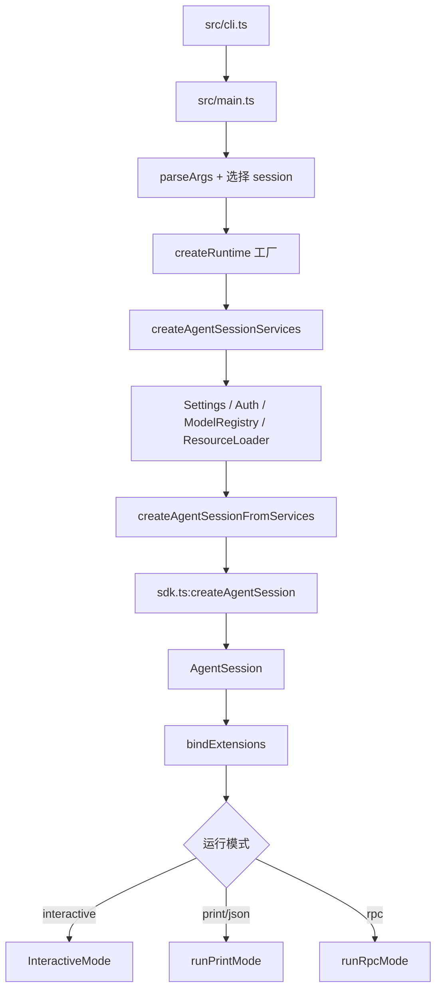
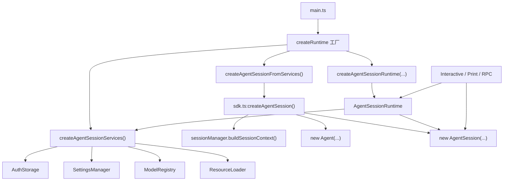

# [pi-coding-agent](https://github.com/earendil-works/pi-mono/tree/main/packages/coding-agent)

整个 pi monorepo 的**产品层 / 运行时编排层**。

如果说：

- `pi-ai` 解决的是"怎么和不同 LLM provider 说话"
- `pi-agent-core` 解决的是"怎么跑一轮 agent loop、怎么调工具、怎么维护消息状态"

那么 `pi-coding-agent` 解决的就是：

> **怎么把统一模型层和通用 agent loop 装配成一个可长期工作、可持久化、可扩展、可交互的 coding agent 产品。**

它对上暴露的是：

- CLI 产品入口 `pi`
- SDK 编程入口 `createAgentSession()` / `createAgentSessionRuntime()`
- 交互模式、print 模式、RPC 模式
- 会话树、压缩、分支、配置、system prompt、extension、skills、tools 这一整套产品机制

它对下负责的是：

- 调 `pi-ai` 找模型、拿认证、发请求、做流式输出
- 调 `pi-agent-core` 驱动 agent loop 和 tool call
- 把会话持久化到 JSONL
- 把 AGENTS.md / SYSTEM.md / skills / extensions / themes / prompts 这些外部资源装进运行时
- 把 TUI、CLI、RPC 这些不同 I/O 外壳接到同一个会话核心上

---

## 一个最小例子

先看最小编程接口，建立直觉：

```typescript
import { createAgentSession } from "@earendil-works/pi-coding-agent";

const { session } = await createAgentSession();

session.subscribe((event) => {
  if (event.type === "message_update") {
    // 这里可以接自己的 UI
  }
});

await session.prompt("帮我阅读当前项目的入口并解释启动流程");
```

这个例子背后，`pi-coding-agent` 已经替你做了很多产品层工作：

- 选择和恢复 session
- 装载默认工具
- 加载 settings / AGENTS.md / SYSTEM.md / skills / extensions
- 恢复模型与 thinking level
- 组装 system prompt
- 将所有消息和状态写回 session 文件

所以阅读这个包，最重要的心法不是"它又定义了一套新的 agent 协议"，而是：

> **它把下层已有的协议和能力，收束成了一个持续运行的产品工作流。**

---

## 整个包的分层图

`packages/coding-agent/src` 可以粗分成六层：

```text
六、产品外壳层
   cli.ts: Node CLI 真正入口，负责进程级初始化后转给 `main.ts`
   main.ts: 启动编排器，负责参数解析、session 选择、runtime 创建、模式分发
   bun/cli.ts: Bun 打包产物对应的入口壳，解决 Bun 环境下的启动适配

五、运行模式层
   modes/interactive/*: 交互式 TUI 壳，包含 `InteractiveMode`、组件、选择器、主题系统
   modes/print-mode.ts: 一次性执行壳，负责把 session 输出成纯文本或 JSON 事件流
   modes/rpc/*: headless RPC 壳，把 `AgentSessionRuntime` 暴露成 JSONL 协议

四、会话运行时层
   core/agent-session-runtime.ts: 当前激活 session 的宿主，负责 `new/resume/fork/import/switch`
   core/agent-session-services.ts: cwd 绑定的基础设施工厂，集中创建 settings、auth、model registry、resource loader
   core/sdk.ts: 会话装配入口，负责把模型、工具、session manager、resource loader 拼成 `AgentSession`
   core/agent-session.ts: 产品核心对象，负责 prompt、持久化、扩展绑定、bash、compaction、tree navigation

三、产品机制层
   core/session-manager.ts: 负责 session tree、JSONL entry 持久化、上下文重建
   core/compaction/*: 负责长对话压缩、branch summary、文件操作摘要和切点计算
   core/settings-manager.ts: 负责全局/项目 settings 加载、深度合并、迁移与持久化
   core/system-prompt.ts: 负责把工具、context files、skills、日期、cwd 拼成最终 system prompt
   core/resource-loader.ts: 负责统一装载 extensions、skills、prompts、themes、AGENTS.md、SYSTEM.md
   core/model-registry.ts model-resolver.ts: 负责 provider/model 可见性、默认模型与 CLI 覆盖解析
   core/prompt-templates.ts: 负责 prompt template 的发现、解析与展开
   core/package-manager.ts: 负责把 settings 中声明的包来源解析成资源路径

二、扩展与工具层
   core/extensions/*: extension 协议、加载器、运行器和桥接层，负责把代码插件接入 session 生命周期
   core/skills.ts: - 负责 skill 发现、frontmatter 解析、冲突处理和 `<available_skills>` 注入
   core/tools/*: 内建工具集合，既定义工具 schema，也实现 read/edit/write/bash/find/grep/ls 等执行逻辑

一、基础支撑层
   utils/*: 各种通用基础设施，比如 shell、路径、图片、剪贴板、HTML 导出、版本检查
   core/event-bus.ts: 提供轻量事件总线，给扩展和运行时传播内部事件
   core/messages.ts: 负责消息内容辅助逻辑和若干消息级工具函数
   core/timings.ts diagnostics.ts: 提供耗时统计和诊断输出，辅助运行时观测
```

可以把它理解成两条横向主线加一条纵向装配链：

- **横向主线 1：运行时主线**
  - `cli.ts -> main.ts -> createAgentSessionRuntime() -> createAgentSession() -> AgentSession -> Interactive/Print/RPC`
- **横向主线 2：资源注入主线**
  - `settings -> package manager -> resource loader -> extensions/skills/prompts/themes -> system prompt -> active tools`
- **纵向装配链**
  - `pi-ai` 提供模型与流式协议
  - `pi-agent-core` 提供 loop 和 tool runtime
  - `pi-coding-agent` 提供持久化、配置、扩展、UI、CLI、模式切换

---

## 整包主调用链

从 `pi` 命令启动到进入交互模式，中间的大链路是：



其中最关键的分层不是 CLI 和 TUI，而是这四个对象：

- `AgentSessionRuntime`
  - 当前激活 session 的宿主，负责 `new / resume / fork / import / dispose`
- `AgentSessionServices`
  - 与 cwd 绑定的基础设施集合，负责 auth、settings、resource loader、model registry
- `createAgentSession()`
  - 真正把 `pi-ai + pi-agent-core + tools + prompt + session context` 组装成会话的工厂
- `AgentSession`
  - 产品层真正的核心对象，承担 prompt、持久化、自动压缩、bash、扩展绑定、tree navigation

这四者基本对应本包的四个核心层级：

```text
runtime 宿主
  ↓ 持有
services 基础设施
  ↓ 输入给
session 工厂
  ↓ 产出
AgentSession 业务核心
```

---

## `src/` 源码地图

### 顶层文件

| 文件 | 定位 | 核心功能 | 主要被谁调用 | 它主要调用谁 |
| --- | --- | --- | --- | --- |
| `src/cli.ts` | CLI 进程入口 | 初始化进程与 HTTP dispatcher，调用 `main()` | npm bin / bun bin | `main.ts` |
| `src/main.ts` | 产品启动编排器 | 解析参数、恢复 session、创建 runtime、分发模式 | `cli.ts`、外部 SDK 也可直接调 `main()` | `cli/*`、`core/*`、`modes/*` |
| `src/index.ts` | 包公共入口 | re-export SDK、tools、extensions、session、modes | 外部 npm 使用者、示例代码 | `core/*`、`modes/*` |
| `src/config.ts` | 路径与版本配置 | `getAgentDir()`、版本、环境路径 | `main.ts`、SDK、工具 | Node path/env |
| `src/migrations.ts` | 数据迁移入口 | session / 配置迁移与弃用告警 | `main.ts` | `SessionManager` 等 |
| `src/package-manager-cli.ts` | 包管理 CLI 子命令 | `package` / `config` 相关命令处理 | `main.ts` | `core/package-manager.ts` |

### `src/cli/`

| 文件 | 定位 | 核心功能 | 主要被谁调用 | 它主要调用谁 |
| --- | --- | --- | --- | --- |
| `args.ts` | 参数协议层 | CLI schema、`parseArgs()`、`printHelp()` | `main.ts` | 无 |
| `file-processor.ts` | `@file` 参数处理 | 将文件文本/图片拼成初始消息 | `main.ts` | `utils/image-*`、`read` 相关逻辑 |
| `initial-message.ts` | 初始消息组装 | 合并 `-p`、stdin、file args | `main.ts` | 无 |
| `list-models.ts` | 列模型命令 | 列出 provider/model | `main.ts` | `ModelRegistry` |
| `session-picker.ts` | session 选择器 | 启动时选择继续哪个会话 | `main.ts` | `SessionManager` |
| `config-selector.ts` | 配置选择器 | 配合 TUI/CLI 选择配置 | `main.ts` | settings 相关模块 |

### `src/core/`

这是整个包最重要的一层。可以再拆成五组：

```text
1. 会话宿主
   agent-session-runtime.ts
   agent-session-services.ts
   sdk.ts
   agent-session.ts

2. 会话与上下文
   session-manager.ts
   compaction/*
   messages.ts

3. 配置与 prompt
   settings-manager.ts
   system-prompt.ts
   prompt-templates.ts

4. 资源与扩展
   resource-loader.ts
   package-manager.ts
   extensions/*
   skills.ts

5. 模型与认证
   auth-storage.ts
   model-registry.ts
   model-resolver.ts
```

其中最值得优先读的 8 个文件是：

| 文件 | 定位 | 为什么重要 |
| --- | --- | --- |
| `core/agent-session.ts` | 产品核心对象 | 几乎所有真正的产品逻辑都在这里汇合 |
| `core/sdk.ts` | SDK 装配入口 | 看懂它就知道会话是怎么被创建出来的 |
| `core/agent-session-runtime.ts` | session 宿主层 | 看懂 `new/resume/fork/import` 怎么落地 |
| `core/agent-session-services.ts` | 基础设施工厂 | 看懂 service 和 session 为什么被拆开 |
| `core/session-manager.ts` | 会话树与 JSONL 持久化 | 看懂 session 为什么不是普通聊天记录 |
| `core/resource-loader.ts` | 外部资源统一入口 | 看懂 extensions/skills/prompts/themes 从哪来 |
| `core/settings-manager.ts` | 分层配置中心 | 看懂全局/项目/目录规则如何叠加 |
| `core/system-prompt.ts` | prompt 装配器 | 看懂模型最终看到什么 |

### `src/modes/`

| 目录 / 文件 | 定位 | 核心功能 | 主要被谁调用 |
| --- | --- | --- | --- |
| `modes/interactive/interactive-mode.ts` | 交互模式总控 | TUI 生命周期、键盘输入、和 `AgentSessionRuntime` 绑定 | `main.ts` |
| `modes/interactive/components/*` | TUI 组件库 | message/tool/bash/tree/footer 等 UI 组件 | `InteractiveMode` |
| `modes/interactive/theme/*` | 主题系统 | 主题 schema、默认深浅色主题、热更新 | `InteractiveMode`、`ResourceLoader` |
| `modes/print-mode.ts` | 单次执行模式 | 非交互运行，支持文本或 JSON 输出 | `main.ts` |
| `modes/rpc/*` | 嵌入式协议层 | 通过 stdin/stdout JSONL 暴露 headless agent | `main.ts`、外部宿主 |

### `src/core/tools/`

`tools/` 是下层 agent loop 能真正"动手"的手臂，但在 `coding-agent` 里，这套工具同时还有两层产品含义：

- 它们是 `system prompt` 的一部分
- 它们会被 extension 再包装、拦截、替换、过滤

| 文件 | 定位 | 核心功能 |
| --- | --- | --- |
| `read.ts` | 文件读取工具 | 偏移读取、截断保护、图片支持 |
| `bash.ts` | Bash 后备工具 | 外部命令执行、流式输出、超时、截断 |
| `edit.ts` | 精确编辑工具 | `oldText -> newText` 精确替换 |
| `edit-diff.ts` | 编辑算法模块 | LF 归一化、fuzzy match、diff 生成 |
| `write.ts` | 文件写入工具 | 新建/覆盖写文件 |
| `grep.ts` | 内容搜索 | ripgrep 后端、结构化搜索 |
| `find.ts` | 文件搜索 | glob/fd 风格路径发现 |
| `ls.ts` | 目录浏览 | 列目录、结果截断 |
| `truncate.ts` | 统一截断策略 | 2000 行 / 50KB 保护 |
| `file-mutation-queue.ts` | 并发安全层 | 同文件写操作串行化 |
| `tool-definition-wrapper.ts` | 双层工具桥 | `ToolDefinition <-> AgentTool` 包装 |
| `index.ts` | 工具注册入口 | 批量创建工具定义/工具实例 |

### `src/core/extensions/`

| 文件 | 定位 | 核心功能 |
| --- | --- | --- |
| `types.ts` | 扩展协议总表 | 事件、上下文、工具定义、命令、UI API |
| `loader.ts` | 发现与加载层 | 加载 TS extension、创建 runtime stub |
| `runner.ts` | 运行器 | emit 各类事件、绑定核心动作、管理生命周期 |
| `wrapper.ts` | 适配层 | 把 extension tool 包成核心可执行工具 |
| `index.ts` | barrel | 对外统一导出 |

### `src/utils/`

这一层不是产品主角，但它解释了很多"为什么 coding-agent 能跑起来"的细节，比如：

- 剪贴板图片读取
- shell 选择与路径规范化
- 图像缩放与 MIME 检测
- changelog/version check
- git 工具与 HTML 导出辅助

它们的特点是：**不决定产品策略，但为上层策略提供机械支撑。**

---

## 最关键的三个中枢

如果只允许你先看三个点，我建议按这个顺序：

### 1. `core/agent-session.ts`

这是全包真正的心脏。

它同时管：

- prompt 进入队列
- agent 事件订阅
- 消息持久化
- tool hook
- 自动压缩
- retry
- bash 执行
- 扩展绑定
- slash command / skill / prompt template / active tools

也就是说，它不是"对 `Agent` 的薄封装"，而是**把 coding-agent 的产品行为真正加上去的地方**。

### 2. `core/session-manager.ts`

这是产品记忆层。

`pi-agent-core` 维护的是当前内存状态；`coding-agent` 之所以能长期工作、可回溯、可分叉、可压缩，是因为这里把会话变成了：

- append-only JSONL
- tree 而不是 list
- 同时容纳 message、model change、thinking change、compaction、branch summary、custom entry

### 3. `core/resource-loader.ts`

这是产品扩展层的统一入口。

如果没有它，`extensions / skills / prompts / themes / AGENTS.md / SYSTEM.md / packages` 都会各自有一套发现逻辑。现在它们被收束为统一装配入口，再被 `system-prompt.ts` 和 `AgentSession` 消费。

---

## 这个包和已有专题文档的关系

你已经有四篇非常关键的专题：

- `tutorial/coding-agent/pi-session-tree.md`
- `tutorial/coding-agent/pi-compaction.md`
- `tutorial/coding-agent/pi-config-layers.md`
- `tutorial/coding-agent/pi-system-prompt.md`

它们分别覆盖了：

- 会话树与持久化
- 上下文压缩
- 配置分层
- prompt 装配

这四篇已经构成了 `coding-agent` 的中段主干，但还缺三块总览性内容：

1. **整包分层图和源码地图**
   - 整个 `packages/coding-agent` 到底有哪些层
   - 每个目录的职责是什么
   - 读源码该先看哪几个入口

2. **启动与运行时装配链**
   - `cli.ts -> main.ts -> runtime -> services -> session -> modes`
   - interactive / print / rpc 三个 mode 如何共用同一个会话核心

3. **资源、扩展、工具三套机制如何汇合**
   - tools 如何进入 prompt
   - extensions 如何绑定到 session
   - skills/prompts/themes/packages 如何通过 resource loader 汇入运行时

这也是本文和后续新增分册要补的部分。

---

## 推荐阅读顺序

如果你的目标是写一份"完整但不失真"的 `pi-coding-agent` 教程，我建议按下面的阅读链组织：

### 第一组：整包骨架

1. 本文 `tutorial/pi-coding-agent.md`
2. `tutorial/coding-agent/pi-startup-runtime-and-modes.md`
3. `tutorial/coding-agent/pi-resources-extensions-tools.md`

### 第二组：会话与上下文主线

4. `tutorial/coding-agent/pi-session-tree.md`
5. `tutorial/coding-agent/pi-compaction.md`

### 第三组：规则与 prompt 主线

6. `tutorial/coding-agent/pi-config-layers.md`
7. `tutorial/coding-agent/pi-system-prompt.md`

### 第四组：外部资源与工具原理补充

8. `tutorial/1/ch15-extensions.md`
9. `tutorial/1/ch16-skills.md`
10. `tutorial/1/ch17-resource-loader.md`
11. `tutorial/1/ch19-tool-principles.md`
12. `tutorial/1/ch20-edit-tool.md`
13. `tutorial/1/ch21-read-tool.md`
14. `tutorial/1/ch22-bash-tool.md`
15. `tutorial/1/ch23-search-tools.md`

换句话说：

- 本文和新增两篇分册，负责**搭骨架**
- `session/config/prompt/compaction` 四篇，负责**讲产品机制**
- 第 15/16/17/19/20/21/22/23 章，负责**给机制补专题级深描**

---

## 这一层最重要的设计判断

最后先下一个总判断，后面所有章节都可以围绕它展开：

> `pi-coding-agent` 不是在重复造一个 agent runtime。
> 它真正做的是：
> **把模型层、agent loop、持久化、配置、prompt、工具、扩展、模式 UI 统一装配成一个可长期工作的产品系统。**

所以阅读它时，最值得关心的不是某个函数局部怎么写，而是这些问题：

- 哪些对象是"纯运行时"的，哪些是"可持久化"的？
- 哪些机制属于 `Agent`，哪些是 `AgentSession` 额外加上去的？
- 哪些资源在 session 启动前装配，哪些会在运行中动态注入？
- 为什么 extension、skills、tools、prompts 最终都会流入同一个 `system prompt + active tools` 视图？

搞清这几个问题，整个 `coding-agent` 包的结构就不会再散。


```text
createRuntime 工厂内部：
  createAgentSessionServices()
    -> 先造 services
  createAgentSessionFromServices()
    -> 再基于 services 造 AgentSession
        -> 内部委托给 sdk.ts:createAgentSession()
            -> 最终 new AgentSession(...)
```

---

**一、四者各自是什么**

- `core/agent-session-runtime.ts`
  - 当前激活 session 的宿主对象
  - 它不负责“具体一轮 prompt 怎么跑”，而负责“当前宿主现在挂着哪个 session，以及如何切换到另一个 session”
  - 入口见 [agent-session-runtime.ts](file:///Users/a/Desktop/WorkSpace/ALL/我的Github项目/pi-deep-dive/packages/coding-agent/src/core/agent-session-runtime.ts#L413-L430)

- `core/agent-session-services.ts`
  - cwd 绑定的基础设施集合
  - 负责创建 `authStorage`、`settingsManager`、`modelRegistry`、`resourceLoader`
  - 接口和工厂见 [agent-session-services.ts](file:///Users/a/Desktop/WorkSpace/ALL/我的Github项目/pi-deep-dive/packages/coding-agent/src/core/agent-session-services.ts#L109-L124) 和 [createAgentSessionServices](file:///Users/a/Desktop/WorkSpace/ALL/我的Github项目/pi-deep-dive/packages/coding-agent/src/core/agent-session-services.ts#L203-L246)

- `core/sdk.ts`
  - 真正的会话装配器
  - 它把 `services + sessionManager + model/thinking/tools` 拼成一个可运行的 `AgentSession`
  - 入口见 [createAgentSession](file:///Users/a/Desktop/WorkSpace/ALL/我的Github项目/pi-deep-dive/packages/coding-agent/src/core/sdk.ts#L207-L425)

- `core/agent-session.ts`
  - 产品核心对象
  - 真正负责 prompt、持久化、tool hooks、extension 绑定、compaction、tree navigation
  - 类和构造入口见 [AgentSession](file:///Users/a/Desktop/WorkSpace/ALL/我的Github项目/pi-deep-dive/packages/coding-agent/src/core/agent-session.ts#L264-L355)

---

**二、对象持有关系**

最准确的理解不是“谁调用谁一次”，而是“谁长期持有谁”。

```text
main.ts
  ↓ 创建 createRuntime 工厂
AgentSessionRuntime
  ├─ 持有 session: AgentSession
  ├─ 持有 services: AgentSessionServices
  └─ 持有 createRuntime: 工厂函数

AgentSession
  ├─ 持有 agent
  ├─ 持有 sessionManager
  ├─ 持有 settingsManager
  ├─ 持有 resourceLoader
  ├─ 持有 modelRegistry
  └─ 持有 extensionRunnerRef 等运行时状态
```

对应代码：
- `AgentSessionRuntime.apply()` 会把新的 `session/services` 填进去 [agent-session-runtime.ts](file:///Users/a/Desktop/WorkSpace/ALL/我的Github项目/pi-deep-dive/packages/coding-agent/src/core/agent-session-runtime.ts#L191-L196)
- `AgentSession` 构造函数里把这些核心依赖全部存成字段 [agent-session.ts](file:///Users/a/Desktop/WorkSpace/ALL/我的Github项目/pi-deep-dive/packages/coding-agent/src/core/agent-session.ts#L331-L355)

所以层级关系可以概括成：

- `runtime` 是“当前会话宿主”
- `services` 是“当前 cwd 环境”
- `sdk` 是“装配器”
- `session` 是“真正跑业务的核心对象”

---

**三、启动时的调用链**

这是最关键的一条链。

在 `main.ts` 里，会先定义一个 `createRuntime` 工厂；这个工厂内部按顺序做两件事：

1. `createAgentSessionServices(...)`
2. `createAgentSessionFromServices(...)`

见 [main.ts](file:///Users/a/Desktop/WorkSpace/ALL/我的Github项目/pi-deep-dive/packages/coding-agent/src/main.ts#L893-L977)

具体顺序是：

```text
main.ts
  -> createAgentSessionServices(...)
       先创建 services
  -> createAgentSessionFromServices(...)
       再用 services 创建 session
  -> createAgentSessionRuntime(createRuntime, ...)
       把上面的工厂和初始结果装进 runtime
```

再细一点是：

```text
main.ts
  -> createAgentSessionServices()
       -> AuthStorage
       -> SettingsManager
       -> ModelRegistry
       -> DefaultResourceLoader
       -> resourceLoader.reload()

  -> createAgentSessionFromServices()
       -> sdk.ts:createAgentSession()

  -> sdk.ts:createAgentSession()
       -> sessionManager.buildSessionContext()
       -> new Agent(...)
       -> 恢复消息 / model / thinking
       -> new AgentSession(...)
```

对应代码：
- `main.ts` 先创建 services，再创建 session [main.ts](file:///Users/a/Desktop/WorkSpace/ALL/我的Github项目/pi-deep-dive/packages/coding-agent/src/main.ts#L895-L966)
- `createAgentSessionFromServices()` 本质就是把 services 拆开传给 `sdk.ts` [agent-session-services.ts](file:///Users/a/Desktop/WorkSpace/ALL/我的Github项目/pi-deep-dive/packages/coding-agent/src/core/agent-session-services.ts#L259-L278)
- `sdk.ts` 里最终 `new AgentSession(...)` [sdk.ts](file:///Users/a/Desktop/WorkSpace/ALL/我的Github项目/pi-deep-dive/packages/coding-agent/src/core/sdk.ts#L392-L425)

---

**四、为什么要拆成 `services -> sdk -> session` 三层**

这是这四个文件最容易看乱的点。

**`services` 解决的是“环境问题”**
- 当前 cwd 是什么
- 当前项目有哪些 settings
- 当前可见哪些 extensions/skills/prompts/themes
- 当前有哪些 provider/model 可用

这些都属于“环境事实”。

**`sdk` 解决的是“装配问题”**
- 用哪些 services
- 用哪个 `SessionManager`
- 恢复哪个 model / thinking
- 激活哪些 tools
- 如何创建底层 `Agent`

它是“把零件装成成品”的地方。

**`AgentSession` 解决的是“运行问题”**
- prompt 进入队列
- 持久化消息
- tool hook
- extension event
- compaction
- bash
- tree navigation

它才是真正承接业务生命周期的对象。

所以不是为了抽象而抽象，而是把三类不同变化频率的东西拆开：

- 环境状态：`services`
- 装配逻辑：`sdk`
- 会话业务：`AgentSession`

---

**五、`AgentSessionRuntime` 为什么还要再包一层**

如果只有 `sdk.ts -> AgentSession`，其实已经能跑了。

那为什么还需要 `AgentSessionRuntime`？

因为产品层还要支持：

- `newSession()`
- `switchSession()`
- `fork()`
- `importFromJsonl()`

这些都不是“当前会话内部行为”，而是“当前宿主切到另一个会话”的行为。

例如 `switchSession()` 的流程是：

1. 打开目标 `SessionManager`
2. teardown 当前 session
3. 用同一个 `createRuntime` 工厂重新创建一套新的 `services + session`
4. `apply()` 到 runtime
5. `rebindSession()` 让 UI 或外部宿主重新绑定新 session

见 [switchSession](file:///Users/a/Desktop/WorkSpace/ALL/我的Github项目/pi-deep-dive/packages/coding-agent/src/core/agent-session-runtime.ts#L207-L230)

`newSession()`、`fork()`、`importFromJsonl()` 也都是同样套路：
- 先准备新的 `SessionManager`
- 再重建一整套 runtime 结果
- 最后替换当前 `session/services`

见 [newSession](file:///Users/a/Desktop/WorkSpace/ALL/我的Github项目/pi-deep-dive/packages/coding-agent/src/core/agent-session-runtime.ts#L232-L264)、[fork](file:///Users/a/Desktop/WorkSpace/ALL/我的Github项目/pi-deep-dive/packages/coding-agent/src/core/agent-session-runtime.ts#L266-L351)、[importFromJsonl](file:///Users/a/Desktop/WorkSpace/ALL/我的Github项目/pi-deep-dive/packages/coding-agent/src/core/agent-session-runtime.ts#L360-L395)

所以：

> `AgentSession` 只负责“这个 session 怎么活”
> `AgentSessionRuntime` 负责“当前宿主现在挂哪一个 session”

---

**六、运行中的调用方向**

启动之后，常见调用方向是这样的：

```text
InteractiveMode / PrintMode / RpcMode
  -> AgentSessionRuntime.session
      -> AgentSession.prompt()
      -> AgentSession.compact()
      -> AgentSession.bindExtensions()
      -> AgentSession.navigateTree()
```

对应入口：
- [prompt](file:///Users/a/Desktop/WorkSpace/ALL/我的Github项目/pi-deep-dive/packages/coding-agent/src/core/agent-session.ts#L981-L1007)
- [compact](file:///Users/a/Desktop/WorkSpace/ALL/我的Github项目/pi-deep-dive/packages/coding-agent/src/core/agent-session.ts#L1636-L1720)
- [bindExtensions](file:///Users/a/Desktop/WorkSpace/ALL/我的Github项目/pi-deep-dive/packages/coding-agent/src/core/agent-session.ts#L2062-L2119)
- [navigateTree](file:///Users/a/Desktop/WorkSpace/ALL/我的Github项目/pi-deep-dive/packages/coding-agent/src/core/agent-session.ts#L2687-L2857)

而 `AgentSession` 内部又会继续调用：
- `sessionManager`
- `settingsManager`
- `resourceLoader`
- `modelRegistry`
- 底层 `agent`

这也是为什么它是“产品核心对象”。

---

**七、一张总图**

如果你要把这四者的关系写进教程，我建议直接用这张图：



---

**八、一句话总结四者关系**

- `agent-session-services.ts`：先把“当前 cwd 的环境”造出来
- `sdk.ts`：再把这些环境零件装成一个 `AgentSession`
- `agent-session.ts`：这个 `AgentSession` 才是真正承接 prompt、持久化、压缩、扩展、导航的业务核心
- `agent-session-runtime.ts`：最后再在外面包一个“当前会话宿主”，负责 `new/resume/fork/import/switch`

如果你要，我下一步可以直接把这段整理成一小节，补进 [pi-coding-agent.md](file:///Users/a/Desktop/WorkSpace/ALL/我的Github项目/pi-deep-dive/tutorial/pi-coding-agent.md) 当前“分层图”后面。
