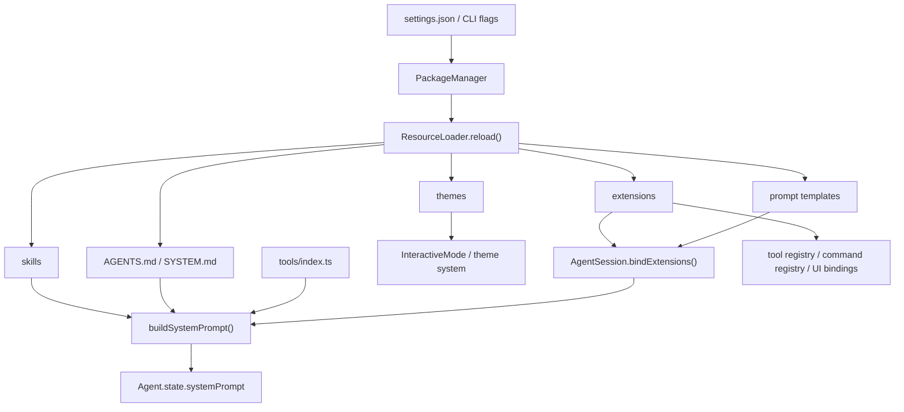

# [pi-coding-agent](https://github.com/earendil-works/pi-mono/tree/main/packages/coding-agent)

整个 pi monorepo 的**产品层 / 运行时编排层**。

如果说：

- `pi-ai` 解决的是"怎么和不同 LLM provider 说话"
- `pi-agent-core` 解决的是"怎么跑一轮 agent loop、怎么调工具、怎么维护消息状态"

那么 `pi-coding-agent` 解决的就是：

> **怎么把统一模型层和通用 agent loop 装配成一个可长期工作、可持久化、可扩展、可交互的 coding agent 产品。**

它对上暴露的是：

- CLI 产品入口 `pi`
- SDK 编程入口 `createAgentSession()` / `createAgentSessionRuntime()`
- 交互模式、print 模式、RPC 模式
- 会话树、压缩、分支、配置、system prompt、extension、skills、tools 这一整套产品机制

它对下负责的是：

- 调 `pi-ai` 找模型、拿认证、发请求、做流式输出
- 调 `pi-agent-core` 驱动 agent loop 和 tool call
- 把会话持久化到 JSONL
- 把 AGENTS.md / SYSTEM.md / skills / extensions / themes / prompts 这些外部资源装进运行时
- 把 TUI、CLI、RPC 这些不同 I/O 外壳接到同一个会话核心上

---

## 一个最小例子

先看最小编程接口，建立直觉：

```typescript
import { createAgentSession } from "@earendil-works/pi-coding-agent";

const { session } = await createAgentSession();

session.subscribe((event) => {
  if (event.type === "message_update") {
    // 这里可以接自己的 UI
  }
});

await session.prompt("帮我阅读当前项目的入口并解释启动流程");
```

这个例子背后，`pi-coding-agent` 已经替你做了很多产品层工作：

- 选择和恢复 session
- 装载默认工具
- 加载 settings / AGENTS.md / SYSTEM.md / skills / extensions
- 恢复模型与 thinking level
- 组装 system prompt
- 将所有消息和状态写回 session 文件

---

## 整个包的分层图

`packages/coding-agent/src` 可以粗分成六层：

```text
六、产品外壳层
    cli.ts: Node CLI 真正入口，负责进程级初始化后转给 main.ts
    main.ts: 启动编排器，负责参数解析、session 选择、runtime 创建、模式分发
    
    bun/cli.ts: Bun 打包产物入口壳，解决 Bun 环境下的启动适配
    bun/restore-sandbox-env.ts: Bun 沙箱环境变量恢复，解决 Bun 打包后环境差异
    
    config.ts: 全局常量定义（APP_NAME、路径、环境变量 key、版本检查等）
    migrations.ts: 应用级数据迁移（旧版本目录结构升级等）
    index.ts: 公共 API 聚合导出，定义对外的模块边界
    package-manager-cli.ts: 包管理 CLI 入口，独立于主 agent 进程运行
    
    cli/args.ts: CLI 参数类型定义和解析（--model、--session、--resume 等所有 flag）
    cli/config-selector.ts: 启动时配置源选择（交互式或参数驱动）
    cli/file-processor.ts: 文件参数处理器（--file 传入的文件预处理）
    cli/initial-message.ts: 启动时的初始消息处理（--prompt / 管道输入等）
    cli/list-models.ts: --list-models 命令实现，列出所有可用 provider/model
    cli/session-picker.ts: --resume 的交互式会话选择器 UI

五、运行模式层
    modes/index.ts: 运行模式统一导出
    modes/print-mode.ts: 一次性执行壳，把 session 输出成纯文本或 JSON 事件流
    modes/interactive/interactive-mode.ts: 交互式 TUI 主控制器，管理输入循环和组件编排
    modes/interactive/theme/theme.ts: 主题系统，管理颜色方案和 UI 样式
    modes/interactive/components/index.ts: 组件导出聚合
    modes/interactive/components/assistant-message.ts: 助手消息渲染组件
    modes/interactive/components/user-message.ts: 用户消息渲染组件
    modes/interactive/components/user-message-selector.ts: 用户消息选择器（/resume 时选择起点）
    modes/interactive/components/custom-message.ts: 自定义消息渲染组件
    modes/interactive/components/custom-editor.ts: 自定义编辑器组件（command mode）
    modes/interactive/components/footer.ts: 状态栏组件（token/费用/耗时显示）
    modes/interactive/components/settings-selector.ts: /settings 配置面板
    modes/interactive/components/model-selector.ts: /model 切换面板
    modes/interactive/components/scoped-models-selector.ts: Ctrl+P 限定模型切换面板
    modes/interactive/components/thinking-selector.ts: /thinking 思维级别切换面板
    modes/interactive/components/auth-selector.ts: /login 认证提供方选择面板
    modes/interactive/components/theme-selector.ts: /theme 主题切换面板
    modes/interactive/components/tree-selector.ts: /tree 会话树导航面板
    modes/interactive/components/session-selector.ts: /session 会话列表面板
    modes/interactive/components/session-selector-search.ts: 会话搜索过滤
    modes/interactive/components/config-selector.ts: 配置选项选择器
    modes/interactive/components/extension-selector.ts: 扩展选择面板
    modes/interactive/components/extension-input.ts: 扩展输入组件
    modes/interactive/components/extension-editor.ts: 扩展编辑器组件
    modes/interactive/components/show-images-selector.ts: 图片显示配置面板
    modes/interactive/components/bash-execution.ts: bash 命令执行 UI 组件
    modes/interactive/components/tool-execution.ts: 工具调用执行状态 UI
    modes/interactive/components/diff.ts: 代码 diff 渲染组件
    modes/interactive/components/skill-invocation-message.ts: 技能调用消息渲染
    modes/interactive/components/compaction-summary-message.ts: 压缩摘要消息渲染
    modes/interactive/components/branch-summary-message.ts: 分支摘要消息渲染
    modes/interactive/components/keybinding-hints.ts: 快捷键提示组件
    modes/interactive/components/login-dialog.ts: 登录对话框
    modes/interactive/components/dynamic-border.ts: 动态边框渲染
    modes/interactive/components/bordered-loader.ts: 带边框的加载动画
    modes/interactive/components/countdown-timer.ts: 倒计时组件（重试延迟显示）
    modes/interactive/components/visual-truncate.ts: 可视化截断组件
    modes/interactive/components/armin.ts: armin 特效组件
    modes/interactive/components/earendil-announcement.ts: 公告栏组件
    modes/rpc/rpc-mode.ts: headless RPC 模式主控制器，把 AgentSessionRuntime 暴露为 JSONL 协议
    modes/rpc/rpc-types.ts: RPC 协议类型定义（请求/响应/事件类型）
    modes/rpc/rpc-client.ts: RPC 客户端实现，管理 stdin/stdout JSONL 通信
    modes/rpc/jsonl.ts: JSONL 解析与序列化工具

四、会话运行时层
    core/agent-session-runtime.ts: 当前激活 session 的宿主，负责 new/resume/fork/import/switch
    core/agent-session-services.ts: cwd 绑定的基础设施工厂，集中创建 settings、auth、model registry、resource loader
    core/sdk.ts: 会话装配入口，把模型、工具、session manager、resource loader 拼成 AgentSession
    core/agent-session.ts: 产品核心对象，负责 prompt、持久化、扩展绑定、bash、compaction、tree navigation

三、产品机制层
    core/session-manager.ts: session tree、JSONL entry 持久化、上下文重建
    core/compaction/*: 长对话压缩、branch summary、文件操作摘要和切点计算
    core/settings-manager.ts: 全局/项目 settings 加载、深度合并、迁移与持久化
    core/system-prompt.ts: 把工具、context files、skills、日期、cwd 拼成最终 system prompt
    core/resource-loader.ts: 统一装载 extensions、skills、prompts、themes、AGENTS.md、SYSTEM.md
    core/model-registry.ts: provider/model 注册表，API key 解析和模型发现
    core/model-resolver.ts: 默认模型选择、CLI 覆盖、scoped models 优先级解析
    core/prompt-templates.ts: prompt template 的发现、解析与运行时展开
    core/package-manager.ts: 把 settings 中声明的包来源（npm/git/local）解析成资源路径
    core/bash-executor.ts: bash 命令执行引擎，在伪终端中运行命令并流式返回输出
    core/exec.ts: 子进程生命周期封装，管理 spawn/kill/signal 和输出缓冲
    core/messages.ts: 自定义消息类型编码（BashExecutionMessage/CustomMessage）与转换器
    core/slash-commands.ts: 斜杠命令解析与路由（/model /session /settings /name 等）
    core/keybindings.ts: 快捷键常量和默认绑定（Ctrl+P/Ctrl+O/Escape 等）及处理函数
    core/output-guard.ts: 模型输出守卫，拦截敏感信息、过滤无效输出
    core/session-cwd.ts: session 文件头中的 cwd 解析与恢复

二、扩展与工具层
    core/extensions/*: extension 协议定义、加载器、运行器和桥接层
    core/extensions/types.ts: extension 类型系统（Extension、ExtensionRuntime、事件/钩子接口）
    core/extensions/loader.ts: extension 加载器，从文件系统加载 d.ts/js 扩展代码
    core/extensions/runner.ts: extension 运行时，管理生命周期和事件分发
    core/extensions/wrapper.ts: extension 包装器，给 agent 暴露 API 入口
    core/extensions/index.ts: extension 模块统一导出
    core/skills.ts: skill 发现、frontmatter 解析、冲突处理和 <available_skills> 注入
    core/tools/index.ts: 内建工具集合统一导出和注册
    core/tools/read.ts: 文件读取工具（schema + 执行逻辑）
    core/tools/edit.ts: 文件编辑工具（基于 SearchReplace 模式）
    core/tools/write.ts: 文件写入工具
    core/tools/bash.ts: bash 命令执行工具
    core/tools/grep.ts: 文本搜索工具（ripgrep 封装）
    core/tools/find.ts: 文件名搜索工具
    core/tools/ls.ts: 目录列表工具
    core/tools/edit-diff.ts: 编辑差异生成和预览
    core/tools/tool-definition-wrapper.ts: AgentTool → ToolDefinition 包装器
    core/tools/file-mutation-queue.ts: 文件变更队列，管理批量编辑的顺序执行
    core/tools/output-accumulator.ts: 工具输出累积器，聚集流式输出为完整结果
    core/tools/truncate.ts: 输出截断工具，防止过大的工具结果爆上下文
    core/tools/render-utils.ts: 工具结果渲染辅助函数
    core/tools/path-utils.ts: 路径安全检查与规范化

一、基础支撑层
    core/event-bus.ts: 轻量事件总线，给扩展和运行时传播内部事件
    core/messages.ts: 消息内容辅助逻辑和消息级工具函数
    core/timings.ts: 耗时统计，记录工具调用、LLM 请求、压缩各阶段耗时
    core/diagnostics.ts: 诊断信息收集，/diagnostics 命令的数据来源
    core/auth-storage.ts: API 密钥持久化存储，支持加密和跨进程共享
    core/auth-guidance.ts: 认证引导文案生成，未登录时的提示信息
    core/telemetry.ts: 匿名遥测数据收集和上报
    core/footer-data-provider.ts: 状态栏数据计算（token 数、费用、耗时等）
    core/http-dispatcher.ts: HTTP 请求调度器，管理重试、超时和并发
    core/resolve-config-value.ts: 配置值解析工具，统一处理 env var 和 settings 读取
    core/provider-display-names.ts: provider ID 到展示名称的映射（如 anthropic-vertex → Anthropic）
    core/source-info.ts: 工具来源标识（builtin / extension / sdk-custom）
    core/defaults.ts: 全局默认常量（默认模型、超时、路径等兜底值）
    core/index.ts: core 模块公共 API 聚合导出
    utils/ansi.ts: ANSI 转义序列处理
    utils/changelog.ts: changelog 版本检查和展示
    utils/child-process.ts: 子进程管理辅助
    utils/clipboard.ts: 剪贴板操作（统一接口）
    utils/clipboard-image.ts: 剪贴板图片提取
    utils/clipboard-native.ts: 平台原生剪贴板
    utils/exif-orientation.ts: 图片 EXIF 方向处理
    utils/frontmatter.ts: Markdown frontmatter 解析
    utils/fs-watch.ts: 文件系统监听
    utils/git.ts: git 操作辅助
    utils/html.ts: HTML 导出辅助
    utils/image-convert.ts: 图片格式转换
    utils/image-resize.ts: 图片尺寸调整
    utils/image-resize-core.ts: 图片缩放核心算法
    utils/image-resize-worker.ts: 图片缩放 Worker 线程
    utils/mime.ts: MIME 类型检测
    utils/paths.ts: 路径处理工具
    utils/photon.ts: 终端渲染底层库
    utils/pi-user-agent.ts: HTTP User-Agent 生成
    utils/shell.ts: shell 环境检测和配置（PS1、ANSI 支持等）
    utils/sleep.ts: sleep 工具函数
    utils/syntax-highlight.ts: 代码语法高亮
    utils/tools-manager.ts: 工具生命周期管理器
    utils/version-check.ts: 版本检查（新版本通知）
    utils/windows-self-update.ts: Windows 自助更新
```

```
┌───────────────────────────────────────────────────────────────────────────┐
│                         六、产品外壳层                                      │
│                                                                           │
│   cli.ts                      main.ts                     bun/cli.ts      │
│   (Node CLI 入口) ────────→ (启动编排器) ←──────────── (Bun 适配入口)         │
│   进程级初始化               参数解析 / session选择                           │
│                              runtime创建 / 模式分发                         │
│                                    │                                      │
├────────────────────────────────────┼──────────────────────────────────────┤
│                         五、运行模式层                                      │
│                                    │                                      │
│         ┌──────────────────────────┼──────────────────────────┐           │
│         ▼                          ▼                          ▼           │
│  modes/interactive/*       modes/print-mode.ts        modes/rpc/*         │
│  ┌──────────────────┐    ┌──────────────────┐    ┌──────────────────┐     │
│  │ InteractiveMode  │    │ PrintMode        │    │ RpcServer        │     │
│  │ (交互式 TUI 壳)   │    │ (一次性执行壳)     │    │ (headless JSONL) │     │
│  │                  │    │                  │    │                  │     │
│  │ • settings-select│    │ • --print-events │    │ • JSONL 协议      │     │
│  │ • 主题系统        │    │ • --print-latest  │    │ • stdin/stdout  │     │
│  │ • 组件系统        │    │ • 管道模式         │    │ • 外部集成        │     │
│  └────────┬─────────┘    └────────┬─────────┘    └────────┬─────────┘     │
│           │                       │                       │               │
│           └───────────────────────┼───────────────────────┘               │
│                                   │                                       │
├───────────────────────────────────┼───────────────────────────────────────┤
│                       四、会话运行时层                                       │
│                                   │                                       │
│  ┌────────────────────────────────┼──────────────────────────────────┐    │
│  │                    AgentSessionRuntime (组合容器)                   │   │
│  │                                                                    │   │
│  │  fork() / newSession() / switchSession() / resume() / import()     │   │
│  │    └→ 销毁旧 session → 重新走完整创建链路 → 替换 .session               │   │
│  │                                                                    │   │
│  │  ┌───────────────────────────────────────────────────────────┐     │   │
│  │  │              agent-session-services.ts                    │     │   │
│  │  │           (cwd 绑定的基础设施工厂)                           │     │   │
│  │  │                                                           │     │   │
│  │  │  createAgentSessionServices()                             │     │   │
│  │  │    → AuthStorage / SettingsManager / ModelRegistry        │     │   │
│  │  │    → DefaultResourceLoader / Extension加载                 │     │   │
│  │  │                                                           │     │   │
│  │  │  createAgentSessionFromServices()                         │     │   │
│  │  │    → 模型分辨率 / 工具注册 / 参数合并                         │     │   │
│  │  │    └──────────────────────┐                               │    │   │
│  │  └───────────────────────────┼───────────────────────────────┘    │   │
│  │                              ▼                                    │   │
│  │  ┌──────────────────────────────────────────────────────────┐     │   │
│  │  │                     sdk.ts (唯一工厂)                     │     │   │
│  │  │                 createAgentSession(options)              │     │   │
│  │  │                                                          │     │   │
│  │  │  new Agent(...) + new AgentSession({...})                │     │   │
│  │  │                                                          │     │   │
│  │  │  ┌──────────────────────────────────────────────────┐    │     │   │
│  │  │  │              AgentSession (核心对象)              │    │     │   │
│  │  │  │                                                  │    │     │   │
│  │  │  │  session.start()  /  session.submit()            │    │     │   │
│  │  │  │  session.interrupt()  /  session.pause()         │    │     │   │
│  │  │  │                                                  │    │     │   │
│  │  │  │  组装并持有以下全部产品机制层模块 ────────────────────┼┐   │     │   │
│  │  │  └──────────────────────────────────────────────────┘│   │     │   │
│  │  └──────────────────────────────────────────────────────┼───┘     │   │
│  └─────────────────────────────────────────────────────────┼─────────┘   │
│                                                            │             │
├────────────────────────────────────────────────────────────┼─────────────┤
│                       三、产品机制层                         │             │
│                                                            │             │
│  ┌────────────────────────┐  ┌──────────────────────────┐  │             │
│  │   session-manager.ts   │  │   settings-manager.ts    │  │             │
│  │                        │  │                          │  │             │
│  │  • session tree        │  │  • global/project merge  │  │             │
│  │  • JSONL 追加式持久化    │  │  • 脏字段追踪增量写入       │  │             │
│  │  • branch / fork       │  │  • 文件锁保护 (withLock)   │  │             │
│  │  • buildSessionContext │  │  • 序列化写入队列           │  │             │
│  │  • 9 种 Entry 类型      │  │  • 版本迁移                │  │             │
│  └────────────────────────┘  └──────────────────────────┘  │             │
│                                                            │             │
│  ┌───────────────────────┐  ┌──────────────────────────┐   │             │
│  │  compaction/*         │  │   resource-loader.ts     │   │             │
│  │                       │  │                          │   │             │
│  │  • 长对话压缩          │  │  • extensions 统一装载     │◄──┘             │
│  │  • branch summary     │  │  • skills / prompts      │                 │
│  │  • 文件操作摘要         │  │  • themes / AGENTS.md    │                 │
│  │  • 切点计算            │  │  • SYSTEM.md 上下文       │                 │
│  └───────────────────────┘  └──────────────────────────┘                 │
│                                                                          │
│  ┌───────────────────────┐  ┌──────────────────────────┐                 │
│  │   system-prompt.ts    │  │  model-registry.ts       │                 │
│  │                       │  │  model-resolver.ts       │                 │
│  │  • tools + context    │  │                          │                 │
│  │  • skills 注入         │  │  • provider/model 可见性  │                 │
│  │  • guidelines 格式化   │  │  • 默认模型解析            │                 │
│  │  • 日期 / cwd 拼接     │  │  • CLI 覆盖 / scoped      │                 │
│  └───────────────────────┘  └──────────────────────────┘                 │
│                                                                          │
│  ┌───────────────────────┐  ┌──────────────────────────┐                 │
│  │  prompt-templates.ts  │  │  package-manager.ts      │                 │
│  │  • 模板发现与解析       │  │  • package 来源 → 资源     │                 │
│  │  • 变量展开            │  │  • 路径解析与缓存           │                 │
│  └───────────────────────┘  └──────────────────────────┘                 │
│                                                                          │
├──────────────────────────────────────────────────────────────────────────┤
│                       二、扩展与工具层                                      │
│                                                                          │
│  ┌───────────────────────┐  ┌──────────────────────────┐                 │
│  │  extensions/*         │  │   skills.ts              │                 │
│  │                       │  │                          │                 │
│  │  • extension 协议      │  │  • SKILL.md 发现与解析    │                 │
│  │  • 加载器 / 运行器      │  │  • frontmatter 提取      │                  │
│  │  • 桥接层 (生命周期)    │  │  • 冲突处理 / 去重         │                 │
│  │  • 自定义工具注册       │  │  • available_skills 注入  │                 │
│  └───────────────────────┘  └──────────────────────────┘                 │
│                                                                          │
│  ┌────────────────────────────────────────────────────────────────┐      │
│  │                       tools/*                                  │      │
│  │                                                                │      │
│  │  read.ts / edit.ts / write.ts / bash.ts / find.ts / grep.ts    │      │
│  │  ls.ts / glob.ts / web-search.ts / web-fetch.ts / task.ts      │      │
│  │                                                                │      │
│  │  • 工具 schema 定义 + 执行逻辑                                    │      │
│  │  • 权限控制 / 路径安全检查                                         │      │
│  │  • agent → tool call → toolResult 三角                          │      │
│  └────────────────────────────────────────────────────────────────┘      │
│                                                                          │
├──────────────────────────────────────────────────────────────────────────┤
│                       一、基础支撑层                                        │
│                                                                           │
│  ┌──────────────┐ ┌──────────────┐ ┌──────────────┐ ┌──────────────┐      │
│  │  utils/*     │ │  event-bus   │ │  messages    │ │  timings     │      │
│  │              │ │              │ │              │ │  diagnostics │      │
│  │  • shell     │ │  • 轻量事件   │ │  • 消息辅助   │ │  • 耗时统计    │      │
│  │  • 路径       │ │  • 扩展传播   │ │  • 内容判断   │ │  • 诊断输出    │      │
│  │  • 图片       │ │  • 生命周期   │ │  • 格式转换   │ │  • 运行时观测  │      │
│  │  • 剪贴板     │ │              │ │              │ │              │      │
│  │  • HTML导出   │ │              │ │              │ │              │      │
│  │  • 版本检查   │ │              │ │              │ │              │       │
│  └──────────────┘ └──────────────┘ └──────────────┘ └──────────────┘       │
│                                                                            │
└────────────────────────────────────────────────────────────────────────────┘
```

**主线 1：运行时主线**

* `cli.ts -> main.ts -> createAgentSessionRuntime() -> createAgentSession() -> AgentSession -> Interactive/Print/RPC`

**主线 2：资源注入主线**

- `settings -> package manager -> resource loader -> extensions/skills/prompts/themes -> system prompt -> active tools`

- main.ts → runtime → services → sdk.ts 是完整的创建链

- sdk.ts = AgentSession 的唯一工厂 ，组装所有产品机制层模块（sessionManager / settingsManager / resourceLoader / modelRegistry）。无论是 CLI 还是外部 SDK 消费者，最终都经过这里。

- services 层负责在 AgentSession 创建前完成模型分辨率和工具注册

- agent-session-runtime.ts = 组合外壳 ，不继承 AgentSession，而是持有它并支持热替换（fork 时销毁重建）

- modes/interactive 是消费者 ，通过 runtime.session 拿到 AgentSession，再调 sessionManager 的 append 方法和 settingsManager 的 setter 等

  ```
  InteractiveMode.run(runtime)                              
        │                                                      
        ├→ runtime.session.sessionManager.appendMessage(...)    
        ├→ runtime.session.settingsManager.setTheme(...)        
        ├→ runtime.fork()  →  内部重建 AgentSession              
        └→ runtime.session.resourceLoader.reload()
  ```

## 配置文件

* package.json 是一个 JSON 格式的元数据文件，用于描述 JavaScript 项目的基本信息、依赖关系、构建配置和发布规范。它是 npm（Node Package Manager）生态系统的核心组成部分。

  ```json
  {
    "name": "@earendil-works/pi-coding-agent",      // npm 包名，发布到 npm 时用这个名字
    "version": "0.75.5",                            // 当前版本号，遵循 semver（主版本.次版本.补丁）
    "description": "Coding agent CLI with read, bash, edit, write tools and session management",  // 包的简短描述，npm search 时会显示
  
    "type": "module",                               // 使用 ES Modules（import/export）而非 CommonJS（require）
  
    "piConfig": {                                   // pi 自定义字段，非 npm 标准，pi 内部读取来确定项目级配置目录名
      "configDir": ".pi"                            // 项目根目录下的配置文件夹名（如 .pi/settings.json、.pi/AGENTS.md）
    },
  
    "bin": {                                        // npm 全局安装时创建的 CLI 命令
      "pi": "dist/cli.js"                           // 用户敲 `pi` 时执行 dist/cli.js
    },
  
    "main": "./dist/index.js",                      // CommonJS 时代的主要入口，现在被 "exports" 取代，但保留兼容性
    "types": "./dist/index.d.ts",                   // TypeScript 类型声明入口，供导入这个包的项目获得类型提示
  
    "exports": {                                    // Node.js 的现代模块入口映射，控制 `import "xxx"` 时解析到哪个文件
      ".": {                                        // import "@earendil-works/pi-coding-agent" 时
        "types": "./dist/index.d.ts",              //   TypeScript 去哪找类型 index.d.ts
        "import": "./dist/index.js"                //   Node.js 运行时去哪找代码 index.js
      },
      "./hooks": {                                  // import "@earendil-works/pi-coding-agent/hooks" 时（子路径导出）
        "types": "./dist/core/hooks/index.d.ts",   //   类型解析到 hooks/index.d.ts
        "import": "./dist/core/hooks/index.js"     //   运行时解析到 hooks/index.js
      }
    },
  
    "files": [                                      // npm publish 时只包含这些文件/目录到包里
      "dist",                                       //   编译产物
      "docs",                                       //   文档
      "examples",                                   //   示例代码
      "CHANGELOG.md",                               //   变更日志
      "npm-shrinkwrap.json"                         //   锁定依赖版本（发布时用）
    ],
  
    "scripts": {                                    // npm run xxx 执行的脚本
      "clean": "shx rm -rf dist",                   // 清理编译产物（shx 是跨平台的 shell 命令封装）
      "build": "tsgo -p tsconfig.build.json && shx chmod +x dist/cli.js && npm run copy-assets",  // 编译 TS -> JS，给 cli.js 加可执行权限，复制静态资源
      "build:binary": "...",                        // 编译成独立 Bun 二进制文件（用于发布独立可执行程序）
      "copy-assets": "...",                         // 复制主题 JSON、图标 PNG、HTML 模板等静态资源到 dist/
      "copy-binary-assets": "...",                  // Bun 二进制构建时的资源复制（路径不同）
      "test": "vitest --run",                       // 运行测试（vitest，单次运行）
      "shrinkwrap": "node ../../scripts/generate-coding-agent-shrinkwrap.mjs",  // 生成锁文件，固定发布包的依赖版本
      "prepublishOnly": "npm run clean && npm run build && npm run shrinkwrap"  // npm publish 之前自动执行：清理 -> 编译 -> 生成锁文件
    },
  
    "dependencies": {                               // 运行时依赖（用户安装这个包时会自动安装这些）
      "@earendil-works/pi-agent-core": "^0.75.5",   // agent 循环引擎
      "@earendil-works/pi-ai": "^0.75.5",           // AI 模型调用层
      "@earendil-works/pi-tui": "^0.75.5",          // 终端 UI 框架
  	...
    },
  
    "overrides": {                                  // 强制覆盖传递依赖的版本（解决安全漏洞或兼容性问题）
      "rimraf": "6.1.2",
      "gaxios": { "rimraf": "6.1.2" }
    },
  
    "optionalDependencies": {                       // 可选依赖，安装失败不会中断（比如剪贴板功能）
      "@mariozechner/clipboard": "0.3.6"
    },
  
    "devDependencies": {                            // 开发时依赖（不会随包发布）
      "@types/cross-spawn": "6.0.6",                // 类型定义
      "@types/diff": "7.0.2",
      "@types/hosted-git-info": "3.0.5",
      "@types/ms": "2.1.0",
      "@types/node": "24.12.4",
      "@types/proper-lockfile": "4.1.4",
      "shx": "0.4.0",                               // 跨平台 shell 命令（在 scripts 里用）
      "typescript": "5.9.3",                        // TypeScript 编译器
      "vitest": "3.2.4"                             // 测试框架
    },
  
    "keywords": [                                   // npm 搜索关键词
      "coding-agent", "ai", "llm", "cli", "tui", "agent"
    ],
  
    "author": "Mario Zechner",                      // 作者
    "license": "MIT",                               // 开源协议
  
    "repository": {                                 // 源码仓库地址
      "type": "git",
      "url": "git+https://github.com/earendil-works/pi-mono.git",
      "directory": "packages/coding-agent"          // 在 monorepo 中的子目录位置
    },
  
    "engines": {                                    // 要求的 Node.js 最低版本
      "node": ">=22.19.0"
    }
  }
  ```

* npm-shrinkwrap.json - npm 锁定文件，确保依赖版本在所有环境中保持一致。与 package-lock.json 类似，但会被发布到 npm 注册表中。

  自动生成，由 scripts/generate-coding-agent-shrinkwrap.mjs 脚本从根目录的 package-lock.json 提取和转换而来。不要手动编辑。

* tsconfig.build.json - TypeScript 构建配置，用于将 TypeScript 代码编译为 JavaScript。指定了输出目录、根目录和包含/排除的文件。手写。

* tsconfig.examples.json - 示例代码的 TypeScript 配置，专门用于检查 examples/ 目录下的示例文件。配置了路径别名，让示例代码可以直接引用本地源代码而不是编译后的包。手写。

* vitest.config.ts - Vitest 测试框架的配置文件，设置测试环境、超时时间、依赖处理和路径别名。路径别名让测试可以直接引用源代码，便于调试和开发。手写。

## 一、产品外壳层

从 `pi` 命令启动到进入交互模式，主调用链路本质上是在**启动一个可切换、可恢复、可扩展的 session runtime**，然后再给这个 runtime 套上 interactive / print / rpc 三种外壳：

`cli.ts -> main.ts -> runtime -> services -> session -> modes`

### `cli.ts` CLI 入口文件（shebang 脚本）

```
1、设置进程元数据（标题、环境变量）
2、配置全局 HTTP 调度器（core/http-dispatcher.ts 中的 `configureHttpDispatcher`）
3、启动应用（main.ts 中的 main(argv)）
```

```ts
// ── import ──────────────────────────────────────────────────────────
// 应用名称常量，用于设置进程标题和窗口标识
import { APP_NAME } from "./config.ts";
// 配置 undici 全局 HTTP 调度器，统一管理所有出站 HTTP 请求的行为（超时、重试等）
import { configureHttpDispatcher } from "./core/http-dispatcher.ts";
// 应用主函数，负责解析参数并启动对应的运行模式
import { main } from "./main.ts";

// ── 进程设置 ──
// 设置进程标题，使其在 `ps` / `top` 等工具中显示为应用名称而非 "node"
process.title = APP_NAME;
// 这里标记当前进程为 coding-agent
process.env.PI_CODING_AGENT = "true";
// 禁用 Node.js 的 process.emitWarning，避免在运行过程中输出无关的警告信息干扰用户
process.emitWarning = (() => {}) as typeof process.emitWarning;

// ── 创建支持代理的 undici 全局 HTTP 调度器（core/http-dispatcher.ts） ───
// 1、后续程序发起的 fetch() 请求都走这个配置。这样就不用每个请求都单独设置代理和超时了
// 2、main() 启动后， SettingsManager 会读取用户的配置文件：~/.pi/agent/settings.json （全局设置）.pi/settings.json （项目设置），如果用户在这里设置了自定义超时或代理， SettingsManager 会再次调用 该函数用新值覆盖默认值
configureHttpDispatcher();

// ── 启动应用 ──
// 将命令行参数（去掉前两个元素：node 和脚本路径）传入 main 函数，
// 由 main.ts 根据参数决定进入哪种运行模式（交互模式 / 打印模式 / RPC 模式）。
main(process.argv.slice(2));
```

> 1、process 是 Node.js 的**全局对象**，代表当前运行的进程。
>
> * process.env 就像一张"进程信息贴纸"，启动时 Shell 已经贴了一些（PATH、HOME、API_KEY...），代码运行时可以再往上贴自己的标签
>
> * process.argv 是 Node.js 用来获取**命令行参数**的全局数组
>
>   示例：
>
>   ```sh
>   pi --mode rpc -p "hello"
>   ```
>
>   此时 process.argv 为：
>
>   ```ts
>   [
>     "/usr/local/bin/node",         // argv[0] - Node 路径
>     "/path/to/dist/cli.js",        // argv[1] - 脚本路径
>     "--mode",                      // argv[2] - 第一个实参
>     "rpc",                         // argv[3]
>     "-p",                          // argv[4]
>     "hello"                        // argv[5]
>   ]
>   ```
>
> 2、package.json 里的 bin 字段设置
>
> ```json
> {
>   "name": "pi-coding-agent",
>   "bin": {
>     "pi": "./dist/cli.js"
>   }
> }
> ```
>
> npm 读到这个配置后，在 npm install -g 时会自动在全局 bin/ 目录（比如 /usr/local/bin/ ）创建一个符号链接 pi 指向 ./dist/cli.js。当用户敲 pi 时，系统沿着符号链接找到 cli.js ，看到它的 shebang #!/usr/bin/env node，就用 node 来执行它。
>
> 3、undici 是 Node.js 官方的 HTTP 客户端库。
>
> ```ts
> fetch(url)          ← 你写的代码，对外接口
>    ▼
> undici              ← 真正的 HTTP 收发引擎
>    ├─ dispatcher    ← 可替换的"零件": 控制怎么建连接、走不走代理
>    └─ 其他底层组件   ← DNS 解析、TLS 握手、连接池...
> ```

### `config.ts`  配置中心模块


### `main.ts` 产品启动编排器

`main.ts` 不是“真正跑一轮对话”的地方，它是整个产品的**启动编排器**。

它一头连接 CLI 世界：

- 参数解析
- mode 决策
- session 选择
- stdin / `@file` / help / version / export

另一头连接 core 世界：

- `SessionManager`
- `createRuntime` 工厂
- `createAgentSessionRuntime(...)`
- `InteractiveMode` / `runPrintMode` / `runRpcMode`

所以它解决的核心问题是：

```text
用户这次启动 pi，
到底应该进入哪个 mode、
挂载哪个 session、
使用哪个 cwd、
加载哪批资源，
最后把哪一个 runtime 交给哪一种运行模式。
```

参数：

- `args`：命令行参数数组，不含 `node` 和脚本路径

- `options`：可选配置，当前主要用于注入 `extensionFactories`

  ```ts
  export interface MainOptions {
  	extensionFactories?: ExtensionFactory[];
  }
  ```

可以先把 `main.ts` 的整体流程记成：

```ts
main(args, options)
  -> 1、启动前预处理
  -> 2、优先处理 package/config 这类短路命令
  -> 3、解析参数并决定 appMode
  -> 4、创建 SessionManager，先确定“本次操作哪个 session”
  -> 5、定义 createRuntime 工厂
  -> 6、createAgentSessionRuntime(createRuntime, ...)
  -> 7、读取输入、报告诊断、按 mode 启动
```

#### 阶段 1：初始化和预处理

```ts
  -> resetTimings()
  -> 检查 --offline 或 PI_OFFLINE
       -> 命中则统一设置
            PI_OFFLINE=1
            PI_SKIP_VERSION_CHECK=1
  -> 如果是 Windows
       -> 调用 utils/windows-self-update.ts 中的 cleanupWindowsSelfUpdateQuarantine(getPackageDir())
```

这一段还没有任何 session 语义，纯粹是产品启动前的环境整理：

- 重置性能计时器
- 统一离线模式环境变量
- 清理 Windows 自更新残留文件

#### 阶段 2：包管理命令短路

这一段说明 `pi` 不只是聊天入口，它还是包与配置的入口。

```ts
  -> handlePackageCommand(args)
       -> install / remove / list / update
       -> 如果命中，直接 return
  -> handleConfigCommand(args)
       -> config
       -> 如果命中，直接 return
```

也就是说：

```bash
pi install ...
pi remove ...
pi list ...
pi update ...
pi config ...
```

这类命令根本不会进入 runtime 创建阶段，而是调用 package-manager-cli.ts 中的 `handlePackageCommand()` `handleConfigCommand()` 被直接消费。

#### 阶段 3：参数解析和模式决策

```text
main(args, options)
  -> parsed = parseArgs(args)
  -> 输出 parsed.diagnostics
       -> 有 error 就 process.exit(1)
  -> time("parseArgs")
  -> appMode = resolveAppMode(parsed, process.stdin.isTTY)
       -> rpc         : --mode rpc
       -> json        : --mode json
       -> print       : -p/--print 或 stdin 不是 TTY
       -> interactive : 默认
  -> 非 interactive
       -> takeOverStdout()
```

这里有两个关键点：

1. `parseArgs()` 先产出 diagnostics，再由 `main.ts` 决定是否退出。
2. 非交互模式会 `takeOverStdout()`，避免第三方输出污染 print/json/rpc 结果。

#### 阶段 4：快速退出路径

这一段的特点是：**在创建 runtime 之前，把能够直接结束的入口先处理掉。**

```text
main(args, options)
  -> parsed.version
       -> console.log(VERSION)
       -> process.exit(0)
  -> parsed.export
       -> exportFromFile(parsed.export, outputPath)
       -> console.log("Exported to: ...")
       -> process.exit(0)
  -> parsed.mode === "rpc" && parsed.fileArgs.length > 0
       -> 报错退出
```

这里分别对应三类情况：

- `--version`
  - 完全不需要 session
- `--export`
  - 只需要读会话文件并导出 HTML，不需要进入 agent loop
- `rpc + @file`
  - 非法组合，因为 RPC 模式下 stdin 被 JSON-RPC 通信占用

#### 阶段 5：会话管理器创建

这一步解决的是：

> **本次启动最终要挂载哪个 `SessionManager`？**

```text
main(args, options)
  -> validateForkFlags(parsed)
  -> runMigrations(process.cwd())
  -> time("runMigrations")
  -> cwd = process.cwd()
  -> agentDir = getAgentDir()
  -> startupSettingsManager = SettingsManager.create(cwd, agentDir)
  -> reportDiagnostics(collectSettingsDiagnostics(startupSettingsManager, "startup session lookup"))
  -> 解析 sessionDir
       -> CLI --session-dir
       -> ENV PI_SESSION_DIR
       -> startupSettingsManager.getSessionDir()
  -> createSessionManager(parsed, cwd, sessionDir, startupSettingsManager)
       -> --no-session   -> SessionManager.inMemory()
       -> --fork         -> forkFrom(...)
       -> --session      -> open(...) 或跨项目 fork
       -> --resume       -> selectSession(...) 后 open(...)
       -> --continue     -> continueRecent(...)
       -> 默认           -> SessionManager.create(...)
  -> 检查 getMissingSessionCwdIssue(sessionManager, cwd)
       -> interactive    -> promptForMissingSessionCwd(...)
       -> 非 interactive -> 直接报错退出
  -> time("createSessionManager")
```

这一步很容易误解成“已经开始创建 runtime 了”，其实还没有。

它只是在先确定：

- 当前要打开哪个会话文件
- 当前有效 cwd 是什么
- 这个 session 是否能正常恢复

这里的 `startupSettingsManager` 也只是启动期临时对象，主要用于：

- 查 `sessionDir`
- 辅助选择或恢复 session
- 处理 session cwd 缺失时的交互修复

它不是后面 runtime 真正长期持有的那份 `settingsManager`。

#### 阶段 6：运行时服务初始化

从这里开始，才真正进入“把 session 装成可运行 runtime”的阶段。

```text
main(args, options)
  -> resolveCliPaths(cwd, parsed.extensions)
  -> resolveCliPaths(cwd, parsed.skills)
  -> resolveCliPaths(cwd, parsed.promptTemplates)
  -> resolveCliPaths(cwd, parsed.themes)
  -> authStorage = AuthStorage.create()
  -> 定义 createRuntime({ cwd, agentDir, sessionManager, sessionStartEvent })
       -> createAgentSessionServices(...)
       -> 读取 services.settingsManager / modelRegistry / resourceLoader
       -> 收集 diagnostics
            -> services.diagnostics
            -> settings diagnostics
            -> extension load errors
       -> modelPatterns = parsed.models ?? settingsManager.getEnabledModels()
       -> scopedModels = resolveModelScope(modelPatterns, modelRegistry)
       -> buildSessionOptions(parsed, scopedModels, hasExistingSession, modelRegistry, settingsManager)
       -> 若 parsed.apiKey 存在
            -> authStorage.setRuntimeApiKey(...)
       -> createAgentSessionFromServices(...)
       -> 若 CLI 显式指定 thinking
            -> created.session.setThinkingLevel(...)
       -> 返回 { session, services, diagnostics, modelFallbackMessage }
  -> time("createRuntime")
  -> runtime = createAgentSessionRuntime(createRuntime, {
       cwd: sessionManager.getCwd(),
       agentDir,
       sessionManager,
     })
       -> assertSessionCwdExists(...)
       -> createRuntime(...)
       -> new AgentSessionRuntime(...)
  -> configureHttpDispatcher(settingsManager.getHttpIdleTimeoutMs())
```

这一段是全文和后续章节衔接最强的位置，因为它第一次把三层对象真正串起来：

```text
main.ts
  -> 先创建 SessionManager
  -> 再定义 createRuntime
       -> createAgentSessionServices()   // 环境层
       -> createAgentSessionFromServices()
            -> createAgentSession()      // 会话装配入口
                 -> new AgentSession(...)
  -> 最后 createAgentSessionRuntime(...) // 宿主层
```

所以后面的“会话运行时层”其实就是把这里被提到的三层对象展开说明。

#### 阶段 7：后处理和模式启动

runtime 已经创建出来以后，`main.ts` 还要做最后一层产品级收口。

```text
main(args, options)
  -> --help
       -> 从 resourceLoader.getExtensions() 收集 extension flags
       -> printHelp(extensionFlags)
       -> exit
  -> --list-models
       -> listModels(modelRegistry, searchPattern)
       -> exit
  -> 若 appMode !== "rpc"
       -> stdinContent = readPipedStdin()
       -> 若 interactive 下读到了 stdin
            -> 自动切到 print 模式
  -> time("readPipedStdin")
  -> prepareInitialMessage(parsed, settingsManager.getImageAutoResize(), stdinContent)
  -> time("prepareInitialMessage")
  -> initTheme(settingsManager.getTheme(), appMode === "interactive")
  -> time("initTheme")
  -> interactive 下显示 showDeprecationWarnings(...)
  -> time("resolveModelScope")
  -> reportDiagnostics(runtime.diagnostics)
       -> 若存在 error，直接退出
  -> time("createAgentSession")
  -> 非 interactive 且 session.model 不存在
       -> 报错退出
  -> 根据 appMode 启动：
       -> rpc
            -> printTimings()
            -> runRpcMode(runtime)
       -> interactive
            -> new InteractiveMode(runtime, ...)
            -> printTimings()
            -> interactiveMode.run()
       -> print/json
            -> printTimings()
            -> runPrintMode(runtime, ...)
```

这一步的本质不是再改 runtime，而是：

- 读取本次启动的输入
- 补齐主题与初始消息
- 汇总并报告诊断
- 把已经创建好的 runtime 交给具体 mode

#### 和后续章节的衔接

到这里，`main.ts` 的职责就完成了：

```text
main.ts
  解决“如何启动一个产品级会话宿主”
```

接下来要展开的，就不再是 CLI 启动流程，而是它在阶段 6 里真正装起来的那套运行时对象：

```text
createAgentSessionRuntime(...)
  -> AgentSessionRuntime   // 宿主层
createAgentSessionServices(...)
  -> AgentSessionServices  // 环境层
createAgentSession(...)
  -> AgentSession          // 会话层
```

所以下一章的重点就是：

> **`pi-coding-agent` 如何把“当前工作目录里的配置、资源、模型、会话文件”装配成一个可切换、可恢复、可运行的 session 宿主。**


## 二、会话运行时层

> **`pi-coding-agent` 如何把“当前工作目录里的配置、资源、模型、会话文件”装配成一个可切换、可恢复、可运行的 session 宿主。**

最外层不是直接 `new AgentSession()`，而是先在 `main.ts` 定义一个 `createRuntime` 工厂，再把这个工厂交给 `createAgentSessionRuntime()`。

```ts
main.ts
  -> 1、准备 SessionManager / CLI 参数 / 初始 cwd
  -> 2、定义 createRuntime({ cwd, agentDir, sessionManager, sessionStartEvent })
       -> createAgentSessionServices(...)，返回 AgentSessionServices  // 先创建 cwd 绑定环境
       -> resolveModelScope(...)                   // 再解析 scoped models
       -> buildSessionOptions(...)                 // 决定 model / thinking / tools / customTools
       -> createAgentSessionFromServices(...)      // 最后基于 services 创建 AgentSession
            -> createAgentSession(...)             // 委托给 sdk.ts
                 -> new Agent(...)                 // pi-agent-core
                 -> new AgentSession(...)          // coding-agent 会话对象
            -> 返回 { session, extensionsResult, modelFallbackMessage }
       -> 工厂返回 { session, services, diagnostics, modelFallbackMessage }
  -> 3、createAgentSessionRuntime(createRuntime, initialOptions)
       -> 先调用 createRuntime(initialOptions)
       -> 再 new AgentSessionRuntime(session, services, createRuntime, diagnostics, modelFallbackMessage)
  -> 4、InteractiveMode / runPrintMode / runRpcMode 消费 runtime
```

> **为什么 `main.ts` 要自己定义 `createRuntime`？**这是最关键的一个点。
>
> 它不会直接写死：
>
> ```typescript
> const runtime = await createAgentSessionRuntime(...)
> ```
>
> 而是先定义一个 `createRuntime` 闭包，再交给 `createAgentSessionRuntime()` 使用。
>
> 这么做的原因是：
>
> - session 切换时，cwd 可能变化
> - cwd 变化时，`settingsManager` / `resourceLoader` / `modelRegistry` 这些服务都必须随 cwd 重建
> - 所以 runtime 需要一个**“如何重新创建自己”**的工厂，而不是一次性建好的死对象
>
> 于是：
>
> ```text
> main.ts
>   提供“如何创建一个 cwd 绑定 runtime”的工厂
>     ↓
> AgentSessionRuntime
>   在 new / resume / fork / import 时反复调用这个工厂
> ```

三层对象：

```text
宿主层 AgentSessionRuntime
  持有当前激活 session
  也持有“如何重新创建 session”的工厂

环境层 AgentSessionServices
  提供 cwd 当前文件夹绑定的环境底座
  例如 settings / resourceLoader / modelRegistry / authStorage

业务层 AgentSession
  消费这些底座
  真正驱动一轮轮 agent 对话
```

> **为什么要分三层？**
>
> 1、AgentSessionRuntime 与AgentSession 分层：**两类生命周期，不该由同一对象同时负责**
>
> * `AgentSession` 只负责“这个 session 怎么活”，承担**会话生命周期**
> * 产品层还要支持：`newSession()`、`switchSession()`、`fork()`、`importFromJsonl()`，承担**宿主生命周期**
>
> 2、AgentSessionServices 与AgentSession 分层：**cwd 绑定的环境状态和会话状态应该分开**
>
> 它代表的是：
>
> - 项目配置环境：这个目录下有哪些 `.pi/settings.json`
> - 上下文规则环境：从这个目录向上会发现哪些 `AGENTS.md / CLAUDE.md`
> - 资源发现环境：这个 cwd 下可见哪些 extensions / skills / prompts / themes
> - 路径解析环境：用户说“读 `src/index.ts`”时，路径相对谁解释
> - 认证与模型环境：这个 cwd 下用哪套 settings / auth / model registry
>
> 这样 CLI 层就可以在真正创建 session 之前先做完这些事：
>
> - 解析模型范围
> - 处理 CLI 传入的 API key
> - 装载 extensions
> - 应用 extension flags
> - 收集 diagnostics
> - 决定 active tools / noTools / customTools
>
> 然后再把整理好的结果交给 `sdk.ts` 去组装 `AgentSession`。

### `core/agent-session-runtime.ts`：当前激活 session 的宿主对象

`AgentSessionRuntime` 是“当前激活 session 的容器”，它自己不跑 prompt，但它负责：

- 持有当前 `AgentSession`
- 持有当前 `AgentSessionServices`
- 持有 `createRuntime` 工厂
- 在会话切换时 teardown 当前 session，再创建并 apply 新 session

它的核心字段很少，但很关键：

```typescript
export class AgentSessionRuntime {
  private _session: AgentSession;
  private _services: AgentSessionServices;
  private readonly createRuntime: CreateAgentSessionRuntimeFactory;
  private _diagnostics: AgentSessionRuntimeDiagnostic[];
  private _modelFallbackMessage?: string;
}
```

你可以把它理解成：

```text
AgentSessionRuntime
  = 当前 session 指针
  + 当前 services 指针
  + 下一次如何重建这两者的工厂
```

#### 初始创建：`createAgentSessionRuntime()`

最初启动时，它只是把“工厂”和“第一次创建出来的结果”封装到一起：

```text
createAgentSessionRuntime(createRuntime, initialOptions)
  -> assertSessionCwdExists(...)
  -> result = await createRuntime(initialOptions)
  -> new AgentSessionRuntime(
       result.session,
       result.services,
       createRuntime,
       result.diagnostics,
       result.modelFallbackMessage,
     )
```

#### 切换会话：`switchSession()`

`switchSession()` 是最能体现它定位的方法：

```text
switchSession(sessionPath)
  -> emitBeforeSwitch("resume", sessionPath)     // 先给 extension 一个取消机会
  -> SessionManager.open(sessionPath, ...)
  -> assertSessionCwdExists(...)                 // 校验目标 session 的 cwd 是否可用
  -> teardownCurrent("resume", targetSessionFile)
       -> emitSessionShutdownEvent(...)
       -> beforeSessionInvalidate?.()
       -> session.dispose()
  -> createRuntime({
       cwd: sessionManager.getCwd(),
       agentDir: services.agentDir,
       sessionManager,
       sessionStartEvent: { type: "session_start", reason: "resume", previousSessionFile },
     })
  -> apply(result)                               // 用新 session / services 覆盖当前 runtime
  -> finishSessionReplacement()
       -> rebindSession(newSession)
       -> withSession?.(...)
```

#### 新建、分叉、导入也是同一套路

`newSession()`、`fork()`、`importFromJsonl()` 的套路都一样：

```text
1. 先准备新的 SessionManager
2. 再 teardown 当前 session
3. 用同一个 createRuntime 工厂重建新的 services + session
4. apply() 到当前 runtime
5. finishSessionReplacement() 让 UI / 宿主重新绑定
```

区别只在于“新的 `SessionManager` 怎么来”：

- `newSession()`：`SessionManager.create(...)`
- `switchSession()`：`SessionManager.open(...)`
- `fork()`：基于当前 session tree 创建 branched session
- `importFromJsonl()`：先复制或打开 JSONL，再 `SessionManager.open(...)`

所以这层真正解决的是：

> **“如何替换当前 session”**，而不是 **“如何跑当前 session”**。

---

### `core/agent-session-services.ts`：与 cwd 绑定的环境基础设施集合

`AgentSessionServices` 是 cwd 绑定的基础设施集合，本身不包含 `AgentSession`。

接口定义很直白：

```typescript
export interface AgentSessionServices {
  cwd: string;
  agentDir: string;
  authStorage: AuthStorage;
  settingsManager: SettingsManager;
  modelRegistry: ModelRegistry;
  resourceLoader: ResourceLoader;
  diagnostics: AgentSessionRuntimeDiagnostic[];
}
```

也就是说，这一层本质上是在回答：

```text
“站在这个 cwd 上，当前会话应该看到哪套设置、资源、模型与认证环境？”
```

#### `createAgentSessionServices()` 在做什么

它只创建 **环境底座**，不创建 `AgentSession`。

完整流程可以写成：

```text
createAgentSessionServices({
  cwd,
  agentDir,
  authStorage?,
  settingsManager?,
  modelRegistry?,
  extensionFlagValues?,
  resourceLoaderOptions?,
})
  -> resolvePath(cwd)
  -> 确定 agentDir
  -> AuthStorage.create(...)
  -> SettingsManager.create(cwd, agentDir)
  -> ModelRegistry.create(authStorage, models.json)
  -> new DefaultResourceLoader({ cwd, agentDir, settingsManager, ...resourceLoaderOptions })
  -> await resourceLoader.reload()
  -> 处理 extension 注册的 provider
       -> resourceLoader.getExtensions().runtime.pendingProviderRegistrations
       -> modelRegistry.registerProvider(...)
  -> 应用 CLI 传入的 extension flags
       -> applyExtensionFlagValues(resourceLoader, extensionFlagValues)
  -> 返回 {
       cwd,
       agentDir,
       authStorage,
       settingsManager,
       modelRegistry,
       resourceLoader,
       diagnostics,
     }
```

这层有两个容易忽略但很重要的点：

#### 1、它会先 `resourceLoader.reload()`，再处理 extension provider 注册

也就是说扩展里声明的 provider 不是等 `AgentSession` 创建后才注册，而是在 **services 层** 就完成：

```text
resourceLoader.reload()
  -> extensions 加载完成
  -> extensionsResult.runtime.pendingProviderRegistrations 填好
  -> createAgentSessionServices() 再把这些 provider 注册进 modelRegistry
```

所以 provider 发现也属于 **cwd 环境的一部分**。

#### 2、它把 CLI 的 extension flags 在这里落进扩展运行时

`applyExtensionFlagValues()` 的职责是：

```text
resourceLoader.getExtensions()
  -> 收集所有已注册 extension flags
  -> 遍历 CLI 传入的 unknownFlags
  -> flag 存在且类型匹配
       -> 写入 extensionsResult.runtime.flagValues
  -> 不存在 / 缺值
       -> 记入 diagnostics
```

所以 CLI 参数里那些扩展 flag 不是 `AgentSession` 处理的，而是在 `AgentSessionServices` 阶段先落到 extension runtime。

#### `createAgentSessionFromServices()` 为什么存在

这个函数几乎只是桥接：

```text
createAgentSessionFromServices({ services, sessionManager, ... })
  -> createAgentSession({
       cwd: services.cwd,
       agentDir: services.agentDir,
       authStorage: services.authStorage,
       settingsManager: services.settingsManager,
       modelRegistry: services.modelRegistry,
       resourceLoader: services.resourceLoader,
       sessionManager,
       ...
     })
```

它的意义不是“多包一层”，而是：

> **把 cwd 绑定的环境底座和会话级配置组装成一条固定桥接链。**

这样 `main.ts` 不需要每次自己手搓一大串 `createAgentSession({...})` 参数。

---

### `main.ts` 里的 `createRuntime`：先造 services，再决定 session 选项

从 `main.ts` 的真实代码看，`createRuntime` 不是简单地：

```text
services -> session
```

中间还插了一层“**根据 services 解析本次会话选项**”。

所以更精确的调用链应该写成：

```text
createRuntime({ cwd, agentDir, sessionManager, sessionStartEvent })
  -> createAgentSessionServices(...)
  -> 读取 services.settingsManager / services.modelRegistry / services.resourceLoader
  -> 收集 diagnostics
       -> services.diagnostics
       -> settings diagnostics
       -> extension load errors
  -> resolveModelScope(modelPatterns, modelRegistry)
  -> buildSessionOptions(parsed, scopedModels, hasExistingSession, modelRegistry, settingsManager)
       -> 得到 model / thinkingLevel / scopedModels / tools / noTools / customTools
  -> 如果 CLI 传了 --api-key
       -> authStorage.setRuntimeApiKey(...)
  -> createAgentSessionFromServices(...)
  -> 如果 CLI 显式指定 thinking
       -> created.session.setThinkingLevel(...)
  -> 返回 {
       ...created,
       services,
       diagnostics,
     }
```

这里有一个很关键的时序：

```text
先有 services
  才能解析 model scope / settings / extensions / diagnostics
再有 session options
  才能真正创建 AgentSession
```

这解释了为什么 `AgentSessionServices` 必须独立出来。

### `core/sdk.ts`：真正把底层 Agent 和上层 AgentSession 装起来

如果说 `agent-session-services.ts` 解决的是“**环境准备**”，那么 `sdk.ts` 解决的就是“**会话装配**”。

它的核心入口是 `createAgentSession()`。

#### `createAgentSession()` 的 9 步主链路

```text
createAgentSession(options)
  -> 1、确定 cwd / agentDir / resourceLoader
  -> 2、初始化 authStorage / modelRegistry / settingsManager / sessionManager
  -> 3、若未注入 resourceLoader，则 new DefaultResourceLoader(...) + reload()
  -> 4、读取 existingSession = sessionManager.buildSessionContext()
  -> 5、恢复或选择初始 model
       -> 先尝试从 existingSession.model 恢复
       -> 不行再走 findInitialModel(...)
  -> 6、恢复或计算 thinkingLevel，并按模型能力 clamp
  -> 7、创建底层 Agent
  -> 8、把已有消息或初始 model/thinking state 写回 sessionManager
  -> 9、new AgentSession({...})，并返回 extensionsResult
```

这层真正做的是把三套东西装进一个会话：

- `pi-ai`
  - `streamSimple()` 真正发 provider 请求
- `pi-agent-core`
  - `new Agent(...)` 真正驱动 agent loop
- `coding-agent`
  - `new AgentSession(...)` 把 session persistence、resource loader、tools、extensions 装进来

#### 最关键的一层包装：`streamFn`

`sdk.ts` 里最值得强调的不是 `new Agent(...)` 本身，而是它没有直接把 `streamSimple` 塞进去，而是包了一层 `streamFn`：

```typescript
agent = new Agent({
  initialState: { systemPrompt: "", model, thinkingLevel, tools: [] },
  convertToLlm: convertToLlmWithBlockImages,
  streamFn: async (model, context, options) => {
    const auth = await modelRegistry.getApiKeyAndHeaders(model);
    const providerRetrySettings = settingsManager.getProviderRetrySettings();
    const attributionHeaders = getAttributionHeaders(model, settingsManager, options?.sessionId);
    return streamSimple(model, context, {
      ...options,
      apiKey: auth.apiKey,
      timeoutMs: options?.timeoutMs ?? providerRetrySettings.timeoutMs,
      maxRetries: options?.maxRetries ?? providerRetrySettings.maxRetries,
      maxRetryDelayMs: options?.maxRetryDelayMs ?? providerRetrySettings.maxRetryDelayMs,
      headers: { ...attributionHeaders, ...auth.headers, ...options?.headers },
    });
  },
  onPayload: async (...) => { ... },
  onResponse: async (...) => { ... },
  transformContext: async (...) => { ... },
  sessionId: sessionManager.getSessionId(),
  steeringMode: settingsManager.getSteeringMode(),
  followUpMode: settingsManager.getFollowUpMode(),
  transport: settingsManager.getTransport(),
  thinkingBudgets: settingsManager.getThinkingBudgets(),
});
```

注意点：

- `streamFn` 不是直接透传 `streamSimple`
- 它会动态读取 `modelRegistry` 的 API key / headers
- 它会读取 `settingsManager` 的 retry / timeout / transport 配置
- 它会为 OpenRouter 这类 provider 注入 attribution headers
- 它会把 `sessionId` 带到底层 provider 调用

所以这一层本质上是：

> **`coding-agent` 对 `pi-ai` 的产品化适配层。**

#### 创建 Agent 后，才创建 AgentSession

后半段是：

```text
new Agent(...)
  -> 根据 existingSession 恢复 agent.state.messages
  -> 记录初始 model / thinkingLevel 到 SessionManager
  -> new AgentSession({
       agent,
       sessionManager,
       settingsManager,
       resourceLoader,
       modelRegistry,
       ...
     })
  -> 返回 { session, extensionsResult, modelFallbackMessage }
```

也就是说 `sdk.ts` 的职责不是“跑会话”，而是：

> **把一个可调用 provider 的底层 Agent 和一个可长期运行的上层 AgentSession 装出来。**

---

### 第二层和第三层的边界

到这里，第二层应该收口在：

- `main.ts`
  - 负责定义 `createRuntime` 工厂，并把 runtime 交给不同 mode
- `agent-session-runtime.ts`
  - 负责宿主生命周期：新建、切换、分叉、导入、替换当前 session
- `agent-session-services.ts`
  - 负责 cwd 绑定的环境底座：settings / resourceLoader / modelRegistry / authStorage
- `sdk.ts`
  - 负责把底层 `Agent` 和上层 `AgentSession` 装配起来

而 **`AgentSession` 自身内部到底如何组织工具、扩展、system prompt、消息队列、压缩、重试、bash、树导航**，那已经进入下一层了。

所以第三部分才应该展开：

```text
AgentSession 内部运行时
  = 产品机制层
  = 扩展与工具层
  = 真正驱动每一轮对话的会话级编排器
```

## 三、AgentSession 运行时（产品机制层、扩展与工具层）

> AgentSession 是一个会话级运行时编排器 ，它以 agent 为执行核心，以 sessionManager/settingsManager/modelRegistry/resourceLoader 为底座，通过 _buildRuntime() 把工具、扩展、系统提示词和会话上下文装配起来，再通过事件驱动机制推进每一轮 agent 交互，并在需要时提供压缩、重试、分支导航和 bash 执行等高级能力。
>

### A. AgentSession 加载与装配

#### 1 构造函数：基础服务注入

agent / sessionManager / settingsManager / modelRegistry / resourceLoader
 _customTools / _extensionRunnerRef / 工具策略字段
agent 事件订阅 & 工具钩子安装


```typescript
constructor(config: AgentSessionConfig) {
    // ── 三大只读服务 ──
    this.agent = config.agent;
    this.sessionManager = config.sessionManager;
    this.settingsManager = config.settingsManager;

    // ── 模型与会话范围 ──
    this._scopedModels = config.scopedModels ?? [];

    // ── 资源与工具注入 ──
    this._resourceLoader = config.resourceLoader;
    this._customTools = config.customTools ?? [];
    this._cwd = config.cwd;

    // ── 模型注册表 ──
    this._modelRegistry = config.modelRegistry;

    // ── 扩展系统 ──
    this._extensionRunnerRef = config.extensionRunnerRef;

    // ── 工具策略 ──
    this._initialActiveToolNames = config.initialActiveToolNames;
    this._allowedToolNames = config.allowedToolNames ? new Set(config.allowedToolNames) : undefined;
    this._baseToolsOverride = config.baseToolsOverride;

    // ── 会话启动事件（默认 startup） ──
    this._sessionStartEvent = config.sessionStartEvent ?? { type: "session_start", reason: "startup" };

    // ── 订阅 agent 事件（持久化、扩展、自动压缩、重试）──
    this._unsubscribeAgent = this.agent.subscribe(this._handleAgentEvent);
    this._installAgentToolHooks();

    // ── 构建运行时：注册工具、绑定扩展、初始化 system prompt ──
    this._buildRuntime({
        activeToolNames: this._initialActiveToolNames,
        includeAllExtensionTools: true,
    });
}
```


- agent
- sessionManager
- settingsManager
- modelRegistry
- resourceLoader

作用：**提供 LLM 执行、会话持久化、设置读取、模型鉴权、资源查询五类底座能力。**

```typescript
// 三大服务（只读持有）
this.agent            = config.agent;          // LLM 调用引擎
this.sessionManager   = config.sessionManager; // 会话持久化
this.settingsManager  = config.settingsManager;// 设置管理

// 资源与模型
this._resourceLoader  = config.resourceLoader; // 资源加载器
this._modelRegistry   = config.modelRegistry;  // 模型注册表
```


##### [会话树管理器 `core/session-manager.ts`](./session-manager.md)

完全无关。管理会话树，与资源发现无交集。

SessionManager 通过 AgentSessionConfig 注入 AgentSession 的构造函数。

后续怎么使用：

* 写入：前端交互 → SessionManager.appendMessage() → _persist() → JSONL 文件

  ```
  Agent 发出 message_end 事件
      → _handleAgentEvent()
      → sessionManager.appendMessage(event.message)
      → JSONL 文件写入
  ```


* 读取：LLM 请求 → SessionManager.buildSessionContext() → 会话消息列表

##### [设置管理器 `core/settings-manager.ts`：全局、项目级 Settings.json](./settings-manager.md)

SettingsManager 传给 ResourceLoader 用于解析 package 路径，但本身不受 ResourceLoader 管理。


##### [模型注册表 `core/model-registry.ts`](./model-registry.ts)

完全无关。管理 API 密钥和模型元数据。

provider/model 池

#### 2 ResourceLoader 统一资源载入


- 前置：PackageManager.resolve() → 路径集合
- reload() 主流程：extensions → skills → prompts → themes → context files
- 三类资源的分流：模型侧(skills/prompts/AGENTS.md)、UI侧(themes)、行为侧(extensions)
- 子资源详解：skills.ts / prompt-templates / AGENTS.md vs SYSTEM.md 语义差异


##### 前置阶段：PackageManager.resolve() → 路径集合	[资源包管理器 `core/package-manager.ts`](./package-manager.md)

> - package manager 负责将 SettingsManager 中解析的包来源，翻译成可被 `ResourceLoader` 消费的资源路径集合
> - resource loader 负责把这些路径真正装成 extension/skill/prompt/theme
>

两者关系可以画成：

```text
SettingsManager
  ↓
PackageManager.resolve()
  ↓
ResolvedPaths
  ↓
ResourceLoader.reload()
  ↓
extensions / skills / prompts / themes
```

###### 资源来源信息的类型定义与创建工具 `core/source-info.ts`

为各种资源提供统一的来源元数据描述。

```ts
import type { PathMetadata } from "./package-manager.ts";
```

1、SourceScope / SourceOrigin 类型：来源的作用域和来源方式

```ts
/** 来源作用域：用户级（全局）/ 项目级 / 临时 */
export type SourceScope = "user" | "project" | "temporary";
/** 来源方式：来自包（npm/git） / 顶层直接配置 */
export type SourceOrigin = "package" | "top-level";
```

2、SourceInfo 接口：完整的来源信息结构

```ts
/** 资源来源信息，描述一个资源文件从哪里来、属于哪个作用域 */
export interface SourceInfo {
	path: string; // 资源文件的绝对路径
	source: string; // 来源标识（如包名、"local" 等）
	scope: SourceScope; // 作用域：用户级 / 项目级 / 临时
	origin: SourceOrigin; // 来源方式：包 / 顶层配置
	baseDir?: string; // 资源所在的基础目录
}
```

3、createSourceInfo()：从包管理器元数据创建来源信息

```ts
export function createSourceInfo(path: string, metadata: PathMetadata): SourceInfo {
	// 直接保留包管理阶段已经确定的来源字段，避免下游重复推断。
	return {
		path,
		source: metadata.source,
		scope: metadata.scope,
		origin: metadata.origin,
		baseDir: metadata.baseDir,
	};
}
```

4、createSyntheticSourceInfo()：手动合成来源信息（不依赖包管理器）

```ts
export function createSyntheticSourceInfo(
	path: string,
	options: {
		source: string;
		scope?: SourceScope;
		origin?: SourceOrigin;
		baseDir?: string;
	},
): SourceInfo {
	// 对未显式指定的字段补默认值，保证下游始终拿到结构完整的来源信息。
	return {
		path,
		source: options.source,
		scope: options.scope ?? "temporary",
		origin: options.origin ?? "top-level",
		baseDir: options.baseDir,
	};
}
```

##### [外部资源的统一入口 `core/resource-loader`](./resource-loader.md)


怎样把 settings、packages、extensions、skills、prompts、themes、tools 装进一个统一运行时。

**把原本会散落在不同地方的外部能力，统一收口到 `ResourceLoader -> AgentSession -> system prompt + active tools` 这条链上。**

这条链背后有三层含义：

1. **发现层**
   - 这些资源从哪来
2. **装配层**
   - 它们以什么顺序被合并
3. **消费层**
   - 最终由谁真正使用




```typescript
async reload(): Promise<void> {
    // 先保存当前扩展运行时中的 flag 值，重建 runtime 后再恢复，避免 reload 丢失运行态开关。
    const previousFlagValues = this._extensionRunner.getFlagValues();
    // 向旧扩展运行时发送 session_shutdown 事件，让扩展有机会在重载前清理资源。
    await emitSessionShutdownEvent(this._extensionRunner, { type: "session_shutdown", reason: "reload" });
    // 重新加载 settings.json 等配置源，刷新本轮会话使用的设置快照。
    await this.settingsManager.reload();
    // pi-ai 层，清空 provider 注册表缓存，确保后续按最新设置重新注册 API provider。
    resetApiProviders(); 
    // 重新扫描并加载 skills/prompts/themes/extensions/context files 等外部资源。
    await this._resourceLoader.reload();
    // 基于“当前激活工具 + 上一轮 flag 值 + 最新 settings/resources”重建整个运行时。
    this._buildRuntime({
        // 保留当前激活的工具集合，避免 reload 后退回默认工具集。
        activeToolNames: this.getActiveToolNames(),
        // 恢复刚才保存的扩展 flag 值，保持扩展运行态配置连续。
        flagValues: previousFlagValues,
        // 重建时把所有扩展工具重新纳入工具注册表。
        includeAllExtensionTools: true,
    });

    // 检查当前是否已经绑定了 UI、命令、shutdown、error 等扩展上下文。
    const hasBindings =
        this._extensionUIContext ||
        this._extensionCommandContextActions ||
        this._extensionShutdownHandler ||
        this._extensionErrorListener;
    if (hasBindings) {
        // 如果扩展上下文仍然存在，则向新运行时发送一次 session_start(reload) 事件。
        await this._extensionRunner.emit({ type: "session_start", reason: "reload" });
        // 让扩展在 reload 后重新声明其动态资源，并据此再次刷新系统提示词等状态。
        await this.extendResourcesFromExtensions("reload");
    }
}
```

AgentSession 的 reload() 在开头刷新设置：

  ```ts
await this.settingsManager.reload();
  ```

在加载所有资源之前，先把设置从磁盘重新读一遍，保证后续 packageManager.resolve() 拿到的 packages 、 extensions 、 skills 等路径是最新的。

调用 _resourceLoader.reload() 

```ts
reload()                                ← 应用启动时 / /reload 命令触发
     └─ packageManager.resolve()            ← 解析所有包来源的资源路径
     └─ loadExtensions()                    ← 加载扩展（tools/commands/flags）
     └─ loadExtensionFactories()            ← 加载内联扩展工厂
     └─ detectExtensionConflicts()          ← 检测扩展间同名工具/标志冲突
     └─ updateSkillsFromPaths()             ← 调用 `loadSkills()` (core/skills.ts) 加载技能
     └─ updatePromptsFromPaths()            ← 加载提示词模板
     └─ updateThemesFromPaths()             ← 加载主题
     └─ loadProjectContextFiles()           ← 加载 AGENTS.md 上下文
     └─ resolvePromptInput()               ← 解析 system prompt
```

##### `core/diagnostics.ts` 资源加载诊断类型定义

* 由 `resource-loader.ts` 生产诊断数据
* 被 `package-manager.ts` 包管理、CLI  启动流程和 UI 展示层消费

```ts
// 资源系统对外暴露的统一诊断项。承载资源加载期间的 warning、error 和 collision 结果。
export interface ResourceDiagnostic {
	type: "warning" | "error" | "collision"; // 诊断类型
	message: string; // 诊断消息
	path?: string; // 相关文件路径
	collision?: ResourceCollision; // 如果类型为 collision，包含冲突的详细信息
}

// ResourceDiagnostic 中 collision 分支的详细资源冲突描述。
// 记录同名资源竞争时的胜出方、落败方及来源信息，便于 UI 给出可追踪提示。
export interface ResourceCollision {
	resourceType: "extension" | "skill" | "prompt" | "theme"; // 资源类型
	name: string; // 冲突资源的名称（技能名、命令/工具/标志名、提示词名、主题名）
	winnerPath: string; // 优胜方的文件路径
	loserPath: string; // 落败方的文件路径
	winnerSource?: string; // 优胜方的来源标识，如 "npm:foo"、"git:..."、"local"
	loserSource?: string; // 落败方的来源标识
}
```


##### [skills 不是代码是文档 `core/skills.ts`](./skills.md)

> **skills 不是代码插件，而是可被模型读取的能力文档。**

`core/skills.ts` 的设计和 extension 完全不同。它没有执行代码的入口，没有 handler，也没有 runtime context。

- extension 改的是系统行为
- skill 改的是模型行为

只负责两件事：

1. `loadSkills()` 发现 skill 文件
2. `formatSkillsForPrompt()` 把 skill 格式化成 prompt 中的 `<available_skills>`

`ResourceLoader` 怎么用：reload 重载流程调用 `loadSkills()`，结果再进入系统提示和命令注册链路。


##### prompt-templates：轻量级命令化文本模板

`prompt-templates.ts` 在整层架构里常被低估。

它的角色其实很清楚：

> **给用户和 extension 提供一种比 skill 更即时、比 extension 更轻量的“文本能力包”。**

它和 skill 的区别是：

- skill 偏“工作流说明书”
- prompt template 偏“命令化文本片段”

典型用途是：

- `/commit-message`
- `/review`
- `/plan`

这类模板不会像 extension 那样接管生命周期，但会参与 slash command 生态和用户输入扩展。

##### `themes`：资源系统里最偏 UI 的一类

`themes` 的消费端几乎完全是 interactive mode。

它们说明一件事：

> `ResourceLoader` 不是“只给模型用”的系统，而是“给整个产品运行时用”的系统。

也就是说，同一个资源入口同时服务于：

- 模型侧
  - system prompt
  - skills
  - prompt templates
- UI 侧
  - themes
- 行为侧
  - extensions

这是 `coding-agent` 很产品化的一点。

##### `AGENTS.md` / `SYSTEM.md`：规则文本不是附属物，而是第一等资源

```text
┌────────────────────────────────────────────────────────────────────────┐
│                        ResourceLoader.reload()                         │
│  this.agentsFiles = loadProjectContextFiles({ cwd, agentDir })         │
│                          │                                             │
│                          ├→ ~/.pi/agent/AGENTS.md  (全局上下文)          │
│                          ├→ /home/user/AGENTS.md     (祖先层级)          │
│                          └→ /home/user/proj/AGENTS.md (项目上下文)       │
│  存储在 ResourceLoader._agentsFiles                                     │
└──────────────────────────────────┬─────────────────────────────────────┘
                                   │ getAgentsFiles()
                                   ▼
```

很多系统会把这些文件视为“额外约定”。

但在 `coding-agent` 里，它们是正式资源：

- `AGENTS.md / CLAUDE.md`
  - 通过 `loadProjectContextFiles()` 被发现
  - 最终进入 `# Project Context`
- `SYSTEM.md`
  - 替换默认 system prompt
- `APPEND_SYSTEM.md`
  - 追加到基础 prompt 之后

这件事的重要性在于：

> 项目规则不是对话外的背景知识，而是运行时要明确注入模型上下文的正式输入。 


`AGENTS.md`（或 `CLAUDE.md`）的规则不同于 settings — 它是**拼接**而非覆盖。

###### 目录树上溯发现

`loadProjectContextFiles` 函数从当前工作目录向上搜索，收集路径上所有的 context 文件：

```typescript
// packages/coding-agent/src/core/resource-loader.ts:58-113（简化）

function loadProjectContextFiles(options): Array<{ path; content }> {
  const contextFiles = [];
  const seenPaths = new Set();

  // 1. 先加载全局 context（~/.pi/agent/AGENTS.md 或 CLAUDE.md）
  const globalContext = loadContextFileFromDir(resolvedAgentDir);
  if (globalContext) {
    contextFiles.push(globalContext);
    seenPaths.add(globalContext.path);
  }

  // 2. 从 cwd 向上遍历到根目录
  const ancestorContextFiles = [];
  let currentDir = resolvedCwd;
  while (true) {
    const contextFile = loadContextFileFromDir(currentDir);
    if (contextFile && !seenPaths.has(contextFile.path)) {
      ancestorContextFiles.unshift(contextFile); // 最远的在前
      seenPaths.add(contextFile.path);
    }
    if (currentDir === root) break;
    currentDir = resolve(currentDir, "..");
  }

  // 3. 全局在前，祖先目录从远到近排列
  contextFiles.push(...ancestorContextFiles);
  return contextFiles;
}
```

`loadContextFileFromDir` 在每个目录中依次查找 `AGENTS.md` 和 `CLAUDE.md`，找到第一个就返回。这意味着如果同一个目录同时有 `AGENTS.md` 和 `CLAUDE.md`，只有 `AGENTS.md` 会被加载（它在候选列表中排第一）。

```typescript
// packages/coding-agent/src/core/resource-loader.ts:58-74

function loadContextFileFromDir(dir: string) {
  const candidates = ["AGENTS.md", "CLAUDE.md"];
  for (const filename of candidates) {
    const filePath = join(dir, filename);
    if (existsSync(filePath)) {
      return { path: filePath, content: readFileSync(filePath, "utf-8") };
    }
  }
  return null;
}
```

最终的拼接顺序：

```
1. ~/.pi/agent/AGENTS.md         ← 全局规则（最先注入）
2. /AGENTS.md                    ← 根目录（如果有）
3. /project/AGENTS.md            ← 项目根目录
4. /project/packages/AGENTS.md   ← 子目录
5. /project/packages/legacy/AGENTS.md  ← 当前工作目录
```

三者**同时生效**，后者可以补充或细化前者的规则。这些文件最终被注入到 system prompt 的 `# Project Context` 区域（见第 14 章）。

###### SYSTEM.md 的替换规则

`SYSTEM.md` 的规则又不同 — 它是**替换**而非拼接：

```
如果项目 .pi/SYSTEM.md 存在 → 替换默认 system prompt
否则如果全局 SYSTEM.md 存在 → 替换默认 system prompt
否则 → 使用默认 system prompt
```

```typescript
// packages/coding-agent/src/core/resource-loader.ts:834-846

private discoverSystemPromptFile(): string | undefined {
  const projectPath = join(this.cwd, CONFIG_DIR_NAME, "SYSTEM.md");
  if (existsSync(projectPath)) return projectPath;
  const globalPath = join(this.agentDir, "SYSTEM.md");
  if (existsSync(globalPath)) return globalPath;
  return undefined;
}
```

pi 还支持 `APPEND_SYSTEM.md` — 一个追加到 system prompt 末尾的文件，发现逻辑与 SYSTEM.md 相同（项目优先于全局）。这让用户可以在不替换默认 prompt 的情况下追加内容。

为什么 AGENTS.md 拼接而 SYSTEM.md 替换？

因为它们的语义不同。AGENTS.md 是"额外的规则" — 目录级规则不应该消灭全局规则，而是在全局规则的基础上添加新的约束。SYSTEM.md 是"完全自定义的 system prompt" — 如果用户要自定义 system prompt，通常是想完全控制 prompt 的内容，而不是在默认 prompt 后面追加一段。

#### 3、工具运行时构建

- _buildRuntime() → _refreshToolRegistry() → setActiveToolsByName()
- 三级组装链：定义来源层 → 注册表层 → 激活层
- ToolDefinition vs AgentTool 两层抽象的原因

> AgentSession 如何把“工具定义”变成“当前这一轮 agent 真能调用的工具集”
>
> 工具运行时构建不是加载工具文件，而是把多来源 ToolDefinition 汇总、包装、筛选、激活，最终形成 agent.state.tools 和 system prompt 中的工具描述。

- 主链路是 _buildRuntime() → _refreshToolRegistry() → setActiveToolsByName() 。

这里要强调三层区分：

- 工具定义来源层 ：内置 tools、extension tools、SDK custom tools
- 工具注册表形成层 ： _toolDefinitions 、 _toolRegistry 、 _toolPromptSnippets
- 工具激活层 ：写入 agent.state.tools


围绕 _buildRuntime() 组装一套真实可运行的工具系统。

关键函数：

- _buildRuntime()
- _refreshToolRegistry()
- setActiveToolsByName()
- _installAgentToolHooks()


作用：

- 构建内置工具
- 合并扩展工具
- 合并 SDK custom tools
- 应用 allowlist / override / active tools
- 最终写入 agent.state.tools

```
_buildRuntime()                                    ← AgentSession 内部方法
  → createAllToolDefinitions(cwd, options)            ← 来自 ./tools/index.ts
    → createReadToolDefinition / createBashToolDefinition / ...
  → 存入 this._baseToolDefinitions                    ← Map<string, ToolDefinition>
  → _refreshToolRegistry()
    → wrapRegisteredTools(baseToolDefinitions, runner) ← 将 ToolDefinition 包装为 AgentTool
    → 存入 this._toolRegistry                         ← Map<string, AgentTool>（运行时注册表）
```


##### Tools 的三级组装链

```
┌─────────────────────────────────────────────────────────────────────┐
│ 第 1 层：工具定义来源（定义 schema + 元数据）                         │
├─────────────────────────────────────────────────────────────────────┤
│                                                                     │
│  ┌─────────────────────┐  ┌──────────────────┐  ┌───────────────┐  │
│  │ createAllToolDefs()  │  │  _baseToolsOverride│  │ _customTools  │  │
│  │ tools/index.ts       │  │  (SDK 注入)        │  │ (SDK 注入)    │  │
│  │                      │  │                    │  │               │  │
│  │ read / edit / write  │  │ 覆盖内置工具默认值  │  │ 消费者自定义   │  │
│  │ bash / grep / find   │  │                    │  │ 工具定义       │  │
│  │ ls / task / web-*    │  │                    │  │               │  │
│  └──────────┬───────────┘  └────────┬───────────┘  └───────┬───────┘  │
│             │                       │                       │         │
│             └───────────────────────┼───────────────────────┘         │
│                                     ▼                                 │
│                         _baseToolDefinitions                          │
│                      Map<string, ToolDefinition>                      │
│                                                                     │
│  ┌──────────────────────────────────────────────────────────────┐    │
│  │ ExtensionRunner.getAllRegisteredTools()                       │    │
│  │ 扩展系统通过 agent.registerTool() 注册的工具                    │    │
│  └──────────────────────────────────────────────────────────────┘    │
│                                                                     │
└─────────────────────────────────────────────────────────────────────┘
                                    │
         _refreshToolRegistry() ────┘ agent-session.ts:2515
                                    │
                                    ▼
┌─────────────────────────────────────────────────────────────────────┐
│ 第 2 层：_refreshToolRegistry() — 汇总为注册表                       │
│                                                                     │
│  合并三类来源：                                                       │
│    _baseToolDefinitions     ← 内建工具 + baseToolsOverride           │
│    + extensionRunner 注册   ← 扩展动态注册                            │
│    + _customTools           ← SDK 消费者注入                          │
│                                                                     │
│  ├── 写入 _toolRegistry:     Map<name, AgentTool>                   │
│  ├── 写入 _toolDefinitions:  Map<name, ToolDefinitionEntry>         │
│  ├── 写入 _toolPromptSnippets:  Map<name, 工具描述文本>              │
│  └── 写入 _toolPromptGuidelines: Map<name, 使用指南[]>               │
│                                                                     │
│  最后调用 setActiveToolsByName() 应用默认激活的工具集                  │
└─────────────────────────────────────────────────────────────────────┘
                                    │
                          setActiveToolsByName()
                                    │ agent-session.ts:948
                                    ▼
┌─────────────────────────────────────────────────────────────────────┐
│ 第 3 层：setActiveToolsByName() — 写入 Agent 状态                    │
│                                                                     │
│  for (name of toolNames) {                                          │
│      const tool = this._toolRegistry.get(name);  // 从注册表取       │
│      tools.push(tool);                                              │
│  }                                                                  │
│  this.agent.state.tools = tools;  ← 写入 Agent，参与 Context 快照   │
│                                                                     │
│  同时触发 _rebuildSystemPrompt() 更新工具描述和指南到 system prompt   │
└─────────────────────────────────────────────────────────────────────┘
```

##### 调用时机

| 触发点                                | 方法                                                |
| ------------------------------------- | --------------------------------------------------- |
| `_buildRuntime()` (构造函数 + reload) | `_refreshToolRegistry()` → `setActiveToolsByName()` |
| 扩展重载                              | `_refreshToolRegistry()`                            |
| 用户 `/tools` 命令切换工具集          | `setActiveToolsByName()` (只改激活集，不重建注册表) |


##### `tools/index.ts` 在做什么

它不是简单的 barrel file，而是工具注册入口：

- 定义 `ToolName`
- 定义 `ToolsOptions`
- 提供 `createToolDefinition()`
- 提供 `createTool()`
- 提供 `createCodingTools()` / `createReadOnlyTools()`
- 提供 `createAllToolDefinitions()`

这说明 `coding-agent` 内部其实维护了两层工具抽象：

1. `ToolDefinition`
   - 结构化定义
   - 带 schema、prompt snippet、guidelines、renderers
2. `AgentTool`
   - 底层 agent runtime 可执行工具

##### 为什么要有两层工具抽象

因为 `coding-agent` 的工具不只是“执行一下命令”。

工具还有四层用途：

1. 给模型看
   - `description`
   - `parameters`
   - `promptSnippet`
   - `promptGuidelines`
2. 给 runtime 执行
   - `execute`
3. 给 TUI 渲染
   - `renderCall`
   - `renderResult`
4. 给 extension 包装
   - wrapper / hooks / interception

如果只有 `AgentTool` 这一层，前面 1、3、4 都很难做好。

所以 `ToolDefinition` 才是 `coding-agent` 这一层真正的工具主语。

#### 4、Extension 桥接与二阶段资源扩展

- bindExtensions() 的四件事：绑定上下文 → session_start → resources_discover → 重建 prompt
- 二阶段装配：ResourceLoader.reload()（静态）→ bindExtensions()（动态追加）
- ExtensionRunner 的根能力：订阅 AgentSession 生命周期事件
- 四个文件分工：types / loader / runner / wrapper

> 扩展系统先被 ResourceLoader 静态加载，再由 AgentSession 在 bindExtensions() 阶段接入当前会话，并通过 resources_discover 把静态资源装配扩展成动态资源装配。

- bindExtensions() 不建议放进“加载”，也不建议塞进“消费”。
- 它本质是一个桥接点：宿主把 UI/命令/abort/shutdown/error 这些上下文绑定给当前 ExtensionRunner ，然后扩展才真正进入当前会话。
- 关键代码是 bindExtensions() 、 extendResourcesFromExtensions() 、 _bindExtensionCore() 。

* 这一节应该突出两个点：

  - ExtensionRunner 不是单纯插件容器，而是会话级事件参与者

  - extension 资源不是只在 ResourceLoader.reload() 时发现，还会在 bindExtensions() 后通过 resources_discover 进入第二阶段扩展


##### `AgentSession.bindExtensions()`：资源系统和运行时的交汇点

`bindExtensions()` 是一个非常关键的方法，因为它标志着：

> **扩展系统从“已加载”进入“已接入当前会话”。**

这个阶段主要做四件事：

1. 接受 UI / command / abort / shutdown / error 等 bindings
2. 把这些 bindings 应用到当前 `ExtensionRunner`
3. 发出 `session_start` 事件
4. 触发 `resources_discover`，让 extension 追加 skill/prompt/theme 资源

尤其是第 4 点特别重要。

它意味着 extension 不只是“注册行为”，还可以**继续发现资源**。

于是资源流从静态装配扩展成两阶段装配：

```text
阶段 1：ResourceLoader.reload()
  先装全局 / 项目 / package / CLI 资源

阶段 2：AgentSession.bindExtensions()
  extension 通过 resources_discover 动态追加资源
```

这也是为什么 `AgentSession` 要在 bind extension 之后重建 base system prompt。


AgentSession 是扩展系统和核心运行时之间的桥。

关键字段：

- _extensionRunner
- _extensionRunnerRef
- _extensionUIContext
- _extensionCommandContextActions


关键函数：

- _bindExtensionCore()
- _applyExtensionBindings()
- bindExtensions()
- _emitExtensionEvent()
- extendResourcesFromExtensions()


作用：

- 创建 ExtensionRunner
- 将 session/resource/model/tool 能力暴露给扩展
- 让扩展反向注册工具、命令、UI、资源

```typescript
this._extensionRunner = new ExtensionRunner(
    extensionsResult.extensions,
    extensionsResult.runtime,
    this._cwd,
    this.sessionManager,       // ← 注入给扩展
    this._modelRegistry,
);
```

扩展可以通过 `agent.addCustomMessage()` → `AgentSession.appendCustomMessageEntry()` → `sessionManager.appendCustomMessageEntry()` 向会话历史注入自定义消息。

##### 四个文件的分工

| 文件         | 定位         | 作用                                        |
| ------------ | ------------ | ------------------------------------------- |
| `types.ts`   | 扩展协议总表 | 定义事件、上下文、工具定义、命令、UI API    |
| `loader.ts`  | 发现与加载层 | 动态加载 TS/JS extension，创建 runtime stub |
| `runner.ts`  | 运行器       | emit 事件、绑定核心行为、管理生命周期       |
| `wrapper.ts` | 桥接层       | 把 extension 注册的工具包装成核心可执行工具 |

这四层可以理解成：

```text
types.ts    定协议
loader.ts   把 extension 代码载入进来
runner.ts   让 extension 真正跑起来
wrapper.ts  让 extension tool 接入核心工具系统
```


##### 最根本的能力是什么

不是 UI，不是命令，也不是 tool。

真正的根能力是：

> **订阅和干预 `AgentSession` 生命周期里的关键事件。**

例如：

- `tool_call`
- `tool_result`
- `input`
- `context`
- `session_start`
- `session_before_compact`
- `session_before_switch`
- `resources_discover`

这说明 extension 不是简单的“加一个按钮”，而是：

> **在不改核心代码的前提下，参与当前 session 的运行逻辑。**

##### 为什么 extension 要和 `AgentSession` 绑定，而不是和 CLI 绑定

因为 extension 真正想扩展的是：

- 当前的 tools
- 当前的 prompt
- 当前的消息流
- 当前的会话树
- 当前的资源发现

这些都属于 `AgentSession` 视角，而不是 CLI 视角。

所以 `bindExtensions()` 放在 `AgentSession` 上，而不是 `main.ts` 上，是非常合理的。

### B. AgentSession 消费与执行

#### 1、对话执行编排

         - prompt() → sendUserMessage() → _runAgentPrompt()
         - _handleAgentEvent() 事件处理（持久化、扩展通知、自动压缩、重试）
   - _handlePostAgentRun() 后处理

这是实际驱动一轮轮 agent 交互的主链路。

关键函数：

- prompt()
- sendUserMessage()
- _runAgentPrompt()
- _handleAgentEvent()
- _handlePostAgentRun()


作用：

- 接收用户输入
- 送入 agent
- 监听 token/message/tool/turn/agent 事件
- 持久化消息
- 驱动后处理逻辑

`AgentSession` 在构造函数里订阅 Agent 事件：

```typescript
this._unsubscribeAgent = this.agent.subscribe(this._handleAgentEvent);
```

`_handleAgentEvent()` 做三件事：

1. 转发给 extensions
2. 转发给自己的 session 监听者
3. 做 session 持久化、自动重试、自动 compaction

#### 2、构建 pi-ai 层 Context 上下文

   - systemPrompt：_rebuildSystemPrompt() → buildSystemPrompt() → agent.state.systemPrompt
   - messages：SessionManager.buildSessionContext() → agent.state.messages（全量/增量两条路径）
   - tools：_toolRegistry → setActiveToolsByName() → agent.state.tools
   - 最终打包：createContextSnapshot() → Context → Provider API

> 本质上是要构造 pi-ai 层的 Context（packages/ai/src/types.ts），包括三部分：
>
> * systemPrompt：buildSystemPrompt(resourceLoader.getXxx...) → this.agent.state.systemPrompt
>
> * messages：SessionManager.buildSessionContext() → this.agent.state.messages
> * tools：→ this.agent.state.tools

**[System Prompt 装配流程 `core/system-prompt.ts`](./system-prompt.md)**

1、system-prompt.ts 是 ResourceLoader 的消费方，提供 `buildSystemPrompt()` 拼接方法，从 ResourceLoader 取数据后做最终的格式化。 → 对应 **静态上下文（技能、规则、工具描述），每轮不变，仅工具切换/资源重载时重建**

```ts
system-prompt.ts 在 AgentSession (agent-session.ts) 中有两个触发场景：
│
├─ setActiveToolsByName(toolNames)       
│     (用户通过 /tools 命令或编程方式切换激活工具集)
│     └─ this._baseSystemPrompt = this._rebuildSystemPrompt(validToolNames)
│          this.agent.state.systemPrompt = this._baseSystemPrompt
│
├─ extendResourcesFromExtensions(reason)
│     (扩展在启动/重载时动态注入新技能、提示、主题后重建)
│     └─ this._baseSystemPrompt = this._rebuildSystemPrompt(this.getActiveToolNames())
│          this.agent.state.systemPrompt = this._baseSystemPrompt
│
└─ _rebuildSystemPrompt(toolNames)        ← private
       │
       │  组装 BuildSystemPromptOptions：
       │    contextFiles ← resourceLoader.getAgentsFiles()
       │    skills       ← resourceLoader.getSkills()
       │    customPrompt ← resourceLoader.getSystemPrompt()
       │    toolSnippets ← tool registry
       │    ...
       │
       └─ buildSystemPrompt(options) 
```

每次重建后，结果存入 `this.agent.state.systemPrompt = this._baseSystemPrompt`，下一轮 LLM 调用时自动生效。

2、SessionManager.buildSessionContext() 消息读取链路 → 对应 **动态上下文（对话历史），每轮新增用户消息，压缩/分叉时重建**

```ts
// sdk.ts 中 createAgentSession() 方法会调用该链路
const existingSession = sessionManager.buildSessionContext();
const hasExistingSession = existingSession.messages.length > 0;
const hasThinkingEntry = sessionManager.getBranch().some((entry) => entry.type === "thinking_level_change");
...
if (hasExistingSession) {
    agent.state.messages = existingSession.messages;
    if (!hasThinkingEntry) {
        sessionManager.appendThinkingLevelChange(thinkingLevel);
    }
} else {
    // 为新会话保存初始模型和思维级别，以便恢复时使用
    if (model) {
        sessionManager.appendModelChange(model.provider, model.id);
    }
    sessionManager.appendThinkingLevelChange(thinkingLevel);
}
```

```ts
// agent-session.ts 中 以下方法会调用该链路
// 1、compact() 手动压缩会话上下文
// 2、_runAutoCompaction() 内部方法：执行自动压缩并发送事件
// 3、navigateTree() 导航到会话树中的不同节点
const sessionContext = this.sessionManager.buildSessionContext();
this.agent.state.messages = sessionContext.messages;
```

最终都是存入 `agent.state.messages`。

AgentSession 的 `prompt()` 方法（每次用户发消息） 不调 `buildSessionContext()`。它是增量追加消息到 `agent.state.messages` ，不需要重建。

3、**`agent.state.tools` 的来源链**：

```ts
createAllToolDefinitions() ─┐
_baseToolsOverride ─────────┼──→ _refreshToolRegistry() ──→ _toolRegistry
_customTools ───────────────┤                                          │
extension registerTool() ───┘                                          │
                                                                       ▼
                                                        setActiveToolsByName()
                                                                       │
                                                                       ▼
                                                          agent.state.tools
```

4、由 Agent 在发送前打包成 Context { systemPrompt, messages, tools } ，最终由 provider 映射为 API 格式。

```ts
AgentSession.prompt()                          agent-session.ts
  │
  ├─ this.agent.state.systemPrompt = "..."     ← 系统提示词写入
  ├─ this.agent.state.messages.push(...)       ← 用户消息追加
  ├─ this.agent.state.tools = tools            ← AgentTool[]列表
  │
  └─ _runAgentPrompt([userMessage])            agent-session.ts
       │
       └─ this.agent.prompt(messages)          agent.ts
            │
            ├─ createContextSnapshot()          agent.ts
            │    { systemPrompt, messages, tools }
            │
            └─ streamAssistantResponse()        agent-loop.ts
                 │
                 ├─ transformContext(messages)   ← 可选钩子
                 ├─ convertToLlm(messages)       ← AgentMessage[] → Message[]
                 │
                 └─ Context(pi-ai) {                    agent-loop.ts
                       系统提示词: string,
                       消息列表:   Message[],
                       工具定义:   Tool[],
                    }
                      │
                      ▼
                 streamSimple(model, context)
                      │
                      ▼
                 Provider API (Anthropic / OpenAI)
                 	  │
                	  ├─ systemprompt 不同 provider 实现不同：OpenAI 将其作为 messages 数组的第一条消息，Anthropic 将其作为独立 params.system
                	  └─ 将 Context.tools 转换为各家的原生 tool、function 格式
```


#### 3、高级能力

   - 压缩：compact() / _checkCompaction() / _runAutoCompaction()
   - 会话树导航：navigateTree() / 分支摘要
   - 执行与恢复：executeBash() / _prepareRetry() / provider 错误重试


围绕复杂场景的增强与恢复。

关键函数：

- compact()
- _checkCompaction()
- _runAutoCompaction()
- _prepareRetry()
- navigateTree()
- executeBash()


作用：

- 自动/手动压缩上下文
- provider 错误自动重试
- 会话树导航与分支摘要
- Bash 执行与消息回灌
