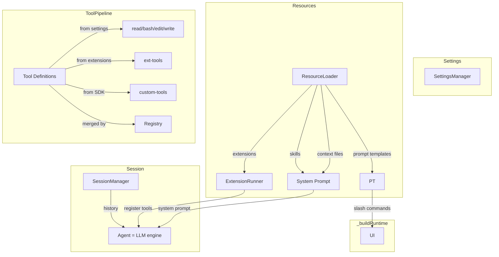
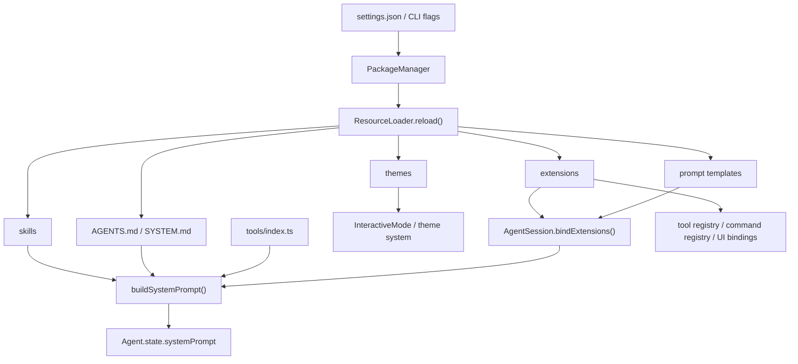

# [pi-coding-agent](https://github.com/earendil-works/pi-mono/tree/main/packages/coding-agent)

整个 pi monorepo 的**产品层 / 运行时编排层**。

如果说：

- `pi-ai` 解决的是"怎么和不同 LLM provider 说话"
- `pi-agent-core` 解决的是"怎么跑一轮 agent loop、怎么调工具、怎么维护消息状态"

那么 `pi-coding-agent` 解决的就是：

> **怎么把统一模型层和通用 agent loop 装配成一个可长期工作、可持久化、可扩展、可交互的 coding agent 产品。**

它对上暴露的是：

- CLI 产品入口 `pi`
- SDK 编程入口 `createAgentSession()` / `createAgentSessionRuntime()`
- 交互模式、print 模式、RPC 模式
- 会话树、压缩、分支、配置、system prompt、extension、skills、tools 这一整套产品机制

它对下负责的是：

- 调 `pi-ai` 找模型、拿认证、发请求、做流式输出
- 调 `pi-agent-core` 驱动 agent loop 和 tool call
- 把会话持久化到 JSONL
- 把 AGENTS.md / SYSTEM.md / skills / extensions / themes / prompts 这些外部资源装进运行时
- 把 TUI、CLI、RPC 这些不同 I/O 外壳接到同一个会话核心上

---

## 一个最小例子

先看最小编程接口，建立直觉：

```typescript
import { createAgentSession } from "@earendil-works/pi-coding-agent";

const { session } = await createAgentSession();

session.subscribe((event) => {
  if (event.type === "message_update") {
    // 这里可以接自己的 UI
  }
});

await session.prompt("帮我阅读当前项目的入口并解释启动流程");
```

这个例子背后，`pi-coding-agent` 已经替你做了很多产品层工作：

- 选择和恢复 session
- 装载默认工具
- 加载 settings / AGENTS.md / SYSTEM.md / skills / extensions
- 恢复模型与 thinking level
- 组装 system prompt
- 将所有消息和状态写回 session 文件

---

## 整个包的分层图

`packages/coding-agent/src` 可以粗分成六层：

```text
六、产品外壳层
    cli.ts: Node CLI 真正入口，负责进程级初始化后转给 main.ts
    main.ts: 启动编排器，负责参数解析、session 选择、runtime 创建、模式分发
    
    bun/cli.ts: Bun 打包产物入口壳，解决 Bun 环境下的启动适配
    bun/restore-sandbox-env.ts: Bun 沙箱环境变量恢复，解决 Bun 打包后环境差异
    
    config.ts: 全局常量定义（APP_NAME、路径、环境变量 key、版本检查等）
    migrations.ts: 应用级数据迁移（旧版本目录结构升级等）
    index.ts: 公共 API 聚合导出，定义对外的模块边界
    package-manager-cli.ts: 包管理 CLI 入口，独立于主 agent 进程运行
    
    cli/args.ts: CLI 参数类型定义和解析（--model、--session、--resume 等所有 flag）
    cli/config-selector.ts: 启动时配置源选择（交互式或参数驱动）
    cli/file-processor.ts: 文件参数处理器（--file 传入的文件预处理）
    cli/initial-message.ts: 启动时的初始消息处理（--prompt / 管道输入等）
    cli/list-models.ts: --list-models 命令实现，列出所有可用 provider/model
    cli/session-picker.ts: --resume 的交互式会话选择器 UI

五、运行模式层
    modes/index.ts: 运行模式统一导出
    modes/print-mode.ts: 一次性执行壳，把 session 输出成纯文本或 JSON 事件流
    modes/interactive/interactive-mode.ts: 交互式 TUI 主控制器，管理输入循环和组件编排
    modes/interactive/theme/theme.ts: 主题系统，管理颜色方案和 UI 样式
    modes/interactive/components/index.ts: 组件导出聚合
    modes/interactive/components/assistant-message.ts: 助手消息渲染组件
    modes/interactive/components/user-message.ts: 用户消息渲染组件
    modes/interactive/components/user-message-selector.ts: 用户消息选择器（/resume 时选择起点）
    modes/interactive/components/custom-message.ts: 自定义消息渲染组件
    modes/interactive/components/custom-editor.ts: 自定义编辑器组件（command mode）
    modes/interactive/components/footer.ts: 状态栏组件（token/费用/耗时显示）
    modes/interactive/components/settings-selector.ts: /settings 配置面板
    modes/interactive/components/model-selector.ts: /model 切换面板
    modes/interactive/components/scoped-models-selector.ts: Ctrl+P 限定模型切换面板
    modes/interactive/components/thinking-selector.ts: /thinking 思维级别切换面板
    modes/interactive/components/auth-selector.ts: /login 认证提供方选择面板
    modes/interactive/components/theme-selector.ts: /theme 主题切换面板
    modes/interactive/components/tree-selector.ts: /tree 会话树导航面板
    modes/interactive/components/session-selector.ts: /session 会话列表面板
    modes/interactive/components/session-selector-search.ts: 会话搜索过滤
    modes/interactive/components/config-selector.ts: 配置选项选择器
    modes/interactive/components/extension-selector.ts: 扩展选择面板
    modes/interactive/components/extension-input.ts: 扩展输入组件
    modes/interactive/components/extension-editor.ts: 扩展编辑器组件
    modes/interactive/components/show-images-selector.ts: 图片显示配置面板
    modes/interactive/components/bash-execution.ts: bash 命令执行 UI 组件
    modes/interactive/components/tool-execution.ts: 工具调用执行状态 UI
    modes/interactive/components/diff.ts: 代码 diff 渲染组件
    modes/interactive/components/skill-invocation-message.ts: 技能调用消息渲染
    modes/interactive/components/compaction-summary-message.ts: 压缩摘要消息渲染
    modes/interactive/components/branch-summary-message.ts: 分支摘要消息渲染
    modes/interactive/components/keybinding-hints.ts: 快捷键提示组件
    modes/interactive/components/login-dialog.ts: 登录对话框
    modes/interactive/components/dynamic-border.ts: 动态边框渲染
    modes/interactive/components/bordered-loader.ts: 带边框的加载动画
    modes/interactive/components/countdown-timer.ts: 倒计时组件（重试延迟显示）
    modes/interactive/components/visual-truncate.ts: 可视化截断组件
    modes/interactive/components/armin.ts: armin 特效组件
    modes/interactive/components/earendil-announcement.ts: 公告栏组件
    modes/rpc/rpc-mode.ts: headless RPC 模式主控制器，把 AgentSessionRuntime 暴露为 JSONL 协议
    modes/rpc/rpc-types.ts: RPC 协议类型定义（请求/响应/事件类型）
    modes/rpc/rpc-client.ts: RPC 客户端实现，管理 stdin/stdout JSONL 通信
    modes/rpc/jsonl.ts: JSONL 解析与序列化工具

四、会话运行时层
    core/agent-session-runtime.ts: 当前激活 session 的宿主，负责 new/resume/fork/import/switch
    core/agent-session-services.ts: cwd 绑定的基础设施工厂，集中创建 settings、auth、model registry、resource loader
    core/sdk.ts: 会话装配入口，把模型、工具、session manager、resource loader 拼成 AgentSession
    core/agent-session.ts: 产品核心对象，负责 prompt、持久化、扩展绑定、bash、compaction、tree navigation

三、产品机制层
    core/session-manager.ts: session tree、JSONL entry 持久化、上下文重建
    core/compaction/*: 长对话压缩、branch summary、文件操作摘要和切点计算
    core/settings-manager.ts: 全局/项目 settings 加载、深度合并、迁移与持久化
    core/system-prompt.ts: 把工具、context files、skills、日期、cwd 拼成最终 system prompt
    core/resource-loader.ts: 统一装载 extensions、skills、prompts、themes、AGENTS.md、SYSTEM.md
    core/model-registry.ts: provider/model 注册表，API key 解析和模型发现
    core/model-resolver.ts: 默认模型选择、CLI 覆盖、scoped models 优先级解析
    core/prompt-templates.ts: prompt template 的发现、解析与运行时展开
    core/package-manager.ts: 把 settings 中声明的包来源（npm/git/local）解析成资源路径
    core/bash-executor.ts: bash 命令执行引擎，在伪终端中运行命令并流式返回输出
    core/exec.ts: 子进程生命周期封装，管理 spawn/kill/signal 和输出缓冲
    core/messages.ts: 自定义消息类型编码（BashExecutionMessage/CustomMessage）与转换器
    core/slash-commands.ts: 斜杠命令解析与路由（/model /session /settings /name 等）
    core/keybindings.ts: 快捷键常量和默认绑定（Ctrl+P/Ctrl+O/Escape 等）及处理函数
    core/output-guard.ts: 模型输出守卫，拦截敏感信息、过滤无效输出
    core/session-cwd.ts: session 文件头中的 cwd 解析与恢复

二、扩展与工具层
    core/extensions/*: extension 协议定义、加载器、运行器和桥接层
    core/extensions/types.ts: extension 类型系统（Extension、ExtensionRuntime、事件/钩子接口）
    core/extensions/loader.ts: extension 加载器，从文件系统加载 d.ts/js 扩展代码
    core/extensions/runner.ts: extension 运行时，管理生命周期和事件分发
    core/extensions/wrapper.ts: extension 包装器，给 agent 暴露 API 入口
    core/extensions/index.ts: extension 模块统一导出
    core/skills.ts: skill 发现、frontmatter 解析、冲突处理和 <available_skills> 注入
    core/tools/index.ts: 内建工具集合统一导出和注册
    core/tools/read.ts: 文件读取工具（schema + 执行逻辑）
    core/tools/edit.ts: 文件编辑工具（基于 SearchReplace 模式）
    core/tools/write.ts: 文件写入工具
    core/tools/bash.ts: bash 命令执行工具
    core/tools/grep.ts: 文本搜索工具（ripgrep 封装）
    core/tools/find.ts: 文件名搜索工具
    core/tools/ls.ts: 目录列表工具
    core/tools/edit-diff.ts: 编辑差异生成和预览
    core/tools/tool-definition-wrapper.ts: AgentTool → ToolDefinition 包装器
    core/tools/file-mutation-queue.ts: 文件变更队列，管理批量编辑的顺序执行
    core/tools/output-accumulator.ts: 工具输出累积器，聚集流式输出为完整结果
    core/tools/truncate.ts: 输出截断工具，防止过大的工具结果爆上下文
    core/tools/render-utils.ts: 工具结果渲染辅助函数
    core/tools/path-utils.ts: 路径安全检查与规范化

一、基础支撑层
    core/event-bus.ts: 轻量事件总线，给扩展和运行时传播内部事件
    core/messages.ts: 消息内容辅助逻辑和消息级工具函数
    core/timings.ts: 耗时统计，记录工具调用、LLM 请求、压缩各阶段耗时
    core/diagnostics.ts: 诊断信息收集，/diagnostics 命令的数据来源
    core/auth-storage.ts: API 密钥持久化存储，支持加密和跨进程共享
    core/auth-guidance.ts: 认证引导文案生成，未登录时的提示信息
    core/telemetry.ts: 匿名遥测数据收集和上报
    core/footer-data-provider.ts: 状态栏数据计算（token 数、费用、耗时等）
    core/http-dispatcher.ts: HTTP 请求调度器，管理重试、超时和并发
    core/resolve-config-value.ts: 配置值解析工具，统一处理 env var 和 settings 读取
    core/provider-display-names.ts: provider ID 到展示名称的映射（如 anthropic-vertex → Anthropic）
    core/source-info.ts: 工具来源标识（builtin / extension / sdk-custom）
    core/defaults.ts: 全局默认常量（默认模型、超时、路径等兜底值）
    core/index.ts: core 模块公共 API 聚合导出
    utils/ansi.ts: ANSI 转义序列处理
    utils/changelog.ts: changelog 版本检查和展示
    utils/child-process.ts: 子进程管理辅助
    utils/clipboard.ts: 剪贴板操作（统一接口）
    utils/clipboard-image.ts: 剪贴板图片提取
    utils/clipboard-native.ts: 平台原生剪贴板
    utils/exif-orientation.ts: 图片 EXIF 方向处理
    utils/frontmatter.ts: Markdown frontmatter 解析
    utils/fs-watch.ts: 文件系统监听
    utils/git.ts: git 操作辅助
    utils/html.ts: HTML 导出辅助
    utils/image-convert.ts: 图片格式转换
    utils/image-resize.ts: 图片尺寸调整
    utils/image-resize-core.ts: 图片缩放核心算法
    utils/image-resize-worker.ts: 图片缩放 Worker 线程
    utils/mime.ts: MIME 类型检测
    utils/paths.ts: 路径处理工具
    utils/photon.ts: 终端渲染底层库
    utils/pi-user-agent.ts: HTTP User-Agent 生成
    utils/shell.ts: shell 环境检测和配置（PS1、ANSI 支持等）
    utils/sleep.ts: sleep 工具函数
    utils/syntax-highlight.ts: 代码语法高亮
    utils/tools-manager.ts: 工具生命周期管理器
    utils/version-check.ts: 版本检查（新版本通知）
    utils/windows-self-update.ts: Windows 自助更新
```

```
┌───────────────────────────────────────────────────────────────────────────┐
│                         六、产品外壳层                                      │
│                                                                           │
│   cli.ts                      main.ts                     bun/cli.ts      │
│   (Node CLI 入口) ────────→ (启动编排器) ←──────────── (Bun 适配入口)         │
│   进程级初始化               参数解析 / session选择                           │
│                              runtime创建 / 模式分发                         │
│                                    │                                      │
├────────────────────────────────────┼──────────────────────────────────────┤
│                         五、运行模式层                                      │
│                                    │                                      │
│         ┌──────────────────────────┼──────────────────────────┐           │
│         ▼                          ▼                          ▼           │
│  modes/interactive/*       modes/print-mode.ts        modes/rpc/*         │
│  ┌──────────────────┐    ┌──────────────────┐    ┌──────────────────┐     │
│  │ InteractiveMode  │    │ PrintMode        │    │ RpcServer        │     │
│  │ (交互式 TUI 壳)   │    │ (一次性执行壳)     │    │ (headless JSONL) │     │
│  │                  │    │                  │    │                  │     │
│  │ • settings-select│    │ • --print-events │    │ • JSONL 协议      │     │
│  │ • 主题系统        │    │ • --print-latest  │    │ • stdin/stdout  │     │
│  │ • 组件系统        │    │ • 管道模式         │    │ • 外部集成        │     │
│  └────────┬─────────┘    └────────┬─────────┘    └────────┬─────────┘     │
│           │                       │                       │               │
│           └───────────────────────┼───────────────────────┘               │
│                                   │                                       │
├───────────────────────────────────┼───────────────────────────────────────┤
│                       四、会话运行时层                                       │
│                                   │                                       │
│  ┌────────────────────────────────┼──────────────────────────────────┐    │
│  │                    AgentSessionRuntime (组合容器)                   │   │
│  │                                                                    │   │
│  │  fork() / newSession() / switchSession() / resume() / import()     │   │
│  │    └→ 销毁旧 session → 重新走完整创建链路 → 替换 .session               │   │
│  │                                                                    │   │
│  │  ┌───────────────────────────────────────────────────────────┐     │   │
│  │  │              agent-session-services.ts                    │     │   │
│  │  │           (cwd 绑定的基础设施工厂)                           │     │   │
│  │  │                                                           │     │   │
│  │  │  createAgentSessionServices()                             │     │   │
│  │  │    → AuthStorage / SettingsManager / ModelRegistry        │     │   │
│  │  │    → DefaultResourceLoader / Extension加载                 │     │   │
│  │  │                                                           │     │   │
│  │  │  createAgentSessionFromServices()                         │     │   │
│  │  │    → 模型分辨率 / 工具注册 / 参数合并                         │     │   │
│  │  │    └──────────────────────┐                               │    │   │
│  │  └───────────────────────────┼───────────────────────────────┘    │   │
│  │                              ▼                                    │   │
│  │  ┌──────────────────────────────────────────────────────────┐     │   │
│  │  │                     sdk.ts (唯一工厂)                     │     │   │
│  │  │                 createAgentSession(options)              │     │   │
│  │  │                                                          │     │   │
│  │  │  new Agent(...) + new AgentSession({...})                │     │   │
│  │  │                                                          │     │   │
│  │  │  ┌──────────────────────────────────────────────────┐    │     │   │
│  │  │  │              AgentSession (核心对象)              │    │     │   │
│  │  │  │                                                  │    │     │   │
│  │  │  │  session.start()  /  session.submit()            │    │     │   │
│  │  │  │  session.interrupt()  /  session.pause()         │    │     │   │
│  │  │  │                                                  │    │     │   │
│  │  │  │  组装并持有以下全部产品机制层模块 ────────────────────┼┐   │     │   │
│  │  │  └──────────────────────────────────────────────────┘│   │     │   │
│  │  └──────────────────────────────────────────────────────┼───┘     │   │
│  └─────────────────────────────────────────────────────────┼─────────┘   │
│                                                            │             │
├────────────────────────────────────────────────────────────┼─────────────┤
│                       三、产品机制层                         │             │
│                                                            │             │
│  ┌────────────────────────┐  ┌──────────────────────────┐  │             │
│  │   session-manager.ts   │  │   settings-manager.ts    │  │             │
│  │                        │  │                          │  │             │
│  │  • session tree        │  │  • global/project merge  │  │             │
│  │  • JSONL 追加式持久化    │  │  • 脏字段追踪增量写入       │  │             │
│  │  • branch / fork       │  │  • 文件锁保护 (withLock)   │  │             │
│  │  • buildSessionContext │  │  • 序列化写入队列           │  │             │
│  │  • 9 种 Entry 类型      │  │  • 版本迁移                │  │             │
│  └────────────────────────┘  └──────────────────────────┘  │             │
│                                                            │             │
│  ┌───────────────────────┐  ┌──────────────────────────┐   │             │
│  │  compaction/*         │  │   resource-loader.ts     │   │             │
│  │                       │  │                          │   │             │
│  │  • 长对话压缩          │  │  • extensions 统一装载     │◄──┘             │
│  │  • branch summary     │  │  • skills / prompts      │                 │
│  │  • 文件操作摘要         │  │  • themes / AGENTS.md    │                 │
│  │  • 切点计算            │  │  • SYSTEM.md 上下文       │                 │
│  └───────────────────────┘  └──────────────────────────┘                 │
│                                                                          │
│  ┌───────────────────────┐  ┌──────────────────────────┐                 │
│  │   system-prompt.ts    │  │  model-registry.ts       │                 │
│  │                       │  │  model-resolver.ts       │                 │
│  │  • tools + context    │  │                          │                 │
│  │  • skills 注入         │  │  • provider/model 可见性  │                 │
│  │  • guidelines 格式化   │  │  • 默认模型解析            │                 │
│  │  • 日期 / cwd 拼接     │  │  • CLI 覆盖 / scoped      │                 │
│  └───────────────────────┘  └──────────────────────────┘                 │
│                                                                          │
│  ┌───────────────────────┐  ┌──────────────────────────┐                 │
│  │  prompt-templates.ts  │  │  package-manager.ts      │                 │
│  │  • 模板发现与解析       │  │  • package 来源 → 资源     │                 │
│  │  • 变量展开            │  │  • 路径解析与缓存           │                 │
│  └───────────────────────┘  └──────────────────────────┘                 │
│                                                                          │
├──────────────────────────────────────────────────────────────────────────┤
│                       二、扩展与工具层                                      │
│                                                                          │
│  ┌───────────────────────┐  ┌──────────────────────────┐                 │
│  │  extensions/*         │  │   skills.ts              │                 │
│  │                       │  │                          │                 │
│  │  • extension 协议      │  │  • SKILL.md 发现与解析    │                 │
│  │  • 加载器 / 运行器      │  │  • frontmatter 提取      │                  │
│  │  • 桥接层 (生命周期)    │  │  • 冲突处理 / 去重         │                 │
│  │  • 自定义工具注册       │  │  • available_skills 注入  │                 │
│  └───────────────────────┘  └──────────────────────────┘                 │
│                                                                          │
│  ┌────────────────────────────────────────────────────────────────┐      │
│  │                       tools/*                                  │      │
│  │                                                                │      │
│  │  read.ts / edit.ts / write.ts / bash.ts / find.ts / grep.ts    │      │
│  │  ls.ts / glob.ts / web-search.ts / web-fetch.ts / task.ts      │      │
│  │                                                                │      │
│  │  • 工具 schema 定义 + 执行逻辑                                    │      │
│  │  • 权限控制 / 路径安全检查                                         │      │
│  │  • agent → tool call → toolResult 三角                          │      │
│  └────────────────────────────────────────────────────────────────┘      │
│                                                                          │
├──────────────────────────────────────────────────────────────────────────┤
│                       一、基础支撑层                                        │
│                                                                           │
│  ┌──────────────┐ ┌──────────────┐ ┌──────────────┐ ┌──────────────┐      │
│  │  utils/*     │ │  event-bus   │ │  messages    │ │  timings     │      │
│  │              │ │              │ │              │ │  diagnostics │      │
│  │  • shell     │ │  • 轻量事件   │ │  • 消息辅助   │ │  • 耗时统计    │      │
│  │  • 路径       │ │  • 扩展传播   │ │  • 内容判断   │ │  • 诊断输出    │      │
│  │  • 图片       │ │  • 生命周期   │ │  • 格式转换   │ │  • 运行时观测  │      │
│  │  • 剪贴板     │ │              │ │              │ │              │      │
│  │  • HTML导出   │ │              │ │              │ │              │      │
│  │  • 版本检查   │ │              │ │              │ │              │       │
│  └──────────────┘ └──────────────┘ └──────────────┘ └──────────────┘       │
│                                                                            │
└────────────────────────────────────────────────────────────────────────────┘
```

**主线 1：运行时主线**

* `cli.ts -> main.ts -> createAgentSessionRuntime() -> createAgentSession() -> AgentSession -> Interactive/Print/RPC`

**主线 2：资源注入主线**

- `settings -> package manager -> resource loader -> extensions/skills/prompts/themes -> system prompt -> active tools`

- main.ts → runtime → services → sdk.ts 是完整的创建链

- sdk.ts = AgentSession 的唯一工厂 ，组装所有产品机制层模块（sessionManager / settingsManager / resourceLoader / modelRegistry）。无论是 CLI 还是外部 SDK 消费者，最终都经过这里。

- services 层负责在 AgentSession 创建前完成模型分辨率和工具注册

- agent-session-runtime.ts = 组合外壳 ，不继承 AgentSession，而是持有它并支持热替换（fork 时销毁重建）

- modes/interactive 是消费者 ，通过 runtime.session 拿到 AgentSession，再调 sessionManager 的 append 方法和 settingsManager 的 setter 等

  ```
  InteractiveMode.run(runtime)                              
        │                                                      
        ├→ runtime.session.sessionManager.appendMessage(...)    
        ├→ runtime.session.settingsManager.setTheme(...)        
        ├→ runtime.fork()  →  内部重建 AgentSession              
        └→ runtime.session.resourceLoader.reload()
  ```

## 配置文件

* package.json 是一个 JSON 格式的元数据文件，用于描述 JavaScript 项目的基本信息、依赖关系、构建配置和发布规范。它是 npm（Node Package Manager）生态系统的核心组成部分。

  ```json
  {
    "name": "@earendil-works/pi-coding-agent",      // npm 包名，发布到 npm 时用这个名字
    "version": "0.75.5",                            // 当前版本号，遵循 semver（主版本.次版本.补丁）
    "description": "Coding agent CLI with read, bash, edit, write tools and session management",  // 包的简短描述，npm search 时会显示
  
    "type": "module",                               // 使用 ES Modules（import/export）而非 CommonJS（require）
  
    "piConfig": {                                   // pi 自定义字段，非 npm 标准，pi 内部读取来确定项目级配置目录名
      "configDir": ".pi"                            // 项目根目录下的配置文件夹名（如 .pi/settings.json、.pi/AGENTS.md）
    },
  
    "bin": {                                        // npm 全局安装时创建的 CLI 命令
      "pi": "dist/cli.js"                           // 用户敲 `pi` 时执行 dist/cli.js
    },
  
    "main": "./dist/index.js",                      // CommonJS 时代的主要入口，现在被 "exports" 取代，但保留兼容性
    "types": "./dist/index.d.ts",                   // TypeScript 类型声明入口，供导入这个包的项目获得类型提示
  
    "exports": {                                    // Node.js 的现代模块入口映射，控制 `import "xxx"` 时解析到哪个文件
      ".": {                                        // import "@earendil-works/pi-coding-agent" 时
        "types": "./dist/index.d.ts",              //   TypeScript 去哪找类型 index.d.ts
        "import": "./dist/index.js"                //   Node.js 运行时去哪找代码 index.js
      },
      "./hooks": {                                  // import "@earendil-works/pi-coding-agent/hooks" 时（子路径导出）
        "types": "./dist/core/hooks/index.d.ts",   //   类型解析到 hooks/index.d.ts
        "import": "./dist/core/hooks/index.js"     //   运行时解析到 hooks/index.js
      }
    },
  
    "files": [                                      // npm publish 时只包含这些文件/目录到包里
      "dist",                                       //   编译产物
      "docs",                                       //   文档
      "examples",                                   //   示例代码
      "CHANGELOG.md",                               //   变更日志
      "npm-shrinkwrap.json"                         //   锁定依赖版本（发布时用）
    ],
  
    "scripts": {                                    // npm run xxx 执行的脚本
      "clean": "shx rm -rf dist",                   // 清理编译产物（shx 是跨平台的 shell 命令封装）
      "build": "tsgo -p tsconfig.build.json && shx chmod +x dist/cli.js && npm run copy-assets",  // 编译 TS -> JS，给 cli.js 加可执行权限，复制静态资源
      "build:binary": "...",                        // 编译成独立 Bun 二进制文件（用于发布独立可执行程序）
      "copy-assets": "...",                         // 复制主题 JSON、图标 PNG、HTML 模板等静态资源到 dist/
      "copy-binary-assets": "...",                  // Bun 二进制构建时的资源复制（路径不同）
      "test": "vitest --run",                       // 运行测试（vitest，单次运行）
      "shrinkwrap": "node ../../scripts/generate-coding-agent-shrinkwrap.mjs",  // 生成锁文件，固定发布包的依赖版本
      "prepublishOnly": "npm run clean && npm run build && npm run shrinkwrap"  // npm publish 之前自动执行：清理 -> 编译 -> 生成锁文件
    },
  
    "dependencies": {                               // 运行时依赖（用户安装这个包时会自动安装这些）
      "@earendil-works/pi-agent-core": "^0.75.5",   // agent 循环引擎
      "@earendil-works/pi-ai": "^0.75.5",           // AI 模型调用层
      "@earendil-works/pi-tui": "^0.75.5",          // 终端 UI 框架
  	...
    },
  
    "overrides": {                                  // 强制覆盖传递依赖的版本（解决安全漏洞或兼容性问题）
      "rimraf": "6.1.2",
      "gaxios": { "rimraf": "6.1.2" }
    },
  
    "optionalDependencies": {                       // 可选依赖，安装失败不会中断（比如剪贴板功能）
      "@mariozechner/clipboard": "0.3.6"
    },
  
    "devDependencies": {                            // 开发时依赖（不会随包发布）
      "@types/cross-spawn": "6.0.6",                // 类型定义
      "@types/diff": "7.0.2",
      "@types/hosted-git-info": "3.0.5",
      "@types/ms": "2.1.0",
      "@types/node": "24.12.4",
      "@types/proper-lockfile": "4.1.4",
      "shx": "0.4.0",                               // 跨平台 shell 命令（在 scripts 里用）
      "typescript": "5.9.3",                        // TypeScript 编译器
      "vitest": "3.2.4"                             // 测试框架
    },
  
    "keywords": [                                   // npm 搜索关键词
      "coding-agent", "ai", "llm", "cli", "tui", "agent"
    ],
  
    "author": "Mario Zechner",                      // 作者
    "license": "MIT",                               // 开源协议
  
    "repository": {                                 // 源码仓库地址
      "type": "git",
      "url": "git+https://github.com/earendil-works/pi-mono.git",
      "directory": "packages/coding-agent"          // 在 monorepo 中的子目录位置
    },
  
    "engines": {                                    // 要求的 Node.js 最低版本
      "node": ">=22.19.0"
    }
  }
  ```

* npm-shrinkwrap.json - npm 锁定文件，确保依赖版本在所有环境中保持一致。与 package-lock.json 类似，但会被发布到 npm 注册表中。

  自动生成，由 scripts/generate-coding-agent-shrinkwrap.mjs 脚本从根目录的 package-lock.json 提取和转换而来。不要手动编辑。

* tsconfig.build.json - TypeScript 构建配置，用于将 TypeScript 代码编译为 JavaScript。指定了输出目录、根目录和包含/排除的文件。手写。

* tsconfig.examples.json - 示例代码的 TypeScript 配置，专门用于检查 examples/ 目录下的示例文件。配置了路径别名，让示例代码可以直接引用本地源代码而不是编译后的包。手写。

* vitest.config.ts - Vitest 测试框架的配置文件，设置测试环境、超时时间、依赖处理和路径别名。路径别名让测试可以直接引用源代码，便于调试和开发。手写。

## 主调用链（产品外壳层、会话运行时层）

从 `pi` 命令启动到进入交互模式，主调用链路本质上是在**启动一个可切换、可恢复、可扩展的 session runtime**，然后再给这个 runtime 套上 interactive / print / rpc 三种外壳：

`cli.ts -> main.ts -> runtime -> services -> session -> modes`

### `cli.ts` CLI 入口文件（shebang 脚本）

```
1、设置进程元数据（标题、环境变量）
2、配置全局 HTTP 调度器（core/http-dispatcher.ts 中的 `configureHttpDispatcher`）
3、启动应用（main.ts 中的 main(argv)）
```

```ts
// ── import ──────────────────────────────────────────────────────────
// 应用名称常量，用于设置进程标题和窗口标识
import { APP_NAME } from "./config.ts";
// 配置 undici 全局 HTTP 调度器，统一管理所有出站 HTTP 请求的行为（超时、重试等）
import { configureHttpDispatcher } from "./core/http-dispatcher.ts";
// 应用主函数，负责解析参数并启动对应的运行模式
import { main } from "./main.ts";

// ── 进程设置 ──
// 设置进程标题，使其在 `ps` / `top` 等工具中显示为应用名称而非 "node"
process.title = APP_NAME;
// 这里标记当前进程为 coding-agent
process.env.PI_CODING_AGENT = "true";
// 禁用 Node.js 的 process.emitWarning，避免在运行过程中输出无关的警告信息干扰用户
process.emitWarning = (() => {}) as typeof process.emitWarning;

// ── 创建支持代理的 undici 全局 HTTP 调度器 ───
// 1、后续程序发起的 fetch() 请求都走这个配置。这样就不用每个请求都单独设置代理和超时了
// 2、main() 启动后， SettingsManager 会读取用户的配置文件：~/.pi/agent/settings.json （全局设置）.pi/settings.json （项目设置），如果用户在这里设置了自定义超时或代理， SettingsManager 会再次调用 该函数用新值覆盖默认值
configureHttpDispatcher();

// ── 启动应用 ──
// 将命令行参数（去掉前两个元素：node 和脚本路径）传入 main 函数，
// 由 main.ts 根据参数决定进入哪种运行模式（交互模式 / 打印模式 / RPC 模式）。
main(process.argv.slice(2));
```

> 1、process 是 Node.js 的**全局对象**，代表当前运行的进程。
>
> * process.env 就像一张"进程信息贴纸"，启动时 Shell 已经贴了一些（PATH、HOME、API_KEY...），代码运行时可以再往上贴自己的标签
>
> * process.argv 是 Node.js 用来获取**命令行参数**的全局数组
>
>   示例：
>
>   ```sh
>   pi --mode rpc -p "hello"
>   ```
>
>   此时 process.argv 为：
>
>   ```ts
>   [
>     "/usr/local/bin/node",         // argv[0] - Node 路径
>     "/path/to/dist/cli.js",        // argv[1] - 脚本路径
>     "--mode",                      // argv[2] - 第一个实参
>     "rpc",                         // argv[3]
>     "-p",                          // argv[4]
>     "hello"                        // argv[5]
>   ]
>   ```
>
> 2、package.json 里的 bin 字段设置
>
> ```json
> {
>   "name": "pi-coding-agent",
>   "bin": {
>     "pi": "./dist/cli.js"
>   }
> }
> ```
>
> npm 读到这个配置后，在 npm install -g 时会自动在全局 bin/ 目录（比如 /usr/local/bin/ ）创建一个符号链接 pi 指向 ./dist/cli.js。当用户敲 pi 时，系统沿着符号链接找到 cli.js ，看到它的 shebang #!/usr/bin/env node，就用 node 来执行它。
>
> 3、undici 是 Node.js 官方的 HTTP 客户端库。
>
> ```ts
> fetch(url)          ← 你写的代码，对外接口
>    ▼
> undici              ← 真正的 HTTP 收发引擎
>    ├─ dispatcher    ← 可替换的"零件": 控制怎么建连接、走不走代理
>    └─ 其他底层组件   ← DNS 解析、TLS 握手、连接池...
> ```

### `main.ts` 产品启动编排器

```ts
main.ts 
参数：args: 命令行参数数组（不含 node 和脚本路径），options: 可选配置（如扩展工厂）
  -> 阶段 1 - 初始化和预处理：
      1、重置计时器（core/timings.ts 中的 `resetTimings`）
      2、检测离线模式（--offline 或 PI_OFFLINE 环境变量），跳过联网更新
      3、Windows 平台清理自更新隔离文件（utils/windows-self-update.ts 中的 `cleanupWindowsSelfUpdateQuarantine`） 
      
  -> 阶段 2 - 包管理命令处理：
	  1、调用 `handlePackageCommand` 处理包管理命令 install、remove、list、update
 	  2、调用 `handleConfigCommand` 处理配置命令 config
      
  -> 阶段 3 - 参数解析和模式决策：
	  1、解析 CLI 参数（cli/args.ts 中的 `parseArgs`），报告诊断信息，计时 time("parseArgs");
	  2、调用 `resolveAppMode` 确定应用运行模式：interactive 默认 / print / json / rpc
	  3、非交互模式下接管 stdout（core/output-guard.ts 中的 `takeOverStdout`）以保护输出，将 process.stdout.write 重定向到 stderr
      
  -> 阶段 4 - 快速退出路径：
	  1、--version: 输出版本号后退出 console.log(VERSION);
	  2、--export: 导出会话为 HTML 后退出（core/export-html/index.ts 中的 `exportFromFile`）
	  3、RPC 模式下禁止 @file 参数 console.error(chalk.red("Error...");
      
  -> 阶段 5 - 会话管理器创建：
	  1、调用 `validateForkFlags` 验证 --fork 标志冲突
	  2、执行数据迁移（migration.ts 中的 `runMigrations`），计时 time("runMigrations");
	  3、创建启动阶段的 SettingsManager，仅用于会话目录查找（core/settings-manager.ts 中的 `SettingsManager.create`），调用 `reportDiagnostics` 将诊断信息输出到 stderr
	  4、解析会话目录（core/settings-manager.ts 中的 `startupSettingsManager.getSessionDir`）
	  5、调用 `createSessionManager` 创建会话管理器，根据 --no-session/--fork/--session/--resume/--continue 决策
	  6、检查会话的 cwd 是否存在问题（session-cwd.ts 中的 `getMissingSessionCwdIssue`），调用 `promptForMissingSessionCwd` 处理会话 cwd 缺失问题
      计时 time("createSessionManager");

  -> 阶段 6 - 运行时服务初始化：
	  1、调用 `resolveCliPaths` 解析 CLI 路径参数（extensions、skills、promptTemplates、themes）
	  2、创建 AuthStorage（auth-storage.ts 中的 AuthStorage.create）
	  3、定义 createRuntime 工厂函数，内部：
		a. 创建会话服务（agent-session-services.ts 中的 `createAgentSessionServices`）
		b. 解析模型作用域（model-resolver.ts 中的 `resolveModelScope`）
		c. 调用 `buildSessionOptions` 构建会话选项
		d. 处理 --api-key 参数（auth-storage.ts 中的 `authStorage.setRuntimeApiKey`）
		e. 创建会话（core/agent-session-services.ts 中的 `createAgentSessionFromServices`），然后设置思考级别（core/agent-session.ts 中的 `setThinkingLevel`）
        计时 time("createRuntime");
	  4、执行运行时创建（core/agent-session-runtime.ts 中的 `createAgentSessionRuntime`）
        a. 断言会话工作目录存在（core/session-cwd.ts 中的 `assertSessionCwdExists`）
        b. 调用 `createRuntime`
      5、配置 HTTP 请求分发器的空闲超时时间（http-dispatcher.ts 中的 `configureHttpDispatcher`）

  -> 阶段 7 - 后处理和模式启动：
	  1、--help: 显示帮助信息后退出（cli/args.ts 中的 `printHelp`）
	  2、--list-models: 列出可用模型后退出（cli/list-models.ts 中的 `listModels`）
	  3、调用 `readPipedStdin` 读取管道 stdin 输入（RPC 模式跳过，因为 stdin 用于 JSON-RPC 通信），计时 time("readPipedStdin");
	  4、调用 `prepareInitialMessage` 准备会话初始消息，计时 time("prepareInitialMessage");
	  5、初始化主题（modes/interactive/theme 中的 `initTheme` ），计时 time("initTheme");
  	  6、显示迁移弃用警告（migration.ts 中的 `showDeprecationWarnings`），计时 time("resolveModelScope");
	  7、调用 `reportDiagnostics` 报告诊断信息，如有错误则退出，计时 time("createAgentSession");
	  8、根据应用模式启动运行：
        a. 每种情况都会先将所有计时记录输出到 stderr（core/timing.ts 中的 `printTimings`）
		b. rpc: runRpcMode(runtime) / interactive: InteractiveMode.run(runtime) / print/json: runPrintMode(runtime)
```


### 会话运行时外壳

```
main.ts
  -> 1、定义 createRuntime 工厂函数
  -> 2、createAgentSessionRuntime(createRuntime, initialOptions) // 把工厂和初始结果装进 runtime
  	-> （1）先调用 createRuntime(initialOptions) 工厂
  	  -> createAgentSessionServices(...) // 先造 services
  	    -> 返回 AgentSessionServices
  	  -> createAgentSessionFromServices(...) // 再基于 services 造 AgentSession
  	    -> 内部委托给 sdk.ts:createAgentSession(...)，得到 AgentSession(...)
  	    -> 返回 { session, extensionsResult, modelFallbackMessage }
  	  -> 工厂返回 { session, services, diagnostics, modelFallbackMessage }
 	-> （2）再 new AgentSessionRuntime(session, services, createRuntime, diagnostics, modelFallbackMessage)
```

> **为什么 `main.ts` 要自己定义 `createRuntime`？**这是最关键的一个点。
>
> 它不会直接写死：
>
> ```typescript
> const runtime = await createAgentSessionRuntime(...)
> ```
>
> 而是先定义一个 `createRuntime` 闭包，再交给 `createAgentSessionRuntime()` 使用。
>
> 这么做的原因是：
>
> - session 切换时，cwd 可能变化
> - cwd 变化时，`settingsManager` / `resourceLoader` / `modelRegistry` 这些服务都必须随 cwd 重建
> - 所以 runtime 需要一个**“如何重新创建自己”**的工厂，而不是一次性建好的死对象
>
> 于是：
>
> ```text
> main.ts
>   提供“如何创建一个 cwd 绑定 runtime”的工厂
>     ↓
> AgentSessionRuntime
>   在 new / resume / fork / import 时反复调用这个工厂
> ```
>

三层对象：

```ts
宿主层：AgentSessionRuntime
环境层：AgentSessionServices
业务层：AgentSession
```

> **为什么要分三层？**
>
> 1、AgentSessionRuntime 与AgentSession 分层：两类生命周期，不该由同一对象同时负责
>
> * `AgentSession` 只负责“这个 session 怎么活”，承担**会话生命周期**
> * 产品层还要支持：`newSession()`、`switchSession()`、`fork()`、`importFromJsonl()`，承担**宿主生命周期**
>
> 2、AgentSessionServices 与AgentSession 分层：cwd 绑定的环境状态和会话状态应该分开
>
> 让 CLI 层可以在真正创建 session 之前，先把下面这些事做完：
>
> - 解析模型范围
> - 决定 active tools
> - 装载 extensions
> - 收集 diagnostics
> - 处理 CLI 传入的 API key / flags

#### `core/agent-session.ts` **产品层真正的核心对象**

- 解决的是**运行问题**，关心“这轮对话怎么跑”
- 真正负责 prompt 进入队列、agent 事件订阅、持久化消息、tool hooks、extension 扩展绑定、自动压缩 compaction、retry、bash 执行、tree navigation、slash command / skill / prompt template / active tools


```ts
export class AgentSession {
	/** LLM 调用引擎，负责消息发送/流式响应/工具调用 */
	readonly agent: Agent;
	/** 会话持久化管理器，负责 JSONL 写入、分支、上下文重建 */
	readonly sessionManager: SessionManager;
	/** 配置管理器，负责全局/项目级设置的合并与持久化 */
	readonly settingsManager: SettingsManager;

	/** 会话级别绑定的模型白名单，可为不同 session 限定不同的 provider/model */
	private _scopedModels: Array<{ model: Model<any>; thinkingLevel?: ThinkingLevel }>;

	// -----------------------------------------------------------------
	// 事件订阅
	// -----------------------------------------------------------------

	/** Agent 事件订阅的取消函数，dispose 时调用以解绑 */
	private _unsubscribeAgent?: () => void;
	/** 外部注册的事件监听器列表 */
	private _eventListeners: AgentSessionEventListener[] = [];

	// -----------------------------------------------------------------
	// 用户交互消息队列
	// -----------------------------------------------------------------

	/** 待处理的 steer 打断消息队列，用于 UI 显示。消息被投递后移除。 */
	private _steeringMessages: string[] = [];
	/** 待处理的 follow-up 后续消息队列，用于 UI 显示。消息被投递后移除。 */
	private _followUpMessages: string[] = [];
	/** 排队等待在下一次用户提示词中作为上下文附带发送的消息。 */
	private _pendingNextTurnMessages: CustomMessage[] = [];

	// -----------------------------------------------------------------
	// 压缩（Compaction）
	// -----------------------------------------------------------------

	/** 手动触发的压缩取消控制器 */
	private _compactionAbortController: AbortController | undefined = undefined;
	/** 上下文溢出时自动触发的压缩取消控制器 */
	private _autoCompactionAbortController: AbortController | undefined = undefined;
	/** 当前轮次是否已尝试过溢出恢复（避免重复压缩死循环） */
	private _overflowRecoveryAttempted = false;

	// -----------------------------------------------------------------
	// 分支摘要
	// -----------------------------------------------------------------

	/** 分支摘要请求的取消控制器 */
	private _branchSummaryAbortController: AbortController | undefined = undefined;

	// -----------------------------------------------------------------
	// 自动重试
	// -----------------------------------------------------------------

	/** 重试请求的取消控制器 */
	private _retryAbortController: AbortController | undefined = undefined;
	/** 当前重试次数计数器 */
	private _retryAttempt = 0;

	// -----------------------------------------------------------------
	// Bash 执行
	// -----------------------------------------------------------------

	/** Bash 执行的取消控制器 */
	private _bashAbortController: AbortController | undefined = undefined;
	/** Bash 执行完成后待持久化的消息队列（先排队，batch 写入） */
	private _pendingBashMessages: BashExecutionMessage[] = [];

	// -----------------------------------------------------------------
	// 扩展系统
	// -----------------------------------------------------------------

	/** 扩展运行时，管理所有已加载扩展的生命周期和钩子 */
	private _extensionRunner!: ExtensionRunner;
	/** 当前会话的轮次计数（从 0 开始，每次用户提交递增） */
	private _turnIndex = 0;

	/** 资源加载器，统一管理 skills/prompts/themes/AGENTS.md 等外部资源 */
	private _resourceLoader: ResourceLoader;
	/** SDK 消费者注入的自定义工具定义列表 */
	private _customTools: ToolDefinition[];
	/** 内建工具的基础定义集合 */
	private _baseToolDefinitions: Map<string, ToolDefinition> = new Map();
	/** 当前工作目录 */
	private _cwd: string;
	/** 扩展运行时的间接引用，用于延迟注入或外部访问 */
	private _extensionRunnerRef?: { current?: ExtensionRunner };
	/** 构造时指定的初始激活工具名称列表 */
	private _initialActiveToolNames?: string[];
	/** 允许使用的工具白名单（Set 以 O(1) 检查） */
	private _allowedToolNames?: Set<string>;
	/** 内建工具覆盖映射，用于替换默认的工具实现 */
	private _baseToolsOverride?: Record<string, AgentTool>;
	/** 会话启动事件（startup / resume / fork 等） */
	private _sessionStartEvent: SessionStartEvent;
	/** 扩展提供的 UI 上下文，供交互模式使用 */
	private _extensionUIContext?: ExtensionUIContext;
	/** 扩展命令上下文操作，供命令面板使用 */
	private _extensionCommandContextActions?: ExtensionCommandContextActions;
	/** 用户中止当前操作时调用的扩展中断处理器 */
	private _extensionAbortHandler?: () => void;
	/** 会话关闭时的扩展清理处理器 */
	private _extensionShutdownHandler?: ShutdownHandler;
	/** 扩展错误事件的监听器 */
	private _extensionErrorListener?: ExtensionErrorListener;
	/** 取消扩展错误监听的函数 */
	private _extensionErrorUnsubscriber?: () => void;

	/** 模型注册表，用于 API 密钥解析和 provider/model 发现 */
	private _modelRegistry: ModelRegistry;

	// -----------------------------------------------------------------
	// 工具注册与提示词
	// -----------------------------------------------------------------

	/** 工具名 → AgentTool 实例的注册表，供扩展系统的 getTools/setTools 使用 */
	private _toolRegistry: Map<string, AgentTool> = new Map();
	/** 工具名 → ToolDefinitionEntry（定义 + 元数据） */
	private _toolDefinitions: Map<string, ToolDefinitionEntry> = new Map();
	/** 工具名 → prompt 片段，用于 system prompt 中的工具描述 */
	private _toolPromptSnippets: Map<string, string> = new Map();
	/** 工具名 → 使用指南数组，用于 system prompt 中的行为约束 */
	private _toolPromptGuidelines: Map<string, string[]> = new Map();

	// -----------------------------------------------------------------
	// 系统提示词
	// -----------------------------------------------------------------

	/** 基础系统提示词（不含扩展附加内容），每轮对话重新应用扩展附加 */
	private _baseSystemPrompt = "";
	/** 上一次 _rebuildSystemPrompt() 使用的参数缓存，用于需要重新构建时复用 */
	private _baseSystemPromptOptions!: BuildSystemPromptOptions;

	constructor(config: AgentSessionConfig) {
		// ── 三大只读服务 ──
		this.agent = config.agent;
		this.sessionManager = config.sessionManager;
		this.settingsManager = config.settingsManager;

		// ── 模型与会话范围 ──
		this._scopedModels = config.scopedModels ?? [];

		// ── 资源与工具注入 ──
		this._resourceLoader = config.resourceLoader;
		this._customTools = config.customTools ?? [];
		this._cwd = config.cwd;

		// ── 模型注册表 ──
		this._modelRegistry = config.modelRegistry;

		// ── 扩展系统 ──
		this._extensionRunnerRef = config.extensionRunnerRef;

		// ── 工具策略 ──
		this._initialActiveToolNames = config.initialActiveToolNames;
		this._allowedToolNames = config.allowedToolNames ? new Set(config.allowedToolNames) : undefined;
		this._baseToolsOverride = config.baseToolsOverride;

		// ── 会话启动事件（默认 startup） ──
		this._sessionStartEvent = config.sessionStartEvent ?? { type: "session_start", reason: "startup" };

		// ── 订阅 agent 事件（持久化、扩展、自动压缩、重试）──
		this._unsubscribeAgent = this.agent.subscribe(this._handleAgentEvent);
		this._installAgentToolHooks();

		// ── 构建运行时：注册工具、绑定扩展、初始化 system prompt ──
		this._buildRuntime({
			activeToolNames: this._initialActiveToolNames,
			includeAllExtensionTools: true,
		});
	}
```

```ts
01. 初始化与工具钩子 (477-582)
    modelRegistry getter
    _getRequiredRequestAuth       
    _getCompactionRequestAuth     
    _installAgentToolHooks

02. 事件系统 (583-859)
    _emit, _emitQueueUpdate, _handleAgentEvent
    _willRetryAfterAgentEnd       
    _getUserMessageText, _findLastAssistantMessage
    _replaceMessageInPlace, _emitExtensionEvent
    subscribe, _disconnectFromAgent
    _reconnectToAgent, dispose

03. 只读状态 (860-1054)
    state/model/thinkingLevel/isStreaming/systemPrompt/retryAttempt getters
    getActiveToolNames, getAllTools
    getToolDefinition             
    setActiveToolsByName
    isCompacting/messages/steeringMode/followUpMode getters
    sessionFile/sessionId/sessionName/scopedModels getters
    setScopedModels, promptTemplates getter

04. 系统提示词 (从 03 中拆出)
    _normalizePromptSnippet       
    _normalizePromptGuidelines    
    _rebuildSystemPrompt          

05. 提示词与消息发送 (原 提示词管理)
    _runAgentPrompt               
    _handlePostAgentRun
    prompt, _tryExecuteExtensionCommand
    _expandSkillCommand, steer, followUp
    _queueSteer, _queueFollowUp
    _throwIfExtensionCommand
    sendCustomMessage, sendUserMessage
    clearQueue, pendingMessageCount getter
    getSteeringMessages, getFollowUpMessages
    resourceLoader getter         
    abort

06. 模型管理 (原 模型管理)
    _emitModelSelect              
    setModel, cycleModel
    _cycleScopedModel             
    _cycleAvailableModel          

07. 思维级别 (原 思维级别管理)
    setThinkingLevel, cycleThinkingLevel
    getAvailableThinkingLevels, supportsThinking
    _getThinkingLevelForModelSwitch  
    _clampThinkingLevel           

08. 消息队列模式 (合并 队列模式管理)
    setSteeringMode, setFollowUpMode

09. 上下文压缩 (从原 压缩 中拆出，仅保留压缩逻辑)
    compact, abortCompaction
    abortBranchSummary
    _checkCompaction, _runAutoCompaction
    setAutoCompactionEnabled, autoCompactionEnabled getter

10. 扩展与运行时 (从原 压缩 中拆出)
    bindExtensions
    extendResourcesFromExtensions
    buildExtensionResourcePaths   
    getExtensionSourceLabel       
    _applyExtensionBindings       
    _refreshCurrentModelFromRegistry  
    _bindExtensionCore            
    _refreshToolRegistry
    _buildRuntime, reload

11. 自动重试
    _isNonRetryableProviderLimitError  
    _isRetryableError
    _prepareRetry, abortRetry
    isRetrying/autoRetryEnabled getters
    setAutoRetryEnabled

12. Bash 执行
    executeBash, recordBashResult, abortBash
    isBashRunning/hasPendingBashMessages getters
    _flushPendingBashMessages

13. 会话信息与导出 (合并 会话管理 + 树状导航后半段)
    setSessionName
    navigateTree, getUserMessagesForForking
    _extractUserMessageText      
    getSessionStats
    getContextUsage               
    exportToHtml, exportToJsonl

14. 辅助方法 (合并 工具方法 + 扩展系统)
    getLastAssistantText
    createReplacedSessionContext  
    hasExtensionHandlers
    extensionRunner getter
```

 ```typescript
 // 最简用法 - 使用默认值
 const { session } = await createAgentSession();
 // 指定模型
 import { getModel } from '@earendil-works/pi-ai';
 const { session } = await createAgentSession({
   model: getModel('anthropic', 'claude-opus-4-5'),
   thinkingLevel: 'high',
 });

 // 继续之前的会话
 const { session, modelFallbackMessage } = await createAgentSession({
   continueSession: true,
 });

 // 完全控制
 const loader = new DefaultResourceLoader({
   cwd: process.cwd(),
   agentDir: getAgentDir(),
   settingsManager: SettingsManager.create(),
 });
 await loader.reload();
 const { session } = await createAgentSession({
   model: myModel,
   tools: ["read", "bash"],
   resourceLoader: loader,
   sessionManager: SessionManager.inMemory(),
 });
 ```

##### `_buildRuntime()` 中完成整合（构造时 + reload 时）

这是核心整合入口，发生在[构造函数#L471](file:///Users/a/Desktop/WorkSpace/ALL/我的Github项目/pi-deep-dive/packages/coding-agent/src/core/agent-session.ts#L471) 和 [`/reload`](file:///Users/a/Desktop/WorkSpace/ALL/我的Github项目/pi-deep-dive/packages/coding-agent/src/core/agent-session.ts#L2677-L2684) 时：




#### `core/agent-session-services.ts` **与 cwd 绑定的环境基础设施集合**

- 解决的是 **cwd 环境问题**，关心“这轮对话是站在哪个目录里跑”，包含 `createAgentSessionServices()` 函数，以这个目录为中心，向外推导出当前 session 可见的配置、资源、上下文规则和相对路径语义，具体包括：
  - 项目配置环境
    - 这个目录下有没有 .pi/settings.json
  - 上下文规则环境
    - 从这个目录向上找哪些 AGENTS.md / CLAUDE.md
  - 资源发现环境
    - 这个项目下有哪些本地 extensions / skills / prompts / themes
  - 路径解析环境
    - 用户说“读 src/index.ts ”时， src/index.ts 相对谁解析
  - session 归属环境
    - 这个 session 属于哪个项目/子目录视角
- 负责创建 `authStorage`、`settingsManager`、`modelRegistry`、`resourceLoader` 等


#### `core/sdk.ts` **会话装配逻辑**

- 解决的是**会话装配问题**，包含 `createAgentSession()` 函数，真正把 `pi-ai + pi-agent-core + tools + prompt + session context` 组装成会话的工厂


#### `core/agent-session-runtime.ts` **当前激活 session 的宿主对象**

- AgentSessionRuntime 持有 AgentSession、AgentSessionServices，也持有“如何重新创建它们”的 createRuntime 工厂函数
- 它不负责“具体一轮 prompt 怎么跑”，而负责“当前宿主现在挂着哪个 session，以及如何切换到另一个 session”


例如 `switchSession()` 的流程是：

1. 打开目标 `SessionManager`
2. teardown 当前 session
3. 用同一个 `createRuntime` 工厂重新创建一套新的 `services + session`
4. `apply()` 到 runtime
5. `rebindSession()` 让 UI 或外部宿主重新绑定新 session

`newSession()`、`fork()`、`importFromJsonl()` 也都是同样套路：

- 先准备新的 `SessionManager`
- 再重建一整套 runtime 结果
- 最后替换当前 `session/services`

## AgentSession 与产品机制层

AgentSession 是一个 会话级运行时编排器 ，它以 agent 为执行核心，以 sessionManager/settingsManager/modelRegistry/resourceLoader 为底座，通过 _buildRuntime() 把工具、扩展、系统提示词和会话上下文装配起来，再通过事件驱动机制推进每一轮 agent 交互，并在需要时提供压缩、重试、分支导航和 bash 执行等高级能力。


### 基础服务注入线

**构造函数直接注入：**

- agent
- sessionManager
- settingsManager
- modelRegistry
- resourceLoader

作用：**提供 LLM 执行、会话持久化、设置读取、模型鉴权、资源查询五类底座能力。**

```typescript
// 三大服务（只读持有）
this.agent            = config.agent;          // LLM 调用引擎
this.sessionManager   = config.sessionManager; // 会话持久化
this.settingsManager  = config.settingsManager;// 设置管理

// 资源与模型
this._resourceLoader  = config.resourceLoader; // 资源加载器
this._modelRegistry   = config.modelRegistry;  // 模型注册表
```


#### [会话树管理器 `core/session-manager.ts`](./session-manager.md)

完全无关。管理会话树，与资源发现无交集。

SessionManager 通过 AgentSessionConfig 注入 AgentSession 的构造函数。

调用链路：

* 写入：前端交互 → SessionManager.appendMessage() → _persist() → JSONL 文件

  ```
  Agent 发出 message_end 事件
      → _handleAgentEvent()
      → sessionManager.appendMessage(event.message)
      → JSONL 文件写入
  ```


* 读取：LLM 请求 → SessionManager.buildSessionContext() → 会话消息列表

#### [设置管理器 `core/settings-manager.ts`：全局、项目级 Settings.json](./settings-manager.md)

SettingsManager 传给 ResourceLoader 用于解析 package 路径，但本身不受 ResourceLoader 管理。


#### [模型注册表 `core/model-registry.ts`](./model-registry.ts)

完全无关。管理 API 密钥和模型元数据。

provider/model 池


### 资源消费与系统提示词构建线

围绕 ResourceLoader 消费外部资源，并把资源转成会话运行时需要的 prompt/context。

关键函数：

- _rebuildSystemPrompt()
- extendResourcesFromExtensions()
- reload()


作用：

- 读取 skills / context files / system prompt / append system prompt
- 合并工具 snippets / guidelines
- 生成 agent.state.systemPrompt


如果没有它，`extensions / skills / prompts / themes / AGENTS.md / SYSTEM.md / packages` 都会各自有一套发现逻辑。现在它们被收束为统一装配入口，再被 `system-prompt.ts` 和 `AgentSession` 消费。

怎样把 settings、packages、extensions、skills、prompts、themes、tools 装进一个统一运行时。

**把原本会散落在不同地方的外部能力，统一收口到 `ResourceLoader -> AgentSession -> system prompt + active tools` 这条链上。**

这条链背后有三层含义：

1. **发现层**
   - 这些资源从哪来
2. **装配层**
   - 它们以什么顺序被合并
3. **消费层**
   - 最终由谁真正使用




```typescript
async reload(): Promise<void> {
    // 先保存当前扩展运行时中的 flag 值，重建 runtime 后再恢复，避免 reload 丢失运行态开关。
    const previousFlagValues = this._extensionRunner.getFlagValues();
    // 向旧扩展运行时发送 session_shutdown 事件，让扩展有机会在重载前清理资源。
    await emitSessionShutdownEvent(this._extensionRunner, { type: "session_shutdown", reason: "reload" });
    // 重新加载 settings.json 等配置源，刷新本轮会话使用的设置快照。
    await this.settingsManager.reload();
    // pi-ai 层，清空 provider 注册表缓存，确保后续按最新设置重新注册 API provider。
    resetApiProviders(); 
    // 重新扫描并加载 skills/prompts/themes/extensions/context files 等外部资源。
    await this._resourceLoader.reload();
    // 基于“当前激活工具 + 上一轮 flag 值 + 最新 settings/resources”重建整个运行时。
    this._buildRuntime({
        // 保留当前激活的工具集合，避免 reload 后退回默认工具集。
        activeToolNames: this.getActiveToolNames(),
        // 恢复刚才保存的扩展 flag 值，保持扩展运行态配置连续。
        flagValues: previousFlagValues,
        // 重建时把所有扩展工具重新纳入工具注册表。
        includeAllExtensionTools: true,
    });

    // 检查当前是否已经绑定了 UI、命令、shutdown、error 等扩展上下文。
    const hasBindings =
        this._extensionUIContext ||
        this._extensionCommandContextActions ||
        this._extensionShutdownHandler ||
        this._extensionErrorListener;
    if (hasBindings) {
        // 如果扩展上下文仍然存在，则向新运行时发送一次 session_start(reload) 事件。
        await this._extensionRunner.emit({ type: "session_start", reason: "reload" });
        // 让扩展在 reload 后重新声明其动态资源，并据此再次刷新系统提示词等状态。
        await this.extendResourcesFromExtensions("reload");
    }
}
```

AgentSession 的 reload() 在开头刷新设置：

  ```ts
await this.settingsManager.reload();
  ```

在加载所有资源之前，先把设置从磁盘重新读一遍，保证后续 packageManager.resolve() 拿到的 packages 、 extensions 、 skills 等路径是最新的。

调用 _resourceLoader.reload() 

```ts
reload()                                ← 应用启动时 / /reload 命令触发
     └─ packageManager.resolve()            ← 解析所有包来源的资源路径
     └─ loadExtensions()                    ← 加载扩展（tools/commands/flags）
     └─ loadExtensionFactories()            ← 加载内联扩展工厂
     └─ detectExtensionConflicts()          ← 检测扩展间同名工具/标志冲突
     └─ updateSkillsFromPaths()             ← 调用 `loadSkills()` (core/skills.ts) 加载技能
     └─ updatePromptsFromPaths()            ← 加载提示词模板
     └─ updateThemesFromPaths()             ← 加载主题
     └─ loadProjectContextFiles()           ← 加载 AGENTS.md 上下文
     └─ resolvePromptInput()               ← 解析 system prompt
```


#### `core/diagnostics.ts` 资源加载诊断类型定义

* 被 `resource-loader.ts` 生产诊断数据
* 被 `package-manager.ts` 包管理、CLI  启动流程和 UI 展示层消费

```ts
// 资源系统对外暴露的统一诊断项。承载资源加载期间的 warning、error 和 collision 结果。
export interface ResourceDiagnostic {
	type: "warning" | "error" | "collision"; // 诊断类型
	message: string; // 诊断消息
	path?: string; // 相关文件路径
	collision?: ResourceCollision; // 如果类型为 collision，包含冲突的详细信息
}

// ResourceDiagnostic 中 collision 分支的详细资源冲突描述。
// 记录同名资源竞争时的胜出方、落败方及来源信息，便于 UI 给出可追踪提示。
export interface ResourceCollision {
	resourceType: "extension" | "skill" | "prompt" | "theme"; // 资源类型
	name: string; // 冲突资源的名称（技能名、命令/工具/标志名、提示词名、主题名）
	winnerPath: string; // 优胜方的文件路径
	loserPath: string; // 落败方的文件路径
	winnerSource?: string; // 优胜方的来源标识，如 "npm:foo"、"git:..."、"local"
	loserSource?: string; // 落败方的来源标识
}
```

#### 包管理器模块 `core/package-manager.ts`

文件定位：coding-agent 的资源包安装、解析和管理模块。

功能概述：

 - 管理扩展（extensions）、技能（skills）、提示模板（prompts）和主题（themes）的包源
 - 支持三种包源类型：npm 包、git 仓库、本地路径
 - 提供包的安装、卸载、更新和版本检查功能
 - 从用户级（~/.pi/agent/）和项目级（.pi/）两个作用域解析资源
 - 支持 pi manifest（package.json 中的 pi 字段）声明式资源管理
 - 支持 glob 模式和覆盖模式（!排除、+强制包含、-强制排除）的资源过滤
 - 自动发现本地目录中的资源文件（遵循目录约定）

调用链路：

* resource-loader.ts → DefaultResourceLoader.reload() → packageManager.resolve() → 资源路径列表
* TUI /login 命令 → packageManager.install() → npm/git 安装
* TUI /reload 命令 → packageManager.update() → 检查并更新已安装的包

```ts
├── 基础工具层
│   ├── getEnv()         环境变量获取（处理 Flatpak 沙箱）
│   ├── 常量定义          超时、并发数
│   └── 导出类型          PathMetadata, ResolvedResource, ResolvedPaths 资源路径元数据和解析结果类型 ; ProgressEvent, PackageUpdate
│
├── 核心接口层 ★ 先读这里
│   ├── ConfiguredPackage   已配置包的描述
│   └── PackageManager      包管理器接口（所有对外 API 定义）
│
├── 内部类型与常量
│   ├── NpmSource / GitSource / LocalSource  三种包源类型
│   ├── PiManifest           package.json 中 pi 字段的结构
│   └── RESOURCE_TYPES      四种资源：extensions/skills/prompts/themes
│
├── 文件收集与过滤引擎
│   ├── collectFiles()      通用文件收集
│   ├── collectSkillEntries() / collectAutoSkillEntries()
│   ├── collectAutoPromptEntries() / collectAutoThemeEntries()
│   ├── collectAutoExtensionEntries()
│   └── applyPatterns()     模式匹配（!排除 +强制包含 -强制排除）
│
├── DefaultPackageManager 类 ~ 主实现 ★ 核心逻辑
    ├── 构造函数 + 设置相关方法
    ├── resolve()           解析所有包源 → 返回资源路径列表
    ├── install()           安装 npm/git 包
    ├── update()            检查并更新已安装的包
    ├── remove()            卸载包
    ├── 私有方法            parseSource(), installNpmPackage(), gitCloneOrPull(),
    │                       isUpdateAvailable() 等
    └── 工具方法            runCommand(), runCommandSync() 等
```

```ts
export class DefaultPackageManager implements PackageManager {
	private cwd: string;
	private agentDir: string;
	private settingsManager: SettingsManager;
	private globalNpmRoot: string | undefined;
	private globalNpmRootCommandKey: string | undefined;
	private progressCallback: ProgressCallback | undefined;

	constructor(options: PackageManagerOptions) {
		this.cwd = resolvePath(options.cwd);
		this.agentDir = resolvePath(options.agentDir);
		this.settingsManager = options.settingsManager;
	}
```

```ts
/** 已解析的全部资源路径，按资源类型分组 */
export interface ResolvedPaths {
	extensions: ResolvedResource[]; // 扩展路径列表
	skills: ResolvedResource[]; // 技能路径列表
	prompts: ResolvedResource[]; // 提示模板路径列表
	themes: ResolvedResource[]; // 主题路径列表
}

/** 已解析的资源路径，包含启用状态和元数据 */
export interface ResolvedResource {
	path: string; // 资源文件的绝对路径
	enabled: boolean; // 该资源是否启用
	metadata: PathMetadata; // 资源的来源元数据
}

/** 资源路径元数据，描述一个资源文件的来源、作用域和来源方式 */
export interface PathMetadata {
	source: string; // 来源标识（如 "local"、"auto"、npm 包名、git URL 等）
	scope: SourceScope; // 作用域：用户级 / 项目级 / 临时
	origin: "package" | "top-level"; // 来源方式：包 / 顶层配置
	baseDir?: string; // 资源所在的基础目录
}
```

| source 值 | 含义                                         | 来源                                                     |
| --------- | -------------------------------------------- | -------------------------------------------------------- |
| "local"   | 用户在配置中显式指定的文件路径               | settings 中写了 skills: ["/path/to/skill.md"] 等参数     |
| "auto"    | pi 在标准目录下自动扫描发现                  | 扫描 ~/.pi/skills/、<project>/.pi/skills/ 等目录时找到   |
| "cli"     | 通过 命令行参数 --extension / --skill 等传入 | reload() 中补写的临时来源                                |
| 包标识符  | 来自 npm 包 ，source 是包的名称或标识符      | 如 @someone/pi-skill-foo 、 ./local-package 、git URL 等 |

```ts
// 计算资源的优先级排名（数值越小优先级越高）。
function resourcePrecedenceRank(m: PathMetadata): number {
	if (m.origin === "package") return 4;
	const scopeBase = m.scope === "project" ? 0 : 2;
	return scopeBase + (m.source === "local" ? 0 : 1);
}
```

优先级（从高到低）：
 *   0  项目级 + 设置条目（source: "local", scope: "project"）
 *   1  项目级 + 自动发现（source: "auto", scope: "project"）
 *   2  用户级 + 设置条目（source: "local", scope: "user"）
 *   3  用户级 + 自动发现（source: "auto", scope: "user"）
 *   4  包资源（origin: "package"）


- source: "local" + origin: "top-level" → scope 根据路径落在用户目录还是项目目录判定为 "user" / "project" / "temporary"
- source: "auto" + origin: "top-level" → scope 固定为 "user" 或 "project"
- source: "cli" + origin: "top-level" + scope: "temporary" → 命令行临时资源
- source: <包名> + origin: "package" → scope 由包安装来源决定（用户级或项目级）

#### 资源来源信息的类型定义与创建工具 `core/source-info.ts`

1、SourceScope / SourceOrigin 类型：来源的作用域和来源方式

```ts
/** 来源作用域：用户级（全局）/ 项目级 / 临时 */
export type SourceScope = "user" | "project" | "temporary";
/** 来源方式：来自包（npm/git） / 顶层直接配置 */
export type SourceOrigin = "package" | "top-level";
```

2、SourceInfo 接口：完整的来源信息结构

```ts
/** 资源来源信息，描述一个资源文件从哪里来、属于哪个作用域 */
export interface SourceInfo {
	path: string; // 资源文件的绝对路径
	source: string; // 来源标识（如包名、"local" 等）
	scope: SourceScope; // 作用域：用户级 / 项目级 / 临时
	origin: SourceOrigin; // 来源方式：包 / 顶层配置
	baseDir?: string; // 资源所在的基础目录
}
```

3、createSourceInfo()：从包管理器元数据创建来源信息

```ts
/**
 * 定位：将包管理器阶段产生的路径元数据转换为统一的来源信息对象。
 * 作用：把资源路径与 `PathMetadata` 拼成后续 UI、命令面板和诊断统一消费的 `SourceInfo`。
 * 调用关系：由资源加载链路在拿到包解析结果后调用，再把结果传给技能、提示模板、扩展等展示层。
 *
 * @param path - 资源文件的绝对路径
 * @param metadata - 包管理器提供的路径元数据
 * @returns SourceInfo 来源信息对象
 */
export function createSourceInfo(path: string, metadata: PathMetadata): SourceInfo {
	// 直接保留包管理阶段已经确定的来源字段，避免下游重复推断。
	return {
		path,
		source: metadata.source,
		scope: metadata.scope,
		origin: metadata.origin,
		baseDir: metadata.baseDir,
	};
}
```

4、createSyntheticSourceInfo()：手动合成来源信息（不依赖包管理器）

```ts
/**
 * 定位：为不经过包管理器的资源补齐来源元数据。
 * 作用：给直接从文件系统读取的技能、提示模板等对象生成可追溯的 `SourceInfo`。
 * 调用关系：由本地扫描型加载逻辑调用，返回值继续传给斜杠命令、资源诊断和界面展示层。
 *
 * @param path - 资源文件的绝对路径
 * @param options - 来源配置选项
 * @param options.source - 来源标识
 * @param options.scope - 作用域，默认 "temporary"
 * @param options.origin - 来源方式，默认 "top-level"
 * @param options.baseDir - 基础目录
 * @returns SourceInfo 来源信息对象
 */
export function createSyntheticSourceInfo(
	path: string,
	options: {
		source: string;
		scope?: SourceScope;
		origin?: SourceOrigin;
		baseDir?: string;
	},
): SourceInfo {
	// 对未显式指定的字段补默认值，保证下游始终拿到结构完整的来源信息。
	return {
		path,
		source: options.source,
		scope: options.scope ?? "temporary",
		origin: options.origin ?? "top-level",
		baseDir: options.baseDir,
	};
}
```

#### `AgentSession.bindExtensions()`：资源系统和运行时的交汇点

`bindExtensions()` 是一个非常关键的方法，因为它标志着：

> **扩展系统从“已加载”进入“已接入当前会话”。**

这个阶段主要做四件事：

1. 接受 UI / command / abort / shutdown / error 等 bindings
2. 把这些 bindings 应用到当前 `ExtensionRunner`
3. 发出 `session_start` 事件
4. 触发 `resources_discover`，让 extension 追加 skill/prompt/theme 资源

尤其是第 4 点特别重要。

它意味着 extension 不只是“注册行为”，还可以**继续发现资源**。

于是资源流从静态装配扩展成两阶段装配：

```text
阶段 1：ResourceLoader.reload()
  先装全局 / 项目 / package / CLI 资源

阶段 2：AgentSession.bindExtensions()
  extension 通过 resources_discover 动态追加资源
```

这也是为什么 `AgentSession` 要在 bind extension 之后重建 base system prompt。

#### 2、[skills 不是代码是文档 `core/skills.ts`](./skills.md)

> **skills 不是代码插件，而是可被模型读取的能力文档。**

`core/skills.ts` 的设计和 extension 完全不同。它没有执行代码的入口，没有 handler，也没有 runtime context。

- extension 改的是系统行为
- skill 改的是模型行为

只负责两件事：

1. `loadSkills()` 发现 skill 文件
2. `formatSkillsForPrompt()` 把 skill 格式化成 prompt 中的 `<available_skills>`

`ResourceLoader` 怎么用：reload 重载流程调用 `loadSkills()`，结果再进入系统提示和命令注册链路。


#### prompt-templates：轻量级命令化文本模板

`prompt-templates.ts` 在整层架构里常被低估。

它的角色其实很清楚：

> **给用户和 extension 提供一种比 skill 更即时、比 extension 更轻量的“文本能力包”。**

它和 skill 的区别是：

- skill 偏“工作流说明书”
- prompt template 偏“命令化文本片段”

典型用途是：

- `/commit-message`
- `/review`
- `/plan`

这类模板不会像 extension 那样接管生命周期，但会参与 slash command 生态和用户输入扩展。

#### `themes`：资源系统里最偏 UI 的一类

`themes` 的消费端几乎完全是 interactive mode。

它们说明一件事：

> `ResourceLoader` 不是“只给模型用”的系统，而是“给整个产品运行时用”的系统。

也就是说，同一个资源入口同时服务于：

- 模型侧
  - system prompt
  - skills
  - prompt templates
- UI 侧
  - themes
- 行为侧
  - extensions

这是 `coding-agent` 很产品化的一点。

#### `AGENTS.md` / `SYSTEM.md`：规则文本不是附属物，而是第一等资源

```text
┌────────────────────────────────────────────────────────────────────────┐
│                        ResourceLoader.reload()                         │
│  this.agentsFiles = loadProjectContextFiles({ cwd, agentDir })         │
│                          │                                             │
│                          ├→ ~/.pi/agent/AGENTS.md  (全局上下文)          │
│                          ├→ /home/user/AGENTS.md     (祖先层级)          │
│                          └→ /home/user/proj/AGENTS.md (项目上下文)       │
│  存储在 ResourceLoader._agentsFiles                                     │
└──────────────────────────────────┬─────────────────────────────────────┘
                                   │ getAgentsFiles()
                                   ▼
```

很多系统会把这些文件视为“额外约定”。

但在 `coding-agent` 里，它们是正式资源：

- `AGENTS.md / CLAUDE.md`
  - 通过 `loadProjectContextFiles()` 被发现
  - 最终进入 `# Project Context`
- `SYSTEM.md`
  - 替换默认 system prompt
- `APPEND_SYSTEM.md`
  - 追加到基础 prompt 之后

这件事的重要性在于：

> 项目规则不是对话外的背景知识，而是运行时要明确注入模型上下文的正式输入。 


### 工具运行时构建线
围绕 _buildRuntime() 组装一套真实可运行的工具系统。

关键函数：

- _buildRuntime()
- _refreshToolRegistry()
- setActiveToolsByName()
- _installAgentToolHooks()


作用：

- 构建内置工具
- 合并扩展工具
- 合并 SDK custom tools
- 应用 allowlist / override / active tools
- 最终写入 agent.state.tools

```
_buildRuntime()                                    ← AgentSession 内部方法
  → createAllToolDefinitions(cwd, options)            ← 来自 ./tools/index.ts
    → createReadToolDefinition / createBashToolDefinition / ...
  → 存入 this._baseToolDefinitions                    ← Map<string, ToolDefinition>
  → _refreshToolRegistry()
    → wrapRegisteredTools(baseToolDefinitions, runner) ← 将 ToolDefinition 包装为 AgentTool
    → 存入 this._toolRegistry                         ← Map<string, AgentTool>（运行时注册表）
```


#### Tools 的三级组装链

```
┌─────────────────────────────────────────────────────────────────────┐
│ 第 1 层：工具定义来源（定义 schema + 元数据）                         │
├─────────────────────────────────────────────────────────────────────┤
│                                                                     │
│  ┌─────────────────────┐  ┌──────────────────┐  ┌───────────────┐  │
│  │ createAllToolDefs()  │  │  _baseToolsOverride│  │ _customTools  │  │
│  │ tools/index.ts       │  │  (SDK 注入)        │  │ (SDK 注入)    │  │
│  │                      │  │                    │  │               │  │
│  │ read / edit / write  │  │ 覆盖内置工具默认值  │  │ 消费者自定义   │  │
│  │ bash / grep / find   │  │                    │  │ 工具定义       │  │
│  │ ls / task / web-*    │  │                    │  │               │  │
│  └──────────┬───────────┘  └────────┬───────────┘  └───────┬───────┘  │
│             │                       │                       │         │
│             └───────────────────────┼───────────────────────┘         │
│                                     ▼                                 │
│                         _baseToolDefinitions                          │
│                      Map<string, ToolDefinition>                      │
│                                                                     │
│  ┌──────────────────────────────────────────────────────────────┐    │
│  │ ExtensionRunner.getAllRegisteredTools()                       │    │
│  │ 扩展系统通过 agent.registerTool() 注册的工具                    │    │
│  └──────────────────────────────────────────────────────────────┘    │
│                                                                     │
└─────────────────────────────────────────────────────────────────────┘
                                    │
         _refreshToolRegistry() ────┘ agent-session.ts:2515
                                    │
                                    ▼
┌─────────────────────────────────────────────────────────────────────┐
│ 第 2 层：_refreshToolRegistry() — 汇总为注册表                       │
│                                                                     │
│  合并三类来源：                                                       │
│    _baseToolDefinitions     ← 内建工具 + baseToolsOverride           │
│    + extensionRunner 注册   ← 扩展动态注册                            │
│    + _customTools           ← SDK 消费者注入                          │
│                                                                     │
│  ├── 写入 _toolRegistry:     Map<name, AgentTool>                   │
│  ├── 写入 _toolDefinitions:  Map<name, ToolDefinitionEntry>         │
│  ├── 写入 _toolPromptSnippets:  Map<name, 工具描述文本>              │
│  └── 写入 _toolPromptGuidelines: Map<name, 使用指南[]>               │
│                                                                     │
│  最后调用 setActiveToolsByName() 应用默认激活的工具集                  │
└─────────────────────────────────────────────────────────────────────┘
                                    │
                          setActiveToolsByName()
                                    │ agent-session.ts:948
                                    ▼
┌─────────────────────────────────────────────────────────────────────┐
│ 第 3 层：setActiveToolsByName() — 写入 Agent 状态                    │
│                                                                     │
│  for (name of toolNames) {                                          │
│      const tool = this._toolRegistry.get(name);  // 从注册表取       │
│      tools.push(tool);                                              │
│  }                                                                  │
│  this.agent.state.tools = tools;  ← 写入 Agent，参与 Context 快照   │
│                                                                     │
│  同时触发 _rebuildSystemPrompt() 更新工具描述和指南到 system prompt   │
└─────────────────────────────────────────────────────────────────────┘
```

#### 调用时机

| 触发点                                | 方法                                                |
| ------------------------------------- | --------------------------------------------------- |
| `_buildRuntime()` (构造函数 + reload) | `_refreshToolRegistry()` → `setActiveToolsByName()` |
| 扩展重载                              | `_refreshToolRegistry()`                            |
| 用户 `/tools` 命令切换工具集          | `setActiveToolsByName()` (只改激活集，不重建注册表) |

### Extensions 扩展桥接线
AgentSession 是扩展系统和核心运行时之间的桥。

关键字段：

- _extensionRunner
- _extensionRunnerRef
- _extensionUIContext
- _extensionCommandContextActions


关键函数：

- _bindExtensionCore()
- _applyExtensionBindings()
- bindExtensions()
- _emitExtensionEvent()
- extendResourcesFromExtensions()


作用：

- 创建 ExtensionRunner
- 将 session/resource/model/tool 能力暴露给扩展
- 让扩展反向注册工具、命令、UI、资源

```typescript
this._extensionRunner = new ExtensionRunner(
    extensionsResult.extensions,
    extensionsResult.runtime,
    this._cwd,
    this.sessionManager,       // ← 注入给扩展
    this._modelRegistry,
);
```

扩展可以通过 `agent.addCustomMessage()` → `AgentSession.appendCustomMessageEntry()` → `sessionManager.appendCustomMessageEntry()` 向会话历史注入自定义消息。

### 对话执行编排线
这是实际驱动一轮轮 agent 交互的主链路。

关键函数：

- prompt()
- sendUserMessage()
- _runAgentPrompt()
- _handleAgentEvent()
- _handlePostAgentRun()


作用：

- 接收用户输入
- 送入 agent
- 监听 token/message/tool/turn/agent 事件
- 持久化消息
- 驱动后处理逻辑

### 高级能力与恢复线
围绕复杂场景的增强与恢复。

关键函数：

- compact()
- _checkCompaction()
- _runAutoCompaction()
- _prepareRetry()
- navigateTree()
- executeBash()


作用：

- 自动/手动压缩上下文
- provider 错误自动重试
- 会话树导航与分支摘要
- Bash 执行与消息回灌

### AgentSession 如何构建 pi-ai 层所需 Context 上下文

> 本质上是要构造 pi-ai 层的 Context（packages/ai/src/types.ts），包括三部分：
>
> * systemPrompt：buildSystemPrompt(resourceLoader.getXxx...) → this.agent.state.systemPrompt
>
> * messages：SessionManager.buildSessionContext() → this.agent.state.messages
> * tools：→ this.agent.state.tools

**[System Prompt 装配流程 `core/system-prompt.ts`](./system-prompt.md)**

1、system-prompt.ts 是 ResourceLoader 的消费方，提供 `buildSystemPrompt()` 拼接方法，从 ResourceLoader 取数据后做最终的格式化。 → 对应 **静态上下文（技能、规则、工具描述），每轮不变，仅工具切换/资源重载时重建**

```ts
system-prompt.ts 在 AgentSession (agent-session.ts) 中有两个触发场景：
│
├─ setActiveToolsByName(toolNames)       
│     (用户通过 /tools 命令或编程方式切换激活工具集)
│     └─ this._baseSystemPrompt = this._rebuildSystemPrompt(validToolNames)
│          this.agent.state.systemPrompt = this._baseSystemPrompt
│
├─ extendResourcesFromExtensions(reason)
│     (扩展在启动/重载时动态注入新技能、提示、主题后重建)
│     └─ this._baseSystemPrompt = this._rebuildSystemPrompt(this.getActiveToolNames())
│          this.agent.state.systemPrompt = this._baseSystemPrompt
│
└─ _rebuildSystemPrompt(toolNames)        ← private
       │
       │  组装 BuildSystemPromptOptions：
       │    contextFiles ← resourceLoader.getAgentsFiles()
       │    skills       ← resourceLoader.getSkills()
       │    customPrompt ← resourceLoader.getSystemPrompt()
       │    toolSnippets ← tool registry
       │    ...
       │
       └─ buildSystemPrompt(options) 
```

每次重建后，结果存入 `this.agent.state.systemPrompt = this._baseSystemPrompt`，下一轮 LLM 调用时自动生效。

2、SessionManager.buildSessionContext() 消息读取链路 → 对应 **动态上下文（对话历史），每轮新增用户消息，压缩/分叉时重建**

```ts
// sdk.ts 中 createAgentSession() 方法会调用该链路
const existingSession = sessionManager.buildSessionContext();
const hasExistingSession = existingSession.messages.length > 0;
const hasThinkingEntry = sessionManager.getBranch().some((entry) => entry.type === "thinking_level_change");
...
if (hasExistingSession) {
    agent.state.messages = existingSession.messages;
    if (!hasThinkingEntry) {
        sessionManager.appendThinkingLevelChange(thinkingLevel);
    }
} else {
    // 为新会话保存初始模型和思维级别，以便恢复时使用
    if (model) {
        sessionManager.appendModelChange(model.provider, model.id);
    }
    sessionManager.appendThinkingLevelChange(thinkingLevel);
}
```

```ts
// agent-session.ts 中 以下方法会调用该链路
// 1、compact() 手动压缩会话上下文
// 2、_runAutoCompaction() 内部方法：执行自动压缩并发送事件
// 3、navigateTree() 导航到会话树中的不同节点
const sessionContext = this.sessionManager.buildSessionContext();
this.agent.state.messages = sessionContext.messages;
```

最终都是存入 `agent.state.messages`。

AgentSession 的 `prompt()` 方法（每次用户发消息） 不调 `buildSessionContext()`。它是增量追加消息到 `agent.state.messages` ，不需要重建。

3、**`agent.state.tools` 的来源链**：

```ts
createAllToolDefinitions() ─┐
_baseToolsOverride ─────────┼──→ _refreshToolRegistry() ──→ _toolRegistry
_customTools ───────────────┤                                          │
extension registerTool() ───┘                                          │
                                                                       ▼
                                                        setActiveToolsByName()
                                                                       │
                                                                       ▼
                                                          agent.state.tools
```

4、由 Agent 在发送前打包成 Context { systemPrompt, messages, tools } ，最终由 provider 映射为 API 格式。

```ts
AgentSession.prompt()                          agent-session.ts
  │
  ├─ this.agent.state.systemPrompt = "..."     ← 系统提示词写入
  ├─ this.agent.state.messages.push(...)       ← 用户消息追加
  ├─ this.agent.state.tools = tools            ← AgentTool[]列表
  │
  └─ _runAgentPrompt([userMessage])            agent-session.ts
       │
       └─ this.agent.prompt(messages)          agent.ts
            │
            ├─ createContextSnapshot()          agent.ts
            │    { systemPrompt, messages, tools }
            │
            └─ streamAssistantResponse()        agent-loop.ts
                 │
                 ├─ transformContext(messages)   ← 可选钩子
                 ├─ convertToLlm(messages)       ← AgentMessage[] → Message[]
                 │
                 └─ Context(pi-ai) {                    agent-loop.ts
                       系统提示词: string,
                       消息列表:   Message[],
                       工具定义:   Tool[],
                    }
                      │
                      ▼
                 streamSimple(model, context)
                      │
                      ▼
                 Provider API (Anthropic / OpenAI)
                 	  │
                	  ├─ systemprompt 不同 provider 实现不同：OpenAI 将其作为 messages 数组的第一条消息，Anthropic 将其作为独立 params.system
                	  └─ 将 Context.tools 转换为各家的原生 tool、function 格式
```


## 三、扩展与工具层 `extensions/`、`tools/`

### `Extension`：最强、最危险、最像“代码插件”的资源

`src/core/extensions/` 是 `coding-agent` 最厚的扩展面。

#### 四个文件的分工

| 文件         | 定位         | 作用                                        |
| ------------ | ------------ | ------------------------------------------- |
| `types.ts`   | 扩展协议总表 | 定义事件、上下文、工具定义、命令、UI API    |
| `loader.ts`  | 发现与加载层 | 动态加载 TS/JS extension，创建 runtime stub |
| `runner.ts`  | 运行器       | emit 事件、绑定核心行为、管理生命周期       |
| `wrapper.ts` | 桥接层       | 把 extension 注册的工具包装成核心可执行工具 |

这四层可以理解成：

```text
types.ts    定协议
loader.ts   把 extension 代码载入进来
runner.ts   让 extension 真正跑起来
wrapper.ts  让 extension tool 接入核心工具系统
```

#### `Extension` 最根本的能力是什么

不是 UI，不是命令，也不是 tool。

真正的根能力是：

> **订阅和干预 `AgentSession` 生命周期里的关键事件。**

例如：

- `tool_call`
- `tool_result`
- `input`
- `context`
- `session_start`
- `session_before_compact`
- `session_before_switch`
- `resources_discover`

这说明 extension 不是简单的“加一个按钮”，而是：

> **在不改核心代码的前提下，参与当前 session 的运行逻辑。**

#### 为什么 extension 要和 `AgentSession` 绑定，而不是和 CLI 绑定

因为 extension 真正想扩展的是：

- 当前的 tools
- 当前的 prompt
- 当前的消息流
- 当前的会话树
- 当前的资源发现

这些都属于 `AgentSession` 视角，而不是 CLI 视角。

所以 `bindExtensions()` 放在 `AgentSession` 上，而不是 `main.ts` 上，是非常合理的。

### 工具系统：资源系统和 agent runtime 的另一个交点

`src/core/tools/` 是第二个关键交点。

#### `tools/index.ts` 在做什么

它不是简单的 barrel file，而是工具注册入口：

- 定义 `ToolName`
- 定义 `ToolsOptions`
- 提供 `createToolDefinition()`
- 提供 `createTool()`
- 提供 `createCodingTools()` / `createReadOnlyTools()`
- 提供 `createAllToolDefinitions()`

这说明 `coding-agent` 内部其实维护了两层工具抽象：

1. `ToolDefinition`
   - 结构化定义
   - 带 schema、prompt snippet、guidelines、renderers
2. `AgentTool`
   - 底层 agent runtime 可执行工具

#### 为什么要有两层工具抽象

因为 `coding-agent` 的工具不只是“执行一下命令”。

工具还有四层用途：

1. 给模型看
   - `description`
   - `parameters`
   - `promptSnippet`
   - `promptGuidelines`
2. 给 runtime 执行
   - `execute`
3. 给 TUI 渲染
   - `renderCall`
   - `renderResult`
4. 给 extension 包装
   - wrapper / hooks / interception

如果只有 `AgentTool` 这一层，前面 1、3、4 都很难做好。

所以 `ToolDefinition` 才是 `coding-agent` 这一层真正的工具主语。

## 四、运行模式层 `mode/`

核心的模式解析逻辑位于 `resolveAppMode()` 函数中，该函数评估三个信号：显式指定的 `--mode` 标志、`--print` 标志，以及 stdin/stdout 的 TTY 状态：


当指定 `--mode json` 时，应用模式设为 `"json"`，但底层执行仍流经 `runPrintMode`，并输出 `mode: "json"`。当原本交互式的上下文中 stdin 通过管道传输（非 TTY）时，模式会自动降级为打印模式——这使得 `echo "fix the bug" | pi` 无需显式指定标志即可无缝运行。

模式解析完成后，非交互模式会调用 core/output-guard.ts 中的 `takeOverStdout()`，把普通日志先改送到 stderr，真正要给外界消费的内容再单独直写 stdout，保护 stdout 不被污染，防止 Agent 输出与诊断日志交错。
| 维度            | 交互模式                 | 打印模式 (text)            | 打印模式 (json)          | RPC 模式             |
| --------------- | ------------------------ | -------------------------- | ------------------------ | -------------------- |
| **触发方式**    | TTY stdin/stdout，无标志 | `--print` 或管道输入 stdin | `--mode json`            | `--mode rpc`         |
| **生命周期**    | 持久化 REPL 循环         | 单次执行，完成即退出       | 单次执行，流式传输事件   | 长驻进程，命令驱动   |
| **输出**        | 完整 TUI（颜色、组件）   | 仅最终的助手文本           | JSON 事件流 (NDJSON)     | JSON 响应 + 事件     |
| **输入**        | 键盘、剪贴板、文件附件   | CLI 参数、管道输入 stdin   | CLI 参数、管道输入 stdin | stdin 上的 JSON 命令 |
| **扩展绑定**    | `"interactive"` 模式     | `"print"` 模式             | `"json"` 模式            | `"rpc"` 模式         |
| **UI 上下文**   | 完整 TUI 组件            | 无                         | 无                       | RPC 桥接（无 TUI）   |
| **会话持久化**  | 是，支持分支             | 是，单次执行               | 是，单次执行             | 是，多轮交互         |
| **Stdout 控制** | TUI 渲染器               | 原始 stdout 防护           | 原始 stdout 防护         | 原始 stdout 防护     |


### 打印模式：单次执行

打印模式是最简单的集成路径。它接收初始提示词（来自 CLI 参数、管道输入 stdin 或 `@file` 附件），将其发送给 Agent 会话，并在输出完成后退出。该模式有两种输出变体，由 `PrintModeOptions.mode` 字段控制。

#### 文本模式

在文本模式下（`pi -p "explain this function"`），函数会按顺序发送初始消息及任何附加消息，随后仅提取最终助手消息的文本内容并将其写入原始 stdout。如果助手响应以错误结束或被中止，退出码将设为 1，且错误信息会输出到 stderr——从而保持 stdout 干净，便于管道传输。

#### JSON 模式

在 JSON 模式下（`pi --mode json "refactor this"`），每个 `AgentSessionEvent` 都会被序列化为换行符分隔的 JSON 对象，并实时写入 stdout。会话头会最先发出，在事件开始流式传输前提供有关会话的元数据。当你需要对工具调用、思考过程块和流式增量数据进行全面透视时，应使用此模式。


### RPC 模式：无头 JSON 协议

RPC 模式将编码 Agent 转化为一个长驻的、由命令驱动的进程，通过 stdin/stdout 上的 JSON-lines 进行通信。这是供 IDE 插件、Web 前端以及任何无需终端即可获取完整 Agent 能力的应用程序使用的集成层。

#### 协议架构

该协议定义了流经管道的三类消息：

| 方向               | 消息类型                 | 用途                                         |
| ------------------ | ------------------------ | -------------------------------------------- |
| **stdin → agent**  | `RpcCommand`             | 客户端请求（提示词、引导、set_model 等）     |
| **stdin → agent**  | `RpcExtensionUIResponse` | 客户端对扩展 UI 请求的响应                   |
| **agent → stdout** | `RpcResponse`            | 包含 `success`、`data` 或 `error` 的命令结果 |
| **agent → stdout** | `AgentSessionEvent`      | 流式事件（工具调用、思考过程、文本增量）     |
| **agent → stdout** | `RpcExtensionUIRequest`  | 扩展发起的 UI 请求（对话框、通知等）         |

所有消息均为换行符分隔的 JSON (JSONL)。[jsonl.ts](https://zread.ai/badlogic/pi-mono/packages/coding-agent/src/modes/rpc/jsonl.ts) 中的 `attachJsonlLineReader` 负责解析传入的行，而 `serializeJsonLine` 则确保输出的一致序列化。

#### 命令接口

[rpc-types.ts](https://zread.ai/badlogic/pi-mono/packages/coding-agent/src/modes/rpc/rpc-types.ts#L19-L69) 中的 `RpcCommand` 联合类型定义了完整的命令词汇表，按功能分组如下：

| 分组         | 命令                                                         | 描述                                   |
| ------------ | ------------------------------------------------------------ | -------------------------------------- |
| **提示词**   | `prompt`, `steer`, `follow_up`, `abort`, `new_session`       | 发送消息、注入引导、中止、创建会话     |
| **状态**     | `get_state`                                                  | 查询模型、思考级别、流式状态、会话信息 |
| **模型**     | `set_model`, `cycle_model`, `get_available_models`           | 切换或枚举模型                         |
| **思考**     | `set_thinking_level`, `cycle_thinking_level`                 | 控制推理深度                           |
| **队列模式** | `set_steering_mode`, `set_follow_up_mode`                    | 配置引导/后续行为                      |
| **压缩**     | `compact`, `set_auto_compaction`                             | 触发或配置上下文压缩                   |
| **Bash**     | `bash`, `abort_bash`                                         | 直接执行 Shell 及中止                  |
| **会话**     | `get_session_stats`, `export_html`, `switch_session`, `fork`, `clone`, `get_messages` | 会话生命周期与检查                     |

`prompt` 命令是异步的：Agent 仅在预检验成功后才发出成功响应，随后随着 Agent 处理提示词的过程流式传输事件。这种设计意味着客户端可以发送 `prompt`命令，立即接收成功/失败响应，然后消费事件流，而无需阻塞等待单一响应。

#### 扩展 UI 桥接

RPC 模式中的一个关键挑战在于，扩展期望的是一个丰富的 `ExtensionUIContext`，包含用于对话框、通知和组件渲染的方法——而所有这些都没有 TUI 支撑。[rpc-mode.ts](https://zread.ai/badlogic/pi-mono/packages/coding-agent/src/modes/rpc/rpc-mode.ts#L135-L310) 中的 `createExtensionUIContext()` 函数解决了这个问题，它将每个 UI 方法转化为在 stdout 上发出的 `RpcExtensionUIRequest`：

- **对话框**（`select`、`confirm`、`input`、`editor`）创建存储在 `pendingExtensionRequests` 映射中的 Promise，以 UUID 作为键。客户端必须响应匹配的 `RpcExtensionUIResponse` 才能解析该 Promise。
- **即发即弃**方法（`notify`、`setStatus`、`setWidget`、`setTitle`）发出请求后无需等待响应。
- **仅限 TUI** 的方法（`setWorkingMessage`、`setFooter`、`setHeader`、`setEditorComponent`）在 RPC 模式下为空操作（no-ops），内联注释中说明了其 TUI 依赖性。


扩展 UI 桥接为对话框 Promise 使用了 `AbortSignal` 和超时支持——如果客户端未及时响应，传递了 `opts.signal` 或 `opts.timeout` 的扩展将接收到默认值，从而防止在无头环境中发生死锁。


#### 会话重绑定与背压

RPC 模式通过 `runtimeHost.setRebindSession()` 处理会话重绑定，该操作会重新订阅新会话的事件并重新绑定扩展。Agent 还通过 `session.agent.subscribe()` 订阅了背压回调，该回调会调用 `waitForRawStdoutBackpressure()`，防止 Agent 以快于客户端消费的速度淹没 stdout——确保在大量输出时流式传输的稳定性。

来源：[rpc-mode.ts](https://zread.ai/badlogic/pi-mono/packages/coding-agent/src/modes/rpc/rpc-mode.ts#L1-L360), [rpc-mode.ts](https://zread.ai/badlogic/pi-mono/packages/coding-agent/src/modes/rpc/rpc-mode.ts#L380-L600), [rpc-types.ts](https://zread.ai/badlogic/pi-mono/packages/coding-agent/src/modes/rpc/rpc-types.ts#L1-L265)

### RPC 客户端：编程式访问

[rpc-client.ts](https://zread.ai/badlogic/pi-mono/packages/coding-agent/src/modes/rpc/rpc-client.ts#L54-L576) 中的 `RpcClient` 类提供了一个强类型的 TypeScript API，它将 Agent 作为子进程以 RPC 模式启动，并将 JSON-lines 协议封装为方法调用。这是 Node.js 应用推荐的集成路径。

#### 生命周期管理


```
const client = new RpcClient({  cwd: "/path/to/project",  provider: "anthropic",  model: "claude-sonnet-4-20250514",});await client.start();      // Spawns `node dist/cli.js --mode rpc`await client.prompt("Fix the failing test in auth.ts");// ... consume events via client.onEvent() ...await client.stop();       // SIGTERM → wait → SIGKILL fallback
```

客户端使用 `stdio: ["pipe", "pipe", "pipe"]` 生成 Agent 进程，将 JSONL 读取器附加到 stdout，并收集 stderr 以供调试。进程退出、错误和 stdin 失败均会通过 `rejectPendingRequests()` 机制拒绝待处理的请求。

#### 请求关联

通过客户端发送的每个命令都会获得一个唯一的 `id`（递增整数）。`handleLine()` 方法负责路由传入的消息：`RpcResponse` 对象根据 ID 与 `pendingRequests` 进行匹配并执行解析/拒绝，而 `AgentSessionEvent` 对象则通过 `onEvent()` 转发给所有已注册的事件监听器。

#### 可用方法

| 方法                          | 底层命令               | 返回值                            |
| ----------------------------- | ---------------------- | --------------------------------- |
| `prompt(message, images?)`    | `prompt`               | `void`（通过 `onEvent` 获取事件） |
| `steer(message, images?)`     | `steer`                | `void`                            |
| `followUp(message, images?)`  | `follow_up`            | `void`                            |
| `abort()`                     | `abort`                | `void`                            |
| `getState()`                  | `get_state`            | `RpcSessionState`                 |
| `setModel(provider, modelId)` | `set_model`            | `Model`                           |
| `cycleModel()`                | `cycle_model`          | `Model + ThinkingLevel` 或 `null` |
| `getAvailableModels()`        | `get_available_models` | `Model[]`                         |
| `compact(instructions?)`      | `compact`              | `CompactionResult`                |
| `executeBash(command)`        | `bash`                 | `BashResult`                      |
| `getMessages()`               | `get_messages`         | `AgentMessage[]`                  |
| `fork(entryId)`               | `fork`                 | `{ text, cancelled }`             |

来源：[rpc-client.ts](https://zread.ai/badlogic/pi-mono/packages/coding-agent/src/modes/rpc/rpc-client.ts#L54-L200), [rpc-client.ts](https://zread.ai/badlogic/pi-mono/packages/coding-agent/src/modes/rpc/rpc-client.ts#L1-L200)

### 交互模式：完整 TUI 体验

交互模式是在终端运行 `pi` 时的默认体验。它实现为 [interactive-mode.ts](https://zread.ai/badlogic/pi-mono/packages/coding-agent/src/modes/interactive/interactive-mode.ts#L1-L200) 中的 `InteractiveMode` 类，这是一个超过 5,700 行的编排器，将 Agent 会话、丰富的组件系统、键盘处理、主题管理、扩展 UI 集成以及会话导航整合在一起。

#### 组件架构

交互模式使用 `@earendil-works/pi-tui` 库构建 TUI 树，组合了 [components/](https://zread.ai/badlogic/pi-mono/packages/coding-agent/src/modes/interactive/components/)目录下数十个专用组件：

| 组件                                | 用途                                            |
| ----------------------------------- | ----------------------------------------------- |
| `AssistantMessageComponent`         | 渲染带有 Markdown、差异对比、工具调用的助手响应 |
| `UserMessageComponent`              | 显示带有图片附件的用户输入                      |
| `BashExecutionComponent`            | 显示实时的 bash 命令执行及输出                  |
| `ToolExecutionComponent`            | 渲染工具调用/结果，支持展开/折叠                |
| `FooterComponent`                   | 包含模型信息、Token 计数、快捷键的状态栏        |
| `SessionSelectorComponent`          | 支持搜索的交互式会话选择器                      |
| `ModelSelectorComponent`            | 支持模糊搜索的模型切换器                        |
| `ExtensionEditorComponent`          | 用于扩展输入的多行编辑器                        |
| `CompactionSummaryMessageComponent` | 总结压缩后的上下文                              |
| `BranchSummaryMessageComponent`     | 显示会话分支点                                  |

#### 扩展 UI 上下文

与 RPC 模式的空操作桥接不同，交互模式提供了由真实 TUI 浮层支撑的完整 `ExtensionUIContext` 实现。扩展可以创建 `select`/`confirm`/`input` 对话框作为模态浮层，设置自定义页脚工厂，注册自动补全提供者，并将编辑器组件直接组合到消息流中。扩展绑定模式为 `"interactive"`，启用所有 UI 能力。

#### 会话导航

交互模式通过 `Ctrl+R`（树选择器）、`/fork` 斜杠命令和 `navigateTree` 动作公开会话分支功能。`TreeSelectorComponent` 渲染会话分支的可视化树，允许用户在不同的分叉对话路径之间跳转。这些操作通过 `runtimeHost.fork()`、`runtimeHost.switchSession()` 和 `session.navigateTree()` 执行，所有这些都会触发 `rebindSession()` 以重新订阅事件并重新绑定扩展。

来源：[interactive-mode.ts](https://zread.ai/badlogic/pi-mono/packages/coding-agent/src/modes/interactive/interactive-mode.ts#L1-L200), [main.ts](https://zread.ai/badlogic/pi-mono/packages/coding-agent/src/main.ts#L795-L838)

### 共享运行时：AgentSessionRuntime

三种模式均共享同一个 `AgentSessionRuntime` 抽象，该抽象由 [agent-session-runtime.ts](https://zread.ai/badlogic/pi-mono/packages/coding-agent/src/core/agent-session-runtime.ts) 中的 `createAgentSessionRuntime()` 创建。该运行时提供：

- **会话访问**：通过 `runtime.session`（`AgentSession` 实例）
- **会话生命周期**：通过 `newSession()`、`fork()`、`switchSession()`、`reload()`
- **扩展重绑定**：通过 `setRebindSession()` 回调
- **销毁**：通过 `dispose()` 实现彻底关闭

每种模式在启动时都会调用 `rebindSession()`，以使用其特定于模式的配置绑定扩展。传递给 `session.bindExtensions()` 的 `commandContextActions` 对象在所有模式中提供相同的会话操作原语集（`newSession`、`fork`、`navigateTree`、`switchSession`、`reload`），但具备与模式相适应的行为：


来源：[main.ts](https://zread.ai/badlogic/pi-mono/packages/coding-agent/src/main.ts#L599-L730), [print-mode.ts](https://zread.ai/badlogic/pi-mono/packages/coding-agent/src/modes/print-mode.ts#L67-L109), [rpc-mode.ts](https://zread.ai/badlogic/pi-mono/packages/coding-agent/src/modes/rpc/rpc-mode.ts#L312-L360)

#### 用于模式控制的 CLI 标志

| 标志                   | 效果                       | 适用模式        |
| ---------------------- | -------------------------- | --------------- |
| `--mode rpc`           | 强制 RPC 模式              | 仅 RPC          |
| `--mode json`          | 强制 JSON 打印模式         | 打印模式 (json) |
| `--print` / `-p`       | 强制打印模式（文本）       | 打印模式 (text) |
| `--offline`            | 跳过版本检查，禁用网络功能 | 所有            |
| `--no-session`         | 内存会话，不进行持久化     | 所有            |
| `--session <id/path>`  | 打开特定会话               | 所有            |
| `--fork <id/path>`     | 从现有会话派生             | 所有            |
| `--continue` / `-c`    | 继续最近的会话             | 所有            |
| `--resume` / `-r`      | 交互式会话选择器           | 首选交互模式    |
| `--session-id <id>`    | 使用自定义 ID 创建会话     | 所有            |
| `--session-dir <path>` | 覆盖会话存储目录           | 所有            |

通过管道输入 stdin（`echo "prompt" | pi`）会隐式激活打印模式，覆盖基于 TTY 的检测。在 RPC 模式下，用于文件附件的 `@file` 语法会被禁用，因为 stdin 专供 JSON 协议使用。

来源：[args.ts](https://zread.ai/badlogic/pi-mono/packages/coding-agent/src/cli/args.ts#L63-L200), [main.ts](https://zread.ai/badlogic/pi-mono/packages/coding-agent/src/main.ts#L529-L532), [main.ts](https://zread.ai/badlogic/pi-mono/packages/coding-agent/src/main.ts#L750-L757)

### 选择合适的模式

不同模式的选择取决于你的集成场景：

- **终端前的人类开发者** → 交互模式。完整的 TUI、键盘快捷键、会话分支、可视化工具执行。当 stdin/stdout 为 TTY 时无需任何标志。
- **CI/CD 流水线或 Shell 脚本** → 打印模式（`-p` 或 `--mode json`）。干净的退出码、结构化输出、无 TUI 依赖。当需要全面透视事件以进行日志记录时，使用 `--mode json`。
- **IDE 插件、Web 前端或自定义应用** → RPC 模式（`--mode rpc`）。长驻进程、完整命令接口、双向通信。Node.js 集成请使用 `RpcClient` 类，其他语言请直接实现 JSON-lines 协议。
- **在 Node.js 进程内进行编程式嵌入** → 建议改用 [SDK 嵌入](https://zread.ai/badlogic/pi-mono/21-sdk-embedding) 方案，该方案完全避免了进程生成。


**2. Extensions（扩展）**

`TypeScript`模块，可注册自定义工具、命令、事件处理器和`TUI`组件：

```typescript
import type { ExtensionAPI } from "@mariozechner/pi-coding-agent";
import { Type } from "@sinclair/typebox";

export default function(pi: ExtensionAPI) {
  // 注册自定义工具
  pi.registerTool({
    name: "deploy",
    label: "Deploy",
    description: "Deploy the application to the cluster",
    parameters: Type.Object({
      env: Type.String({ description: "Target environment" }),
    }),
    async execute(toolCallId, params, signal, onUpdate, ctx) {
      return {
        content: [{ type: "text", text: `Deployed to ${params.env}` }],
        details: {},
      };
    },
  });

  // 拦截工具调用
  pi.on("tool_call", async (event, ctx) => {
    if (event.toolName === "bash" && event.input.command?.includes("rm -rf")) {
      const ok = await ctx.ui.confirm("Warning", "Allow rm -rf?");
      if (!ok) return { block: true, reason: "Blocked by user" };
    }
  });

  // 注册自定义命令
  pi.registerCommand("status", {
    description: "Show cluster status",
    handler: async (args, ctx) => {
      ctx.ui.notify("Cluster: OK", "info");
    },
  });
}
```

**3. Prompt Templates（提示词模板）**

可复用的`Markdown`提示词文件，支持变量插值，通过`/template-name`触发：

```markdown
<!-- ~/.pi/agent/prompts/review.md -->
Review this code for bugs, security issues, and performance problems.
Focus on: {{focus}}
```

#### 3.3.4 Pi Packages

将`Extensions`、`Skills`、`Prompt Templates`、`Themes`打包为`npm`或`git`包，便于团队共享：

```bash
pi install npm:@foo/pi-tools       # 从 npm 安装
pi install git:github.com/user/repo # 从 git 安装
pi list                             # 查看已安装包
pi update                           # 更新所有包
pi config                           # 启用/禁用各组件
```

#### 3.3.5 会话管理

会话以`JSONL`格式存储，支持树状分支，所有历史保存在单个文件中：

```bash
pi -c                  # 继续最近的会话
pi -r                  # 浏览历史会话并选择
pi --no-session        # 临时模式（不保存会话）
pi --session <path>    # 使用指定会话文件
pi --fork <path>       # 从指定会话 fork 一个新会话
```

在交互模式中，`/tree`命令可以在会话树中导航、切换分支或从历史任意节点继续。`/compact`命令触发上下文压缩，保留近期消息并摘要旧内容，避免上下文窗口溢出。

## 4 配置参考

### 4.1 全局与项目级配置

| 路径                        | 作用域             |
| --------------------------- | ------------------ |
| `~/.pi/agent/settings.json` | 全局（所有项目）   |
| `.pi/settings.json`         | 项目级（覆盖全局） |

### 4.2 主要配置项

#### 4.2.1 模型与思考

| 配置项                 | 类型      | 默认值  | 说明                                                    |
| ---------------------- | --------- | ------- | ------------------------------------------------------- |
| `defaultProvider`      | `string`  | —       | 默认模型提供商（如`anthropic`）                         |
| `defaultModel`         | `string`  | —       | 默认模型`ID`                                            |
| `defaultThinkingLevel` | `string`  | `off`   | 思考级别：`off`/`minimal`/`low`/`medium`/`high`/`xhigh` |
| `hideThinkingBlock`    | `boolean` | `false` | 是否隐藏思考模块输出                                    |

#### 4.2.2 上下文压缩

| 配置项                        | 类型      | 默认值  | 说明                       |
| ----------------------------- | --------- | ------- | -------------------------- |
| `compaction.enabled`          | `boolean` | `true`  | 是否启用自动压缩           |
| `compaction.reserveTokens`    | `number`  | `16384` | 为`LLM`响应预留的`Token`数 |
| `compaction.keepRecentTokens` | `number`  | `20000` | 不压缩的近期`Token`数      |

#### 4.2.3 重试策略

| 配置项              | 类型      | 默认值  | 说明                       |
| ------------------- | --------- | ------- | -------------------------- |
| `retry.enabled`     | `boolean` | `true`  | 是否启用自动重试           |
| `retry.maxRetries`  | `number`  | `3`     | 最大重试次数               |
| `retry.baseDelayMs` | `number`  | `2000`  | 指数退避基础延迟（毫秒）   |
| `retry.maxDelayMs`  | `number`  | `60000` | 超出此延迟直接报错而非等待 |

**配置示例：**

```json
{
  "defaultProvider": "anthropic",
  "defaultModel": "claude-sonnet-4-20250514",
  "defaultThinkingLevel": "medium",
  "compaction": {
    "enabled": true,
    "reserveTokens": 16384,
    "keepRecentTokens": 20000
  },
  "retry": {
    "enabled": true,
    "maxRetries": 3,
    "baseDelayMs": 2000,
    "maxDelayMs": 60000
  }
}
```

## 5 使用示例

### 5.1 最小化 SDK 集成

```typescript
import { createAgentSession } from "@mariozechner/pi-coding-agent";

const { session } = await createAgentSession();

session.subscribe((event) => {
  if (event.type === "message_update" && event.assistantMessageEvent.type === "text_delta") {
    process.stdout.write(event.assistantMessageEvent.delta);
  }
});

await session.prompt("What files are in the current directory?");
```

### 5.2 指定模型与自定义工具集

```typescript
import {
  createAgentSession,
  createCodingTools,
  SessionManager,
  AuthStorage,
  ModelRegistry,
} from "@mariozechner/pi-coding-agent";

const authStorage = AuthStorage.create();
const modelRegistry = ModelRegistry.create(authStorage);

const cwd = "/path/to/project";

const { session } = await createAgentSession({
  cwd,
  tools: createCodingTools(cwd),        // read/write/edit/bash，绑定到指定 cwd
  sessionManager: SessionManager.inMemory(),
  authStorage,
  modelRegistry,
});

session.subscribe((event) => {
  if (event.type === "message_update" && event.assistantMessageEvent.type === "text_delta") {
    process.stdout.write(event.assistantMessageEvent.delta);
  }
});

await session.prompt("Refactor the main.ts file to use async/await.");
```

### 5.3 直接使用 pi-agent-core 构建自定义 Agent

```typescript
import { Agent } from "@mariozechner/pi-agent-core";
import { getModel, Type } from "@mariozechner/pi-ai";

const agent = new Agent({
  initialState: {
    systemPrompt: "You are a code review assistant.",
    model: getModel("anthropic", "claude-sonnet-4-20250514"),
    thinkingLevel: "low",
    tools: [
      {
        name: "read_file",
        label: "Read File",
        description: "Read the content of a file",
        parameters: Type.Object({
          path: Type.String({ description: "File path to read" }),
        }),
        async execute(toolCallId, params) {
          const content = await fs.readFile(params.path, "utf-8");
          return {
            content: [{ type: "text", text: content }],
            details: { path: params.path },
          };
        },
      },
    ],
  },
  convertToLlm: (messages) =>
    messages.filter(
      (m) => m.role === "user" || m.role === "assistant" || m.role === "toolResult"
    ),
  toolExecution: "parallel",
});

agent.subscribe((event) => {
  if (event.type === "message_update" && event.assistantMessageEvent.type === "text_delta") {
    process.stdout.write(event.assistantMessageEvent.delta);
  }
});

await agent.prompt("Review the code in src/main.ts and identify potential bugs.");
```

### 5.4 RPC 模式集成（OpenClaw 的集成方式）

`OpenClaw`通过启动`pi`的`RPC`子进程来嵌入编码`Agent`，外部通过`stdin/stdout`传递`JSON`协议消息：

```bash
pi --mode rpc --provider anthropic --model claude-sonnet-4-20250514
```

向`Agent`发送用户提示：

```json
{"id": "req-1", "type": "prompt", "message": "Read the README.md file"}
```

在`Agent`运行期间发送转向指令：

```json
{"type": "prompt", "message": "Actually, focus on CHANGELOG.md", "streamingBehavior": "steer"}
```

等`Agent`完成后追加跟进任务：

```json
{"type": "prompt", "message": "Summarize what you found", "streamingBehavior": "followUp"}
```


