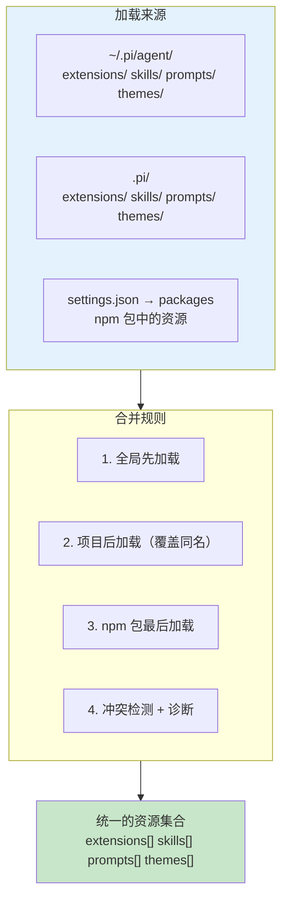

# 外部资源的统一入口 `core/resource-loader`

功能：

* 集中管理 extensions 扩展、skills 技能、prompts 提示模板、themes 主题和 AGENT.md 上下文文件的加载
* 通过 package-manager.ts 解析包来源，合并用户级、项目级和 CLI 指定的资源

* 支持资源的热重载（/reload 命令触发）
* 处理资源冲突检测（同名资源的去重与诊断）
* 支持扩展提供的额外资源路径（extendResources）

提供：

* ResourceLoader 接口：统一的资源访问接口
* DefaultResourceLoader：默认实现，协调所有资源的发现、加载和缓存
* loadProjectContextFiles()：从 cwd 向上查找 AGENTS.md/CLAUDE.md 上下文文件

调用链路：

* 应用启动 → DefaultResourceLoader.reload() → packageManager.resolve() → 各资源加载器
* 扩展运行时 → extendResources() → 追加扩展提供的资源路径
* /reload 命令 → reload() → 重新加载所有资源

## 为什么需要统一入口？

pi 有四种可扩展的外部资源：extensions（代码模块）、skills（指令文档）、prompts（模板文本）、themes（UI 主题）。每种资源有两个作用域：全局（`~/.pi/agent/`）和项目（`.pi/`）。再加上 npm 包来源，组合起来有十几个加载路径。

如果每种资源各自加载，就会有四套发现逻辑、四套冲突处理、四套作用域合并。Resource Loader 把这些统一成一套流程：



## 四种资源的不同加载需求

虽然 Resource Loader 提供了统一接口，但四种资源的加载逻辑实际上差异很大：

### Extensions — 需要执行代码

Extension 是 TypeScript/JavaScript 模块，加载意味着**执行代码**。加载器需要使用 `jiti`（运行时 TypeScript 编译器）把 `.ts` 文件编译并执行，获得 `ExtensionFactory` 函数，然后调用它得到 `Extension` 对象。

这是四种资源中最复杂的 — 涉及模块解析、错误隔离（一个 extension 崩溃不能影响其他 extension）、以及 runtime 注入（每个 extension 获得一个 `ExtensionRuntime` 对象用于注册能力）。

### Skills — 只需读文件

Skill 是 Markdown 文件（通常命名为 `SKILL.md`），加载只需要读取文件内容。但 skill 有一个特殊的路径解析逻辑：如果加载路径指向一个目录，加载器会自动查找该目录下的 `SKILL.md` 文件。

```typescript
// 2. 自动发现的 skill 目录若存在 `SKILL.md`，实际应映射到这个文件。
const mapSkillPath = (resource: { path: string; metadata: PathMetadata }): string => {
    if (resource.metadata.source !== "auto" && resource.metadata.origin !== "package") {
        return resource.path;
    }
    try {
        const stats = statSync(resource.path);
        if (!stats.isDirectory()) {
            return resource.path;
        }
    } catch {
        return resource.path;
    }
    const skillFile = join(resource.path, "SKILL.md");
    if (existsSync(skillFile)) {
        if (!metadataByPath.has(skillFile)) {
            metadataByPath.set(skillFile, resource.metadata);
        }
        return skillFile;
    }
    return resource.path;
};

const enabledSkills = enabledSkillResources.map(mapSkillPath);
```

这段代码的逻辑是：对于自动发现的路径和来自 npm 包的路径，如果它指向一个目录，就尝试找 `SKILL.md`。这让 npm 包可以简单地导出一个包含 `SKILL.md` 的目录作为 skill。

### Prompts — 需要模板解析

Prompt Template 是文本文件，但不是简单的纯文本 — 它们可能包含变量占位符，需要在使用时填充。加载器需要读取文件并解析模板格式。

### Themes — 需要 Schema 验证

Theme 是 JSON 文件，加载后需要验证其结构是否符合 theme schema（颜色、字体大小等字段是否完整）。一个格式错误的 theme 文件不应该让整个 UI 崩溃 — 加载器需要检测并报告格式问题，同时回退到默认 theme。

## 完整的加载流程

`reload()` 方法是 Resource Loader 的核心。它按照精确的顺序加载所有资源：


```typescript
   new DefaultResourceLoader(opts)          ← 构造，初始化所有缓存为空
   .reload()                                ← 应用启动时 / /reload 命令触发
     └─ packageManager.resolve()            ← 解析所有包来源的资源路径
     └─ loadExtensions()                    ← 加载扩展（tools/commands/flags）
     └─ loadExtensionFactories()            ← 加载内联扩展工厂
     └─ detectExtensionConflicts()          ← 检测扩展间同名工具/标志冲突
     └─ updateSkillsFromPaths()             ← 加载技能
     └─ updatePromptsFromPaths()            ← 加载提示词模板
     └─ updateThemesFromPaths()             ← 加载主题
     └─ loadProjectContextFiles()           ← 加载 AGENTS.md 上下文
     └─ resolvePromptInput()               ← 解析 system prompt
   .extendResources(paths)                  ← 扩展运行时动态追加资源路径
   .get*() 系列方法                          ← 读取已缓存的资源

async reload(): Promise<void> {
    const getEnabledPaths = (
        resources: Array<{ path: string; enabled: boolean; metadata: PathMetadata }>,
    ): string[] => getEnabledResources(resources).map((r) => r.path);
    const enabledExtensions = getEnabledPaths(resolvedPaths.extensions);
    const enabledSkillResources = getEnabledResources(resolvedPaths.skills);
    const enabledPrompts = getEnabledPaths(resolvedPaths.prompts);
    const enabledThemes = getEnabledPaths(resolvedPaths.themes);

    // 2. 自动发现的 skill 目录若存在 `SKILL.md`，实际应映射到这个文件。
    const mapSkillPath = (resource: { path: string; metadata: PathMetadata }): string => {
        // 非自动发现、非 package 来源的 skill 不做路径映射，直接返回原路径。
        if (resource.metadata.source !== "auto" && resource.metadata.origin !== "package") {
            return resource.path;
        }
        // 检查 resource.path 是否为目录：不是目录则直接返回原路径。
        // statSync 可能因权限等原因抛异常，此时也安全降级为原路径。
        try {
            const stats = statSync(resource.path);
            if (!stats.isDirectory()) {
                return resource.path;
            }
        } catch {
            return resource.path;
        }
        // 目录存在时，尝试查找其下的 SKILL.md 作为实际技能入口文件。
        const skillFile = join(resource.path, "SKILL.md");
        if (existsSync(skillFile)) {
            // 将目录的 metadata 关联到 SKILL.md，保证 sourceInfo 推断正确。
            if (!metadataByPath.has(skillFile)) {
                metadataByPath.set(skillFile, resource.metadata);
            }
            return skillFile;
        }
        // 目录下没有 SKILL.md，回退到原路径。
        return resource.path;
    };

    const enabledSkills = enabledSkillResources.map(mapSkillPath);

    // 3. 为 CLI 临时资源补充来源元数据，保证后续 sourceInfo 推断准确。
    for (const r of cliExtensionPaths.extensions) {
        if (!metadataByPath.has(r.path)) {
            metadataByPath.set(r.path, { source: "cli", scope: "temporary", origin: "top-level" });
        }
    }
    for (const r of cliExtensionPaths.skills) {
        if (!metadataByPath.has(r.path)) {
            metadataByPath.set(r.path, { source: "cli", scope: "temporary", origin: "top-level" });
        }
    }

    const cliEnabledExtensions = getEnabledPaths(cliExtensionPaths.extensions);
    const cliEnabledSkills = getEnabledPaths(cliExtensionPaths.skills);
    const cliEnabledPrompts = getEnabledPaths(cliExtensionPaths.prompts);
    const cliEnabledThemes = getEnabledPaths(cliExtensionPaths.themes);

    // 4. 计算最终扩展路径，先加载磁盘扩展，再叠加内联扩展工厂。
    const extensionPaths = this.noExtensions
        ? cliEnabledExtensions
        : this.mergePaths(cliEnabledExtensions, enabledExtensions);

    const extensionsResult = await loadExtensions(extensionPaths, this.cwd, this.eventBus);
    const inlineExtensions = await this.loadExtensionFactories(extensionsResult.runtime);
    extensionsResult.extensions.push(...inlineExtensions.extensions);
    extensionsResult.errors.push(...inlineExtensions.errors);

    // 5. 检测扩展冲突；冲突只记诊断，不阻止已加载扩展保留。
    const conflicts = this.detectExtensionConflicts(extensionsResult.extensions);
    for (const conflict of conflicts) {
        extensionsResult.errors.push({ path: conflict.path, error: conflict.message });
    }

    // 6. 额外指定的本地扩展路径如果不存在，显式记入错误。
    for (const p of this.additionalExtensionPaths) {
        if (isLocalPath(p)) {
            const resolved = this.resolveResourcePath(p);
            if (!existsSync(resolved)) {
                extensionsResult.errors.push({ path: resolved, error: `Extension path does not exist: ${resolved}` });
            }
        }
    }
    this.extensionsResult = this.extensionsOverride ? this.extensionsOverride(extensionsResult) : extensionsResult;
    this.applyExtensionSourceInfo(this.extensionsResult.extensions, metadataByPath);

    // 7. 计算并刷新技能缓存。
    const skillPaths = this.noSkills
        ? this.mergePaths(cliEnabledSkills, this.additionalSkillPaths)
        : this.mergePaths([...cliEnabledSkills, ...enabledSkills], this.additionalSkillPaths);

    this.lastSkillPaths = skillPaths;
    this.updateSkillsFromPaths(skillPaths, metadataByPath);
    for (const p of this.additionalSkillPaths) {
        if (isLocalPath(p)) {
            const resolved = this.resolveResourcePath(p);
            if (!existsSync(resolved) && !this.skillDiagnostics.some((d) => d.path === resolved)) {
                this.skillDiagnostics.push({ type: "error", message: "Skill path does not exist", path: resolved });
            }
        }
    }

    // 8. 计算并刷新提示词模板缓存。
    const promptPaths = this.noPromptTemplates
        ? this.mergePaths(cliEnabledPrompts, this.additionalPromptTemplatePaths)
        : this.mergePaths([...cliEnabledPrompts, ...enabledPrompts], this.additionalPromptTemplatePaths);

    this.lastPromptPaths = promptPaths;
    this.updatePromptsFromPaths(promptPaths, metadataByPath);
    for (const p of this.additionalPromptTemplatePaths) {
        if (isLocalPath(p)) {
            const resolved = this.resolveResourcePath(p);
            if (!existsSync(resolved) && !this.promptDiagnostics.some((d) => d.path === resolved)) {
                this.promptDiagnostics.push({
                    type: "error",
                    message: "Prompt template path does not exist",
                    path: resolved,
                });
            }
        }
    }

    // 9. 计算并刷新主题缓存。
    const themePaths = this.noThemes
        ? this.mergePaths(cliEnabledThemes, this.additionalThemePaths)
        : this.mergePaths([...cliEnabledThemes, ...enabledThemes], this.additionalThemePaths);

    this.lastThemePaths = themePaths;
    this.updateThemesFromPaths(themePaths, metadataByPath);
    for (const p of this.additionalThemePaths) {
        const resolved = this.resolveResourcePath(p);
        if (!existsSync(resolved) && !this.themeDiagnostics.some((d) => d.path === resolved)) {
            this.themeDiagnostics.push({ type: "error", message: "Theme path does not exist", path: resolved });
        }
    }

    // 10. 加载项目上下文文件链。
    const agentsFiles = {
        agentsFiles: this.noContextFiles ? [] : loadProjectContextFiles({ cwd: this.cwd, agentDir: this.agentDir }),
    };
    const resolvedAgentsFiles = this.agentsFilesOverride ? this.agentsFilesOverride(agentsFiles) : agentsFiles;
    this.agentsFiles = resolvedAgentsFiles.agentsFiles;

    // 11. 发现并解析主系统提示词。
    const baseSystemPrompt = resolvePromptInput(
        this.systemPromptSource ?? this.discoverSystemPromptFile(),
        "system prompt",
    );
    this.systemPrompt = this.systemPromptOverride ? this.systemPromptOverride(baseSystemPrompt) : baseSystemPrompt;

    // 12. 发现并解析附加系统提示词列表。
    const appendSources =
        this.appendSystemPromptSource ??
        (this.discoverAppendSystemPromptFile() ? [this.discoverAppendSystemPromptFile()!] : []);
    const baseAppend = appendSources
        .map((s) => resolvePromptInput(s, "append system prompt"))
        .filter((s): s is string => s !== undefined);
    this.appendSystemPrompt = this.appendSystemPromptOverride
        ? this.appendSystemPromptOverride(baseAppend)
        : baseAppend;
}
```


`reload()` 是 `ResourceLoader` 的核心方法，分 **12 个步骤**完成一次完整资源重载：

**步骤 1 — 刷新设置与包来源解析**

1. 调用 `settingsManager.reload()` 重新加载用户设置；
2. 然后通过 `packageManager.resolve()` 解析用户级/项目级 npm 包中声明的扩展、skill、prompt、theme 路径；
3. 同时解析 CLI 通过 `--extension` / `--skill` 等参数传入的临时路径，存入 `cliExtensionPaths`；
4. 初始化 `metadataByPath`，即路径 → 来源元数据（packageManager.ts 中定义的 `PathMetadata`）的 Map；
5. 清空上一轮的 `extensionSkillSourceInfos` / `extensionPromptSourceInfos` / `extensionThemeSourceInfos`，即扩展在运行时调用 `extendResources()` 动态注入的资源的来源信息。

**步骤 2 — 提取已启用资源并做 skill 目录映射**

1. 通过 `getEnabledPaths` - `getEnabledResources` 将包管理器解析出的四类资源路径列表 `ResolvedResource[]` 按 `enabled` 过滤，同时将每条资源的 path→metadata 写入 `metadataByPath`。

2. 对 skill 资源额外执行 `mapSkillPath`：

   ```ts
   auto-discovered 或 package 来源的 skill
       ├── 如果资源路径是文件 → 直接用
       └── 如果资源路径是目录 → 检查目录下有没有 SKILL.md
               ├── 有 → 映射到 <目录>/SKILL.md
               └── 没有 → 原样返回（让后续加载逻辑报错）
   ```

**步骤 3 — 为 CLI 临时资源补元数据**

遍历 `cliExtensionPaths` 中的 extension 和 skill，若尚未在 `metadataByPath` 中登记，则写入 `{ source: "cli", scope: "temporary", origin: "top-level" }`。

**步骤 4 — 加载扩展**

将包解析的 extension 路径与 CLI 临时 extension 路径合并（若 `noExtensions` 为 true 则只用 CLI 路径）。调用 `loadExtensions()` 从磁盘加载扩展编译后的 JS 文件，然后调用 `loadExtensionFactories()` 加载内联扩展工厂，合并到同一个 `extensionsResult` 中。

**步骤 5 — 检测扩展冲突**

调用 `detectExtensionConflicts()` 检查加载的扩展之间是否存在工具名/标志冲突。冲突不阻止扩展保留，仅作为 error 记入 `extensionsResult.errors`。

**步骤 6 — 校验额外指定的本地路径**

遍历 `additionalExtensionPaths`（用户额外指定的扩展路径），对本地路径检查是否真实存在，不存在则追加错误诊断。最后通过 `extensionsOverride` 钩子（如果有）对结果做最终改写，然后调用 `applyExtensionSourceInfo()` 为每个扩展及其命令/工具打上 `metadataByPath` 中记录的来源信息。

**步骤 7 — 计算并刷新技能缓存**

将包解析的 skill 路径、CLI 临时 skill 路径、`additionalSkillPaths` 合并（若 `noSkills` 为 true 则只用 CLI + additional）。调用 `updateSkillsFromPaths()` 重新加载技能定义。对 `additionalSkillPaths` 中的本地路径做存在性校验，不存在则记入 `skillDiagnostics`。

**步骤 8 — 计算并刷新提示词模板缓存**

同上逻辑：合并 CLI + 包 + additional 的 prompt 路径，调用 `updatePromptsFromPaths()` 重新加载，对 additional 本地路径做存在性校验。

**步骤 9 — 计算并刷新主题缓存**

同上逻辑：合并 CLI + 包 + additional 的 theme 路径，调用 `updateThemesFromPaths()` 重新加载，对 additional 路径做存在性校验。

**步骤 10 — 加载项目上下文文件链**

若 `noContextFiles` 不为 true，调用 `loadProjectContextFiles()` 读取工作目录及 agent 目录下的 `AGENTS.md` / `CLAUDE.md` 等上下文文件。结果可通过 `agentsFilesOverride` 钩子改写。

**步骤 11 — 发现并解析主系统提示词**

若未显式设置 `systemPromptSource`，则调用 `discoverSystemPromptFile()` 自动发现系统提示词文件。通过 `resolvePromptInput()` 将来源解析为最终字符串。结果可通过 `systemPromptOverride` 钩子改写。

**步骤 12 — 发现并解析附加系统提示词**

若未显式设置 `appendSystemPromptSource`，则调用 `discoverAppendSystemPromptFile()` 自动发现。将全部附加来源逐一通过 `resolvePromptInput()` 解析，过滤掉 undefined。结果可通过 `appendSystemPromptOverride` 钩子改写。

### 整体模式

每一步几乎都遵循相同的模式：**包源解析 → 合并 CLI 临时路径 → 合并手动路径 → 加载 → 允许 override**。12 个步骤可以归为三类：

| 类别         | 步骤  | 产出                                |
| ------------ | ----- | ----------------------------------- |
| 扩展系统     | 1-6   | `extensionsResult`（扩展 + 运行时） |
| 内容资源     | 7-9   | skill/prompt/theme 缓存             |
| 上下文与提示 | 10-12 | agents 文件、system prompt          |

## npm 包来源的加载

除了全局和项目两个本地目录，Resource Loader 还支持从 npm 包加载资源。这是通过 `PackageManager` 实现的。

用户可以在 `settings.json` 中配置包：

```json
{
  "packages": [
    "@myorg/pi-extension-custom-tool",
    "@myorg/pi-skills-react"
  ]
}
```

`PackageManager` 负责：
1. 检查包是否已安装（在 `~/.pi/agent/packages/` 中）
2. 如果未安装，使用 npm 安装
3. 解析包的目录结构，找出其中的 extensions、skills、prompts、themes
4. 把这些路径添加到各自的加载列表中

npm 包中的资源遵循一个约定：包的根目录下有 `extensions/`、`skills/`、`prompts/`、`themes/` 子目录。这与全局和项目目录的结构保持一致 — 同样的目录约定，不同的来源。

来自 npm 包的资源在合并顺序中**最后加载**。这意味着如果全局目录和 npm 包中有同名的 skill，全局目录的会被 npm 包的覆盖。这个选择有些反直觉 — 通常你期望本地配置覆盖远程包。但 pi 的设计认为：npm 包是显式安装的（用户主动选择的），全局目录是隐式存在的，显式选择应该有更高的优先级。

## 冲突诊断

当多个来源提供同名资源时，Resource Loader 不会静默地选择一个。它会生成 `ResourceDiagnostic` 来告知用户存在冲突。

```typescript
// file: packages/coding-agent/src/core/resource-loader.ts:400-405
// 检测 extension 冲突（工具、命令、flag 同名）
const conflicts = this.detectExtensionConflicts(
  extensionsResult.extensions
);
for (const conflict of conflicts) {
  extensionsResult.errors.push(
    { path: conflict.path, error: conflict.message }
  );
}
```

Extension 的冲突检测尤其重要，因为两个 extension 可能注册同名的工具。当检测到冲突时：

1. **所有冲突的 extension 都会被加载**（不会因为冲突就丢弃某个 extension）
2. **冲突被记录为 diagnostic**（用户在 TUI 中可以看到警告）
3. **优先级由加载顺序决定**（后加载的覆盖先加载的）

这是一个典型的 "宽容加载 + 事后报告" 策略。替代方案是 "严格加载 — 有冲突就报错并拒绝加载"。pi 选择宽容策略的原因是：在开发阶段，用户经常需要临时覆盖某个 extension 的行为（比如用项目级的 extension 覆盖全局的），如果每次覆盖都报错阻断，开发体验会很差。

不仅仅是 extension 名称冲突 — Resource Loader 还检测路径不存在的情况：

```typescript
// file: packages/coding-agent/src/core/resource-loader.ts:421-425
for (const p of this.additionalSkillPaths) {
  if (isLocalPath(p) && !existsSync(p)
      && !this.skillDiagnostics.some((d) => d.path === p)) {
    this.skillDiagnostics.push(
      { type: "error", message: "Skill path does not exist", path: p }
    );
  }
}
```

每种资源类型都有类似的检查。用户在 CLI 参数中指定了一个不存在的 skill 路径，不会导致崩溃 — 它会被记录为 diagnostic，其他资源正常加载。

## Override 机制

Resource Loader 提供了一套完整的 override 机制，允许上层代码在加载完成后修改结果：

```typescript
// file: packages/coding-agent/src/core/resource-loader.ts:131-148
extensionsOverride?: (base: LoadExtensionsResult) => LoadExtensionsResult;
skillsOverride?: (base: { skills: Skill[];
  diagnostics: ResourceDiagnostic[] }) => { ... };
promptsOverride?: (base: { prompts: PromptTemplate[];
  diagnostics: ResourceDiagnostic[] }) => { ... };
themesOverride?: (base: { themes: Theme[];
  diagnostics: ResourceDiagnostic[] }) => { ... };
systemPromptOverride?: (base: string | undefined) => string | undefined;
appendSystemPromptOverride?: (base: string[]) => string[];
```

每种资源类型都有对应的 override 函数。它接收加载完成的基础结果，返回修改后的结果。这让测试、RPC mode、Slack bot 等不同的产品壳可以在不修改 Resource Loader 代码的情况下定制资源加载行为。

比如测试时可以注入 `noExtensions: true` 禁用所有 extension 加载，或者通过 `skillsOverride` 注入测试用的 skill。这比 mock 整个 Resource Loader 简单得多。

## AGENTS.md 上下文文件

Resource Loader 还负责加载项目上下文文件（`AGENTS.md` 或 `CLAUDE.md`）。这些文件的加载逻辑与四种资源不同 — 它沿着目录树向上搜索：

```typescript
// file: packages/coding-agent/src/core/resource-loader.ts:76-113
function loadProjectContextFiles(options: { cwd?: string }) {
  const contextFiles = [];
  // 1. 先加载全局上下文（~/.pi/agent/ 下的 AGENTS.md）
  const globalContext = loadContextFileFromDir(resolvedAgentDir);
  if (globalContext) contextFiles.push(globalContext);

  // 2. 从当前目录向上遍历到根目录
  let currentDir = resolvedCwd;
  while (true) {
    const contextFile = loadContextFileFromDir(currentDir);
    if (contextFile) ancestorContextFiles.unshift(contextFile);
    if (currentDir === root) break;
    currentDir = resolve(currentDir, "..");
  }
  // 3. 按从根到当前目录的顺序返回
  contextFiles.push(...ancestorContextFiles);
  return contextFiles;
}
```

这意味着在 `/home/user/project/src/` 目录下运行 pi 时，它会查找并加载：
- `~/.pi/agent/AGENTS.md`（全局）
- `/home/AGENTS.md`（如果存在）
- `/home/user/AGENTS.md`（如果存在）
- `/home/user/project/AGENTS.md`（如果存在）
- `/home/user/project/src/AGENTS.md`（如果存在）

所有找到的文件**按顺序拼接**（不覆盖），作为项目上下文注入 system prompt。这个设计让组织可以在不同层级的目录中放置不同粒度的上下文 — 根目录放通用规范，子目录放模块特定的上下文。

## 取舍分析

### 得到了什么

**统一的心智模型**。所有资源遵循同样的加载顺序和覆盖规则。用户学会一套规则就能理解所有资源的行为。

**渐进式降级**。任何单个资源加载失败都不会阻塞系统启动。通过 diagnostic 机制，用户可以在启动后看到哪些资源加载失败了，但系统仍然可用。

**可测试性**。override 机制让测试可以精确控制每种资源的加载结果，而不需要 mock 文件系统。

### 放弃了什么

**资源类型之间的差异被抹平**。Extension 需要执行 setup、skill 只需读文件、theme 需要验证 schema — 不同类型有不同的加载需求，统一入口需要为最复杂的类型设计接口。这导致接口上有些方法（如 `reload` 的异步性）对简单资源来说是过度设计。

**加载顺序不够透明**。全局 → 项目 → npm 包 → CLI 额外路径 — 当多个来源都提供了资源时，用户需要理解完整的合并顺序才能预测最终结果。虽然 diagnostic 可以报告冲突，但合并的过程本身不够可观测。

---

### 版本演化说明
> 本章核心分析基于 pi-mono v0.66.0。Resource Loader 的来源随着 npm 包支持的加入
> 从两级（全局 + 项目）扩展到了三级。
