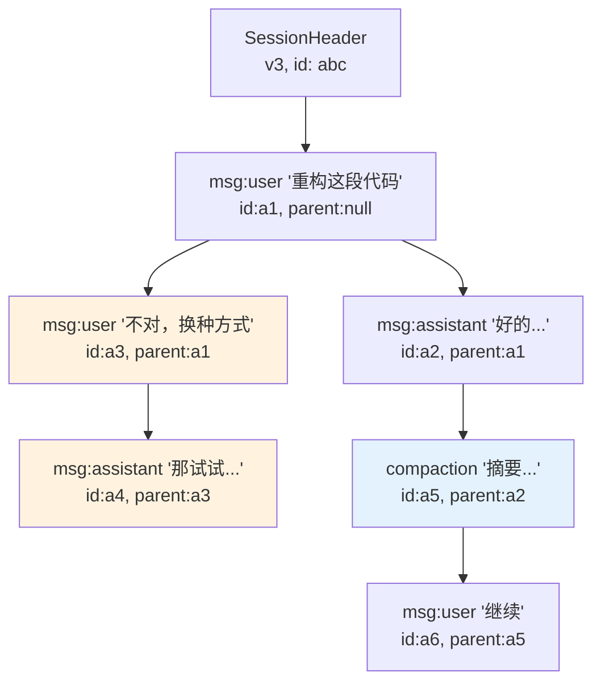
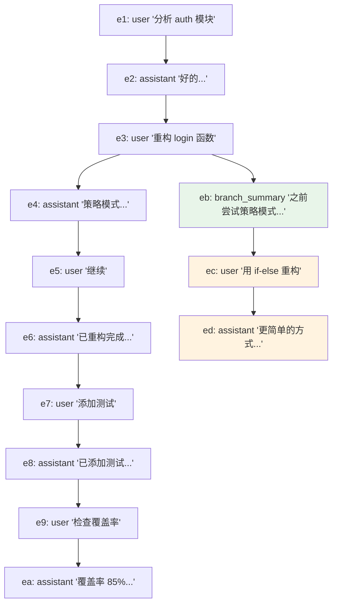

# 会话树 `core/session-manager.ts`

**Coding agent 的会话为什么不是线性的？**

聊天机器人的会话是线性的 — 一问一答，从头到尾。但 coding agent 的工作流本质上是非线性的：

- 用户让 agent 重构一段代码，agent 改了 5 个文件。用户发现改错了，想**回到改之前**，用不同的方式重试
- agent 执行了一个 bash 命令，结果不对。用户想**从那个命令之前**重新开始，换个命令
- 用户在第 20 轮发现第 5 轮的一个决策不对，想**跳回第 5 轮**创建一个新分支

如果用线性列表存储，这些操作要么不可能（无法回溯），要么需要复制整个会话历史（浪费存储）。

pi 的解决方案是**会话树** — 每条消息有一个 `parentId`，指向它的前驱消息。分支就是同一个父节点下的多个子节点。

## Session 追加链路（内存中 JSONL 条目列表的构建与文件持久化）

### 会话树文件 JSONL 中的 Header 和 Entry 条目

会话文件是一个 JSONL（JSON Lines）文件，每行一个 JSON 对象。第一行是 session header，后续行是 session entries：

```typescript
/** 会话文件头（JSONL 第一行） */
export interface SessionHeader {
	type: "session";
	/** 版本号（v1 会话无此字段），当前 v3 */
	version?: number;
	/** 会话唯一 ID（UUID v7） */
	id: string;
	/** 创建时间戳（ISO 格式） */
	timestamp: string;
	/** 创建时的工作目录 */
	cwd: string;
	/** 父会话文件路径（fork 时设置） */
	parentSession?: string;
}
```

* `version` 字段驱动向后兼容的迁移逻辑（后文详述）。
* `parentSession` 在用户从一个分支创建新 session 文件时，记录来源 session 的路径，形成 session 之间的溯源链。

每个 entry 都有 `id` 和 `parentId`，形成树形结构：

```typescript
/** 会话条目基类——所有条目类型共享的基础字段 */
export interface SessionEntryBase {
	type: string;
	id: string;
	parentId: string | null; // null 即根节点
	timestamp: string;
}
```

`id` 是 8 位十六进制字符串，由 `randomUUID().slice(0, 8)` 生成，并通过碰撞检查确保唯一性。为什么不用完整的 UUID？因为这些 id 会出现在 TUI 的分支导航中，短 id 对人类更友好。`parentId` 指向前驱 entry 的 id，`null` 表示这是树的根节点（通常是用户的第一条消息）。



这张图中，`a3`（"不对，换种方式"）和 `a2`（"好的..."）共享同一个父节点 `a1`。这就是一个分支点。用户在 `a1` 之后走了两条路。`a5` 是一个 compaction entry — 它把 `a1→a2` 的对话压缩成摘要，`a6` 从摘要继续。

#### 9 种 Entry 条目类型

> 这 9 种 Entry 类型记录的是**事件**而非**状态**。不维护一个"当前配置"对象，而是把每次变更（切换模型、改 thinking level、命名等）作为不可变事件追加到 JSONL 文件中。最终状态通过**重放事件**得出——`buildSessionContext()` 遍历路径时依次消费事件即可恢复当前上下文。**这是 event sourcing 的思想，在 append-only 的存储中，这是唯一合理的做法。**

`SessionEntry` 是 9 种类型的联合：

```typescript
type SessionEntry =
  | SessionMessageEntry      // 对话消息（user/assistant/toolResult）
  | ThinkingLevelChangeEntry // 思考级别变更
  | ModelChangeEntry         // 模型切换
  | CompactionEntry          // 上下文压缩摘要
  | BranchSummaryEntry       // 分支摘要
  | CustomEntry              // extension 数据（不进 LLM context）
  | CustomMessageEntry       // extension 消息（进 LLM context）
  | LabelEntry               // 用户书签
  | SessionInfoEntry;        // 会话元数据（显示名称）

/** 原始文件条目（包含文件头） */
export type FileEntry = SessionHeader | SessionEntry;
```

1、**核心层：影响 LLM context**，`buildSessionContext()` 函数在遍历树时，只有这些类型会被转换成发送给 LLM 的消息。

**SessionMessageEntry** — 对话的基本单元：

```typescript
interface SessionMessageEntry extends SessionEntryBase {
  type: "message";
  message: AgentMessage; // pi-agent 层，可以是 user 消息、assistant 消息、tool result
}
```

**CompactionEntry** — 上下文压缩的结果：

```typescript
export interface CompactionEntry<T = unknown> extends SessionEntryBase {
	type: "compaction";
	summary: string; // 压缩生成的摘要文本（注入 LLM 上下文）
	firstKeptEntryId: string; // 压缩后仍保留的第一条消息 ID，标记从哪个 entry 开始保留原文
	tokensBefore: number; // 压缩前上下文的 token 数量
	details?: T;  // 让 extension 在压缩时附带结构化数据（比如文件操作索引）
	fromHook?: boolean; // 由扩展生成时为 true，pi 生成时为 undefined/false（向后兼容）
}
```

**BranchSummaryEntry** — 分支时对被放弃路径的摘要：

```typescript
export interface BranchSummaryEntry<T = unknown> extends SessionEntryBase {
	type: "branch_summary";
	/** 分支起始点条目 ID，"root" 表示从根开始 */
	fromId: string;
	/** 涵盖被放弃路径的上下文摘要文本 */
	summary: string;
	/** 扩展专属数据（不发送给 LLM） */
	details?: T;
	/** 由扩展生成时为 true，pi 生成时为 false */
	fromHook?: boolean;
}
```

当用户跳回某个节点创建新分支时，pi 可以为被放弃的对话路径生成一个摘要，注入到新分支的上下文中。这样 LLM 在新分支中知道"之前尝试过什么、为什么不行"，避免重复犯错。`fromId` 指向分支点，`summary` 是旧路径的摘要。

2、**元数据层：影响 session 状态**，记录会话过程中的配置变化，在 session reload 时恢复状态。

**ThinkingLevelChangeEntry** — 用户在对话中途切换了 thinking level（如从 `off` 切到 `high`）。`buildSessionContext()` 在遍历路径时会跟踪这个值，返回当前路径最后生效的 thinking level。

```ts
export interface ThinkingLevelChangeEntry extends SessionEntryBase {
	type: "thinking_level_change";
	thinkingLevel: string;
}
```

**ModelChangeEntry** — 用户在对话中途切换了模型。同样在路径遍历时被提取，恢复到最后一次切换的状态。

```ts
export interface ModelChangeEntry extends SessionEntryBase {
	type: "model_change";
	provider: string;
	modelId: string;
}
```

**SessionInfoEntry** — 会话元数据，目前只有一个字段：`name`（用户自定义的会话显示名称）。用户通过 `/name` 命名 session。

```ts
export interface SessionInfoEntry extends SessionEntryBase {
	type: "session_info";
	name?: string;
}
```

它不是在树遍历中提取的，而是通过 `getSessionName()` 方法从后往前扫描最新的 `session_info` entry。

```ts
/** 获取当前会话名称（来自最新的 session_info 条目） */
getSessionName(): string | undefined {
    // 反向遍历条目以找到最新的 session_info 条目
    // 空名称明确清除会话标题
    const entries = this.getEntries();
    for (let i = entries.length - 1; i >= 0; i--) {
        const entry = entries[i];
        if (entry.type === "session_info") {
            return entry.name?.trim() || undefined;
        }
    }
    return undefined;
}
```

3、**扩展层：让 extension 和用户可以在 session 中持久化自己的数据**

**CustomEntry** — extension 的私有数据仓库。**不参与 LLM 上下文**（被 buildSessionContext 忽略）。

用途：extension 在 session 中持久化内部状态。例如，一个代码审查 extension 可以把已审查的文件列表存为 `CustomEntry`，session reload 时扫描 `customType` 恢复状态。

```typescript
export interface CustomEntry<T = unknown> extends SessionEntryBase {
	type: "custom";
	customType: string; // extension 的标识符
	data?: T; // 任意结构化数据
}
```

**CustomMessageEntry** — extension 注入的 LLM 消息。**参与 LLM context** — `buildSessionContext()` 会把它转换成 user 消息发送给 LLM。

```typescript
interface CustomMessageEntry<T = unknown> extends SessionEntryBase {
  type: "custom_message";
  customType: string;
  content: string | (TextContent | ImageContent)[]; // 纯文本或富媒体内容（文字 + 图片）
  details?: T; // extension 私有元数据，不发送给 LLM
  display: boolean; // 控制 TUI 渲染，false：完全隐藏，true：以特殊样式渲染（区别于普通用户消息）
}
```

上述两种 Entry 的区分让 extension 既能存储自己的状态（不干扰 LLM 对话质量），又能在需要时影响 LLM 的行为（比如注入项目约定、代码规范等上下文）。

**LabelEntry** — 用户书签。`buildSessionContext()` 完全忽略它。

```typescript
interface LabelEntry extends SessionEntryBase {
  type: "label";
  targetId: string; // 指向被标记的 entry
  label: string | undefined; // 用户定义的标签文本，传 `undefined` 或空字符串表示清除标签
}
```

标签通过 `SessionManager` 内部的 `labelsById` Map 解析，在 `getTree()` 返回的树节点中作为 `label` 字段附带。

### Entry 条目追加与文件持久化 `appendXxx`

**所有 8 种 `appendXxx()` 方法的统一模式**（BranchSummaryEntry 比较特殊——没有独立的 public append 方法，而是在 branchWithSummary() 内部直接创建并追加，因为分支摘要和分支操作是绑定的）：

```ts
appendMessage / appendThinkingLevelChange / appendModelChange /
appendCompaction / appendCustomEntry / appendCustomMessageEntry /
appendSessionInfo / appendLabelChange
  → generateId(byId)         // 随机 8 位十六进制，带 100 次重试防碰撞
  → 创建对应的 Entry 对象 { id, parentId: this.leafId, timestamp, ...payload }
  → _appendEntry(entry)
    → fileEntries.push(entry)
    → byId.set(entry.id, entry)
    → leafId = entry.id      // 叶子前移
    → _persist(entry)
      → persist=false? → 直接返回
      → fileEntries 中没有 assistant 消息?
        → flushed = false    // 推迟到第一条 assistant 消息时批量写入
        → 返回
      → !flushed?
        → 首次落盘：遍历 fileEntries 全部 appendFileSync 写入
        → flushed = true
      → 已 flushed?
        → 只追加当前 entry: appendFileSync(sessionFile, JSON.stringify(entry) + "\n")
```

```ts
/** 追加消息到当前叶子节点之后。返回条目 ID。
 * 不允许直接写入 CompactionSummaryMessage 和 BranchSummaryMessage。
 * 原因：这些消息需要作为会话的顶级条目，而非消息子条目，
 */
appendMessage(message: Message | CustomMessage | BashExecutionMessage): string {
    const entry: SessionMessageEntry = {
        type: "message",
        id: generateId(this.byId),
        parentId: this.leafId,
        timestamp: new Date().toISOString(),
        message,
    };
    this._appendEntry(entry);
    return entry.id;
}

// 生成唯一短 ID（8 个十六进制字符）。
function generateId(byId: { has(id: string): boolean }): string {
	for (let i = 0; i < 100; i++) { // 最多重试 100 次
		const id = randomUUID().slice(0, 8);
		if (!byId.has(id)) return id; // 检测已用 ID 避免碰撞
	}
	return randomUUID(); // 碰撞极罕见时退回到完整 UUID
}

/**
 * 将条目追加到内存并异步落盘。
 *
 * 定位：所有 append*() 方法的统一出口。更新 fileEntries、byId、leafId 之后调用 _persist。
 */
private _appendEntry(entry: SessionEntry): void {
    this.fileEntries.push(entry);
    this.byId.set(entry.id, entry);
    this.leafId = entry.id;
    this._persist(entry);
}
```


**`appendLabelChange()` 有额外步骤：**

```ts
/**
 * 设置或清除条目的标签。
 * 标签是用户定义的书签/导航标记。
 * 传入 undefined 或空字符串以清除标签。
 */
appendLabelChange(targetId: string, label: string | undefined): string {
    if (!this.byId.has(targetId)) {
        throw new Error(`Entry ${targetId} not found`);
    }
    const entry: LabelEntry = {
        type: "label",
        id: generateId(this.byId),
        parentId: this.leafId, // 父节点为当前游标
        timestamp: new Date().toISOString(),
        targetId,
        label,
    };
    this._appendEntry(entry);
    if (label) {
        this.labelsById.set(targetId, label);
        this.labelTimestampsById.set(targetId, entry.timestamp);
    } else {
        this.labelsById.delete(targetId);
        this.labelTimestampsById.delete(targetId);
    }
    return entry.id;
}
```

**`_persist` 写入策略：**

* 当前文件中还没有 assistant 消息 → 延迟到第一条 assistant 到达时批量写入
* 有 assistant 但尚未批量写入 → 一次性写入所有 fileEntries
* 已经批量写入过 → 追加当前条目到文件尾部

```ts
_persist(entry: SessionEntry): void {
    if (!this.persist || !this.sessionFile) return;

    const hasAssistant = this.fileEntries.some((e) => e.type === "message" && e.message.role === "assistant");
    if (!hasAssistant) {
        // 标记为未刷新，这样当助手消息到达时，所有条目会被一次性写入
        this.flushed = false;
        return;
    }
    if (!this.flushed) {
        // 首次落盘时重写当前内存快照，确保头和历史条目完整写入。
        for (const e of this.fileEntries) {
            appendFileSync(this.sessionFile, `${JSON.stringify(e)}\n`);
        }
        this.flushed = true;
    } else {
        // 之后只需追加最新条目，保持 JSONL 追加式持久化模型。
        appendFileSync(this.sessionFile, `${JSON.stringify(entry)}\n`);
    }
}
```

### JSONL 文件的关键特性

JSONL 文件只有 append 操作。之前的 Entry 无法被修改或删除。分支操作的"成本"是不包含复制共用的 Entry，只需 append 新 entry。这就是 `parentId` 树结构的核心价值：**分支是零拷贝的**。

## Session 创建 / 打开链路（从 JSONL 文件到 SessionManager）

### SessionManager 会话管理器类

```ts
/**
 * 以追加式 JSONL 文件管理对话会话。
 *
 * 每个会话条目具有 id 和 parentId 形成树状结构。"leaf" 指针跟踪当前位置。
 * 追加操作在当前叶子下创建子条目。分支操作将叶子移动到较早的条目，
 */
export class SessionManager {
	private sessionId: string = ""; // 会话唯一 ID（UUID v7）
	private sessionFile: string | undefined; // 当前会话的 JSONL 文件路径，包含 .jsonl 文件名（未持久化时为 undefined）
	private sessionDir: string; // 会话文件存放目录
	private cwd: string; // 创建会话时的工作目录
	private persist: boolean; // // 是否启用文件持久化
	private flushed: boolean = false; // 磁盘内容与 fileEntries 一致的标记
	private fileEntries: FileEntry[] = []; // 内存中的全部文件条目（含 session header）
	private byId: Map<string, SessionEntry> = new Map(); // id → 条目的快速查找索引
	private labelsById: Map<string, string> = new Map(); // targetId → 标签文本的快速查找索引
	private labelTimestampsById: Map<string, string> = new Map(); // targetId → 最新标签时间戳的快速查找索引
	private leafId: string | null = null; // 当前会话树的叶子节点 ID（null 表示无条目）

	private constructor(cwd: string, sessionDir: string, sessionFile: string | undefined, persist: boolean) {
		this.cwd = resolvePath(cwd); // utils/path.ts 解析路径为绝对路径
		this.sessionDir = normalizePath(sessionDir); // utils/path.ts 提供的规范化路径输入
		this.persist = persist;
		if (persist && this.sessionDir && !existsSync(this.sessionDir)) {
			mkdirSync(this.sessionDir, { recursive: true }); // 递归创建会话存放目录文件夹
		}

		if (sessionFile) {
			this.setSessionFile(sessionFile);  // 切换到不同的会话文件（用于恢复和分支操作）
		} else {
			this.newSession(); // 创建新会话
		}
	}
```

### `create` 创建新会话

```ts
// @param cwd 工作目录（存储在会话头中）
// @param sessionDir 可选的会话目录。省略时使用默认目录（~/.pi/agent/sessions/<编码后的 cwd>/）
static create(cwd: string, sessionDir?: string): SessionManager {
    const dir = sessionDir ? normalizePath(sessionDir) : getDefaultSessionDir(cwd);
    return new SessionManager(cwd, dir, undefined, true); // 调用 constructor()
}
```

`constructor()` 走 `newSession()` 的分支：

```ts
/**
 * 新建空白会话，写入 SessionHeader 作为第一条文件条目，持久化模式下会自动生成 `{timestamp}_{id}.jsonl` 文件路径，但 JSONL 尚未真正持久化到本地文件中。
 *
 * 定位：构造函数、setSessionFile、createBranchedSession、forkFrom 等流程的公共初始化入口。
 */
newSession(options?: NewSessionOptions): string | undefined {
    this.sessionId = options?.id ?? createSessionId();
    const timestamp = new Date().toISOString();
    const header: SessionHeader = {
        type: "session",
        version: CURRENT_SESSION_VERSION,
        id: this.sessionId,
        timestamp,
        cwd: this.cwd,
        parentSession: options?.parentSession,
    };
    this.fileEntries = [header];
    this.byId.clear();
    this.labelsById.clear();
	this.labelTimestampsById.clear();
    this.leafId = null;
    this.flushed = false;

    if (this.persist) {
        const fileTimestamp = timestamp.replace(/[:.]/g, "-");
        this.sessionFile = join(this.getSessionDir(), `${fileTimestamp}_${this.sessionId}.jsonl`);
    }
    return this.sessionFile;
}

/** 新建会话时可覆盖的选项 */
export interface NewSessionOptions {
	/** 可选的自定义会话 ID（默认使用 UUID v7） */
	id?: string;
	/** fork 时指向父会话文件路径 */
	parentSession?: string;
}
```

### `open` 打开已有会话

```typescript
/**
 * 打开指定的会话 JSONL 文件并重建 SessionManager 实例。
 *
 * @param path 会话 JSONL 文件路径（支持波浪号展开）
 * @param sessionDir 可选，指定会话目录（用于 /new 或 /branch 操作时查找相邻会话）
 * @param cwdOverride 可选，覆盖 cwd（用于 fork 场景，新 fork 使用当前 cwd 而非原始 cwd）
 */
static open(path: string, sessionDir?: string, cwdOverride?: string): SessionManager {
    const resolvedPath = resolvePath(path); // 展开 ~ 为 $HOME ，把相对路径转绝对路径
    // 提取 cwd（从会话头中，或使用 process.cwd()）
    const entries = loadEntriesFromFile(resolvedPath); // 从 JSONL 文件中加载所有文件条目
    const header = entries.find((e) => e.type === "session") as SessionHeader | undefined; // 找到 SessionHeader
    // cwd 三级降级链：优先级从高到低
    // - cwdOverride Fork 时：新 fork 应运行在当前目录，不是历史回放时的旧目录 
    // - header.cwd 正常打开：恢复到会话创建时的原始工作目录 
    // - process.cwd() 兜底：SessionHeader 损坏或缺失，用当前目录
    const cwd = cwdOverride ?? header?.cwd ?? process.cwd();
    // 如果未提供 sessionDir，从文件的父目录推导
    const dir = sessionDir ? normalizePath(sessionDir) : resolve(resolvedPath, "..");
    return new SessionManager(cwd, dir, resolvedPath, true);
}
```

`constructor()` 走 `setSessionFile()` 的分支：

```ts
// 切换到不同的会话文件（用于恢复和分支操作）。
setSessionFile(sessionFile: string): void {
    this.sessionFile = resolvePath(sessionFile);
    if (existsSync(this.sessionFile)) {
        // 分支 A：文件已存在
        this.fileEntries = loadEntriesFromFile(this.sessionFile); // 从 JSONL 文件中加载并校验所有文件条目

        if (this.fileEntries.length === 0) {
            // 文件为空或损坏（无有效 SessionHeader）
            // → 视为新会话重建，避免在空文件上追加消息导致持续损坏
            const explicitPath = this.sessionFile; // 保留用户在 --session 中指定的路径
            this.newSession(); // 生成新的 SessionHeader、sessionFile 等
            this.sessionFile = explicitPath; // 用旧的 sessionFile 覆盖新生成的
            this._rewriteFile(); // 持久化：将当前 fileEntries 全量覆盖写回 JSONL 文件
            this.flushed = true;
            return;
        }

        // 恢复 sessionId（SessionHeader 缺失时降级创建新 id）
        const header = this.fileEntries.find((e) => e.type === "session") as SessionHeader | undefined;
        this.sessionId = header?.id ?? createSessionId();

        // 旧版本 JSONL → 就地升级到当前版本
        if (migrateToCurrentVersion(this.fileEntries)) {
            this._rewriteFile(); // 写回 JSONL 本地文件
        }

        // 重建 byId/labelsById/labelTimestampsById 三个内存索引
        this._buildIndex();
        this.flushed = true;
    } else {
        // 分支 B：文件不存在（--session 指定了一个新路径）
        // → 创建全新 SessionHeader，推迟到首次 _persist() 时落盘
        const explicitPath = this.sessionFile;
        this.newSession();
        this.sessionFile = explicitPath; // 保留用户指定的文件路径
    }
}

// 将当前 fileEntries 全量覆盖写回 JSONL 文件。
private _rewriteFile(): void {
    if (!this.persist || !this.sessionFile) return;
    const content = `${this.fileEntries.map((e) => JSON.stringify(e)).join("\n")}\n`;
    writeFileSync(this.sessionFile, content);
}

/**
 * 从 fileEntries 重建内存索引（byId、leafId、labelsById）。
 *
 * 调用时机：setSessionFile 加载或重写文件后、createBranchedSession 构建后。
 * 索引规则：顺序扫描跳过 session header，每个非 header 条目都会覆盖同一个键，最后一个生效。
 */
private _buildIndex(): void {
    this.byId.clear();
    this.labelsById.clear();
    this.labelTimestampsById.clear();
    this.leafId = null;
    for (const entry of this.fileEntries) {
        if (entry.type === "session") continue;
        // 顺序扫描追加式文件，最后一个非头条目天然就是当前叶子。
        this.byId.set(entry.id, entry);
        this.leafId = entry.id;
        if (entry.type === "label") {
            if (entry.label) {
                this.labelsById.set(entry.targetId, entry.label);
                this.labelTimestampsById.set(entry.targetId, entry.timestamp);
            } else {
                this.labelsById.delete(entry.targetId);
                this.labelTimestampsById.delete(entry.targetId);
            }
        }
    }
}
```

```ts
// 模块函数

/** 创建会话 ID（UUID v7，时间有序） */
function createSessionId(): string {
	return uuidv7();
}

// 从 JSONL 文件中反序列化加载并校验所有文件条目。
export function loadEntriesFromFile(filePath: string): FileEntry[] {
	const resolvedFilePath = normalizePath(filePath);
	if (!existsSync(resolvedFilePath)) return [];

	const content = readFileSync(resolvedFilePath, "utf8");
	const entries = parseSessionEntries(content);

	// 验证会话头
	if (entries.length === 0) return entries;
	const header = entries[0];
	if (header.type !== "session" || typeof (header as any).id !== "string") {
		return [];
	}

	return entries;
}

// 将 JSONL 文本反序列化解析为文件条目数组。跳过空行和 JSON 格式错误的行。
export function parseSessionEntries(content: string): FileEntry[] {
	const entries: FileEntry[] = [];
	const lines = content.trim().split("\n");

	for (const line of lines) {
		if (!line.trim()) continue;
		try {
			const entry = JSON.parse(line) as FileEntry;
			entries.push(entry);
		} catch {
			// 跳过格式错误的行
		}
	}
	return entries;
}

function migrateToCurrentVersion(entries: FileEntry[]): boolean {
	const header = entries.find((e) => e.type === "session") as SessionHeader | undefined;
	const version = header?.version ?? 1;

	if (version >= CURRENT_SESSION_VERSION) return false;

	if (version < 2) migrateV1ToV2(entries);
	if (version < 3) migrateV2ToV3(entries);

	return true;
}
```

> Session 格式经历了 3 个版本：
> v1（无 id/parentId，纯线性）→ v2（加入 id/parentId 树形结构）→ v3（当前，统一 custom 角色名）

### `continueRecent` 恢复最近会话

```typescript
/**
 * 继续最近的会话，如果没有则创建新会话。
 * @param cwd 工作目录
 * @param sessionDir 可选的会话目录。省略时使用默认目录
 */
static continueRecent(cwd: string, sessionDir?: string): SessionManager {
    const dir = sessionDir ? normalizePath(sessionDir) : getDefaultSessionDir(cwd);
    const mostRecent = findMostRecentSession(dir); // 在会话目录中找到最近修改的 .jsonl 文件
    if (mostRecent) {
        return new SessionManager(cwd, dir, mostRecent, true);
    }
    return new SessionManager(cwd, dir, undefined, true);
}
```

`constructor()` 走两条分支：

* 有最近会话? → new SessionManager(cwd, dir, mostRecentPath, true)
* 无会话? → new SessionManager(cwd, dir, undefined, true)

```ts
// 模块函数

/** 计算 cwd 对应的默认会话目录。
 * 将 cwd 编码为安全目录名存储在 ~/.pi/agent/sessions/ 下。
 */
export function getDefaultSessionDir(cwd: string, agentDir: string = getDefaultAgentDir()): string {
	const resolvedCwd = resolvePath(cwd);
	const resolvedAgentDir = resolvePath(agentDir);
	const safePath = `--${resolvedCwd.replace(/^[/\\]/, "").replace(/[/\\:]/g, "-")}--`;
	const sessionDir = join(resolvedAgentDir, "sessions", safePath);
	if (!existsSync(sessionDir)) {
		mkdirSync(sessionDir, { recursive: true });
	}
	return sessionDir;
}

/**
 * 在会话目录中找到最近修改的 .jsonl 文件。
 * 遍历目录下所有 .jsonl，先快速校验合法性，再按 mtime 降序排序取最新一个。
 */
export function findMostRecentSession(sessionDir: string): string | null {
	const resolvedSessionDir = normalizePath(sessionDir);
	try {
		const files = readdirSync(resolvedSessionDir)
			.filter((f) => f.endsWith(".jsonl"))
			.map((f) => join(resolvedSessionDir, f))
			.filter(isValidSessionFile)
			.map((path) => ({ path, mtime: statSync(path).mtime }))
			.sort((a, b) => b.mtime.getTime() - a.mtime.getTime());

		return files[0]?.path || null;
	} catch {
		return null;
	}
}
```

### `inMemory` 内存储存模式

```typescript
/** 创建内存会话（不持久化到文件） */
static inMemory(cwd: string = process.cwd()): SessionManager {
    return new SessionManager(cwd, "", undefined, false);
}
```

## Session 查询链路（内存中从 JSONL 条目列表到树）

### Entry 条目相关查询

```ts
getLeafId()        → this.leafId // 返回当前叶子节点 ID
getLeafEntry()     → byId.get(leafId) // 返回当前叶子节点条目
getEntry(id)       → byId.get(id) // 按 ID 查找任意一条会话条目
getHeader()        → fileEntries.find(e => e.type === "session") // 获取会话头信息
getEntries()       → fileEntries.filter(e => e.type !== "session")  // 获取所有会话条目（不含会话头），返回浅拷贝
getLabel(id)       → labelsById.get(id) // 获取条目的标签
getSessionName()   → 反向遍历 getEntries() → 找最新 session_info → 返回 name // 获取当前会话名称（来自最新的 session_info 条目）
```

### `SessionTreeNode`：entry 条目对应树节点

JSONL 文件是扁平的 — 所有 entry 按追加顺序排列，树结构隐含在 `parentId` 链中。要进行树操作（找分支、遍历路径、显示树形视图），需要先把扁平列表构建成内存中的树。这就是 `SessionTreeNode` 的角色：

```typescript
/** 树节点——getTree() 返回的会话结构防御性副本 */
export interface SessionTreeNode {
	entry: SessionEntry;
	children: SessionTreeNode[];
	/** 该条目的已解析标签（如果有） */
	label?: string;
	/** 该条目最近一次标签变更的时间戳（如果有） */
	labelTimestamp?: string;
}
```

### 树查询

```ts
getBranch(fromId?) 从指定条目遍历到根节点，返回路径上所有条目（按顺序）
  → startId = fromId ?? this.leafId
  → 从 startId 沿 parentId 回溯到根 → 返回完整 path[]

getChildren(parentId) 获取指定条目的所有直接子条目
  → 遍历 byId.values() → 筛选 parentId === 参数 → 返回子条目数组

getTree() 获取会话的树状结构
  → getEntries() → 每个条目创建 SessionTreeNode { entry, children: [], label, labelTimestamp }
  → 遍历所有条目：
    - parentId === null 或 父节点不存在 → roots.push(node)
    - 有父节点 → parent.children.push(node)
  → 每个节点的 children 按 timestamp 升序排序
  → 返回 roots
```

构建逻辑分两遍遍历：

* 第一遍为每个 entry 创建 `SessionTreeNode`，同时从 `labelsById` Map 解析标签；
* 第二遍根据 `parentId` 建立父子关系。如果某个 entry 的 `parentId` 指向不存在的 id（可能是数据损坏），它被当作孤儿节点推入 `roots` 数组，这是防御性设计。最后，每个节点的 `children` 按时间戳排序，确保旧分支在前、新分支在后。

注意 `getTree()` 返回的是"防御性浅拷贝" — `entry` 对象是原始引用，但树结构（`children` 数组）是新建的。这意味着调用者可以安全地遍历树，而不会意外修改 `SessionManager` 的内部状态。

## Session 读取链路（内存中从树到 LLM 消息数组）`buildSessionContext()`

`buildSessionContext()` 是 session 存储和 Agent 运行时之间的桥梁。Agent 需要一个线性的消息数组来调用 LLM，而 session 是一棵树。这个函数的职责是：给定一个叶节点，沿 `parentId` 链回溯到根节点，收集路径上的消息，返回 `SessionContext`。

*注意与 getBranch 区分，getBranch 是收集所有条目。*

```ts
buildSessionContext() // 类内函数
  → buildSessionContext(this.getEntries(), this.leafId, this.byId) // 模块函数
    → 1、leafId === null?
      → return { messages: [], thinkingLevel: "off", model: null }
    → 2、查找 leaf 条目（byId.get(leafId) 或退回到最后一个条目）
    → 3、从 leaf 沿 parentId 回溯到根 → 组装 path[]（从根到叶）路径
    → 4、沿 path 扫描保存状态：
      - thinking_level_change → 更新 thinkingLevel
      - model_change → 更新 model
      - assistant message → 从 message.provider / message.model 更新 model
      - compaction → 记录最近的压缩条目
    → 5、构建消息数组
      → 有 compaction 条目?
        → createCompactionSummaryMessage(summary, tokensBefore, timestamp) 先输出压缩摘要消息
        → 再输出从 firstKeptEntryId 到 compaction 之间的消息（保留部分）
        → 最后输出 compaction 之后的所有消息
      → 无 compaction?
        → 路径上所有 message、custom_message、branch_summary 类型的 entry 依次转换成 AgentMessage，其他类型被跳过
    → return { messages, thinkingLevel, model }
```

**消息数组的三段式**：

```
[压缩摘要] + [压缩前的保留消息] + [压缩后的新消息]
```

```typescript
const appendMessage = (entry: SessionEntry) => {
  if (entry.type === "message") {
    messages.push(entry.message);
  } else if (entry.type === "custom_message") {
    messages.push(
      createCustomMessage(entry.customType, entry.content,
        entry.display, entry.details, entry.timestamp),
    );
  } else if (entry.type === "branch_summary" && entry.summary) {
    messages.push(createBranchSummaryMessage(
      entry.summary, entry.fromId, entry.timestamp));
  }
};
```

`appendMessage` 是一个局部函数，它定义了"哪些 entry 类型产生 LLM 消息"的规则。注意 `CustomMessageEntry` 被转换成 `CustomMessage`（一种特殊的 user 消息），而 `BranchSummaryEntry` 被转换成 `BranchSummaryMessage`。这些转换由 `messages.ts` 中的工厂函数完成，确保消息格式符合 LLM API 的要求。

```ts
/** buildSessionContext() 返回的运行态对话上下文 */
export interface SessionContext {
	/** 按顺序排列的 LLM 消息列表（含压缩摘要、分支摘要等） */
	messages: AgentMessage[];
	/** 当前生效的思考级别 */
	thinkingLevel: string;
	/** 当前生效的模型信息（provider + modelId） */
	model: { provider: string; modelId: string } | null;
}
```

Agent 拿到 `SessionContext` 后，用 `messages` 调用 LLM，用 `thinkingLevel` 和 `model` 恢复当前配置。整个流程形成一条清晰的数据管线：**JSONL 文件 → entry 列表 → 树遍历 → 路径提取 → 消息数组 → LLM 调用**。

## Session 分支链路（内存中 JSONL 条目列表的分支）

### `branch` 简单分支

```ts
branch(branchFromId)
  → 校验 byId.has(branchFromId)
  → this.leafId = branchFromId    // 叶子指针前移
  → (下次 appendXXX() 就在这个旧节点下创建子节点 → 新分支)
```

### `branchWithSummary` 带摘要分支

```ts
branchWithSummary(branchFromId, summary, details?, fromHook?)
  → 校验 (非 null 时)
  → this.leafId = branchFromId
  → 创建 BranchSummaryEntry { parentId: branchFromId, fromId, summary, details }
  → _appendEntry(entry)
    → 写入文件后成为新叶子
```

### `resetLeaf` 重置叶子

```ts
resetLeaf(): void {
    this.leafId = null;
}
```

### `createBranchedSession` 提取分支到独立会话

```ts
createBranchedSession(leafId)
  → getBranch(leafId) → path[]
  → 从 path 中剥离 label 条目
  → createSessionId() + 生成新文件名
  → 构建新 header (parentSession 指向原文件)
  → 收集该 path 上仍然生效的 labels
  → persist=true?
    → 重建 label 条目挂在新 path 尾部
    → fileEntries = [header, ...pathWithoutLabels, ...labelEntries]
    → _buildIndex()
    → 有 assistant 消息? → _rewriteFile() + flushed = true
    → 无 assistant? → flushed = false (延迟到第一条 assistant)
    → return newSessionFile
  → persist=false?
    → 直接在内存替换当前会话快照
    → return undefined
```

### `forkFrom` 跨项目 Fork

```ts
/**
 * 从另一个项目目录 fork 会话到当前项目。
 * 在目标 cwd 中创建新会话，包含源会话的完整历史。
 * @param sourcePath 源会话文件路径
 * @param targetCwd 目标工作目录（新会话的存储位置）
 * @param sessionDir 可选的会话目录。省略时使用 targetCwd 的默认目录
 */
SessionManager.forkFrom(sourcePath, targetCwd, sessionDir?)
  → loadEntriesFromFile(sourcePath) → 校验非空且有 header
  → createSessionId() + 生成新文件路径
  → 创建新头 newHeader: SessionHeader (cwd=targetCwd, parentSession=sourcePath) 并 appendFileSync 写入
  → 复制源文件所有非 header 条目 → appendFileSync
  → return new SessionManager(targetCwd, dir, newSessionFile, true)
```

## Session 列表链路

```ts
/** Session 列表链路查询返回的会话摘要信息 */
export interface SessionInfo {
	path: string; // JSONL 文件完整路径
	id: string; // 会话唯一 ID
	cwd: string; // 创建会话时的工作目录（旧版会话为空字符串）
	name?: string; // 来自 session_info 条目的用户自定义显示名称
	parentSessionPath?: string; // 父会话文件路径（fork 时设置）
	created: Date; // 会话创建时间（来自 session header）
	modified: Date; // 会话最后修改时间（优先最后一条消息时间戳）
	messageCount: number; // 会话中的消息总条数
	firstMessage: string; // 首条用户消息的纯文本片段（用于列表预览）
	allMessagesText: string; // 所有用户和助手消息的拼合文本（用于列表搜索）
}
```

```ts
list / listAll
  → buildSessionInfosWithConcurrency (最多 10 并发)
    → buildSessionInfo() 每个文件
      → 解析 JSONL + 统计消息 + 提取文本
  → sort by modified DESC
```

### 单目录列表：列出指定目录的所有会话

```ts
SessionManager.list(cwd, sessionDir?, onProgress?)
  → listSessionsFromDir(dir, onProgress)
    → readdir(dir) → 过滤 .jsonl 文件
    → buildSessionInfosWithConcurrency(files, progressCallback)
      → 最多 10 个并发，Promise.race 轮转
      → 每个文件: buildSessionInfo(filePath)
        → readFile(filePath, "utf8")
        → parseSessionEntries() → entries[]
        → 校验 header.type === "session"
        → 遍历 entries:
          - session_info → 更新 name
          - message → messageCount++
          - user/assistant message → 收集文本 → firstMessage / allMessagesText
        → getSessionModifiedDate()
          → getLastActivityTime() → 扫描 user/assistant 消息时间戳
          → 无时间戳? → header.timestamp
          → 仍无效? → stats.mtime
        → return SessionInfo { path, id, cwd, name, parentSessionPath, created, modified, messageCount, ... }
    → sort by modified DESC
    → return sessions
```

### 全局列表：列出所有项目目录下的全部会话

```ts
// @param onProgress 可选的进度回调（已加载数, 总数）
SessionManager.listAll(onProgress?)
  → getSessionsDir() → ~/.pi/agent/sessions/
  → readdir → 过滤目录
  → 每个子目录: readdir → 过滤 .jsonl → 统计总数
  → buildSessionInfosWithConcurrency(allFiles, callback) → 同上
  → sort by modified DESC
  → return sessions
```

## 具体案例：5 轮对话 + 在第 3 轮创建分支

让我们用一个具体的例子来理解 session tree 的工作流。

用户开始一个新 session，聊了 5 轮（10 条消息）。然后发现第 3 轮的方向不对，跳回第 3 轮的用户消息处创建新分支。

### 第一阶段：正常的 5 轮对话

JSONL 文件内容（简化，只保留关键字段）：

```json
{"type":"session","version":3,"id":"sess-001","timestamp":"...","cwd":"/project"}
{"type":"message","id":"e1","parentId":null,"message":{"role":"user","content":"分析 auth 模块"}}
{"type":"message","id":"e2","parentId":"e1","message":{"role":"assistant","content":"好的，我来看看..."}}
{"type":"message","id":"e3","parentId":"e2","message":{"role":"user","content":"重构 login 函数"}}
{"type":"message","id":"e4","parentId":"e3","message":{"role":"assistant","content":"我建议用策略模式..."}}
{"type":"message","id":"e5","parentId":"e4","message":{"role":"user","content":"继续"}}
{"type":"message","id":"e6","parentId":"e5","message":{"role":"assistant","content":"已重构完成..."}}
{"type":"message","id":"e7","parentId":"e6","message":{"role":"user","content":"添加测试"}}
{"type":"message","id":"e8","parentId":"e7","message":{"role":"assistant","content":"已添加 3 个测试..."}}
{"type":"message","id":"e9","parentId":"e8","message":{"role":"user","content":"检查覆盖率"}}
{"type":"message","id":"ea","parentId":"e9","message":{"role":"assistant","content":"覆盖率 85%..."}}
```

此时 `leafId = "ea"`，树是一条直线：`e1 → e2 → e3 → e4 → e5 → e6 → e7 → e8 → e9 → ea`。

### 第二阶段：在第 3 轮创建分支

用户发现策略模式太重了，想回到 `e3`（"重构 login 函数"）换一种方式。TUI 调用 `SessionManager.branchWithSummary("e3")`，然后用户输入新消息。

pi 不修改任何已有 entry，只追加新行：

```json
{"type":"branch_summary","id":"eb","parentId":"e3","fromId":"e3","summary":"之前尝试用策略模式重构 login，完成了重构并添加了 3 个测试，覆盖率 85%"}
{"type":"message","id":"ec","parentId":"eb","message":{"role":"user","content":"用简单的 if-else 重构"}}
{"type":"message","id":"ed","parentId":"ec","message":{"role":"assistant","content":"好的，更简单的方式..."}}
```

此时 `leafId = "ed"`，树变成了：



### LLM 看到的消息

调用 `buildSessionContext(entries, "ed")` 时，函数从 `ed` 沿 `parentId` 回溯到根：`e1 → e2 → e3 → eb → ec → ed`。旧分支的 `e4` 到 `ea` 完全不在这条路径上。

LLM 收到的消息数组是：

1. `user: "分析 auth 模块"` ← e1
2. `assistant: "好的，我来看看..."` ← e2
3. `user: "重构 login 函数"` ← e3
4. `user: "[Branch Summary] 之前尝试用策略模式重构..."` ← eb（BranchSummaryEntry 转换的消息）
5. `user: "用简单的 if-else 重构"` ← ec
6. `assistant: "好的，更简单的方式..."` ← ed

LLM 知道之前试过策略模式（通过 branch summary），但上下文中只有新分支的对话。旧分支的 6 条消息不占用 token 预算。

## 取舍分析

### 得到了什么

**1. Append-only 的容错性。** JSONL 是 append-only 的 — 新 entry 只追加到文件末尾，不修改已有内容。即使进程在写入过程中崩溃，最坏情况是最后一行不完整（被丢弃），之前的所有 entry 完好无损。数据库在崩溃时可能损坏索引或事务日志。`parseSessionEntries()` 中的 `try/catch` 正是为此设计 — 跳过格式错误的行，解析剩余内容。

**2. 人类可读可修复。** JSONL 文件可以用任何文本编辑器打开、阅读、甚至手动修复。如果某个 entry 出了问题，用户可以直接删除那一行。`LabelEntry` 可以通过设置 `label: undefined` 来"删除"标签 — 不需要修改原始 entry，只需追加一个新的 label entry。

**3. 零依赖。** 不需要 SQLite、LevelDB 或任何外部存储引擎。`fs.appendFileSync` 就够了。pi 的 `_persist` 方法在有了第一条 assistant 消息后，要么 flush 全部内容，要么 append 单条 entry — 全部是同步文件 I/O，没有连接池、事务、WAL 日志等复杂性。

**4. 天然支持分支。** `parentId` 让分支和跳转变成了简单的"追加一个新 entry，它的 parentId 指向目标节点"。不需要复制任何数据。`branch()` 方法只有一行核心逻辑：`this.leafId = branchFromId`。

### 放弃了什么

**1、没有随机访问。** 要找到某个 entry，必须从头读到尾构建 `byId` Map。对于长会话（几百轮），这意味着每次加载时要解析整个 JSONL 文件。实际的性能特征取决于文件大小：

- 10 轮对话（~20 entry，~10KB）：解析时间 < 1ms，可以忽略
- 100 轮对话（~200 entry，~100KB）：解析时间几毫秒，用户无感知
- 500 轮对话（~1000 entry，带 tool result 可能 ~5MB）：解析时间几十毫秒，首次加载有轻微延迟

`buildSessionContext()` 的时间复杂度是 O(N)（N = 总 entry 数），因为即使只需要一条路径，也要先构建 `byId` 索引。不过索引构建后，路径遍历本身是 O(D)（D = 树的深度，即路径长度）。

**2、没有索引。** 不能按工具名、时间范围、文件路径等维度快速查询。全部依赖遍历。如果需要"找到所有修改了 auth.ts 的 tool call"，必须遍历所有 entry 并检查消息内容。

**3、文件会持续增长。** compaction 压缩了 LLM context，但 JSONL 文件中的原始 entry 仍然保留。一个长时间使用的 session 可能有几 MB 的 JSONL 文件。`createBranchedSession()` 提供了一种"修剪"方式 — 提取单条路径到新文件，丢弃其他分支。但这创建的是新 session，不是原地修剪。

**4、树的遍历需要全量加载。** 要构建树、找到某个分支、确定叶节点，都需要先把所有 entry 加载到内存。`SessionManager` 通过 `byId` Map 做了一层缓存，加载后的所有操作（`getBranch`、`getEntry`、`getChildren`）都是 O(1) 或 O(D) 的。但首次加载（`setSessionFile`）和迁移（`migrateToCurrentVersion`）必须全量读取和解析。

**5、单进程写入。** `appendFileSync` 是同步阻塞调用，不支持并发写入。如果多个 pi 实例同时操作同一个 session 文件，会出现竞争条件。这对 pi 的使用场景不是问题 — 每个终端窗口是独立 session — 但对多用户场景（如团队共享 session）不适用。

对于 pi 的使用场景 — 单用户、本地文件系统、会话大小通常在 KB 到低 MB 级别 — JSONL 的简单性远胜于数据库的复杂性。选择一个"够用的简单方案"而不是"面面俱到的复杂方案"，这本身就是一个值得学习的工程决策。

