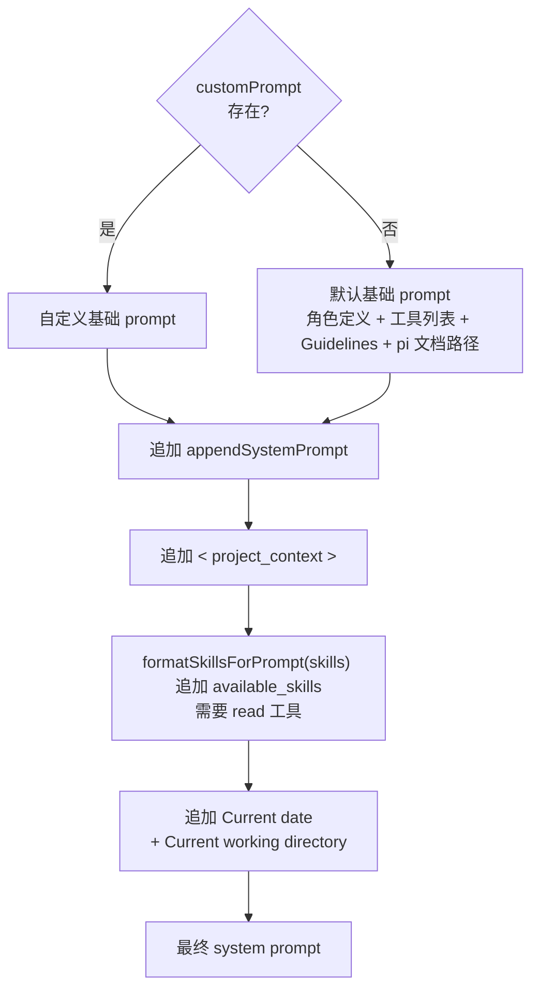

### System Prompt 装配流程 `core/system-prompt.ts`

在 pi 里，system prompt 不是仓库中写死的一整段文本，而是一次会话启动时由 `buildSystemPrompt()` 动态拼接出来的字符串。

可以概括成两条主分支：

- 自定义分支：调用方提供 `customPrompt`，以它作为基础 prompt
- 默认分支：未提供 `customPrompt`，用内建默认 prompt 作为基础

不管是默认分支还是自定义分支，装配顺序都是固定的：

1. 生成基础 prompt
2. 追加一部分“环境信息”，包括：
   1. 追加调用方附加的补充段落 `appendSystemPrompt`
   2. 追加项目上下文文件 `contextFiles`
   3. 追加 skills 技能列表
   4. 追加日期和工作目录



#### 装配选项 `BuildSystemPromptOptions` 和装配入口 `buildSystemPrompt`

```ts
/** 构建系统提示的配置选项 */
export interface BuildSystemPromptOptions {
	/** 自定义系统提示（替换默认提示）。设置了此项则跳过默认的工具列表和指南生成。 */
	customPrompt?: string;
	/** 要包含的工具列表。默认: [read, bash, edit, write] */
	selectedTools?: string[];
	/** 工具的单行描述片段，按工具名索引。只有在此处有条目的工具才会出现在 "Available tools" 中。 */
	toolSnippets?: Record<string, string>;
	/** 追加到默认系统提示指南中的额外准则条目。 */
	promptGuidelines?: string[];
	/** 追加到系统提示末尾的附加文本。 */
	appendSystemPrompt?: string;
	/** 当前工作目录。 */
	cwd: string;
	/** 预加载的项目上下文文件列表（如 AGENTS.md 等）。 */
	contextFiles?: Array<{ path: string; content: string }>;
	/** 预加载的技能列表。 */
	skills?: Skill[];
}
```

```ts
export function buildSystemPrompt(options: BuildSystemPromptOptions): string {
    // 先把调用方传入的构建参数解构出来，后续按“基础 prompt / 上下文 / 技能 / 运行时信息”分阶段组装。
	const {
		customPrompt,
		selectedTools,
		toolSnippets,
		promptGuidelines,
		appendSystemPrompt,
		cwd,
		contextFiles: providedContextFiles,
		skills: providedSkills,
	} = options;

	// cwd 在 prompt 末尾会作为环境信息注入；统一转成正斜杠，避免 Windows 反斜杠被模型误读成转义符。
	const resolvedCwd = cwd;
	const promptCwd = resolvedCwd.replace(/\\/g, "/");

	// 生成 YYYY-MM-DD 格式的当天日期，作为稳定且易读的运行时上下文注入到 system prompt 末尾。
	const now = new Date();
	const year = now.getFullYear();
	const month = String(now.getMonth() + 1).padStart(2, "0");
	const day = String(now.getDate()).padStart(2, "0");
	const date = `${year}-${month}-${day}`;

	// 规范可选补充段落 appendSystemPrompt；有值时前面补两个换行，便于和前一段正文自然分隔。
	const appendSection = appendSystemPrompt ? `\n\n${appendSystemPrompt}` : "";

	// 调用方可能不传上下文文件或技能列表，这里统一兜底为空数组，简化后续拼接分支判断。
	const contextFiles = providedContextFiles ?? [];
	const skills = providedSkills ?? [];
    
    ...
}
```

`buildSystemPrompt()` 本身仍然不做任何 I/O，它只消费上游 `ResourceLoader.reload()` 已经准备好的 `contextFiles` 和 `skills`，是**纯粹的字符串拼接器**。

也就是说：

- 文件发现
- settings 读取
- skill 扫描
- 上下文文件装载

都发生在 `buildSystemPrompt()` 之前。

这意味着：

- 会话运行中修改 `AGENTS.md`
- 或者中途新增一个上下文文件

通常不会自动反映到当前已构建好的 system prompt 中，除非上游资源重新加载并重新构建 prompt。

这仍然延续了 pi 的一个核心取舍：

- **不在 prompt 构建时做 I/O**
- **用上游 reload 机制承担发现和刷新责任**

#### 自定义 Prompt 分支

如果调用方传入了 `customPrompt`，`buildSystemPrompt()` 会直接以它作为基础 prompt。

```ts
if (customPrompt) {
    let prompt = customPrompt;

    // 1、先拼接调用方附加的补充段落。
    if (appendSection) {
        prompt += appendSection;
    }
    
	// 2、追加项目上下文文件
    if (contextFiles.length > 0) {
        prompt += "\n\n<project_context>\n\n";
        prompt += "Project-specific instructions and guidelines:\n\n";
        for (const { path: filePath, content } of contextFiles) {
            prompt += `<project_instructions path="${filePath}">\n${content}\n</project_instructions>\n\n`;
        }
        prompt += "</project_context>\n";
    }

    // 3、追加技能列表
    // - 如果 selectedTools 没传，说明没有自定义限制工具列表。这时默认认为 read 是可用的。
    // - 如果传了工具列表，就检查里面是否包含 "read"。
    const customPromptHasRead = !selectedTools || selectedTools.includes("read");
    if (customPromptHasRead && skills.length > 0) {
        prompt += formatSkillsForPrompt(skills);
    }

    // 4、最后统一追加运行时上下文，保证模型知道当前日期和 cwd。
    prompt += `\nCurrent date: ${date}`;
    prompt += `\nCurrent working directory: ${promptCwd}`;

    return prompt;
}
```

1、无论默认分支还是自定义分支，项目上下文文件 contextFiles 都采用同一套 XML 包装。

2、skills 采用**“只注入元数据，不内联完整内容”**的延迟加载设计，**真正需要时再用 `read` 去加载 skill 内容，这也是为什么需要先判断工具列表是否有 read**。

`formatSkillsForPrompt()` 会先过滤：

```ts
const visibleSkills = skills.filter((s) => !s.disableModelInvocation);
```

也就是说：

- `disableModelInvocation = true` 的 skill 不会出现在 system prompt 里
- 这类 skill 只能通过显式命令或其他手动路径使用

之后函数会输出一个 XML 结构的 skills 列表，告诉模型：

- 有哪些 skill
- 每个 skill 的名字
- 描述
- 文件位置

而不会把 `SKILL.md` 全文直接塞进 system prompt。

#### 默认 Prompt 分支

如果没有 `customPrompt`，pi 会构建内建默认 prompt。

默认分支包含四大块内容：

- 角色定义

- 可见工具列表

- 动态生成的 Guidelines，顺序是：

  1. 文件探索工具相关 guideline
  2. 外部追加的 guideline
  3. 通用 guideline

- pi 文档和示例路径、使用提示

  * `docs/...` 和 `examples/...` 路径应该如何解析

  * 用户问到哪些主题时应该去看哪些文档

  * 只要是在做 pi 相关任务，实施前就应该先读 docs 和 examples

  * 读 pi 的 markdown 文档时，不要只看搜索片段或某几行，要完整读完，还要跟进相关链接

```ts
	// 默认提示模式：构建包含角色定义、工具列表和使用指南的完整提示。
	// 步骤 1：先解析 pi 文档/示例的绝对路径，供默认提示引用。
	const readmePath = getReadmePath();
	const docsPath = getDocsPath();
	const examplesPath = getExamplesPath();

	// 步骤 2：根据 selectedTools 和 toolSnippets 计算真正可见的工具列表。
	const tools = selectedTools || ["read", "bash", "edit", "write"];
	const visibleTools = tools.filter((name) => !!toolSnippets?.[name]); // 只保留那些在 toolSnippets 里能找到非空说明的工具
	const toolsList = visibleTools.length > 0 ? visibleTools.map((name) => `- ${name}: ${toolSnippets![name]}`).join("\n") : "(none)";

	// 步骤 3：根据工具组合生成指南，并用 Set 去重，避免提示词重复。
	const guidelinesList: string[] = [];
	const guidelinesSet = new Set<string>();
	const addGuideline = (guideline: string): void => {
		if (guidelinesSet.has(guideline)) {
			return;
		}
		guidelinesSet.add(guideline);
		guidelinesList.push(guideline);
	};

	const hasBash = tools.includes("bash");
	const hasGrep = tools.includes("grep");
	const hasFind = tools.includes("find");
	const hasLs = tools.includes("ls");
	const hasRead = tools.includes("read");

	// 根据文件探索工具的组合情况，添加相应的使用指南
	if (hasBash && !hasGrep && !hasFind && !hasLs) {
		addGuideline("Use bash for file operations like ls, rg, find");
	} else if (hasBash && (hasGrep || hasFind || hasLs)) {
		addGuideline("Prefer grep/find/ls tools over bash for file exploration (faster, respects .gitignore)");
	}

	for (const guideline of promptGuidelines ?? []) {
		const normalized = guideline.trim();
		if (normalized.length > 0) {
			addGuideline(normalized);
		}
	}

	// 步骤 4：追加无论工具组合如何都应该存在的通用准则。
	addGuideline("Be concise in your responses");
	addGuideline("Show file paths clearly when working with files");

	const guidelines = guidelinesList.map((g) => `- ${g}`).join("\n");

	let prompt = `You are an expert coding assistant operating inside pi, a coding agent harness. You help users by reading files, executing commands, editing code, and writing new files.

Available tools:
${toolsList}

In addition to the tools above, you may have access to other custom tools depending on the project.

Guidelines:
${guidelines}

Pi documentation (read only when the user asks about pi itself, its SDK, extensions, themes, skills, or TUI):
- Main documentation: ${readmePath}
- Additional docs: ${docsPath}
- Examples: ${examplesPath} (extensions, custom tools, SDK)
- When reading pi docs or examples, resolve docs/... under Additional docs and examples/... under Examples, not the current working directory
- When asked about: extensions (docs/extensions.md, examples/extensions/), themes (docs/themes.md), skills (docs/skills.md), prompt templates (docs/prompt-templates.md), TUI components (docs/tui.md), keybindings (docs/keybindings.md), SDK integrations (docs/sdk.md), custom providers (docs/custom-provider.md), adding models (docs/models.md), pi packages (docs/packages.md)
- When working on pi topics, read the docs and examples, and follow .md cross-references before implementing
- Always read pi .md files completely and follow links to related docs (e.g., tui.md for TUI API details)`; 

	... // 后续追加与自定义分支类似

	return prompt;
}
```

