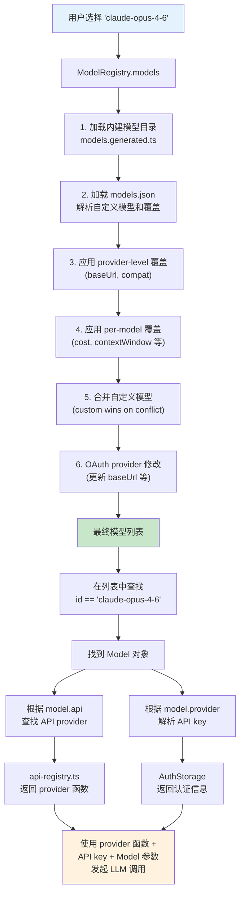

### `auth-storage.ts`

负责：

- 存储和读取认证来源
- 解决多来源优先级
- 暴露只读认证状态

### `model-registry.ts`

负责：

- 维护 provider / model 注册表
- 根据模型能力和 provider 配置决定能不能用
- 调用 `authStorage` 解析请求认证

一句话概括：

```text
auth-storage.ts
  = “key 在哪里、谁优先、怎么安全地读写”

model-registry.ts
  = “拿到 key 之后，这个 provider/model 能不能真正发请求”
```

```text
auth-storage.ts
    ↓ 提供认证状态 / API key
model-registry.ts
    ↓ 提供“可用模型集合” / 请求认证解析
model-resolver.ts
    ↓ 把用户输入的 pattern 解析成具体 Model
agent-session / main
    ↓ 用解析出的模型发请求
```

# 认证凭据读写与解析中心 `core/auth-storage.ts`

**负责统一管理 provider 的认证来源，支持（按优先级）：**

- **运行时覆盖：CLI --api-key**
- **磁盘凭据： auth.json**
- **环境变量：process.env**
- **fallback resolver（例如来自 models.json 的自定义 provider 配置）**


**核心出口：**

* **向 `model-registry.ts`、登录流程、模型列表提供“是否已配置”的只读状态**

  - **hasAuth(provider)**

  - **getAuthStatus(provider)**

- **getApiKey(provider, options)**

**调用链路：**

* `main.ts` / 运行时创建 → `AuthStorage.create()` → 注入 `AgentSessionServices`
* `agent-session-services.ts` → `ModelRegistry.create(authStorage, ...)`
* `model-registry.ts` → `authStorage.hasAuth()` / `getAuthStatus()` / `getApiKey()`
* `/login`、`/logout` 等认证流程 → `authStorage.set()` / `remove()` / `logout()`
* CLI `--api-key` → `authStorage.setRuntimeApiKey()` → `getApiKey()` 优先读取运行时覆盖

```ts
├── 基础类型层
│   ├── ApiKeyCredential       单个 API key 凭证
│   ├── AuthCredential         凭证联合类型
│   ├── AuthStorageData        provider -> credential 映射
│   ├── AuthStatus             认证状态的只读描述
│   └── LockResult<T>          加锁读写的标准返回结构
│
├── 存储后端接口层 ★ 先读这里
│   └── AuthStorageBackend
│       ├── withLock()         同步加锁读写
│       └── withLockAsync()    异步加锁读写
│
├── 后端实现层
│   ├── FileAuthStorageBackend     基于 auth.json + proper-lockfile
│   └── InMemoryAuthStorageBackend 基于内存，用于测试
│
└── AuthStorage 类 ~ 主实现 ★ 核心逻辑
    ├── 静态工厂                 create()/fromStorage()/inMemory()
    ├── 运行时覆盖               setRuntimeApiKey()/removeRuntimeApiKey()
    ├── 回退解析器               setFallbackResolver()
    ├── 持久化与重载             reload()/persistProviderChange()
    ├── 基础 CRUD               get()/set()/remove()/list()/has()
    ├── 只读认证状态             hasAuth()/getAuthStatus()/getAll()/drainErrors()
    └── 最终密钥解析             getApiKey()
```

## 一、导出类型

### `ApiKeyCredential`

```ts
export type ApiKeyCredential = {
	type: "api_key";
	key: string;
};
```

作用：

- 表示一个 provider 的 API key 凭证
- 目前系统只支持这一种认证形态

注意：

- `key` 不一定是明文 key
- 它也可能是配置引用值，真正使用时会经过 `resolveConfigValue()`

### `AuthCredential`

```ts
export type AuthCredential = ApiKeyCredential;
```

作用：

- 为未来扩展其他认证类型预留联合类型入口
- 当前等价于 `ApiKeyCredential`

### `AuthStorageData`

```ts
export type AuthStorageData = Record<string, AuthCredential>;
```

作用：

- 表示 `auth.json` 的内存结构
- key 是 provider 名称，value 是对应凭证

可以理解为：

```ts
{
  anthropic: { type: "api_key", key: "..." },
  openai: { type: "api_key", key: "..." }
}
```

### `AuthStatus`

```ts
export type AuthStatus = {
	configured: boolean; // 是否已配置认证
	source?: "stored" | "runtime" | "environment" | "fallback" | "models_json_key" | "models_json_command"; // 认证来源
	label?: string; // 来源标签（如环境变量名、"--api-key" 等）
};
```

作用：

- 提供“认证是否存在、来自哪里”的只读描述
- 用于在不暴露密钥值的情况下报告认证配置情况

主要给这些场景使用：

- 模型列表展示
- 登录状态展示
- 诊断信息生成

### `LockResult<T>`

```ts
type LockResult<T> = {
	result: T;
	next?: string;
};
```

作用：统一后端加锁回调的返回结构

语义：

- `result`：本次操作返回给调用方的结果
- `next`：如果需要写回文件或内存，写入的新内容；没有则不更新

---

## 二、存储后端接口

### `AuthStorageBackend`

```ts
export interface AuthStorageBackend {
	withLock<T>(fn: (current: string | undefined) => LockResult<T>): T;
	withLockAsync<T>(fn: (current: string | undefined) => Promise<LockResult<T>>): Promise<T>;
}
```

```ts
withLock(fn)
  -> 加锁
  -> 读取当前内容 current
  -> 执行 fn(current)
  -> 如果 fn 返回了 next，就写回 next
  -> 解锁
  -> 返回 result
  
withLockAsync(fn)
  -> 异步加锁
  -> 读取 current
  -> await fn(current)
  -> 如果返回 next，就写回 next
  -> 解锁
  -> 返回 Promise<result>
```

这是整个文件最重要的抽象之一。

它解决的问题是：

- `AuthStorage` 不直接依赖“文件”
- 它只依赖“一个支持加锁读写的存储后端”

这样上层逻辑就能复用：

- 生产环境：文件后端
- 测试环境：内存后端

你可以把它理解成：

```text
AuthStorage
  不关心凭据到底存在哪
  只关心：
    1、给我当前内容
    2、保证这段读改写是原子的
```

---

## 三、文件后端 `FileAuthStorageBackend`

### 类定位

`FileAuthStorageBackend` 是 `AuthStorageBackend` 的默认实现。

它负责：

- 保证 `auth.json` 父目录存在
- 保证 `auth.json` 文件存在
- 通过 `proper-lockfile` 做文件锁
- 在锁内读取当前内容
- 在需要时写回新内容
- 控制目录和文件权限

### 字段

```ts
private authPath: string;
```

作用：

- 保存认证文件路径
- 默认路径是 `~/.pi/agent/auth.json`

### 构造函数

```ts
constructor(authPath: string = join(getAgentDir(), "auth.json"))
```

步骤：

```ts
new FileAuthStorageBackend(authPath?)
  -> 如果没传 authPath，默认 join(getAgentDir(), "auth.json")
  -> normalizePath(authPath)
  -> 保存到 this.authPath
```

### `ensureParentDir()`

作用：确保 `auth.json` 的父目录存在

步骤：

```ts
ensureParentDir()
  -> dirname(authPath)
  -> 如果目录不存在
       -> mkdirSync(dir, { recursive: true, mode: 0o700 })
```

这里目录权限设成 `0o700`，表示只有所有者可访问。

### `ensureFileExists()`

作用：确保 `auth.json` 存在

步骤：

```ts
ensureFileExists()
  -> 如果 authPath 不存在
       -> writeFileSync(authPath, "{}")
       -> chmodSync(authPath, 0o600)
```

文件权限 `0o600` 表示只有所有者可读写。

### `acquireLockSyncWithRetry(path)`

作用：

- 获取同步文件锁
- 如果锁被占用，做有限次重试

步骤：

```ts
acquireLockSyncWithRetry(path)
  -> 最多尝试 10 次
  -> 每次调用 lockfile.lockSync(path, { realpath: false })
  -> 如果报错 code !== "ELOCKED"
       -> 直接抛出
  -> 如果是 ELOCKED 且还没到最大次数
       -> 同步等待 20ms
       -> 重试
  -> 成功时返回 release() 函数
```

这个函数的意义是：

- 保持同步 API 不变
- 同时对短暂锁冲突有一定容忍度

### `withLock(fn)`

作用：提供同步的“锁内读改写”

主链路：

```ts
withLock(fn)
  -> 1、ensureParentDir()
  -> 2、ensureFileExists()
  -> 3、acquireLockSyncWithRetry(authPath)
  -> 4、readFileSync(authPath) 读取 current
  -> 5、执行 fn(current)
       -> 得到 { result, next }
  -> 6、如果 next !== undefined
       -> writeFileSync(authPath, next)
       -> chmodSync(authPath, 0o600)
  -> 7、finally 释放锁
  -> 8、返回 result
```

### `withLockAsync(fn)`

作用：提供异步的“锁内读改写”

相比同步版本，多了两层保护：

- proper-lockfile 的异步重试策略
- `onCompromised` 处理锁失效

主链路：

```ts
withLockAsync(fn)
  -> 1、ensureParentDir()
  -> 2、ensureFileExists()
  -> 3、await lockfile.lock(authPath, { retries, stale, onCompromised })
  -> 4、检查锁是否 compromised
  -> 5、readFileSync(authPath) 读取 current
  -> 6、await fn(current)
       -> 得到 { result, next }
  -> 7、再次检查锁是否 compromised
  -> 8、如果 next !== undefined
       -> writeFileSync(authPath, next)
       -> chmodSync(authPath, 0o600)
  -> 9、再次检查锁是否 compromised
  -> 10、返回 result
  -> 11、finally release()
```

---

## 四、内存后端 `InMemoryAuthStorageBackend`

### 类定位

这是测试用后端。

它的特点是：

- 不做文件持久化
- 不做真正的进程间锁
- 所有内容都放在内存字段里

### 字段

```ts
private value: string | undefined;
```

### `withLock(fn)` / `withLockAsync(fn)`

它们的逻辑非常简单：

```ts
withLock(fn)
  -> 调用 fn(this.value)
  -> 如果 next !== undefined
       -> this.value = next
  -> 返回 result

withLockAsync(fn)
  -> await fn(this.value)
  -> 如果 next !== undefined
       -> this.value = next
  -> 返回 result
```

这说明：

- `AuthStorage` 的核心逻辑完全建立在 `AuthStorageBackend` 抽象之上
- 一旦换成内存后端，其他上层方法基本不用改

---

## 五、`AuthStorage` 主类

`AuthStorage` 是整个文件的真正核心对象。

它负责四件事：

- 维护凭据的内存快照
- 维护运行时覆盖和回退解析器
- 对外提供 CRUD 和状态查询接口
- 统一解析最终 API key

### 字段全景

```ts
private data: AuthStorageData = {};
private runtimeOverrides: Map<string, string> = new Map();
private fallbackResolver?: (provider: string) => string | undefined;
private loadError: Error | null = null;
private errors: Error[] = [];
private storage: AuthStorageBackend;
```

它们可以分成三组：

#### 1. 当前凭据快照

- `data`：从后端加载出来的持久化凭据

#### 2. 非持久化运行时状态

- `runtimeOverrides`：运行时 API key 覆盖，例如 CLI `--api-key`
- `fallbackResolver`：自定义回退来源，例如 `models.json` 里的 provider 配置

#### 3. 错误与底层后端

- `loadError`：初始化或 reload 时的加载错误
- `errors`：累积的运行时错误
- `storage`：当前使用的存储后端

### 私有构造函数

```ts
private constructor(storage: AuthStorageBackend) {
	this.storage = storage;
	this.reload();
}
```

这里的关键点是：

- 构造函数不暴露给外部
- 强制调用方使用静态工厂
- 创建实例后立刻 `reload()`，先拉一份当前快照

### 静态工厂

#### `AuthStorage.create(authPath?)`

作用：创建默认的文件版认证存储

步骤：

```ts
AuthStorage.create(authPath?)
  -> new FileAuthStorageBackend(authPath ?? join(getAgentDir(), "auth.json"))
  -> new AuthStorage(storage)
```

#### `AuthStorage.fromStorage(storage)`

作用：

- 从任意后端创建 `AuthStorage`
- 是可插拔后端设计的总入口

#### `AuthStorage.inMemory(data = {})`

作用：创建测试用内存实例

步骤：

```ts
AuthStorage.inMemory(data)
  -> new InMemoryAuthStorageBackend()
  -> 先用 withLock() 把 data 序列化写入后端
  -> AuthStorage.fromStorage(storage)
```

---

### 运行时覆盖与回退来源

#### `setRuntimeApiKey(provider, apiKey)`

作用：

- 设置某个 provider 的运行时覆盖 key
- 不会写入磁盘

典型场景：CLI `--api-key`

#### `removeRuntimeApiKey(provider)`

作用：移除运行时覆盖

#### `setFallbackResolver(resolver)`

作用：

- 设置一个回退解析器
- 当前面的来源都找不到 key 时，再调用它

典型场景：自定义 provider 配置写在 `models.json`

---

### 重载、落盘与错误记录

#### `recordError(error)`

作用：

- 把任意异常规整成 `Error`
- 存入 `errors[]`

#### `parseStorageData(content)`

作用：把后端字符串内容解析成 `AuthStorageData`

步骤：

```ts
parseStorageData(content)
  -> 如果 content 为空
       -> 返回 {}
  -> 否则 JSON.parse(content)
```

#### `reload()`

这是 `AuthStorage` 的初始化和显式刷新入口。

主链路：

```ts
reload()
  -> 1、调用 storage.withLock(current => ...)
       -> 在锁内读取 current
  -> 2、parseStorageData(content)
  -> 3、刷新 this.data
  -> 4、loadError = null
  -> 5、如果异常
       -> loadError = error
       -> recordError(error)
```

这里的设计重点是：

- 即使只是读，也在锁内完成
- 避免在其他进程写入期间读到中间态

#### `persistProviderChange(provider, credential)`

这是 `set()` 和 `remove()` 共用的落盘逻辑。

主链路：

```ts
persistProviderChange(provider, credential)
  -> 1、如果 loadError 存在
       -> 直接 return

  -> 2、storage.withLock(current => ...)
       -> parseStorageData(current)
       -> 基于磁盘最新内容合并 merged
       -> credential 存在    -> merged[provider] = credential
       -> credential 不存在  -> delete merged[provider]
       -> 返回 next = JSON.stringify(merged, null, 2)

  -> 3、如果异常
       -> recordError(error)
```

这里有一个很重要的细节：

- 不是直接把 `this.data` 全量写回去
- 而是先读磁盘最新内容，再只合并一个 provider 的变更

这样可以减少并发覆盖别的 provider 修改的风险。

---

### 基础 CRUD

#### `get(provider)`

作用：读取内存快照中的某个 provider 凭证

#### `set(provider, credential)`

作用：

- 更新内存中的 `data`
- 再调用 `persistProviderChange()` 落盘

步骤：

```ts
set(provider, credential)
  -> this.data[provider] = credential
  -> persistProviderChange(provider, credential)
```

#### `remove(provider)`

作用：

- 从内存删除 provider 凭证
- 再调用 `persistProviderChange()` 落盘删除

#### `list()`

作用：返回所有已存储凭证的 provider 名称

#### `has(provider)`

作用：只检查持久化快照 `data` 里是否存在 provider

注意它和 `hasAuth()` 不一样：

- `has()` 只看 `auth.json` 快照
- `hasAuth()` 看所有来源

#### `logout(provider)`

作用：本质就是 `remove(provider)` 的语义化别名

---

### 只读认证状态接口

#### `hasAuth(provider)`

这是“快速判断某个 provider 有没有任何认证来源”的接口。

主链路：

```ts
hasAuth(provider)
  -> 1、runtimeOverrides.has(provider) ?
  -> 2、data[provider] ?
  -> 3、getEnvApiKey(provider) ?
  -> 4、fallbackResolver?.(provider) ?
  -> 都没有则 false
```

特点：

- 不返回真实 key
- 只做布尔判断
- 被 `model-registry.ts` 用来做快速过滤

#### `getAuthStatus(provider)`

这是面向展示层的状态接口。

主链路：

```ts
getAuthStatus(provider)
  -> 1、如果 data[provider] 存在
       -> { configured: true, source: "stored" }

  -> 2、如果 runtimeOverrides.has(provider)
       -> { configured: false, source: "runtime", label: "--api-key" }

  -> 3、findEnvKeys(provider)
       -> 命中环境变量
       -> { configured: false, source: "environment", label: ENV_NAME }

  -> 4、fallbackResolver(provider) 命中
       -> { configured: false, source: "fallback", label: "custom provider config" }

  -> 5、否则
       -> { configured: false }
```

这里有一个值得注意的点：

- 只有 `stored` 会返回 `configured: true`
- 运行时覆盖、环境变量、fallback 虽然可用，但这里依然返回 `configured: false`

原因可以理解为：

- `configured` 更偏“是否持久化配置在本地”
- 而不是“这一次运行时是否能拿到 key”

#### `getAll()`

作用：返回当前 `data` 的浅拷贝

#### `drainErrors()`

作用：取出并清空累计错误

步骤：

```ts
drainErrors()
  -> 复制 errors
  -> 清空 this.errors
  -> 返回复制结果
```

---

### 最终密钥解析 `getApiKey()`

这是整个文件最关键的业务函数。

它是“最终到底拿哪个 API key 去请求 provider”的统一出口。

函数签名：

```ts
async getApiKey(providerId: string, options?: { includeFallback?: boolean }): Promise<string | undefined>
```

主链路：

```ts
getApiKey(providerId, options)
  -> 1、先查 runtimeOverrides
       -> 有就直接返回

  -> 2、再查 data[providerId]
       -> 如果是 api_key
          -> resolveConfigValue(cred.key)
          -> 返回解析后的值

  -> 3、再查环境变量
       -> getEnvApiKey(providerId)

  -> 4、如果 includeFallback !== false
       -> fallbackResolver?.(providerId)

  -> 5、都没有
       -> 返回 undefined
```

#### 优先级总结

`getApiKey()` 的优先级是固定的：

1. 运行时覆盖 CLI --api-key
2. `auth.json` 中的存储值
3. 环境变量 process.env
4. 回退解析器 models.json / custom fallback

#### 为什么存储值还要走 `resolveConfigValue()`

因为 `auth.json` 里的 `key` 可能不是最终明文，而是引用形式，例如：

- 环境变量引用
- 命令输出引用

所以：

- `set()` 时先原样保存
- `getApiKey()` 时再统一解析

这让存储格式更灵活。

# 模型注册表 `core/model-registry.ts`

负责**加载所有可用模型：pi-ai 内置模型和 models.json 自定义配置模型，处理模型覆盖（override）合并**；以及**通过 AuthStorage 解析 API key 和请求头**。

提供：

* ModelRegistry 类：模型的注册、查询、刷新，以及请求认证信息的解析
* ProviderConfigInput 接口：扩展注册 provider 的输入格式
* 自定义模型/覆盖的 JSON Schema 定义（通过 typebox 编译校验）
* models.json 配置文件的加载、校验、解析流程

调用链路：

* 被 agent 启动时创建，加载内置 + 自定义模型
* 被 model-resolver.ts 调用，查询可用模型列表、查找特定模型
* 被扩展（extensions）通过 registerProvider() 动态注册 provider 和模型
* 调用 resolve-config-value.ts 解析 apiKey / headers 中的环境变量和 shell 命令
* 调用 auth-storage.ts 查询已存储的认证状态

## 选模型 = 模型名 + api + provider + 参数

```typescript
// packages/ai/src/types.ts
interface Model<TApi extends Api> {
  id: string;            // "claude-opus-4-6"
  name: string;          // "Claude Opus 4.6"
  api: TApi;             // "anthropic-messages"
  provider: Provider;    // "anthropic"
  baseUrl?: string;      // API endpoint
  cost: { input; output; cacheRead; cacheWrite };
  contextWindow: number; // 200000
  maxTokens: number;     // 32768
  input: ("text" | "image" | "audio")[];
  reasoning: boolean;    // true
}
```

这些参数来自三个来源：

1. **内建模型目录**：pi 内置了一个由 `generate-models.ts` 脚本自动生成的 `models.generated.ts` 文件，列出了所有已知模型的参数（见 [pi-ai 模型信息生成层](../../pi-ai/pi-ai.md#模型信息生成层)）
2. **`models.json` 自定义**：用户可以在全局配置中添加、覆盖模型定义
3. **Extension 动态注册**：Extension 可以注册新的 API provider（调用 pi-ai 中 `registerApiProvider`），进而带来新的 Model

## models.json 覆盖机制

用户可以在 `~/.pi/agent/models.json` 中自定义模型。这个文件遵循严格的 JSON Schema：

```typescript
// file: packages/coding-agent/src/core/model-registry.ts:90-109
const ModelDefinitionSchema = Type.Object({
  id: Type.String({ minLength: 1 }),
  name: Type.Optional(Type.String({ minLength: 1 })),
  api: Type.Optional(Type.String({ minLength: 1 })),
  baseUrl: Type.Optional(Type.String({ minLength: 1 })),
  reasoning: Type.Optional(Type.Boolean()),
  input: Type.Optional(Type.Array(
    Type.Union([Type.Literal("text"), Type.Literal("image")])
  )),
  cost: Type.Optional(Type.Object({
    input: Type.Number(),
    output: Type.Number(),
    cacheRead: Type.Number(),
    cacheWrite: Type.Number(),
  })),
  contextWindow: Type.Optional(Type.Number()),
  maxTokens: Type.Optional(Type.Number()),
  headers: Type.Optional(Type.Record(Type.String(), Type.String())),
  compat: Type.Optional(OpenAICompatSchema),
});
```

注意 schema 的设计：除了 `id`，所有字段都是 **optional**。这意味着用户定义一个本地模型时，只需提供最少的信息：

```json
{
  "providers": {
    "my-local-llm": {
      "baseUrl": "http://localhost:11434/v1",
      "api": "openai-completions",
      "models": [
        { "id": "llama-3.3-70b" }
      ]
    }
  }
}
```

未指定的字段会使用合理的默认值。这降低了添加本地模型（Ollama、LM Studio 等）的门槛。

### 覆盖内建模型

`models.json` 不仅能添加新模型，还能覆盖内建模型的参数。通过 `modelOverrides` 字段：

```typescript
// file: packages/coding-agent/src/core/model-registry.ts:112-128
const ModelOverrideSchema = Type.Object({
  name: Type.Optional(Type.String({ minLength: 1 })),
  reasoning: Type.Optional(Type.Boolean()),
  input: Type.Optional(Type.Array(...)),
  cost: Type.Optional(Type.Object({
    input: Type.Optional(Type.Number()),
    output: Type.Optional(Type.Number()),
    cacheRead: Type.Optional(Type.Number()),
    cacheWrite: Type.Optional(Type.Number()),
  })),
  contextWindow: Type.Optional(Type.Number()),
  maxTokens: Type.Optional(Type.Number()),
  headers: Type.Optional(Type.Record(Type.String(), Type.String())),
  compat: Type.Optional(OpenAICompatSchema),
});
```

Override 的 cost 字段内部也是 optional — 你可以只覆盖 `input` 定价而保留其他定价不变。这是通过 deep merge 实现的：

```typescript
// file: packages/coding-agent/src/core/model-registry.ts:223-247
function applyModelOverride(model: Model<Api>,
                            override: ModelOverride): Model<Api> {
  const result = { ...model };
  if (override.name !== undefined) result.name = override.name;
  if (override.reasoning !== undefined)
    result.reasoning = override.reasoning;
  // ... 简单字段覆盖 ...

  // Deep merge cost（partial override）
  if (override.cost) {
    result.cost = {
      input: override.cost.input ?? model.cost.input,
      output: override.cost.output ?? model.cost.output,
      cacheRead: override.cost.cacheRead ?? model.cost.cacheRead,
      cacheWrite: override.cost.cacheWrite ?? model.cost.cacheWrite,
    };
  }

  // Deep merge compat
  result.compat = mergeCompat(model.compat, override.compat);
  return result;
}
```

## ModelRegistry 类

`ModelRegistry` 是管理模型的中心：

```typescript
/**
 * 模型注册表——加载和管理模型，通过 AuthStorage 解析 API key。
 *
 * 主要职责：
 * 1. 加载 pi-ai 内置模型，应用 models.json 中的 provider/model 级覆盖
 * 2. 加载 models.json 中定义的自定义模型
 * 3. 支持扩展（extensions）动态注册/注销 provider
 * 4. 解析每个模型的 API key 和请求头（支持环境变量和 shell 命令）
 */
export class ModelRegistry {
	private models: Model<Api>[] = [];
	private providerRequestConfigs: Map<string, ProviderRequestConfig> = new Map();
	private modelRequestHeaders: Map<string, Record<string, string>> = new Map();
	/** 已通过扩展注册的 provider 配置（用于 refresh 时重建） */
	private registeredProviders: Map<string, ProviderConfigInput> = new Map();
	private loadError: string | undefined = undefined;
	readonly authStorage: AuthStorage;
	/** models.json 文件路径，undefined 表示纯内存模式（不加载文件） */
	private modelsJsonPath: string | undefined;

	private constructor(authStorage: AuthStorage, modelsJsonPath: string | undefined) {
		this.authStorage = authStorage;
		this.modelsJsonPath = modelsJsonPath ? normalizePath(modelsJsonPath) : undefined;
		this.loadModels();
	}

	/** 创建 ModelRegistry 实例，加载 models.json 文件 */
	static create(authStorage: AuthStorage, modelsJsonPath: string = join(getAgentDir(), "models.json")): ModelRegistry {
		return new ModelRegistry(authStorage, modelsJsonPath);
	}
```

注意构造函数是 private — 只能通过 `create` 或 `inMemory` 工厂方法创建。`inMemory` 版本用于测试，不读取任何磁盘文件。

## 模型解析的完整流程

当用户在 pi 中选择 "claude-opus-4-6" 时，系统经历了以下步骤：



让我们跟踪代码来验证这个流程：

### 步骤 1-6：加载模型

```typescript
// file: packages/coding-agent/src/core/model-registry.ts:303-329
private loadModels(): void {
  // 从 models.json 加载自定义模型和覆盖
  const { models: customModels, overrides, modelOverrides, error }
    = this.modelsJsonPath
      ? this.loadCustomModels(this.modelsJsonPath)
      : emptyCustomModelsResult();

  // 加载内建模型并应用覆盖
  const builtInModels = this.loadBuiltInModels(overrides,
                                                modelOverrides);
  // 合并自定义模型（自定义优先）
  let combined = this.mergeCustomModels(builtInModels, customModels);

  // 让 OAuth providers 修改模型（如更新 baseUrl）
  for (const oauthProvider
        of this.authStorage.getOAuthProviders()) {
    const cred = this.authStorage.get(oauthProvider.id);
    if (cred?.type === "oauth" && oauthProvider.modifyModels) {
      combined = oauthProvider.modifyModels(combined, cred);
    }
  }
  this.models = combined;
}
```

### 内建模型的加载与覆盖

```typescript
// file: packages/coding-agent/src/core/model-registry.ts:332-362
private loadBuiltInModels(
  overrides: Map<string, ProviderOverride>,
  modelOverrides: Map<string, Map<string, ModelOverride>>,
): Model<Api>[] {
  return getProviders().flatMap((provider) => {
    const models = getModels(provider as KnownProvider);
    const providerOverride = overrides.get(provider);
    const perModelOverrides = modelOverrides.get(provider);

    return models.map((m) => {
      let model = m;
      // Provider-level 覆盖 (baseUrl, compat)
      if (providerOverride) {
        model = { ...model,
          baseUrl: providerOverride.baseUrl ?? model.baseUrl,
          compat: mergeCompat(model.compat, providerOverride.compat),
        };
      }
      // Per-model 覆盖
      const modelOverride = perModelOverrides?.get(m.id);
      if (modelOverride) {
        model = applyModelOverride(model, modelOverride);
      }
      return model;
    });
  });
}
```

这段代码揭示了覆盖的两个层次：

**Provider-level 覆盖**：影响一个 provider 下的所有模型。比如你可以把 Anthropic 的 `baseUrl` 改成代理地址，所有 Anthropic 模型都会使用新地址。

**Per-model 覆盖**：只影响特定模型。比如你可以单独修改 `claude-opus-4-6` 的 `maxTokens` 而不影响其他 Anthropic 模型。

### 自定义模型的合并

```typescript
// file: packages/coding-agent/src/core/model-registry.ts:365-376
private mergeCustomModels(builtInModels: Model<Api>[],
                          customModels: Model<Api>[]): Model<Api>[] {
  const merged = [...builtInModels];
  for (const customModel of customModels) {
    const existingIndex = merged.findIndex(
      (m) => m.provider === customModel.provider
          && m.id === customModel.id
    );
    if (existingIndex >= 0) {
      merged[existingIndex] = customModel;  // 自定义覆盖内建
    } else {
      merged.push(customModel);  // 新增自定义模型
    }
  }
  return merged;
}
```

合并逻辑简洁明了：按 `provider + id` 匹配。如果自定义模型的 provider 和 id 与内建模型相同，完全替换；否则追加。

## models.json 的验证

`models.json` 的加载过程包含两层验证：

```typescript
// file: packages/coding-agent/src/core/model-registry.ts:378-429
private loadCustomModels(modelsJsonPath: string): CustomModelsResult {
  if (!existsSync(modelsJsonPath)) {
    return emptyCustomModelsResult();
  }
  try {
    const content = readFileSync(modelsJsonPath, "utf-8");
    const config: ModelsConfig = JSON.parse(content);

    // 第一层：JSON Schema 验证（字段类型、必填项）
    const validate = ajv.getSchema("ModelsConfig")!;
    if (!validate(config)) {
      const errors = validate.errors?.map(
        (e: any) => `  - ${e.instancePath}: ${e.message}`
      ).join("\n");
      return emptyCustomModelsResult(
        `Invalid models.json schema:\n${errors}`
      );
    }

    // 第二层：语义验证（baseUrl 是否必需等）
    this.validateConfig(config);
    // ...
  } catch (error) {
    if (error instanceof SyntaxError) {
      return emptyCustomModelsResult(
        `Failed to parse models.json: ${error.message}`
      );
    }
  }
}
```

两层验证的策略是：

1. **Schema 验证**（使用 Ajv）：检查 JSON 的结构 — 字段名是否正确、类型是否匹配、必填项是否存在。这能捕获大部分拼写错误和格式错误。

2. **语义验证**（`validateConfig`）：检查业务规则 — 比如 "定义了 custom models 就必须提供 baseUrl"。这是 Schema 无法表达的约束。

验证失败时的策略是**保留内建模型，放弃自定义模型**。这确保了即使 `models.json` 写错了，pi 仍然可以用内建模型正常工作。

## Extension 注册新 Provider 的能力

这是 Model Registry 最有趣的扩展点。当 extension 通过 `registerApiProvider` 注册一个新的 API provider 后，任何使用该 api 的 model 定义都会自动可用。

比如一个私有部署的 LLM 可以这样支持：

1. Extension 注册一个使用 `"openai-responses"` api 的自定义 provider（因为私有部署暴露 OpenAI 兼容接口）
2. 用户在 `models.json` 中添加模型定义，指定 `api: "openai-responses"` 和自定义 `baseUrl`
3. pi 自动用已注册的 provider 来调用这个模型

`ModelRegistry` 通过 `refresh` 方法支持这种动态注册：

```typescript
// file: packages/coding-agent/src/core/model-registry.ts:280-294
refresh(): void {
  this.providerRequestConfigs.clear();
  this.modelRequestHeaders.clear();
  this.loadError = undefined;

  // 重置 API provider 注册（确保 extension 的注册被重建）
  resetApiProviders();
  resetOAuthProviders();

  this.loadModels();

  // 重新应用已注册的 provider 配置
  for (const [providerName, config]
        of this.registeredProviders.entries()) {
    this.applyProviderConfig(providerName, config);
  }
}
```

`refresh` 调用 `resetApiProviders()` — 这会清除所有动态注册的 provider，然后重新加载模型。之后，extension 的 `registerApiProvider` 会在 extension 加载过程中被重新调用，恢复动态注册的 provider。

这个 "reset + reload" 的模式确保了 `refresh` 后的状态是一致的 — 不会有残留的旧注册。

## OpenAI 兼容性层 (compat)

`Model` 类型中有一个 `compat` 字段，它是 Model Registry 中最复杂的部分：

```typescript
// file: packages/coding-agent/src/core/model-registry.ts:50-80
const OpenAICompletionsCompatSchema = Type.Object({
  supportsStore: Type.Optional(Type.Boolean()),
  supportsDeveloperRole: Type.Optional(Type.Boolean()),
  supportsReasoningEffort: Type.Optional(Type.Boolean()),
  reasoningEffortMap: Type.Optional(ReasoningEffortMapSchema),
  maxTokensField: Type.Optional(Type.Union([
    Type.Literal("max_completion_tokens"),
    Type.Literal("max_tokens")
  ])),
  thinkingFormat: Type.Optional(Type.Union([
    Type.Literal("openai"), Type.Literal("openrouter"),
    Type.Literal("zai"), Type.Literal("qwen"),
    Type.Literal("qwen-chat-template"),
  ])),
  openRouterRouting: Type.Optional(OpenRouterRoutingSchema),
  // ... 更多字段
});
```

为什么需要这个 compat 层？因为 "OpenAI 兼容" 是一个光谱，不是一个二元属性。各种 provider（OpenRouter、Vercel AI Gateway、Ollama、LM Studio、vLLM）声称兼容 OpenAI API，但具体兼容到什么程度各不相同：

- 有的不支持 `developer` role（只支持 `system`）
- 有的用 `max_tokens` 而不是 `max_completion_tokens`
- 有的有自己的 reasoning/thinking 格式
- 有的不在 streaming 中返回 usage 信息

`compat` 字段把这些差异编码到模型定义中，让 provider 实现可以根据这些标志调整请求格式。这避免了为每个 "OpenAI 兼容" 的 provider 写一个单独的 provider 实现。

## 取舍分析

### 得到了什么

**动态性**。系统可以支持任何 LLM — 只要有人写了 provider 并定义了 model。内建目录覆盖主流模型，`models.json` 覆盖长尾需求。

**构建时确定性**。内建模型目录在构建时生成，运行时不依赖外部 API。这让 pi 在断网环境下也能正常列出模型（虽然调用模型仍然需要网络）。

**渐进式覆盖**。用户可以从最小配置开始（只写一个 `id`），逐步添加更多参数。override 机制支持 partial merge — 只覆盖需要改的字段。

### 放弃了什么

**运行时才知道模型是否可用**。用户在 `models.json` 中定义了一个模型，但如果对应的 provider 没有注册（extension 没加载或 API key 没配置），错误只在实际调用时才暴露。目前没有 "预检" 机制在启动时验证所有模型的可用性。

**compat 层的维护成本**。每当一个新的 "OpenAI 兼容" provider 出现，并且有新的不兼容点，就需要在 compat schema 中添加新的字段。这是一个持续增长的配置面。
